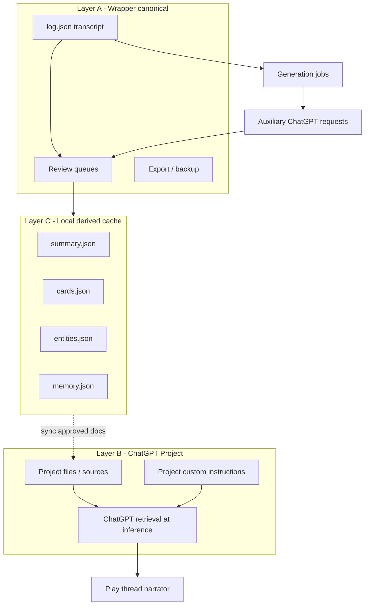
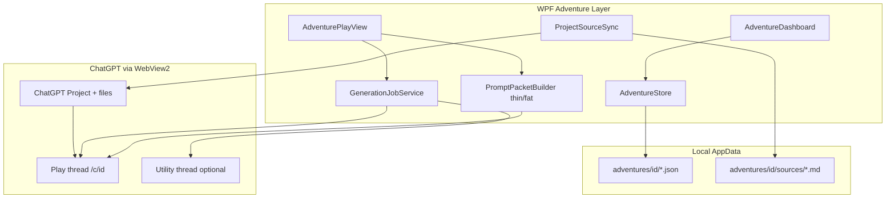
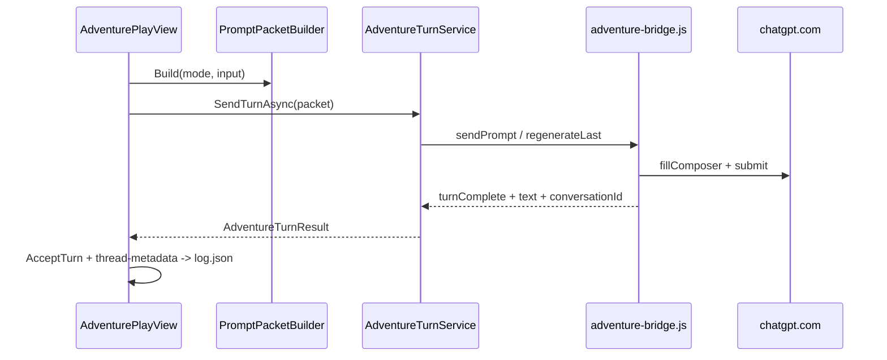

# ChatGPT Wrapper — AI Dungeon Features (Comprehensive Phased Plan)

This document is the full roadmap for evolving **chatgpt-wrapper** from a ChatGPT reading shell into a **ChatGPT-native interactive fiction engine** — AI Dungeon–style play plus capabilities only ChatGPT can provide (Projects, sources, and model-assisted lore generation).

**Document revision:** Architecture v2 — centers **ChatGPT Projects & sources** and **generation jobs** rather than stuffing all lore into every play packet.

**Primary repo:** `E:\Documents\Code\chatgpt-wrapper`  
**Stack:** .NET 9 WPF + WebView2 (no separate OpenAI API key; uses embedded ChatGPT session)  
**Data root:** `%LocalAppData%\ChatGPTWrapper\`

**Documentation hub:** [INDEX.md](INDEX.md)

For implementation details see [architecture.md](architecture.md), [services-reference.md](services-reference.md), [data-model-reference.md](data-model-reference.md), and [adventure-panel.md](adventure-panel.md). User-facing guides: [user-guide.md](user-guide.md), [user-projects-and-sync.md](user-projects-and-sync.md).

---

## Table of contents

1. [Vision and principles](#vision-and-principles)
2. [ChatGPT-native architecture (v2)](#chatgpt-native-architecture-v2)
3. [Architecture (runtime)](#architecture-runtime)
4. [Data model](#data-model)
5. [Prompt packet builder](#prompt-packet-builder)
6. [Generation jobs (ChatGPT-assisted)](#generation-jobs-chatgpt-assisted)
7. [WebView automation bridge](#webview-automation-bridge)
8. [UI shell](#ui-shell)
9. [Phased delivery](#phased-delivery)
10. [Feature index (1–70)](#feature-index-170)
11. [Implementation status](#implementation-status)
12. [Code layout](#code-layout)
13. [Testing strategy](#testing-strategy)
14. [Constraints and risks](#constraints-and-risks)

---

## Vision and principles

| Principle | Description |
|-----------|-------------|
| **Local canonical play record** | Accepted transcript, user review decisions, export, and backups live in JSON. The wrapper owns *what happened in play*. |
| **ChatGPT owns deep lore retrieval** | Static world material (bibles, character sheets, rules) lives in **ChatGPT Project sources** and custom instructions where possible — not duplicated wholesale in every turn packet. |
| **Generated, then reviewed** | Summaries, story cards, entity updates, and recaps are **proposed by ChatGPT** via structured generation jobs, then **accepted locally** (same pattern as narrator response review). |
| **Thin play packets when Project-linked** | Play turns send mode + player input + recent transcript + *state delta*; Project RAG supplies background lore. |
| **Fat packets as fallback** | Without a Project, the wrapper inlines scenario, cards, and memory (current Phase 1 behavior). |
| **Instructions = contract; sources = world; packets = session** | Project **custom instructions** hold the static narrator contract (perspective, tone, boundaries). **Source files** hold mutable world lore and job guides. **Play packets** carry session deltas only. See [instruction-sources-paradigm.md](instruction-sources-paradigm.md). |
| **Automated play loop** | Build packet → `adventure-bridge.js` → capture reply → review → accept to log. |
| **Copy/paste fallback** | Manual bridge remains debug/fallback only. |

**Differentiator vs AI Dungeon:** AI Dungeon keeps memory inside its own model stack. This wrapper uses **ChatGPT Projects** as the long-context knowledge layer and **ChatGPT threads** as the narrator, while the wrapper provides structure, review gates, and a portable adventure archive.

---

## ChatGPT-native architecture (v2)

### Three layers of “memory”



| Layer | What it stores | Who retrieves it at play time |
|-------|----------------|------------------------------|
| **A — Canonical** | Verbatim accepted turns, sessions, prompt audit | Wrapper UI and export |
| **B — Project** | World bible, cast, rules, scenario doc, author style | **ChatGPT** via Project sources + instructions |
| **C — Derived cache** | Rolling summary, cards, trackers, pinned memories | Wrapper injects *changes* and pins; optional sync back to Project files |

Layer C is **not** a second truth — it is a **reviewed cache** of what ChatGPT (and the player) have agreed is true, optimized for UI and offline inspection.

### Adventure binding model (replaces “conversation id only”)

Each adventure should bind to:

| Link | Purpose |
|------|---------|
| `LinkedProjectId` / URL | ChatGPT Project that holds sources and project-level instructions |
| `LinkedConversationId` | Play thread (`/c/{id}`) inside that Project |
| `SourceManifest` | Local record of which files exist in the Project vs local `sources/` folder |

**Setup flow (target):**

1. Create adventure locally (scenario wizard).
2. **Create or link ChatGPT Project** — wizard exports `adventure-sources.zip` or individual Markdown files.
3. User uploads sources to Project (automated upload via bridge when DOM supports it; otherwise guided manual step).
4. Set Project **custom instructions** from author's note + narrator contract + boundaries (synced from wrapper).
5. Open play thread **inside the Project**; wrapper stores both IDs.

Feature **56 (Project Association)** expands from a hint string to full Project + thread lifecycle.

### What belongs where (instructions, sources, local)

Full delegation matrices, sync cadence, and utility-job patterns live in **[instruction-sources-paradigm.md](instruction-sources-paradigm.md)**. Summary:

| Layer | What goes here | Examples |
|-------|----------------|----------|
| **Project custom instructions** | Static narrator contract (how to play) | Perspective, tense, tone, boundaries, author's note |
| **Project source files** | Mutable world lore + job guides | `world.md`, `plot.md`, `characters.md`, `entity-extract-guide.md` |
| **Play packets** | Session delta (every send) | State, pinned memory, summary cache, transcript tail |
| **Local JSON** | Canonical play record + reviewed cache | `log.json`, `entities.json`, `summary.json`, `state.json` |

`instructions-snippet.md` is an **RAG mirror** of the static instruction contract — not a second truth. World rules belong in `world.md`, not in project instructions (target state; see paradigm doc for current gaps).

**Rule of thumb:** *How to narrate* → instructions. *What the world is* → sources. *What just happened* → local, with optional export after review.

### Source material manager (feature 57) — elevated

Bidirectional sync (implemented):

- **Export:** `ProjectSourceExportService` → `adventures/{id}/sources/*.md` + `source-manifest.json` (baseline hashes).
- **Compare:** `ProjectFileSyncPlanner` downloads remote files via API, three-way hash (`LocalSha256`, `RemoteSha256`, `BaselineSha256`).
- **Push replace:** `DeleteProjectFileAsync` + `UploadProjectFileAsync` when local is newer or user chooses **Keep local**.
- **Pull:** `DownloadFileToPathAsync` when remote is newer or user chooses **Keep remote**.
- **UI:** `SourceSyncDialog` — refresh plan, apply safe, resolve conflicts; unmanaged Project files are ignored.
- **Read:** Open sources folder / preview Markdown in Lore tab and sync dialog.

### Generation jobs (ChatGPT-assisted)

Separate **job types** from **play turns**. Jobs use the same WebView bridge but:

- Target a dedicated “utility” thread or the Project thread with a structured prompt.
- Expect **JSON or Markdown sections** in the reply (parsed by wrapper).
- Always pass through a **review dialog** before merging into Layer C or Project files.

See [Generation jobs](#generation-jobs-chatgpt-assisted) for the full catalog.

### Prompt strategy: thin vs fat

| Mode | When | Packet contents |
|------|------|-----------------|
| **Thin** | `LinkedProjectId` set and sources synced | Instructions pointer (“use Project sources”), player mode line, last N turns, `state.json` delta, pinned memories, triggered card *names* only |
| **Fat** | No Project or `ForceFatPackets` | Current behavior: full scenario, cards, entities, summary in packet |

This reduces token waste and leans on ChatGPT’s strength (retrieval over uploaded sources).

### Projects interface (API-primary, implemented)

| Layer | File | Role |
|-------|------|------|
| **API transport** | `chatgpt-api-bridge.js` | In-page `fetch` to `/api/auth/session` and `/backend-api/*` (session cookies) |
| **API injection** | `ChatGptApiBridgeInjection.cs` | RPC host ↔ WebView (`channel: api`) |
| **Session host** | `ChatGptApi/ChatGptProjectHost.cs` | Single WebView resolve, bridge inject, auth checklist, single-flight ops |
| **Discovery layers** | `ChatGptApi/ProjectDiscoveryService.cs` | Sidebar API → bootstrap → DOM (`discoverProjectsDom`) → manual URL in UI |
| **Typed client** | `ChatGptApi/ChatGptProjectApiService.cs` | Projects, direct `GET …/gizmos/{id}/files`, probe, upload/download |
| **Discovery** | `ChatGptApi/ChatGptApiDiscovery.cs` | Full gizmo request headers → `api-client-profile.json`; capability log |
| **Sync orchestrator** | `Adventure/Services/ProjectFileSyncOrchestrator.cs` | Plan/apply + post-sync verify (no sidebar re-list for files) |
| **Play only (DOM)** | `adventure-bridge.js` | Composer send/capture — **not** used for Project CRUD |

UI: `Views/ProjectWorkspaceDialog` (Connection / Projects / Sources). Legacy `ProjectLinkWizard` retained; entry points use the workspace.

---

## Architecture (runtime)

---



### Turn sequence



---

## Data model

Namespace: `ChatGPTWrapper/Adventure/` — JSON `schemaVersion: 1`, camelCase, indented files.

### Per-adventure folder

`%LocalAppData%\ChatGPTWrapper\adventures\{adventureId}\`

| File | Features covered |
|------|------------------|
| `adventure.json` | Metadata (1), settings (45), **project + thread** link (56), tags (43), archive (1) |
| `sources/` | Markdown mirrors for Project upload (57) — `scenario.md`, `world.md`, etc. |
| `source-manifest.json` | File list, hashes, last sync time with Project |
| `scenario.json` | Scenario (2), plot essentials (8), world rules (17), author's note (9), tone/content (32–33, 63) |
| `log.json` | Verbatim log (5), sessions (54), chapters/arcs (39), alternates (68) |
| `summary.json` | Rolling summary (6), review state (35) |
| `state.json` | Current state (7), scene (38), time (48), map notes (49) |
| `memory.json` | Memory bank (11), review queue (36) |
| `entities.json` | Characters (12, 46–47), locations (13), inventory (14), quests (15), factions (16), relationships (64), mysteries (65), conflicts (66), consequences (67) |
| `cards.json` | Story cards (10) |
| `prompt-history.json` | Prompt packet history (58) |
| `notes.txt` | Manual notes (51) |
| `save-states/` | Named snapshots (25) |

### Global libraries

`%LocalAppData%\ChatGPTWrapper\libraries\`

- `scenarios/`, `worlds/`, `characters/`, `presets/`, `templates/` (28–31, 62)
- `random-tables.json` (50)

### Turn model

```csharp
TurnRecord {
  Guid Id, int Index, DateTimeOffset At, InputMode Mode,
  string PlayerText, string? NarratorText, TurnStatus Status,
  Guid? ParentTurnId,           // branching (24)
  List<ResponseAttempt> Attempts, // retry / alternates (21, 68)
  Guid? SessionId, Guid? ChapterId,
  string? PromptPacketHash
}
```

**Input modes (4):** `Do`, `Say`, `Story`, `See`, `Continue` — encoded in packets as `[DO]`, `[SAY]`, etc.

---

## Prompt packet builder

`PromptPacketBuilder.Build(AdventureBundle, InputMode, playerInput)` chooses **thin** or **fat** mode based on `LinkedProjectId` and `SourceManifest.Synced`.

### Fat packet (no Project — Phase 1 behavior)

1. System instructions (preset 31 + settings 45 + boundaries 33)
2. **Scenario** — setting, role, opening, conflicts
3. Plot essentials (8) + world rules (17)
4. Author's note (9)
5. Rolling summary (6)
6. Current state + scene (7, 38)
7. Triggered story cards (10) — full content
8. Pinned memory (11, 44)
9. Relevant entity excerpts (12–16, 64–67)
10. Recent verbatim tail (5)
11. Player turn with mode prefix (4)

### Thin packet (Project-linked — target default)

1. Narrator contract (short) + pointer: *“Obey Project custom instructions and retrieved sources.”*
2. Rolling summary (6) — compact, recent only
3. Current state + scene delta (7, 38)
4. Pinned memory (11) — only pinned items
5. Triggered card **titles** + one-line reminder (10) — details live in Project
6. Recent verbatim tail (5) — last 6 accepted turns (`[[cgw:transcript]]`)
7. Player turn with mode prefix (4)

**Token budget:** `MaxPacketChars`; thin mode defaults lower (e.g. 8000). Context viewer (18) shows mode (thin/fat), Project link, and trim state.

**Bootstrap:** `AdventureBootstrapService.BuildStartPacket()` — fat always; thin uses *“Begin from Project scenario source; open with vivid narration.”*

---

## Generation jobs (ChatGPT-assisted)

`GenerationJobService` runs typed jobs through the adventure/utility WebView. Each job has: `prompt template`, `expected shape`, `review UI`, `merge target`.

| Job ID | Purpose | Output merge target | Features |
|--------|---------|---------------------|----------|
| `bootstrap_lore` | Initial cards, factions, locations from scenario | Review → `cards.json`, `entities.json` | 2, 10, 12–16 |
| `update_summary` | Rolling summary after N turns | Review → `summary.json` | 6, 35 |
| `extract_entities` | Characters, items, quests from last turn | Review → `entities.json` | 37, 12–16 |
| `propose_memories` | Durable facts worth remembering | Review → `memory.json` | 11, 36 |
| `generate_recap` | Player-facing recap | Display / export only | 40 |
| `sync_sources` | Regenerate `sources/*.md` from local JSON | `sources/` → Project upload | 57 |
| `expand_story_card` | User requests deeper lore for one card | Review → `cards.json` + optional `sources/` | 10, 41 |
| `continuity_check` | Compare log vs summary vs entities | Warnings list | 34 |

**Structured responses:** Prefer JSON schema in prompt, e.g. `{ "summary": "...", "memories": [], "entityUpdates": [] }`. Parser tolerates Markdown fences; on parse failure → raw text in review dialog.

**Scheduling (wrapper-side):**

- After accept turn: optional auto-queue `propose_memories` + `extract_entities` (user setting).
- Every N turns: auto-queue `update_summary`.
- Manual buttons in play UI: **Generate cards**, **Refresh summary**, **Sync to Project**.

**Review pattern:** Same as feature 20 — Accept / Reject / Edit before any merge. Never silently overwrite Layer C from ChatGPT output.

---

## WebView automation bridge

### Play bridge (DOM)

| File | Role |
|------|------|
| `ChatGPT_files/adventure-bridge.js` | Composer fill, submit, stable-text capture, regenerate, probe/ping |
| `ChatGPTWrapper/ChatGptAdventureBridgeInjection.cs` | Inject script, `WebMessageReceived`, `PostWebMessageAsJson` |
| `ChatGPTWrapper/Adventure/Services/AdventureTurnService.cs` | Orchestration, health check, conversation id fallback |

| Command | Behavior |
|---------|----------|
| `sendPrompt` | Fill composer, submit, wait for stable assistant text |
| `regenerateLast` | Click native regenerate, capture new reply |
| `getConversationId` | Read `/c/{id}` from URL |
| `ping` / `probe` | Bridge health for context viewer |

Play flow: build packet → `SendTurnAsync` → review → accept → persist `LinkedConversationId`.

### API bridge (Projects)

| File | Role |
|------|------|
| `ChatGPT_files/chatgpt-api-bridge.js` | `getSession`, `apiRequest`, `uploadFile` |
| `ChatGPTWrapper/ChatGptApiBridgeInjection.cs` | Same WebView as play; messages use `channel: api` |
| `ChatGPTWrapper/ChatGptApi/ChatGptProjectApiService.cs` | Sidebar, upsert, conversations, files |

**Registration:** Both bridges register on the Adventure `WebView2` tab only.

**Degrade path:** If upload/create-conversation endpoints fail, export `sources/*.md` and use dashboard **Link Project** / **Sync sources** with manual ChatGPT UI; capability flags live in `%LocalAppData%\ChatGPTWrapper\api-capabilities.json`.

---

## UI shell

| Mode | UI | Features |
|------|-----|----------|
| **Browse** | Standard WebView tabs + reading chrome | Existing wrapper features |
| **Adventures** | `AdventureDashboardView` | List, create, archive, backup, import, libraries (1, 28–31) |
| **Play** | Split: `AdventurePlayView` + Adventure ChatGPT tab | Play loop (3–4), panels (6–18), review (20) |

### Play layout

- **Center:** Story log (5) with mode badges; clean read (52) and archive view (53)
- **Bottom:** Continuation queue (69), mode selector (4), input bar
- **Right tabs:** State, memory, cards, lore, trackers, warnings, sessions
- **Toolbar:** Send, Continue, Context, Undo, Branch, Save state, Export, Search, Settings

---

## Phased delivery

### Phase 0 — Foundation (blocking)

**Goal:** Durable local data; navigation shell; no full play loop required.

| Deliverable | Features |
|-------------|----------|
| Adventure folder layout + JSON schema | All persistence |
| `AdventureStore`, `BackupService` | 55 |
| `AdventureBundle` + turn models | 5, 24, 68 (schema) |
| Import/export skeleton | 26, 27 |
| `AdventureShell` / mode switch in `MainWindow` | Navigation |
| Local-only indicator | 61 |

**Milestone:** Create, save, list, backup, and restore adventures without playing.

---

### Phase 1 — MVP play loop

**Goal:** Create adventure → play turns with automation → review responses → export raw log.

| # | Feature | Notes |
|---|---------|-------|
| 1 | Adventure Dashboard | List, create, archive, search |
| 2 | Scenario Creation | Wizard → `scenario.json`; **Start adventure** seeds opening |
| 3 | Adventure Chat Interface | Native log + linked WebView tab |
| 4 | Input Modes | Do / Say / Story / See / Continue |
| 5 | Verbatim Message Log | `log.json` accepted turns |
| 6 | Rolling Summary | **Manual edit** in Phase 1 (auto in Phase 2) |
| 8 | Plot Essentials | In scenario + packet |
| 9 | Author's Note | Style-only packet section |
| 18 | Context Viewer | Packet preview + bridge health |
| 19 | Copy/Paste Bridge | Fallback only |
| 20 | Response Review | Accept / reject / retry / edit |
| 21 | Retry / Regenerate | `regenerateLast`; `Attempts` archive |
| 56 | Project Association | **Partial:** `LinkedConversationId` only; full Project binding in Phase 2 |
| 58 | Prompt Packet History | Append-only; no duplicate on retry |

**Phase 1 done criteria**

- User can create adventure and start without hand-building ChatGPT context.
- First packet includes scenario premise (`=== SCENARIO ===`).
- Automation send/capture on linked thread; fallback on failure.
- Review flow updates log correctly; retry does not duplicate prompt history.
- Export raw Markdown works; linked thread persists across restarts.

**Manual test checklist** (see [README.md](../README.md#phase-1-manual-test-checklist))

---

### Phase 2 — ChatGPT Project layer + generation jobs

**Goal:** Bind adventures to ChatGPT Projects; use ChatGPT to maintain lore; thin play packets.

| # | Feature |
|---|---------|
| 56 | **Project Association (full)** — create/link Project, thread inside Project, `LinkedProjectId` |
| 57 | **Source material manager** — export `sources/*.md`, manifest, guided/ automated upload |
| — | Project custom instructions sync (author's note, boundaries, narrator contract) |
| — | `PromptPacketBuilder` thin mode when Project linked |
| 6 | Rolling summary via `update_summary` job + **Summary Review** (35) |
| 10 | Story cards via `bootstrap_lore` / `expand_story_card` jobs + review |
| 11 | Memory bank via `propose_memories` job + **Memory Review** (36) |
| 37 | Entity updates via `extract_entities` job + entity review UI |
| 34 | `continuity_check` job + warnings panel |
| 7 | Current state panel (manual + optional job-suggested deltas) |
| 32–33 | Tone/boundaries → Project instructions |
| 40 | Recap via `generate_recap` job (enable UI) |

**Milestone:** User sets up a Project once; play packets stay small; lore updates flow from ChatGPT through review gates into local cache and optionally Project files.

---

### Phase 2b — Context UI polish (formerly “memory core” remainder)

| # | Feature |
|---|---------|
| 45 | Per-adventure settings (generation auto-run toggles, thin/fat override) |
| 41–42 | Lore browser shows Layer C + links to source files |
| 35–36 | Review queue UIs for all job types |

---

### Phase 3 — Structured trackers

**Goal:** `entities.json` editors + packet sections for structured world state.

| # | Tracker |
|---|---------|
| 12, 46–47 | Characters, player sheet, party |
| 13, 49 | Locations, map notes |
| 14 | Inventory |
| 15 | Quests |
| 16 | Factions |
| 64–67 | Relationships, mysteries, conflicts, consequences |
| 38–39 | Scene, chapters/arcs |
| 48 | Time tracker |
| 41–42 | Lore browser, search (expand) |
| 43–44 | Tags, pins |

---

### Phase 4 — Turn control and timelines

| # | Feature |
|---|---------|
| 22 | Undo |
| 23 | Edit turn (stale summary/state flags) |
| 24 | Branching — fork from turn index |
| 25 | Save states — folder snapshots |
| 68 | Alternative response archive (UI) |
| 69 | Continuation queue (enhanced) |

---

### Phase 5 — Libraries and templates

| # | Feature |
|---|---------|
| 28–31 | Scenario / world / character libraries, prompt presets |
| 62 | Adventure templates |
| 50 | Random tables |
| 51 | Manual notes (editor) |
| 57 | Source material manager |

---

### Phase 6 — Export, import, sessions, polish

| # | Feature |
|---|---------|
| 26–27, 70 | Export/import: JSON zip, MD, TXT, HTML, polished story |
| 54 | Session history UI |
| 40 | Recap generator |
| 52–53 | Clean vs full archive reading modes |
| 59–60 | Formatting + accessibility (font, spacing, themes) |
| 55 | Backup reminders / scheduled UX |

---

### Phase 7 — Advanced / nice-to-have

| # | Feature |
|---|---------|
| 63 | Difficulty and consequence controls (deeper) |
| 34 | NLP-assisted continuity detection |
| 37 | Richer entity extraction from narrator text |
| — | Bi-directional DOM sync when user types in ChatGPT UI directly |
| — | Port `interactive-narrative.css` from cursor-wrapper for play-log typography |

---

## Feature index (1–70)

| # | Feature | Phase |
|---|---------|-------|
| 1 | Adventure Dashboard | 0–1 |
| 2 | Scenario Creation | 1 |
| 3 | Adventure Chat Interface | 1 |
| 4 | Input Modes | 1 |
| 5 | Verbatim Message Log | 1 |
| 6 | Rolling Summary | 1 manual / 2 auto |
| 7 | Current State Panel | 2–3 |
| 8 | Plot Essentials | 1 |
| 9 | Author's Note | 1 |
| 10 | Story Cards | 2–3 |
| 11 | Memory Bank | 2 |
| 12 | Character Tracker | 3 |
| 13 | Location Tracker | 3 |
| 14 | Inventory Tracker | 3 |
| 15 | Quest and Objective Tracker | 3 |
| 16 | Faction Tracker | 3 |
| 17 | World Rules | 1 (scenario) / 3 (editor) |
| 18 | Context Viewer | 1 |
| 19 | Copy/Paste Bridge | 1 fallback |
| 20 | Response Review | 1 |
| 21 | Retry / Regenerate | 1 |
| 22 | Undo | 4 |
| 23 | Edit Turn | 4 |
| 24 | Branching | 4 |
| 25 | Save States | 4 |
| 26 | Adventure Export | 6 |
| 27 | Adventure Import | 0–6 |
| 28 | Scenario Library | 5 |
| 29 | World Library | 5 |
| 30 | Character Library | 5 |
| 31 | Prompt Presets | 5 |
| 32 | Tone and Style Controls | 2 |
| 33 | Content Boundaries | 2 |
| 34 | Continuity Warnings | 2 / 7 |
| 35 | Summary Review | 2 |
| 36 | Memory Review | 2 |
| 37 | Entity Review | 2 / 7 |
| 38 | Scene Management | 3 |
| 39 | Chapter or Arc Organization | 3 |
| 40 | Recap Generator | 6 |
| 41 | Lore Browser | 3 |
| 42 | Search | 3 |
| 43 | Tags and Labels | 3 |
| 44 | Favorites and Pins | 3 |
| 45 | Adventure Settings | 1–2 |
| 46 | User Profile / Player Character Sheet | 3 |
| 47 | Party / Companion Tracker | 3 |
| 48 | Time Tracker | 3 |
| 49 | Map Notes | 3 |
| 50 | Random Tables | 5 |
| 51 | Manual Notes | 5–6 |
| 52 | Clean Reading Mode | 6 |
| 53 | Full Archive Mode | 6 |
| 54 | Session History | 6 |
| 55 | Backup and Restore | 0 / 6 |
| 56 | Project Association | 1 partial / **2 full** |
| 57 | Source Material Manager | **2** / 5 templates |
| 58 | Prompt Packet History | 1 |
| 59 | Formatting Controls | 6 |
| 60 | Accessibility and Reading Preferences | 6 |
| 61 | Local-Only Mode | 0 |
| 62 | Adventure Templates | 5 |
| 63 | Difficulty and Consequence Controls | 2 / 7 |
| 64 | Relationship Tracker | 3 |
| 65 | Mystery and Clue Tracker | 3 |
| 66 | Conflict Tracker | 3 |
| 67 | Consequence Tracker | 3 |
| 68 | Alternative Response Archive | 4 |
| 69 | Continuation Queue | 4 |
| 70 | Polished Story Export | 6 |

---

## Implementation status

*As of Phase 2c utility job orchestration in chatgpt-wrapper.*

| Phase | Status | Summary |
|-------|--------|---------|
| **0** | **Done** | Stores, models, backup, dashboard shell, local-only hint |
| **1** | **Done** | Play loop, bridge, packet builder, review, linking, start adventure, context health |
| **2** | **Mostly done** | Projects/sync/thin packets + `GenerationJobService` (all job types), review UIs, auto-scheduling, instruction auto-sync |
| **2c** | **Done** | Utility job orchestration: readiness gate (Registered/DomOnly/Unready), atomic DOM `sendPrompt`→`turnComplete`, session reuse without sidebar discard, null-safe job JSON parse, `utility_job_phase` tracing — see [utility-job-orchestration.md](utility-job-orchestration.md) |
| **2b** | Partial | Memory/cards/continuity services exist; job UIs incomplete |
| **3** | Partial | `entities.json` + Reference CRUD/review; full generation job suite via utility threads |
| **4** | Partial | Undo, edit, branch, save states, queue in code; some UI present |
| **5** | Partial | `LibraryStore`, libraries dialog, random tables, save scenario |
| **6** | Partial | Export formats; session list; recap stub; clean/archive toggles |
| **7** | Planned | Advanced continuity, DOM sync, narrative CSS port |

### Key implemented paths

| Path | Purpose |
|------|---------|
| `ChatGPTWrapper/Adventure/` | Models, stores, services |
| `ChatGPTWrapper/Views/Adventure*.xaml` | Dashboard, play, dialogs |
| `ChatGPTWrapper/MainWindow.Adventures.cs` | Mode switch, turn execution |
| `ChatGPT_files/adventure-bridge.js` | Play DOM automation |
| `ChatGPT_files/chatgpt-api-bridge.js` | Projects session API |
| `ChatGPTWrapper/ChatGptApi/ChatGptProjectHost.cs` | Central project session |
| `ChatGPTWrapper/ChatGptApi/ProjectDiscoveryService.cs` | Layered project listing |
| `ChatGPTWrapper/ChatGptApi/` | Project API client + discovery |
| `ChatGPTWrapper/Views/ProjectWorkspaceDialog.*` | Connection, Projects, Sources tabs |
| `ChatGPTWrapper/Views/SourceSyncDialog.*` | Standalone sync (also embedded in workspace) |
| `ChatGPTWrapper/Adventure/Services/ProjectFileSyncOrchestrator.cs` | Sync apply + verify |
| `ChatGPTWrapper/Adventure/Services/ProjectFileSyncPlanner.cs` | Three-way compare plan |
| `ChatGPTWrapper/Adventure/Services/GenerationJobService.cs` | Unified generation job orchestrator |
| `ChatGPTWrapper/Adventure/Services/UtilityConversationReadinessService.cs` | Pre-send Registered/DomOnly/Unready gate |
| `ChatGPTWrapper/Adventure/Services/UtilityConversationPageService.cs` | Strict nav, href-based page verify |
| `ChatGPTWrapper.Core/ChatGptApi/JsonElementParsing.cs` | Null-safe JSON for job response apply |
| `ChatGPTWrapper/Adventure/Services/GenerationJobHandlers.cs` | Per-job prompts, parse, review enqueue |
| `ChatGPTWrapper/Adventure/Services/GenerationJobScheduler.cs` | Post-turn auto job queue |
| `ChatGPTWrapper/Adventure/Services/EntityExtractionService.cs` | Entity extract prompts/parse + guide export |

### Reused from existing wrapper

| Asset | Use |
|-------|-----|
| `AppDirectories`, `UiChromeStore` | Persistence patterns |
| `ChatGptUrls.IsConversationThread` | Thread detection |
| `continuous-transcript-view.js` | Composer patterns (bridge is separate) |
| `ChatGptContinuousViewInjection` | Browse-mode reading chrome |

**Not in scope:** cursor-wrapper chat library / quick prompts (optional later port).

---

## Code layout

```
chatgpt-wrapper/
├── docs/
│   └── AI-DUNGEON-PHASED-PLAN.md          # this file
├── ChatGPT_files/
│   ├── adventure-bridge.js                # play turns (DOM)
│   └── chatgpt-api-bridge.js              # Projects API (session fetch)
├── ChatGPTWrapper/
│   ├── ChatGptApi/                          # ChatGptProjectApiService, discovery
│   ├── ChatGptApiBridgeInjection.cs
│   ├── Adventure/
│   │   ├── Models/                          # ProjectLink, SourceManifest
│   │   ├── Stores/
│   │   └── Services/
│   │       ├── PromptPacketBuilder.cs       # thin/fat
│   │       ├── AdventureTurnService.cs      # play turns
│   │       ├── AdventureProjectBindingService.cs
│   │       ├── ProjectSourceExportService.cs
│   │       ├── ProjectFileSyncPlanner.cs
│   │       └── ProjectSourceSyncService.cs
│   ├── Views/
│   │   ├── AdventureDashboardView.*
│   │   ├── AdventurePlayView.*
│   │   ├── ScenarioCreationDialog.*
│   │   ├── ResponseReviewDialog.*
│   │   ├── ContextViewerDialog.*
│   │   └── …
│   ├── MainWindow.Adventures.cs
│   ├── ChatGptAdventureBridgeInjection.cs
│   └── MainWindow.ChatTabs.cs
└── README.md
```

---

## Testing strategy

### Unit (recommended additions)

- JSON round-trip for `AdventureBundle`
- `PromptPacketBuilder` trimming and scenario section presence on empty log
- Branch / undo invariants on `TurnTimelineService`
- Retry does not append duplicate `PromptHistoryEntry`

### Integration (manual)

- Run against live **chatgpt.com** with logged-in WebView profile
- Document supported ChatGPT UI version when DOM changes break automation
- Follow Phase 1 checklist in README

### Fixture mode

- `AdventureSettings.AdventureAutomationEnabled = false` forces manual fallback path for CI-free UI testing

---

## Constraints and risks

| Risk | Mitigation |
|------|------------|
| ChatGPT DOM changes | Selectors isolated in `adventure-bridge.js`; manual fallback; automation health in Context |
| ChatGPT ToS | User responsibility; no API scraping beyond embedded browser |
| Fragile thread linking | Poll `getConversationId` after turn; persist on accept |
| Large packets | Thin packet mode when Project-linked; fat fallback |
| Project UI changes | Source sync degrades to “export files + user uploads manually” |
| Duplicate lore | Source manifest hashes; review before merge; single sync direction per field |
| Generation hallucination | All job outputs pass review; never auto-merge |

**No separate OpenAI API in v1** — generation and play use the same WebView2 ChatGPT session. Optional future: API path for headless jobs if user provides key.

---

## Migration from Phase 1 (current code)

| Today | Target |
|-------|--------|
| All lore inlined in `PromptPacketBuilder` | Thin packets + Project sources |
| `LinkedProjectHint` string only | `LinkedProjectId` + `SourceManifest` |
| Manual summary/cards/entities | Generation jobs + review |
| Recap hidden | `generate_recap` job in Phase 2 |
| Source manager deferred to Phase 5 | **Phase 2 core** |

Phase 1 play loop remains valid as **fat-packet / no-Project** mode.

---

## Next steps

1. **Phase 1 (done):** Play loop, fat packets, conversation linking — see [README.md](../README.md).
2. **Phase 2 (priority):** Project wizard, `sources/` export, `GenerationJobService`, thin packets, instruction sync.
3. **Phase 2b–7:** Trackers UI, libraries as Project templates, polish — per feature index above.

For day-to-day usage and the Phase 1 test checklist, see [README.md](../README.md).
