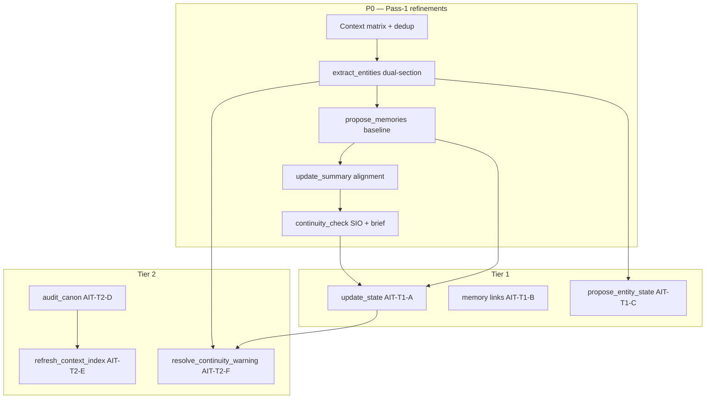

# AI Tools — backlog & enhancement tracker

**Status:** Living tracker (started 2026-07-04)  
**Index:** [ai-tools-review-index.md](ai-tools-review-index.md)  
**Context canon:** [ai-tools-context-matrix.md](ai-tools-context-matrix.md)  
**Parent review:** [ai-tools-jobs-review.md](ai-tools-jobs-review.md)

Tracks **new jobs**, **job evolutions**, **sub-action enhancements**, and **design-time utilities** accepted after the pass-1 AI Tools review. Implementation order is suggestive — dependencies noted per row.

**ID prefix:** `AIT-` (AI Tools tracker — not a Linear label unless promoted to an issue).

---

## Staged decisions (locked 2026-07-04)

All open questions from pass-1 review and backlog workflow docs are **resolved** below. Implementation docs must match these rows; do not re-open without explicit product revision.

### Play auto defaults (new adventures / reset settings)

| Job | Setting | Default |
|-----|---------|---------|
| `extract_entities` | `AutoExtractEntities` | **`true`** |
| `propose_memories` | `AutoProposeMemories` | **`true`** |
| `update_state` | `AutoUpdateState` | **`true`** |
| `update_summary` | `AutoUpdateSummary` | **`true`** (interval **5**) |
| `continuity_check` | `AutoContinuityCheck` | **`true`** with **debounce** — skip auto-run when no new **accepted** turn since `LastCheckedAt` |

Existing adventures keep saved preferences until changed.

### `extract_entities` (pass-1 + entity workflow)

| Question | Decision |
|----------|----------|
| Flat array compatibility | **Yes** — transitional: top-level `[...]` parses as `extractions` only; emit migration diagnostic |
| Id in proposals | **Id-first** match on apply; normalized `name` + `entityType` fallback |
| Update fields in proposals | **Changed fields only** (partial merge), not full record replacement |
| Both sections each run | **Always** request `extractions` + `updates`; empty arrays when none |
| Auto default | **`true`** (see table above) |
| `process_turn` entity leg | **Mirror** `{ extractions, updates }` — [process-turn-review.md](process-turn-review.md) |

### `continuity_check`

| Question | Decision |
|----------|----------|
| Auto every turn vs debounce | **Debounce** — see auto table above |
| Warning hub UX | **Dismiss-only** remains default; add **Resolve with AI** hub action → [resolve-continuity-warning-workflow.md](resolve-continuity-warning-workflow.md) (AIT-T2-F) |
| Auto scope | **Session-wide** only; exchange-scoped manual mode → P3 backlog |
| Transcript source | **Assembler story block** only — do **not** publish `recent-turns.json` |
| Cross-job brief inputs | Pending entity, memory, summary, source-edit queues + `UtilityJobResultStore` same-turn captures |

### `propose_source_edits`

| Question | Decision |
|----------|----------|
| `cast.md` in guide targets | **Remove** — cast changes via entity workflow / `propose_entities_file` |
| Inline excerpt fallback | **Retire** on production worker path; keep **`ForLocalInference`** / offline QA only |

### `update_state` (AIT-T1-A)

| Question | Decision |
|----------|----------|
| Auto default | **`true`** |
| `objectives` merge | **Append/remove delta** — add new objectives; remove only when exchange explicitly closes one |
| `flags` merge | Shallow merge |
| `location` / `time` | Replace when proposed |
| SVA-02 narrator blocks | **Parallel track** — utility job owns post-turn proposals; SVA-02 does not block AIT-T1-A |

### `resolve_continuity_warning` (AIT-T2-F)

| Question | Decision |
|----------|----------|
| Dedicated job id | **Yes** — `resolve_continuity_warning`; hub launches composition |
| Transport | **Single worker send** — one composed packet per warning |
| Canon-drift route | **Non-blocking** handoff — open design workspace with pre-filled `propose_source_edits` intent |
| Partial apply | **Per-leg independent** — successful legs apply even if another leg fails parse |
| `memory-entity` category | **Entity `updates[]` first**; `propose_memories` only when warning is episodic, not entity fact |

### Design & Tier 2/3

| Item | Decision |
|------|----------|
| `draft_framework` | **Adjacent helper** — not a catalog row until explicitly promoted |
| `design_adventure` first turn | Inject **`canon-format.md`** reference; suggest **`design_extract_step`** when structured fields needed |
| `refresh_context_index` (AIT-T2-E) | **Rule-based v0** on entity/source accept; AI v1 outputs **JSON patch** |
| `audit_canon` (AIT-T2-D) | Dismiss-only warnings + links to fix jobs (`propose_source_edits`, `propose_entities_file`, `refresh_context_index`) |
| `propose_entity_state` (AIT-T1-C) | **Play sub-action** (like `expand_entity`), not catalog row |
| AIT-T3-01 import validation | **Local schema first**; AI only if ambiguous |
| AIT-T3-03 `synthesize_source` | Promote to **Design AI Tools** when design surface ships (P1 adjacent) |
| AIT-T3-04 multi-select expand | **P1** after `extract_entities` dual-section P0 |

---

## Tier 1 — Closes structural gaps (accepted)

| ID | Name | Type | Job ID | Status | Priority | Depends on | Design doc |
|----|------|------|--------|--------|----------|------------|------------|
| **AIT-T1-A** | Session state proposals | **New play job** | `update_state` | **Accepted** — [CMD-458](https://linear.app/cmd0112/issue/CMD-458) | P1 | Memory baseline P0 helpful | [update-state-workflow.md](update-state-workflow.md) |
| **AIT-T1-B** | Memory graph / links | **Evolve existing** | `propose_memories` | **Accepted** — [CMD-460](https://linear.app/cmd0112/issue/CMD-460) | P2 | [memory-propose-refinement.md](memory-propose-refinement.md) P0 | [memory-update-workflow.md](memory-update-workflow.md) |
| **AIT-T1-C** | Per-entity internal state | **Play sub-action** | `propose_entity_state` | **Accepted** — [CMD-461](https://linear.app/cmd0112/issue/CMD-461) | P2 | `extract_entities` dual-section P0 | [entity-internal-state-tracker.md](entity-internal-state-tracker.md) |

### AIT-T1-A — `update_state`

Propose `state.json` deltas from scoped play (location, objectives, flags, time). Fills the gap where continuity **reads** state but no job **writes** it.

| Aspect | Target |
|--------|--------|
| Catalog | Play AI Tools — post-turn; auto default **`true`** (`AutoUpdateState`) |
| Scheduler | After `propose_memories`, before `update_summary` |
| Review | State proposal queue (new or extend state editor) |
| Related | [SVA-02](strategic-value-additions-tracker.md) structured narrator → state |

### AIT-T1-B — Memory `{ events, links }`

Same job id — dual-section response like entities. **Not** a new `update_memory` job; amendments are new linked rows, not in-place edits.

### AIT-T1-C — `propose_entity_state`

Distinct from **`extract_entities` → `updates[]`** (canon facts in `entities.json`). Internal state = mood, trust, flags, hidden knowledge — likely satellite `entity-state.json` or per-entity state blocks.

---

## Tier 2 — Design workspace & bridges (accepted)

| ID | Name | Type | Job ID | Status | Priority | Notes | Design doc |
|----|------|------|--------|--------|----------|-------|------------|
| **AIT-T2-D** | Pre-play canon audit | **New design job** | `audit_canon` | **Accepted** — [CMD-462](https://linear.app/cmd0112/issue/CMD-462) | P2 | Continuity-like warnings without play transcript | [audit-canon-workflow.md](audit-canon-workflow.md) |
| **AIT-T2-E** | Context index maintenance | **Automation + optional AI** | `refresh_context_index` | **Accepted** — [CMD-463](https://linear.app/cmd0112/issue/CMD-463) | P2 | Rule-based v0 on accept; AI patch v1 | [refresh-context-index-workflow.md](refresh-context-index-workflow.md) |
| **AIT-T2-F** | Fix from continuity warning | **Composition job** | `resolve_continuity_warning` | **Accepted** — [CMD-464](https://linear.app/cmd0112/issue/CMD-464) | P3 | Single-send compose; design handoff for canon | [resolve-continuity-warning-workflow.md](resolve-continuity-warning-workflow.md) |

### AIT-T2-F complexity notes

- Triggered from Continuity hub with warning + `refs` pre-filled
- Routes to appropriate leg: entity `updates[]`, `update_state`, or design `propose_source_edits`
- Likely manual-only; never auto-scheduled
- Depends on: continuity structured warnings (P2), `update_state` (AIT-T1-A), entity dual-section P0

---

## Tier 3 — Track (accepted for backlog visibility)

| ID | Name | Type | Status | Notes |
|----|------|------|--------|-------|
| **AIT-T3-01** | Import validation | Local or AI pre-apply | **Track** | Schema check for `propose_json_import` — may not need AI |
| **AIT-T3-02** | Scene UI suggestions | Play/design assist | **Track** | SVX-22; depends on AIT-T1-A / SVA-02 state |
| **AIT-T3-03** | Promote `synthesize_source` | Catalog visibility | **Track** | Internal today; Design AI Tools candidate |
| **AIT-T3-04** | `expand_entity` multi-select | Sub-action enhancement | **Track** — [CMD-459](https://linear.app/cmd0112/issue/CMD-459) | Reuse `updates[]` shape — [expand-entity-enhancement.md](expand-entity-enhancement.md) |

---

## Entity naming — no separate `update_entity` job

Authors sometimes ask for an **“update entity”** capability. The review **rejected** a sibling job id in favor of one post-turn job:

| Concept | Canonical surface | Doc |
|---------|-------------------|-----|
| **Create** new referents from play | `extract_entities` → `extractions[]` | [entity-extract-update-workflow.md](entity-extract-update-workflow.md) |
| **Update** existing entity canon | `extract_entities` → `updates[]` | Same |
| **Manual enrich** one or more entities | `expand_entity` sub-action | [expand-entity-enhancement.md](expand-entity-enhancement.md) |
| **Full file revision** | `propose_entities_file` (design) | [design-ai-tools-context.md](design-ai-tools-context.md) |
| **Internal / psychological state** | `propose_entity_state` (AIT-T1-C) | [entity-internal-state-tracker.md](entity-internal-state-tracker.md) |

Do **not** add `update_entity` to `GenerationJobId` unless product explicitly reverses the one-job-two-section decision.

---

## Pass-1 play refinements (in flight — not new jobs)

These are **refinements** to existing catalog jobs — tracked here for implementation ordering alongside Tier 1–3.

| Job ID | Tracker link | P0 focus |
|--------|--------------|----------|
| `extract_entities` | [entity-extract-update-workflow.md](entity-extract-update-workflow.md) | `{ extractions, updates }`; SIO baseline gate |
| `propose_memories` | [memory-propose-refinement.md](memory-propose-refinement.md) | Memory baseline hybrid; auto on |
| `update_summary` | [update-summary-refinement.md](update-summary-refinement.md) | Dedup; memory-since-revision; auto on |
| `continuity_check` | [continuity-check-redesign.md](continuity-check-redesign.md) | SIO; continuity brief; scheduler dependency |
| `process_turn` | [process-turn-review.md](process-turn-review.md) | Compose sibling legs; remove summary |
| `propose_source_edits` | [propose-source-edits-review.md](propose-source-edits-review.md) | Design-only; SIO canonical |

**Cross-cutting:** [ai-tools-context-matrix.md](ai-tools-context-matrix.md) + [utility-job-context-assembly.md](utility-job-context-assembly.md) sync.

---

## Suggested implementation order

| Phase | Items |
|-------|--------|
| **P0** | Context matrix; entity/memory/summary/continuity refinements; design context doc |
| **P1** | `update_state` (AIT-T1-A); catalog segregation; `expand_entity` multi-select (AIT-T3-04) |
| **P2** | Memory links (AIT-T1-B); `audit_canon` (AIT-T2-D); `refresh_context_index` (AIT-T2-E); `propose_entity_state` (AIT-T1-C) |
| **P3** | `resolve_continuity_warning` (AIT-T2-F); Tier 3 promotions as needed |

---

## Catalog impact (future `GenerationJobId` additions)

| Proposed id | Catalog | Notes |
|-------------|---------|-------|
| `update_state` | Play (+ auto candidate) | **AIT-T1-A** — add constant + handler + review queue |
| `propose_entity_state` | Play sub-action (entity panel) | **AIT-T1-C** — not catalog row |
| `resolve_continuity_warning` | Play manual — Continuity hub | **AIT-T2-F** — dedicated composition job id |
| `audit_canon` | Design | **AIT-T2-D** |
| `refresh_context_index` | Design or automation hook | **AIT-T2-E** — may be non-AI first |
| `resolve_continuity_warning` | Play manual / Continuity hub | **AIT-T2-F** — composition only |

Play catalog grows from **5 → 6** when `update_state` ships (unless interval-gated jobs are counted separately). Design catalog **8 → 9** with `audit_canon`.

---

## Status log

| Date | Update |
|------|--------|
| 2026-07-04 | Tracker created; Tier 1–3 accepted from context analysis review |
| 2026-07-04 | `update_state` naming locked (AIT-T1-A); entity `updates[]` vs `update_entity` clarified |
| 2026-07-04 | Design context doc + context matrix added; workflow stubs for Tier 1–2 items |
| 2026-07-04 | **Linear promoted** — epic [CMD-449](https://linear.app/cmd0112/issue/CMD-449) + CMD-450–464; see [ai-tools-implementation-plan.md](ai-tools-implementation-plan.md) |

---

## Maintaining this tracker

1. New accepted enhancement → add row with `AIT-` id; link design doc when specced.  
2. Job id lands in code → update [ai-tools-jobs-review.md](ai-tools-jobs-review.md) inventory + [ai-tools-review-index.md](ai-tools-review-index.md) job map.  
3. Promote to Linear → create CMD issue; link from row; do not duplicate taxonomy in issue body without [linear-issue-reference.md](../linear/linear-issue-reference.md). **Epic:** [CMD-449](https://linear.app/cmd0112/issue/CMD-449) · **Plan:** [ai-tools-implementation-plan.md](ai-tools-implementation-plan.md).  
4. Tier promotion (Track → Accepted) → move row to Tier 2 or Tier 1 with user sign-off.

---

*Last updated: 2026-07-04*
