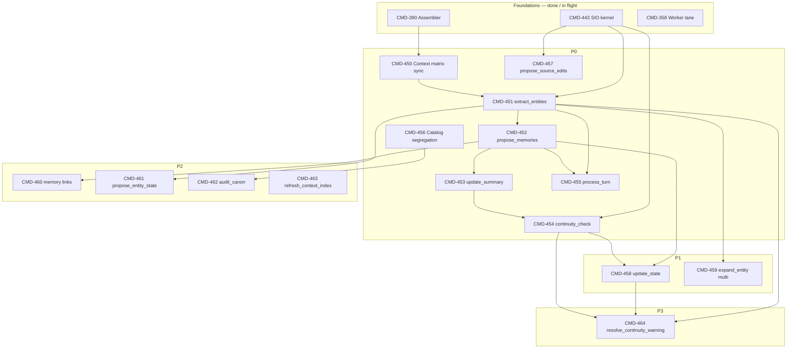

# AI Tools — implementation plan (pass-1)

**Status:** Pass-1 implemented (2026-07-04) — branch `cmd-449-ai-tools-pass1`; manual play-session QA pending before Verified close-out.  
**Linear epic:** [CMD-449](https://linear.app/cmd0112/issue/CMD-449)  
**Doc hub:** [ai-tools-review-index.md](ai-tools-review-index.md)  
**Locked decisions:** [ai-tools-backlog-tracker.md § Staged decisions](ai-tools-backlog-tracker.md#staged-decisions-locked-2026-07-04)

This document is the **implementation plan** for the pass-1 AI Tools review. Use it with Cursor Plan mode or as a sprint guide. Each step maps to a Linear child issue under CMD-449.

---

## Executive summary

| Phase | Outcome | Issues |
|-------|---------|--------|
| **P0** | Existing play jobs aligned to context matrix; auto defaults on; continuity SIO + brief; catalog split | CMD-450 → CMD-457 |
| **P1** | `update_state` ships; multi-select `expand_entity`; play catalog grows to 6 jobs | CMD-458, CMD-459 |
| **P2** | Memory links, entity internal state, design `audit_canon`, context-index automation | CMD-460 → CMD-463 |
| **P3** | Continuity warning → fix bridge | CMD-464 |

**Prerequisites (already landed or in flight):**

- [CMD-390](https://linear.app/cmd0112/issue/CMD-390) — `UtilityJobContextAssembler` v1
- [CMD-443](https://linear.app/cmd0112/issue/CMD-443) — `UtilitySourceFileIoService` kernel
- [CMD-358](https://linear.app/cmd0112/issue/CMD-358) — utility worker lane (parallel drain: CMD-447)

---

## Architecture anchors

Before coding any step, read:

| Topic | Canonical doc |
|-------|----------------|
| Per-job context (SB, JC, SIO, CS, WL) | [ai-tools-context-matrix.md](ai-tools-context-matrix.md) |
| Assembler lanes & dedup | [utility-job-context-assembly.md](utility-job-context-assembly.md) |
| Play vs design catalogs | [ai-tools-design-segregation.md](ai-tools-design-segregation.md) |
| Design job prompts | [design-ai-tools-context.md](design-ai-tools-context.md) |
| SIO publish → pointer → scrape | [utility-source-file-io.md](utility-source-file-io.md) |

**Scheduler order (auto post-turn):**

```
extract_entities → propose_memories → update_state → update_summary → continuity_check (debounced)
```

`process_turn` is **manual-only** and not in the auto chain.

---

## Dependency graph



---

## P0 — Foundation & play refinements

### Step 1 — CMD-450: Context matrix sync

**Goal:** Code matches [ai-tools-context-matrix.md](ai-tools-context-matrix.md).

**Touch:**

- `UtilityStoryContextProfiles` / `UtilityCanonSliceProfiles`
- `UtilityJobContextAssembler`
- Auto-scheduler (post-turn order + debounce hooks)
- `AdventureSettings` defaults for auto flags
- ApiDiagnostics logged manifest test

**Gate:** Logged test passes for `extract_entities`, `propose_memories`, `continuity_check` manifests.

**Parallel:** Can start while CMD-358 worker verification (CMD-447) runs.

---

### Step 2 — CMD-451: `extract_entities` dual-section

**Goal:** One job, two sections — no `update_entity` id.

**Touch:**

- `GenerationJobId`, handler prompt, JSON parse
- Entity proposal apply (id-first, partial merge)
- SIO baseline when entity index exceeds inline cap
- `process_turn` entity leg (same contract)

**Design doc:** [entity-extract-update-workflow.md](entity-extract-update-workflow.md)

**Gate:** Logged parse + apply tests; manual QA create + update in live session.

---

### Steps 3–4 — CMD-452, CMD-453: Memory & summary

**Can parallelize** after CMD-450 (not strictly after CMD-451).

| Issue | Focus |
|-------|--------|
| CMD-452 | Hybrid memory baseline; `AutoProposeMemories` default true |
| CMD-453 | Interval 5; memory-since-revision index; dedup vs story block |

**Design docs:** [memory-propose-refinement.md](memory-propose-refinement.md), [update-summary-refinement.md](update-summary-refinement.md)

---

### Step 5 — CMD-454: `continuity_check` redesign

**Blocked by:** CMD-451 + CMD-452 (brief inputs).

**Touch:**

- SIO inputs (state, entities, memories) — **not** `recent-turns.json`
- `continuity-brief.json` builder + `UtilityJobResultStore` same-turn capture
- Structured warning model; debounced auto
- Warnings hub: **Resolve with AI** stub → CMD-464

**Design doc:** [continuity-check-redesign.md](continuity-check-redesign.md)

---

### Step 6 — CMD-455: `process_turn`

**Blocked by:** CMD-451, CMD-452.

Remove summary leg; compose entity + memory only. Manual-only.

**Design doc:** [process-turn-review.md](process-turn-review.md)

---

### Step 7 — CMD-456: Catalog segregation

**Touch:**

- Play catalog enum / UI action list ([CMD-420](https://linear.app/cmd0112/issue/CMD-420) follow-up)
- Retire/hide: `bootstrap_lore`, `expand_story_card`, `generate_recap`
- Settings → AI Actions auto toggles per staged defaults
- Design catalog surface (when design AI Tools UI exists)

**Design doc:** [ai-tools-design-segregation.md](ai-tools-design-segregation.md)

**Note:** List `update_state` in play catalog once CMD-458 lands (can ship catalog row behind feature flag).

---

### Step 8 — CMD-457: `propose_source_edits` design-only

SIO canonical path; remove `cast.md` targets; retire production inline excerpt.

**Design doc:** [propose-source-edits-review.md](propose-source-edits-review.md)

---

### P0 exit criteria

- [ ] All P0 issues Done + Verified (or Done — Review Later with QA notes)
- [ ] Auto post-turn runs end-to-end on new adventure with defaults on
- [ ] Play action list shows 5 jobs (+ `process_turn` manual); no story-card jobs
- [ ] Context preview manifest matches matrix for representative jobs

---

## P1 — Structural gap & UX

### Step 9 — CMD-458: `update_state` (AIT-T1-A)

**Blocked by:** CMD-452, CMD-454 (recommended).

**Touch:**

- `GenerationJobId.UpdateState`, handler, prompt, parse
- State proposal queue (coordinate with [CMD-139](https://linear.app/cmd0112/issue/CMD-139) if useful)
- Merge rules: objectives append/remove, flags shallow, location/time replace
- Scheduler slot; `AutoUpdateState` default true
- `continuity-brief.json` pending state proposals

**Design doc:** [update-state-workflow.md](update-state-workflow.md)

**Gate:** Play catalog = **6 jobs** with `update_state` visible.

---

### Step 10 — CMD-459: `expand_entity` multi-select (AIT-T3-04)

**Blocked by:** CMD-451.

Multi-select in entity panel; reuse `updates[]` apply path.

**Design doc:** [expand-entity-enhancement.md](expand-entity-enhancement.md)

---

## P2 — Evolution & design workspace

| Step | Issue | Tracker | Notes |
|------|-------|---------|-------|
| 11 | CMD-460 | AIT-T1-B | `{ events, links }` on `propose_memories` |
| 12 | CMD-461 | AIT-T1-C | `propose_entity_state` sub-action |
| 13 | CMD-462 | AIT-T2-D | `audit_canon` design job |
| 14 | CMD-463 | AIT-T2-E | Rule-based v0 first; AI patch v1 optional |

**v0 priority:** CMD-463 rule-based hooks unblock better canon slices without LLM cost.

---

## P3 — Continuity resolution bridge

### Step 15 — CMD-464: `resolve_continuity_warning` (AIT-T2-F)

**Blocked by:** CMD-454, CMD-458, CMD-451.

Composition job from Warnings hub; single send; category routing; design handoff for canon drift.

**Design doc:** [resolve-continuity-warning-workflow.md](resolve-continuity-warning-workflow.md)

**Complexity:** Highest in wave — reserve for after P0/P1 stable.

---

## Testing strategy

| Layer | Approach |
|-------|----------|
| **Unit / logged** | ApiDiagnostics `LoggedTestBase` + `DiagnosticTraceAssert` for parse, apply, assembler manifest |
| **Integration** | File-lock sessions for proposal apply + state/entity JSON mutations |
| **Manual QA** | Live ChatGPT play session per issue Test plan; tag **Needs Manual QA** |
| **Regression** | Re-run CMD-447 worker drain after scheduler changes |

Reference: [docs/developer/testing.md](../developer/testing.md)

---

## Suggested pick-up order (solo dev)

1. **CMD-450** → unblocks everything
2. **CMD-451** + **CMD-452** (parallel if capacity)
3. **CMD-453** + **CMD-455**
4. **CMD-454**
5. **CMD-456** + **CMD-457** (can overlap with 4)
6. **CMD-458**
7. **CMD-459**
8. P2 items by priority (463 v0 before 462 if index quality blocks audit)
9. **CMD-464** last

Promote **CMD-450** to Todo when starting the wave.

---

## Out of scope (track only)

| AIT | Item | Notes |
|-----|------|-------|
| T3-01 | Import validation | Local schema first |
| T3-02 | Scene UI suggestions | SVX-22 |
| T3-03 | `synthesize_source` promotion | Design catalog candidate |
| — | [CMD-399](https://linear.app/cmd0112/issue/CMD-399) semantic canon slices | Icebox until CMD-381 |

---

## Doc maintenance

When a job id lands in code:

1. Update [ai-tools-jobs-review.md](ai-tools-jobs-review.md) inventory
2. Update [ai-tools-review-index.md](ai-tools-review-index.md) job map
3. Add **Verified** on Done Linear issue; link PR with `Fixes CMD-XX` or `Ref CMD-XX`
4. Row in [ai-tools-backlog-tracker.md](ai-tools-backlog-tracker.md) → note Linear issue id

---

## Linear issue map

| Step | Linear | AIT |
|------|--------|-----|
| Epic | [CMD-449](https://linear.app/cmd0112/issue/CMD-449) | — |
| 1 | [CMD-450](https://linear.app/cmd0112/issue/CMD-450) | — |
| 2 | [CMD-451](https://linear.app/cmd0112/issue/CMD-451) | — |
| 3 | [CMD-452](https://linear.app/cmd0112/issue/CMD-452) | — |
| 4 | [CMD-453](https://linear.app/cmd0112/issue/CMD-453) | — |
| 5 | [CMD-454](https://linear.app/cmd0112/issue/CMD-454) | — |
| 6 | [CMD-455](https://linear.app/cmd0112/issue/CMD-455) | — |
| 7 | [CMD-456](https://linear.app/cmd0112/issue/CMD-456) | — |
| 8 | [CMD-457](https://linear.app/cmd0112/issue/CMD-457) | — |
| 9 | [CMD-458](https://linear.app/cmd0112/issue/CMD-458) | T1-A |
| 10 | [CMD-459](https://linear.app/cmd0112/issue/CMD-459) | T3-04 |
| 11 | [CMD-460](https://linear.app/cmd0112/issue/CMD-460) | T1-B |
| 12 | [CMD-461](https://linear.app/cmd0112/issue/CMD-461) | T1-C |
| 13 | [CMD-462](https://linear.app/cmd0112/issue/CMD-462) | T2-D |
| 14 | [CMD-463](https://linear.app/cmd0112/issue/CMD-463) | T2-E |
| 15 | [CMD-464](https://linear.app/cmd0112/issue/CMD-464) | T2-F |

---

*Last updated: 2026-07-04*
