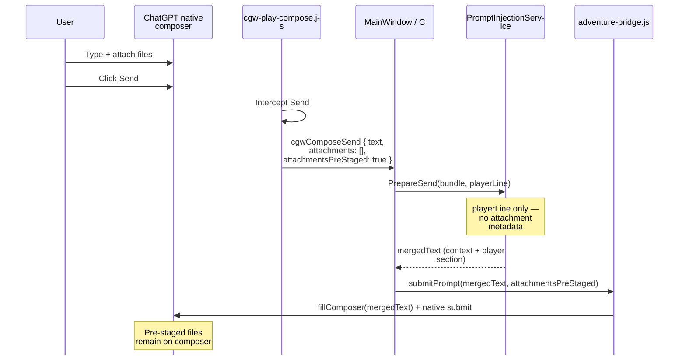

# Attachment-aware context injection

**Status:** Phase B implemented (policy modes, DOM metadata, attachment-aware trimming). Phase A shipped attachment manifest in play packets. **Phase 4 (API path parity)** remains open.

**Epic:** [CMD-292](https://linear.app/cmd0112/issue/CMD-292) · **Issue:** [CMD-297](https://linear.app/cmd0112/issue/CMD-297) · **Policy:** [injection-policy-adr.md](../injection-policy-adr.md)

**Related:** [Play view](../adventure-panel.md#4-play-view) · [Chat file I/O feasibility](../chat-file-io-feasibility.md) · [Instruction vs sources](../instruction-sources-paradigm.md)

Phase A adds an `=== ATTACHMENTS (staged with this turn) ===` block to play packets when native attachments are detected. Phase B adds richer metadata from DOM scrape, `AttachmentContextMode` branching, filename token enrichment for story cards, and attachment-only turn display lines.

This document describes why attachment-aware context matters, what still degrades without Phase B+, and a phased design for branching injected context based on what the user attached.

---

## Problem statement

Interactive-fiction play turns are not always plain text. A player may:

- Send **text only** (classic IF turn)
- Attach an **image** (character reference, map, scene sketch) with little or no caption
- Attach a **PDF or document** (lore dump, handout) alongside a short instruction
- Use **attachment-only** sends (empty composer text, file conveys the turn)

The narrator model receives:

1. **Injected context** — scenario, state, lore cards, transcript, etc. (wrapper-built)
2. **Visible user content** — player line in the composer + ChatGPT-native multimodal attachments

Those two channels should be **coherent**. Phase A adds a basic attachment manifest; Phase B+ adds filename/MIME metadata, policy modes, and attachment-aware trimming.

---

## Current architecture (post native-composer default)



### What the host knows today

| Signal | Native path | Legacy wrapper path |
|--------|-------------|---------------------|
| Player text | Yes (`cgwComposeSend.text`) | Yes |
| Attachment bytes | No | Yes (`attachments[]` base64) |
| Attachment count | Boolean only (`attachmentsPreStaged`) | Yes |
| Filenames / MIME | No | Yes (`Name`, `MimeType`) |
| Attachment-only turn allowed | Yes (empty line + `attachmentsPreStaged`) | Yes |

Native intercept payload (simplified):

```javascript
// cgw-play-compose.js — triggerNativeSend()
{
  type: "cgwComposeSend",
  text: text,
  attachments: [],
  attachmentsPreStaged: hasAttachments,  // boolean from DOM heuristics
}
```

### Where context is built

```csharp
// PromptInjectionService.cs
public static PromptInjectionPrepareResult PrepareSend(AdventureBundle bundle, string userText)
{
    var trimmedUser = userText.Trim();
    var ctx = PromptPacketBuilder.BuildContext(bundle, trimmedUser);
    var packet = PromptPacketBuilder.Build(bundle, trimmedUser);
    // ...
}
```

`trimmedUser` is passed to `BuildContext` as **`searchHint`**, which drives:

- Story card triggering (`TriggerStoryCards`)
- Entity excerpt selection (`BuildEntityExcerpts`)

```csharp
// PromptPacketBuilder.cs
var searchText = (searchHint + " " + bundle.Summary.RollingSummary).ToLowerInvariant();
var triggered = TriggerStoryCards(bundle, searchText);
```

With an attachment-only send, `searchHint` is empty → card/entity relevance falls back to rolling summary only.

### Display line vs packet

For thread stamping (`__cgwStampUserTurnDisplay`), the host sets `displayPlayerLine`:

```csharp
// MainWindow.PlayInjection.cs
var displayPlayerLine = playerLine;
if (string.IsNullOrWhiteSpace(displayPlayerLine) && pendingAttachments.Count > 0)
{
    displayPlayerLine = string.Join(", ", pendingAttachments.Select(a => a.Name));
}
```

This filename fallback runs only when **`pendingAttachments`** (wrapper path) is populated. Native pre-staged sends pass `attachments: []` and `attachmentsPreStaged: true`, so attachment-only native turns get an **empty display line** in the adventure log UI.

---

## Gaps and user-visible symptoms

| Gap | Symptom |
|-----|---------|
| No attachment metadata in `PrepareSend` | Same fat/thin packet whether the turn is text, image, or PDF |
| Empty `searchHint` on attachment-only sends | Fewer story cards and entity excerpts triggered |
| No MIME-specific narrator guidance | Model may treat a map image like casual chat art instead of in-world reference |
| Native display line | Adventure transcript shows blank player line for file-only turns |
| Redundant context with vision | Large lore blocks + image attachment may waste tokens or dilute focus |
| Thin packets + attachments | Project-delegated lore may not mention “use the attached image as …” |

These are not bridge failures — sends succeed — but **narrative quality and log fidelity** suffer.

---

## Design goals

1. **Correctness** — Injected instructions should match turn modality (text vs image vs document).
2. **Minimal DOM fragility** — Prefer metadata scrape over re-uploading bytes on the native path.
3. **Backward compatibility** — Legacy wrapper composer keeps working; new types are additive.
4. **Configurable policy** — Adventure/play settings can tune how aggressive context trimming is when files are attached.
5. **Testability** — Attachment context should be unit-testable in C# without a live WebView.

---

## Proposed model: `AttachmentContext`

Introduce a small immutable snapshot consumed by packet building:

```csharp
public sealed class AttachmentContext
{
    public bool HasAttachments { get; init; }
    public bool PreStagedInNativeComposer { get; init; }
    public IReadOnlyList<AttachmentDescriptor> Items { get; init; } = [];

    public bool IsAttachmentOnly(string playerLine) =>
        HasAttachments && string.IsNullOrWhiteSpace(playerLine);

    public bool HasImages => Items.Any(i => i.Kind == AttachmentKind.Image);
    public bool HasDocuments => Items.Any(i => i.Kind == AttachmentKind.Document);
}

public sealed class AttachmentDescriptor
{
    public required string Name { get; init; }
    public string? MimeType { get; init; }
    public AttachmentKind Kind { get; init; }  // Image, Document, Audio, Unknown
}
```

**Kind inference** (host-side, no bytes required):

| MIME prefix / extension | Kind |
|-------------------------|------|
| `image/*` | Image |
| `application/pdf`, `text/*`, Office Open XML | Document |
| `audio/*` | Audio |
| else | Unknown |

Extend prepare API:

```csharp
public static PromptInjectionPrepareResult PrepareSend(
    AdventureBundle bundle,
    string userText,
    AttachmentContext? attachments = null)
```

Call sites: `SendPlayPromptAsync`, copy-packet preview, utility jobs that mirror play sends (if applicable).

---

## Metadata collection

### Phase A — Native DOM scrape (recommended first)

At intercept time, enrich `cgwComposeSend` using existing bridge helpers:

- `nativeComposerShowsAttachments()` — already used for boolean
- `nativeComposerAttachmentReady()` — file input `files` when preview not visible
- New: `listNativeComposerAttachments()` in `adventure-bridge.js`

Scrape targets (best-effort, aligned with existing selectors in `nativeComposerShowsAttachments`):

- File input `files[].name` and inferred MIME from extension
- Attachment chip `aria-label` / visible filename text in composer footer
- Image preview `alt` or nearby label

Payload shape:

```javascript
{
  type: "cgwComposeSend",
  text: "...",
  attachmentsPreStaged: true,
  attachmentMeta: [
    { name: "tavern-map.png", mimeType: "image/png", kind: "image" }
  ]
}
```

**No base64** on the default path — ChatGPT already holds the bytes.

### Phase B — Wrapper path (unchanged bytes, richer meta)

Legacy `pendingAttachments` already include `Name` and `MimeType`. Map directly to `AttachmentDescriptor` in `ChatGptPlayComposeInjection` before `SendPlayPromptAsync`.

### Phase C — Optional API alignment

When sends use `ChatGptConversationSendService.SendUserMessageWithAttachmentsAsync` (API path), reuse the same `AttachmentContext` builder so DOM and API paths share policy logic. See [chat-file-io-feasibility.md](../chat-file-io-feasibility.md).

---

## Policy: `AttachmentSendPolicy`

Centralize branching in one place (new static class or methods on `PromptPacketBuilder`):

```csharp
internal static class AttachmentSendPolicy
{
    public static AttachmentSendMode Classify(AdventureBundle bundle, string playerLine, AttachmentContext? att)
    {
        if (att is not { HasAttachments: true })
            return AttachmentSendMode.TextOnly;

        if (att.IsAttachmentOnly(playerLine))
            return att.HasImages ? AttachmentSendMode.ImagePrimary : AttachmentSendMode.DocumentPrimary;

        if (att.HasImages)
            return AttachmentSendMode.TextWithImage;

        return AttachmentSendMode.TextWithDocument;
    }
}
```

### Suggested packet adjustments per mode

| Mode | Context changes | Player section |
|------|-----------------|----------------|
| **TextOnly** | Current behavior | `=== PLAYER TURN ===` + line |
| **TextWithImage** | Add short `=== ATTACHMENT GUIDANCE ===` (treat image as in-scene reference; do not describe UI) | Unchanged |
| **ImagePrimary** | Trim transcript depth; widen card trigger using **filename tokens** in `searchHint`; strong guidance to interpret image as the player’s action/intent | Synthetic line: `[Player attached: {names}]` or setting-driven placeholder |
| **TextWithDocument** | Note that lore may be in the file; avoid duplicating long scenario blocks if document likely repeats them | Unchanged |
| **DocumentPrimary** | Thin state + summary; instruct narrator to read attached doc as player submission | Synthetic line as above |

Filename token example for `searchHint`:

```
searchHint = playerLine + " " + string.Join(" ", attachmentMeta.Select(a => Path.GetFileNameWithoutExtension(a.Name)))
```

### MIME-specific guidance blocks (examples)

**Image** (injected once per turn, kept short):

```
=== ATTACHMENT GUIDANCE ===
The player attached an image. Treat it as in-world visual reference (character, location, map, or prop).
Describe what the characters perceive; do not mention uploads, files, or ChatGPT.
```

**PDF / document:**

```
=== ATTACHMENT GUIDANCE ===
The player attached a document. Use its contents as authoritative for this turn if they extend or override typed text.
Prefer substance from the attachment over repeating long scenario text already in project sources.
```

Guidance text should respect `UseContextTags` — either a tagged `instructions` block or a dedicated `[[cgw:attachments]]` tag if we extend the tag schema.

---

## Adventure settings (optional)

Add to `AdventureSettings` (names tentative):

| Setting | Default | Purpose |
|---------|---------|---------|
| `AttachmentContextMode` | `Auto` | `Auto` \| `Full` \| `Minimal` — override trimming |
| `AttachmentOnlyPlaceholder` | `"[Attached file]"` | Display + synthetic player line |
| `InjectAttachmentGuidance` | `true` | Toggle MIME guidance blocks |

`Minimal` would drop transcript sections and cap lore cards when `HasImages` to reduce vision+text competition.

---

## Display line fix (quick win)

Independent of full policy, fix native attachment-only display:

1. Pass `attachmentMeta` from compose message to `SendPlayPromptAsync`
2. When `displayPlayerLine` is empty and `attachmentsPreStaged`, set:

```csharp
displayPlayerLine = attachmentMeta.Count > 0
    ? string.Join(", ", attachmentMeta.Select(a => a.Name))
    : settings.AttachmentOnlyPlaceholder;
```

This aligns native behavior with the existing wrapper fallback.

---

## Implementation phases

### Phase 0 — Documentation and tracing

- [x] Document gaps (this file)
- [x] Add `PlaySendTrace` fields: `attachmentCount`, `attachmentKinds`, `attachmentOnly`

### Phase 1 — Metadata plumbing

- [x] `listNativeComposerAttachments()` in `adventure-bridge.js`
- [x] Extend `cgwComposeSend` / `PlayComposeSendEventArgs` with `AttachmentMeta`
- [x] `AttachmentContext` + mapping in C#
- [x] Display line fix for native pre-staged

### Phase 2 — Packet policy

- [x] `AttachmentSendPolicy` + `PrepareSend(bundle, userText, attachments)`
- [x] Filename tokens in `searchHint`
- [x] MIME guidance sections in `PromptPacketBuilder`
- [x] Unit tests: text-only unchanged; image-primary trims; card trigger from filename

### Phase 3 — Settings and polish

- [x] Play settings UI for `AttachmentContextMode` / placeholder
- [x] Merged preview shows attachment mode badge
- [x] Update [adventure-panel.md](../adventure-panel.md) and [ui-components.md](../ui-components.md)

### Phase 4 — API path parity

- [ ] Share `AttachmentContext` with `ChatGptConversationSendService`
- [ ] Validate with [chat-file-io-feasibility.md](../chat-file-io-feasibility.md) checklist

---

## Testing strategy

| Layer | Tests |
|-------|--------|
| **JS** | `listNativeComposerAttachments` parsing from fixture HTML; `cgwComposeSend` includes `attachmentMeta` |
| **C# unit** | `AttachmentSendPolicy.Classify`; `PrepareSend` snapshot tests per mode; `searchHint` includes filename tokens |
| **Integration** | Extend `PlayComposeNativeTests` class in `PlayComposeBehaviorTests.cs`: prestaged + meta → non-empty `displayPlayerLine` |
| **Manual** | Image-only send → adventure log shows filename; narrator references image in fiction voice |

---

## Risks and mitigations

| Risk | Mitigation |
|------|------------|
| ChatGPT DOM changes break filename scrape | Best-effort meta; fall back to `attachmentsPreStaged` boolean + generic guidance |
| Over-trimming context on image turns | `AttachmentContextMode.Full` escape hatch; trace packet hash in `play-send-trace.jsonl` |
| Duplicate instructions (Project + attachment guidance) | Thin packet: shorter guidance; rely on Project custom instructions for role |
| Filename triggers wrong lore cards | Tokenize and match whole words; exclude common extensions |
| Multimodal token limits | `Minimal` mode; cap guidance block size |

---

## Open questions

1. **Should synthetic player lines appear in the injected packet, the display stamp only, or both?**  
   Recommendation: both for attachment-only turns so the model and adventure log stay aligned.

2. **Multiple mixed attachments (image + PDF)?**  
   Combine guidance blocks; classify as `TextWithDocument` if any document present unless player line clearly references the image only.

3. **Utility / generation jobs**  
   Jobs that do not use the composer should pass `AttachmentContext.Empty` explicitly.

4. **Context tag schema**  
   Add `[[cgw:attachments]]` for stripping in continuous view, or fold into `instructions`?

---

## Key files (touch list)

| Area | Files |
|------|--------|
| Native intercept | `ChatGPT_files/cgw-play-compose.js` |
| DOM attachment discovery | `ChatGPT_files/adventure-bridge.js`, `ChatGPT_files/cgw-composer-dom.js` |
| Host send | `ChatGPTWrapper/MainWindow.PlayInjection.cs`, `ChatGPTWrapper/ChatGptPlayComposeInjection.cs` |
| Packet build | `ChatGPTWrapper/Adventure/Services/PromptInjectionService.cs`, `PromptPacketBuilder.cs` |
| Models | `ChatGPTWrapper/Adventure/Models/AdventureMetadata.cs` (settings) |
| Bridge submit | `ChatGPTWrapper/Adventure/Services/AdventureTurnService.cs` |
| Tests | `tests/ChatGPTWrapper.ApiDiagnostics/Unit/PlayComposeBehaviorTests.cs` (`PlayComposeNativeTests` class), `AttachmentContextModeTests.cs` |

---

## Summary

Native-composer Play is the right default for attachment stability, but the host must **know what was attached** to build appropriate injected context. The smallest valuable increment is **attachment metadata on `cgwComposeSend` + display line fix**; the strategic increment is **`AttachmentContext`-aware `PrepareSend`** with per-modality policy so story cards, trimming, and narrator guidance match text-only, image, and document turns.
