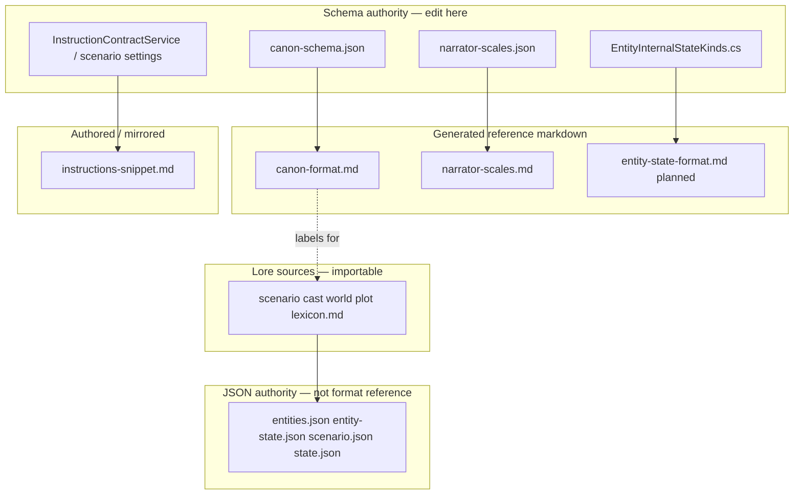
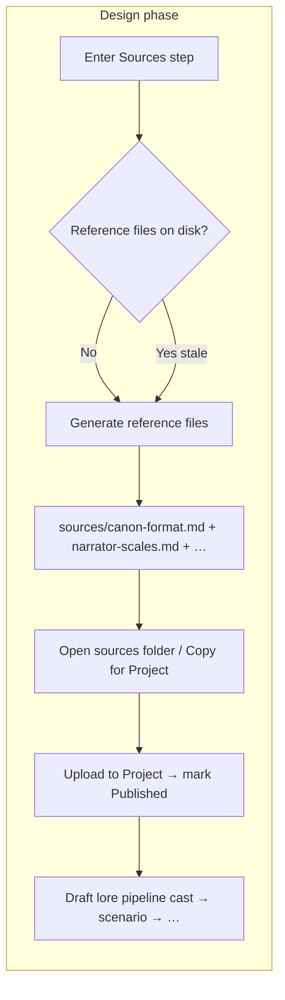

# Canon reference document paradigm

**Status:** Design canon (2026-07-04)  
**Linear:** [CMD-465](https://linear.app/cmd0112/issue/CMD-465) (canon vs play state lifecycle) · [CMD-476](https://linear.app/cmd0112/issue/CMD-476) (audit & alignment)  
**Related:** [instruction-sources-paradigm.md](../user/instruction-sources-paradigm.md) (four-channel delegation) · [canon-schema.md](../reference/canon-schema.md) (registry) · [entity-internal-state-model.md](entity-internal-state-model.md) · [entity-canon-state-lifecycle.md](entity-canon-state-lifecycle.md)

---

## Purpose

This document defines the **canon reference document paradigm**: which files tell the model *how to read and write* adventure data (format, field labels, presets, boundaries) — as distinct from **lore sources** (what the world *is*) and **JSON authority** (what the wrapper stores).

It complements [instruction-sources-paradigm.md](../user/instruction-sources-paradigm.md), which covers channel delegation (instructions vs sources vs packets vs utility jobs). This paradigm covers:

1. **Taxonomy** — reference vs lore vs JSON vs instruction contract  
2. **Delivery** — Project RAG, play packet inline, utility job inline, design citations, SIO publish  
3. **Generation** — schema-driven vs authored mirrors  
4. **Change integration** — how to evolve the paradigm when schema, jobs, or layers change  

---

## Principles

| # | Principle |
|---|-----------|
| P1 | **Schema authority is code/JSON, not markdown.** Reference `.md` files are *projections* of `canon-schema.json`, `narrator-scales.json`, and (future) internal-state schema — never the other way around. |
| P2 | **Do not hand-edit generated reference files.** Regenerate via **Refresh export** (`ProjectSourceExportService`). |
| P3 | **One fact, one home.** Field labels live in the schema registry; job guides *cite* reference docs or generated summaries — they do not fork competing label lists. |
| P4 | **Reference ≠ lore.** Format/label/preset docs are not imported into `entities.json`. Lore sources are sectioned and importable. |
| P5 | **Layer segregation (CMD-465).** Canon profile reference (`canon-format.md`) describes `entities.json` + exported sources. Play-state reference (planned) describes `entity-state.json`. Never merge live state into canon export paths. |
| P6 | **Delivery matches consumer.** Play narrator → RAG + slim inline hints. Design/import/edit jobs → full inline reference block. Extract/state jobs → compact guide + SIO JSON + optional schema appendix. |
| P7 | **Publish is explicit.** Generated references follow the same **Refresh export → upload → Published** lifecycle as lore (see [instruction-sources-paradigm § Manual publish](../user/instruction-sources-paradigm.md#manual-publish-walkthrough)). |

---

## Document taxonomy



### Tier definitions

| Tier | Examples | Edited by | Imported to JSON? | Typical Project role |
|------|----------|-----------|-------------------|---------------------|
| **A — Schema authority** | `canon-schema.json`, `CanonSchemaBootstrap`, `narrator-scales.json`, `EntityInternalStateKinds` | Developers | N/A | N/A |
| **R — Generated reference** | `canon-format.md`, `narrator-scales.md`, *(planned)* `entity-state-format.md` | **Generator only** | **No** | Upload for RAG; inlined in some utility jobs |
| **M — Authored mirror** | `instructions-snippet.md` | Author + wrapper generate | **No** (instruction domain) | Optional RAG; primary path is custom instructions box |
| **L — Lore** | `cast.md`, `world.md`, … | Author / sync / AI review | **Yes** | RAG + pointer-scored inline excerpts |
| **J — JSON** | `entities.json`, `entity-state.json`, … | Wrapper / review queue | **Is** JSON | Utility SIO publish; not a “reference doc” |

`SectionSchema.ReferenceSourceFiles` today: **`canon-format.md`**, **`narrator-scales.md`** only.  
`instructions-snippet.md` is reference-adjacent but not in that array (instruction channel).

---

## Reference document catalog

### `canon-format.md`

| Attribute | Value |
|-----------|--------|
| **Generator** | `CanonFormatGenerator` ← `CanonSchemaRegistry` / `canon-schema.json` |
| **Purpose** | Section templates, field labels, party/NPC rules, JSON mapping, entity field definitions, extendedFields policy |
| **Consumers** | Design prompts (`CanonFormatReferenceService.BuildSpecificationCitation`), `propose_json_import`, `propose_source_edits`, `bootstrap_sections` (inline block); play narrator via **Project RAG only** |
| **Not used for** | Import to JSON; inline play packet excerpts (`ContextPointerResolver` excludes reference files from scoring) |

Code: `CanonFieldReferenceService` builds prompt summaries and generator appendix sections (entity field tables).

### `narrator-scales.md`

| Attribute | Value |
|-----------|--------|
| **Generator** | `NarratorScalesGenerator` ← `narrator-scales.json` |
| **Purpose** | Preset definitions (length, detail, tone, difficulty, violence, pacing, …) |
| **Consumers** | Play packet `=== ACTIVE NARRATOR SCALES ===` quick ref + pointers; Project RAG; narrator settings UI |
| **Not used for** | Entity/canon field labels |

### `instructions-snippet.md`

| Attribute | Value |
|-----------|--------|
| **Generator** | `InstructionContractService.BuildInstructionsSnippetFileContent` |
| **Purpose** | Mirror of narrator **contract** (boundaries, portrayal, addendum) — not world lore |
| **Consumers** | Play inline fallback (`BuildContractSections`); design refinement; optional Project RAG |
| **Authority** | Project **custom instructions** box remains primary; snippet is mirror |

See [instruction-contract-guide.md](../user/instruction-contract-guide.md).

### `entity-state-format.md`

| Attribute | Value |
|-----------|--------|
| **Generator** | `EntityInternalStateFormatGenerator` ← `EntityInternalStateSchema` / kinds |
| **Purpose** | Model-facing schema for `entity-state.json` blocks (mood, trust, quest progress, …) |
| **Consumers** | `propose_entity_state` inline appendix; Project RAG; **not** canon import |
| **Rationale (CMD-465)** | Keeps play-state field defs visually separate from canon profile in `canon-format.md` |

Generated via **Generate reference files** on Design → Sources or full Refresh export.

---

## Delivery channel matrix

How each reference reaches the model:

| Document | Project Files (RAG) | Play packet inline | Utility job inline (full) | Utility job inline (summary) | Design prompt citation | SIO publish |
|----------|--------------------|--------------------|---------------------------|------------------------------|------------------------|-------------|
| `canon-format.md` | **Yes** (recommended) | Pointers only; excluded from excerpt scoring | `propose_json_import`, `propose_source_edits`, `bootstrap_sections` | `extract_entities` guide text only; label summary via `CanonFieldReferenceService` | Cast/world/plot specs | No |
| `narrator-scales.md` | **Yes** | Active selectors + “open § …” | Rarely full inline | Quick ref block every play send | — | No |
| `instructions-snippet.md` | Optional mirror | Inline fallback profile | `propose_source_edits` excerpt | — | Instructions refinement | No |
| `entity-state-format.md` | **Planned** | State skim in composed packet (CMD-473) | `propose_entity_state` **planned** | Field path list today | — | `entity-state.json` via SIO |
| Lore `*.md` | **Yes** | Pointer-scored excerpts (fallback: inline) | Excerpts in source edit jobs | Context pointers | Step drafts | No |
| `entities.json` | Via RAG if uploaded | Entity index / pointers | SIO + guide | SIO | — | **Yes** (extract jobs) |
| `entity-state.json` | Via RAG if uploaded | Not yet (CMD-473) | SIO | SIO | — | **Yes** (state job) |

**Local LLM leg:** `ForLocalInference` omits heavy `canon-format` inline blocks (`UtilityJobPromptBuilder`, `GenerationJobHandlers`) to avoid steering small models off JSON contract.

---

## Consumer map (code)

| Service | Role |
|---------|------|
| `CanonFormatGenerator` / `CanonFormatTemplate` | Generate `canon-format.md` |
| `CanonFieldReferenceService` | Entity field tables, extendedFields policy, prompt cast summaries |
| `CanonFormatReferenceService` | `BuildPromptBlock`, `BuildSpecificationCitation` for jobs/design |
| `NarratorScalesGenerator` | Generate `narrator-scales.md` |
| `NarratorScalesResolver` | Play packet scale quick reference |
| `InstructionContractService` | Snippet + inline contract sections |
| `ProjectSourceExportService` | Refresh export writes generated references |
| `ContextPointerResolver` | Excludes `ReferenceSourceFiles` from baseline excerpt scoring |
| `EntityExtractionService` | Guide + `GetPublishableReferenceFileNames` (entities/scenario JSON) |
| `EntityInternalStateProposalService` | Guide + entity-state.json SIO |
| `GenerationJobGuideService` | Built-in instruction bodies; **seed versions** on change |

---

## Relationship to canon vs play state (CMD-465)

| Layer | Storage | Reference document |
|-------|---------|-------------------|
| **Canon profile** | `entities.json` + lore export | `canon-format.md` |
| **Entity play state** | `entity-state.json` | `entity-state-format.md` |
| **Session state** | `state.json` | Documented in job guides (`update_state`); no separate reference file today |
| **Instruction contract** | Settings + snippet | `instructions-snippet.md` |

Cross-layer rules (seed, promotion, continuity) belong in [entity-canon-state-lifecycle.md](entity-canon-state-lifecycle.md) — not duplicated here.

---

## Design phase — materializing reference files in `sources/`

Authors need reference documents **on disk under `sources/`** early in Design — before lore drafting and Project upload — without hunting through Source Manager for a full export.

### Current state (partial)

| Surface | What works | Gap |
|---------|------------|-----|
| **Design → Sources / Review** | Pipeline checklist lists `canon-format.md` and `narrator-scales.md` under “Project reference files” ([CMD-311](https://linear.app/cmd0112/issue/CMD-311)) | Missing files say “Refresh export in **Source Manager**” — no in-design generate |
| **Cast step callouts** | Open file, copy to clipboard, open Source Manager | No **Generate into sources** action |
| **`ReferenceDefinitions`** registry | New reference kinds can register for checklist + design prompts | Not wired to a shared export API |
| **`ProjectSourceExportService.Export`** | Writes reference files during **full** refresh | No lightweight **reference-only** export for Design |

Reference files do **not** require lore JSON to exist — generators read schema/settings only. Design should expose that explicitly.

### Target workflow (implementation plan)



**Principle:** One obvious Design action materializes **all** registered reference files into `sources/`; lore export remains separate (full Refresh export or per-step sync after JSON exists).

### Implementation deliverables ([CMD-477](https://linear.app/cmd0112/issue/CMD-477))

| # | Deliverable | Detail |
|---|-------------|--------|
| D1 | **`ProjectSourceExportService.ExportReferenceFiles(bundle, mode)`** | Writes only `SectionSchema.ReferenceSourceFiles` (+ future `entity-state-format.md` when added). Updates manifest entries. Does **not** require sectioned lore. Reuses `WriteIfNotEmpty` + generators. |
| D2 | **`AdventureDesignSourcePromptService.ReferenceDefinitions` as single registry** | Adding a reference doc = one registry entry → checklist row + export list + (optional) design callout. |
| D3 | **Design Sources checklist actions** | Header button **Generate reference files**; per-row **Generate** when `PresentOnDisk == false`; optional **Regenerate all** when schema version advanced. |
| D4 | **Design callout parity** | Replace “run Refresh export in Source Manager” with in-place generate + open + copy (mirror existing canon-format / narrator-scales menus). |
| D5 | **Optional auto-generate on Sources step enter** | Setting: `AutoGenerateReferenceSourcesOnDesignSourcesStep` (default **on** for new adventures) — calls D1 if any reference missing. |
| D6 | **Publish helper strip** | After generate: **Open sources folder** · **Copy all reference files** (zip or sequential clipboard hints) · **Open Source Manager** (mark Published) — stay in Design flow. |
| D7 | **Tests** | ApiDiagnostics: `ExportReferenceFiles` writes both files; checklist row `PresentOnDisk` true after generate; manifest entries created. |

**Out of scope for D1–D7:** Uploading to ChatGPT Project via API (still manual mark Published or existing API sync); full lore export during Cast step before entities exist.

### Design-time model consumption (after files exist)

| Consumer | How reference reaches the model in Design |
|----------|-------------------------------------------|
| **Design thread** (`design_adventure`) | `CanonFormatReferenceService.BuildSpecificationCitation` on cast/world/plot specs; first-turn canon-format guidance ([design-ai-tools-context.md](design-ai-tools-context.md)) |
| **Design source prompts** | Embedded citation blocks in step specifications |
| **Project Files** | Author uploads generated `sources/*.md` — RAG during design + play |
| **Utility jobs** (design catalog) | Inline `BuildPromptBlock` for import/source edit / bootstrap |

Design generation (D1) **feeds** Project upload; it does not replace inline job citations for worker runs.

### Registering a new reference file (checklist)

When adding a reference tier **R** document, extend:

1. `SectionSchema.ReferenceSourceFiles` (or dedicated array if split from instruction snippet)
2. `AdventureDesignSourcePromptService.ReferenceDefinitions`
3. Generator + `ProjectSourceExportService.ExportReferenceFiles` loop
4. Design checklist / callout (generic handler by registry — avoid one-off menus per file)
5. This paradigm § catalog + change integration checklist
6. [instruction-sources-paradigm.md](../user/instruction-sources-paradigm.md) publish walkthrough if upload order changes

---

## Change integration workflow

Use this checklist whenever reference material or the schema behind it changes. **Do not skip steps** — reference drift is a common source of AI import errors and party field loss.

### Triggers

| Trigger | Typical scope |
|---------|----------------|
| New/renamed/retired **canon field** or kind | Schema + generator + migration + docs |
| New **extendedFields** policy or Tier A–C promotion | `CanonFieldReferenceService`, generator, job guides |
| New **internal state block/field** | Kinds C# + planned state format generator + `propose_entity_state` guide |
| New **utility job** needing format hints | Guide + delivery decision (inline vs RAG vs SIO) |
| **Narrator scale** preset/dimension | `narrator-scales.json` + generator |
| **Instruction contract** field | `InstructionContractService` + snippet regen |
| Canon/state **segregation or promotion** policy | Lifecycle doc + job boundaries + reference split |

### Integration checklist (ordered)

#### 1. Schema authority

- [ ] Update **`canon-schema.json`** (and `CanonSchemaBootstrap` if bootstrap fallback must match)
- [ ] For internal state: **`EntityInternalStateKinds.cs`** / blocks
- [ ] Run **`CanonSchemaDriftTests`** / registry tests

#### 2. Code consumers

- [ ] **`CanonFieldMapper`** / import-export if canon fields changed
- [ ] **`EntitiesStructuredFieldMigrationService`** if legacy blobs or extendedFields aliases change
- [ ] **`CanonFieldReferenceService`** — prompt summaries and generator appendix
- [ ] **Entity models** (`CharacterEntry`, `CompanionEntry`, …) if new typed properties

#### 3. Generators

- [ ] **`CanonFormatGenerator`** — section templates, field definition tables, extendedFields policy
- [ ] **`NarratorScalesGenerator`** if scale catalog changed
- [ ] *(Future)* **`EntityInternalStateFormatGenerator`**

#### 4. Job instructions

- [ ] Update **`GenerationJobGuideService`** built-in bodies for affected jobs
- [ ] Bump **`SeedVersion`** constants (`EntityExtractionService`, `EntityInternalStateProposalService`, `JsonImportSeedVersion`, etc.)
- [ ] Prefer **citing** `canon-format.md` / summaries over duplicating long label lists in guides
- [ ] **`UtilityJobPromptBuilder`**: confirm local vs remote inference still correct

#### 5. Tests

- [ ] **`CanonFormatGeneratorTests`** — key strings present
- [ ] Migration / mapper tests for field promotion
- [ ] Prompt snapshot tests if present (`CanonFormatReferenceServiceTests`)

#### 6. Regenerate on-disk references

- [ ] **Design (reference-only):** run **Generate reference files** on Design → Sources ([CMD-477](https://linear.app/cmd0112/issue/CMD-477)) — or full **Refresh export** when lore also changed
- [ ] **Source Manager / Play settings:** **Refresh export** for full `sources/` sync
- [ ] Verify `sources/canon-format.md`, `narrator-scales.md`, *(future)* `entity-state-format.md`
- [ ] **Do not** hand-edit generated files

#### 7. Project publication

- [ ] Re-upload changed reference files to ChatGPT Project → **Files**
- [ ] Mark **Published** in Source Manager (row shows **Needs republish** until confirmed)
- [ ] Optional: **Probe project** / compare if verifying remote copy

#### 8. Documentation

- [ ] Update **[canon-schema.md](../reference/canon-schema.md)** if registry/consumers changed
- [ ] Update **[entity-internal-state-model.md](entity-internal-state-model.md)** if state schema changed
- [ ] Update **this paradigm** if delivery rules or taxonomy changed
- [ ] Update **[instruction-sources-paradigm.md](../user/instruction-sources-paradigm.md)** if channel delegation changed
- [ ] Add entry to **[docs/INDEX.md](../INDEX.md)** if new hub doc

#### 9. Linear / tracking

- [ ] Link PR to epic **[CMD-465](https://linear.app/cmd0112/issue/CMD-465)** or child when implementing segregation/promotion work
- [ ] Close **[CMD-476](https://linear.app/cmd0112/issue/CMD-476)** items when audit gaps addressed

### Versioning conventions

| Artifact | Version bump when |
|----------|-------------------|
| `canon-schema.json` top-level `schemaVersion` | Breaking canon field/kind changes |
| `EntitiesDocument.CurrentSchemaVersion` | Entity JSON shape migration |
| `EntityInternalStateDocument.CurrentSchemaVersion` | State JSON shape migration |
| Job **`SeedVersion`** | Instruction body meaningfully changed (forces guide re-sync on utility thread) |
| `AdventureMetadata.CanonSchemaVersion` | Loaded on adventure open via `CanonSchemaMigrationService` |

### Anti-patterns

| Do not | Why |
|--------|-----|
| Hand-edit `canon-format.md` on disk | Next Refresh export overwrites; Project copy drifts from generator |
| Add long field label lists only in job guides | Duplicates registry; diverges from `canon-format.md` |
| Inline full reference in every play packet | Token cost; reference files exist for RAG |
| Put live `entity-state` fields in `cast.md` export | Violates layer segregation; breaks source sync semantics |
| Import reference files to `entities.json` | Reference tier is non-importable by design |
| Change labels without alternateLabels / migration | Breaks existing adventures and Project files |

---

## Decision guide: where does new model-facing text go?

```text
Is it world fact (who/what/where)?
  → Lore source (cast/world/plot) → entities.json on import

Is it how to format/label canon entries?
  → canon-schema.json → canon-format.md → cite in job guides

Is it mutable per-entity play state (mood, trust, progress)?
  → entity-state.json → entity-state-format.md (planned) → propose_entity_state

Is it narrator behavior contract (boundaries, tone rules)?
  → Instruction settings → instructions-snippet.md + custom instructions

Is it response-length/violence/difficulty preset meaning?
  → narrator-scales.json → narrator-scales.md

Is it one job's JSON response shape?
  → GenerationJobGuideService only (+ UtilityResponseSchemaRegistry) — not a reference file
```

---

## Roadmap (CMD-465 / CMD-476 / CMD-477)

| Item | Issue | Notes |
|------|-------|-------|
| **Design Sources reference file generation** | [CMD-477](https://linear.app/cmd0112/issue/CMD-477) | `ExportReferenceFiles` + checklist Generate button |
| Entity canon-state lifecycle doc | [CMD-468](https://linear.app/cmd0112/issue/CMD-468) | Mapping table + promotion pipeline |
| `entity-state-format.md` generator | [CMD-476](https://linear.app/cmd0112/issue/CMD-476) | Pair with internal state schema; add to D2 registry |
| Align extract/state guides to published refs | [CMD-476](https://linear.app/cmd0112/issue/CMD-476), [CMD-470](https://linear.app/cmd0112/issue/CMD-470) | Reduce duplicate label prose |
| Play packet composed profile+state | [CMD-473](https://linear.app/cmd0112/issue/CMD-473) | Read model without disk merge |
| Baseline vs live canon labels | [CMD-469](https://linear.app/cmd0112/issue/CMD-469) | Schema notes / Opening * labels |

---

## Related documents

| Doc | Role |
|-----|------|
| [instruction-sources-paradigm.md](../user/instruction-sources-paradigm.md) | Four channels, publish walkthrough |
| [instruction-channels.md](../user/instruction-channels.md) | Terminology |
| [canon-schema.md](../reference/canon-schema.md) | Registry architecture |
| [prompt-construction-guide.md](../user/prompt-construction-guide.md) | Packet assembly details |
| [entity-canon-change-paradigm.md](../user/entity-canon-change-paradigm.md) | Entity edit → source sync |
| [runtime-canon-schema-plan.md](../plans/runtime-canon-schema-plan.md) | Schema-as-data epic history |

---

*Last updated: 2026-07-04*
