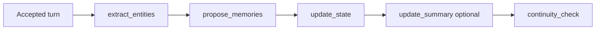

# Continuity check — job redesign

**Status:** Design note (2026-07-04)  
**Index:** [ai-tools-review-index.md](ai-tools-review-index.md)  
**Parent review:** [ai-tools-jobs-review.md](ai-tools-jobs-review.md)  
**Related:** [utility-source-file-io.md](utility-source-file-io.md) · [entity-extract-update-workflow.md](entity-extract-update-workflow.md)

---

## Decision (2026-07-04)

| Topic | Decision |
|-------|----------|
| Job fate | **Keep — refine** (concept solid; prompt/job design needs rework) |
| Source file I/O | **Input-only** — add to `UtilitySourceFileIoCatalog`; output stays JSON `{ warnings }` |
| Cross-job context | **`continuity-brief.json`** (or equivalent packet section) — distilled, not raw sibling outputs |
| Apply / UX | Keep dismiss-only warnings; **Resolve with AI** hub action → AIT-T2-F; structured warning fields forward-compatible |
| Track B | Keep hybrid local heuristics + AI; do not move full semantic continuity local for P0 |
| Auto post-turn | **Default on** with **debounce** (`AutoContinuityCheck = true`; skip when unchanged) |

---

## Problem

`continuity_check` is meant to be a holistic **second pass** after turn-scoped jobs (extract, memories, optional summary): read-only QA across transcript, world model, state, and canon.

Today it under-delivers because:

| Gap | Effect |
|-----|--------|
| Not in source file I/O catalog | No authoritative `entities.json` / published canon via TASK-SCOPED pointers |
| Job core inlines SUMMARY, STATE, ENTITY INDEX, RECENT TURNS | Overlaps assembler story block and lore channel (`Required` canon slices) — stale/partial views |
| DOM attach for `scenario.json` / `state.json` only | Inconsistent with publish→pointer canon used by `extract_entities` |
| Thin instruction guide (~3 lines) | No check categories, severity rubric, or cite-refs requirement |
| No cross-job brief | Cannot detect conflicts among same-turn pending proposals |
| Injection-first scheduling | Continuity may run **in parallel** with siblings — brief must not assume review queue is populated |

Apply path is sound: clear warnings → `ContinuityService.Analyze` (local) → merge AI warnings; dismiss-only hub.

---

## Role in the pipeline



- `GenerationJobScheduler` appends continuity **last** among post-turn auto jobs.
- **Legacy** mode: sequential `await` — same-turn sibling proposals are usually in review when continuity runs.
- **Injection-first**: jobs may queue in parallel or bundle per send — continuity must **depend on settled siblings** or read from job-result store, not only review queues.

---

## Recommendation 1: Input-only source file I/O

Add `continuity_check` to `UtilitySourceFileIoCatalog` for **reads only** (no delimited file scrape on output).

Follow the `extract_entities` pattern: publish → TASK-SCOPED pointer → ephemeral retrieve instruction. See [utility-source-file-io.md](utility-source-file-io.md).

### Publish per run

| File | Purpose |
|------|---------|
| `entities.json` | Authoritative world model (not lossy index string) |
| `scenario.json` | Registry / premise baseline |
| `state.json` | Location, objectives, flags |
| `summary.json` (or `.md`) | Rolling digest as retrievable artifact |
| `cast.md` / `world.md` / `plot.md` | When manifest-ready — pointer to author-published sources |

Canonical path shape: `sources/cgw-utility-io/{adventureKey}/continuity-check/{runKey}/in/{fileName}`.

### Slim job core

Replace large inline sections with:

1. Pointer block — mandatory retrieve of published inputs.
2. `continuity-brief.json` (see below).
3. **One** transcript source — story block **or** published `recent-turns.json` slice; use `UtilityStoryContextDedup` to avoid triple duplication with assembler.

Retire DOM attach as the **primary** JSON canon path; optional manual attach only for edge cases.

---

## Recommendation 2: `continuity-brief.json`

Distilled cross-job context — not raw sibling job outputs.

```json
{
  "triggerTurnIndex": 42,
  "lastContinuityCheckAt": "2026-07-04T07:00:00Z",
  "priorWarningFingerprints": ["dual-location-warden-greta"],
  "pendingProposals": {
    "entities": [
      { "kind": "create", "name": "Greyford Gate", "summary": "…" },
      { "kind": "update", "id": "warden-greta", "summary": "…" }
    ],
    "memories": [{ "title": "…", "summary": "…" }],
    "state": { "location": "…", "summary": "…" },
    "summary": { "proposedDigestExcerpt": "…" },
    "sourceEdits": [{ "targetFile": "world.md", "rationale": "…" }]
  },
  "recentAcceptedMemories": [
    { "title": "…", "acceptedAt": "…" }
  ]
}
```

### What the brief enables

| Check type | Example |
|------------|---------|
| Proposal vs proposal | Entity says Greta missing; memory says Greta ambushed party |
| Proposal vs state | Pending location update vs `state.json` |
| Proposal vs canon | Pending source edit vs `plot.md` essentials |
| Suppress noise | Prior / dismissed warning fingerprints |
| Accepted canon | Don't warn about events author already accepted as memories |

### Sources for brief assembly

**Include:** pending review queues (entity, memory, **state**, summary, source edits); same-turn captures from `UtilityJobResultStore` when parallel scheduling cannot guarantee order.

**Exclude:** full proposal bodies, design-cluster jobs, retired card jobs.

---

## Recommendation 3: Instruction guide expansion

Structure like extract/update dual methodology:

1. **Retrieve** published files via pointers (mandatory).
2. **Check categories** (explicit):
   - Transcript ↔ `state.json` (location, objectives, time)
   - Transcript ↔ `entities.json` (inventory, NPC presence, dead/lost items)
   - Transcript ↔ published canon (`cast` / `world` / `plot`)
   - `summary.json` ↔ transcript (digest drift)
   - Internal consistency of `continuity-brief.pendingProposals`
   - Cross-file consistency among published inputs
3. **Severity rubric:**
   - `info` — ambiguity; pending proposals that may reconcile on accept
   - `warning` — likely inconsistency with accepted canon/state
   - `high` — direct contradiction with accepted state, entities, or canon
4. **Output** — extend warnings (parser may ignore extras initially):

```json
{
  "warnings": [
    {
      "message": "…",
      "severity": "warning",
      "category": "entity-state",
      "refs": ["state.json#location", "turn:41"]
    }
  ]
}
```

---

## Recommendation 4: Scheduling (injection-first)

| Mode | Behavior today | Target |
|------|----------------|--------|
| Legacy sequential | Siblings complete before continuity | Keep |
| Injection-first parallel | Continuity may race siblings | **Defer** continuity until same-turn siblings settle, **or** build brief from job outputs + review store |

Do not auto-queue continuity in the same parallel batch as extract/memories without a dependency rule.

Optional cost control: skip auto-run if no new accepted turn since `LastCheckedAt`.

---

## Recommendation 5: Local + AI hybrid

Keep `ContinuityService.Analyze` as fast baseline (expand heuristics slowly). Worker AI adds cross-document semantic reasoning when inputs are authoritative.

Do **not** fold continuity into `process_turn` — different scope, scheduling, and output semantics.

Do **not** use source I/O for warning **output** — not a file-revision job.

Dismiss-only UX is fine for P0; structured `refs` / `category` enable future links to `propose_source_edits` / entity update jobs / [resolve_continuity_warning](resolve-continuity-warning-workflow.md) (AIT-T2-F) / [update_state](update-state-workflow.md) (AIT-T1-A).

---

## Implementation priority

| P | Item |
|---|------|
| P0 | Input source I/O + slim job core |
| P0 | `continuity-brief.json` + injection-first ordering fix |
| P1 | Instruction guide (categories, severity, cite refs) |
| P2 | Structured warning fields in parser |
| P3 | Auto-run debounce / skip-when-unchanged |

---

## Code touchpoints (expected)

| Area | File |
|------|------|
| Catalog | `UtilitySourceFileIoCatalog.cs` |
| Publish dispatch | `UtilitySourceFileIoPublishService.cs` / `UtilityPublishSession` |
| Prompt | `GenerationJobHandlers.BuildContinuityCheckPrompt` |
| Brief builder | New service (e.g. `ContinuityBriefService`) |
| Guide | `GenerationJobGuideService` |
| Scheduler | `GenerationJobScheduler` / `PlayUtilityInjectionService` / outbox dependency |
| Apply | `ApplyContinuityCheck` (optional extra JSON fields) |

---

## Open questions (for implementation pass)

*None — locked 2026-07-04.*

| # | Question | Decision |
|---|----------|----------|
| 1 | Auto post-turn every turn when enabled, or debounce? | **Debounce** — skip when no new accepted turn since `LastCheckedAt` |
| 2 | Warning hub: dismiss-only long-term, or link to fix jobs? | **Dismiss-only** default + **Resolve with AI** → AIT-T2-F |
| 3 | Session-wide scope only, or add exchange-scoped manual mode? | **Session-wide** for auto; exchange-scoped manual → P3 backlog |
| 4 | Publish `recent-turns.json` vs assembler story block? | **Assembler story block** only |

See [ai-tools-backlog-tracker.md § Staged decisions](ai-tools-backlog-tracker.md#staged-decisions-locked-2026-07-04).

---

*Last updated: 2026-07-04*
