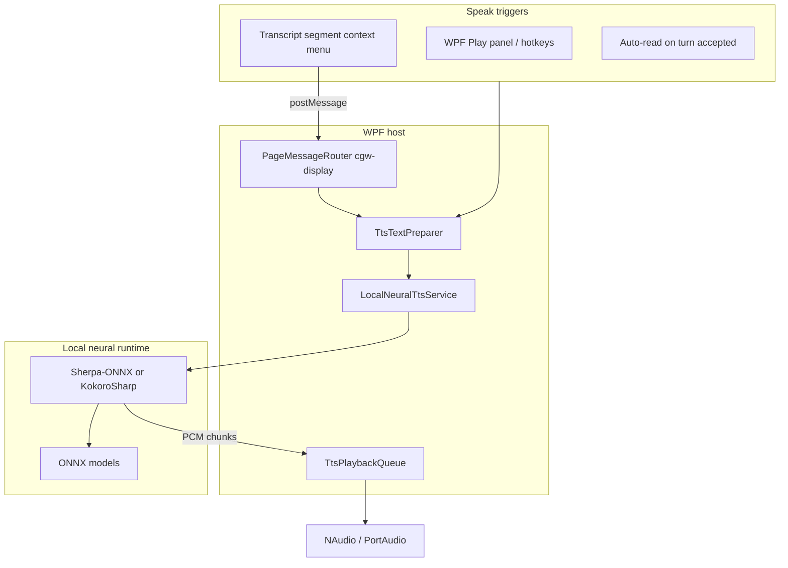

# Local neural text-to-speech (TTS)

**Status:** Icebox — not committed to a milestone. Tracked in Linear as [CMD-277](https://linear.app/cmd0112/issue/CMD-277).

**Related:** [architecture.md](../architecture.md) · [adventure-panel.md](../adventure-panel.md) · [injected-assets.md](../injected-assets.md)

This document captures a possible later enhancement: **high-quality, fully offline narration** in the wrapper using bundled local neural TTS — no paid APIs.

There is **no TTS implementation in the repo today**.

---

## Goal

Let authors hear narrator responses (and optionally cast dialogue) during **Play** and from **transcript overlays** (Continuous / Weave), with voice quality noticeably better than built-in Windows SAPI / Web Speech voices, at zero recurring cost.

---

## Why local neural (Option 3)

| Approach | Quality | Cost | Offline | Fit for wrapper |
|----------|---------|------|---------|-----------------|
| Web Speech API (injected JS) | System-dependent | Free | Yes | Easy prototype; low ceiling |
| Windows `SpeechSynthesizer` | Decent on Win11 | Free | Yes | Simple WPF; not “high quality” |
| **Local neural (Sherpa-ONNX / Kokoro)** | Good–very good | Free (open models) | Yes | **Recommended if pursuing this enhancement** |
| Piper CLI subprocess | Good | Free | Yes | Archived upstream; poor for production |
| Unofficial cloud (`edge-tts`, etc.) | Good | Free but fragile | No | Avoid |

**Recommended engines (pick one for implementation):**

1. **Sherpa-ONNX** — actively maintained; official C# bindings; supports Piper-derived VITS models, Kokoro, and others; streaming PCM callbacks (`offline-tts-play` example).
2. **KokoroSharp** (`KokoroSharp.CPU` NuGet) — fastest C# spike; strong English voices; less flexible voice catalog than Sherpa.

Original [Piper](https://github.com/rhasspy/piper) is archived (Oct 2025); use Sherpa-converted Piper models from [sherpa-onnx `tts-models` releases](https://github.com/k2-fsa/sherpa-onnx/releases/tag/tts-models).

---

## Architecture (host-side synthesis)

Synthesis should run in the **WPF host**, not inside WebView2 injected JS. The app already routes display features through `cgw-display` and turn text through adventure services.



### Suggested components

| Component | Role |
|-----------|------|
| `LocalNeuralTtsService` | Load model once; `SpeakAsync(text, voiceId, ct)` |
| `TtsTextPreparer` | Strip CGW tags, markdown → plain text, sentence chunking |
| `TtsPlaybackQueue` | Cancel on new turn; pause/stop; sentence queue |
| `TtsSettings` | Enable flag, default voice, speed, auto-read |
| Bridge handler (`cgw-display`) | `ttsSpeak`, `ttsStop`, optional `getVoices` |

### Text sources

| Source | When to use |
|--------|-------------|
| Accepted turn `NarratorText` | Primary for Play auto-read (stable, filtered) |
| Transcript segment plain text | “Read segment” / “Read from here” from CV/Weave |
| Live stream DOM | Avoid — incomplete until turn accepted |

Reuse `TranscriptTextSanitizer.Sanitize` and `StripContextTags` before speech. Add markdown stripping and sentence splitting in `TtsTextPreparer`.

### Model distribution

Suggested layout under config root:

```
%LocalAppData%\ChatGPTWrapper\
  tts\
    models\          # downloaded or bundled ONNX bundles
    voices.json      # installed voice catalog
```

| Phase | Strategy |
|-------|----------|
| MVP | Download on first enable (~25–60 MB per voice) |
| Polished | Bundle one English narrator voice in publish |
| Power users | Voice manager UI for additional Sherpa/Kokoro voices |

---

## Integration points (existing code)

| Hook | File / concept |
|------|----------------|
| Turn narrator text | `TurnRecord.NarratorText`, `TurnTimelineService`, `PlayTurnScopeService` (wait until capture complete) |
| Bridge channel | `BridgeProtocol.ChannelDisplay` (`cgw-display`) |
| Message routing | `PageMessageRouter`, `ChatGptContinuousViewInjection` |
| Transcript segments | `continuous-transcript-view.js`, `weave-transcript-view.js` |
| Settings | `WrapperSettingsStore`, `PreferencesHubDialog`, `UiChromeSettings` |
| Entity → voice (phase 2) | `PhraseHighlightRule.EntityId`, cast entities in `entities.json` |

---

## Phased implementation (when promoted from Icebox)

### Phase A — Prove engine

- Add Sherpa-ONNX or KokoroSharp to `ChatGPTWrapper`
- Download one English model to `%LocalAppData%\ChatGPTWrapper\tts\models\`
- Dev-only “Speak test line” using sanitized sample text
- Measure cold-load latency and quality on target hardware

### Phase B — Play narration

- Singleton `LocalNeuralTtsService`; model loaded once when enabled
- Auto-read on accepted `NarratorText` (Play mode)
- Global enable + voice picker in preferences
- Stop/cancel on new send or explicit hotkey

### Phase C — Transcript UX

- Context menu: Read segment, Read from here, Stop
- Same text prep on host regardless of trigger

### Phase D — Cast voices (optional)

- Map cast entities to ONNX speaker IDs / Kokoro voices
- Dialogue-aware splitting (quoted speech vs narrator prose)

---

## Expectations and constraints

**Gains:** Audiobook-ish quality; fully offline; no API keys; consistent across Native / Continuous / Weave modes.

**Limits:** Sentence-batch synthesis (not token-by-token during ChatGPT streaming); first-chunk latency after cold start; publish size grows with bundled voices (~25–150 MB).

**Performance ballpark (CPU, medium model):** cold load 1–3 s; ~0.3–1.5 s per ~15-word sentence; faster than real-time overall once warm.

**Licensing:** Sherpa-ONNX, Kokoro, and Piper-derived models are generally open source — verify per-model licenses on HuggingFace before redistribution.

---

## Alternatives considered (not recommended for this enhancement)

- **Web Speech API only** — insufficient quality target; keep as optional fallback if neural engine unavailable.
- **Piper CLI** — process-per-utterance overhead; upstream archived.
- **DOM-trigger ChatGPT read-aloud** — fragile, no control over packet filtering or cast voices.
- **Unofficial Edge TTS scrapers** — network-dependent, ToS gray area.

---

## Promotion criteria (Icebox → Backlog)

Consider scheduling when:

- Play / Weave reading experience is stable and a narrator-audio UX is prioritized
- Publish size budget allows optional voice bundles or a download-on-first-use flow is acceptable
- A spike on Sherpa-ONNX or KokoroSharp confirms acceptable latency on typical author hardware
