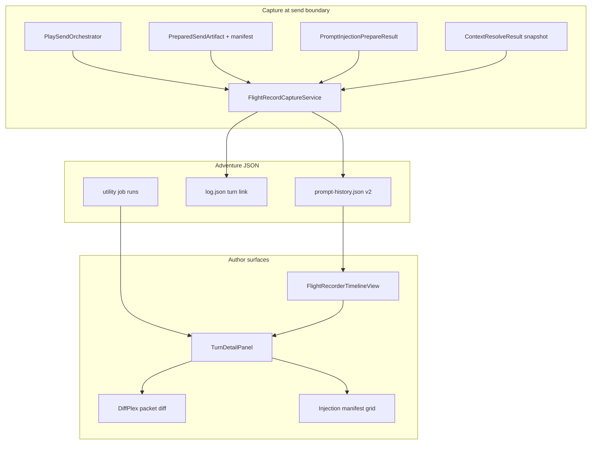

# Narrative Flight Recorder — Implementation Plan

> **Archive note (2026-06-29):** Phases 0–6 largely shipped ([CMD-402](https://linear.app/cmd0112/issue/CMD-402) epic). UI: `FlightRecorderPanel` on Play settings → History. Normative schema: [narrative-flight-recorder-adr.md](../narrative-flight-recorder-adr.md). Remaining: blocked-send logging (v1.1), cross-adventure search (out of scope).

Comprehensive execution plan for **SVA-03** — per-turn observability of what the model received: injection breakdown, budget, delegation mode, utility lanes, and delivery correlation.

**Tracker:** [strategic-value-additions-tracker.md]() (SVA-03)  
**Companion ADR (normative):** [narrative-flight-recorder-adr.md](../narrative-flight-recorder-adr.md)  
**Linear epic:** [CMD-402](https://linear.app/cmd0112/issue/CMD-402) (CMD-403–409)  
**Related:** [injection-policy-adr.md](../injection-policy-adr.md) · [injection-policy-implementation-plan.md](../injection-policy-implementation-plan.md) · [play-send-orchestration-adr.md](../play-send-orchestration-adr.md) · [play-send-orchestration-implementation-plan.md](../play-send-orchestration-implementation-plan.md) · [prompt-construction-guide.md](../prompt-construction-guide.md) · [data-model-reference.md](../data-model-reference.md) · [utility-job-context-assembly.md]()

---

## Executive summary

### Product principles

| # | Principle | Implementation meaning |
|---|-----------|------------------------|
| **1** | **Read-only first** | v0 is an audit viewer — no replay, re-send, or edit-from-history until trust is proven. |
| **2** | **Same bytes as send** | Flight records store the **delivered** merged packet hash and manifest captured at orchestrator send time — not a re-prepare. |
| **3** | **Correlate end-to-end** | One turn links: player line → prepared artifact → delivery outcome → prompt record → narrator response → optional utility runs. |
| **4** | **Honest injection** | Section manifest shows reference vs delta vs trimmed — same taxonomy as Next send preview ([CMD-295](https://linear.app/cmd0112/issue/CMD-295)). |
| **5** | **Local-only authority** | Records live in adventure JSON; never uploaded to ChatGPT Project or cloud. |

### What success looks like

- After a verified play send, authors open **Flight Recorder** and see a virtualized timeline of turns.
- Selecting a turn shows: packet mode/profile, section manifest, pointer list (ALWAYS RETRIEVE / THIS TURN), trimmed sections, attachment mode, utility injection flags, and full merged packet text.
- Diff against prior turn highlights what changed in injection (DiffPlex).
- Utility jobs triggered by or bundled with that send appear as linked rows with `UtilityContextManifest` summary.
- `play-send-trace.jsonl` events for the send run are reachable from the turn detail (copy path / inline subset).
- Golden test: fixture adventure send produces a flight record whose hash matches `PreparedSendArtifact` and whose sections match `InjectionSectionManifestBuilder`.

### Non-goals (v1)

- Re-send or edit-and-resend from history.
- Shadow evaluation or A/B retrieval (SVA-01 / CMD-381).
- Craft analytics charts (SVX-05) — prose metrics are a separate surface.
- Cross-adventure flight search (SVX-15).
- Real-time streaming of partial packets during compose debounce (preview stays in Play panel).

---

## Current state (baseline)

### Already in place (reuse)

| Area | Evidence | Reuse in this plan |
|------|----------|-------------------|
| Prompt audit file | `prompt-history.json` → `PromptHistoryDocument` / `PromptHistoryEntry` | Extend schema v2; migrate v1 entries |
| Send-time recording | `AdventureTurnService.RecordPrompt` ← `PlaySendOrchestrator` | Enrich capture payload at this callsite |
| Injection manifest | `InjectionSectionManifestBuilder`, `InjectionSection`, `TrimmedSection` | Persist per-turn snapshot |
| Prepare result | `PromptInjectionPrepareResult` (sections, trimmed, profile, pointers) | Source of truth at prepare; attach to artifact |
| Preview UI | `InjectionPreviewCoordinator`, `PlayPromptInjectionDialog` History tab | History tab becomes entry point; dedicated recorder view |
| Utility manifest | `UtilityContextManifest` / `UtilityContextManifestRecord` (CMD-397) | Link utility runs to turn id |
| Send trace | `PlaySendTrace`, `play-send-trace.jsonl` | Correlate by run id / timestamp |
| Pointer resolution | `ContextPointerResolver`, `ContextResolveResult`, `PointerSource` | Serialize pointer decisions per turn |
| Turn linkage | `TurnRecord.Id`, `TurnRecord.PromptPacketHash` | Foreign keys for correlation |
| Diff library | DiffPlex (listed in tracker technology matrix) | Packet + manifest diffs |

### Known gaps (motivation)

| Gap | Symptom | This plan addresses |
|-----|---------|---------------------|
| Minimal history schema | `PromptHistoryEntry` = text + hash only | Phase 1 — `FlightRecordEntry` v2 |
| Manifest not persisted | Preview shows sections; history does not | Phase 1 — capture at send |
| No pointer audit | Authors cannot see why a section was THIS TURN | Phase 2 — pointer snapshot |
| History buried in injection dialog | 40-row list, no diff, no utility correlation | Phase 3 — dedicated timeline UI |
| Trace disconnected | `play-send-trace.jsonl` requires manual grep | Phase 4 — run id on record |
| Orchestrator artifact thin | `PreparedSendArtifact` lacks manifest/profile | Phase 0 — artifact enrichment contract |
| Utility jobs opaque | Job runs exist; hard to tie to play send | Phase 4 — `LogTurnLink` / job correlation |

### Prerequisites (load-bearing — partial OK)

| Prerequisite | Status | Impact on flight recorder |
|--------------|--------|---------------------------|
| [Play send orchestration](../play-send-orchestration-implementation-plan.md) Phases 0–2 | **Done** (artifact + orchestrator send path) | Record at orchestrator success boundary |
| Play send Phases 3–6 | In progress | Delivery verification fields on record; blocked sends may still log preflight failures (v1.1) |
| [Injection policy CMD-292](../injection-policy-implementation-plan.md) | ADR accepted; manifest partial | Section taxonomy must match preview |
| [Utility context assembly CMD-390]() | v1 landed | Utility manifest linking |
| Thread-canonical play CMD-348+ | In flight | Turn index / thread message correlation |

**Rule:** Flight recorder v0 can ship when **verified sends** record rich manifests. Logging failed/blocked sends is Phase 5 stretch.

---

## Target architecture



### Core types (conceptual)

```csharp
// ChatGPTWrapper/Adventure/Models/FlightRecordEntry.cs

sealed class FlightRecordEntry
{
    public Guid Id { get; set; }
    public Guid? TurnId { get; set; }
    public DateTimeOffset At { get; set; }
    public string PlayerLine { get; set; }
    public string PacketText { get; set; }
    public string PacketHash { get; set; }
    public FlightRecordKind Kind { get; set; }  // PlaySend, Start, Handoff, UtilityInline
    public FlightInjectionSnapshot Injection { get; set; }
    public FlightDeliverySnapshot? Delivery { get; set; }
    public string? PlaySendTraceRunId { get; set; }
}

sealed class FlightInjectionSnapshot
{
    public PacketProfile Profile { get; set; }
    public PacketDelegationMode DelegationMode { get; set; }
    public AttachmentSendMode AttachmentMode { get; set; }
    public bool WasTrimmed { get; set; }
    public List<InjectionSectionRecord> Sections { get; set; }
    public List<TrimmedSectionRecord> Trimmed { get; set; }
    public List<ContextPointerRecord> BaselinePointers { get; set; }
    public List<ContextPointerRecord> ThisTurnPointers { get; set; }
    public int MergedCharCount { get; set; }
    public int ContextCharCount { get; set; }
    public bool HasUtilityInjection { get; set; }
    public int UtilitySectionCount { get; set; }
}

sealed class FlightDeliverySnapshot
{
    public string Channel { get; set; }      // Api, DomBootstrap, DomFallback
    public string Outcome { get; set; }      // ok, failed, blocked
    public string? FailureCode { get; set; }
    public string? ConversationId { get; set; }
    public bool Verified { get; set; }
}
```

**Storage:** Extend `prompt-history.json` with `SchemaVersion = 2`. v1 entries remain readable; migration copies `PacketText`/`PacketHash` into v2 shape with empty `Injection`.

**Distinct from `log.json`:** `log.json` is the accepted narrative transcript (player + narrator). `prompt-history.json` is the **audit of merged packets sent** — flight recorder is the UI over the latter plus links to the former.

---

## Phase breakdown

| Phase | Name | Status |
|-------|------|--------|
| **0** | ADR + schema spike | **Done** |
| **1** | Rich capture at send | **Done** |
| **2** | Pointer snapshot | **Done** |
| **3** | Read-only timeline UI | **Done** (`FlightRecorderPanel`) |
| **4** | Utility + trace correlation | **Done** |
| **5** | Diff + compare UX | **Done** (`FlightPacketCompareDialog`) |
| **6** | Docs, export, diagnostics | **Done** — v1.1 blocked-send logging open |

**Total:** ~16–26 focused sessions.

### Linear epic ([CMD-402](https://linear.app/cmd0112/issue/CMD-402))

| Phase | Issue | Focus |
|-------|-------|-------|
| 0 | [CMD-403](https://linear.app/cmd0112/issue/CMD-403) | ADR spike |
| 1 | [CMD-404](https://linear.app/cmd0112/issue/CMD-404) | `FlightRecordCaptureService` |
| 2 | [CMD-405](https://linear.app/cmd0112/issue/CMD-405) | Pointer snapshot |
| 3 | [CMD-406](https://linear.app/cmd0112/issue/CMD-406) | Timeline UI |
| 4 | [CMD-407](https://linear.app/cmd0112/issue/CMD-407) | Utility + trace correlation |
| 5 | [CMD-408](https://linear.app/cmd0112/issue/CMD-408) | DiffPlex compare |
| 6 | [CMD-409](https://linear.app/cmd0112/issue/CMD-409) | Documentation |

---

## Phase 0 — ADR & schema spike

### Deliverables

- [x] [narrative-flight-recorder-adr.md](../narrative-flight-recorder-adr.md) (this repo)  
- [x] JSON schema sample in ADR appendix  
- [x] Decision: extend `prompt-history.json` vs new `flight-records.json` → **extend**  
- [x] Linear epic [CMD-402](https://linear.app/cmd0112/issue/CMD-402) + child issues CMD-403–409  
- [ ] ADR sign-off (accept status on [CMD-403](https://linear.app/cmd0112/issue/CMD-403))

### ADR decisions to lock

| Question | Recommendation |
|----------|----------------|
| Capture point | `PlaySendOrchestrator` after verification, same moment as `RecordPrompt` |
| Failed sends | v1: skip; v1.1: optional `FlightRecordKind.Blocked` with preflight reason |
| Prepare vs send drift | Store artifact hash + `PreparedAt`; flag if prepare timestamp ≠ send timestamp > N seconds |
| Pointer storage | Lean records: machineId, title, source, score, mode — omit `BodyCache` |
| Size cap | Ring buffer policy: keep last N entries full text; older entries manifest-only (configurable, default N=200) |
| Start/handoff packets | Separate `FlightRecordKind`; same snapshot shape |

### Acceptance gate

- [ ] ADR reviewed; schema v2 fields frozen for Phase 1
- [ ] Tracker + INDEX cross-links updated

---

## Phase 1 — Rich capture at send

### Goals

Every verified play send persists a v2 flight record with injection manifest matching preview.

### New / modified files

| File | Role |
|------|------|
| `Adventure/Models/FlightRecordEntry.cs` | v2 entry + snapshot records |
| `Adventure/Models/PromptHistoryDocument.cs` | `SchemaVersion`; migrate v1 → v2 |
| `Adventure/Services/FlightRecordCaptureService.cs` | Build snapshot from prepare result + artifact |
| `Adventure/Services/PlaySend/PreparedSendArtifact.cs` | Add `InjectionSnapshot` or parallel manifest fields |
| `Adventure/Services/PlaySend/PreparedSendArtifactBuilder.cs` | Carry sections/trimmed/profile from prepare |
| `Adventure/Services/AdventureTurnService.cs` | `RecordPrompt` → delegate to capture service |
| `Adventure/Services/PlaySend/PlaySendOrchestrator.cs` | Pass delivery snapshot into capture |
| `Adventure/Stores/AdventureStore.cs` | Migration on load if `SchemaVersion < 2` |

### Tasks

| Task | Detail |
|------|--------|
| Enrich artifact | `PreparedSendArtifact` carries `IReadOnlyList<InjectionSection>`, `Trimmed`, `Profile`, `DelegationMode`, `AttachmentSendMode`, `HasUtilityInjection` |
| Single prepare path | `PreparedSendArtifactBuilder` already wraps `PlayPacketPrepareSession` — propagate full `PromptInjectionPrepareResult` |
| Capture service | `FlightRecordCaptureService.CapturePlaySend(bundle, turn, artifact, delivery, playerLine)` |
| Schema migration | On load: v1 entries get `Injection = null`, still listable |
| Save scope | `AdventureSaveScope.PromptHistory` unchanged |

### Tests

| Test | Assert |
|------|--------|
| `FlightRecordCaptureServiceTests` | Fixture prepare → snapshot sections match `InjectionSectionManifestBuilder` |
| `PromptHistoryMigrationTests` | v1 JSON loads; saves as v2 |
| `PlaySendOrchestrationTests` (extend) | Orchestrator records v2 entry on success |
| Round-trip | Serialize/deserialize `FlightRecordEntry` stable |

### Acceptance gate

- [ ] New sends write v2 records with non-empty `Injection.Sections`
- [ ] `PacketHash` matches `PreparedSendArtifact.Hash`
- [ ] No regression in `ExportService` / backup for adventures with v2 history

---

## Phase 2 — Pointer snapshot

### Goals

Authors see **why** each lore section appeared in ALWAYS RETRIEVE vs THIS TURN buckets.

### Tasks

| Task | Detail |
|------|--------|
| Capture pointers | At prepare time, serialize `ContextResolveResult.Baseline` and `.ThisTurn` |
| Record mapping | `ContextPointerRecord`: MachineId, FileName, SectionId, Title, Kind, Score, Source, Mode |
| UI chips | Detail panel: grouped by bucket; color by `PointerSource` |
| Future hook | Reserve `Source = SemanticMatch` for SVA-01 — no implementation in this phase |

### Tests

| Test | Assert |
|------|--------|
| `FlightRecordPointerSnapshotTests` | Known fixture player line → expected pointer sources/scores |

### Acceptance gate

- [ ] Turn detail shows ≥1 THIS TURN pointer with source label on fixture adventure
- [ ] Baseline pointers distinct from THIS TURN in UI

---

## Phase 3 — Read-only timeline UI

### Goals

Dedicated **Flight Recorder** surface — not buried in injection dialog settings.

### UI placement options (pick in Phase 0 ADR)

| Option | Pros | Cons |
|--------|------|------|
| **A. Adventure panel tab** | Always visible during play | Panel crowded |
| **B. Play injection dialog tab upgrade** | Reuse existing History tab | Still modal |
| **C. New modeless `FlightRecorderWindow`** | Deep inspection | Another window |

**Recommendation:** Start with **B** (upgrade History tab) for v0; extract to **A** tab in v1 if authors live there.

### New files

| File | Role |
|------|------|
| `Views/FlightRecorder/FlightRecorderPanel.xaml` | Timeline + detail split |
| `Views/FlightRecorder/FlightRecorderViewModel.cs` | Bind `PromptHistory.Entries` v2 |
| `Views/FlightRecorder/InjectionManifestGrid.xaml` | Reuse `InjectionSectionViewModel` mapping |

### Timeline row (per turn)

| Column | Source |
|--------|--------|
| Turn # | `log.json` index via `TurnId` |
| Time | `FlightRecordEntry.At` |
| Player line | Truncated `PlayerLine` |
| Mode | `Profile` + `DelegationMode` badge |
| Sections | Included count / trimmed count |
| Delivery | Verified icon + channel |
| Utility | Icon if `HasUtilityInjection` or linked job |

### Detail panel

| Section | Content |
|---------|---------|
| Injection manifest | Grid: section id, kind, status, chars, note |
| Pointers | Baseline / THIS TURN lists |
| Packet | Read-only text box; copy button |
| Links | Open turn in log view; open utility run (Phase 4) |

### Acceptance gate

- [ ] Manual QA: 10-turn session — scroll timeline, inspect manifest, copy packet
- [ ] Virtualization: 200+ entries scroll without UI freeze
- [ ] Smoke checklist row in [adventure-panel.md](../adventure-panel.md)

---

## Phase 4 — Utility + trace correlation

### Goals

Link flight records to utility job runs and send trace for debugging.

### Tasks

| Task | Detail |
|------|--------|
| Trace run id | `PlaySendTrace` begin scope → id stored on `FlightRecordEntry` |
| Utility link | When bundled utility injection: store job ids on record; when worker job triggered by turn, `LogTurnLink` on `UtilityJobRunRecord` |
| Detail panel | "Utility runs" sub-list with lane, manifest summary, link to AI Actions preview |
| Trace excerpt | Last N trace events for run id (read from jsonl tail — optional) |

### Existing hooks

- `UtilityContextManifestRecord` on generation job runs (CMD-397)
- `LogTurnLink` model (in repo) for turn ↔ job association
- `PlaySendTraceMapper` events

### Acceptance gate

- [ ] Bundled utility send shows utility section count + link to job manifest
- [ ] Trace run id copyable from detail panel

---

## Phase 5 — Diff + compare UX

### Goals

Answer "what changed since last turn?" without raw text hunt.

### Tasks

| Task | Detail |
|------|--------|
| DiffPlex integration | Side-by-side or inline diff: current vs previous `PacketText` |
| Manifest diff | Section added/removed/trimmed badges vs prior turn |
| Pointer diff | New THIS TURN pointers highlighted |
| Compare picker | Optional: compare any two turns (checkbox select) |

### Acceptance gate

- [ ] Diff highlights injection block changes on narrator override turn
- [ ] Manifest diff shows trim when budget tightens

---

## Phase 6 — Docs, export, diagnostics

### Deliverables

- [x] Update [data-model-reference.md](../data-model-reference.md) — `prompt-history.json` v2
- [x] Update [prompt-construction-guide.md](../prompt-construction-guide.md) — flight recorder cross-link
- [x] `ExportService` includes v2 fields (full `PromptHistory` in `ExportFullJson` — documented)
- [x] Troubleshooting: "inspect flight record for turn N" in [troubleshooting.md](../troubleshooting.md)
- [x] Smoke checklist in [adventure-panel.md](../adventure-panel.md#flight-recorder-play-settings--history)
- [ ] Tracker SVA-03 → **Done** when CMD-406 manual QA + epic sign-off

---

## Relationship to other initiatives

| Initiative | Relationship |
|------------|--------------|
| **SVA-01** (CMD-381) | Semantic pointers appear as `PointerSource.SemanticMatch` in snapshot; flight recorder validates retrieval quality |
| **SVA-04** (Phase 2b) | Continuity/memory UIs link to same turn ids; flight recorder is debug backing |
| **SVX-05** (craft analytics) | Reads `log.json` prose; flight recorder reads packets — complementary |
| **SVX-12** (playtesting harness) | Asserts expected pointers in flight records |
| **SVX-22** (scene UI) | Future: widget manifest on flight record (stretch) |
| **CMD-292** | Section taxonomy must stay aligned with preview manifest |
| **CMD-295** | Preview honesty = flight recorder honesty |

---

## Test plan (manual QA — Needs Manual QA label)

1. Start linked adventure; play 5 turns with mixed player lines referencing different lore sections.
2. Open Flight Recorder; confirm 5 entries, verified delivery on each.
3. Turn with narrator override: manifest shows `overrides` delta section.
4. Turn with budget trim: `Trimmed` list non-empty; badge in timeline.
5. Bundled utility job send: utility flag + job link present.
6. Export adventure zip; re-import; history v2 intact.
7. Upgrade adventure with v1-only `prompt-history.json`; migration preserves entries.

---

## Risks and mitigations

| Risk | Mitigation |
|------|------------|
| `prompt-history.json` size growth | Ring buffer + manifest-only archival; optional packet text omit for old turns |
| Prepare/send manifest drift | Capture from artifact actually sent; never re-prepare for history |
| UI duplication with Next send preview | Reuse `InjectionSectionViewModel` mapping; single formatter |
| Phase 0 play send incomplete | v0 records only verified sends; document gap for blocked sends |
| Privacy | Local-only; export warning if sharing zip |

---

*Created: 2026-06-28 — SVA-03 Phase 1 implementation plan*
