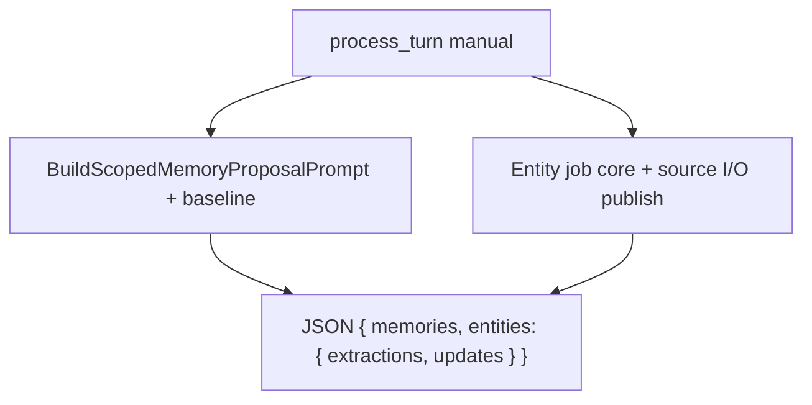

# Process exchange (`process_turn`) — catch-all review

**Status:** Design note (2026-07-04)  
**Index:** [ai-tools-review-index.md](ai-tools-review-index.md)  
**Parent review:** [ai-tools-jobs-review.md](ai-tools-jobs-review.md)  
**Related:** [entity-extract-update-workflow.md](entity-extract-update-workflow.md) · [memory-propose-refinement.md](memory-propose-refinement.md) · [update-summary-refinement.md](update-summary-refinement.md)

---

## User decisions — chat capture (2026-07-04)

| # | Question | Decision |
|---|----------|----------|
| 1 | Keep vs retire? | **Keep — manual-only** for now |
| 2 | Summary leg? | **Remove** from bundle — use `update_summary` only |
| 3 | Catalog prominence? | **Stay in AI Tools** catalog |

---

## Decisions (2026-07-04)

| Topic | Decision |
|-------|----------|
| Job fate | **Keep — refine** (manual-only composition job) |
| Auto | **Never** schedule — split jobs own post-turn |
| Catalog | **Remain in AI Tools** + More actions |
| Prompt | **Compose** sibling job cores (memory + entity legs) |
| Entity leg | Match `{ extractions, updates }` when extract workflow ships |
| Memory leg | Match [memory-propose-refinement](memory-propose-refinement.md) |
| Summary leg | **Remove** from bundle, apply path, and hidden UI toggle |

---

## Context (sibling jobs decided)

Post-turn auto pipeline is now defined separately:

| Job | Auto default | Role |
|-----|--------------|------|
| `extract_entities` | **On** | World-model extract/update |
| `propose_memories` | **On** | Event proposals |
| `update_state` | **On** (AIT-T1-A) | Session state proposals |
| `update_summary` | **On** (every 5 turns) | Rolling digest |
| `continuity_check` | **On** (debounced) | Holistic warnings |

`process_turn` was deferred until those contracts landed. **Revisit rule satisfied.**

---

## What it does today

| Aspect | Today |
|--------|--------|
| **Trigger** | Manual only — Play **More actions → Process last exchange**; AI Tools catalog |
| **Not scheduled** | `GenerationJobScheduler` does not include `process_turn` |
| **Default legs** | Memories **on**, entities **on**, summary **off** (`includeSummary` only via hidden/advanced path) |
| **Job core** | Minimal — `=== PROCESS EXCHANGE JOB ===` + scope + task list; **no** `=== EXCHANGE ===`, **no** entity index, **no** memory baseline |
| **Story profile** | 2 turn pairs, no rolling summary/entity index in assembler (same as memories) |
| **Response** | JSON object `{ memories?, entities?, summary? }` |
| **Apply** | Delegates to `ApplyMemoryArray`, `EntityExtractionService.ParseExtractionResponse` + enqueue, `SummaryReviewService.QueueProposal` |
| **Entity shape** | Flat array — **not** planned `{ extractions, updates }` dual-section |
| **Review** | Rehydrates to Memory + Entity review categories |
| **Source I/O** | None (inherits none from siblings) |

### Gaps to fix (implementation)

| Gap | Target |
|-----|--------|
| No `=== EXCHANGE ===` / baselines | Compose sibling builders |
| Monolithic guide | Pointer to leg methodologies |
| Flat `entities` array | Dual-section when extract ships |
| Summary leg | **Remove** |

---

## Target architecture



**Job core assembly:**

1. `=== PROCESS EXCHANGE JOB ===` — “Respond with one JSON object; keys: memories, entities.”
2. Memory leg — from `BuildScopedMemoryProposalPrompt` + [memory baseline](memory-propose-refinement.md).
3. Entity leg — from extract job core + publish pointers when source I/O on.
4. **No summary leg.**

**Guide:** Short pointer — follow bundled leg instructions; single JSON object response.

**Source I/O:** When entity leg included, same publish as `extract_entities` for that run.

---

## Response contract (target)

```json
{
  "memories": [ /* same as propose_memories */ ],
  "entities": {
    "extractions": [ /* ... */ ],
    "updates": [ /* ... */ ]
  }
}
```

`summary` key removed from contract and `ApplyProcessTurn`.

Until dual-section ships: accept flat `entities` array with migration diagnostic.

---

## UI

| Surface | Action |
|---------|--------|
| More actions | “Process last exchange” — memories + entities |
| AI Tools catalog | **Keep** — “Manual one-shot: memories + entities for last exchange” |
| Summary toggle | **Remove** `includeSummary` from `RunProcessLastExchangeAsync` |

---

## Implementation priority

| P | Item |
|---|------|
| P0 | Compose job core from sibling builders + memory baseline |
| P0 | Add `=== EXCHANGE ===` parity via shared scope builder |
| P1 | Entity dual-section response + apply when extract workflow ships |
| P1 | Entity source I/O publish on bundled run |
| P2 | Remove summary leg from code/UI/guide |

---

*Last updated: 2026-07-04*
