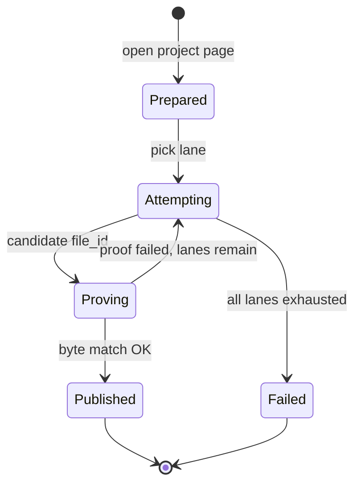

# Project source publication redesign

Companion to Linear epic [CMD-428](https://linear.app/cmd0112/issue/CMD-428).

**Status:** Architecture / implementation plan (2026-06-30)  
**Product stance:** Manual publish via Source Manager remains authoritative; API publication is **Publication lab** diagnostics only (`instruction-sources-paradigm.md`).

**Related:**

| Topic | Doc / issue |
|-------|-------------|
| Utility worker DOM attach | [utility-worker-attachment-delivery.md](utility-worker-attachment-delivery.md) · [CMD-411](https://linear.app/cmd0112/issue/CMD-411) |
| Shadow compositor | [CMD-413](https://linear.app/cmd0112/issue/CMD-413) |
| Attach worker fallback | [CMD-414](https://linear.app/cmd0112/issue/CMD-414) |
| Chat file I/O spike | [chat-file-io-feasibility.md](chat-file-io-feasibility.md) |
| Flight recorder correlation | [CMD-402](https://linear.app/cmd0112/issue/CMD-402) |

---

## Problem statement

Programmatic project source publication (`SourceSyncDialog` test upload) fails reliably on Snorlax (`g-p-*`) projects despite HTTP 200 attach responses:

| Failure mode | Example from `link-project.log` |
|--------------|----------------------------------|
| **Ghost files** | List shows 9 files; project-scoped download returns `Not found` |
| **Upsert fork** | Detail upsert `merged=9` returns new sidebar project id |
| **List confirm false negative** | Library `file_id` stored but merged list stays at 8 files |
| **Exception ladders** | Patch-on-patch catch matrices (`IsEscalatableToDom`, etc.) |

Root cause: **three incompatible ChatGPT surfaces** (register+PUT, project-files attach, library upload, detail upsert) with **inconsistent success criteria** (list count, weak attach probe, strict byte verify).

---

## Design principles

1. **One success gate:** project-scoped download + exact byte match (`ProjectSourceIntegrityVerifier`).
2. **Listing APIs are telemetry only** — never throw on list confirm for publication lanes.
3. **Publication ≠ batch sync** — different modules, different attach policy.
4. **Snorlax publication never uses detail upsert** (fork risk).
5. **DOM-first for diagnostics** on Snorlax — automate manual drag-and-drop, not reverse-engineer ghost attach APIs.
6. **Shared browser-file delivery kernel** with utility worker attachment methodology ([CMD-411](https://linear.app/cmd0112/issue/CMD-411) family).

---

## Architecture

```mermaid
flowchart TB
  subgraph kernel [Browser file delivery kernel — shared]
    Payload[DomAttachmentPayload]
    Staging[DomFileStagingCore — CDP + temp disk]
    Compositor[IDomUploadCompositorScope]
    Probe[DomFileInputProbe]
    AttachWorker[UtilityAttachWorkerService — CMD-414]
  end

  subgraph utility [Utility worker — conversation]
    UWClass[UtilityAttachmentDeliveryClassifier]
    UWLanes[Packet embed | DOM composer | Attach worker]
    UWVerify[Send / composer chips observed]
  end

  subgraph publication [Publication lab — project knowledge]
    PubClass[ProjectPublicationLaneRegistry]
    PubLanes[Browser native | Library | Register+project-files]
    PubVerify[ProjectSourceIntegrityVerifier]
  end

  kernel --> utility
  kernel --> publication
```

### Forbidden in publication

- Snorlax detail upsert (`/gizmos/snorlax/upsert` with full project body)
- `ConfirmAttachedFilesOnProjectAsync` as a throwing gate
- Weak `VerifyFilesDownloadableAfterAttachAsync` as success
- Mid-ladder ghost cleanup (defer until all lanes exhausted)

### Snorlax publication lane order (diagnostics)

| Priority | Lane | Rationale |
|----------|------|-----------|
| 1 | **Browser native** (project knowledge CDP) | Mimics manual publish; ChatGPT handles store+bind+finalize |
| 1b | **Attach worker** sub-lane ([CMD-414](https://linear.app/cmd0112/issue/CMD-414)) | Same fallback as utility worker when in-process DOM fails |
| 2 | **Library upload** | Single multipart; auto-attaches; no graph rewrite |
| 3 | **Register + project-files** | Last API resort; known ghost risk |

---

## Utility worker synergy

Utility worker and publication lab share the **browser-file delivery kernel**, not the same orchestrator or verifier.

| Shared | Utility worker | Publication lab |
|--------|----------------|-----------------|
| `DomAttachmentPayload` | ✓ | ✓ |
| CDP `setFileInputFiles` + temp staging | Composer target | Project knowledge target |
| Shadow compositor ([CMD-413](https://linear.app/cmd0112/issue/CMD-413)) | `UtilityWorkerDomSendScope` | Reuse same scope — not tab-select-only |
| Attach worker ([CMD-414](https://linear.app/cmd0112/issue/CMD-414)) | Conversation DOM fallback | Project page DOM fallback |
| Lane classifier pattern | `UtilityAttachmentDeliveryClassifier` | `ProjectPublicationLaneRegistry` |
| Delivery lane tracing | `attachmentDeliveryLane` on utility results | `publicationLane` on publication run record |

| **Not shared** | | |
| DOM target | Chat composer | Project knowledge file input |
| Success criteria | Send observed / chips | Project download byte match |
| Packet embed lane | Yes (text/json) | N/A for project files |

**Do not** route publication through `UtilityMessagePushService` or conversation send — wrong surface.

---

## State machine



### `ProjectFilePublicationRun` (per file)

- `runId`, `gizmoId`, `remoteFileName`, `localSha256`
- `baselineRemoteIds` at start
- `attempts[]`: `{ lane, phase, fileId?, outcome, latencyMs, error? }`
- `outcome`: `Verified | Exhausted | Cancelled`

Correlate with flight recorder ([CMD-402](https://linear.app/cmd0112/issue/CMD-402)) via `publicationLane` field on diagnostic runs.

---

## Module boundaries

| Module | Responsibility |
|--------|----------------|
| `ChatGPTWrapper/ChatGptApi/BrowserFileDelivery/` | Shared kernel (new) |
| `ProjectFilePublicationService` | State machine + lane registry (new) |
| `ChatGptProjectApiService` | Transport only for publication; batch sync keeps own attach ladder |
| `ProjectSourceSyncService` | Batch repair; never calls publication upsert |
| `SourceSyncDialog` | Renamed UX: **Publication lab** with lane timeline |

---

## Implementation phases (Linear)

| Phase | Issue | Focus |
|-------|-------|-------|
| 0 | [CMD-429](https://linear.app/cmd0112/issue/CMD-429) | ADR + this plan canon |
| A | [CMD-430](https://linear.app/cmd0112/issue/CMD-430) | Extract `BrowserFileDelivery` kernel; refactor `NativeComposerFileStaging` |
| B | [CMD-434](https://linear.app/cmd0112/issue/CMD-434) | Publication state machine; remove catch ladders |
| C | [CMD-431](https://linear.app/cmd0112/issue/CMD-431) | DOM lanes + utility compositor/attach-worker synergy |
| D | [CMD-432](https://linear.app/cmd0112/issue/CMD-432) | Publication lab UI; manifest only on Verified |
| E | [CMD-433](https://linear.app/cmd0112/issue/CMD-433) | Sync attach isolation audit |

---

## Interim code (branch snapshot)

Patches on `ProjectSourcePublicationPipeline` (register → project-files → library → DOM catch ladder) are **transitional**. Do not extend the catch-matrix approach — implement phases A–C instead.

---

## Test strategy

| Layer | Coverage |
|-------|----------|
| Contract | `source-sync-bridge-mock.js` ghost + orphan library scenarios |
| Kernel unit | `DomFileStagingCore` target selection |
| State machine | Lane exhaust order, deferred cleanup |
| Live gate | Opt-in `CGW_RUN_LIVE_PUBLICATION=1`; not CI-blocking |

---

## Sign-off criteria (epic CMD-428)

- [ ] `test.md` publish succeeds via browser-native lane on linked Snorlax project, or fails with full lane timeline (no silent ghost)
- [ ] Utility worker DOM attach still passes existing tests after kernel extraction
- [ ] No publication path calls detail upsert
- [ ] `source-manifest.json` updates only on Verified publication
- [ ] Docs + ADR linked from INDEX.md
