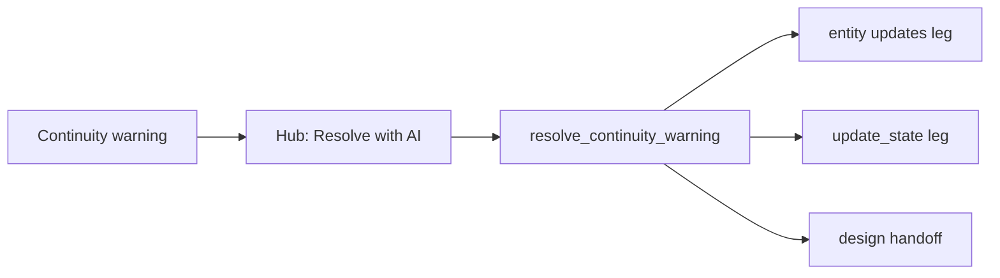

# Resolve continuity warning (`resolve_continuity_warning`) — workflow design

**Status:** Accepted backlog (AIT-T2-F) — not started — **high complexity**  
**Index:** [ai-tools-review-index.md](ai-tools-review-index.md)  
**Tracker:** [ai-tools-backlog-tracker.md](ai-tools-backlog-tracker.md)  
**Related:** [continuity-check-redesign.md](continuity-check-redesign.md) · [update-state-workflow.md](update-state-workflow.md) · [entity-extract-update-workflow.md](entity-extract-update-workflow.md)

---

## Decision (2026-07-04)

| Topic | Decision |
|-------|----------|
| Job id | **`resolve_continuity_warning`** — dedicated id; Continuity hub launches it |
| Catalog | Play manual — launched from Continuity hub (**Resolve with AI**) |
| Type | **Composition job** (like `process_turn`) |
| Auto | **Never** |
| Transport | **Single worker send** — one composed packet per warning |
| Canon-drift route | **Non-blocking** — open design workspace with pre-filled `propose_source_edits` intent |
| Partial apply | **Per-leg independent** — successful legs apply even if another fails parse |
| `memory-entity` category | **Entity `updates[]` first**; memories only when warning is episodic |

---

## Role

Bridge dismiss-only continuity UX to **actionable fixes**. Author selects a warning; job composes the appropriate sibling leg(s) with warning context pre-filled.

---

## Trigger flow



---

## Routing by warning category

| `category` | Composed leg | Mode |
|------------|--------------|------|
| `entity-state` | `extract_entities` → `updates[]` only | Play worker — single send |
| `state-location` | `update_state` | Play worker — single send |
| `canon-drift` | `propose_source_edits` | **Non-blocking** design workspace handoff |
| `memory-entity` | `updates[]` **preferred**; `propose_memories` if episodic beat | Play worker |
| `proposal-conflict` | Targeted leg + continuity-brief excerpt | Play worker |

Pre-fill `UserPrompt` / job context from warning `message`, `refs`, and continuity-brief slice.

---

## Response contract

Single JSON object — include only legs needed for the warning category:

```json
{
  "entities": { "updates": [ /* ... */ ] },
  "state": { "location": "…", "rationale": "…" }
}
```

Canon-drift may **not** return play JSON — hub opens design with pre-filled edit intent instead.

---

## Dependencies

| Dependency | Why |
|------------|-----|
| Structured warning `category` + `refs` | Routing — [continuity-check-redesign.md](continuity-check-redesign.md) P2 |
| `update_state` (AIT-T1-A) | State leg |
| `extract_entities` dual-section | Entity update leg |
| Design segregation | Canon fix handoff to design thread |
| Continuity brief | Pre-filled pending proposal context |

---

## Implementation priority

| P | Item |
|---|------|
| P3 | `resolve_continuity_warning` job id + hub **Resolve with AI** button |
| P3 | Warning `category` enum locked (shared with continuity parser P2) |
| P3 | MVP routes: `entity-state`, `state-location` only |
| P4 | Canon-drift → design handoff |
| P4 | `proposal-conflict` + `memory-entity` routes |

---

*Last updated: 2026-07-04*
