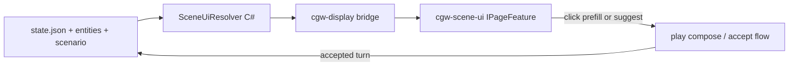

# Strategic Value Additions — Tracker

**Status:** Proposal backlog — not committed to milestones.  
**Created:** 2026-06-26  
**Last updated:** 2026-06-28  
**Related:** [architecture.md](../architecture.md) · [INDEX.md](../INDEX.md) · [injection-policy-adr.md](../injection-policy-adr.md) · [Adventures roadmap](../INDEX.md#adventures-roadmap-phase-status)

This document tracks high-leverage additions to the ChatGPT Wrapper stack. The wrapper’s moat is **local structured canon + session-bound inference + injection governance** — not generic ChatGPT chrome. Initiatives either compound that moat, reduce WebView bridge fragility, or expand the product into adjacent author workflows **without** duplicating commoditized ChatGPT UI polish.

---

## Document map

| Section | Purpose |
|---------|---------|
| [How to use](#how-to-use-this-tracker) | Columns, status workflow, ID prefixes |
| [Portfolios & tiers](#portfolios-and-tiers) | Two initiative families (Core vs Expansion) |
| [Executive summary](#executive-summary) | Suggested prioritization lenses |
| [Prerequisites](#prerequisites-in-flight-work) | Work that gates most initiatives |
| [Master index](#master-initiative-index) | All initiatives at a glance |
| [Core portfolio (SVA)](#core-portfolio-sva) | Original strategic review — tracker tables |
| [Expansion portfolio (SVX)](#expansion-portfolio-svx) | Distinct additions — tracker tables |
| [Technology matrix](#technology-matrix) | Libraries, runtimes, external apps per initiative |
| [Prioritization roadmap](#prioritization-roadmap) | Phased execution guide |
| [Declined / deprioritized](#declined--deprioritized) | Explicit non-goals |
| [Initiative details](#initiative-details) | Full specs, promotion criteria, status logs |
| [Meta-pattern](#meta-pattern) | How initiatives compose |

---

## How to use this tracker

### ID prefixes

| Prefix | Meaning |
|--------|---------|
| **SVA-** | **Core portfolio** — strategic review (2026-06-26): canon intelligence, trust, experience, platform, distribution |
| **SVX-** | **Expansion portfolio** — distinct additions (2026-06-27): craft analytics, MCP, imports, immersion axes beyond the core review |

Create Linear epics when promoting `Proposed` → `Spike` or `Backlog`. Paste issue links into the **Linear** column.

### Tracker columns

| Column | Meaning |
|--------|---------|
| **ID** | Stable reference |
| **Status** | `Proposed` · `Spike` · `Backlog` · `In Progress` · `Done` · `Icebox` · `Declined` |
| **Priority** | `P0` (do first) · `P1` · `P2` · `P3` |
| **Linear** | Epic or parent issue link |
| **Effort** | `S` · `M` · `L` · `XL` |
| **Value** | User-visible impact: `High` · `Medium` · `Low` |

Update **Status**, **Linear**, and each initiative’s **Status log** as work progresses.

---

## Portfolios and tiers

### Portfolio A — Core (SVA)

| Tier | Focus | IDs |
|------|--------|-----|
| **A1 — Canon intelligence** | Smarter lore selection and multimodal understanding | SVA-01, SVA-02, SVA-08 |
| **A2 — Author trust** | Observability, utility context quality, Phase 2b cockpit | SVA-03, SVA-04, SVA-11 |
| **A3 — Experience** | Immersive play and narrative branching UX | SVA-06, SVA-07 |
| **A4 — Platform** | Process isolation, multi-lane inference, extensions | SVA-05, SVA-10 |
| **A5 — Distribution** | Export beyond JSON/markdown | SVA-09 |

### Portfolio B — Expansion (SVX)

| Tier | Focus | IDs |
|------|--------|-----|
| **B1 — Canon as platform** | Outbound canon APIs, automation, onboarding | SVX-01, SVX-07, SVX-16 |
| **B2 — Author craft & quality** | Prose metrics, linting, simulated play | SVX-05, SVX-06, SVX-12 |
| **B3 — Immersion (non-TTS)** | Input, output, environment, and context-driven play UI | SVX-02, SVX-03, SVX-04, SVX-22 |
| **B4 — Worldbuilding structure** | Graphs, time, mechanics, hybrid IF | SVX-10, SVX-11, SVX-13, SVX-20 |
| **B5 — Ecosystem & reach** | Collab signals, mobile read, shell polish, i18n | SVX-09, SVX-17, SVX-18, SVX-19 |
| **B6 — Power-user infrastructure** | VCS, research capture, series-wide search | SVX-08, SVX-14, SVX-15 |
| **B7 — Engineering quality** | JS build pipeline (not user-facing) | SVX-21 |

---

## Executive summary

### Core portfolio — suggested first three (user-visible ROI)

1. **SVA-01** Local semantic retrieval  
2. **SVA-03** + **SVA-04** Flight recorder + continuity/memory/cards cockpit  
3. **SVA-06** Theatre mode  

### Core portfolio — suggested first three (platform durability)

1. **SVA-05** SessionHost completion  
2. Play send orchestration (in flight — [play-send-orchestration-adr.md](../play-send-orchestration-adr.md))  
3. Multi-lane utility inference (part of SVA-05)  

### Expansion portfolio — suggested first three (distinct leverage)

1. **SVX-01** MCP canon server — canon as a platform other AI tools use  
2. **SVX-07** Import pipelines — Obsidian + one competitor format  
3. **SVX-05** Writing craft analytics — cheap start from `log.json` stats  

### Expansion portfolio — high delight, moderate effort

1. **SVX-22** Story-context scene UI — canon-driven widgets without deterministic branching  
2. **SVX-03** Local image gen hook (ComfyUI / SD API) for entity portraits  
3. **SVX-08** Git integration for adventure folders  
4. **SVX-16** CLI headless mode for automation and QA harnesses  

---

## Prerequisites (in-flight work)

Before treating most SVA/SVX items as “next,” several in-repo epics are **load-bearing**:

| In-flight work | Gates |
|----------------|-------|
| [Play send orchestration](../play-send-orchestration-adr.md) | SVA-03 flight recorder; SVX-12 playtesting harness |
| [Injection policy CMD-292](../injection-policy-adr.md) | SVA-01 retrieval must plug into budget pipeline |
| Play-thread utility orchestration (CMD-326/327) | SVA-05 multi-lane; flight recorder utility semantics |
| Utility worker lane transport (CMD-358) | SVA-11 context assembly (transport must exist first) |
| Thread-canonical play (CMD-348+) | SVA-01, SVA-02 assume thread is source of truth |

SVA work that starts during Phase 0 should be **read-only spikes** (e.g. index a fixture adventure) without changing play send.

---

## Master initiative index

| ID | Initiative | Portfolio | Tier | Status | Prio | Effort | Value |
|----|------------|-----------|------|--------|------|--------|-------|
| SVA-01 | [Local semantic retrieval](#sva-01-local-semantic-retrieval) | Core | A1 | Backlog | P0 | L | High |
| SVA-02 | [Structured narrator → state](#sva-02-structured-narrator--state) | Core | A1 | Proposed | P1 | L | High |
| SVA-03 | [Narrative flight recorder](#sva-03-narrative-flight-recorder) | Core | A2 | Proposed | P0 | M | High |
| SVA-04 | [Authoring brain / Phase 2b](#sva-04-authoring-brain--phase-2b-productization) | Core | A2 | Proposed | P1 | M | High |
| SVA-05 | [SessionHost + multi-lane inference](#sva-05-sessionhost--multi-lane-inference) | Core | A4 | Proposed | P1 | XL | High |
| SVA-06 | [Theatre mode](#sva-06-theatre-mode) | Core | A3 | Proposed | P1 | L | High |
| SVA-07 | [Branch graph + time travel](#sva-07-branch-graph--time-travel) | Core | A3 | Proposed | P2 | L | Medium |
| SVA-08 | [Attachment intelligence](#sva-08-attachment-intelligence-pipeline) | Core | A1 | Proposed | P1 | M | High |
| SVA-09 | [Publication & portability](#sva-09-publication--portability) | Core | A5 | Proposed | P2 | M | Medium |
| SVA-10 | [Extension SDK](#sva-10-extension-sdk) | Core | A4 | Proposed | P3 | XL | Medium |
| SVA-11 | [Utility job context assembly](#sva-11-utility-job-context-assembly) | Core | A2 | Backlog | P1 | L | High |
| SVX-01 | [MCP canon server](#svx-01-mcp-canon-server) | Expansion | B1 | Proposed | P1 | M | High |
| SVX-02 | [Voice input (STT)](#svx-02-voice-input-stt-for-play) | Expansion | B3 | Proposed | P2 | M | Medium |
| SVX-03 | [Local image generation](#svx-03-local-image-generation-for-entity-portraits) | Expansion | B3 | Proposed | P1 | M | High |
| SVX-04 | [Ambient audio / soundscape](#svx-04-ambient-audio--soundscape-layer) | Expansion | B3 | Proposed | P2 | M | Medium |
| SVX-05 | [Writing craft analytics](#svx-05-writing-craft-analytics) | Expansion | B2 | Proposed | P1 | S | Medium |
| SVX-06 | [Prose linting](#svx-06-prose-linting-against-author-rules) | Expansion | B2 | Proposed | P2 | M | Medium |
| SVX-07 | [Import pipelines](#svx-07-import-pipelines) | Expansion | B1 | Proposed | P1 | L | High |
| SVX-08 | [Git for adventures](#svx-08-git-for-adventures) | Expansion | B6 | Proposed | P2 | M | Medium |
| SVX-09 | [Async collaboration signals](#svx-09-async-collaboration-signals) | Expansion | B5 | Proposed | P3 | S | Low |
| SVX-10 | [Entity relationship graph](#svx-10-entity-relationship-graph) | Expansion | B4 | Proposed | P2 | M | Medium |
| SVX-11 | [In-world chronology](#svx-11-in-world-chronology--calendar) | Expansion | B4 | Proposed | P2 | M | Medium |
| SVX-12 | [Playtesting bots / stress harness](#svx-12-playtesting-bots--injection-stress-harness) | Expansion | B2 | Proposed | P2 | M | Medium |
| SVX-13 | [TTRPG mechanics layer](#svx-13-ttrpg-mechanics-layer) | Expansion | B4 | Proposed | P2 | M | Medium |
| SVX-14 | [Research capture / web clipper](#svx-14-research-capture--web-clipper) | Expansion | B6 | Proposed | P2 | M | Medium |
| SVX-15 | [Cross-adventure library intelligence](#svx-15-cross-adventure-library-intelligence) | Expansion | B6 | Proposed | P2 | L | Medium |
| SVX-16 | [CLI / headless mode](#svx-16-cli--headless-mode) | Expansion | B1 | Proposed | P2 | M | Medium |
| SVX-17 | [Mobile / second-screen companion](#svx-17-mobile--second-screen-companion) | Expansion | B5 | Proposed | P3 | M | Low |
| SVX-18 | [Windows shell integration](#svx-18-windows-shell-integration) | Expansion | B5 | Proposed | P3 | S | Low |
| SVX-19 | [Translation / localization](#svx-19-translation--localization-pipeline) | Expansion | B5 | Proposed | P3 | L | Medium |
| SVX-20 | [Ink as embedded choice layer](#svx-20-ink-as-embedded-choice-layer) | Expansion | B4 | Proposed | P3 | L | Medium |
| SVX-21 | [TypeScript build pipeline](#svx-21-typescript-build-pipeline-for-injected-assets) | Expansion | B7 | Proposed | P2 | M | Low |
| SVX-22 | [Story-context scene UI](#svx-22-story-context-scene-ui) | Expansion | B3 | Proposed | P1 | M | High |

---

## Core portfolio (SVA)

### A1 — Canon intelligence

| ID | Initiative | Status | Priority | Linear | Effort | Value | Notes |
|----|------------|--------|----------|--------|--------|-------|-------|
| **SVA-01** | [Local semantic retrieval](#sva-01-local-semantic-retrieval) | Backlog | P0 | [CMD-381](https://linear.app/cmd0112/issue/CMD-381) | L | High | Epic + child issues CMD-382–389 |
| **SVA-02** | [Structured narrator → state](#sva-02-structured-narrator--state) | Proposed | P1 | — | L | High | Closes canon loop |
| **SVA-08** | [Attachment intelligence](#sva-08-attachment-intelligence-pipeline) | Proposed | P1 | — | M | High | Extends [attachment-aware context injection](attachment-aware-context-injection.md) |

### A2 — Author trust

| ID | Initiative | Status | Priority | Linear | Effort | Value | Notes |
|----|------------|--------|----------|--------|--------|-------|-------|
| **SVA-03** | [Narrative flight recorder](#sva-03-narrative-flight-recorder) | Proposed | P0 | — | M | High | `prompt-history.json` as product |
| **SVA-04** | [Authoring brain / Phase 2b](#sva-04-authoring-brain--phase-2b-productization) | Proposed | P1 | — | M | High | Backend largely exists |
| **SVA-11** | [Utility job context assembly](#sva-11-utility-job-context-assembly) | Backlog | P1 | [CMD-390](https://linear.app/cmd0112/issue/CMD-390) | L | High | Worker-first; separate from CMD-381 |

### A3 — Experience

| ID | Initiative | Status | Priority | Linear | Effort | Value | Notes |
|----|------------|--------|----------|--------|--------|-------|-------|
| **SVA-06** | [Theatre mode](#sva-06-theatre-mode) | Proposed | P1 | [CMD-277](https://linear.app/cmd0112/issue/CMD-277) (TTS) | L | High | Broader than TTS alone; see also SVX-04 |
| **SVA-07** | [Branch graph + time travel](#sva-07-branch-graph--time-travel) | Proposed | P2 | — | L | Medium | Narrative DAG; distinct from SVX-08 Git |

### A4 — Platform

| ID | Initiative | Status | Priority | Linear | Effort | Value | Notes |
|----|------------|--------|----------|--------|--------|-------|-------|
| **SVA-05** | [SessionHost + multi-lane inference](#sva-05-sessionhost--multi-lane-inference) | Proposed | P1 | [CMD-365](https://linear.app/cmd0112/issue/CMD-365) | XL | High | OOP WebView + optional Ollama lane |
| **SVA-10** | [Extension SDK](#sva-10-extension-sdk) | Proposed | P3 | — | XL | Medium | Heavier than SVX-20 Lua/Ink hooks |

### A5 — Distribution

| ID | Initiative | Status | Priority | Linear | Effort | Value | Notes |
|----|------------|--------|----------|--------|--------|-------|-------|
| **SVA-09** | [Publication & portability](#sva-09-publication--portability) | Proposed | P2 | — | M | Medium | Export; pair with SVX-07 import |

---

## Expansion portfolio (SVX)

### B1 — Canon as platform

| ID | Initiative | Status | Priority | Linear | Effort | Value | Notes |
|----|------------|--------|----------|--------|--------|-------|-------|
| **SVX-01** | [MCP canon server](#svx-01-mcp-canon-server) | Proposed | P1 | — | M | High | Outbound canon for Cursor, Claude Desktop, etc. |
| **SVX-07** | [Import pipelines](#svx-07-import-pipelines) | Proposed | P1 | — | L | High | Inverse of SVA-09 export |
| **SVX-16** | [CLI / headless mode](#svx-16-cli--headless-mode) | Proposed | P2 | — | M | Medium | `cgw` automation without WPF |

### B2 — Author craft & quality

| ID | Initiative | Status | Priority | Linear | Effort | Value | Notes |
|----|------------|--------|----------|--------|--------|-------|-------|
| **SVX-05** | [Writing craft analytics](#svx-05-writing-craft-analytics) | Proposed | P1 | — | S | Medium | Pacing/readability; not continuity |
| **SVX-06** | [Prose linting](#svx-06-prose-linting-against-author-rules) | Proposed | P2 | — | M | Medium | Enforce `lexiconAvoid`, style guides |
| **SVX-12** | [Playtesting bots](#svx-12-playtesting-bots--injection-stress-harness) | Proposed | P2 | — | M | Medium | Regression + “simulate session” |

### B3 — Immersion (non-TTS)

| ID | Initiative | Status | Priority | Linear | Effort | Value | Notes |
|----|------------|--------|----------|--------|--------|-------|-------|
| **SVX-02** | [Voice input (STT)](#svx-02-voice-input-stt-for-play) | Proposed | P2 | — | M | Medium | Hands-free play; mirror of TTS |
| **SVX-03** | [Local image generation](#svx-03-local-image-generation-for-entity-portraits) | Proposed | P1 | — | M | High | Create portraits; distinct from SVA-08 |
| **SVX-04** | [Ambient audio](#svx-04-ambient-audio--soundscape-layer) | Proposed | P2 | — | M | Medium | Location soundscapes; distinct from SVA-06 TTS |
| **SVX-22** | [Story-context scene UI](#svx-22-story-context-scene-ui) | Proposed | P1 | — | M | High | Canon-driven widgets; not Ink / not deterministic choices |

### B4 — Worldbuilding structure

| ID | Initiative | Status | Priority | Linear | Effort | Value | Notes |
|----|------------|--------|----------|--------|--------|-------|-------|
| **SVX-10** | [Entity relationship graph](#svx-10-entity-relationship-graph) | Proposed | P2 | — | M | Medium | Social graph; not SVA-07 branch DAG |
| **SVX-11** | [In-world chronology](#svx-11-in-world-chronology--calendar) | Proposed | P2 | — | M | Medium | Fictional calendar / timeline |
| **SVX-13** | [TTRPG mechanics](#svx-13-ttrpg-mechanics-layer) | Proposed | P2 | — | M | Medium | Dice, oracles; not narrator-scales |
| **SVX-20** | [Ink choice layer](#svx-20-ink-as-embedded-choice-layer) | Proposed | P3 | — | L | Medium | Deterministic CYOA; not scene UI — see SVX-22 |

### B5 — Ecosystem & reach

| ID | Initiative | Status | Priority | Linear | Effort | Value | Notes |
|----|------------|--------|----------|--------|--------|-------|-------|
| **SVX-09** | [Async collaboration signals](#svx-09-async-collaboration-signals) | Proposed | P3 | — | S | Low | Webhooks/toasts; not realtime MP |
| **SVX-17** | [Mobile companion](#svx-17-mobile--second-screen-companion) | Proposed | P3 | — | M | Low | Read-only localhost transcript |
| **SVX-18** | [Windows shell integration](#svx-18-windows-shell-integration) | Proposed | P3 | — | S | Low | Jump list, hotkeys, Rich Presence |
| **SVX-19** | [Translation pipeline](#svx-19-translation--localization-pipeline) | Proposed | P3 | — | L | Medium | i18n exports; orthogonal to EPUB |

### B6 — Power-user infrastructure

| ID | Initiative | Status | Priority | Linear | Effort | Value | Notes |
|----|------------|--------|----------|--------|--------|-------|-------|
| **SVX-08** | [Git for adventures](#svx-08-git-for-adventures) | Proposed | P2 | — | M | Medium | Engineering VCS; not SVA-07 story branches |
| **SVX-14** | [Research capture](#svx-14-research-capture--web-clipper) | Proposed | P2 | — | M | Medium | Web → canon inbox; not composer attach |
| **SVX-15** | [Cross-adventure search](#svx-15-cross-adventure-library-intelligence) | Proposed | P2 | — | L | Medium | Series/universe tooling |

### B7 — Engineering quality

| ID | Initiative | Status | Priority | Linear | Effort | Value | Notes |
|----|------------|--------|----------|--------|--------|-------|-------|
| **SVX-21** | [TypeScript build pipeline](#svx-21-typescript-build-pipeline-for-injected-assets) | Proposed | P2 | — | M | Low | Type-safe `cgw-*` bridge contracts |

---

## Technology matrix

Concrete libraries, runtimes, and external applications mapped to initiatives. The host stack stays **C# / .NET 9 + WPF + WebView2** unless noted.

### Shared infrastructure (multiple initiatives)

| Technology | Role | Initiatives |
|------------|------|-------------|
| **Microsoft.ML.OnnxRuntime** | Local ML inference (CPU) | SVA-01, SVA-08, SVX-02, SVA-06 |
| **SQLite + sqlite-vec** | Embedded vector index | SVA-01, SVX-15 |
| **NAudio** / **CSCore** | Audio I/O and playback | SVA-06, SVX-02, SVX-04 |
| **DiffPlex** | Text diff UI | SVA-03, SVA-07, SVX-08 |
| **Markdig** | Markdown → HTML for export | SVA-09, SVX-19 |
| **System.CommandLine** | CLI parsing | SVX-16 |
| **LibGit2Sharp** | Git operations in adventure folder | SVX-08 |

### Per-initiative stack hints

| ID | Primary technologies | External apps (optional) |
|----|---------------------|--------------------------|
| SVA-01 | OnnxRuntime, MiniLM/bge ONNX, sqlite-vec | — |
| SVA-02 | `System.Text.Json`, canon schema validation | — |
| SVA-03 | DiffPlex, WPF timeline UI | — |
| SVA-04 | Existing generation job + document services | — |
| SVA-05 | Named pipes (`SessionHostRpc`), HTTP client | Ollama, LM Studio |
| SVA-06 | Sherpa-ONNX or KokoroSharp, NAudio | — |
| SVA-07 | Msagl / GraphX, DiffPlex | — |
| SVA-08 | UglyToad.PdfPig, ImageSharp, vision ONNX | — |
| SVA-09 | VersOne.Epub, QuestPDF, Markdig | Calibre (workflow) |
| SVA-10 | AssemblyLoadContext, plugin interfaces | — |
| SVX-01 | MCP C# SDK or minimal HTTP+JSON, stdio/SSE | Cursor, Claude Desktop |
| SVX-02 | Whisper/faster-whisper ONNX, NAudio | — |
| SVX-03 | ComfyUI / A1111 HTTP API, optional SD ONNX | ComfyUI, Automatic1111 |
| SVX-04 | NAudio looping, scenario location tags | Royalty-free SFX packs |
| SVX-05 | LiveCharts2 / OxyPlot, LINQ over `log.json` | — |
| SVX-06 | LanguageTool, Vale, custom lexicon rules | LanguageTool server |
| SVX-07 | Per-format parsers (Markdown walk, HTML scrape) | Obsidian, World Anvil exports |
| SVX-08 | LibGit2Sharp or `git` subprocess | Git, GitHub |
| SVX-09 | Discord webhooks, WinRT toasts | Discord, Slack |
| SVX-10 | Msagl force-directed layout | — |
| SVX-11 | JSON schema extension, WPF timeline | — |
| SVX-12 | xUnit fixtures, optional local LLM personas | — |
| SVX-13 | Pure C# dice/oracle tables, JSON data | — |
| SVX-14 | Browser extension (JS), localhost API | — |
| SVX-15 | SQLite FTS5, canon schema validation | — |
| SVX-16 | System.CommandLine, reuse Core services | — |
| SVX-17 | ASP.NET Core minimal API (localhost) | Phone browser |
| SVX-18 | WinRT notifications, Jump Lists, global hotkeys | Discord Rich Presence |
| SVX-19 | MarianMT/Argos (local) or DeepL API | — |
| SVX-20 | inklecate, inkjs in WebView | — |
| SVX-21 | TypeScript, esbuild, Vitest | — |
| SVX-22 | `IPageFeature` + `cgw-display`, scene JSON in canon, optional `[[cgw:scene-ui]]` blocks | — |

### Languages beyond C#

| Language | Where | Initiative |
|----------|-------|------------|
| **JavaScript** | WebView injections (`cgw-*`) | All display/play features |
| **TypeScript** | Build pipeline for injections; scene UI module | SVX-21, SVX-22 |
| **Ink** | Deterministic choice scripting (export / scripted set-pieces) | SVX-20, SVA-09 export — **not** scene UI (use SVX-22) |
| **Lua** (optional, MoonSharp) | Light user scripting | Stretch beyond SVA-10 |

### Technologies explicitly deprioritized

| Technology | Why skip for this stack |
|------------|-------------------------|
| PostgreSQL / EF Core | JSON + SQLite indexes suffice |
| Electron / Avalonia rewrite | WPF + WebView2 works |
| Python ML subprocess | Windows packaging pain; prefer ONNX |
| Cloud embedding APIs | Breaks no-key / privacy model |
| Realtime multiplayer (SignalR) | See declined list |
| Full game engine | Narrative OS, not 3D |

---

## Prioritization roadmap

Unified timeline merging **Core (SVA)** and **Expansion (SVX)** tracks. Platform work runs as a parallel spine.

```
Now           Phase 0            Phase 1                 Phase 2                  Phase 3            Phase 4+
───────────── ────────────────── ─────────────────────── ──────────────────────── ────────────────── ─────────
Finish send/  │                  │                       │                        │                  │
injection/    │  SVA-03 flight   │  SVA-01 retrieval    │  SVA-06 theatre v0     │  SVA-05 M2       │
utility epics │  recorder        │  SVA-02 state ADR      │  → v1 TTS              │  SVA-07 branch   │
              │  SVA-04 2b slice │  SVA-08 attach (1)    │  SVX-22 scene UI v0    │  SVA-09 export   │
              │  SVX-05 analytics │                       │                        │  SVA-10 SDK      │
Parallel:     SVA-05 M1 spike ───────────────────────────────────────────────────────────────────────► M2/M3
Expansion:    SVX-01 MCP spike · SVX-07 import (1 fmt) · SVX-21 TS pipeline (engineering)
```

### Phase 0 — Prerequisites (not SVA/SVX)

Close in-flight orchestration, injection honesty, thread-canonical play. Allow read-only spikes only.

### Phase 1 — Trust + observability + quick expansion wins (~4–8 weeks)

| Initiative | Deliverable |
|------------|-------------|
| **SVA-03** | Read-only flight recorder: per-turn injection timeline |
| **SVA-04** | One Phase 2b vertical slice (memory UI OR continuity warning OR cards) |
| **SVX-05** | Craft dashboard v0: words/turn, dialogue ratio, entity mention chart |

### Phase 2 — Canon intelligence + platform onboarding (~8–16 weeks)

| Initiative | Deliverable |
|------------|-------------|
| **SVA-01** | Shadow → feature-flag fusion into `ContextPointerResolver` |
| **SVA-08** | One attachment type → canon inbox proposal |
| **SVA-02** | ADR + pilot on `state.json` blocks |
| **SVX-01** | MCP server v0: `search_entities`, `get_source_section` |
| **SVX-07** | Obsidian vault OR one competitor import path |

### Phase 3 — Experience layer (~6–12 weeks, overlaps Phase 2 tail)

| Initiative | Deliverable |
|------------|-------------|
| **SVA-06** | Theatre v0 (Continuous fullscreen + portraits); v1 TTS if CMD-277 promoted |
| **SVX-22** | Scene UI v0: location-keyed widgets + click → composer prefill (non-deterministic outcomes) |
| **SVX-03** | Entity portrait gen via ComfyUI localhost API |
| **SVX-04** | Optional location ambience (can ship after theatre v0) |

### Phase 4 — Platform + expansion (~ongoing)

| Initiative | Deliverable |
|------------|-------------|
| **SVA-05** | SessionHost M1 → M2; optional Ollama utility lane |
| **SVX-08** | `git init` + commit-on-save for adventure folder |
| **SVX-16** | CLI: `export`, `backup`, `run-job` |
| **SVA-07**, **SVA-09**, **SVA-10** | When core loop is trusted |

### Week-to-week decision tree

1. **Play send or injection inconsistent?** → Stay Phase 0.  
2. **Authors ask “what did the model see?”** → SVA-03.  
3. **Long campaigns lose lore coherence?** → SVA-01.  
4. **Utility jobs eat ChatGPT quota?** → SVA-05 M1 + local utility lane.  
5. **Retention / delight goal?** → SVA-06 v0, **SVX-22** scene UI, or SVX-03 portraits.  
6. **Growth / onboarding friction?** → SVX-07 import.  
7. **Power users want automation?** → SVX-01 MCP or SVX-16 CLI.  
8. **Contextual play chrome (not CYOA)?** → SVX-22 — not SVX-20 Ink.  

---

## Declined / deprioritized

| Idea | Why lower priority for this stack |
|------|-----------------------------------|
| Generic ChatGPT UI polish | Commoditized; doesn’t use canon moat |
| Primary programmatic Project API sync | Deliberate manual-publish authority model |
| Build own LLM | Session-based ChatGPT is the narrator bet |
| Realtime multiplayer | Huge scope; SVX-09 async signals + zip/Git enough for v1 |
| CI/CD alone | Engineering hygiene, not user-facing major value |
| Full game engine (Unity/Godot) | Narrative OS positioning |
| Blockchain / NFT distribution | No fit |
| Heavy cloud dependency for core loop | Conflicts with local-first canon authority |
| Ink for story-context visuals / non-branching interactables | Ink is text-flow + deterministic choices; **SVX-22** canon scene descriptors fit AI-first play |

---

## Initiative details

### Core portfolio (SVA)

#### SVA-01: Local semantic retrieval

**Linear epic:** [CMD-381](https://linear.app/cmd0112/issue/CMD-381) — Local semantic retrieval for context pointers

| Phase | Issue | Focus |
|-------|-------|-------|
| 0 | [CMD-382](https://linear.app/cmd0112/issue/CMD-382) | ADR spike |
| 1 | [CMD-383](https://linear.app/cmd0112/issue/CMD-383) | Local canon index |
| 2 | [CMD-387](https://linear.app/cmd0112/issue/CMD-387) | `SemanticRetrievalService` |
| 3 | [CMD-389](https://linear.app/cmd0112/issue/CMD-389) | Fuse into `ContextPointerResolver` |
| 4 | [CMD-384](https://linear.app/cmd0112/issue/CMD-384) | Shadow evaluation |
| 5 | [CMD-388](https://linear.app/cmd0112/issue/CMD-388) | Feature flag rollout |
| 6 | [CMD-385](https://linear.app/cmd0112/issue/CMD-385) | Next send preview |
| 7 | [CMD-386](https://linear.app/cmd0112/issue/CMD-386) | Documentation |

**Goal:** Per-turn selection of the most relevant lore slices from local canon instead of relying solely on Project RAG or fat inline packets.

**Problem:** Context assembly today is budget + rules + lexical token matching (`ContextPointerResolver`). Paraphrases and thematic relevance without keyword overlap are missed.

**Proposed stack:**

| Layer | Role |
|-------|------|
| Index | SQLite + sqlite-vec — incremental rebuild on save |
| Embed | OnnxRuntime + MiniLM/bge ONNX (~80MB) |
| Retriever | Player line + state + summary + recent transcript → top-k |
| Injector | Feeds [injection policy](../injection-policy-adr.md) as reference-first pointers |

**Index sources:** `sources/`, entity fields, memory, cards, optional log turns, `context-index.json`.

**Pipeline hook:** After `ContextSignalBuilder.Build`, before `ContextBudgetAllocator` — hybrid fuse with lexical scores; new `PointerSource.SemanticMatch`.

**Does not:** Replace Project RAG in thin mode; bypass budget; require cloud APIs.

**Existing hooks:** `SourceManifest`, `SectionAliasIndex`, `ContextBudgetAllocator`, thin/fat packet builder.

**Promotion criteria:**

- [ ] Spike confirms &lt;150ms embed+search on typical hardware
- [ ] Retrieval beats whole-section injection on 50+ turn fixture
- [ ] Integrates with injection ADR without bypassing budget pipeline

**Status log:**

| Date | Update |
|------|--------|
| 2026-06-26 | Proposed in strategic review |
| 2026-06-27 | Linear epic CMD-381 + child issues CMD-382–389 created |

---

#### SVA-02: Structured narrator → state

**Goal:** Parse structured blocks in narrator output, validate against canon schema, propose/apply state diffs.

**Example contract:**

```markdown
<!-- cgw:state -->
{ "location": "...", "flags": ["met_guard"] }
<!-- /cgw:state -->
```

**Flow:** Parse → validate (`canon-schema.json`) → review tray (like entity extraction) → auto-apply on accept.

**Existing hooks:** `EntityChangePlan`, continuity check jobs, [instruction contract guide](../instruction-contract-guide.md), `CanonReconciliationService`.

**Promotion criteria:**

- [ ] ADR defines block format, failure modes, invalidation rules
- [ ] Pilot on `state.json` fields before full entity graph

**Status log:**

| Date | Update |
|------|--------|
| 2026-06-26 | Proposed in strategic review |

---

#### SVA-03: Narrative flight recorder

**Goal:** Observability UI — timeline of every send with injection breakdown, budget, attachment mode, thin vs fat, utility lane, links to continuity/sync state.

**Distinct from SVX-05:** Flight recorder debugs **what was injected**; craft analytics measures **prose quality**.

**Data sources:** `prompt-history.json`, utility exchanges, thread metadata, injection manifests, source sync state.

**Tech:** DiffPlex for packet diffs; WPF virtualized timeline.

**Promotion criteria:**

- [ ] Read-only viewer before edit/replay
- [ ] One turn correlated end-to-end (packet → send → response → canon delta)

**Status log:**

| Date | Update |
|------|--------|
| 2026-06-26 | Proposed in strategic review |

---

#### SVA-04: Authoring brain / Phase 2b productization

**Goal:** User-facing surfaces for memory, cards, continuity — per [Adventures roadmap Phase 2b](../INDEX.md#adventures-roadmap-phase-status).

| Capability | User-visible win |
|------------|------------------|
| Memory proposal + review UI | Long-campaign continuity |
| Story card activation UI | Oblique triggers fire in play |
| Continuity dashboard | Pre-send contradiction warnings |
| Recap / session summary | Re-entry after absence |

**Promotion criteria:**

- [ ] Each capability has smoke checklist in [adventure-panel.md](../adventure-panel.md)
- [ ] Tied to generation job suite where applicable

**Status log:**

| Date | Update |
|------|--------|
| 2026-06-26 | Proposed in strategic review |

---

#### SVA-11: Utility job context assembly

**Linear epic:** [CMD-390](https://linear.app/cmd0112/issue/CMD-390) — Utility job context assembly (worker-first)

**Design track:** [utility-job-context-assembly.md](utility-job-context-assembly.md)  
**ADR (spike):** [utility-job-context-assembly-adr.md](../utility-job-context-assembly-adr.md)

| Phase | Issue | Focus |
|-------|-------|-------|
| 0 | [CMD-391](https://linear.app/cmd0112/issue/CMD-391) | ADR spike |
| 1 | [CMD-392](https://linear.app/cmd0112/issue/CMD-392) | `UtilityJobContextAssembler` |
| 2 | [CMD-393](https://linear.app/cmd0112/issue/CMD-393) | Lane-aware dedup |
| 3 | [CMD-394](https://linear.app/cmd0112/issue/CMD-394) | Worker lore channel |
| 4 | [CMD-395](https://linear.app/cmd0112/issue/CMD-395) | Job-scoped canon slices (lexical) |
| 5 | [CMD-396](https://linear.app/cmd0112/issue/CMD-396) | Handler consolidation |
| 6 | [CMD-397](https://linear.app/cmd0112/issue/CMD-397) | Preview manifest |
| 7 | [CMD-398](https://linear.app/cmd0112/issue/CMD-398) | Documentation |
| — | [CMD-399](https://linear.app/cmd0112/issue/CMD-399) | Optional CMD-381 synergy (icebox) |

**Goal:** Utility workers receive deliberate, lane-aware story context and task-scoped canon — optimized for **isolated worker conversations**, not narrator pointer selection.

**Problem today:** Three divergent paths (`UtilityStoryContextBuilder`, injection-first without story block, duplicate handler slices). Worker jobs under-fed when reference-first assumes play thread visibility.

**Distinct from SVA-01 (CMD-381):** Narrator THIS TURN pointers vs utility job payload assembly. Optional synergy only via CMD-399.

**Promotion criteria:**

- [ ] Worker `continuity_check` useful after long play with zero worker history
- [ ] Bundled injection-first jobs dedup vs same-send narrator context
- [ ] AI Actions preview shows lane + manifest

**Status log:**

| Date | Update |
|------|--------|
| 2026-06-28 | Design track + Linear epic CMD-390 + child issues CMD-391–399 |
| 2026-06-28 | CMD-391 spike ADR: [utility-job-context-assembly-adr.md](../utility-job-context-assembly-adr.md) |

---

#### SVA-05: SessionHost + multi-lane inference

**Goal:** Out-of-process WebView host; optional utility routing to dedicated process/tab or local LLM.

| Lane | Engine |
|------|--------|
| Narrator | ChatGPT (quality) |
| Utility jobs | Ollama / LM Studio or cheaper web session |
| Specific job types | Second provider tab |

**Existing hooks:** `ChatGPTWrapper.SessionHost`, `SessionHostRpc`, [utility worker lane plan](../utility-worker-lane-plan.md), [CMD-365](https://linear.app/cmd0112/issue/CMD-365).

**Promotion criteria:**

- [ ] `EnsureReady` + `SendMessage` RPC for at least one adventure flow
- [ ] Documented fallback to in-process `ChatGptSessionHost`

**Status log:**

| Date | Update |
|------|--------|
| 2026-06-26 | Proposed in strategic review |

---

#### SVA-06: Theatre mode

**Goal:** Immersive play presentation mode.

| Component | Source |
|-----------|--------|
| Continuous/Weave canvas | Existing transcript views |
| Local neural TTS | [local-neural-tts.md](local-neural-tts.md) · [CMD-277](https://linear.app/cmd0112/issue/CMD-277) |
| Per-entity voice mapping | `entities.json` |
| Entity portraits | `EntityMediaService` |
| Hotkeys | Read aloud, replay turn, bookmark |

**Related:** Location backdrop may overlap **SVX-04** (ambient audio); visual backdrop stays here, audio in SVX-04. Contextual interactables (hotspots, action chips) → **SVX-22**, not Ink.

**Staged rollout:** v0 fullscreen Continuous + portraits → v1 TTS → v2 per-entity voices + auto-read.

**Promotion criteria:**

- [ ] TTS promoted from Icebox OR theatre ships without TTS first
- [ ] Performance acceptable alongside Continuous overlay

**Status log:**

| Date | Update |
|------|--------|
| 2026-06-26 | Proposed in strategic review |

---

#### SVA-07: Branch graph + time travel

**Goal:** Visual narrative branch management — story DAG, canon diff, sandbox what-if, optional merge.

**Distinct from SVX-08:** SVA-07 is **narrative branching** (fork at turn); SVX-08 is **engineering VCS** (git blame on `sources/`).

**Existing hooks:** Branching, save states, undo, queue (Phase 4 partial).

**Promotion criteria:**

- [ ] ADR for branch identity, invalidation, merge semantics
- [ ] Read-only graph before merge/write

**Status log:**

| Date | Update |
|------|--------|
| 2026-06-26 | Proposed in strategic review |

---

#### SVA-08: Attachment intelligence pipeline

**Goal:** Local understanding of composer attachments → canon inbox.

| Input | Output |
|-------|--------|
| Image | Caption → story card or entity visual reference |
| PDF | Extracted text → canon inbox proposals |
| Map/image | Link to location entity |

**Distinct from SVX-03:** SVA-08 **understands** user-attached files; SVX-03 **generates** new entity portraits.

**Tech:** PdfPig, ImageSharp, vision ONNX (local).

**Promotion criteria:**

- [ ] One attach type produces reviewable canon proposal
- [ ] Processing stays local unless author opts into cloud

**Status log:**

| Date | Update |
|------|--------|
| 2026-06-26 | Proposed in strategic review |

---

#### SVA-09: Publication & portability

**Goal:** Export beyond JSON archive and story markdown.

| Output | Audience |
|--------|----------|
| EPUB / PDF | Readers, Patreon |
| Twine / Ink / Harlowe | IF community |
| Foundry / Roll20 journal packs | TTRPG DMs |
| Player’s guide | Table play |

**Pair with SVX-07** for import symmetry. **Pair with SVX-19** for translated exports.

**Promotion criteria:**

- [ ] One non-markdown format ships with manual QA checklist
- [ ] Export rules for accepted-turn log documented

**Status log:**

| Date | Update |
|------|--------|
| 2026-06-26 | Proposed in strategic review |

---

#### SVA-10: Extension SDK

**Goal:** Documented hooks for community extensions without forking.

| Hook | Example |
|------|---------|
| Custom utility job types | C# handler + prompt template |
| Custom injection slices | Policy-compatible builders |
| Custom entity categories | Canon schema extension |
| Display features | `IPageFeature` + bridge channel |

**Lighter alternatives:** SVX-20 (Ink), MoonSharp Lua for tables — consider before full SDK.

**Promotion criteria:**

- [ ] One sample extension in-repo
- [ ] Versioning/stability policy documented

**Status log:**

| Date | Update |
|------|--------|
| 2026-06-26 | Proposed in strategic review |

---

### Expansion portfolio (SVX)

#### SVX-01: MCP canon server

**Goal:** Local **Model Context Protocol** server exposing adventure canon to external AI tools (Cursor, Claude Desktop, VS Code agents).

**Tools (v0):** `search_entities`, `get_source_section`, `list_turns`, `propose_memory` (→ canon inbox).

**Transport:** stdio or localhost SSE per MCP spec.

**Distinct from SVA-01:** Retrieval improves **inbound** injection; MCP is **outbound** canon authority for other tools.

**Tech:** C# MCP SDK or minimal HTTP+JSON; reuse `AdventureStore`, `CanonEntityResolver`.

**Promotion criteria:**

- [ ] One external client (e.g. Cursor) completes a read workflow against live adventure
- [ ] Write paths go through canon inbox / review, not silent overwrite

**Status log:**

| Date | Update |
|------|--------|
| 2026-06-27 | Added in expansion portfolio review |

---

#### SVX-02: Voice input (STT) for play

**Goal:** Hands-free player turns via local speech-to-text.

**Tech:** Whisper / faster-whisper ONNX; NAudio mic capture; Windows.Media.SpeechRecognition as zero-dep spike.

**Distinct from SVA-06:** TTS is narration **out**; STT is player input **in**.

**Promotion criteria:**

- [ ] Acceptable accuracy for interactive fiction commands in quiet environment
- [ ] Clear recording indicator; no accidental sends

**Status log:**

| Date | Update |
|------|--------|
| 2026-06-27 | Added in expansion portfolio review |

---

#### SVX-03: Local image generation for entity portraits

**Goal:** Generate entity portraits from descriptions → review → `EntityMediaService`.

**Tech:** ComfyUI or Stable Diffusion WebUI localhost API; optional IP-Adapter for consistency; ONNX SD as bundled stretch goal.

**Distinct from SVA-08:** Creates images; does not caption attachments.

**Promotion criteria:**

- [ ] Entity edit flow: generate → preview → save to `media/`
- [ ] Documented optional external app install vs bundled path

**Status log:**

| Date | Update |
|------|--------|
| 2026-06-27 | Added in expansion portfolio review |

---

#### SVX-04: Ambient audio / soundscape layer

**Goal:** Location-triggered environmental audio (tavern, rain, dungeon) during play.

**Tech:** NAudio looping/crossfade; trigger from `state.CurrentLocation` or scenario tags.

**Distinct from SVA-06:** SVA-06 is spoken prose (TTS); this is non-verbal ambience.

**Promotion criteria:**

- [ ] At least one adventure location maps to ambience loop
- [ ] Volume/mute controls; no conflict with TTS playback queue

**Status log:**

| Date | Update |
|------|--------|
| 2026-06-27 | Added in expansion portfolio review |

---

#### SVX-05: Writing craft analytics

**Goal:** Quantitative prose metrics — not continuity contradiction detection.

| Metric | Source |
|--------|--------|
| Words per turn, dialogue ratio | `log.json` |
| Readability (Flesch, grade level) | Narrator text analysis |
| Entity mention heatmap over turn index | Entity refs in log |
| Location time-on-screen | `state` history if tracked |
| Repetitive phrase detection | N-grams vs `lexiconAvoid` |

**Tech:** LiveCharts2 / OxyPlot; custom analyzers.

**Distinct from SVA-03:** Injection debug vs writing craft.

**Promotion criteria:**

- [ ] Dashboard v0 with ≥3 metrics on accepted turns
- [ ] No impact on play send path

**Status log:**

| Date | Update |
|------|--------|
| 2026-06-27 | Added in expansion portfolio review |

---

#### SVX-06: Prose linting against author rules

**Goal:** Soft gates at turn accept — grammar, style guide, banned phrases.

**Tech:** LanguageTool (local or API), Vale custom rules, enforcement of `LexiconExportService` avoid list.

**Promotion criteria:**

- [ ] At least one rule source (lexicon avoid OR custom Vale profile)
- [ ] Warnings are dismissible; never block accept without author opt-in

**Status log:**

| Date | Update |
|------|--------|
| 2026-06-27 | Added in expansion portfolio review |

---

#### SVX-07: Import pipelines

**Goal:** Onboard external worlds into canon schema — inverse of SVA-09.

| Source | Approach |
|--------|----------|
| Obsidian vault | Walk `.md` → `sources/` + manifest |
| World Anvil | HTML/JSON export parser |
| Notion | Markdown export |
| AI Dungeon / NovelAI | Scenario JSON adapters |
| Campfire / Scrivener | Structured export parsers |
| Ink source | Import to `sources/plot.md` or SVX-20 runtime |

**Promotion criteria:**

- [ ] One format ships end-to-end with manual QA checklist
- [ ] Import creates reviewable canon inbox items where ambiguous

**Status log:**

| Date | Update |
|------|--------|
| 2026-06-27 | Added in expansion portfolio review |

---

#### SVX-08: Git for adventures

**Goal:** `git init` in adventure folder — blame, diff, sync to GitHub for backup/collab.

**Tech:** LibGit2Sharp or `git` subprocess; optional commit-on-save hook.

**Distinct from SVA-07:** Engineering VCS vs narrative branch UX.

**Promotion criteria:**

- [ ] Init + commit + diff `sources/` from UI or CLI
- [ ] Document interaction with `BackupService` zip backups

**Status log:**

| Date | Update |
|------|--------|
| 2026-06-27 | Added in expansion portfolio review |

---

#### SVX-09: Async collaboration signals

**Goal:** Lightweight notifications without realtime multiplayer.

| Channel | Use |
|---------|-----|
| Discord / Slack webhooks | Turn accepted, session recap |
| Windows Toast | Turn complete while app backgrounded |
| Email (optional) | Weekly digest |

**Promotion criteria:**

- [ ] One channel configurable per adventure
- [ ] No secrets in exported adventure bundles

**Status log:**

| Date | Update |
|------|--------|
| 2026-06-27 | Added in expansion portfolio review |

---

#### SVX-10: Entity relationship graph

**Goal:** Visual social graph — factions, relationships, secrets — from `entities.json`.

**Tech:** Msagl / GraphSharp force-directed layout.

**Distinct from SVA-07:** Social structure vs temporal branch DAG.

**Promotion criteria:**

- [ ] Read-only graph from existing entity relationship fields
- [ ] Click node → entity edit

**Status log:**

| Date | Update |
|------|--------|
| 2026-06-27 | Added in expansion portfolio review |

---

#### SVX-11: In-world chronology / calendar

**Goal:** Fictional calendar, event timeline, days-elapsed tracking.

**Tech:** JSON schema extension to `state.json`; WPF timeline control.

**Promotion criteria:**

- [ ] Manual date stamp per turn OR derived elapsed days
- [ ] Export appears in player’s guide (SVA-09) when enabled

**Status log:**

| Date | Update |
|------|--------|
| 2026-06-27 | Added in expansion portfolio review |

---

#### SVX-12: Playtesting bots / injection stress harness

**Goal:** Scripted player personas and regression fixtures for injection quality.

**Tech:** xUnit driving `PlaySendOrchestrator`; optional local LLM as cheap bot player.

**Distinct from utility jobs:** Tests **injection assembly**, not entity extraction.

**Promotion criteria:**

- [ ] Fixture adventure: N scripted lines assert packet contains expected pointers
- [ ] CI-runnable headless path (pairs with SVX-16)

**Status log:**

| Date | Update |
|------|--------|
| 2026-06-27 | Added in expansion portfolio review |

---

#### SVX-13: TTRPG mechanics layer

**Goal:** Dice roller, oracle/fate tables, roll templates — distinct from `narrator-scales.json` (prose style).

**Tech:** Pure C# dice; JSON table data; inject roll results into player line or `state.json`.

**Promotion criteria:**

- [ ] Inline roll UI in play compose OR slash command
- [ ] Optional export to Foundry roll template (SVA-09)

**Status log:**

| Date | Update |
|------|--------|
| 2026-06-27 | Added in expansion portfolio review |

---

#### SVX-14: Research capture / web clipper

**Goal:** Clip web content → `CanonInboxService` — not composer file attachments.

**Tech:** Browser extension posting to localhost API; Readability-style article extraction; `research/` folder.

**Promotion criteria:**

- [ ] Extension OR bookmarklet captures selection to inbox proposal
- [ ] Strip tracking params; no silent canon writes

**Status log:**

| Date | Update |
|------|--------|
| 2026-06-27 | Added in expansion portfolio review |

---

#### SVX-15: Cross-adventure library intelligence

**Goal:** Series/universe tooling across `LibraryStore` and multiple adventures.

**Tech:** SQLite FTS5 over all `sources/`; shared entity registry; canon schema validation on reuse.

**Distinct from SVA-01:** Per-corpus retrieval vs cross-adventure search/reuse.

**Promotion criteria:**

- [ ] Search all adventures from dashboard
- [ ] “Import entity from Adventure A” flow

**Status log:**

| Date | Update |
|------|--------|
| 2026-06-27 | Added in expansion portfolio review |

---

#### SVX-16: CLI / headless mode

**Goal:** `cgw` command-line tool for automation without WPF.

**Commands (v0):** `export`, `backup`, `run-job continuity-check`, `validate-canon`.

**Tech:** System.CommandLine; reuse `ChatGPTWrapper.Core` + adventure services.

**Promotion criteria:**

- [ ] Three commands work against real adventure directory
- [ ] Documented exit codes for scripting

**Status log:**

| Date | Update |
|------|--------|
| 2026-06-27 | Added in expansion portfolio review |

---

#### SVX-17: Mobile / second-screen companion

**Goal:** Read-only transcript on phone via local network.

**Tech:** ASP.NET Core minimal API (localhost bind); QR pairing token; HTML transcript view.

**Promotion criteria:**

- [ ] Phone on same Wi‑Fi reads accepted turns within 5s of accept
- [ ] Read-only — no send from companion v0

**Status log:**

| Date | Update |
|------|--------|
| 2026-06-27 | Added in expansion portfolio review |

---

#### SVX-18: Windows shell integration

**Goal:** Native Windows polish — low effort, tangible feel.

| Feature | Tech |
|---------|------|
| Jump List | Recent adventures on taskbar |
| Toast on turn complete | WinRT notifications |
| Global hotkey scratch pad | Append `notes.json` |
| Share contract | Excerpt to Word/email |
| Discord Rich Presence | “Playing *Title* — turn N” |

**Promotion criteria:**

- [ ] Jump List + one other feature shipped
- [ ] No elevation/admin required

**Status log:**

| Date | Update |
|------|--------|
| 2026-06-27 | Added in expansion portfolio review |

---

#### SVX-19: Translation / localization pipeline

**Goal:** Translate exports and optionally UI — orthogonal to EPUB format (SVA-09).

**Tech:** MarianMT / Argos Translate (local); DeepL API (optional paid).

**Promotion criteria:**

- [ ] One export format translatable to one target language
- [ ] Glossary from entity names preserved

**Status log:**

| Date | Update |
|------|--------|
| 2026-06-27 | Added in expansion portfolio review |

---

#### SVX-20: Ink as embedded choice layer

**Goal:** Hybrid CYOA + AI — explicit **deterministic** Ink choices in Play, freeform elsewhere.

**Tech:** inklecate compile; inkjs in WebView; choices write `state.json`.

**Distinct from SVA-09:** SVA-09 exports **to** Ink; SVX-20 **runs** Ink inside Play.

**Distinct from SVX-22:** SVX-20 is for **branching narrative** (pick A → knot B). SVX-22 is for **context-driven visuals and soft interactables** where outcomes stay AI-mediated — the preferred path for non-CYOA play.

**Promotion criteria:**

- [ ] One `.ink` file drives choice UI for a pilot scene
- [ ] AI narration resumes after choice resolution

**Status log:**

| Date | Update |
|------|--------|
| 2026-06-27 | Added in expansion portfolio review |

---

#### SVX-21: TypeScript build pipeline for injected assets

**Goal:** Type-safe bridge contracts; bundle `ChatGPT_files/` → `wrapper-assets/`.

**Tech:** TypeScript, esbuild, Vitest for DOM logic unit tests.

**Value:** Engineering quality — reduces ChatGPT DOM churn breakage; not user-visible.

**Promotion criteria:**

- [ ] One bridge module (`cgw-play-compose` or `continuous-transcript-view`) compiled through pipeline
- [ ] CI builds assets on PR

**Status log:**

| Date | Update |
|------|--------|
| 2026-06-27 | Added in expansion portfolio review |

---

#### SVX-22: Story-context scene UI

**Goal:** Location- and state-driven **visual elements and interactables** during Play — portraits, action chips, examine buttons, location panels — **without** deterministic branching or Ink.

**Problem:** AI-first play needs contextual chrome (“you’re in the tavern — show who’s here, offer obvious actions”) but outcomes should still flow through ChatGPT + accept flow, not fixed choice graphs.

**Non-goals:**

- Deterministic CYOA (see SVX-20 Ink — deprioritized for this product direction)
- Repurposing Ink tags/choices as widget hosts
- Full game-engine scenes (maps, physics, inventory UI)

**Proposed architecture:**



| Layer | Role |
|-------|------|
| **Scene descriptors** | JSON (or markdown frontmatter) in canon — keyed by `locationId`, entity, or scenario tag |
| **`SceneUiResolver`** | Parallel to `ContextPointerResolver`: `state` + location + flags → visible widget list this turn |
| **`cgw-scene-ui` feature** | New `IPageFeature`; renders in WebView overlay or WPF Play chrome |
| **`[[cgw:scene-ui]]` blocks** (optional) | Extend existing `[[cgw:…]]` protocol for turn-scoped UI in packets / narrator context |
| **Click behavior** | Prefill composer, insert suggested player line, or open entity panel — **not** hard-coded next story node |

**Example descriptor (illustrative):**

```json
{
  "locationId": "old-quarter-tavern",
  "widgets": [
    { "type": "portrait-strip", "entities": ["marcus", "innkeeper"] },
    { "type": "action", "id": "examine-notice-board", "label": "Read the notice board",
      "suggestPlayerLine": "I examine the notice board." },
    { "type": "entity-chip", "entityId": "marcus", "label": "Talk to Marcus" }
  ],
  "visibility": { "requiresFlags": [], "hideFlags": ["tavern-burned"] }
}
```

**Widget types (v0 → v1):**

| v0 | v1 (stretch) |
|----|----------------|
| Portrait strip from `EntityMediaService` | Location backdrop image from scenario metadata |
| Action chips → composer prefill | Inline examine panel (modal) |
| Entity chips → entity reference | Integrate with SVX-13 dice roll button |
| Show/hide by `state` flags | Card-triggered widget bursts (story cards) |

**Existing hooks:** `IPageFeature`, `BridgeProtocol.ChannelDisplay`, `cgw-packet-display.js` block parser, `EntityMediaService`, `ContextPointerResolver` / `state.json`, Play compose bridge (`cgw-play-compose.js`).

**Tech:** C# resolver + schema in canon; JavaScript renderer (prefer **TypeScript** via SVX-21); optional WPF sidebar for chrome-heavy layouts.

**Pairs with:** SVA-06 theatre mode (presentation surface), SVA-03 flight recorder (log widgets shown + clicks), SVX-21 TypeScript (typed `sceneUpdate` / `actionClicked` messages).

**Promotion criteria:**

- [ ] ADR: descriptor schema, visibility rules, click → compose contract
- [ ] One location in a pilot adventure renders ≥2 widget types from canon
- [ ] Click produces composer text only; narrator outcome still via normal send/accept
- [ ] Flight-recorder-ready metadata: widgets offered this turn (when SVA-03 exists)

**Status log:**

| Date | Update |
|------|--------|
| 2026-06-28 | Proposed — canon-driven scene UI; explicitly not Ink |

---

## Meta-pattern

Highest-value work fits one of these buckets:

| Bucket | Core (SVA) | Expansion (SVX) |
|--------|------------|-----------------|
| **Make canon smarter** | Retrieval, structured state, attachment understanding | MCP server, import pipelines, cross-adventure search |
| **Make canon trustworthy** | Flight recorder, continuity UI, branch diff | Craft analytics, prose linting, playtesting harness |
| **Make canon experiential** | Theatre mode, publication | STT, image gen, ambient audio, **scene UI**, mobile companion |
| **Make canon operable** | SessionHost, extension SDK | Git, CLI, Windows shell, web clipper |
| **Make canon structural** | Branch graph | Relationship graph, chronology, TTRPG mechanics, Ink |

**Platform spine:** SVA-05 SessionHost + play send orchestration insulates the stack from ChatGPT UI churn. **SVX-21** insulates the injection JS layer.

**Symmetry pairs:**

| Outbound | Inbound |
|----------|---------|
| SVA-09 export | SVX-07 import |
| SVA-06 TTS | SVX-02 STT |
| SVA-08 understand attachments | SVX-03 generate portraits |
| SVA-07 narrative branches | SVX-08 Git VCS |
| SVA-01 per-adventure retrieval | SVX-15 cross-adventure FTS |
| SVA-06 theatre presentation | SVX-22 contextual interactables |
| SVX-20 Ink (deterministic branches) | SVX-22 scene UI (AI-mediated actions) |

---

## Related existing work

| Topic | Document / issue |
|-------|------------------|
| Injection policy | [injection-policy-adr.md](../injection-policy-adr.md) · [CMD-292](https://linear.app/cmd0112/issue/CMD-292) |
| Play send orchestration | [play-send-orchestration-adr.md](../play-send-orchestration-adr.md) |
| Semantic retrieval | [CMD-381](https://linear.app/cmd0112/issue/CMD-381) (CMD-382–389) |
| Attachment context | [attachment-aware-context-injection.md](attachment-aware-context-injection.md) |
| Local TTS | [local-neural-tts.md](local-neural-tts.md) · [CMD-277](https://linear.app/cmd0112/issue/CMD-277) |
| SessionHost | [architecture.md](../architecture.md) · [CMD-365](https://linear.app/cmd0112/issue/CMD-365) |
| Phase 2b / continuity | [INDEX.md roadmap](../INDEX.md#adventures-roadmap-phase-status) |
| Entity canon pipeline | [entity-canon-change-paradigm.md](../entity-canon-change-paradigm.md) |
| Lexicon / naming | `LexiconExportService` · SVX-06 prose linting |
| Branch spike options | [adventure-panel.md](../adventure-panel.md) · CMD-165 |
| WebView display channel | [webview-bridges.md](../webview-bridges.md) · `IPageFeature` · SVX-22 |
| CGW block protocol | `cgw-packet-display.js` · optional `[[cgw:scene-ui]]` · SVX-22 |

---

*Last updated: 2026-06-28*
