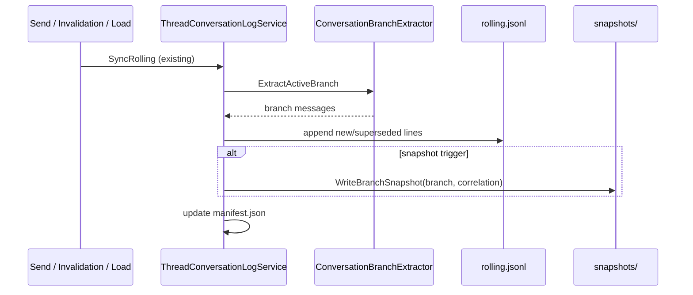

# Thread explicit snapshot logging

**Status:** Shipped (2026-07-03)  
**Related:** [thread-conversation-log.md](../developer/thread-conversation-log.md) · [thread-conversation-log-adr.md](../adr/thread-conversation-log-adr.md) · [narrative-flight-recorder-adr.md](../adr/narrative-flight-recorder-adr.md)

---

## Problem

The **rolling log** (`rolling.jsonl`) is an append-only, event-sourced mirror of the active ChatGPT branch. It is the right store for **edit history** and **reconciliation**, but the wrong store when you need the **explicit chat content at a known moment**.

| Need | Rolling log | Gap |
|------|-------------|-----|
| “What messages were on the thread after turn 12?” | Reconstruct via `BuildActiveIndex` over the full JSONL file | Cost grows with file size; superseded lines obscure the answer |
| “What did the thread look like *before* this edit?” | Superseded audit lines exist but are interleaved with active state | No frozen, self-contained artifact per moment |
| Correlate thread state with a flight record / send run | Ordinal map is derived | No stable snapshot id written at capture time |
| Export / forensics / tests | Works but requires rolling-log reader | Consumers must understand supersession semantics |

**Manual dumps** (`dumps/{timestamp}-conversation.json`) capture the full API `mapping` tree but are author-triggered, heavy (entire conversation JSON), and not correlated to sends or turns.

We need a third layer: **explicit branch snapshots** — immutable, self-contained records of the active branch at capture time.

---

## Layer taxonomy (do not conflate)

| Layer | Location | Granularity | Mutable? | Primary question |
|-------|----------|-------------|----------|------------------|
| **Rolling log** | `thread-logs/{id}/rolling.jsonl` | Per message append / supersede | Append-only | “How did this branch evolve?” |
| **Explicit snapshot** | `thread-logs/{id}/snapshots/` | Per capture event | Write-once | “What was on the thread at moment T?” |
| **Full dump** | `thread-logs/{id}/dumps/` | Manual API tree | Write-once | “What did ChatGPT store for this conversation?” |
| **Flight recorder** | `prompt-history.json` | Per verified send | Append | “What packet did we send?” |

Rolling log and explicit snapshots are **complementary**. Rolling remains the reconciliation source; snapshots are **denormalized read models** materialized at well-defined triggers.

---

## Design principles

1. **Immutable** — A snapshot file is never rewritten. New state → new file.
2. **Self-contained** — A reader can get the full active branch from one JSON file without scanning `rolling.jsonl`.
3. **Trigger-bound** — Every snapshot ties to a named lifecycle event (send, invalidation, session load, manual).
4. **Correlatable** — Optional foreign keys link to flight records, turn ids, play-send trace runs, and rolling ordinals.
5. **Cheap to read** — Optimized for consumers that only need “transcript at T”, not edit archaeology.
6. **Rolling stays canonical for sync** — Snapshots are derived from the same branch extraction path as rolling sync; they do not replace API reconciliation.

---

## On-disk layout

```
adventures/{adventureId}/thread-logs/{threadEntryId}/
  manifest.json              # extended with snapshot index (phase 2)
  rolling.jsonl              # unchanged — event-sourced mirror
  snapshots/
    {captureKey}-branch.json # explicit snapshot (this methodology)
  dumps/
    {timestamp}-conversation.json   # existing — full API tree
```

### `captureKey` format

```
{utc-timestamp}Z-{trigger}
```

Examples:

- `2026-07-03T08-15-42Z-send`
- `2026-07-03T08-16-01Z-invalidation`
- `2026-07-03T08-20-00Z-manual`

Use timestamp + trigger (not rolling ordinal alone) so multiple captures in the same second remain unique.

---

## Snapshot schema (`{captureKey}-branch.json`)

```json
{
  "schemaVersion": 1,
  "capturedAt": "2026-07-03T08:15:42.123Z",
  "captureTrigger": "send",
  "captureSource": "api",
  "adventureId": "guid",
  "threadEntryId": "guid",
  "threadKind": "Play",
  "conversationId": "uuid",
  "branchTailNodeId": "mapping-node-id",
  "branchMessageCount": 24,
  "rollingOrdinalHighWater": 41,
  "correlation": {
    "turnId": "guid-or-null",
    "flightRecordId": "guid-or-null",
    "playSendTraceRunId": "guid-or-null",
    "invalidationReason": null
  },
  "messages": [
    {
      "branchIndex": 0,
      "nodeId": "…",
      "messageId": "…",
      "role": "user",
      "rawText": "…",
      "displayText": "…",
      "isUtility": false,
      "isInjectedContext": false
    }
  ],
  "transcriptPairs": [
    {
      "turnIndex": 0,
      "playerText": "…",
      "narratorText": "…"
    }
  ]
}
```

### Field notes

| Field | Purpose |
|-------|---------|
| `messages` | Ordered active-branch messages — same shape as post-extraction branch, without supersession fields |
| `transcriptPairs` | Denormalized play pairs (utility/injected excluded by default) for O(1) story/export reads |
| `rollingOrdinalHighWater` | Max `ordinal` in rolling log after the sync that produced this snapshot — links snapshot ↔ rolling |
| `correlation` | Join keys for flight recorder, overlay turns, diagnostics |
| `captureTrigger` | Lifecycle event (see triggers table) |
| `captureSource` | `api` \| `dom` \| `migration` — same semantics as rolling log |

**Do not** embed the full API `mapping` tree in snapshots — that remains the job of `dumps/`.

---

## Capture triggers

Automatic snapshots honor per-adventure settings in **Play settings → Session → Thread snapshots** (`AdventureSettings.threadSnapshot`). Rolling log sync always runs; only snapshot file writes are gated.

| Trigger | Setting field | When |
|---------|---------------|------|
| **Verified play send** | `captureOnSend` | After rolling sync with `captureSource: send` |
| **Invalidation** | `captureOnInvalidation` | After rolling sync with `captureSource: invalidation` |
| **Session load** | `captureOnSessionLoad` | Play session load or design session open sync |
| **Utility worker complete** | `captureOnWorkerSend` | After worker thread sync |
| **Migration bootstrap** | *(always on)* | One-time thread log migration |
| **Manual** | *(always on)* | **Save thread snapshot** in Play More or Play settings → Session |

Defaults: all automatic triggers **on** except authors may disable any individually. Triggers are **sequential** (each lifecycle event may write one snapshot); they are not concurrent background jobs.

---

## Write path



Implementation sketch:

1. Reuse `ConversationBranchExtractor.ExtractActiveBranch` output already computed during `SyncRolling`.
2. After successful rolling append, if trigger is snapshot-eligible, call `ThreadConversationLogStore.WriteBranchSnapshot(...)`.
3. Build `transcriptPairs` via existing `ToTranscriptPairs` logic on the in-memory branch (not by re-reading rolling).

Entry point: extend `SyncRollingFromBranch` with optional `ThreadSnapshotCapture? correlation` parameter, or a dedicated `CaptureBranchSnapshotAfterSync` called from `MainWindow.ThreadConversationLog.cs` and `PlaySendOrchestrator` completion path.

---

## Read path (consumers)

| Consumer | Today | With snapshots |
|----------|-------|----------------|
| Packet transcript depth | `GetActiveBranch` → rolling scan | Latest `send` snapshot or explicit snapshot by `turnId` |
| Story export at turn N | Active branch only | Snapshot nearest `send` at or before N |
| Flight record ↔ thread audit | Ordinal map from rolling | `correlation.flightRecordId` join |
| Tests / diagnostics | Parse rolling.jsonl | Assert against `{captureKey}-branch.json` directly |
| Play handoff | `PlayHandoffService.CaptureSnapshot` (in-memory) | Optional: persist handoff checkpoint as `manual` snapshot |

### Reader API (proposed)

```csharp
ThreadConversationLogReader.GetLatestSnapshot(adventureId, threadEntryId, trigger?: string)
ThreadConversationLogReader.GetSnapshotByTurnId(adventureId, threadEntryId, turnId)
ThreadConversationLogReader.GetActiveBranchOrLatestSnapshot(...)  // fallback chain
```

**Fallback chain:** snapshot (if manifest says rolling is caught up) → rolling active branch → DOM/API live fetch.

---

## Retention

| Tier | Policy | Default |
|------|--------|---------|
| Hot | Keep all `send` + `invalidation` snapshots | Yes |
| Warm | Keep last N `session_load` per thread | N = 3 |
| Cold | Prune `migration` after successful verify | After 7 days |

Pruning is **phase 3** — v1 may retain all snapshots (they are smaller than full dumps). Manifest `snapshotCount` + `lastSnapshotAt` support future pruning.

---

## Manifest extensions (phase 2)

Add to `manifest.json`:

| Field | Meaning |
|-------|---------|
| `snapshotCount` | Total snapshot files written |
| `lastSnapshotAt` | UTC of latest snapshot |
| `lastSnapshotTrigger` | e.g. `send` |
| `latestSnapshotPath` | Relative path for quick open |
| `latestSendSnapshotPath` | Path of most recent `send` trigger |

---

## Author-facing surface (phase 3)

Play → More actions:

| Action | Behavior |
|--------|----------|
| **Sync thread log** | Unchanged — rolling reconcile only |
| **Dump thread log** | Unchanged — full API JSON to `dumps/` |
| **Save thread snapshot** (new) | Write `manual` branch snapshot without full API dump |

Optional: Injection dialog / flight recorder UI links “View thread at send” → open correlated snapshot.

---

## Testing methodology

Logged tests (`[Trait("Diagnostics", "Logged")]`) should prefer snapshot files over rolling reconstruction:

1. Act: verified send or forced sync with snapshot trigger
2. Assert: `snapshots/*-send-branch.json` exists
3. Assert: `transcriptPairs.Count` matches expected turns
4. Assert: `correlation.turnId` matches accepted turn
5. Optional: `Traces.PlaySend` sequence includes `thread_snapshot_captured` (new trace event)

Unit tests without disk: `ThreadConversationLogService.BuildBranchSnapshot(branch, correlation)` pure function.

---

## Implementation phases

| Phase | Scope | Acceptance |
|-------|-------|------------|
| **0** | This methodology doc | **Done** |
| **1** | Auto `send` + `invalidation` snapshots; store + service write | **Done** |
| **2** | Manifest index + `ThreadConversationLogReader` snapshot APIs | **Done** |
| **3** | Manual menu + retention pruning | **Done** |
| **4** | Consumer migration (export, handoff, correlation UI) | **Partial** — export + local transcript use snapshots; flight-record UI link deferred |

---

## Code touchpoints

| Component | Change |
|-----------|--------|
| `ThreadConversationLogStore.cs` | `SnapshotsDirectory`, `WriteBranchSnapshot` |
| `ThreadConversationLogService.cs` | Snapshot materialization after sync |
| `ThreadConversationLogManifest.cs` | Index fields (phase 2) |
| `MainWindow.ThreadConversationLog.cs` | Pass correlation from send/invalidation paths |
| `PlaySendOrchestrator` / `AdventureTurnService` | Supply `turnId`, `flightRecordId` at capture |
| `ThreadConversationLogReader.cs` | Snapshot read APIs |
| `docs/developer/thread-conversation-log.md` | Cross-link this methodology |

---

## Decision summary

> **Rolling log** = how the thread changed. **Explicit snapshot** = what the thread contained at a named moment. Both are written from the same branch extraction; snapshots are immutable read models for consumers that should not parse supersession semantics.

Full API dumps remain for forensic / mapping-tree needs. Flight recorder remains for outbound packet audit. Neither replaces explicit branch snapshots.
