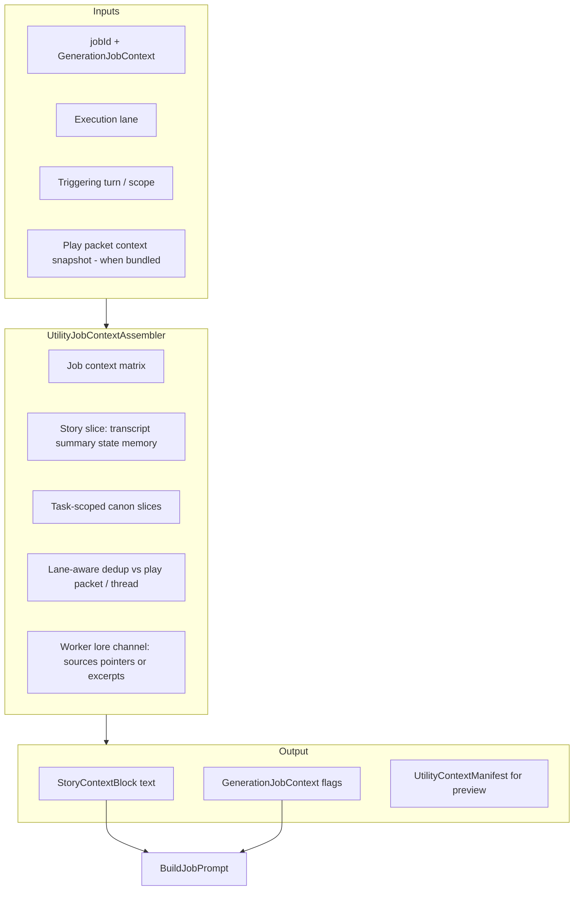

# Utility job context assembly — design track

**Status:** Backlog — design track (Linear [CMD-390](https://linear.app/cmd0112/issue/CMD-390))  
**ADR (spike):** [utility-job-context-assembly-adr.md](../utility-job-context-assembly-adr.md) ([CMD-391](https://linear.app/cmd0112/issue/CMD-391))  
**Tracker:** [strategic-value-additions-tracker.md](strategic-value-additions-tracker.md) (SVA-11)  
**Related:** [play-thread-utility-orchestration-adr.md](../play-thread-utility-orchestration-adr.md) · [utility-worker-lane-adr.md](../utility-worker-lane-adr.md) · [injection-policy-adr.md](../injection-policy-adr.md) · [prompt-construction-guide.md](../prompt-construction-guide.md)

---

## Goal

Make **what utility workers receive** deliberate, complete, and lane-aware — so jobs on the registered worker conversation (and injection-first play bundles) get the *right* story context and canon slices without duplicating narrator contract, play-packet lore, or full transcripts.

**Priority:** Optimize for utility job quality and worker isolation. Synergy with narrator pointer selection ([CMD-381](https://linear.app/cmd0112/issue/CMD-381)) is optional follow-up, not a dependency.

---

## Problem (current state)

Utility jobs are assembled through **three divergent paths**:

| Path | Story context | Reference-first | Typical use |
|------|---------------|---------------|-------------|
| **Worker lane** | `UtilityStoryContextBuilder` → `StoryContextBlock` | `ApplyReferenceFirstDefaults` in push | Manual/heavy jobs, auto spill |
| **Legacy inline** | Same builder in `RunInlineJobAsync` | Same | Fallback when injection-first off |
| **Injection-first bundled** | **No** `StoryContextBlock` — only `OmitRedundantJobTurnSlices` on job body | Assumes play thread + same-send narrator context | Auto jobs in next play packet |

### Known gaps

1. **Worker isolation** — Worker conversation cannot see the play thread. Reference-first flags that omit transcript/summary assume thread visibility; worker jobs need **self-contained** context every time.

2. **Bundled dedup is implicit** — Injection-first prepends `[[cgw:utility]]` to a play packet but does not compute an explicit **overlap manifest** (what narrator context already included vs what the job still needs).

3. **Scattered assembly** — `UtilityStoryContextBuilder`, `UtilityStoryContextProfiles`, `GenerationJobHandlers.BuildContinuityCheckPrompt`, and per-job prompt builders each slice context differently.

4. **Generic profiles, not task-aware** — Job profiles cap turn pairs and toggle sections statically; they do not select **relevant canon** for the triggering turn (e.g. entities mentioned, location, continuity-relevant source sections).

5. **No Project lore channel for worker** — Worker packets rarely include `[[cgw:sources]]`-style retrieve guidance or thin inline excerpts; heavy jobs (`continuity_check`, `process_turn`) may lack published lore access on an isolated conversation.

6. **Injection-first manual gap** — Manual utility-only sends via play thread may omit story block when not using legacy inline path.

---

## Target architecture

### Execution lanes (normative)

| Lane | `UtilityExecutionChannel` | Context rule |
|------|---------------------------|--------------|
| **Worker solo** | `WorkerBackground` | **Full self-contained** story block + lore channel; never assume play thread visibility |
| **Play bundled** | `AutoBackground` in same send as narrator | **Delta-only** vs merged play packet manifest; omit transcript/summary/state already in narrator context |
| **Play utility-only** | `ManualBackground` on play thread | Self-contained or thread-aware per ADR; must not rely on invisible prior turns |
| **Legacy inline** | Retired path | Migrate to assembler; deprecate duplicate logic |

---

## Content matrix (per job — ADR to lock)

Draft requirements; finalize in CMD-391 spike.

| Job | Story transcript | Summary | State | Entity index | Pinned memory | Canon slices | Worker lore |
|-----|------------------|---------|-------|--------------|---------------|--------------|-------------|
| `propose_memories` | Trigger turn only | Omit if in play ctx | Omit if bundled | No | Optional | No | Pointer-only if linked |
| `extract_entities` | Trigger turn | Omit if bundled | No | Compact index | No | Mentioned entities | Pointer-only |
| `update_summary` | Wide window | Prior summary | Yes | No | No | No | No |
| `continuity_check` | Recent window | Yes | Yes | Full compact | Optional | **Task-scoped** world/cast excerpts | **Required** when linked |
| `process_turn` | Trigger + prior | Yes | Yes | Yes | Yes | Task-scoped | Pointer-only |
| `expand_entity` | No | No | No | Target entity | No | Target section body | Inline if small |

**Task-scoped canon slices:** Select lore sections relevant to job scope (turn text, state location, entity ids) using **lexical triggers first** (aliases, `context-index.json`, state location). Optional later: semantic ranker shared with CMD-381 — separate issue, not blocking.

---

## Reference-first rules (utility-specific)

Extends [injection-policy-adr.md](../injection-policy-adr.md):

| Content | Worker solo | Play bundled |
|---------|-------------|--------------|
| Narrator contract / instructions | Never inline — cite Project | Never inline |
| Full published lore bodies | Pointers or task-scoped excerpts | Omit if narrator packet already delegated |
| Rolling summary | Include if not stale vs job scope | Omit if in narrator context this send |
| Transcript | Include required window | Omit if play thread has turns **and** same window in narrator packet |
| Job guide + schema | Always include | Always include |

---

## Implementation phases (Linear)

| Phase | Issue | Focus |
|-------|-------|-------|
| 0 | [CMD-391](https://linear.app/cmd0112/issue/CMD-391) | ADR: lane matrix + job content matrix + dedup |
| 1 | [CMD-392](https://linear.app/cmd0112/issue/CMD-392) | `UtilityJobContextAssembler` |
| 2 | [CMD-393](https://linear.app/cmd0112/issue/CMD-393) | Lane-aware dedup (bundled vs worker solo) |
| 3 | [CMD-394](https://linear.app/cmd0112/issue/CMD-394) | Worker lore channel |
| 4 | [CMD-395](https://linear.app/cmd0112/issue/CMD-395) | Job-scoped canon slices (lexical) |
| 5 | [CMD-396](https://linear.app/cmd0112/issue/CMD-396) | Handler consolidation |
| 6 | [CMD-397](https://linear.app/cmd0112/issue/CMD-397) | Preview manifest |
| 7 | [CMD-398](https://linear.app/cmd0112/issue/CMD-398) | Docs + tracker sync |
| — | [CMD-399](https://linear.app/cmd0112/issue/CMD-399) | Optional semantic lore (CMD-381 synergy, icebox) |

---

## Out of scope

- Utility **transport** (outbox, push/pull, injection-first scheduling) — [CMD-326](https://linear.app/cmd0112/issue/CMD-326), [CMD-358](https://linear.app/cmd0112/issue/CMD-358)
- Utility **response parse/retrieval** — [CMD-332](https://linear.app/cmd0112/issue/CMD-332)
- Replacing ChatGPT as the utility inference engine
- Narrator play packet pointer selection — [CMD-381](https://linear.app/cmd0112/issue/CMD-381) (parallel track)

---

## Success criteria

- [ ] Worker `continuity_check` and `propose_memories` succeed with useful context when play thread has 50+ turns and worker never saw them
- [ ] Injection-first bundled jobs do not duplicate summary/transcript already in the same play send
- [ ] AI Actions preview shows lane-specific assembly + dedup manifest
- [ ] One assembler replaces three divergent call sites
- [ ] Linked Project adventures: worker jobs include lore retrieval guidance without inlining full `cast.md`

---

## Related code (today)

| File | Role |
|------|------|
| `UtilityStoryContextBuilder.cs` | Story block assembly |
| `UtilityStoryContextProfiles.cs` | Static per-job caps |
| `PlayUtilityInjectionService.cs` | Injection-first sections (no story block) |
| `UtilityWorkerOrchestrator.cs` | Worker push + story build |
| `UtilityMessagePushService.cs` | Reference-first defaults on push |
| `GenerationJobHandlers.cs` | Job body + duplicate continuity slices |
| `GenerationJobService.cs` | Legacy inline story build |

---

*Last updated: 2026-06-28*
