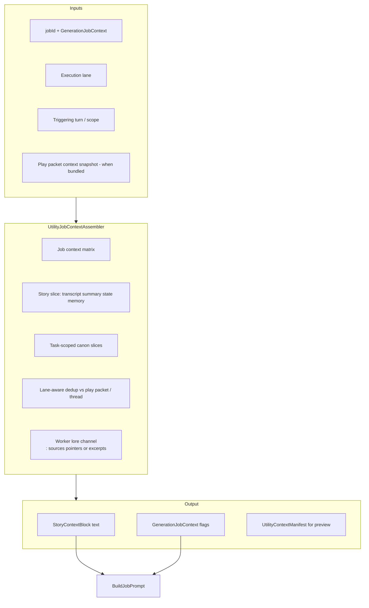

# Utility job context assembly — design track

**Status:** Implemented v1 (2026-06-28) — behind `UseUtilityJobContextAssembler` (default `true`); manual QA on long-play sessions pending  
**ADR (spike):** [utility-job-context-assembly-adr.md](../utility-job-context-assembly-adr.md) ([CMD-391](https://linear.app/cmd0112/issue/CMD-391))  
**E2E review:** [utility-job-e2e-review.md]() — bottom-up lanes, retrieval, field constraints  
**Tracker:** [strategic-value-additions-tracker.md]() (SVA-11)  
**Related:** [play-thread-utility-orchestration-adr.md](../play-thread-utility-orchestration-adr.md) · [utility-worker-lane-adr.md](../utility-worker-lane-adr.md) · [injection-policy-adr.md](../injection-policy-adr.md) · [prompt-construction-guide.md](../prompt-construction-guide.md)

---

## Goal

Make **what utility workers receive** deliberate, complete, and lane-aware — so jobs on the registered worker conversation (and injection-first play bundles) get the *right* story context and canon slices without duplicating narrator contract, play-packet lore, or full transcripts.

**Priority:** Optimize for utility job quality and worker isolation. Synergy with narrator pointer selection ([CMD-381](https://linear.app/cmd0112/issue/CMD-381)) is optional follow-up, not a dependency.

---

## Problem (was — gaps closed in v1)

Utility jobs were assembled through **three divergent paths** (now unified behind `UtilityJobContextAssembler` when enabled):

| Path | Story context (v1) | Reference-first / dedup | Typical use |
|------|-------------------|-------------------------|-------------|
| **Worker lane** | Assembler + worker lore + canon slices | Worker solo flags; self-contained every send | Manual/heavy jobs, auto spill |
| **Legacy inline** | Assembler via `GenerationJobService` | Same as worker/manual lane | Fallback when injection-first off |
| **Injection-first bundled** | No story block; snapshot dedup | `PlayPacketContextSnapshot` from `PrepareSend` | Auto jobs in next play packet |

### Resolved in v1 (CMD-392–398)

1. **Worker isolation** — Worker path builds full story block + `[[cgw:sources mode="utility-worker"]]`; flags from actual block, not play-thread turn count.
2. **Bundled dedup** — `PlayPacketContextSnapshotBuilder` + assembler bundled sync path (CMD-393).
3. **Single assembler** — Worker, play bundled, play utility-only, legacy inline, preview (CMD-392, CMD-397).
4. **Handler dedup** — `UtilityStoryContextDedup` + consolidated `BuildContinuityCheckPrompt` (CMD-396).
5. **Worker lore + canon slices** — `UtilityWorkerLoreChannelService` + `UtilityCanonSliceSelector` (CMD-394, CMD-395).
6. **Preview manifest** — `UtilityContextManifestRecord` on runs + AI Actions preview (CMD-397).

### Remaining / icebox

- **50+ turn field validation** — Needs manual QA on real adventures (WorkerOnly + long play history).
- **v2 improvements (umbrella)** — [CMD-401](https://linear.app/cmd0112/issue/CMD-401) inventories adaptive budgets, legacy retirement, preview parity, outcome correlation, lexical canon v2, and settings UX.
- **Semantic canon ranker** — [CMD-399](https://linear.app/cmd0112/issue/CMD-399) workstream A under CMD-401; optional CMD-381 synergy only.
- **Legacy fallback** — `ApplyReferenceFirstDefaults` still used when `UseUtilityJobContextAssembler` is off (retire via CMD-401 workstream B).

---

## Target architecture

### Execution lanes (normative)

| Lane | `UtilityExecutionChannel` | Context rule |
|------|---------------------------|--------------|
| **Worker solo** | `WorkerBackground` | **Full self-contained** story block + lore channel; never assume play thread visibility |
| **Play bundled** | `AutoBackground` in same send as narrator | **Delta-only** vs merged play packet manifest; omit transcript/summary/state already in narrator context |
| **Play utility-only** | `ManualBackground` on play thread | Self-contained or thread-aware per ADR; must not rely on invisible prior turns |
| **Legacy inline** | Retired path | Migrate to assembler; deprecate duplicate logic |

---

## Content matrix (per job — canonical)

> **Authoritative table:** [ai-tools-context-matrix.md](ai-tools-context-matrix.md) (2026-07-04).  
> The draft below is retained for CMD-391 history; update the canonical doc when requirements change.

Draft requirements; finalize in CMD-391 spike.

| Job | Story transcript | Summary | State | Entity index | Pinned memory | Canon slices | Worker lore |
|-----|------------------|---------|-------|--------------|---------------|--------------|-------------|
| `propose_memories` | Trigger turn only | Omit if in play ctx | Omit if bundled | No | Optional | No | Pointer-only if linked |
| `extract_entities` | Trigger turn | Omit if bundled | No | Compact index | No | Mentioned entities | Pointer-only |
| `update_state` | Trigger + prior | Omit if bundled | Via SIO | Compact (presence) | No | No | No |
| `update_summary` | Wide window | Prior summary | Yes | No | No | No | No |
| `continuity_check` | Recent window | Yes | Yes | Full compact | Optional | **Task-scoped** world/cast excerpts | **Required** when linked |
| `process_turn` | Trigger + prior | Yes | Yes | Yes | Yes | Task-scoped | Pointer-only |
| `expand_entity` | No | No | No | Target entity | No | Target section body | Inline if small |

**Task-scoped canon slices:** Select lore sections relevant to job scope (turn text, state location, entity ids) using **lexical triggers first** (aliases, `context-index.json`, state location). Optional later: semantic ranker shared with CMD-381 — separate issue, not blocking.

---

## Reference-first rules (utility-specific)

Extends [injection-policy-adr.md](../injection-policy-adr.md):

| Content | Worker solo | Play bundled |
|---------|-------------|--------------|
| Narrator contract / instructions | Never inline — cite Project | Never inline |
| Full published lore bodies | Pointers or task-scoped excerpts | Omit if narrator packet already delegated |
| Rolling summary | Include if not stale vs job scope | Omit if in narrator context this send |
| Transcript | Include required window | Omit if play thread has turns **and** same window in narrator packet |
| Job guide + schema | Always include | Always include |

---

## Implementation phases (Linear)

| Phase | Issue | Focus | Status |
|-------|-------|-------|--------|
| 0 | [CMD-391](https://linear.app/cmd0112/issue/CMD-391) | ADR spike | **Done** |
| 1 | [CMD-392](https://linear.app/cmd0112/issue/CMD-392) | `UtilityJobContextAssembler` | **Done** |
| 2 | [CMD-393](https://linear.app/cmd0112/issue/CMD-393) | `PlayPacketContextSnapshot` bundled dedup | **Done** |
| 3 | [CMD-394](https://linear.app/cmd0112/issue/CMD-394) | Worker lore channel | **Done** |
| 4 | [CMD-395](https://linear.app/cmd0112/issue/CMD-395) | Lexical canon slices (inline excerpts) | **Done** |
| 5 | [CMD-396](https://linear.app/cmd0112/issue/CMD-396) | Handler consolidation | **Done** |
| 6 | [CMD-397](https://linear.app/cmd0112/issue/CMD-397) | Preview manifest | **Done** |
| 7 | [CMD-398](https://linear.app/cmd0112/issue/CMD-398) | Docs + tracker sync | **Done** |
| — | [CMD-401](https://linear.app/cmd0112/issue/CMD-401) | v2 icebox umbrella (adaptive assembly, quality, legacy) | Icebox |
| — | [CMD-399](https://linear.app/cmd0112/issue/CMD-399) | Semantic canon slices (CMD-401 workstream A) | Icebox |

---

## Field constraints (extended diagnostics)

Real sessions (2026-06) inform implementation priorities:

| Observation | Implication for this track |
|-------------|---------------------------|
| **`WorkerOnly` policy** common | Worker assembler path (CMD-392) is primary, not edge case |
| **`http_403` on API** → DOM worker send | Large self-contained packets; avoid duplication (CMD-393, CMD-396) |
| **Pin vs caps split** (fixed: `TryReconcilePinFromCapabilities`) | Jobs must reach orchestrator before context matters |
| **`process_turn` 7k packet → parse fail** | Context quality + handler dedup may help schema adherence; retrieval OK |
| **Play injection bundled: flags only** | CMD-393 highest risk for wrong lore/context |

Full bottom-up review: [utility-job-e2e-review.md]().

---

- Utility **transport** (outbox, push/pull, injection-first scheduling) — [CMD-326](https://linear.app/cmd0112/issue/CMD-326), [CMD-358](https://linear.app/cmd0112/issue/CMD-358)
- Utility **response parse/retrieval** — [CMD-332](https://linear.app/cmd0112/issue/CMD-332)
- Replacing ChatGPT as the utility inference engine
- Narrator play packet pointer selection — [CMD-381](https://linear.app/cmd0112/issue/CMD-381) (parallel track)

---

## Success criteria

- [ ] Worker `continuity_check` and `propose_memories` succeed with useful context when play thread has 50+ turns and worker never saw them *(needs manual QA)*
- [x] Injection-first bundled jobs do not duplicate summary/transcript already in the same play send
- [x] AI Actions preview shows lane-specific assembly + dedup manifest
- [x] One assembler replaces three divergent call sites (when `UseUtilityJobContextAssembler` enabled)
- [x] Linked Project adventures: worker jobs include lore retrieval guidance without inlining full `cast.md`

---

## Implementation (v1 code)

| File | Role |
|------|------|
| `UtilityJobContextAssembler.cs` | Single entry — all lanes + manifest |
| `UtilityJobContextPreviewService.cs` | AI Actions local/live preview |
| `PlayPacketContextSnapshotBuilder.cs` | Bundled play-packet overlap snapshot |
| `UtilityStoryContextDedup.cs` | Shared job-core vs story-block dedup rules |
| `UtilityWorkerLoreChannelService.cs` | Worker `[[cgw:sources mode="utility-worker"]]` |
| `UtilityCanonSliceSelector.cs` | Lexical slices + inline excerpt caps |
| `UtilityCanonSliceProfiles.cs` | Per-job inline char budgets |
| `UtilityJobScopeSignals.cs` | Turn/scope/entity signals for canon selection |
| `UtilityContextManifest.cs` / `UtilityContextManifestRecord.cs` | Preview + flight recorder |
| `PlayUtilityInjectionService.cs` | Bundled / utility-only assembly + manifest on pending |
| `UtilityWorkerOrchestrator.cs` | Worker push assembly |
| `GenerationJobService.cs` | Legacy inline assembly |
| `GenerationJobHandlers.cs` | Job body (deduped continuity / memory / summary) |
| `UtilityStoryContextBuilder.cs` | Story block sections (input to assembler) |

---

*Last updated: 2026-06-28*
