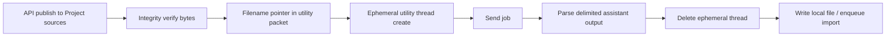

# Utility source-reference file I/O (canon)

**Status:** **Shipped and live-verified** (2026-07-03) — full E2E gate including ephemeral thread delete.

Companion to [CMD-441](https://linear.app/cmd0112/issue/CMD-441). Retired alternatives: [utility-source-file-io-retired-methodologies.md](utility-source-file-io-retired-methodologies.md).

| Topic | Doc / issue |
|-------|-------------|
| Kernel | `UtilitySourceFileIoService` · [CMD-443](https://linear.app/cmd0112/issue/CMD-443) |
| Publish gate | [CMD-442](https://linear.app/cmd0112/issue/CMD-442) |
| E2E gate (thread + pointer + extract + delete) | [CMD-445](https://linear.app/cmd0112/issue/CMD-445) |
| Reference job | `EntitiesFileRevisionService` / `propose_entities_file` |
| Retired spikes | [utility-source-file-io-retired-methodologies.md](utility-source-file-io-retired-methodologies.md) |

---

## Canon pathway



| Step | Mechanism | Notes |
|------|-----------|--------|
| **1. Upload** | `UtilitySourceFileIoService.PublishBytesToProjectAsync` / `PublishLocalFileToProjectAsync` | `ProjectSourcePublicationPipeline`; diagnostic default **PureApi** |
| **2. Reference** | `BuildSourceRetrieveLine` + `BuildTaskScopedPointerLine` in `[[cgw:sources]]` TASK-SCOPED | Unique names e.g. `sources/cgw-utility-source-io-{token}.md` |
| **3. Thread** | `EphemeralProjectChatService.RunOnceAsync` | Create on project home → send → capture |
| **4. Output** | `BuildDelimitedOutputDeliveryBlock` → `TryExtractDelimitedBlock` | Scrape `--- begin file ---` / `--- end file ---` from assistant text |
| **5. Cleanup** | `DeleteAfterCapture = true` | Hide/delete ephemeral utility thread after capture |

---

## Decision rule

> **Programmatic utility text file jobs:** verified Project sources publish + filename pointer + ephemeral utility thread + **delimited text scrape out** + delete ephemeral thread.

Do **not** use chat-thread attach, chat-download folders, or immediate conversation file download to implement this loop. See [retired methodologies](utility-source-file-io-retired-methodologies.md).

**Play images** and **manual utility reference files** (binary) still use DOM composer attach — [utility-worker-attachment-delivery.md](utility-worker-attachment-delivery.md) — that is a separate domain from this canon.

---

## Canonical naming

All utility source I/O publishes use:

```text
sources/cgw-utility-io/{adventureKey}/{jobKey}/{runKey}/in/{fileName}
```

| Segment | Example | Notes |
|---------|---------|-------|
| `adventureKey` | `4e8faadf` | First 8 hex chars of adventure `Guid` |
| `jobKey` | `propose-entities-file` | `GenerationJobId` with `_` → `-` |
| `runKey` | `6ba7b8109dad` | First 12 hex chars of utility `RunId` |
| `fileName` | `entities.json` | Logical file basename |

Diagnostics use `adventureKey=diag` and the diagnostic job key `source-io-e2e`.

Registry: `{adventureDir}/utility-source-io-registry.json` tracks `file_id` per publish.

## Lifecycle / cleanup

| Trigger | Behavior |
|---------|----------|
| **On job complete (success)** | Delete registered input source file(s) for that `runId` via `DeleteProjectFileAsync` |
| **On job failure** | Re-queue delete with **7-day TTL** fallback |
| **Before next publish** | Sweep expired TTL entries |

Jobs in catalog: `UtilitySourceFileIoCatalog` (`extract_entities`, `expand_entity`, `propose_entities_file`, `propose_source_edits`).

---

| Method | Purpose |
|--------|---------|
| `PublishBytesToProjectAsync` | Upload + attach + byte verify |
| `PublishLocalFileToProjectAsync` | Read disk → publish |
| `BuildSourceRetrieveLine` | Single-line retrieve hint for job body |
| `BuildTaskScopedPointerLine` | `[[cgw:sources]]`-style bullet |
| `BuildDelimitedOutputDeliveryBlock` | Job guide prose for required inline output |
| `TryExtractDelimitedBlock` / `HasCompleteDelimitedDelivery` | Parse assistant reply |
| `BuildE2eJobPacket` / `TryExtractE2eOutput` | E2E diagnostic job + extract |

**Reference job:** `propose_entities_file` publishes `entities.json`, references Project source path, parses delimited JSON output only (no chat-download fallback).

---

## Live diagnostic

### Phase 1 — publish + verify (default)

```powershell
$env:CGW_RUN_LIVE_API_TESTS = "1"
$env:CGW_UTILITY_SOURCE_IO_GIZMO_ID = "g-p-…"
.\tests\ChatGPTWrapper.ApiDiagnostics\scripts\run-utility-source-file-io-diagnostics.ps1
```

### Phase 2 — full E2E (CMD-445)

```powershell
$env:CGW_RUN_LIVE_API_TESTS = "1"
$env:CGW_UTILITY_SOURCE_IO_GIZMO_ID = "g-p-…"
$env:CGW_UTILITY_SOURCE_IO_E2E = "1"
.\tests\ChatGPTWrapper.ApiDiagnostics\scripts\run-utility-source-file-io-diagnostics.ps1 -E2E
```

Optional pinned thread (skips create/delete steps):

```powershell
$env:CGW_UTILITY_SOURCE_IO_CONVERSATION_ID = "{uuid}"
```

**E2E steps:**

1. `publish_source_file` — upload + verify
2. `e2e_setup_adventure_bridge`
3. `e2e_project_home` + `e2e_composer_ready` (or `e2e_conversation_ready` when reusing thread)
4. `e2e_send_pointer_job` — `[[cgw:sources]]` TASK-SCOPED pointer + delimited output contract
5. `e2e_extract_delimited_output` — `E2E confirmed: {token}`
6. `e2e_delete_ephemeral_thread` — ephemeral create mode only

**Pass:** `E2eClassification=pass`, `EphemeralThreadDeleted=True` (ephemeral create).

**Reports:** `%LocalAppData%\ChatGPTWrapper\utility-source-file-io-report.{txt,json}`

**Live evidence (2026-07-03):** 12/12 pass on `g-p-6a2c6cd152e08191b018455b5712bd5e`.

---

## Rollout (CMD-441)

| Phase | Issue | Status |
|-------|-------|--------|
| Kernel + `propose_entities_file` | [CMD-443](https://linear.app/cmd0112/issue/CMD-443) | Shipped |
| Publish gate | [CMD-442](https://linear.app/cmd0112/issue/CMD-442) | Shipped + verified |
| E2E gate | [CMD-445](https://linear.app/cmd0112/issue/CMD-445) | Shipped + verified |
| Canon docs | [CMD-444](https://linear.app/cmd0112/issue/CMD-444) | Shipped |
| Retired methodologies doc | (this session) | Shipped |
