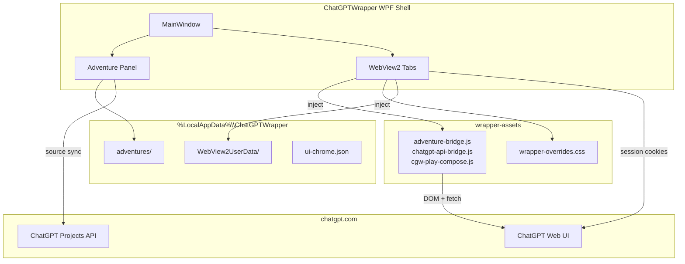

# ChatGPT Wrapper — Documentation Index

Desktop wrapper for [ChatGPT](https://chatgpt.com) built with **.NET 9 WPF** and **Microsoft WebView2**. The app embeds ChatGPT in a native shell, injects JavaScript/CSS for reading and automation enhancements, and includes a full **Adventures** subsystem for local-first interactive fiction with optional **ChatGPT Projects** integration.

There is **no OpenAI API key** — all ChatGPT access uses your logged-in web session inside WebView2.

## Architecture at a glance

## Choose your path

### I want to use the app

| Document | Description |
|----------|-------------|
| [README](../README.md) | Build, run, publish — quick start |
| [User Guide](user-guide.md) | Browse mode, chat tabs, continuous view, phrase highlights, UI chrome |
| [Adventure Panel Reference](adventure-panel.md) | Full Adventures UI, play loop, dialogs, workflows — includes [canonical begin-play checklist](adventure-panel.md#g-canonical-begin-play-workflow-design--first-turn) |
| [Projects & Source Sync](user-projects-and-sync.md) | Link ChatGPT Projects, sync lore files, thin vs fat packets |
| [Instruction vs Sources Paradigm](instruction-sources-paradigm.md) | What goes in Project instructions vs source files vs play packets |
| [Prompt Construction Guide](prompt-construction-guide.md) | How play packets, start packets, design chat, and utility jobs build prompts |
| [Instruction Contract Guide](instruction-contract-guide.md) | Define boundaries, portrayal rules, publish instructions — includes [drafting tutorial](instruction-contract-guide.md#tutorial-drafting-narrator-instructions) |
| [Utility Job Orchestration](utility-job-orchestration.md) | Generation jobs: readiness gate, atomic DOM turns, session reuse |
| [Troubleshooting](troubleshooting.md) | Diagnostics, auth, bridge failures, recovery |

### I want to understand or modify the code

| Document | Description |
|----------|-------------|
| [Architecture](architecture.md) | Solution structure, runtime modes, page integration, concurrency |
| [WebView Bridges](webview-bridges.md) | JS↔C# protocol, every bridge command |
| [ChatGPT API Integration](chatgpt-api-integration.md) | Internal backend-api paths, send pipeline, caches |
| [Data Model Reference](data-model-reference.md) | JSON schemas, on-disk layout, migrations |
| [Services Reference](services-reference.md) | All adventure and API services, generation jobs |
| [Prompt Construction Guide](prompt-construction-guide.md) | Prompt builders, thin/fat packets, pointer resolution, job prompts |
| [Utility Job Orchestration](utility-job-orchestration.md) | Phase 2c utility pipeline (readiness, atomic send, errors) |
| [UI Components](ui-components.md) | WPF views, dialogs, MainWindow partial-class map |
| [Injected Assets](injected-assets.md) | `ChatGPT_files/` JS and CSS reference |
| [Testing](testing.md) | Test tiers, fixtures, live diagnostics, CI |
| [Linear integration](linear-integration.md) | Issue workflow, PR linking, GitHub ↔ Linear setup |
| [Build & Deploy](build-and-deploy.md) | Build, publish, distribution |
| [AI Dungeon Phased Plan](AI-DUNGEON-PHASED-PLAN.md) | 70-feature roadmap and implementation status |

### Proposed enhancements

| Document | Description |
|----------|-------------|
| [Attachment-aware context injection](Enhancements/attachment-aware-context-injection.md) | Branch play packet injection by attachment type (native composer, metadata scrape, policy design) |

## Solution projects

| Project | Target | Role |
|---------|--------|------|
| `ChatGPTWrapper` | `net9.0-windows` WPF | Main desktop application |
| `ChatGPTWrapper.Core` | `net9.0` | Shared parsing, bridge protocol, session host RPC |
| `ChatGPTWrapper.SessionHost` | `net9.0` console | Named-pipe stub for future out-of-process WebView |
| `ChatGPTWrapper.ApiDiagnostics` | `net9.0-windows` xUnit | Unit, integration, live, and performance tests |

## Glossary

| Term | Meaning |
|------|---------|
| **Adventure** | A local interactive-fiction session with JSON persistence under `adventures/{guid}/` |
| **Bundle** | `AdventureBundle` — all documents for one adventure loaded together |
| **Bridge** | Injected JavaScript that communicates with C# via `postMessage` (API or adventure/play) |
| **Gizmo** | ChatGPT Project ID from the backend API (`g-…` or similar) |
| **Thin packet** | Minimal play prompt when Project sources are in sync — lore delegated to Project files |
| **Fat packet** | Full inline lore in the play prompt — used when no Project or sources out of sync |
| **Utility job** | Background AI task (entity extraction, memory proposals, etc.) on a separate or inline ChatGPT thread |
| **Source manifest** | `source-manifest.json` tracking local vs remote file hashes and sync state |
| **Play tab pin** | WebView tab pinned to an adventure's ChatGPT conversation |
| **Continuous view** | In-page transcript mode that collapses chat bubbles into readable prose |
| **Context tags** | `[[cgw:…]]` markers in packets for stripping/display in the thread |

## Data location

All runtime data: `%LocalAppData%\ChatGPTWrapper\`

See [Data Model Reference — On-disk layout](data-model-reference.md#on-disk-layout) for the full directory tree.
