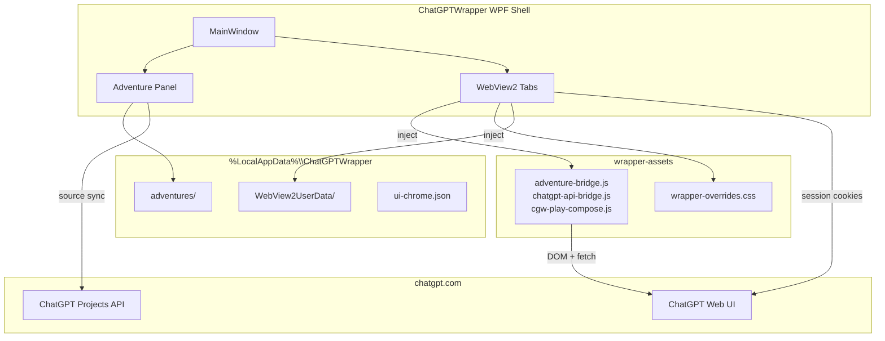

# ChatGPT Wrapper — Documentation Index

Desktop wrapper for [ChatGPT](https://chatgpt.com) built with **.NET 9 WPF** and **Microsoft WebView2**. The app embeds ChatGPT in a native shell, injects JavaScript/CSS for reading and automation enhancements, and includes a full **Adventures** subsystem for local-first interactive fiction with optional **ChatGPT Projects** integration.

*Documentation index last reorganized: 2026-06-29.*

There is **no OpenAI API key** — all ChatGPT access uses your logged-in web session inside WebView2.

## Documentation layout

| Folder | Purpose |
|--------|---------|
| [`user/`](user/) | Author and end-user guides — Adventures UI, instructions, prompts, troubleshooting |
| [`developer/`](developer/) | Code architecture, build, test, bridges, utility pipeline |
| [`reference/`](reference/) | Catalogs — data model, services, UI components, thread registry |
| [`settings/`](settings/) | Settings UX taxonomy, inventory, appearance |
| [`adr/`](adr/) | Normative architecture decision records |
| [`plans/`](plans/) | Implementation plans and phased delivery docs |
| [`linear/`](linear/) | Linear issue workflow, PR linking, agent canon |
| [`Enhancements/`](Enhancements/) | Spikes, backlog trackers, proposed features |

## Architecture at a glance

## Choose your path

### I want to use the app

| Document | Description |
|----------|-------------|
| [README](../README.md) | Build, run, publish — quick start |
| [User Guide](user/user-guide.md) | Browse mode, chat tabs, continuous view, phrase highlights, UI chrome |
| [Adventure Panel Reference](user/adventure-panel.md) | Adventures UI, dialogs, workflows, smoke checklists — includes [canonical begin-play checklist](user/adventure-panel.md#g-canonical-begin-play-workflow-design--first-turn) |
| [Projects & Source Sync](user/user-projects-and-sync.md) | Link ChatGPT Projects, sync lore files, thin vs fat packets |
| [Instruction vs Sources Paradigm](user/instruction-sources-paradigm.md) | What goes in Project instructions vs source files vs play packets |
| [Instruction Channels Glossary](user/instruction-channels.md) | CMD-289 — five-channel terminology, decision tree, producer audit |
| [Entity Canon Change Paradigm](user/entity-canon-change-paradigm.md) | Entity edits → sources sync pipeline, workspace UX, rename wizard (CMD-232) |
| [Prompt Construction Guide](user/prompt-construction-guide.md) | How play packets, start packets, design chat, and utility jobs build prompts — includes [flight recorder audit trail](user/prompt-construction-guide.md#flight-recorder-audit-trail-sva-03) |
| [Injection Policy Implementation Plan](plans/injection-policy-implementation-plan.md) | CMD-292 — reference-first injection, budget pipeline, live control ([epic](https://linear.app/cmd0112/issue/CMD-292)) |
| [Injection Policy ADR](adr/injection-policy-adr.md) | Normative reference-first / completeness / live-control rules (CMD-293) |
| [Play Send Orchestration Plan](plans/play-send-orchestration-implementation-plan.md) | Host-owned send, API-canonical delivery, verified packets |
| [Play Send Orchestration ADR](adr/play-send-orchestration-adr.md) | Normative invariants: wrapper composer, artifact contract, capability matrix |
| [Instruction Contract Guide](user/instruction-contract-guide.md) | Define boundaries, portrayal rules, publish instructions — includes [drafting tutorial](user/instruction-contract-guide.md#tutorial-drafting-narrator-instructions) |
| [Narrator Settings](user/narrator-settings.md) | Play side panel narrator overrides — scopes, scene profiles, packet injection |
| [Appearance & Theme Settings](settings/appearance-theme-settings.md) | Shell theme dialog, token layers, CSS layering, wave 2 roadmap |
| [Settings & Interactables Inventory](settings/settings-interactables-inventory.md) | Master catalog of settings, dialogs, persistence (CMD-255) |
| [Settings UX Taxonomy](settings/settings-ux-taxonomy.md) | Scope layers, discovery rules, deprecation register (CMD-262) |
| [Utility Job Orchestration](developer/utility-job-orchestration.md) | Generation jobs: dual-lane routing, worker outbox, play injection |
| [Ephemeral Project Chat](developer/ephemeral-project-chat.md) | One-shot project chat: create → send → capture → delete (no thread binding) |
| [Thread conversation log](developer/thread-conversation-log.md) | Per-thread rolling JSONL transcript, sync triggers, indexing, dumps |
| [Adventure Thread Registry](reference/adventure-thread-registry.md) | Multi-thread pins, schema 6, UtilityWorker kind |
| [Utility Worker Lane ADR](adr/utility-worker-lane-adr.md) | Registered worker conversation, API push/pull, outbox |
| [Utility delivery pivot ADR](adr/utility-delivery-pivot-adr.md) | Historical — CMD-248 dedicated-thread retirement |
| [Canon schema ADR](reference/canon-schema.md) | Hybrid entity model, `CanonSchemaRegistry` (CMD-191) |
| [Play-Thread Utility Orchestration Plan](plans/play-thread-utility-orchestration-plan.md) | CMD-326 — injection-first utility execution, schema, hiding, retrieval |
| [Play-Thread Utility Orchestration ADR](adr/play-thread-utility-orchestration-adr.md) | CMD-327 — normative decisions for CMD-326 |
| [Utility Job Context Assembly ADR](adr/utility-job-context-assembly-adr.md) | CMD-390 — worker-first utility job story context ([design track](Enhancements/utility-job-context-assembly.md)) |
| [Play Thread Canonical ADR](adr/play-thread-canonical-adr.md) | Thread-canonical play, symmetric edit invalidation — [CMD-348](https://linear.app/cmd0112/issue/CMD-348) user edit · [CMD-349](https://linear.app/cmd0112/issue/CMD-349) narrator revision |
| [User Message Edit ADR](adr/user-message-edit-adr.md) | CMD-350 — overlay-first user edit transport per view mode |
| [Narrator Revision ADR](adr/narrator-revision-adr.md) | CMD-352 — composer revision primary, message taxonomy, hiding |
| [Play Message Edit Refinement Plan](plans/play-message-edit-refinement-plan.md) | CMD-348 / CMD-349 — execution plan for user edit reliability and narrator revision pipeline |
| [Troubleshooting](user/troubleshooting.md) | Diagnostics, auth, bridge failures, recovery — includes [flight record inspection](user/troubleshooting.md#inspect-a-flight-record-for-a-turn) |

### I want to understand or modify the code

| Document | Description |
|----------|-------------|
| [AGENTS.md](../AGENTS.md) | Agent entry point — Linear issue workflow, dual-canon sync |
| [Architecture](developer/architecture.md) | Solution structure, runtime modes, page integration, concurrency |
| [Play Send Orchestration Plan](plans/play-send-orchestration-implementation-plan.md) | Host-owned send pipeline — phases 0–9 |
| [Play Send Orchestration ADR](adr/play-send-orchestration-adr.md) | Delivery invariants, capability matrix, tiered delivery |
| [Play/Design surface convergence ADR](adr/play-design-surface-convergence-adr.md) | CMD-21 / CMD-230 — in-session Play/Design toggle (Option 2) |
| [Play surface UX modernization ADR](adr/play-surface-ux-modernization-adr.md) | CMD-415 / CMD-416 — Phase 3 shell & companion IA, density, deduped chrome |
| [Play surface UX modernization plan](plans/play-surface-ux-modernization-implementation-plan.md) | CMD-415 — phased implementation handoff for Plan tool |
| [WebView Bridges](developer/webview-bridges.md) | JS↔C# protocol, every bridge command |
| [ChatGPT API Integration](developer/chatgpt-api-integration.md) | Internal backend-api paths, send pipeline, caches |
| [Data Model Reference](reference/data-model-reference.md) | JSON schemas, on-disk layout, migrations |
| [Adventure Thread Registry](reference/adventure-thread-registry.md) | Thread registry, pins, UtilityWorker, Threads hub |
| [Canon schema ADR](reference/canon-schema.md) | Dynamic canon field mapping (CMD-191) |
| [Runtime canon schema plan](plans/runtime-canon-schema-plan.md) | CMD-196 schema-as-data engine roadmap |
| [Adventure Developer Reference](developer/adventure-developer-reference.md) | Turn lifecycle, packet internals, project linking, source sync, key services |
| [Entity Canon Change Paradigm](user/entity-canon-change-paradigm.md) | EntityChangePlan, auto-sync, mention index, canon inbox |
| [Services Reference](reference/services-reference.md) | All adventure and API services, generation jobs |
| [Ephemeral Project Chat](developer/ephemeral-project-chat.md) | Isolated one-shot linked-project message round-trip |
| [Prompt Construction Guide](user/prompt-construction-guide.md) | Prompt builders, thin/fat packets, pointer resolution, job prompts |
| [Injection Policy ADR](adr/injection-policy-adr.md) | Normative reference-first assembly and dedup rules (CMD-293) |
| [Utility Job Orchestration](developer/utility-job-orchestration.md) | Dual-lane utility pipeline (play injection + worker) |
| [Utility Worker Lane ADR](adr/utility-worker-lane-adr.md) | Worker lane normative decisions (CMD-358) |
| [Utility Worker Lane plan](plans/utility-worker-lane-plan.md) | Worker lane implementation phases |
| [UI Components](reference/ui-components.md) | WPF views, dialogs, MainWindow partial-class map |
| [Settings interactables audit](settings/settings-interactables-audit.md) | Surface audits: keep / merge / deprecate (CMD-256–261) |
| [Injected Assets](developer/injected-assets.md) | `ChatGPT_files/` JS and CSS reference |
| [Testing](developer/testing.md) | Test tiers, fixtures, live diagnostics, CI |
| [Performance audit](developer/performance-audit.md) | End-to-end perf review — hot paths, roadmap, observability-preserving optimizations |
| [Refactor & code-trim audit](developer/refactor-audit.md) | End-to-end refactor/trim opportunities — mega-files, duplication, dead code, JS assets (2026-06-30) |
| [Linear integration](linear/linear-integration.md) | Issue workflow, PR linking, GitHub ↔ Linear setup |
| [Linear issue reference](linear/linear-issue-reference.md) | Label taxonomy, statuses, issue templates — agent canon |
| [Build & Deploy](developer/build-and-deploy.md) | Build, publish, distribution |

### Spikes and proposed enhancements

| Document | Description |
|----------|-------------|
| [Chat File I/O Feasibility](Enhancements/chat-file-io-feasibility.md) | Chat upload/download: API vs DOM, diagnostics, production paths |
| [Utility worker attachment delivery](Enhancements/utility-worker-attachment-delivery.md) | Dual-lane reference files for worker jobs ([CMD-411](https://linear.app/cmd0112/issue/CMD-411)) |
| [Project source publication redesign](Enhancements/project-source-publication-redesign.md) | Publication lab + shared browser-file kernel ([CMD-428](https://linear.app/cmd0112/issue/CMD-428)) |
| [Project source publication ADR](adr/project-source-publication-adr.md) | DOM-first publication lab; manual publish authoritative ([CMD-429](https://linear.app/cmd0112/issue/CMD-429)) |
| [Attachment-aware context injection](Enhancements/attachment-aware-context-injection.md) | Branch play packet injection by attachment type |
| [Local neural TTS](Enhancements/local-neural-tts.md) | Icebox: offline Sherpa-ONNX / Kokoro ([CMD-277](https://linear.app/cmd0112/issue/CMD-277)) |
| [Strategic value additions tracker](Enhancements/strategic-value-additions-tracker.md) | **SVA** + **SVX** backlog with technology matrix |
| [Narrative flight recorder plan](Enhancements/narrative-flight-recorder-implementation-plan.md) | SVA-03 — per-turn injection audit ([CMD-402](https://linear.app/cmd0112/issue/CMD-402)) |
| [Narrative flight recorder ADR](adr/narrative-flight-recorder-adr.md) | Schema v2 + capture boundary ([CMD-403](https://linear.app/cmd0112/issue/CMD-403)) |
| [Local semantic retrieval ADR](adr/local-semantic-retrieval-adr.md) | SVA-01 — ONNX + sqlite-vec ([CMD-382](https://linear.app/cmd0112/issue/CMD-382)) |
| Local semantic retrieval (planned) | [CMD-381](https://linear.app/cmd0112/issue/CMD-381) epic |
| [plans/native-advanced-color-picker](plans/native-advanced-color-picker.md) | Backlog: native advanced color picker |
| Utility job context assembly (v1) | [CMD-390](https://linear.app/cmd0112/issue/CMD-390) — [design](Enhancements/utility-job-context-assembly.md) · [ADR](adr/utility-job-context-assembly-adr.md) · [E2E review](Enhancements/utility-job-e2e-review.md) |
| [Utility inference routing tracker](Enhancements/utility-inference-routing-tracker.md) | Track A vs Track B local inference policy |
| [Local generative assist use cases](Enhancements/local-generative-assist-use-cases.md) | Track B catalog (LGA-01–08) |
| [Local inference quality guide](Enhancements/local-inference-quality-guide.md) | Ollama models, settings, chunking |

## Adventures roadmap (phase status)

High-level Adventures delivery phases. Individual features are tracked as **CMD-** issues in [Linear](https://linear.app/cmd0112/project/chatgpt-wrapper).

| Phase | Status | Summary |
|-------|--------|---------|
| **0** | **Done** | Stores, models, backup, dashboard shell, local-only hint |
| **1** | **Done** | Play loop, bridge, packet builder, linking, start adventure |
| **2** | **Mostly done** | Projects/sync/thin packets + `GenerationJobService`, review UIs, instruction auto-sync |
| **2c** | **Done** | Utility job orchestration — see [utility-job-orchestration.md](developer/utility-job-orchestration.md) |
| **2b** | Partial | Memory/cards/continuity services exist; job UIs incomplete |
| **3** | Partial | `entities.json` + Reference CRUD/review; full generation job suite |
| **4** | Partial | Undo, edit, branch, save states, queue in code; some UI present |
| **5** | Partial | `LibraryStore`, libraries dialog, random tables, save scenario |
| **6** | Partial | Export formats; session list; recap stub; clean/archive toggles |
| **7** | Planned | Advanced continuity, DOM sync, narrative CSS port |

## Solution projects

| Project | Target | Role |
|---------|--------|------|
| `ChatGPTWrapper` | `net9.0-windows` WPF | Main desktop application |
| `ChatGPTWrapper.Core` | `net9.0` | Shared parsing, bridge protocol, session host RPC |
| `ChatGPTWrapper.SessionHost` | `net9.0` console | Named-pipe stub for future out-of-process WebView |
| `ChatGPTWrapper.ApiDiagnostics` | `net9.0-windows` xUnit | Unit, integration, live, and performance tests |

## Glossary

| Term | Meaning |
|------|---------|
| **Adventure** | A local interactive-fiction session with JSON persistence under `adventures/{guid}/` |
| **Bundle** | `AdventureBundle` — all documents for one adventure loaded together |
| **Bridge** | Injected JavaScript that communicates with C# via `postMessage` (API or adventure/play) |
| **Gizmo** | ChatGPT Project ID from the backend API (`g-…` or similar) |
| **Thin packet** | Minimal play prompt when Project sources are in sync — lore delegated to Project files |
| **Fat packet** | Full inline lore in the play prompt — used when no Project or sources out of sync |
| **Utility job** | Background AI task (entity extraction, memory proposals, etc.) on a separate or inline ChatGPT thread |
| **Source manifest** | `source-manifest.json` tracking local vs remote file hashes and sync state |
| **Play tab pin** | WebView tab pinned to an adventure's ChatGPT conversation |
| **Continuous view** | In-page transcript mode that collapses chat bubbles into readable prose |
| **Context tags** | `[[cgw:…]]` markers in packets for stripping/display in the thread |

## Data location

All runtime data: `%LocalAppData%\ChatGPTWrapper\`

See [Data Model Reference — On-disk layout](reference/data-model-reference.md#on-disk-layout) for the full directory tree.
