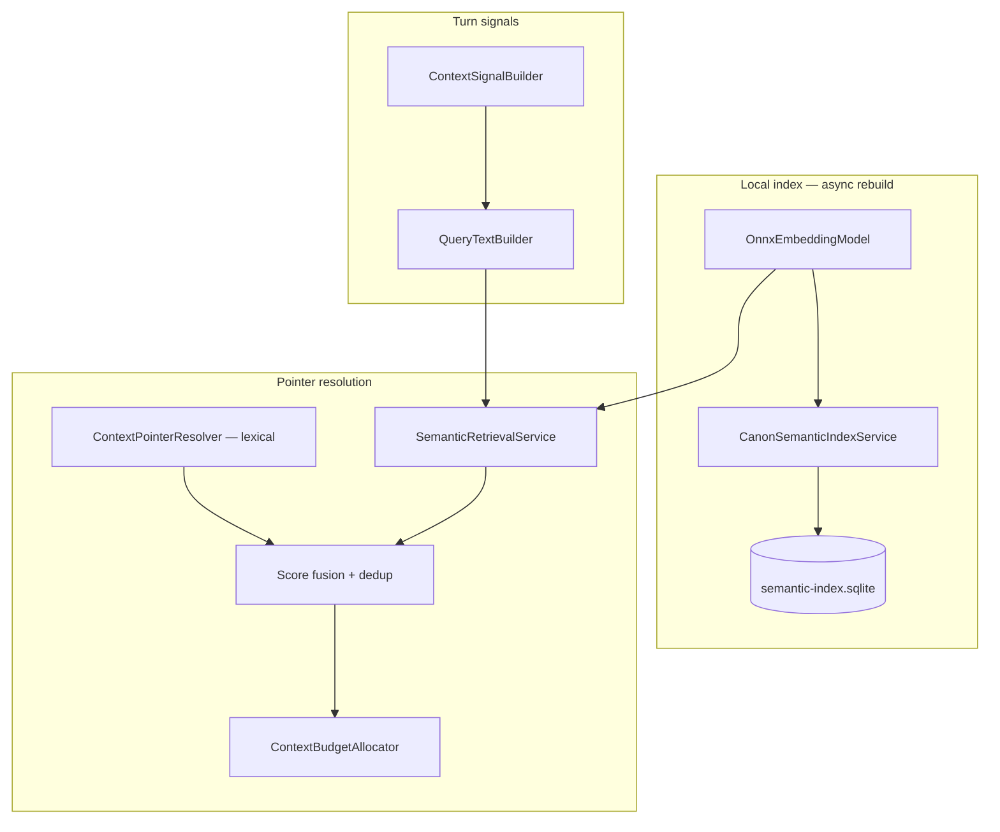

# ADR: Local Semantic Retrieval for Context Pointers

**Status:** Accepted  
**Date:** 2026-06-28  
**Epic:** [CMD-381](https://linear.app/cmd0112/issue/CMD-381)  
**Spike:** [CMD-382](https://linear.app/cmd0112/issue/CMD-382)  
**Tracker:** [Enhancements/strategic-value-additions-tracker.md](../Enhancements/strategic-value-additions-tracker.md) (SVA-01)

**Builds on:** [injection-policy-adr.md](injection-policy-adr.md) · [prompt-construction-guide.md](../user/prompt-construction-guide.md) · [narrative-flight-recorder-adr.md](narrative-flight-recorder-adr.md)

**Parallel (not a dependency):** [CMD-390](https://linear.app/cmd0112/issue/CMD-390) utility job context assembly — lexical task-scoped canon today; optional semantic ranker deferred to [CMD-399](https://linear.app/cmd0112/issue/CMD-399)

---

## Context

Play packets in **SourceDelegated** profile assemble `[[cgw:sources]]` pointers via `ContextPointerResolver`. Candidate sections are scored with **lexical rules only**:

| Signal | Mechanism | Limit |
|--------|-----------|-------|
| Player line | Alias / title token match | Misses paraphrases |
| Rolling summary | Alias match (lower score) | Thematic overlap without shared tokens |
| State location | Place alias match | Only when location string aligns |
| `context-index.json` | Trigger token match | Manual curation burden |
| Pins / baseline | Fixed ALWAYS RETRIEVE set | Not turn-adaptive |

Authors on long campaigns report **relevant lore not surfacing** when the player uses different wording than section aliases — e.g. “the basement whispers” vs alias “Basement Whispers Cult”. Project RAG may eventually retrieve the right file, but local pointer honesty and flight-recorder audit depend on **deliberate local selection** before send.

### Distinct from related initiatives

| Initiative | Relationship |
|------------|--------------|
| **Project RAG** | ChatGPT-side retrieval when sources are published — semantic retrieval **augments** local THIS TURN pointers; does not replace Project retrieval |
| **CMD-390 / SVA-11** | Utility worker lore uses `ResolveTaskScoped` + lexical canon slices — **out of scope** for v1; optional shared index in CMD-399 |
| **SVA-03 flight recorder** | Displays `PointerSource.SemanticMatch` when present; shadow mode logs semantic candidates before rollout |
| **SVX-15 cross-adventure search** | FTS across library — per-adventure semantic index is SVA-01 |
| **SVA-08 attachment intelligence** | Understands attachments → inbox — different pipeline |

---

## Decision summary

| Topic | Decision |
|-------|----------|
| Goal | Per-turn **THIS TURN** pointer candidates from local canon via embedding similarity |
| Scope v1 | **SourceDelegated** profile only (`PromptPacketBuilder.BuildSourceDelegatedContext`) |
| Index store | SQLite + **sqlite-vec** at `adventures/{id}/cache/semantic-index.sqlite` (derived, rebuildable) |
| Embed runtime | **Microsoft.ML.OnnxRuntime** + **`bge-small-en-v1.5`** ONNX (~130MB bundled or lazy-download) |
| Chunk unit | **Section-level** (`machineId` = `file#sectionId`); sub-chunks for `BodyCache` > 1,200 chars |
| Corpus v1 | Published `sources/` sections from `source-manifest.json` (`BodyCache` non-empty) |
| Corpus v1.1 | Entity fields, memory anchors, story cards (separate phase) |
| Query text | Player line + state location + summary excerpt (≤400 chars) + last 2 accepted narrator turns |
| Fusion | Lexical resolve first; semantic top-k merged by `machineId` with capped semantic base score |
| New source | `PointerSource.SemanticMatch` |
| Pipeline hook | After `ContextSignalBuilder.Build`, inside extended resolver — **before** `ContextBudgetAllocator` |
| Policy compliance | Reference-first unchanged — semantic hits emit **pointers only**, never inline bodies in thin mode |
| Baseline protection | Semantic path **cannot** add or remove ALWAYS RETRIEVE baseline pointers |
| Rollout | **Shadow → feature flag → default on** per adventure |
| Latency budget | **≤150 ms** embed + top-k search (p95) on typical laptop CPU for ≤800 chunks |
| Privacy | Local-only; no cloud embedding APIs |

---

## 1. Problem statement

Lexical scoring (`NameMatch`, `Trigger`, `State`) requires token overlap between player text and section aliases/titles. Failure modes:

1. **Paraphrase** — player describes a concept without using canon names.
2. **Thematic relevance** — summary + player line imply a section; no alias hit.
3. **Stale triggers** — `context-index.json` triggers not maintained as lore grows.
4. **Summary-only signal** — matches at score 15 are filtered by `ScoreThreshold` (20).

Semantic retrieval adds a **dense similarity channel** mapped back to the same `machineId` pointer namespace `SectionAliasIndex` already uses — so injection policy, budget allocator, and flight recorder remain unchanged.

---

## 2. Architecture



### 2.1 Index file and lifecycle

| Property | Value |
|----------|-------|
| Path | `{AdventureDirectory}/cache/semantic-index.sqlite` |
| Nature | **Derived cache** — excluded from `ExportService` default bundle; rebuilt on import |
| Rebuild triggers | `source-manifest.json` content hash change; manual “Rebuild retrieval index” in Play settings |
| Incremental | v1: full rebuild on trigger (acceptable for &lt;500 sections); v1.1: chunk-level upsert |
| Backup | Optional — safe to delete; index rebuilds from canon |

**Schema (conceptual):**

```sql
CREATE TABLE index_meta (
  schema_version INTEGER NOT NULL,
  model_id TEXT NOT NULL,
  model_version TEXT NOT NULL,
  corpus_hash TEXT NOT NULL,
  built_at TEXT NOT NULL
);

CREATE TABLE chunks (
  chunk_id TEXT PRIMARY KEY,          -- "{machineId}" or "{machineId}@{part}"
  machine_id TEXT NOT NULL,           -- "plot.md#mysteries/basement-whispers"
  file_name TEXT NOT NULL,
  section_id TEXT NOT NULL,
  kind TEXT NOT NULL,
  title TEXT NOT NULL,
  body_text TEXT NOT NULL,
  token_estimate INTEGER NOT NULL
);

-- sqlite-vec virtual table
CREATE VIRTUAL TABLE chunk_embeddings USING vec0(
  chunk_id TEXT PRIMARY KEY,
  embedding FLOAT[384] distance_metric=cosine
);
```

### 2.2 Embedding model

| Candidate | Dimensions | Size | Notes |
|-----------|------------|------|-------|
| **`bge-small-en-v1.5`** (chosen) | 384 | ~130MB ONNX | Strong English retrieval; query prefix `Represent this sentence for searching relevant passages:` |
| `all-MiniLM-L6-v2` (fallback) | 384 | ~80MB | Lighter; use if bge misses latency budget on min-spec hardware |

**Runtime:** `Microsoft.ML.OnnxRuntime` CPU EP. GPU EP optional later; not required for v1.

**Packaging:** Ship model under `%LocalAppData%\ChatGPTWrapper\models\bge-small-en-v1.5.onnx` with lazy first-run download + checksum verification (same pattern as future TTS model assets).

### 2.3 Chunking rules

| Rule | Detail |
|------|--------|
| Primary unit | One `SectionManifestEntry` with non-empty `BodyCache` → at least one chunk |
| `machineId` | `Section.MachineId(fileName)` — must match lexical resolver |
| Sub-chunk | If `BodyCache.Length > 1200`, split on `\n\n` paragraphs; max 900 chars per chunk; overlap 100 chars |
| Sub-chunk id | `{machineId}@{partIndex}` — search returns chunk; fusion maps to parent `machineId` |
| Exclusions | Same as lexical: `SectionSchema.IsReferenceSourceFile` (e.g. `narrator-scales.md`, `canon-format.md`) |
| Empty body | Skip — no index row |

**v1.1 extensions (not v1):** entity description/notes fields, pinned memory anchors, active story cards — each as additional chunks with `kind` metadata for scoped search.

### 2.4 Query construction

`QueryTextBuilder.Build(ContextSignalBag signals, AdventureBundle bundle)`:

```
{playerLine}

Location: {stateLocation or "unknown"}

Summary: {first 400 chars of rolling summary}

Recent:
{narrator excerpt turn N-1}
{narrator excerpt turn N-2}
```

- Player line: **original casing** (embeddings are case-aware enough; do not lower-case for query).
- Recent turns: last 2 **accepted** narrator texts from `log.json`, truncated to 300 chars each.
- Omit empty sections.

### 2.5 Retrieval

`SemanticRetrievalService.Search(adventureId, queryText, topK)`:

| Parameter | Default |
|-----------|---------|
| `topK` | 12 chunk hits before parent dedupe |
| `minCosineSimilarity` | 0.42 (tune in shadow — CMD-384) |
| Post-process | Map chunk hits → distinct `machineId`; keep best similarity per parent |

Returns `IReadOnlyList<SemanticHit>`: `{ MachineId, Similarity, ChunkId }`.

---

## 3. Score fusion with lexical resolver

### 3.1 Order of operations

1. Build `ContextSignalBag` (unchanged).
2. Run **lexical** `ContextPointerResolver.ResolveCore` → candidate map.
3. If semantic enabled (not `Off`) and index ready:
   - Build query text.
   - Run semantic search.
   - For each hit, compute semantic base score (below).
   - Merge into candidate map by `machineId`.
4. Apply existing filters: threshold, `DedupParents`, `ApplyPersonCluster`, render mode pick.
5. Split baseline vs THIS TURN buckets (unchanged).
6. `ContextBudgetAllocator.ApplyBudget` (unchanged).

Implementation detail: extract `ResolveCore` merge logic into `ContextPointerResolver` with optional `ISemanticRetrievalService` injection — or a thin `ContextPointerResolverWithSemantic` wrapper called from `PromptPacketBuilder` only.

### 3.2 Semantic base score mapping

Map cosine similarity `s` (0–1) to integer score:

```
semanticScore = clamp(10 + floor(s * 30), 10, 38)
```

| Similarity | Score | Rationale |
|------------|-------|-----------|
| 0.42 (min) | ~23 | Clears `ScoreThreshold` (20) |
| 0.55 | ~26 | Below strong name match (35) |
| 0.75 | ~32 | Competitive with trigger/state |
| 0.90 | ~37 | Below pin (40) and baseline (100) |

**Merge rule** when `machineId` already exists:

```
finalScore = max(existingScore, semanticScore)
finalSource = existingScore >= semanticScore ? existingSource : SemanticMatch
```

If only semantic hit (no lexical):

```
Add pointer with Source = SemanticMatch, Score = semanticScore
```

Populate `ContextPointer` from `SectionAliasIndex` for title/kind/bodyCache — same as lexical `MakePointer`.

### 3.3 Invariants (injection policy)

| Invariant | Enforcement |
|-----------|-------------|
| Baseline pointers unchanged | Semantic path never adds `PointerSource.Baseline` |
| Reference-first thin mode | Semantic hits use `RenderMode.PointerOnly` until budget allocator degrades |
| No duplicate bodies | Semantic does not inject inline lore in SourceDelegated profile |
| Mandatory sections | `InjectionPolicyGuard` unchanged |
| Score threshold | Semantic hits below 20 after mapping are dropped |
| Person cluster | `ApplyPersonCluster` runs after fusion |

### 3.4 `PointerSource.SemanticMatch`

Add to `PointerSource` enum:

```csharp
SemanticMatch,
```

Flight recorder / preview labels: **“Semantic match”** (see [narrative-flight-recorder-adr.md](narrative-flight-recorder-adr.md) Appendix A).

---

## 4. Modes and rollout

### 4.1 Adventure setting

Add to `AdventureSettings` (or nested `retrievalPolicy`):

```json
{
  "semanticRetrieval": {
    "mode": "Off",
    "shadowLogCandidates": true
  }
}
```

| Mode | Behavior |
|------|----------|
| **Off** | Lexical only (default) |
| **Shadow** | Compute semantic candidates; log to flight record / debug trace; **do not** merge into live pointers |
| **On** | Full fusion per §3 |

Global wrapper default: `Off` until shadow evaluation passes (CMD-384).

### 4.2 Shadow evaluation (CMD-384)

For each send in Shadow mode, persist on flight record (or sidecar `semantic-shadow.jsonl`):

```json
{
  "turnId": "guid",
  "queryHash": "sha256",
  "candidates": [
    { "machineId": "plot.md#mysteries/basement-whispers", "similarity": 0.71, "lexicalScore": 0, "wouldFuse": true }
  ]
}
```

Compare against author-annotated “expected sections” on fixture adventures (≥10 scripted player lines per CMD-382 acceptance).

### 4.3 Feature flag rollout (CMD-388)

1. Internal dogfood adventures → `On`.
2. Opt-in toggle in Play settings → Advanced → Context retrieval.
3. Default `On` for SourceDelegated when shadow metrics beat lexical-only on 50+ turn fixture.

---

## 5. Performance and failure modes

| Concern | Mitigation |
|---------|------------|
| Index missing | Fall back to lexical-only; surface “Retrieval index not built” in Play settings |
| Index stale | Background rebuild on manifest hash mismatch; serve stale index with warning until rebuild completes |
| Model missing | Disable semantic path; link to model download |
| Slow embed | Cache query embedding for debounced preview (same player line within 500ms) |
| Large adventures | Cap index at 2,000 chunks; warn in settings |
| Timeout | 200ms hard cap → skip semantic for this send, log metric |

**Promotion gate:** p95 ≤150ms embed+search on reference hardware (8-core laptop, 800 chunks, CPU EP).

---

## 6. Surfaces affected

| Surface | Change |
|---------|--------|
| `PromptPacketBuilder.BuildSourceDelegatedContext` | Call semantic-aware resolver |
| `ContextPointerResolver` | Fusion + `SemanticMatch` |
| `InjectionPreviewCoordinator` | Preview shows semantic pointers when mode ≥ Shadow |
| `FlightRecorderPanel` | Pointer list includes Semantic match badge |
| Play settings | Index status, rebuild, mode toggle |
| `ExportService` | Document that `cache/` is optional |

**Unchanged:** MinimalLocal, InlineFallback profiles; utility job assembly (CMD-390); start packet `freshNarrativeBootstrap` baseline expansion.

---

## 7. Implementation phases (Linear)

| Phase | Issue | Deliverable |
|-------|-------|-------------|
| 0 | CMD-382 | This ADR |
| 1 | CMD-383 | `CanonSemanticIndexService` + SQLite schema + rebuild on fixture |
| 2 | CMD-387 | `SemanticRetrievalService` + ONNX embedder |
| 3 | CMD-389 | Fuse into `ContextPointerResolver` behind `Off` default |
| 4 | CMD-384 | Shadow logging + fixture benchmark (≥10 lines) |
| 5 | CMD-388 | Feature flag + opt-in UI |
| 6 | CMD-385 | Next send preview semantic badges |
| 7 | CMD-386 | Docs + `data-model-reference` cache section |

---

## 8. Non-goals (v1)

- Replacing ChatGPT Project RAG or changing delegation rules
- Inline full section bodies in SourceDelegated profile via semantic path
- Utility worker / CMD-394 lore channel semantic ranker (CMD-399 icebox)
- Cloud embedding APIs (OpenAI, Cohere, etc.)
- Cross-adventure semantic index (SVX-15)
- Re-ranking with a local LLM
- Indexing full `log.json` transcript (optional v2 for recap-like retrieval)
- Changing `ContextBudgetAllocator` mandatory baseline rules

---

## 9. Prerequisites

| Prerequisite | Required for |
|--------------|--------------|
| [Injection policy CMD-292](injection-policy-adr.md) | Reference-first pointer taxonomy |
| [CMD-295](https://linear.app/cmd0112/issue/CMD-295) preview manifest | Honest section display |
| Thread-canonical play CMD-348+ | Stable turn/query correlation (partial OK for shadow) |
| NuGet: OnnxRuntime + sqlite-vec | Index + embed |

**Not blocking ADR or index spike:** Play send orchestration phases 3–6; utility lane transport.

---

## 10. Spike protocol (CMD-383 / CMD-384)

Validate on **one fixture adventure** with ≥10 scripted player lines and author-annotated expected `machineId` sets.

| # | Player line (example class) | Expected section | Lexical alone |
|---|----------------------------|------------------|---------------|
| 1 | Paraphrase of location | `world.md#places/old-quarter` | Miss |
| 2 | Thematic question, no names | relevant plot section | Miss |
| 3 | Exact alias | same section | Hit |
| … | ≥10 total | | |

**Pass criteria:**

- Semantic **recall@3** ≥80% on fixture (expected section in top 3 fused pointers).
- Semantic **precision** — no more than 2 spurious THIS TURN pointers beyond lexical on average per line.
- Latency within §5 budget.

Record results in `docs/Enhancements/local-semantic-retrieval-spike-results.md` (create when CMD-384 runs).

---

## 11. Sign-off criteria (epic CMD-381)

- [ ] Fixture benchmark passes (§10)
- [ ] Shadow mode on dogfood adventure for 1 week without pointer regressions
- [ ] Flight recorder shows `SemanticMatch` sources when enabled
- [ ] Index rebuild completes in &lt;5s for 200-section adventure
- [ ] Unit tests: fusion rules, baseline protection, index round-trip
- [ ] `prompt-construction-guide.md` + `data-model-reference.md` updated
- [ ] No injection policy violations (DEBUG guard + golden tests)

---

## Appendix A — Inventory of callsites to change

| File | Change |
|------|--------|
| `ContextPointer.cs` | Add `PointerSource.SemanticMatch` |
| `ContextPointerResolver.cs` | Fusion hook; optional semantic service |
| `PromptPacketBuilder.cs` | Wire semantic resolver in SourceDelegated path |
| `AdventureSettings` / metadata model | `semanticRetrieval.mode` |
| `CanonSemanticIndexService.cs` | **New** — build/rebuild SQLite index |
| `SemanticRetrievalService.cs` | **New** — embed query + vec search |
| `OnnxEmbeddingModel.cs` | **New** — ONNX session wrapper |
| `QueryTextBuilder.cs` | **New** — query string from signals + log |
| `FlightRecordCaptureService.cs` | Shadow candidate snapshot (Shadow mode) |
| `InjectionPreviewCoordinator.cs` | Semantic badges |
| `AdventureStore.cs` | Ensure `cache/` directory exists |
| `ChatGPTWrapper.csproj` | Package refs: OnnxRuntime, sqlite-vec |

---

## Appendix B — Example fusion walkthrough

**Player line:** “I try to remember what the whispers in the cellar meant.”

**Lexical:** no alias hit for `plot.md#mysteries/basement-whispers` → absent.

**Semantic:** top hit `plot.md#mysteries/basement-whispers` similarity 0.68 → score 30.

**Result:** THIS TURN pointer added, `Source = SemanticMatch`, `Score = 30`, `Mode = PointerOnly`.

**Budget trim:** if over budget, degrades like any other THIS TURN pointer (score 30 — mid-tier).

---

*Last updated: 2026-06-28*
