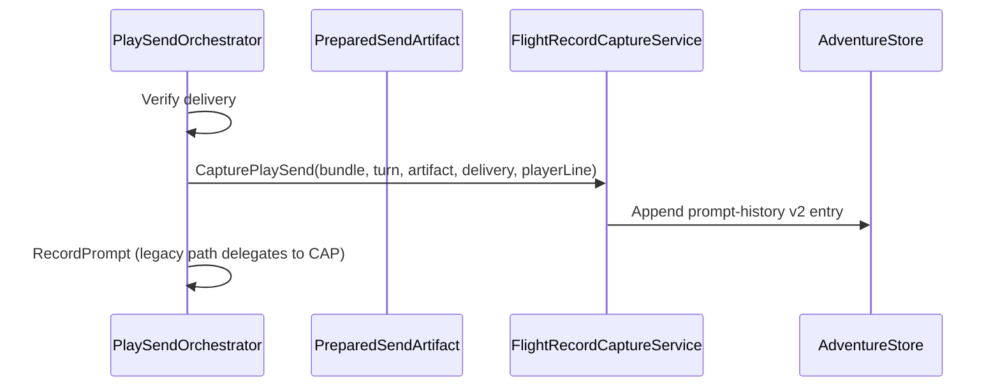

# ADR: Narrative Flight Recorder

**Status:** Accepted  
**Date:** 2026-06-28  
**Epic:** [CMD-402](https://linear.app/cmd0112/issue/CMD-402)  
**Spike:** [CMD-403](https://linear.app/cmd0112/issue/CMD-403)  
**Implementation plan:** [Enhancements/narrative-flight-recorder-implementation-plan.md](../Enhancements/narrative-flight-recorder-implementation-plan.md)  
**Tracker:** [Enhancements/strategic-value-additions-tracker.md](../Enhancements/strategic-value-additions-tracker.md) (SVA-03)

**Builds on:** [injection-policy-adr.md](injection-policy-adr.md) · [play-send-orchestration-adr.md](play-send-orchestration-adr.md) · [prompt-construction-guide.md](../user/prompt-construction-guide.md)

**Feeds:** SVA-01 shadow evaluation (CMD-381), SVX-12 playtesting harness, SVX-22 scene UI metadata (stretch)

**Related:** [local-semantic-retrieval-adr.md](local-semantic-retrieval-adr.md) — displays `PointerSource.SemanticMatch` when SVA-01 ships

---

## Context

Authors need to answer **“what did the model see on this turn?”** — injection breakdown, budget trims, pointer selection, utility lanes, and delivery outcome. Today:

| Surface | What it shows | Gap |
|---------|---------------|-----|
| **Next send preview** | Current draft packet + section manifest | Ephemeral; no per-turn history |
| **`prompt-history.json`** | `PacketText` + `PacketHash` per send | No manifest, pointers, delivery, utility links |
| **Play injection dialog History tab** | Last 40 packet texts | No manifest, diff, or correlation |
| **`play-send-trace.jsonl`** | Orchestrator/delivery events | Not linked to turns in UI |
| **`log.json`** | Accepted player + narrator transcript | Not the merged injection packet |
| **Utility job runs** | `UtilityContextManifestRecord` (CMD-397) | Not linked from play send timeline |

[injection-policy-adr.md](injection-policy-adr.md) requires author-visible honesty about reference vs delta vs trimmed sections ([CMD-295](https://linear.app/cmd0112/issue/CMD-295)). That honesty must **persist per turn**, not only at preview time.

### Distinct from related initiatives

| Initiative | Relationship |
|------------|--------------|
| **SVX-05** craft analytics | Measures prose quality in `log.json` — not injection audit |
| **SVA-01** semantic retrieval | Adds `PointerSource.SemanticMatch`; flight recorder displays it when present |
| **CMD-397** utility manifest | Source data for utility correlation in flight records |
| **CMD-292** injection policy | Section taxonomy flight records must mirror |

---

## Decision summary

| Topic | Decision |
|-------|----------|
| Product name | **Narrative Flight Recorder** — read-only audit UI over per-send records |
| Storage | Extend **`prompt-history.json`** to schema **v2** (single audit file; export/backup already includes it) |
| Capture boundary | **`PlaySendOrchestrator`** after delivery verification, same moment as `RecordPrompt` |
| Bytes stored | **Delivered** `PreparedSendArtifact.MergedText` + hash — never re-prepare for history |
| Manifest | Persist `InjectionSection` list + `TrimmedSection` list matching preview taxonomy |
| Pointers | Serialize `ContextResolveResult` baseline + THIS TURN lean records (no `BodyCache`) |
| Delivery | Store channel, outcome, verified flag, optional failure code |
| v1 send scope | **Verified play sends only**; blocked/failed sends deferred to v1.1 |
| UI v0 | Upgrade **Play injection dialog History tab**; dedicated adventure panel tab is v1 |
| Re-send from history | **Out of scope** v1 — read-only |
| Privacy | Local-only; never upload wholesale to Project |
| Size policy | Default retain **200** full-text entries; older entries may drop `PacketText` but keep manifest (configurable later) |

---

## 1. Schema v2 (`prompt-history.json`)

### Document root

```json
{
  "schemaVersion": 2,
  "entries": [ ]
}
```

v1 documents (`schemaVersion` absent or `1`) migrate on load: each entry becomes v2 with `injection: null`, `delivery: null`, `playerLine: ""`, `kind: "PlaySend"`.

### Entry shape (normative)

```json
{
  "id": "guid",
  "turnId": "guid-or-null",
  "at": "2026-06-28T12:00:00Z",
  "kind": "PlaySend",
  "playerLine": "I examine the notice board.",
  "packetText": "[[cgw:meta ...]]\n...",
  "packetHash": "sha256-hex",
  "playSendTraceRunId": "optional-run-id",
  "utilityJobIds": ["guid"],
  "utilityRuns": [
    {
      "runId": "guid",
      "jobId": "update_summary",
      "channel": "AutoBackground",
      "contextManifest": { "lane": "AutoBackground", "jobId": "update_summary", "sectionsIncluded": ["summary"] }
    }
  ],
  "injection": {
    "profile": "SourceDelegated",
    "delegationMode": "SourceDelegated",
    "attachmentMode": "TextOnly",
    "wasTrimmed": false,
    "mergedCharCount": 4200,
    "contextCharCount": 3800,
    "hasUtilityInjection": false,
    "utilitySectionCount": 0,
    "sections": [
      {
        "id": "sources",
        "kind": "Reference",
        "mandatory": true,
        "included": true,
        "note": null,
        "charEstimate": 420,
        "omissionReason": "None"
      }
    ],
    "trimmed": [
      { "id": "transcript", "reason": "budget" }
    ],
    "baselinePointers": [
      {
        "machineId": "world/lore#cosmology",
        "fileName": "world.md",
        "sectionId": "cosmology",
        "title": "Cosmology",
        "kind": "lore",
        "score": 100,
        "source": "Baseline",
        "mode": "PointerOnly"
      }
    ],
    "thisTurnPointers": [
      {
        "machineId": "places/old-quarter-tavern",
        "fileName": "places.md",
        "sectionId": "old-quarter-tavern",
        "title": "Old Quarter Tavern",
        "kind": "place",
        "score": 35,
        "source": "State",
        "mode": "PointerOnly"
      }
    ]
  },
  "delivery": {
    "channel": "Api",
    "outcome": "ok",
    "failureCode": null,
    "conversationId": "uuid",
    "verified": true
  }
}
```

### `kind` enum

| Value | When |
|-------|------|
| `PlaySend` | Normal play turn via orchestrator |
| `Start` | Start adventure / bootstrap packet |
| `Handoff` | Thread handoff packet |
| `UtilityInline` | Utility-only send on play thread (future) |

### C# model mapping

| JSON | Type |
|------|------|
| `entries[]` | `List<FlightRecordEntry>` (replaces bare `PromptHistoryEntry` for v2) |
| `injection.sections[]` | Mirror `InjectionSection` + `InjectionOmissionReason` |
| `injection.*Pointers[]` | `ContextPointerRecord` — subset of `ContextPointer` |
| `delivery` | `FlightDeliverySnapshot` |

**Backward compatibility:** `PromptHistoryEntry` fields (`PacketText`, `PacketHash`, `TurnId`, `At`) remain on `FlightRecordEntry` for export and existing readers.

---

## 2. Capture pipeline



### Inputs at capture

| Input | Source |
|-------|--------|
| `MergedText`, `Hash`, `PlayerLine` | `PreparedSendArtifact` |
| Sections, trimmed, profile, pointers | Enriched artifact from `PromptInjectionPrepareResult` |
| Delivery channel, verified, conversation id | `PlaySendResult` / `DeliveryVerification` |
| Trace run id | `PlaySendTrace` scope id |
| Utility job ids | Bundled utility injection coordinator (when present) |

### Invariants

1. **I1 — No re-prepare:** Capture uses the artifact that was delivered; if orchestrator detects stale artifact, send aborts before capture.
2. **I2 — Manifest parity:** Section ids and kinds match `InjectionSectionManifestBuilder` output for the same prepare inputs.
3. **I3 — Pointer lean:** Do not persist `BodyCache` or full section bodies in pointer records.
4. **I4 — Verified-only v1:** `delivery.verified == true` required for v1 capture; otherwise skip (log trace only).

### `PreparedSendArtifact` enrichment (prerequisite)

Current artifact carries text + hash only. Phase 1 adds:

- `IReadOnlyList<InjectionSection> Sections`
- `IReadOnlyList<TrimmedSection> Trimmed`
- `PacketProfile Profile`, `PacketDelegationMode DelegationMode`
- `AttachmentSendMode AttachmentMode`
- `ContextResolveResult` pointer snapshot (Phase 2 may split)
- `bool HasUtilityInjection`, `int UtilitySectionCount`

Builder propagates from `PromptInjectionPrepareResult` without a second `PrepareSend`.

---

## 3. UI architecture (v0)

| Component | Role |
|-----------|------|
| `FlightRecorderPanel` | Virtualized timeline + detail split |
| Timeline row | Turn #, time, player line, mode badge, section counts, delivery icon |
| Detail — manifest | Reuse `InjectionSectionManifestBuilder.ToViewModels` |
| Detail — pointers | Grouped baseline / THIS TURN with `PointerSource` labels |
| Detail — packet | Read-only text; copy button |
| Detail — links | Jump to `log.json` turn; utility runs (Phase 4) |

**Placement v0:** Replace/enhance History tab in `PlayPromptInjectionDialog`.  
**Placement v1:** Optional adventure panel tab.

**Diff (Phase 5):** DiffPlex compare current vs previous turn packet + manifest delta badges.

---

## 4. Correlation (Phase 4)

| Link | Mechanism |
|------|-----------|
| Turn ↔ log | `FlightRecordEntry.TurnId` → `TurnRecord` → log ordinal via `ThreadMetadataService.BuildLogTurnLinkMap` |
| Turn ↔ utility | `utilityJobIds[]` on record; reverse link on `UtilityJobRunRecord` |
| Turn ↔ trace | `playSendTraceRunId` → filter `play-send-trace.jsonl` |

[CMD-397](https://linear.app/cmd0112/issue/CMD-397) `UtilityContextManifestRecord` is the manifest source for utility detail sub-panel.

---

## 5. Migration and export

| Concern | Rule |
|---------|------|
| Load v1 | Map to v2 entries with null injection/delivery |
| Save | Always write `schemaVersion: 2` when any v2 field present |
| `ExportService` | Include full `prompt-history.json`; document that exports may contain full packets |
| Backup zip | Unchanged path — richer JSON only |

---

## 6. Non-goals (v1)

- Re-send, edit, or replay from flight recorder
- Craft analytics (SVX-05)
- Semantic retrieval implementation (SVA-01) — display only when `PointerSource.SemanticMatch` exists
- Scene UI widget manifest (SVX-22 stretch)
- Cross-adventure flight search

---

## 7. Prerequisites and sequencing

| Prerequisite | Required for |
|--------------|--------------|
| Play send orchestrator Phases 0–2 | Capture at verified send |
| Injection section manifest (CMD-295) | Section taxonomy |
| Utility context manifest (CMD-397) | Phase 4 utility correlation |
| Play send Phases 3–6 | Full delivery snapshot accuracy (partial OK for v0) |

**Dependency:** Phase 1 implementation blocked until this ADR spike ([CMD-403](https://linear.app/cmd0112/issue/CMD-403)) is accepted.

---

## 8. Sign-off criteria (epic)

- [ ] Verified play send writes v2 record with non-empty injection sections
- [ ] Flight recorder UI: 10-turn session inspectable without raw JSON
- [ ] One turn correlated end-to-end: packet → delivery → log turn → optional utility run
- [ ] Unit tests: capture parity with prepare manifest; v1 migration
- [ ] `data-model-reference.md` updated
- [ ] Manual QA checklist in `adventure-panel.md`

---

## Appendix A — `PointerSource` display labels

| Source | UI label |
|--------|----------|
| Baseline | Always retrieve |
| Pin | Pinned section |
| State | Current location |
| NameMatch | Name in player/summary |
| Trigger | Context index trigger |
| Attachment | Attachment token |
| Cluster | Person cluster |
| SemanticMatch | Semantic match (SVA-01) |

---

## Appendix B — Inventory of callsites to change

| File | Change |
|------|--------|
| `PlaySendOrchestrator.cs` | Invoke capture after verify |
| `AdventureTurnService.RecordPrompt` | Delegate to `FlightRecordCaptureService` |
| `PreparedSendArtifactBuilder.cs` | Propagate manifest fields |
| `PromptHistoryDocument.cs` | v2 schema + migration |
| `PlayPromptInjectionDialog.xaml.cs` | Bind flight recorder panel |
| `ExportService.cs` | Verify v2 round-trip |

---

*Last updated: 2026-06-28*
