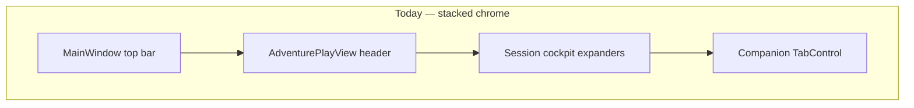
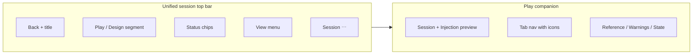

# Play surface UX modernization (CMD-416)

Architecture decision record for the **Phase 3** shell and play-companion UX overhaul: IA consolidation, modern component kit, user-customizable layout preferences, and deduplicated chrome.

## Context

Wave 1–2 shell and play-companion work ([CMD-95](https://linear.app/cmd0112/issue/CMD-95), [CMD-119](https://linear.app/cmd0112/issue/CMD-119)) shipped semantic tokens, shell primitives (`ShellCardStyle`, `ShellSectionHeaderStyle`), grouped cockpit expanders, and responsive play layout tiers. Authors still report the UI feels **dated and crowded**:

- **Stacked chrome** — shell top bar, `AdventurePlayView` header, and session cockpit compete for the same actions.
- **Duplicated affordances** — Review proposals, Play settings, Threads, and Focus chat appear in multiple places.
- **Inconsistent density** — ad-hoc `FontSize="11"` and `Padding="8,4"` alongside theme tokens.
- **Button-bank AI tools** — `WrapPanel` of equal-weight job buttons does not scale.

This ADR normatively records product decisions from the **2026-06-29 workshop** and defines implementation boundaries for epic [CMD-415](https://linear.app/cmd0112/issue/CMD-415).

**Scope:** WPF shell chrome, play companion (`AdventurePlayView`), play settings → **Play surface** tab, and Appearance & theme density integration ([CMD-182](https://linear.app/cmd0112/issue/CMD-182)). **Out of scope:** transcript typography (Format dialog), phrase-highlight colors, dashboard revamp ([CMD-110](https://linear.app/cmd0112/issue/CMD-110)), WebView DOM beyond compose `--cgw-*` scaling.

**Integrates with:** [settings-ux-taxonomy.md](../settings/settings-ux-taxonomy.md) · [play-design-surface-convergence-adr.md](play-design-surface-convergence-adr.md) · [appearance-theme-settings.md](../settings/appearance-theme-settings.md)

---

## Problem statement

The same intents (Review, Settings, Threads, Sources, Focus) are reachable from shell View menu, play header buttons, play header More menu, cockpit banners, AI tools panel, and Reference tab queue — with no single canonical entry per intent.

---

## Agreed decisions (workshop)

| # | Topic | Decision |
|---|--------|----------|
| **1** | Companion restore | **Last-used** tab, collapse, and expander state per adventure; **user overrides** for enter-play behavior |
| **2** | Narrator controls | **Progressive panel:** minimal default; optional **full panel**; highly **configurable** |
| **3** | AI jobs | **Action list** default; layout + **pinning** customization; single canonical **Review** entry |
| **4** | Density | **Dual tier** Comfortable (default) / Compact — must ship with **new control templates**, not spacing-only |
| **5** | Icons | **Tiered by surface** — not global icon-only or text-only |

---

## Decision 1 — Companion restore (last-used + preferences)

### Normative behavior

On enter **Play** for an adventure:

1. Restore `PlaySidePanelCollapsed` and `PlaySidePanelWidth` (existing).
2. Restore **last selected companion tab** (`Reference` | `Warnings` | `State`) when the panel is open.
3. Optionally restore **cockpit expander** open state (Session, Narrator/Injection, AI tools).
4. When no history exists for this adventure, use **global default tab** (fallback: `Reference`).

### Precedence

| Rule | Wins |
|------|------|
| Global **Always collapsed** | Overrides last-open panel state |
| Global **Always open** | Opens panel; still uses last tab or default tab |
| **Remember last** (default) | Per-adventure last-used state |
| First visit | Global default tab, then adventure accumulates history |

### Persistence (planned keys)

| Key | Storage | Type |
|-----|---------|------|
| `PlayCompanionLastTab` | `AdventureSettings` | `string?` — `Reference` \| `Warnings` \| `State` |
| `PlayCompanionExpanderState` | `AdventureSettings` | `Dictionary<string, bool>?` — expander name → open |
| `PlayCompanionOnEnter` | `UiChromeSettings` or nested global play defaults | `RememberLast` \| `AlwaysCollapsed` \| `AlwaysOpen` |
| `PlayCompanionDefaultTab` | `UiChromeSettings` | `Reference` \| `Warnings` \| `State` |
| `PlayCompanionRememberExpanders` | `UiChromeSettings` | `bool` |

**Settings UI:** Play settings → **Play surface** tab; optional mirror in Preferences → Play defaults.

**Implementation:** [CMD-418](https://linear.app/cmd0112/issue/CMD-418)

---

## Decision 2 — Narrator progressive panel

### Modes

| Mode | Companion shows |
|------|-----------------|
| **Minimal** (default) | Scene profile · scope (This send / Session / Adventure) · override chips · **Narrator…** → Play settings → Injection |
| **Full** (opt-in) | Minimal + full combo grid (length, detail, tone, pacing, combat, violence, consequences) · Reset scope |

**Injection expander** retains live packet preview and quick policy toggles in all modes.

### Dedup

- **`NarratorAdvancedDialog`** folds into Play settings → **Injection** tab ([CMD-264](https://linear.app/cmd0112/issue/CMD-264) audit). No third surface.
- Full and minimal layouts **share templates** with Play settings split pane (`InjectionPreviewCoordinator`).

### Preferences (planned keys)

| Key | Storage | Values |
|-----|---------|--------|
| `NarratorPanelDensity` | `UiChromeSettings` + per-adventure override optional | `Minimal` \| `Full` \| `RememberLast` |
| `NarratorPinnedControls` | `UiChromeSettings` | `string[]` — combo ids shown in minimal mode (stretch) |
| `NarratorDefaultScope` | `AdventureSettings` | Reuse / extend `LastNarratorOverrideScope` |
| `NarratorAutoExpand` | `UiChromeSettings` | `Never` \| `WhenOverridesActive` \| `Always` (Full only) |

**Implementation:** [CMD-419](https://linear.app/cmd0112/issue/CMD-419)

---

## Decision 3 — AI tools action list

### Default layout

Replace `JobActionsPanel` **WrapPanel** with vertical **action list** rows:

- Label, short hint, trailing **Run** control
- Disabled state shows reason (e.g. no play turn yet, project not linked)
- Jobs: Process last exchange, Memories, Digest, Cards, Continuity (AI)

**Recap** is non-AI → footer **More actions** (not AI tools list).

### Review dedup (non-negotiable)

| Intent | Canonical entry | Remove / demote |
|--------|-----------------|-----------------|
| **Review proposals** | `StatusChip` in session chrome (count badge) → Proposal Review Hub | Play header Review button; duplicate cockpit Review buttons; optional AI tools row |
| **Threads** | Session ⋯ menu or single header slot | Duplicate in header + More |
| **Play settings** | View menu + status bar bridge dot (existing) | Play header when shell provides entry |
| **Sources** | Status line click + Session ⋯ | Duplicate header Sources when chip/⋯ present |
| **Focus chat** | Shell Focus control only | View menu duplicate when redundant |

Reference tab **review queue** remains for contextual accept/dismiss when navigated from entities — not a second global Review entry.

### Preferences (planned keys)

| Key | Storage | Values |
|-----|---------|--------|
| `AiToolsLayout` | `UiChromeSettings` | `ActionList` \| `ButtonBank` \| `MenuOnly` |
| `AiToolsPinnedJobs` | `UiChromeSettings` | `string[]` — job ids with one-click slots |
| `AiToolsShowReview` | `UiChromeSettings` | `bool` — default `false` when Review chip exists |

**Implementation:** [CMD-420](https://linear.app/cmd0112/issue/CMD-420)

---

## Decision 4 — Dual density + component redesign

Density is a **product tier**, not a margin multiplier on legacy layouts.

| Tier | Default | Body | Control min height | Companion default width |
|------|---------|------|--------------------|-------------------------|
| **Comfortable** | Yes (fresh installs) | 14px | 36px | 320px |
| **Compact** | Opt-in | 12–13px | 28–32px | 280px |

### Requirements

- `ThemeSettings` gains `DensityPreset` (`Comfortable` | `Compact` | `Default`).
- Bundled overrides apply to `space*`, `fontSize*`, and structural metrics.
- **Control templates** (`SegmentedControl`, `ActionListRow`, dialog tiers, command bar) respond to density — acceptance fails if only margins change.
- WebView compose `--cgw-compose-*` scales with active tier ([CMD-181](https://linear.app/cmd0112/issue/CMD-181) coordination).

**Implementation:** [CMD-182](https://linear.app/cmd0112/issue/CMD-182) + [CMD-417](https://linear.app/cmd0112/issue/CMD-417)

---

## Decision 5 — Icons tiered by surface

| Surface | Pattern |
|---------|---------|
| **Shell top bar** | Segmented **text** (Browse/Adventures, Play/Design); **icon-only** for View, ⋯, Focus |
| **Play session chrome** | Icon+label primaries (Settings, Sources); Review as **badge chip** (not icon-only) |
| **Companion nav** | Icon+label on Reference / Warnings / State tabs |
| **Action lists** | Optional small leading icon; text-primary |
| **Dialogs** | Text Primary/Cancel; icons only for destructive or well-known actions |

At **Compact** density, play header may hide labels (icon + tooltip) per [CMD-182](https://linear.app/cmd0112/issue/CMD-182).

**Icon set:** Segoe Fluent Icons or consistent SVG paths in a shared resource dictionary — one family, 16/20px.

**Implementation:** [CMD-422](https://linear.app/cmd0112/issue/CMD-422)

---

## Component kit (new primitives)

| Component | Purpose | Replaces |
|-----------|---------|----------|
| `SegmentedControl` | Mode toggles with single selection | Copy-pasted `ModeButtonStyle` in `ShellCardStyle` borders |
| `ActionListRow` | Scannable list actions with Run | `WrapPanel` job buttons, ad-hoc stacks |
| `StatusChip` | Clickable badge (review count, link attention, job running) | Duplicate text buttons |
| Flat chrome | 1px separator, no toolbar drop shadow | `ChatChromePanel` `DropShadowEffect` |

Document in [ui-components.md](../reference/ui-components.md) when shipped.

**Implementation:** [CMD-417](https://linear.app/cmd0112/issue/CMD-417)

---

## Chrome IA — target model

**Single row** when in Play/Design session ([CMD-421](https://linear.app/cmd0112/issue/CMD-421)):

- **Left:** Back (contextual) + adventure title + Play | Design segment
- **Center:** Status chips (review, link, job) — clickable
- **Right:** View (transcript mode) + session ⋯ + global Preferences overflow

`AdventurePlayView` header **defers** to shell when session context is active (same pattern as shell back vs ← Dashboard today).

---

## Canonical action map

| User intent | Canonical control | Persistence / handler |
|-------------|-------------------|------------------------|
| Review proposals | `StatusChip` (count) | `PendingReviewService` |
| Open threads hub | Session ⋯ → Threads | `AdventureThreadManagerDialog` |
| Play settings | View → Play settings…; bridge dot | `PlayPromptInjectionDialog` |
| Source manager | Sources status chip / ⋯ | `OpenSourceManagerDialogAsync` |
| Focus chat | Shell Focus (one entry) | `TogglePlayFocusMode` |
| Run AI job | AI tools action list | `GenerationJobService` |
| Edit narrator (full) | Play settings → Injection | `InjectionPreviewCoordinator` |
| Search / Export | Play footer (unchanged) | Existing footer handlers |

---

## Implementation order

| Step | Issue | Depends on |
|------|-------|------------|
| 0 | [CMD-416](https://linear.app/cmd0112/issue/CMD-416) ADR (this doc) | — |
| 1 | [CMD-417](https://linear.app/cmd0112/issue/CMD-417) Component kit | ADR |
| 2 | [CMD-182](https://linear.app/cmd0112/issue/CMD-182) ∥ [CMD-422](https://linear.app/cmd0112/issue/CMD-422) Density / icons | CMD-417 |
| 3 | [CMD-421](https://linear.app/cmd0112/issue/CMD-421) Chrome dedup | CMD-417 |
| 4 | [CMD-418](https://linear.app/cmd0112/issue/CMD-418) ∥ [CMD-419](https://linear.app/cmd0112/issue/CMD-419) ∥ [CMD-420](https://linear.app/cmd0112/issue/CMD-420) Companion / narrator / AI | CMD-417, CMD-421 |

---

## Acceptance criteria (epic CMD-415)

- [x] No user intent has more than one **primary** chrome entry (secondary ⋯ menu allowed)
- [x] Companion restores last-used state; preferences documented above are implemented
- [x] Narrator minimal + full modes; Advanced dialog removed
- [x] AI tools action list default; button bank optional via settings (`AiToolsLayout`; ButtonBank falls back to action list)
- [x] Comfortable/Compact changes control templates measurably
- [x] Icon rules applied per surface table
- [x] `docs/reference/ui-components.md` and [adventure-panel.md](../user/adventure-panel.md) updated

---

## Related

| Topic | Link |
|-------|------|
| Epic | [CMD-415](https://linear.app/cmd0112/issue/CMD-415) |
| Settings program | [CMD-254](https://linear.app/cmd0112/issue/CMD-254) |
| Theme density | [CMD-182](https://linear.app/cmd0112/issue/CMD-182) |
| Prior play companion | [CMD-119](https://linear.app/cmd0112/issue/CMD-119) |
| Narrator settings guide | [narrator-settings.md](../user/narrator-settings.md) |
| Play/Design toggle | [play-design-surface-convergence-adr.md](play-design-surface-convergence-adr.md) |
