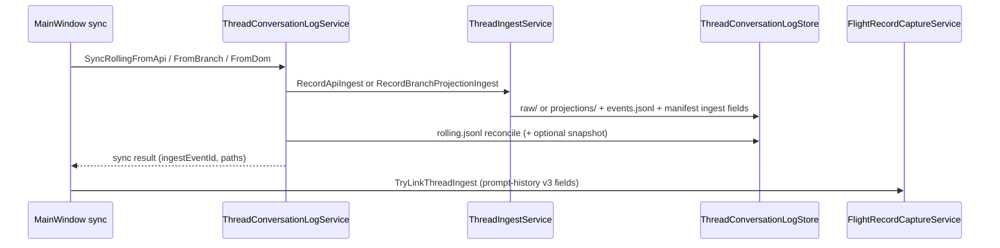

# Thread log ingest refactor

**Status:** Accepted (2026-07-03)  
**Supersedes:** Rolling-only thread log as canonical read path  
**Related:** [thread-conversation-log-adr.md](thread-conversation-log-adr.md), [thread-explicit-snapshot-logging.md](../Enhancements/thread-explicit-snapshot-logging.md), [narrative-flight-recorder-adr.md](narrative-flight-recorder-adr.md), [utility-job-context-assembly-adr.md](utility-job-context-assembly-adr.md)

---

## Context

Thread conversation logging grew in layers:

| Layer | Role today |
|-------|------------|
| `rolling.jsonl` | Append-only branch reconciliation + supersession audit |
| `snapshots/` | Immutable branch projections at send / invalidation / load |
| `prompt-history.json` | Outbound packet flight recorder (orthogonal axis) |
| `log.json` | Legacy play cache (retired on write) |

Consumers (export, utility story context, overlay maps) read **reconstructed** state from rolling and/or latest snapshot. That duplicates logic, lacks a single raw capture, and cannot link flight records to thread ingest facts.

---

## Decision

Introduce a **thread ingest layer** under each `thread-logs/{threadEntryId}/` directory:

```
thread-logs/{threadEntryId}/
  manifest.json           # rolling + snapshot + ingest index
  events.jsonl            # append-only ingest fact index
  raw/                    # full API JSON (canonical when available)
  projections/            # branch JSON when API raw unavailable (DOM / migration)
  snapshots/              # immutable branch projections (existing)
  rolling.jsonl           # supersession audit (still written; slim read path later)
```

### Three orthogonal axes (unchanged)

| Axis | Store | Links via |
|------|-------|-----------|
| **A — Thread content** | `thread-logs/` ingest + projections | `threadEntryId`, `ingestEventId`, `turnId` |
| **B — Outbound packets** | `prompt-history.json` | `flightRecordId`, `turnId`, `threadIngestEventId` |
| **C — Operations** | `play-send-runs/`, `wrapper-diagnostics.jsonl`, utility parse logs | trace / run ids |

---

## Ingest pipeline

Every rolling sync now records an ingest event **before** rolling reconciliation:



**Triggers** map from capture source + snapshot policy (`send`, `invalidation`, `session_load`, `worker_send`, `migration`, `manual`, `sync`).

**Retention:** `session_load` ingest keeps last 3; `migration` ingest prunes older than 7 days (raw/projection files only).

---

## Read path: `ThreadProjectionService`

Single resolver for thread content consumers:

1. Latest **ingest** event → parse `raw/` (API JSON) or `projections/` / synthetic `raw/`
2. Else **rolling** active branch
3. Else latest **snapshot**

`ThreadConversationLogReader.GetTranscriptPairs` and `PlayThreadTranscriptService.CaptureFromLocal` use this path. Utility worker SOT uses `ThreadTranscriptResolver` → projection pairs for story context assembly.

---

## Flight recorder correlation (schema v3)

`PromptHistoryEntry` gains:

| Field | Meaning |
|-------|---------|
| `threadEntryId` | Registry thread |
| `threadIngestEventId` | Ingest fact at send/sync |
| `threadRawPath` | Relative `raw/...` when API capture |
| `threadProjectionPath` | Relative `projections/...` when branch-only |
| `threadSnapshotPath` | Relative `snapshots/...` when snapshot captured |

Linked after each successful thread sync when correlation includes `turnId` / `flightRecordId` (`MainWindow.ThreadConversationLog` → `FlightRecordCaptureService.TryLinkThreadIngest`).

`UtilityContextManifestRecord` records `threadProjectionSource`, `threadIngestEventId`, and paths for worker lane audits.

---

## Utility worker SOT (phase 5 — earmarked)

Worker story context **transcript** resolves from play thread **projection** (`ThreadTranscriptResolver`), not live DOM or rolling JSONL alone. Manifest on each assembled job records which ingest/projection backed the transcript.

Future: materialize job-bound context projection under `utility-results/{runId}` with manifest linkage (see [utility-job-context-assembly.md](../Enhancements/utility-job-context-assembly.md)).

---

## Legacy reconstruction

`ThreadLogReconstructionService` backfills in-flight adventures missing ingest:

1. Synthetic **`raw/`** from rolling active branch (`source: rolling-reconstruction`)
2. Synthetic ingest events from existing **`snapshots/`** (`source: snapshot-reconstruction:…`)
3. **`prompt-history.json`** thread correlation via `LinkFlightRecords`

Run manually:

```powershell
.\scripts\reconstruct-thread-logs.ps1 -AdventureDir "E:\Documents\ChatGPT Wrapper\Adventures\{adventureId}"
```

Report: `%LocalAppData%\ChatGPTWrapper\thread-log-reconstruction-report.txt`

---

## Consequences

| Benefit | Trade-off |
|---------|-----------|
| One raw capture per sync | Extra disk (raw JSON); retention policies required |
| Flight ↔ thread traceability | `prompt-history` schema v3 migration on load |
| Utility worker reads stable projection | Synthetic raw is not API-identical until next live sync |
| Rolling remains for supersession audit | Dual write until rolling slim-down phase |

---

## Implementation map

| Component | Path |
|-----------|------|
| `ThreadIngestEvent` | `Adventure/Models/ThreadIngestEvent.cs` |
| Store (events, raw, projections) | `Adventure/Stores/ThreadConversationLogStore.Ingest.cs` |
| Ingest service | `Adventure/Services/ThreadIngestService.cs` |
| Projection resolver | `Adventure/Services/ThreadProjectionService.cs` |
| Utility transcript SOT | `Adventure/Services/ThreadTranscriptResolver.cs` |
| Reconstruction | `Adventure/Services/ThreadLogReconstructionService.cs` |
| Flight link | `Adventure/Services/FlightRecordCaptureService.TryLinkThreadIngest` |
| Developer guide | [thread-conversation-log.md](../developer/thread-conversation-log.md) |

---

## Open phases

| Phase | Status |
|-------|--------|
| 0 Taxonomy doc | Done (this ADR) |
| 1 Unified ingest on sync | **Done** |
| 2 `ThreadProjectionService` consumers | **Done** (export, transcript, utility resolver) |
| 3 Slim rolling / events for supersession only | Future |
| 4 Retire `log.json` writes | Existing policy; verify no regressions |
| 5 Utility SOT materialization in `utility-results/` | Earmarked |
