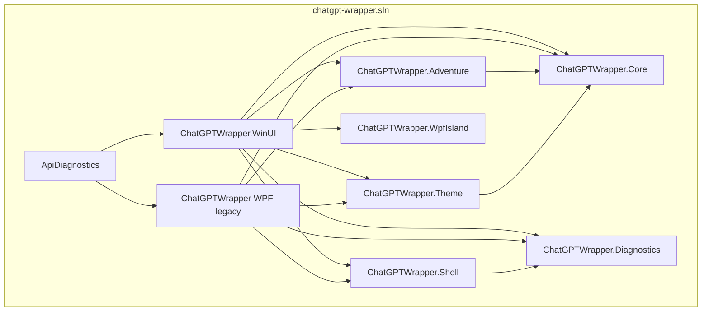

# WinUI 3 shell migration (CMD-478)

Architecture decision record for migrating **ChatGPT Wrapper** from WPF to **WinUI 3 / Windows App SDK** as the long-term desktop shell, using a strangler pattern with temporary XAML Islands for legacy WPF surfaces.

**Epic:** [CMD-478](https://linear.app/cmd0112/issue/CMD-478) · **Phase 0 issues:** CMD-479–484

---

## Context

The product ships as a single WPF host (`ChatGPTWrapper`) embedding ChatGPT via WebView2, with adventure/play surfaces built in WPF XAML. Workshop feedback ([CMD-415](https://linear.app/cmd0112/issue/CMD-415)) and platform direction favor a modern Windows-native shell (Mica, NavigationView, fluent controls) without rewriting domain logic in `ChatGPTWrapper.Core`.

**Constraints:**

- `ChatGPTWrapper.Core` remains the shared brain — no UI framework coupling.
- WPF must remain buildable until Phase 6 deletion ([CMD-517](https://linear.app/cmd0112/issue/CMD-517)).
- Diagnostics (`wrapper-diagnostics.jsonl`) must work identically from either host during migration.
- Theme tokens (`ui-chrome.json`, `ThemeTokenCatalog`) stay schema-stable; WinUI mapping lands in Phase 2 ([CMD-491+](https://linear.app/cmd0112/issue/CMD-491)).

---

## Decision

Adopt **WinUI 3 / Windows App SDK** as the sole long-term shell. Migrate incrementally:

1. **Phase 0** — WinUI scaffold (Mica, WebView2, shared diagnostics), `run.ps1` defaults to WinUI.
2. **Phases 1–5** — Port shell chrome, theme engine, dialogs, adventure surfaces; retire WPF UI via islands then native WinUI.
3. **Phase 6** — Remove WPF project ([CMD-517](https://linear.app/cmd0112/issue/CMD-517)).

**Strangler:** Temporary **XAML Islands** host legacy WPF controls inside the WinUI shell until each surface has a native WinUI replacement. **No new WPF UI** after Phase 1 sign-off.

---

## Phase gates (CMD-478)

| Phase | Entry | Exit (gate) |
|-------|-------|-------------|
| **0** | Epic approved | WinUI exe builds; `--extended-diagnostics` → clean `session_start` + `app_startup`; chatgpt.com loads (HTTP 200); Mica on Win11; WPF fallback via `-Wpf`; islands spike documented |
| **1** | Phase 0 pass | NavigationView shell, session bar skeleton ([CMD-485+](https://linear.app/cmd0112/issue/CMD-485)) |
| **2** | Phase 1 pass | Theme engine WinUI port; `ThemeTokenCatalog` mapped ([CMD-491+](https://linear.app/cmd0112/issue/CMD-491)) |
| **3** | Phase 2 pass | Native WinUI dashboard (CMD-214–218 acceptance); island inventory shrinking |
| **4** | Phase 3 pass | Adventure/play surfaces in WinUI |
| **5** | Phase 4 pass | Feature parity; islands empty |
| **6** | Phase 5 pass | WPF project deleted; MSIX packaging if ready ([CMD-520](https://linear.app/cmd0112/issue/CMD-520)) |

---

## Project layout

| Project | Role |
|---------|------|
| `ChatGPTWrapper.WinUI` | Primary shell (Phase 0+); unpackaged dev (`WindowsPackageType=None`) |
| `ChatGPTWrapper.Diagnostics` | Shared JSONL diagnostics — no WPF/WinUI deps |
| `ChatGPTWrapper` (WPF) | Dialog + domain library until native WinUI dialogs land ([CMD-515](https://linear.app/cmd0112/issue/CMD-515)) |
| `ChatGPTWrapper.WpfIsland` | **Removed** (Phase 6, CMD-518) |

**Dual-host executables (Phase 0–5):**

| Host | Output name |
|------|-------------|
| WinUI (default) | `ChatGPT Wrapper WinUI.exe` |
| WPF (fallback) | `ChatGPT Wrapper.exe` |

---

## Theme policy

- Keep existing `ui-chrome.json` schema and `ThemeApplicationService` resolution in Core/WPF until Phase 2.
- WinUI Phase 0 uses system Mica + solid `BgBase`-equivalent fallback.
- Phase 2 maps `ThemeTokenCatalog` to WinUI `ResourceDictionary` entries; islands receive pushed hex tokens via C# bridge (minimal in Phase 0).

---

## Island policy

Islands are **temporary only**. Each hosted WPF view must have a tracked native WinUI target phase.

### Island inventory

| View | Phase introduced | Native WinUI target | Status |
|------|------------------|---------------------|--------|
| `IslandPlaceholderControl` | 0 (spike) | — | **Removed** (CMD-518) |
| WPF modal dialogs | 3–5 interim | Phase 5 native ([CMD-511–516](https://linear.app/cmd0112/issue/CMD-511)) | Active via `WpfDialogHostService` (not XAML islands) |
| `AdventurePlayPage` + cockpit/companion/footer | 4 ([CMD-502–506](https://linear.app/cmd0112/issue/CMD-502)) | Native WinUI | **Shipped** |
| `AdventureDesignPage` | 5 ([CMD-508](https://linear.app/cmd0112/issue/CMD-508)) | Native shell; wizard WPF bridge | Partial |
| `PreferencesHubPage` | 5 ([CMD-510](https://linear.app/cmd0112/issue/CMD-510)) | Native cards; detail dialogs WPF | Partial |
| `PlayPromptInjectionDialog` | 4 ([CMD-507](https://linear.app/cmd0112/issue/CMD-507)) | WinUI `PlaySettingsDialog` routes WPF body | Interim |
| Entity/thread/project/format dialogs | 5 | `WinUiDialogRoutes` + WPF bodies | Interim batch |

**Rules:**

- No new WPF views after Phase 1.
- Remove island row when native WinUI ships and island host code is deleted.
- Islands run WPF+WinUI dual stack in one process — keep scope minimal; no adventure logic through islands in Phase 0.

---

## Packaging

| Mode | When |
|------|------|
| **Unpackaged dev** | Phase 0–5 (`WindowsPackageType=None`, `WindowsAppSDKSelfContained=true`) |
| **MSIX** | Deferred to [CMD-520](https://linear.app/cmd0112/issue/CMD-520) |

**Prerequisites (dev):** Windows 10 19041+, WebView2 runtime, Windows App SDK (self-contained in build output).

---

## Feature freeze

During migration (Phases 0–5), **new UI ships in WinUI only**. WPF receives bugfixes and domain wiring required for islands; no new WPF chrome or dialogs.

---

## Diagnostics

Both hosts call shared `ChatGPTWrapper.Diagnostics`:

- `DiagnosticsOptions.Initialize(args)` — CLI flags unchanged (`--extended-diagnostics`, `--log-ui-events`).
- Log root: `%LocalAppData%\ChatGPTWrapper\wrapper-diagnostics.jsonl`.
- WPF registers legacy log paths (link-project, sync trace) via `DiagnosticsHostContext`; WinUI omits WPF-only paths.
- UI events use `source: "wpf"` or `source: "winui"`.

---

## Appendix A — Phase 0 spike notes (CMD-480)

| Topic | Finding |
|-------|---------|
| WebView2 user-data | Reuse `%LocalAppData%\ChatGPTWrapper\WebView2UserData` (same as WPF) |
| WinUI WebView2 control | `Microsoft.UI.Xaml.Controls.WebView2` + `EnsureCoreWebView2Async` before navigate |
| Unpackaged bootstrap | `WindowsAppSDKSelfContained=true`; no MSIX manifest required for dev |
| Mica | `SystemBackdrop = new MicaBackdrop()` when supported; solid `#1E1E1E` fallback |
| Island hosting | WPF `IslandPlaceholderControl` embedded via `HwndSource` child window in WinUI content region (Phase 0 proof-of-host; full `DesktopChildSiteBridge` evaluated in Phase 1) |

---

## Appendix B — Dialog bridge inventory (CMD-535)

WinUI routes modal work through `WpfDialogHostService` (STA WPF thread). Native WinUI: `PreferencesHubPage`, shell chrome.

| Dialog / surface | WPF body | WinUI entry |
|------------------|----------|-------------|
| Play settings | `PlayPromptInjectionDialog` | `ShowPlaySettingsAsync` + `WinUiPlaySettingsDialogHost` |
| Thread manager | `AdventureThreadManagerDialog` | `ShowThreadManagerAsync` + `WinUiThreadManagerBridge` |
| Proposal review | `ProposalReviewHubDialog` | `ShowProposalReviewAsync` |
| Design wizard | `AdventureDesignWizard` | `ShowDesignWizardAsync` |
| Format / theme | `ContinuousViewFormatDialog`, `ThemeCustomizationDialog` | `ShowFormatDialogAsync`, `ShowThemeCustomizationAsync` |
| Sources / sync | `SourceManagerDialog`, `SourceSyncDialog` | `ShowSourceManagerAsync` |
| Play handoff | `PlayHandoffDialog` | `ShowPlayHandoffAsync` |
| Entity edit / export / import | `EntityEditDialog`, export dialogs | `ShowEntityEditAsync`, export routes (dashboard) |
| Wrapper settings | `WrapperSettingsDialog` | `ShowWrapperSettingsAsync` |

Unreachable from WinUI until routed: `LibrariesDialog`, `CanonInboxDialog`, `InstructionDesignerDialog`, `KeyboardShortcutsDialog`, and other WPF-only chrome — track under [CMD-521](https://linear.app/cmd0112/issue/CMD-521).

---

## Related

- [CMD-478](https://linear.app/cmd0112/issue/CMD-478) — epic
- [Play surface UX modernization ADR](play-surface-ux-modernization-adr.md) — WPF Phase 3 (superseded by WinUI long-term)
- [Build & Deploy](../developer/build-and-deploy.md)
- [Testing](../developer/testing.md)
