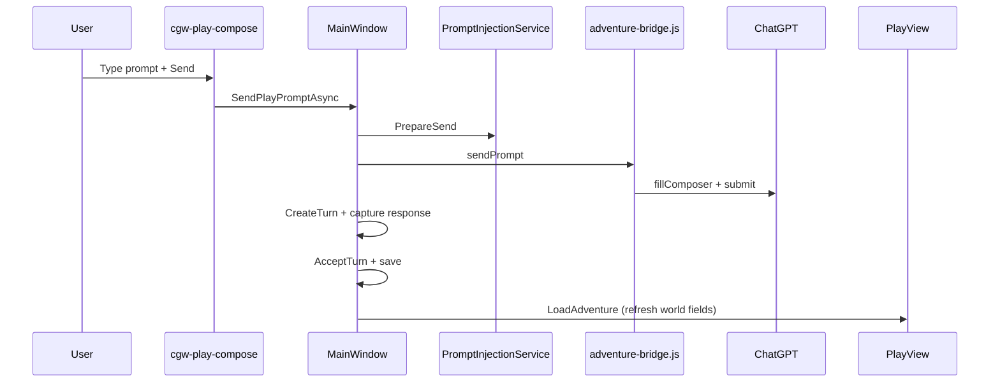

# Adventure Panel — Comprehensive Reference

This document describes the **Adventure panel** in ChatGPT Wrapper: every user-facing surface, data model, persistence layout, ChatGPT integration path, and the services that implement them. It reflects the codebase as of the current `ChatGPTWrapper` project.

**Documentation hub:** [INDEX.md](INDEX.md)

**Related docs:** [Projects & Source Sync (user guide)](user-projects-and-sync.md) · [Instruction Contract Guide](instruction-contract-guide.md) · [Data Model Reference](data-model-reference.md) · [Services Reference](services-reference.md) · [Instruction vs Sources Paradigm](instruction-sources-paradigm.md) · [WebView Bridges](webview-bridges.md) · [Troubleshooting](troubleshooting.md)

---

## Table of contents

1. [Overview](#1-overview)
2. [Application shell and navigation](#2-application-shell-and-navigation)
3. [Adventure dashboard](#3-adventure-dashboard)
4. [Play view](#4-play-view)
5. [Dialogs and modals](#5-dialogs-and-modals)
6. [Data model](#6-data-model)
7. [Persistence and file layout](#7-persistence-and-file-layout)
8. [Turn lifecycle and automation](#8-turn-lifecycle-and-automation)
9. [Prompt packets (fat vs thin)](#9-prompt-packets-fat-vs-thin)
10. [ChatGPT Project linking](#10-chatgpt-project-linking)
11. [Source export and sync](#11-source-export-and-sync)
12. [Supporting features](#12-supporting-features)
13. [Services and code map](#13-services-and-code-map)
14. [End-to-end workflows](#14-end-to-end-workflows) — includes [**canonical begin-play**](#g-canonical-begin-play-workflow-design--first-turn)
15. [Diagnostics and logging](#15-diagnostics-and-logging)
16. [Known limitations and edge cases](#16-known-limitations-and-edge-cases)

---

## 1. Overview

### Purpose

The Adventure panel is a **local-first interactive fiction engine** inside ChatGPT Wrapper. It lets you:

- Create and manage multiple adventures stored only on disk.
- Build structured **prompt packets** from scenario, state, memory, entities, and transcript.
- Send those packets to ChatGPT via **WebView2 automation** (or manual clipboard fallback).
- Optionally link an adventure to a **ChatGPT Project** and sync markdown **source files** so the model can retrieve lore from the Project instead of repeating it in every packet.

**Privacy principle (shown in the dashboard):** all adventure documents stay under `%LocalAppData%\ChatGPTWrapper`. Only the text you explicitly send as a prompt packet goes to ChatGPT during play.

### Primary code locations

| Area | Path |
|------|------|
| UI — dashboard | `ChatGPTWrapper/Views/AdventureDashboardView.xaml(.cs)` |
| UI — play | `ChatGPTWrapper/Views/AdventurePlayView.xaml(.cs)` |
| Shell wiring | `ChatGPTWrapper/MainWindow.Adventures.cs`, `MainWindow.ProjectHost.cs` |
| Models | `ChatGPTWrapper/Adventure/Models/` |
| Services | `ChatGPTWrapper/Adventure/Services/` |
| Storage | `ChatGPTWrapper/Adventure/Stores/` |
| ChatGPT bridge (JS) | `ChatGPT_files/adventure-bridge.js` |
| Project API | `ChatGPTWrapper/ChatGptApi/` |

---

## 2. Application shell and navigation

### Mode buttons (MainWindow toolbar)

| Button | `AppMode` | Left column | Chat tabs | Chat chrome |
|--------|-----------|-------------|-----------|-------------|
| **Browse** | `Browse` | Hidden (width 0) | Visible, full width | Visible |
| **Adventures** | `Adventures` | Dashboard (`AdventureDashboardView`) | Hidden | Visible |
| **Play** | `Play` | Tabbed play companion (~300px, collapsible per adventure) + notes panel (~240px, right, collapsible) | Visible, primary width | Visible |

Implementation: `SetAppMode()` in `MainWindow.Adventures.cs`.

### Play mode layout

```
┌────────────────────┬──────────────────────────────┬─────────────────┐
│  AdventurePlayView │  Normal ChatGPT browser tabs │  Notes panel    │
│  (Reference,       │  (pinned tab receives Send   │  (player notes, │
│   Warnings, State)  │   automation; live chat)     │   not in packets)│
└────────────────────┴──────────────────────────────┴─────────────────┘
```

Each side panel has its own collapse rail and resizable splitter (left: 200–640px as `PlaySidePanelWidth`; right: 180–480px as `PlayNotesPanelWidth`). Collapse state persists per adventure as `PlaySidePanelCollapsed` and `PlayNotesPanelCollapsed`.

- Entering play: `StartPlayModeAsync(adventureId)` loads the bundle, wires events, and calls `EnsurePlaySessionAsync` to validate or prompt for a **pinned play tab**.
- **Link to active browser tab** in Play settings → **Session** assigns the current ChatGPT tab for Send automation; **Open pinned tab** switches back to it.
- Leaving play: **← Dashboard** sets mode back to Adventures and refreshes the dashboard list.

### UI chrome

WPF shell, adventure views, and dialogs share a dark token palette in `ChatGPTWrapper/Themes/WrapperTokens.xaml` and `WrapperControls.xaml` (muted slate-blue accent `#5B9FD4`, layered surfaces, semantic success/warning/error brushes). Wrapper-owned in-page UI (play composer, continuous-view overlay chrome, context tags, scrollbars) mirrors the same tokens via `--cgw-*` CSS variables in `ChatGPT_files/wrapper-overrides.css`. No blur, shadow effects, or animations were added to preserve WebView2 and story-log performance.

### Events wired in Play mode

| Play view event | MainWindow handler |
|-----------------|-------------------|
| `BackRequested` | `OnPlayBack` |
| `PinPlayTabRequested` | `OnPinPlayTabRequested` |
| `OpenPinnedPlayTabRequested` | `OnOpenPinnedPlayTabRequested` |
| `ClearPlayTabPinRequested` | `OnClearPlayTabPinRequested` |
| `RollIntoPlayerLineRequested` | `AppendPlayPlayerLineText` |

---

## 3. Adventure dashboard

**File:** `AdventureDashboardView.xaml`

The dashboard is the home screen for all adventures. It lists local adventures and provides creation, import, library, and project-link entry points.

### Toolbar controls

| Control | Name | Behavior |
|---------|------|----------|
| **New adventure** | `NewAdventureButton` | Opens `ScenarioCreationDialog`. On success, creates adventure via `AdventureStore.CreateNew`, saves, refreshes grid, auto-starts Play mode. |
| **Import…** | `ImportButton` | OpenFileDialog (`*.zip`) → `BackupService.RestoreBackup`. |
| **Search** | `SearchBox` | Filters grid by title, genre, or tags (case-insensitive substring). |
| **More…** | Menu: Link Project, Libraries, Save scenario to library. |

### Privacy hint and archive filter

- `LocalOnlyHint` — static text pointing to `AppDirectories.Root`.
- **Show archived** (`ShowArchivedCheck`) — when unchecked (default), archived adventures are hidden from the grid.

### Adventure grid

`AdventureGrid` — read-only DataGrid columns: Title, Genre, Status, Last played.

**Interactions:** single-click select; double-click → **Play**.

### Bottom actions

| Control | Behavior |
|---------|----------|
| **Play** | `PlayRequested` for selected adventure. |
| **More…** | Menu: Toggle archive, Backup, Delete. |

---

## 4. Play view

**File:** `AdventurePlayView.xaml`

The play sidebar is a **tabbed play companion**: session cockpit, reference entities, director notes, and read-only state. Narrative reading happens in the pinned ChatGPT tab (continuous view); turns are stored in the adventure bundle and reachable via Search, Export, and Edit turn.

### Header

| Control | Behavior |
|---------|----------|
| **← Dashboard** | Raises `BackRequested`. |
| Title | `Metadata.Title`. |
| **Sources…** | Opens `SourceManagerDialog` (or Play settings → Sources as fallback). |
| **Play settings…** | Opens `PlayPromptInjectionDialog` (title: **Play settings**). |
| **◀ / ▶ left collapse toggle** | Rail pill between left panel and chat — hides/shows adventure panel. Drag divider to resize (200–640px, `PlaySidePanelWidth`). |
| **◀ / ▶ right collapse toggle** | Rail pill between chat and notes panel — hides/shows notes. Drag divider to resize (180–480px, `PlayNotesPanelWidth`). |

### Session cockpit

Pin / Use active / Clear pin, plus play tab, thread, and sources status lines (`SetPlayTabPinStatus`, `SetSessionLinkDetails`). The sources status line is clickable and opens Source Manager. Hidden when the left panel is collapsed — same controls remain in Play settings → **Session** tab.

### TabControl

| Tab | Purpose |
|-----|---------|
| **Reference** | Filter Characters / Locations / Quests; DataGrid CRUD; review queue for `EntityReviewItem`; disabled **Suggest from last turn (AI)** (phase 2). |
| **Warnings** | Continuity warnings grid; **Run continuity check (AI)**. |
| **State** | Read-only table from `StateTableHelper.BuildRows`; link opens Play settings → **World**. |

### Notes panel (right side)

**File:** `AdventureNotesPanel.xaml`

Multiline `bundle.Notes` (`notes.txt`) — saved on blur; **never injected into packets**. Collapsible via the right rail between chat and notes panel.

### Footer **More…** menu

Undo, Export, Search, Branch, Save state, Edit turn, Roll — no separate Prompt injection or Settings entries (use **Play settings…**).

### In-page composer (primary play controls)

**File:** `cgw-play-compose.js` on the pinned ChatGPT tab.

| Control | Behavior |
|---------|----------|
| **Send** | `SendPlayPromptAsync` — sends packet, captures narrator response, auto-logs turn via `TurnTimelineService.AcceptTurn`. |

**Player input for Send** (first match wins):

1. Wrapper composer text box
2. Fallback player line from **Play settings → Next send** (when composer is empty)
3. Continuation queue (first line, consumed on Send; edited in Play settings)

After Send, status shows *"Sent — turn logged."* (or a capture warning if narrator text was unavailable).

Linked Project play context is prepared when entering Play mode. Subsequent Sends reuse `PlayContextSessionCache` when the pinned tab is already on the play thread.

### Manual play-mode smoke checklist

1. Enter Play → collapse/expand left and right panels independently; layout persists per adventure.
2. Edit notes in the right panel → verify `notes.txt` updated; confirm notes absent from merged packet preview.
3. **Reference** → add/edit/delete entity; accept/dismiss review queue item if present.
4. **Play settings → World** → edit summary/location/objectives → Send still builds correct packet.
5. Pin play tab from session cockpit or Play settings → **Session** tab status updates.

### Play surface reliability (CMD-28)

| Check | Expected |
|-------|----------|
| **Adventures** mode switch | Dashboard shows loading overlay briefly, then adventure list (never blank host) |
| **Continuous view off** send | Player line visible in thread; no indefinite hidden state after navigation |
| **Continuous view on** long thread | Player/narrator segments alternate even when ChatGPT DOM groups roles |
| **Generation job** completes | Composer restored and interactive (native or wrapper per settings) |
| **Play settings** accept/dismiss memory | Pending-review banner and **Memories** button update without closing settings |
| **Review / Entities** with collapsed panel | Side panel expands; Reference tab selected; hidden Reference tab shows guidance message |
| **Wrapper composer** | Last messages not covered; scroll host reserves bottom inset |
| **Attachment send** | Merged packet includes `=== ATTACHMENTS (staged with this turn) ===` when files staged |

**Canonical play record:** Accepted turns live in `log.json` (`TurnStatus.Accepted`). The ChatGPT thread is display and model context; `thread-metadata.json` maps DOM ordinals. Turns are logged automatically on Send — manual **Accept Turn** (`ResponseReviewDialog`) is legacy/debug only and not used on the default automated path.

### Future: panel customization

Not implemented yet. Likely Phase 2 options:

| Approach | Description | Tradeoff |
|----------|-------------|----------|
| **Tab placement** | Per-adventure setting: each tab (Reference, Warnings, State, Notes) → Left / Right / Hidden | Flexible; moderate UI work in Play settings |
| **Widget picker** | Right panel shows user-selected widgets (Notes, State snapshot, Recap preview) | Good for power users; needs widget catalog |
| **Layout presets** | Named presets (Writer, GM, Minimal) that set positions + collapse defaults | Low user effort; less granular |
| **Drag-to-dock** | WPF drag tabs between panels | Most flexible; highest implementation cost |

**Tab placement** is the recommended next step because it maps directly to the current tab model.

---

## 5. Dialogs and modals

### PlayPromptInjectionDialog (Play settings)

Tabbed editor for play configuration and injected prompt content:

- **Next send** — continuation queue, fallback player line, live merged preview, copy/view/start packet actions
- **World** — rolling summary, location, objectives, author's note (saved on OK)
- **AI Actions** — per-job utility instruction editor (built-in defaults, customize, reset); per-job response length/detail overrides; story context feed
- **Session** — dual-pin setup: **play tab** (Send automation) and **utility tab** (AI jobs); thread and sources status; **Start new play thread…** (releases stale conversation/pin, copies start packet); per-job utility thread status; open / rotate utility thread; utility parse archive; link to Sources tab
- **Play surface** — attachment context mode (`Auto` / `Full` / `Minimal`), attachment-only placeholder, inject guidance toggle; play quick-action visibility (`Visible` / `Hidden` / `InjectedOnly`); side-panel tab placement (`Left` / `Hidden`)
- **Settings** — max packet size, automation, force fat packets, perspective, global content boundaries, character portrayal rules, instruction addendum; **Auto-extract entities** (requires linked Project). See [instruction-contract-guide.md](instruction-contract-guide.md).
- **Memory & cards** — pinned memory and keyword-triggered story cards included in packets
- **Sources** — project source readiness, manifest sync state, refresh/sync actions
- **History** — recently sent merged packets (view/copy)

OK persists queue, world fields, adventure settings, memory, cards, and fallback line to the adventure bundle.

### Generation jobs (Phase 2)

> **Delegation paradigm:** Utility jobs use a separate channel from the play narrator. Instructions are built-in defaults with optional per-adventure overrides (Play settings → **AI Actions**), always inlined in utility-thread seed and job packets — not Project source files. See [instruction-sources-paradigm.md](instruction-sources-paradigm.md).

Project-linked adventures run **background utility conversations** inside the same ChatGPT Project (not the play thread).

### Background utility chat (default)

Utility jobs run in a **hidden auto-managed WebView** — no second browser tab required. Link a ChatGPT Project, pin the **play tab** on your story `/c/…` thread, then run Memories, Summary, Cards, etc. The app creates or **reuses** per-job utility conversations (by session metadata and title reconcile — not discarded just because a thread is missing from the project sidebar list).

**Send orchestration (current):** Before each send, a **readiness probe** classifies the utility page:

| Level | Send path |
|-------|-----------|
| **Registered** (API sees the conversation) | Internal API `SendUserMessageAsync` |
| **DomOnly** (404/429 on API — typical for client-bootstrapped threads) | Atomic DOM `sendPrompt` → `turnComplete` (same pattern as play turns) |
| **Unready** | Fail fast — no phantom submit |

There is no separate multi-minute capture loop. DomOnly jobs use one atomic bridge turn with a timeout scaled to packet size (default 120s, up to 180s).

Full pipeline reference: **[utility-job-orchestration.md](utility-job-orchestration.md)**

Responses accept JSON arrays in markdown fences or object envelopes (`{ "memories": [...] }`). Null-safe parsing handles `null` entries in API JSON arrays.

### Optional utility tab override

To inspect or debug utility threads in a visible tab:

1. Open a **second** ChatGPT tab (not the pinned play tab). In that tab, open the linked Project and click **New chat**.
2. In **Play settings → Session**, pin it as the **utility tab** (must be a `/c/…` page, not the play thread).
3. Jobs use the pinned tab instead of the hidden WebView until you clear the pin.

**Rotate selected thread** re-seeds job instructions on the active utility conversation (resets per-job `JobCount`).

Each job type tracks its own `UtilitySessions` entry (`JobCount`, seed version, errors). Auto-created threads use naming `[CGW:{kind}] {Title} · {AdventureId} · #{n}`.

| Job ID | Utility prefix | Review target |
|--------|----------------|---------------|
| `extract_entities` | `[CGW:entity]` | Reference → entity review queue |
| `propose_memories` | `[CGW:memory]` | Play settings → Memory review list |
| `update_summary` | `[CGW:summary]` | Play settings → World summary banner |
| `bootstrap_lore` / `expand_story_card` | `[CGW:lore]` | Play settings → Card review list |
| `continuity_check` | `[CGW:check]` | Warnings tab |
| `generate_recap` | `[CGW:recap]` | Recap dialog (display only) |

| Component | Role |
|-----------|------|
| `GenerationJobService` | Ensure/reconcile utility threads, readiness probe, tiered send, parse, enqueue |
| `UtilityConversationReadinessService` | Registered / DomOnly / Unready gate before send |
| `AdventureTurnService.SubmitUtilityJobAsync` | Atomic DOM utility turn (`sendPrompt` → `turnComplete`) |
| `GenerationJobScheduler` | Post-turn auto-queue from adventure settings |
| `UtilitySessions` metadata | Per-job active thread state + archive on rotation (not on missing sidebar alone) |
| Utility thread seed | Full instruction body in thread (`GenerationJobHandlers.BuildSeedPrompt`) |
| Job packet inline guide | Same instruction body appended per run (`=== JOB GUIDE (inline) ===`) |
| **AI Actions** tab (Play settings) | Edit / reset per-job instruction overrides (`UtilityJobGuideOverrides`) + **story context feed** settings |
| `PendingReviewService` | Aggregates review-queue counts; play cockpit banner routes to accept/dismiss UI |

**Review after jobs:** When a job queues proposals, the compose status line names where to review (e.g. Play settings → Memory & cards). The play cockpit also shows a **pending review** banner with shortcuts to Memories, Summary, Entities (Reference tab), or Cards.

**Story context feed (AI Actions → Story context):** Each utility job packet can include live play-thread transcript (primary), with fallback to accepted `log.json` turns. Configure in grouped panels:

- **Source & lookback:** source mode, max/skip/min turn pairs, max transcript chars; advanced anchors (`FromEnd`, `SinceLastAcceptedTurn`, `SinceTurnIndex`, `AcceptedOnly`)
- **Transcript roles:** include player and/or narrator messages; layout (verbatim or compact arrow)
- **Live/local behavior:** pending local turns, exclude incomplete trailing live pair, strip empty pairs, per-pair char cap
- **Ancillary sections:** summary, state, pinned memory, entities, scenario, direction preamble
- **Treatment:** max total chars, trim strategy, omit redundant turn slices in job body when transcript is present

Use **Preview (local)** or **Preview (live)** (requires pinned play tab). After jobs, compose status shows capture source and pair count (e.g. `story context: live API · 8 pair(s)`). Per-action overrides: `UtilityJobGuideOverrides[job].Context`; defaults: `metadata.json` → `settings.utilityStoryContext`.

**Inline utility pattern:** Built-in defaults in code + optional overrides in adventure metadata. Publish mode does not affect utility jobs. Job schemas are **not** in narrator project instructions or `sources/`.

**Session cockpit buttons:** Memories (AI), Summary (AI), Cards (AI), **Publish sources…** (manual) or **Sync via API…** (advanced), Recap (AI). Reference tab: **Suggest from last turn (AI)**.

**Play settings → Settings auto toggles:** extract entities, propose memories, update summary (interval), continuity check, auto-sync project instructions on OK.

**`AutoSyncProjectInstructions`:** Pushes `BuildProjectInstructions` on Play settings OK only when instruction-domain fields changed (`InstructionSourcesPolicy` hash). World/plot/entity edits do not trigger a push. Sources tab shows instruction drift hints.

**Requires linked Project** — without a Project, all generation jobs are disabled; manual CRUD still works.

### ScenarioCreationDialog

**Purpose:** Create a new adventure from structured scenario fields.

| Field | Maps to |
|-------|---------|
| Title | `AdventureMetadata.Title` |
| Genre | `ScenarioDocument.Genre` |
| Setting | `Scenario.Setting` |
| Player role | `Scenario.PlayerRole` |
| Opening situation | `Scenario.OpeningSituation` |
| Plot essentials | `Scenario.PlotEssentials` |
| Author's note | `Scenario.AuthorsNote` |
| Offer Start adventure on first play | `Settings.OfferStartOnPlay` |

**Buttons:** Cancel, **Create** (default).

---

### AdventureSettingsDialog

Legacy entry point — opens **Play settings → Settings** tab (`PlayPromptInjectionDialog`). Prefer **Play settings…** from the play sidebar.

---

### ProjectWorkspaceDialog

**Title:** "Projects & Sources" — primary UI for linking and syncing.

#### Connection tab

| Element | Purpose |
|---------|---------|
| Checklist | Sign-in, device cookie, account id status |
| **Test connection** | Session probe via `ChatGptProjectApiService` |
| **Capture headers hint** | Guidance for API header capture |
| `ProbeLine` | Last probe result text |

#### Projects tab

| Element | Purpose |
|---------|---------|
| **Refresh** | Reload project list from ChatGPT |
| `LinkedProjectBanner` | Warning when already linked; disables create-new tab |
| **From list** | Select project from `ProjectList`; double-click or Link |
| **Create new** | `NewProjectNameBox` — creates gizmo via API (blocked if already linked) |
| **Advanced: URL** | Paste project URL or `g-p-…` id |
| **Export and sync sources** | `SyncSourcesCheck` (default on) |
| **Push narrator instructions** | `UpdateInstructionsCheck` (default off) |
| **Create or pick play thread** | `CreateThreadCheck` (default on) |
| **Link project** | Runs binding flow |

#### Sources tab

Same sync grid as `SourceSyncDialog` (file, state, action dropdown): **Refresh plan**, **Apply safe**, **Apply all**.

**Footer:** Copy diagnostics, **Link project**, Close, **Done (linked)**.

---

### SourceSyncDialog

**Title:** "Sync project sources"

| Column | Meaning |
|--------|---------|
| File | Manifest relative path (e.g. `world.md`) |
| State | `SourceSyncState` |
| Local | Short SHA256 of local file |
| Remote | Short SHA256 of remote (when known) |
| Action | Editable dropdown: Skip, Pull remote, Push local |

| Button | Behavior |
|--------|----------|
| **Open logs folder** | Opens `%LocalAppData%\ChatGPTWrapper` |
| **Keep local** | Sets selected row action to Push local (conflict resolution) |
| **Keep remote** | Sets selected row action to Pull remote |
| **Open sources folder** | Explorer → `sources/` |
| **Preview file** | `ContextViewerDialog` with local file contents |
| **Refresh plan** | Rebuilds sync plan (API file list + hash compare) |
| **Apply safe** | Applies only auto-safe items (Pull/Push without unresolved conflicts) |
| **Apply all** | Applies all rows including user-resolved conflicts |

Status line shows auto-safe count, conflict count, file count. After apply, plan rebuilds using cached remote file list (skips redundant API probes).

---

### Play record contract

Play sends **auto-log** narrator responses to `log.json` via `TurnTimelineService.AcceptTurn` after capture — there is no per-turn narrator review gate.

| Layer | Owner | Contents |
|-------|-------|----------|
| **Canonical** | `log.json` | Accepted turn pairs, sessions, edits, export source |
| **Thread index** | `thread-metadata.json` | Per-message ordinals, utility flags, link to turns |
| **Derived** | `summary.json`, `entities.json`, `memory.json`, review queues | AI job proposals awaiting local accept |
| **Ephemeral** | DOM stamps, `sessionStorage` hide queues | Display optimization; migrate toward metadata |

**Review gates** apply to **AI job proposals** (memories, entities, cards, summary, source edits), not narrator text. Use **Edit turn…** (More actions) or continuous-view surrogate edit to correct logged text.

`ResponseReviewDialog` is retained for manual/debug fallback only; it is not shown on the automated send path.

---

### ContextViewerDialog

Read-only packet preview + **Copy packet** button. Meta line shows diagnostics passed from caller.

---

### EditTurnDialog

Edits **last accepted turn** player and narrator text. Save → `TurnTimelineService.EditTurn` + save.

---

### SearchDialog

Live search via `SearchService` across log, summary, memory, cards, characters. Results show snippet; selection navigates context.

---

### RandomTableDialog

`TableBox` populated from `RandomTablesStore` (defaults: npc_trait, weather, complication). **Roll** sets `LastRoll` displayed and returned to play view input box.

---

### LibrariesDialog

`KindBox`: Scenarios, Worlds, Characters, Presets, Templates. Read-only browse of `LibraryStore` items.

---

### ProjectLinkWizard

Legacy simpler link dialog. **Entry points now use `ProjectWorkspaceDialog`** via `OpenProjectLinkWizardAsync` alias.

---

## 6. Data model

### AdventureBundle (aggregate root)

**File:** `Adventure/Models/AdventureBundle.cs`

| Property | Document | Role |
|----------|----------|------|
| `Metadata` | `AdventureMetadata` | Id, title, status, link ids, settings |
| `Scenario` | `ScenarioDocument` | World, plot, opening, author note |
| `Log` | `LogDocument` | Turns, sessions, chapters |
| `Summary` | `SummaryDocument` | Rolling summary, pending review flag |
| `State` | `StateDocument` | Location, objectives, scene/time |
| `Memory` | `MemoryDocument` | Entries + review queue |
| `Entities` | `EntitiesDocument` | Characters, locations, inventory, quests, factions |
| `Cards` | `CardsDocument` | Story cards with triggers |
| `PromptHistory` | `PromptHistoryDocument` | Full packet text per turn (for regenerate) |
| `Notes` | string | Freeform `notes.txt` |
| `SourceManifest` | `SourceManifest` | Per-file sync state |
| `ContinuationQueue` | `List<string>` | In-memory queue (see limitations) |
| `CurrentSessionId` | `Guid?` | Active play session |

### AdventureMetadata

| Field | Description |
|-------|-------------|
| `Id` | Adventure GUID |
| `Title`, `Genre`, `ScenarioSummary` | Display / search |
| `CreatedAt`, `LastPlayedAt` | Timestamps |
| `Status` | `Active`, `Paused`, `Completed` |
| `Archived` | Boolean flag (not filtered in dashboard) |
| `Tags` | Search filter only |
| `LinkedConversationId` | ChatGPT thread id (`/c/{id}`) |
| `LinkedProjectId` | ChatGPT Project gizmo id (`g-p-…`) |
| `ProjectLink` | Structured link record (`ProjectLink`) |
| `Settings` | `AdventureSettings` |

### TurnRecord

| Field | Description |
|-------|-------------|
| `Id`, `Index`, `At` | Identity and ordering |
| `PlayerText`, `NarratorText` | Turn content |
| `Status` | `Pending`, `AwaitingResponse`, `Review`, `Accepted`, `Rejected` |
| `Attempts` | Alternate responses from regenerate |
| `SessionId`, `ChapterId` | Optional grouping |
| `PromptPacketHash` | Short SHA256 prefix of sent packet |

Legacy log files may still contain a `mode` field; it is ignored on load.

### Source sync enums

**SourceSyncState:** `InSync`, `LocalNewer`, `RemoteNewer`, `Conflict`, `LocalOnly`, `MissingRemote`, `RemoteOnly`

**SourceSyncAction:** `Skip`, `Pull`, `PushReplace`, `NeedsResolution`

**SourceConflictResolution:** `None`, `KeepLocal`, `KeepRemote`, `Skip`

---

## 7. Persistence and file layout

### Root directory

```
%LocalAppData%\ChatGPTWrapper\
├── adventures\
├── backups\
├── libraries\
├── WebView2UserData\
├── styles\
├── link-project.log
├── sync-trace.jsonl
├── sync-runs\
└── … (API diagnostics files)
```

Defined in `AppDirectories.cs`.

### Per-adventure directory

```
adventures\{guid-D}\
├── adventure.json          # AdventureMetadata
├── scenario.json
├── log.json
├── summary.json
├── state.json
├── memory.json
├── entities.json
├── cards.json
├── prompt-history.json
├── notes.txt
├── source-manifest.json
├── sources\                # Exported markdown for Project sync
│   ├── scenario.md
│   ├── world.md
│   ├── plot.md
│   ├── cast.md
│   ├── context-index.json (local only)
│   ├── instructions-snippet.md
│   └── .sync-tmp\          # Temp remote downloads during plan build
└── save-states\
    └── {yyyyMMdd-HHmmss}-{name}\
        └── (copy of top-level JSON files)
```

**JSON serialization:** camelCase, schema version 1 (`AdventureJson.Options`).

**Save side effect:** every `AdventureStore.Save` updates `Metadata.LastPlayedAt`.

### Libraries

```
libraries\
├── scenarios\index.json + {id}.json
├── worlds\…
├── characters\…
├── presets\…
├── templates\…
└── random-tables.json
```

### Backups

- **Backup:** `backups/adventure-{id}-{timestamp}.zip`
- **Import:** extracts zip and `AdventureStore.ImportFromDirectory`

---

## 8. Turn lifecycle and automation

### Flow diagram



### Play composer flow (native default)

Turn injection and acceptance run from `MainWindow.PlayInjection.cs` and `cgw-play-compose.js`:

1. **Send:** user types in ChatGPT's native composer (or legacy wrapper UI) → intercept posts `cgwComposeSend` → resolve player line → `PrepareSend` → wire pinned tab → ensure linked Project context (cached) → `submitPrompt` (DOM `fillComposer` + native submit by default) → capture narrator → `TurnTimelineService.AcceptTurn` + save log.

**Native composer (default):** `AdventureSettings.UseWrapperComposer` is `false` by default. The pinned play tab shows ChatGPT's stock composer; `cgw-play-compose.js` intercepts Send/Enter, extracts the player line (and native attachment presence), and the host injects the merged packet via the bridge. File attachments use ChatGPT's native paperclip upload (no CDP pre-upload).

**DOM-first send (default):** `AdventureSettings.PreferDomPlaySend` is `true` by default. Play turns skip `SendUserMessageAsync` and submit through `adventure-bridge.js`. Uncheck *Prefer DOM composer send* in Play settings to restore API-first sends when a conversation ID is known.

**Legacy wrapper composer:** Enable *Use custom wrapper composer* in Play settings to restore the in-page overlay (`#cgw-play-composer-root`) with custom attach chips and CDP pre-upload on attach.

### SubmitTurnAsync steps (legacy — removed from adventure panel)

Turn injection and acceptance previously used a two-step inject-then-send flow; that path is replaced by native (or wrapper) composer **Send**.

Legacy panel automation (`SubmitTurnAsync` from the adventure sidebar) remains removed.

### Adventure bridge (`adventure-bridge.js`)

Injected by `ChatGptAdventureBridgeInjection`. Commands:

| Action | Purpose |
|--------|---------|
| `sendPrompt` | Set composer text, submit, wait for stable assistant message |
| `fillComposer` | Set composer text without submitting |
| `captureLastAssistant` | Read latest assistant message text |
| `setWrapperComposer` | Toggle native composer hide flag (`data-cgw-wrapper-composer`) |
| `regenerateLast` | Click regenerate on last assistant message |
| `getConversationId` | Parse `/c/{id}` from URL |
| `ping` / `probe` | Health check (composer + submit button found) |

Responses: `turnComplete`, `conversationId`, `pong`, `probeResult`, `bridgeReady`.

**Timeout:** default 120s for send; configurable per command.

### Session tracking

`AdventureSessionService.AttachTurnToSession` assigns each new turn to the current play session recorded in `Log.Sessions`.

---

## 9. Prompt packets (source-delegated vs fat fallback)

> **Delegation paradigm:** Thin packets carry session delta; static lore is retrieved from Project sources and custom instructions. Full matrix: [instruction-sources-paradigm.md](instruction-sources-paradigm.md).

**Builder:** `PromptPacketBuilder.cs` + `PromptInjectionService.cs` + `ProjectSourceInjectionService.cs`

When `UseContextTags` is enabled (default), adventure context is wrapped in `[[cgw:…]]` blocks (`sources`, `instructions`, `state`, `cards`, `memory`, `transcript`, `meta`). **User prose is appended untagged** after the tagged context (not inside `[[cgw:player]]`).

### Mode selection

**Source-delegated packets** (internally `PacketMode.Thin`) when ALL of:

- `ForceFatPackets` is false
- `LinkedProjectId` is set
- `SourceManifest` has lore entries exported
- **Manual publish:** every lore file marked **Published** (local hash matches upload confirmation)
- **API sync:** every manifest entry is `InSync`

Otherwise **fat fallback** — static lore is embedded inline in the packet.

Readiness is evaluated by `ProjectSourceInjectionService.Evaluate()`. When a Project is linked but not ready, **Send** shows a non-blocking warning and offers **Sync now**; the send proceeds with fat packets if you decline.

### Source-delegated packet sections (in order)

When `UseSectionInjection` is enabled (default for new adventures):

1. **`[[cgw:sources v="2"]]`** — baseline pointers, this-turn retrieval hints, and inline excerpts (`ContextPointerResolver`)
   - **ALWAYS RETRIEVE** — baseline sections the model should fetch each turn (`opening`, `rules`, `player` when the section index is populated)
   - When the section index is empty but sources are **ready** (delegation allowed): synced-file fallback lists Project source files to retrieve instead of bare `(none)`
   - When sources are **not ready** (unpublished, out of sync, or no Project): explicit `Sources not ready: {reason}` plus optional suggested action — same semantics as the Play settings readiness banner (`ProjectSourceInjectionService.Evaluate`)
   - When there is no linked Project: `(none)` is expected in ALWAYS RETRIEVE
2. Short narrator pointer (defer static lore and style to Project instructions + sources)
3. Story so far (local cache)
4. State delta
5. Pinned memory
6. Recent transcript (last 6 accepted turns, `[[cgw:transcript]]`)

Legacy path (`UseSectionInjection == false`): file-level pointers plus triggered card names only.

(User prose merged at send time.)

**Delegated max size:** `min(MaxPacketChars, 8000)`.

### Fat packet sections (in order)

1. Narrator system instructions (perspective, tense, detail, tone, difficulty)
2. Content boundaries (if any)
3. Scenario block (setting, role, genre, opening)
4. Plot essentials
5. World rules
6. Author's note
7. Story so far (rolling summary)
8. Current state (location, objectives, …)
9. Triggered lore cards (full content)
10. Pinned memory
11. Entity excerpts (keyword-matched)

(User prose is merged after tagged context at send time — see `AssembleWithUser`.)

### Injection dialog — Sources tab (publish hub)

`PlayPromptInjectionDialog` **Sources** tab is the primary publish surface:

- **Manual publish only** — copy instructions, drag files to ChatGPT Project, mark **Published**
- **Instructions** — Copy instructions, preview, open project settings
- **Source files** — Refresh export, open folder, per-file **Published** checklist, copy/preview; use **Manage sources…** for full Source Manager
- **Edit sources with AI** — `propose_source_edits` utility job + review queue
- **API sync diagnostics** — Source Manager → **API sync diagnostics…** (deprecated primary workflow)

The **Next send** tab meta line shows mode and readiness, e.g. `Source-delegated (manual publish, 6 files)` or `Fat fallback — 2 source files need manual publish`.

### Play link status

When linked and delegated (manual): `Sources: published (N files) | source-delegated packets`

When linked and delegated (API): `Sources: synced (N files) | source-delegated packets`

When linked but not ready: `Sources: N need publish | fat fallback` (manual) or `N out of sync | fat fallback` (API)

### Trimming

If total length exceeds max, packet is truncated with `WasTrimmed = true` (reported in Context dialog).

### Thread display (Play tab)

Toolbar **Format…** → **Thread behavior** tab controls how merged packets appear in the ChatGPT thread (continuous overlay and native fallback when CV is off):

| Setting | Location | Effect |
|---------|----------|--------|
| **Hide packet context in thread** (default on) | Format… → Thread behavior | User messages containing `[[cgw:…]]` show **only your player line**; tagged adventure context is not shown inline |
| **Expandable context summary** (default on) | Same tab | Collapsed adventure context cards in **continuous view** when packet context is hidden (not shown in native bubbles) |
| Hide off | Uncheck **Hide packet context in thread** | Full raw merged packet visible in the thread (debug) |

Structured sections use prose paragraphs (not raw tag blocks). The continuous overlay caches turn extraction and only re-decorates changed segments during streaming. Opening or switching chats uses a transition shell to hide native bubbles immediately, then reveals the formatted overlay in one step.

When Continuous View is off, native packet display **rewrites the player line in-place** inside ChatGPT's `whitespace-pre-wrap` text leaf (`textContent` only — bubble wrapper DOM unchanged). Source leaf HTML is backed up per turn for teardown and fingerprinting. Expandable adventure context panels are **continuous-view only** (CMD-81). A fingerprint cache (`turnDisplayCache` / `turnRegistry`) skips unchanged turns; only new or changed messages are updated incrementally. If a turn cannot produce a player-line display, the pipeline **does not** leave the native bubble hidden — it calls `releasePendingFallback` instead (CMD-70).

Implementation: [`cgw-packet-display.js`](ChatGPT_files/cgw-packet-display.js) batch-applies on `__cgwPacketDisplayNavigate` and delta-updates via `processDeltaTurns`; continuous view applies special blocks when enabled; send-time `data-cgw-user-line` stamps avoid re-parsing fresh sends. Packet display preferences sync to all chat tabs (Browse and Play).

### Bootstrap / Start adventure

`AdventureBootstrapService.BuildStartPacket` — opening packet for fresh adventures using scenario opening situation and narrator bootstrap instructions.

---

## 10. ChatGPT Project linking

**Service:** `AdventureProjectBindingService`

### Link methods

| Method | Use case |
|--------|----------|
| `LinkExistingAsync` | Select existing project from list or URL |
| `CreateAndLinkAsync` | New project with title + generated instructions |
| `FinalizeLinkAsync` | Writes metadata, optional source export/sync, optional thread creation |

### Project instructions

Built from scenario + settings (`BuildProjectInstructions`) — narrator contract telling the model to use Project source files.

Canonical delegation rules: [instruction-sources-paradigm.md](instruction-sources-paradigm.md).

| Field | In `BuildProjectInstructions` |
|-------|--------------------------------|
| Narrator contract | Yes |
| Perspective / tense / detail | Yes |
| Author's note, tone, boundaries | Yes |
| World rules | **No** — `world.md` only |
| Plot essentials | No — `plot.md` only |

`instructions-snippet.md` is a full RAG mirror via `InstructionSourcesPolicy`. Drift tracked with `LastProjectInstructionsSyncedHash`.

### Metadata after link

| Field | Content |
|-------|---------|
| `LinkedProjectId` | Gizmo id |
| `LinkedConversationId` | Play thread id |
| `ProjectLink` | Url, timestamps, conversation id |
| `LinkedProjectHint` | Display hint |

**Re-link behavior:** When linking to a **different** project id, remote bindings in `source-manifest.json` are cleared (`RemoteFileId`, hashes). The play thread is reset when **Create or pick play thread** is checked. Link-time sync uses `ExportForce` then auto-safe apply.

**Import / restore:** Importing a backup that references a linked project prompts to keep linkage or detach (detach clears project id and manifest remote fields).

### Link health (Projects workspace Connection tab)

Shows project id, last sync time, packet mode (source-delegated vs fat fallback), and duplicate remote count when known.

### WebView navigation

When a Project is linked, the Adventure tab is the **single WebView** for play turns, project API calls, and source sync. Before Send, sync, or health checks, the app ensures the tab is on a **project-scoped play thread** (`/c/{id}?project={gizmoId}`) — not a generic homepage chat.

After successful link, the Adventure tab navigates via `ChatGptUrls.BuildProjectConversationUrl(conversationId, gizmoId)`.

### Play status line format

```
Project: {gizmoId} | Thread: c/{convId} | Sources: synced (12 files) | source-delegated packets | Instructions: synced 6/5/2026 3:45 PM
```

When duplicate orphan remotes are detected:

```
… | Sources: 2 out of sync | fat fallback | 3 duplicate remote(s)
```

When linked but no play thread exists yet:

```
Project: {gizmoId} | Thread: missing — will create on Send | Sources: …
```

Or without project:

```
Thread: chatgpt.com/c/{id} | No Project — fat packets
```

---

## 11. Source export and sync

### Export (local)

**Service:** `ProjectSourceExportService`

| Method | Use |
|--------|-----|
| `ExportIfStale` | Default for plan build — merges into existing manifest entries, preserves `RemoteFileId`, `BaselineSha256`, `LastPushedAt`; only rewrites disk when generated content hash changed |
| `ExportForce` | Link-time sync and explicit re-export — always writes files |

Writes non-empty markdown files to `sources/`:

| File | Source content |
|------|----------------|
| `scenario.md` | Title, setting, role, genre, opening, conflicts, constraints |
| `world.md` | `Scenario.WorldRules` |
| `plot.md` | `Scenario.PlotEssentials` |
| `cast.md` | Player sheet, party, NPCs (sectioned) |
| `world.md` / `plot.md` | Sectioned locations, factions, quests, mysteries, etc. |
| `instructions-snippet.md` | Full RAG mirror of static instructions (`InstructionSourcesPolicy`) |

Utility job instructions are **not** exported to `sources/`. Defaults live in `GenerationJobGuideService`; optional overrides in `metadata.json` → `UtilityJobGuideOverrides`.

Sync state is recomputed by the planner (`RefreshSyncedFlag`); export no longer blanket-resets `Synced`.

### Import (local, deterministic)

**Service:** `ProjectSourceImportService` (inverse of export — no ChatGPT / utility jobs).

| Entry point | Use |
|-------------|-----|
| Design → local sources → **Regenerate JSON from sources** | Dry-run summary, confirm, then write `scenario.json` / `entities.json` and refresh manifest hashes + `sections[]` |

Edits to `scenario.md` `## opening`, entity sections in `cast.md` / `world.md` / `plot.md`, and lexicon `rules` / `pools` / `avoid` are merged offline. Removals queue `SourceEditReviewQueue` instead of deleting entities immediately. Works with a custom adventures root ([CMD-17](https://linear.app/cmd0112/issue/CMD-17/configurable-adventures-directory-and-external-folder-association)) — import resolves paths via `AdventureSourceFileService` under the configured library directory.

For LLM-assisted import from sources, see CMD-19 — **Propose JSON from sources (AI)** in Design → Sources (utility job `propose_json_import`; review queue on `scenario.jsonImportReviewQueue`). Deterministic import remains the default.

### Plan build

**Service:** `ProjectFileSyncPlanner.BuildPlanAsync`

1. `ExportIfStale` (or skip export for fast status refresh via `BuildStatusPlanAsync`).
2. Fetch remote file list (session cache ~2 min per project, or cached list from prior apply).
3. Match manifest entries using best-match selection (stored id, path, basename).
4. Compare SHA256:
   - **Fast path:** local hash equals stored `RemoteSha256` or baseline → skip download.
   - Otherwise parallel remote downloads (max 3) to `.sync-tmp`.
5. **Prune stale bindings** — if stored `RemoteFileId` is absent from the remote list (e.g. deleted in ChatGPT UI), clear remote id/name/hash on the manifest entry (keeps local/baseline hashes).
6. Classify each entry (`ClassifyThreeWay`) — if remote content cannot be downloaded (all-path 404), matched remotes become **PushReplace** or **InSync** (when baseline matches local), never **Pull**.
7. Add unmatched remotes as `RemoteOnly` rows.
8. **`ReconcileDuplicateRows`** — collapse LocalOnly + RemoteOnly pairs for the same basename without uploading.
9. Store `LastKnownDuplicateRemotes` on manifest for play/injection UI hints. Plan also tracks `StaleBindingsCleared` and `ListedNotDownloadableFiles` for sync UI banners.

**Preflight** (during plan build): `ValidateSyncPreflightAsync` — may block sync if sidebar duplicates detected. Results cached on plan (`PreflightPassedAt`, `PreflightGizmoId`, `CanaryPassed`).

### Reconcile duplicates

When the same filename exists multiple times on the ChatGPT project (orphan attachments), the sync grid may show duplicate rows. Use **Reconcile duplicates…** in `SourceSyncDialog`, Projects workspace Sources tab, or Prompt injection Sources tab:

1. Lists orphan remote file ids (same basename as a bound manifest entry).
2. User confirms → batch detach via `DetachProjectFilesViaUpsertAsync` (tries bridge delete per file first, then rewrites the linked project through **detail-based Snorlax upsert** — same body shape as attach — so the linked project id is preserved).
3. Plan refreshes (does **not** run during Apply Safe / Apply All).

### Apply

**Service:** `ProjectSourceSyncService.ApplyPlanAsync`

1. Skip cached preflight/canary when plan is fresh (< 5 min, same gizmo).
2. **Pull phase** — up to 2 parallel downloads; undownloadable remotes are skipped (non-fatal).
3. **Upload phase** — sequential uploads (no artificial delay); deferred delete only when the old `RemoteFileId` is still listed on the project; upload returns an error if ChatGPT returns no `file_id`.
4. **Attach phase** — batch `POST .../projects/{id}/files` with `{ files: [...] }`; fallback to per-file upsert on failure.
5. Update manifest entries, `DetectedRemoteFiles`, save bundle.

**Orchestrator:** `ProjectFileSyncOrchestrator.ApplyAndVerifyAsync` — apply + optional verify pass re-listing remote files (checks manifest `RemoteFileId` presence, not only basename).

### Recovering from browser-deleted / 404 project files

When ChatGPT project files show in the sidebar but return `{"detail":"Not found."}` in the browser (ghost file refs):

1. Delete the dead files in the **ChatGPT project UI** (manual cleanup).
2. In ChatGPT Wrapper: open **Sync project sources** → **Refresh plan** (stale `RemoteFileId` bindings are auto-cleared when ids vanish from the remote list).
3. Optional: **Clear remote bindings** if the plan still looks wrong after browser cleanup.
4. **Apply all** to re-upload local `sources/` files (creates new `file_id`s with real content).
5. Refresh plan again — rows should show **InSync** with matching hashes.
6. If duplicate basenames remain, use **Reconcile duplicates…** before or after re-push.

### Sync action reference

| UI label | Enum | Effect |
|----------|------|--------|
| Skip | `Skip` | No change |
| Pull remote | `Pull` | Download remote file over local |
| Push local | `PushReplace` | Upload local file, attach to project, replace remote |

### User override rules

Per-row Action dropdown options depend on `SourceSyncState` (see `ProjectFileSyncPlanner.GetAvailableActions`). Conflicts map actions to resolutions (Push local = KeepLocal, etc.).

---

## 12. Supporting features

### Export formats (`ExportService`)

| Extension | Output |
|-----------|--------|
| `.md` | Story markdown (`polishedOnly: true` — italic player, narrator prose) |
| `.txt` | Plain text (markdown markers stripped) |
| `.html` | Minimal HTML wrapper |
| `.json` | Full adventure JSON snapshot |
| `.zip` | All adventure files archived |

### Search (`SearchService`)

Searches accepted log, summary, memory, cards, character names/descriptions.

### Recap (`RecapService`)

Styles: Brief, Detailed, SpoilerFree, Session — **UI button currently hidden**.

### Continuity warnings (`ContinuityService`)

Heuristic checks listed in Warnings tab; no automatic fixes.

### Random tables (`RandomTablesStore`)

JSON file under libraries; seeded defaults for quick rolls.

### Backup / restore (`BackupService`)

Zip entire adventure folder; restore imports as new or replacement adventure directory.

---

## 13. Services and code map

| Service | File | Responsibility |
|---------|------|----------------|
| `AdventureStore` | `Stores/AdventureStore.cs` | CRUD, JSON I/O |
| `TurnTimelineService` | `Services/TurnTimelineService.cs` | Turns, undo, branch, save states |
| `PromptPacketBuilder` | `Services/PromptPacketBuilder.cs` | Fat/thin packets |
| `AdventureTurnService` | `Services/AdventureTurnService.cs` | Bridge send/regenerate/health |
| `AdventureBootstrapService` | `Services/AdventureBootstrapService.cs` | Fresh adventure detection, start packet |
| `AdventureSessionService` | `Services/AdventureSessionService.cs` | Session ids on turns |
| `ProjectSourceExportService` | `Services/ProjectSourceExportService.cs` | Markdown export |
| `ProjectFileSyncPlanner` | `Services/ProjectFileSyncPlanner.cs` | Sync plan + classification |
| `ProjectSourceSyncService` | `Services/ProjectSourceSyncService.cs` | Preflight, apply, sync |
| `ProjectFileSyncOrchestrator` | `Services/ProjectFileSyncOrchestrator.cs` | Apply + verify + trace |
| `AdventureProjectBindingService` | `Services/AdventureProjectBindingService.cs` | Link/create project |
| `ExportService` | `Services/ExportService.cs` | Story/archive export |
| `SearchService` | `Services/SearchService.cs` | Full-text search |
| `ContinuityService` | `Services/ContinuityService.cs` | Warning heuristics |
| `RecapService` | `Services/RecapService.cs` | Recap prompt text |
| `BackupService` | `Services/BackupService.cs` | Zip backup/restore |
| `LibraryStore` | `Stores/LibraryStore.cs` | Shared libraries |
| `ChatGptProjectApiService` | `ChatGptApi/ChatGptProjectApiService.cs` | Backend API, attach, file list |
| `ChatGptProjectHost` | `ChatGptApi/ChatGptProjectHost.cs` | Host facade for dialogs |
| `ProjectSyncTrace` | `ChatGptApi/ProjectSyncTrace.cs` | Structured sync logging |

---

## 14. End-to-end workflows

### A. Create and play (no Project)

1. **Adventures** → **New adventure** → fill scenario → **Create**.
2. Play mode opens; optional **Start adventure** sends opening packet.
3. Enter mode + text → **Send** → turn auto-logged (read narrative in ChatGPT tab; use Search/Export for transcript).
4. Edit State/Memory/Cards tabs; saved on field blur.

### B. Link ChatGPT Project

1. Dashboard or Play → **Link Project** → `ProjectWorkspaceDialog`.
2. **Connection** → sign in in ChatGPT tab → **Test connection**.
3. **Projects** → pick/create/URL → enable sync/thread options → **Link project**.
4. **Sources** tab → **Refresh plan** → **Apply safe**.
5. Play status shows project, thread, sync, thin/fat mode.

### C. Mid-play sync

1. **Manual (default):** Play → **Publish sources…** → Refresh export → copy/drag files → check **Published**. See [instruction-sources-paradigm.md § Manual publish walkthrough](instruction-sources-paradigm.md#manual-publish-walkthrough).
2. **API sync (diagnostics only):** Source Manager → **API sync diagnostics…** if needed for legacy remote bindings.
3. Dialog reloads adventure; link status refreshes.

### D. Branch timeline

1. Play until desired turn → **Branch**.
2. New adventure created with copies of documents + turns through current index.
3. Original adventure unchanged.

### E. Import backup

1. Dashboard → **Import…** → select zip.
2. Adventure appears in grid (new id if imported as copy).

### F. Design with AI (chat-assisted onboarding)

1. **Adventures** → **Design with AI…** (or **New** → **Design with AI instead…**).
2. Wizard steps: Setup → Concept → World → Plot → Cast → Sources → Instructions → Review.
3. Edit drafts locally on each step; **Link Project…** to enable **Discuss with AI** chat.
4. **Send** / **Extract proposals** → **Accept proposals** → **Continue**.
5. **Review** → optional bootstrap story cards → **Launch adventure** (writes `scenario.json`, exports `sources/`, sets status Active).
6. Resume later via dashboard context menu **Continue design…** (adventures marked **In design**).

**Design thread rotation:** If the design chat was deleted in ChatGPT or bindings are stale, use Design panel → **Start new design thread…** (releases session + pin, copies start packet to clipboard, navigates to Project) → **New chat** → paste (Ctrl+V) → Send → **Use this tab as design thread**. Local source editing does not require a design thread (CMD-84).

### G. Canonical begin-play workflow (design → first turn)

Use this checklist when moving from **design complete** (or **Launch adventure**) to a reliable **turn 1** on a linked ChatGPT Project. It consolidates [CMD-63](https://linear.app/cmd0112/issue/CMD-63) (Start new play thread), fresh-thread scoping, and source-pointer readiness ([CMD-66](https://linear.app/cmd0112/issue/CMD-66) / [CMD-71](https://linear.app/cmd0112/issue/CMD-71)).

**Related:** [Projects & Source Sync](user-projects-and-sync.md) · [Instruction vs Sources](instruction-sources-paradigm.md) · [Prompt Construction Guide § Start packets](prompt-construction-guide.md#start-packets-bootstrap)

#### Prerequisites

| Step | What to verify |
|------|------------------|
| Adventure status | **Active** (or play anyway from **In design** after finalize) |
| Scenario content | Setting, opening, rules, and cast exist in `scenario.json` / design exports |
| ChatGPT session | Signed in on the ChatGPT browser tab (Connection test in Project workspace) |

#### Phase 1 — Link Project

1. **Adventures** or **Play** → **Link Project…** → `ProjectWorkspaceDialog`.
2. **Connection** → sign in → **Test connection**.
3. **Projects** → pick, create, or paste Project URL → **Link project**.
4. Confirm Play footer / **Play settings → Session** shows the linked Project id. The **Link now…** banner should hide as soon as the wizard closes.

**Post-link Play behavior (project-only link):**

| Expectation | Detail |
|-------------|--------|
| Banner | **Link now…** hides immediately — no Play mode exit/re-enter |
| Create thread checkbox | Leave **unchecked** unless you want the wizard to provision a play thread during link |
| Play thread | Not auto-created on link when unchecked — footer may show `Thread: missing — will create on Send` |
| Composer / navigation | Deferred until you pin a play tab (Phase 3) or use **Start new play thread…** — no composer-not-found dialog on link alone |
| Stale bootstrap ids | Prior client-bootstrap thread ids are cleared on next Play session open when no pin and no turns |

If Play still shows **Link now…**, linking did not persist — reopen **Link Project…** and confirm **Done (linked)**.

#### Phase 2 — Export and publish sources

Default mode is **manual publish** (`SourcePublishMode.Manual`).

1. **Play** → **Publish sources…** (or **Play settings → Sources**).
2. **Refresh export** — writes canonical files under the adventure `sources/` folder and updates `SourceManifest`.
3. For each lore file (`scenario.md`, `world.md`, `plot.md`, `cast.md`, …):
   - Copy or drag the file into the linked ChatGPT Project (Project **Sources** in ChatGPT UI).
   - Check **Published** in the wrapper when the Project copy matches local canonical content.
4. Optional: **Play settings → Settings** → push/sync **Project instructions** (narrator contract) if you edited boundaries or portrayal rules.

**Readiness gate:** Source-delegated (thin) packets require every lore file **Published** (manual) or **InSync** (API sync diagnostics). Until ready, sends use **fat fallback** — lore is inlined in the packet instead of delegated to Project files.

Check status in:

- Play sidebar footer: `Sources: published (N files) | source-delegated packets`
- **Play settings → Sources** tab and **Next send** meta line
- Packet preview: `[[cgw:sources]]` → **ALWAYS RETRIEVE** (see [§9](#9-prompt-packets-source-delegated-vs-fat-fallback))

#### Phase 3 — Pin play tab and open play thread

Play-thread navigation and composer readiness run when you pin a tab or already have accepted play turns — not immediately after project-only link (see Phase 1 table).

1. Enter **Play** mode for the adventure (`StartPlayModeAsync` prepares session state).
2. In ChatGPT, open your linked **Project** page, then **New chat** to start a play thread (or use an existing `/c/{id}?project=…` thread).
3. **Play settings → Session** → **Link to active browser tab** (or pin from session cockpit) so **Send** automation targets that tab.
4. Send your first message (see Phase 4). After the first successful send, `LinkedConversationId` binds to that thread.

**Fresh thread expectations (turn 1):**

| Packet field | Expected on new thread |
|--------------|-------------------------|
| `[[cgw:meta … turn="1"]]` | Turn index **1** — no prior accepted turns on the active session/thread |
| `[[cgw:transcript]]` | **Absent** or empty — prior design/utility turns must not leak in |
| `[[cgw:sources]]` ALWAYS RETRIEVE | Baseline pointers (`opening` / `rules` / `player`) **or** synced-file fallback **or** explicit blocking reason — never silent `(none)` on a linked adventure |

#### Phase 4 — Start packet and first send

The **start packet** uses the same `PromptPacketBuilder.Build` path as normal sends (`AdventureBootstrapService.BuildStartPacket`). It includes full adventure context plus an opening directive (not just raw player prose).

**Ways to begin:**

| Method | When to use |
|--------|-------------|
| **Create adventure** with **Offer Start adventure on first play** | Auto-prompt on first Play entry |
| **Play settings → Next send** → view/copy **start packet** | Manual control; inspect ALWAYS RETRIEVE before sending |
| **Send** with player line `Begin` (or opening hook text) | Default ongoing play after thread is bound |
| **Start new play thread…** | New Project chat after deleting/old thread; see Phase 5 |

**First send checklist:**

1. Open **Play settings → Next send** → confirm merged preview (mode, turn meta, sources block).
2. If readiness banner warns about unpublished sources, finish Phase 2 or accept fat fallback for this send.
3. **Send** (wrapper composer or pinned tab automation).
4. Confirm turn logged; **Next send** should show `turn="2"` on the second message.

#### Phase 5 — Start new play thread (rotation)

Use when you need a **new** play chat inside the same linked Project without re-linking — e.g. you deleted the old chat in ChatGPT, or `LinkedConversationId` points at a stale conversation.

**Play settings → Session** → **Start new play thread…**

What it does (`PlayThreadRotationService.ReleasePlayThread`):

- Clears **pinned play tab** metadata and **`LinkedConversationId`** (keeps **`LinkedProjectId`**)
- Ends the current play session and opens a fresh session scope (turn log history is **retained** but scoped turns reset for the new thread)
- Copies the **start packet** to the clipboard and navigates the Play tab to the linked Project page
- Re-pins the active browser tab for Send automation

**Your steps after the dialog:**

1. In the pinned Play tab, click **New chat** in the Project.
2. Focus the ChatGPT composer → **Ctrl+V** (start packet from clipboard).
3. **Send** in ChatGPT (or use wrapper **Send** on the next player line once the thread binds).

The conversation id binds after the first message on the new thread. Turn 1 on the new thread should again show `turn="1"` with no stale transcript.

#### Phase 6 — Ongoing play

| Turn | Expect |
|------|--------|
| 2+ | `turn="N"` increments; `[[cgw:transcript]]` includes prior accepted turns on the **active** thread/session |
| Source edits | Re-export → re-publish → next send picks up delegated pointers or fat fallback per readiness |
| Branch | **Branch** copies timeline to a new adventure id; original unchanged |

#### Quick decision tree

```
Design done?
  └─ Link Project (Phase 1)
       └─ Publish sources (Phase 2) — required for source-delegated packets
            └─ Pin play tab + New chat (Phase 3)
                 └─ Start packet / first Send (Phase 4)
                      ├─ Continuing same thread → normal Send
                      └─ Need fresh Project chat → Start new play thread… (Phase 5)
```

---

## 15. Diagnostics and logging

| Artifact | Location | Purpose |
|----------|----------|---------|
| `link-project.log` | App root | Project link events |
| `sync-trace.jsonl` | App root | Structured sync trace events |
| `sync-runs/{runId}/` | App root | Per-run summaries |
| `source-sync-perf-report.json` / `.txt` | App root | Source sync performance suite output ([test README](../tests/ChatGPTWrapper.ApiDiagnostics/README.md#source-sync-performance)) |
| API discovery logs | `ChatGptApiDiscovery` paths | Endpoint probe history |
| **Open logs folder** | SourceSyncDialog | Opens App root in Explorer |

Sync dialog **CapabilitiesHint** points to API capabilities diagnostics path.

**Copy diagnostics** in Project workspace copies host diagnostics text to clipboard.

---

## 16. Known limitations and edge cases

| Topic | Behavior |
|-------|----------|
| **Continuation queue persistence** | Saved on `QueueBox` blur and when dequeuing on Send, but **`AdventureStore.Load` does not restore `ContinuationQueue` into bundle** — queue is empty after reload until code path repopulates from UI. |
| **Archived adventures** | Flag toggled but grid shows all adventures regardless of archive state. |
| **Recap button** | Implemented in code-behind but hidden in XAML. |
| **ProjectLinkWizard** | Superseded by `ProjectWorkspaceDialog`; wizard file retained. |
| **Entity editing in Play UI** | Trackers and Lore tabs are read-only lists; entity edits require JSON or future UI. |
| **Automation off** | Every turn copies packet to clipboard; user pastes response manually. |
| **Thin / source-delegated packets** | Require linked Project **and** published/in-sync sources; otherwise fat fallback. Blocked linked adventures surface `Sources not ready: …` in `[[cgw:sources]]` ALWAYS RETRIEVE (not silent `(none)`). |
| **Duplicate remote files** | Same basename with multiple ChatGPT file ids → LocalOnly + RemoteOnly pairs; use **Reconcile duplicates…** to remove orphans (confirm before delete). Planner also auto-collapses pairs when possible. |
| **Ghost / 404 project files** | Listed on project but not downloadable; browser shows `{"detail":"Not found."}`. Delete in ChatGPT UI, Refresh plan, Apply all. Banner may show listed-not-downloadable or stale-binding counts. |
| **Unmanaged remote files** | Files on Project not matched to manifest paths are listed as unmatched; sync dialog leaves them unchanged unless reconciled. |
| **Apply safe vs conflicts** | Unresolved conflicts skipped on Apply safe; user must set Action or use Keep local/remote first. |
| **Regenerate** | Uses last stored packet from `PromptHistory`; archives previous narrator response as alternate attempt. |

---

## Quick reference: turn input

```
Adventure panel → session status + world-state editing + injection tools
Wrapper composer → Send (below ChatGPT tabs in Play mode)
Pinned ChatGPT tab → native composer hidden; prompts arrive via bridge sendPrompt
```

---

## Quick reference: SourceSyncState → default planned action

| State | Typical planned action |
|-------|------------------------|
| InSync | Skip |
| LocalOnly | PushReplace |
| LocalNewer | PushReplace |
| RemoteNewer | Pull |
| Conflict | NeedsResolution |
| RemoteOnly | Skip (user may choose Pull) |
| MissingRemote | Skip |

---

*Generated from the ChatGPT Wrapper source tree. For implementation changes, prefer reading the cited `.cs` / `.xaml` files directly.*
