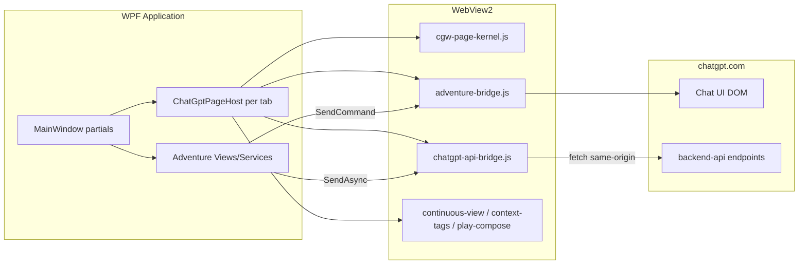
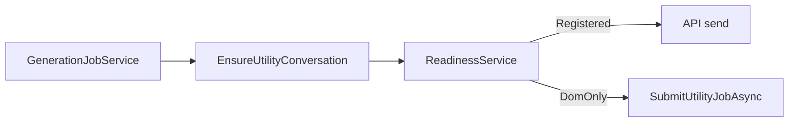

# System Architecture

Developer-oriented overview of ChatGPT Wrapper's structure, runtime behavior, and cross-cutting concerns.

---

## Solution structure

```
chatgpt-wrapper.sln
├── ChatGPTWrapper                    net9.0-windows WPF (main app)
├── ChatGPTWrapper.Core               net9.0 class library (shared)
├── ChatGPTWrapper.SessionHost        net9.0 console stub (future OOP host)
└── tests/
    └── ChatGPTWrapper.ApiDiagnostics net9.0-windows xUnit tests
```

**Dependency graph:**

```
ChatGPTWrapper ──► ChatGPTWrapper.Core
ChatGPTWrapper.ApiDiagnostics ──► ChatGPTWrapper
ChatGPTWrapper.SessionHost ──► ChatGPTWrapper.Core   (not referenced by main app)
```

| Project | Entry | Role |
|---------|-------|------|
| `ChatGPTWrapper` | `App.xaml` → `MainWindow.xaml` | WPF shell, adventures, WebView2 tabs |
| `ChatGPTWrapper.Core` | — | `BridgeProtocol`, stream parser, `SessionHostRpc` |
| `ChatGPTWrapper.SessionHost` | `Program.cs` | Named-pipe RPC stub (`oop_host_not_configured`) |
| `ChatGPTWrapper.ApiDiagnostics` | xUnit | Unit/integration/live/perf tests |

---

## High-level runtime



There is **no HTTP server** in this application. All ChatGPT integration uses the user's WebView2 session (cookies) plus injected JavaScript.

---

## Application modes

Defined in `MainWindow.Adventures.cs` as `AppMode`:

| Mode | UI layout | Primary behavior |
|------|-----------|------------------|
| `Browse` | Full-width chat tabs | Standard ChatGPT with style/display injections |
| `Adventures` | Dashboard + chat tabs | Adventure CRUD, project linking |
| `Play` | Play panel + pinned tab | Automated turn send, utility jobs |

Mode switching adjusts column visibility, play tab pinning, and which injections are prioritized.

---

## MainWindow partial-class map

| File | Responsibility |
|------|----------------|
| `MainWindow.xaml.cs` | Chrome, continuous view toggle, ui-chrome persistence |
| `MainWindow.ChatTabs.cs` | WebView2 environment, tab create/close, page host wiring |
| `MainWindow.PageHost.cs` | Feature registration per tab |
| `MainWindow.Adventures.cs` | Adventure mode UI, dashboard, `AppMode` |
| `MainWindow.PlayTab.cs` | Play session ensure, tab pin |
| `MainWindow.PlayInjection.cs` | Prompt packet send, continuation queue |
| `MainWindow.GenerationJobs.cs` | Utility job orchestration (`_generationJobGate`) |
| `MainWindow.ProjectHost.cs` | Project workspace, linking |
| `MainWindow.UtilityWebView.cs` | Separate utility-thread WebView for jobs |

---

## Page integration layer

Each WebView2 tab gets a `ChatGptPageHost` that orchestrates injection and message routing.

### Components

| Class | File | Role |
|-------|------|------|
| `ChatGptPageHost` | `PageIntegration/ChatGptPageHost.cs` | Kernel inject, navigation hook, feature apply |
| `PageMessageRouter` | `PageIntegration/PageMessageRouter.cs` | Route `postMessage` JSON to feature handlers |
| `ChatGptPageGate` | `PageIntegration/ChatGptPageGate.cs` | Only inject on trusted `chatgpt.com` URLs |
| `WrapperAssetBundle` | `PageIntegration/WrapperAssetBundle.cs` | Load `wrapper-assets/` file contents |
| `PageFeatureIds` | `PageIntegration/PageFeatureIds.cs` | Feature id constants |

### Registered features (`IPageFeature`)

| Feature ID | Injection class | Channel |
|------------|-----------------|---------|
| `kernel` | (bundled in kernel payload) | — |
| `style` | `ChatGptStyleInjection` | — |
| `continuous-view` | `ChatGptContinuousViewInjection` | `cgw-display` |
| `api-bridge` | `ChatGptApiBridgeInjection` | `cgw-api` |
| `adventure-bridge` | `ChatGptAdventureBridgeInjection` | `cgw-play` |
| `play-compose` | `ChatGptPlayComposeInjection` | `cgw-play` |
| `context-tags` | `ChatGptContextTagsInjection` | `cgw-display` |

### Navigation lifecycle

1. `NavigationCompleted` → `ChatGptPageGate.IsInjectable(url)`
2. `EnsureKernelAsync` → inject `cgw-page-kernel.js`
3. `ApplyAllAsync` → each feature's `ApplyAsync`
4. `WebMessageReceived` → `PageMessageRouter.Route(json)`

Malformed JSON in messages is silently ignored.

---

## ChatGPT session architecture

### In-process (current)

`ChatGptSessionHost` coordinates:

- `ChatGptProjectHost` — API bridge readiness
- `ChatGptProjectApiService` — Projects/files API
- `ChatGptConversationSendService` — conversation send
- `AdventureTurnService` — DOM play automation

All run in the WPF process sharing WebView2 controls.

### Out-of-process (future stub)

`ChatGPTWrapper.SessionHost` listens on named pipe `ChatGPTWrapper.SessionHost`.

RPC methods (`SessionHostRpcMethods`):

- `EnsureReady`, `SendMessage`, `Regenerate`, `CaptureAssistant`
- `DiscoverProjects`, `SyncSources`

`Program.cs` currently returns `oop_host_not_configured`. The contract exists in `ChatGPTWrapper.Core/SessionHost/SessionHostRpc.cs` for future process isolation.

---

## Concurrency and gates

| Gate | Location | Purpose |
|------|----------|---------|
| `_playContextGate` | `MainWindow` | Serialize play context ensure / send |
| `_generationJobGate` | `MainWindow.GenerationJobs.cs` | One utility job at a time from shell |
| `_applyGate` | `ChatGptPageHost` | Serialize feature injection per tab |
| `DebouncedAdventureSaver` | 300ms timer | Batch disk writes |

Utility jobs use `Task` + `SemaphoreSlim`; there is no external job queue (Hangfire, etc.).

### Utility job pipeline (Phase 2c)



See [utility-job-orchestration.md](utility-job-orchestration.md) for session reuse, error codes, and diagnostics.

---

## Data persistence

All adventure state is **JSON on disk** under `%LocalAppData%\ChatGPTWrapper\`. No SQL/EF Core.

- `AdventureStore` — load/save bundle documents
- `LibraryStore` — reusable scenario/world/character libraries
- `UiChromeStore` — `ui-chrome.json`
- `BackupService` — zip backups

See [Data Model Reference](data-model-reference.md).

---

## Error handling philosophy

### Typed API errors

`ChatGptApiException` carries `Endpoint`, `StatusCode`, `RawBody`. Thrown from `ChatGptProjectApiService.EnsureOk()` with user-facing messages (e.g. missing device id → sign in prompt).

### Result DTOs (no throw)

Many flows return structured results:

- `AdventureTurnResult`, `CaptureAssistantResult`, `GenerationJobResult`
- `ConversationSendResult`, `ProjectBindingResult`
- `BridgeHealthStatus`

### Bridge timeouts

`AdventureTurnService` catches `TimeoutException` on bridge commands and returns failure results rather than crashing the UI.

### Best-effort

Warmup prefetch, library load failures, and malformed bridge messages are swallowed or logged without blocking the shell.

---

## Authentication model

No custom user accounts. Auth is **ChatGPT web session only**:

- Cookies in `WebView2UserData`
- Session check via `/api/auth/session`
- Device cookie (`oai-did`) required for API bridge calls

`AdventureProjectBindingService.EnsureSessionAsync` enforces login before project operations.

---

## Build-time asset pipeline

`ChatGPT_files/` → copied to `wrapper-assets/` in output (see `ChatGPTWrapper.csproj`).

Injected at runtime by page features. See [Injected Assets](injected-assets.md).

---

## Related documentation

- [WebView Bridges](webview-bridges.md) — JS↔C# protocol
- [ChatGPT API Integration](chatgpt-api-integration.md) — backend-api paths
- [Services Reference](services-reference.md) — business logic catalog
- [UI Components](ui-components.md) — WPF inventory
