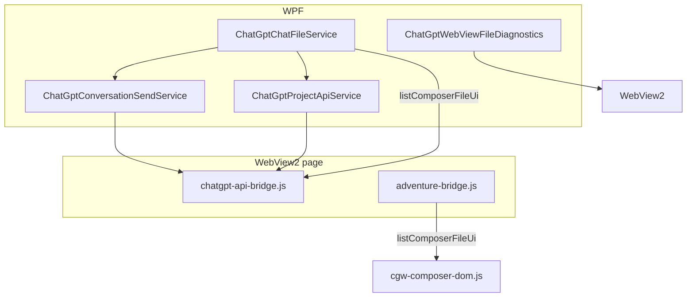

# Chat File I/O Feasibility

This document records the feasibility study for **uploading files to chat messages** and **downloading files from chat threads** in ChatGPT Wrapper. It compares the existing API-bridge stack (proven for Project knowledge files) with DOM/WebView hooks.

**Related:** [ChatGPT API Integration](chatgpt-api-integration.md) · [WebView Bridges](webview-bridges.md)

---

## Executive summary

| Scenario | API path | DOM / WebView path | Status |
|----------|----------|-------------------|--------|
| Upload bytes to ChatGPT storage | **Proven** (`uploadFile` bridge) | Not used | Production for Project sync |
| Attach files to outgoing play messages | API blocked on linked play threads (`http_403`) | **Native composer + DOM submit** (default); legacy wrapper uses CDP pre-upload | Production for Play (native default) |
| List files in a conversation thread | **Spike implemented** (`ListConversationFilesAsync`) | Not implemented | Parser covers metadata + asset pointers |
| Download by known `file_id` | **Proven** (`downloadFile` bridge) | N/A | Reused from Project sync |
| Download via browser UI (exports, blobs) | Partial (`fetchBlobUrl` bridge) | **Spike implemented** (`DownloadStarting` → `chat-downloads/`) | Needs manual classification |

**Recommendation:** Proceed **API-first** for upload/list/download. Use **WebView download interception** and **`fetchBlobUrl`** only for assets that never expose a stable `file_id`.

---

## What already existed

Project knowledge files are fully automated via:

- `chatgpt-api-bridge.js` — `uploadFile`, `downloadFile`
- `ChatGptProjectApiService` — orchestration, path candidates, Snorlax attach
- Manual fallback — WPF drag-and-drop to browser (`SourceManagerDialog`)

Chat sends were **text-only** (`content_type: "text"`) via `ChatGptConversationSendService`.

---

## Phase 0 — Diagnostics (implemented)

### Download + permission logging

`ChatGptWebViewFileDiagnostics` registers on each ChatGPT WebView when the API bridge registers:

| Output | Path |
|--------|------|
| JSONL event log | `%LocalAppData%\ChatGPTWrapper\chat-file-diagnostics.jsonl` |
| Auto-saved downloads | `%LocalAppData%\ChatGPTWrapper\chat-downloads\` |

Events logged:

- `DownloadStarting` — URI, chosen save path
- `downloadFinished` — state, byte count, interrupt reason
- `permissionRequested` — `FileReadWrite` / `ClipboardRead`

On trusted `chatgpt.com` origins, `FileReadWrite` is **auto-allowed** to support DOM file-input experiments.

### Composer file UI probe

Bridge commands (read-only DOM scan):

| Command | Bridge | Returns |
|---------|--------|---------|
| `listComposerFileUi` | `chatgpt-api-bridge.js` | `input[type=file]` nodes + attach button matches |
| `listComposerFileUi` | `adventure-bridge.js` | Same via `cgw-composer-dom.js` when kernel loaded |

C# entry point: `ChatGptChatFileService.ProbeComposerFileUiAsync(core)`.

**How to use:** Enter Play/Browse with a ChatGPT tab, then call `GetChatFileService()?.ProbeComposerFileUiAsync(core)` from diagnostic code or inspect bridge JSON manually.

---

## Phase 1 — API upload spike (implemented)

### Chat attachment upload

`ChatGptProjectApiService.UploadChatAttachmentBytesAsync`:

- Uses `ResolveUploadUseCase` (`multimodal` for images, `my_files` for PDF/text)
- `useProjectLibrary: false`, `skipProjectAttach: true`
- Same register → Azure PUT pipeline as Project upload

`ChatGptChatFileService.UploadChatAttachmentAsync` wraps this into `ChatAttachmentRef`.

### Send with attachments

`ChatGptConversationSendService.SendUserMessageWithAttachmentsAsync` builds a multimodal send body:

```json
{
  "messages": [{
    "content": {
      "content_type": "multimodal_text",
      "parts": ["text", { "content_type": "image_asset_pointer", "asset_pointer": "file-service://file-…" }]
    },
    "metadata": { "attachments": [{ "id": "file-…", "name": "…", "mime_type": "…", "size": … }] }
  }]
}
```

If a captured template exists at `api-send-samples/POST_backend-api_f_conversation_attachments.json`, it is merged instead of the fallback shape.

### Capture workflow

1. Use ChatGPT normally: attach an image/PDF and send a message.
2. `ChatGptApiSendSampleCapture` saves:
   - `POST_backend-api_f_conversation_attachments.json` when the send body contains attachments / asset pointers
   - `POST_backend-api_files.json` / `POST_backend-api_files_library.json` on upload POSTs
3. Re-run programmatic send; compare assistant acknowledgement.

**Go criterion:** Captured attachment send succeeds across three sessions → treat fallback payload as validated or replace with captured template.

### Play thread attachments (native composer — default)

Linked play threads return `http_403` for API attachment sends. Default Play mode uses ChatGPT's **native composer** paperclip:

1. User attaches in the visible composer (ChatGPT handles upload).
2. `cgw-play-compose.js` intercepts Send and posts `cgwComposeSend` with `attachmentsPreStaged: true`.
3. Host runs `PrepareSend` → `adventure-bridge.js` `submitPrompt` with `attachmentsPreStaged` (no CDP staging, no base64 over `PostWebMessage`).

Legacy *wrapper composer* opt-in still uses CDP pre-upload via `PlayComposeNativeUploadService`.

---

## Phase 2 — API download spike (implemented)

### List conversation files

`ConversationFileParser.ExtractFiles(conversationJson)` walks `mapping` nodes and collects:

| Source | Fields |
|--------|--------|
| `metadata.attachments[]` | `id`, `name`, `mime_type` |
| `content.attachments[]` | same |
| `content.parts[]` objects | `asset_pointer` → `file-service://…` |
| `content.parts[]` text | `filecite…` tokens (display markers; not downloadable) |

`ChatGptChatFileService.ListConversationFilesAsync` = `FetchConversationAsync` + parser.

### Download

`ChatGptChatFileService.DownloadConversationFileAsync` reuses `ChatGptProjectApiService.DownloadFileAsync` with optional `gizmoId` + `location` from the parsed ref.

**Go criterion:** Round-trip upload (Phase 1) → list → download bytes match.

**Known gap:** Assistant-generated images may use CDN URLs without `file_id` — use DOM/`fetchBlobUrl` path.

---

## Phase 3 — DOM fallback (partial)

| Technique | Implementation | Notes |
|-----------|----------------|-------|
| `DownloadStarting` handler | `ChatGptWebViewFileDiagnostics` | Saves to `chat-downloads/` when browser has no path |
| `PermissionRequested` | Auto-allow `FileReadWrite` on chatgpt.com | Enables future file-input tests |
| `fetchBlobUrl` bridge command | `chatgpt-api-bridge.js` | Same-origin blob URLs only |
| CDP `setFileInputFiles` | **Not implemented** | Deferred — high fragility; try only if API attach blocked |

**Not implemented:** Programmatic click of attach button + synthetic `DataTransfer` drop.

---

## Architecture



File bytes stay on **`chatgpt-api-bridge.js`** (base64, long timeouts). Adventure bridge is for DOM discovery only.

---

## Go / no-go matrix

| Criterion | Go | No-go / fallback |
|-----------|-----|------------------|
| Captured attachment send stable ×3 sessions | Use API attach in product | DOM file-input or manual-only |
| `file_id` found in conversation GET | API list + download | `DownloadStarting` + blob fetch |
| Download works for assistant assets | Full story | Document per asset type limits |
| DOM attach success ≥80% after reload | Keep as fallback | API-only |

---

## API surface (spike)

| Type | Members |
|------|---------|
| `ChatGptChatFileService` | `UploadChatAttachmentAsync`, `SendWithAttachmentsAsync`, `ListConversationFilesAsync`, `DownloadConversationFileAsync`, `DownloadConversationFileToPathAsync`, `ProbeComposerFileUiAsync`, `FetchBlobUrlAsync` |
| `ChatGptConversationSendService` | `SendUserMessageWithAttachmentsAsync` |
| `ChatGptProjectApiService` | `UploadChatAttachmentBytesAsync` |
| `MainWindow` | `GetChatFileService()` |

---

## Manual validation checklist

1. Open ChatGPT tab → attach file manually → confirm `POST_backend-api_f_conversation_attachments.json` appears under `api-send-samples/`.
2. Call upload + send with attachments on a test thread → assistant acknowledges file.
3. `ListConversationFilesAsync` returns the uploaded file id.
4. Download bytes match local file.
5. Trigger a ChatGPT UI download → entry in `chat-file-diagnostics.jsonl` and file in `chat-downloads/`.
6. Run `ProbeComposerFileUiAsync` → note selectors for attach button and hidden file inputs.

---

## Out of scope

- Replacing Project source sync (`ProjectSourceSyncService`)
- OpenAI official API / API keys
- Clipboard image paste automation
- Product UI (play composer attach button) — Phase 4
