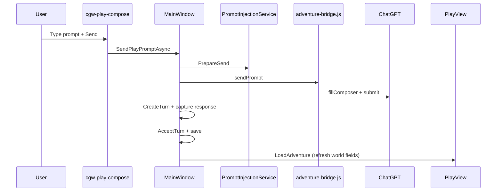

# Adventure Developer Reference

Developer-oriented companion to [Adventure Panel Reference](../user/adventure-panel.md): data model, persistence, turn automation, packet construction internals, project linking, source sync, and key services.

**Documentation hub:** [INDEX.md](../INDEX.md)

**Related:** [Data Model Reference](../reference/data-model-reference.md) · [Services Reference](../reference/services-reference.md) · [Prompt Construction Guide](../user/prompt-construction-guide.md) · [user-projects-and-sync.md](../user/user-projects-and-sync.md) · [instruction-sources-paradigm.md](../user/instruction-sources-paradigm.md) · [WebView Bridges](webview-bridges.md) · [utility-job-orchestration.md](utility-job-orchestration.md)

---

## Table of contents

1. [Primary code locations](#1-primary-code-locations)
2. [Data model](#2-data-model)
3. [Persistence and file layout](#3-persistence-and-file-layout)
4. [Turn lifecycle and automation](#4-turn-lifecycle-and-automation)
5. [Prompt packets](#5-prompt-packets-source-delegated-vs-fat-fallback)
6. [ChatGPT Project linking](#6-chatgpt-project-linking)
7. [Source export and sync](#7-source-export-and-sync)
8. [Supporting features and ADRs](#8-supporting-features-and-adrs)
9. [Key play-path services](#9-key-play-path-services)

---

## 1. Primary code locations

| Area | Path |
|------|------|
| UI — dashboard | `ChatGPTWrapper/Views/AdventureDashboardView.xaml(.cs)` |
| UI — play | `ChatGPTWrapper/Views/AdventurePlayView.xaml(.cs)` |
| Shell wiring | `ChatGPTWrapper/MainWindow.Adventures.cs`, `MainWindow.ProjectHost.cs` |
| Models | `ChatGPTWrapper/Adventure/Models/` |
| Services | `ChatGPTWrapper/Adventure/Services/` |
| Storage | `ChatGPTWrapper/Adventure/Stores/` |
| ChatGPT bridge (JS) | `ChatGPT_files/adventure-bridge.js` |
| Project API | `ChatGPTWrapper/ChatGptApi/` |

---

## 2. Data model

### AdventureBundle (aggregate root)

**File:** `Adventure/Models/AdventureBundle.cs`

| Property | Document | Role |
|----------|----------|------|
| `Metadata` | `AdventureMetadata` | Id, title, status, link ids, settings |
| `Scenario` | `ScenarioDocument` | World, plot, opening, author note |
| `Log` | `LogDocument` | Turns, sessions, chapters |
| `Summary` | `SummaryDocument` | Rolling summary, pending review flag |
| `State` | `StateDocument` | Location, objectives, scene/time |
| `Memory` | `MemoryDocument` | Entries + review queue |
| `Entities` | `EntitiesDocument` | Characters, locations, inventory, quests, factions |
| `Cards` | `CardsDocument` | Story cards with triggers |
| `PromptHistory` | `PromptHistoryDocument` | Full packet text per turn (for regenerate) |
| `Notes` | string | Freeform `notes.txt` |
| `SourceManifest` | `SourceManifest` | Per-file sync state |
| `ContinuationQueue` | `List<string>` | In-memory queue (see limitations) |
| `CurrentSessionId` | `Guid?` | Active play session |

### AdventureMetadata

| Field | Description |
|-------|-------------|
| `Id` | Adventure GUID |
| `Title`, `Genre`, `ScenarioSummary` | Display / search |
| `CreatedAt`, `LastPlayedAt` | Timestamps |
| `Status` | `Active`, `Paused`, `Completed` |
| `Archived` | Boolean flag (not filtered in dashboard) |
| `Tags` | Search filter only |
| `LinkedConversationId` | ChatGPT thread id (`/c/{id}`) |
| `LinkedProjectId` | ChatGPT Project gizmo id (`g-p-…`) |
| `ProjectLink` | Structured link record (`ProjectLink`) |
| `Settings` | `AdventureSettings` |

### TurnRecord

| Field | Description |
|-------|-------------|
| `Id`, `Index`, `At` | Identity and ordering |
| `PlayerText`, `NarratorText` | Turn content |
| `Status` | `Pending`, `AwaitingResponse`, `Review`, `Accepted`, `Rejected` |
| `Attempts` | Alternate responses from regenerate |
| `SessionId`, `ChapterId` | Optional grouping |
| `PromptPacketHash` | Short SHA256 prefix of sent packet |

Legacy log files may still contain a `mode` field; it is ignored on load.

### Source sync enums

**SourceSyncState:** `InSync`, `LocalNewer`, `RemoteNewer`, `Conflict`, `LocalOnly`, `MissingRemote`, `RemoteOnly`

**SourceSyncAction:** `Skip`, `Pull`, `PushReplace`, `NeedsResolution`

**SourceConflictResolution:** `None`, `KeepLocal`, `KeepRemote`, `Skip`

---

## 3. Persistence and file layout

### Root directory

```
%LocalAppData%\ChatGPTWrapper\
├── adventures\
├── backups\
├── libraries\
├── WebView2UserData\
├── styles\
├── link-project.log
├── sync-trace.jsonl
├── sync-runs\
└── … (API diagnostics files)
```

Defined in `AppDirectories.cs`.

### Per-adventure directory

```
adventures\{guid-D}\
├── adventure.json          # AdventureMetadata
├── scenario.json
├── log.json
├── summary.json
├── state.json
├── memory.json
├── entities.json
├── cards.json
├── prompt-history.json
├── notes.txt
├── source-manifest.json
├── sources\                # Exported markdown for Project sync
│   ├── scenario.md
│   ├── world.md
│   ├── plot.md
│   ├── cast.md
│   ├── context-index.json (local only)
│   ├── instructions-snippet.md
│   └── .sync-tmp\          # Temp remote downloads during plan build
└── save-states\
    └── {yyyyMMdd-HHmmss}-{name}\
        └── (copy of top-level JSON files)
```

**JSON serialization:** camelCase, schema version 1 (`AdventureJson.Options`).

**Save side effect:** every `AdventureStore.Save` updates `Metadata.LastPlayedAt`.

### Libraries

```
libraries\
├── scenarios\index.json + {id}.json
├── worlds\…
├── characters\…
├── presets\…
├── templates\…
└── random-tables.json
```

### Backups

- **Backup:** `backups/adventure-{id}-{timestamp}.zip`
- **Import:** extracts zip and `AdventureStore.ImportFromDirectory`

---

## 4. Turn lifecycle and automation

### Flow diagram



### Play composer flow (native default)

Turn injection and acceptance run from `MainWindow.PlayInjection.cs` and `cgw-play-compose.js`:

1. **Send:** user types in ChatGPT's native composer (or legacy wrapper UI) → intercept posts `cgwComposeSend` → resolve player line → `PrepareSend` → wire pinned tab → ensure linked Project context (cached) → `submitPrompt` (DOM `fillComposer` + native submit by default) → capture narrator → `TurnTimelineService.AcceptTurn` + save log.

**Native composer (default):** `AdventureSettings.UseWrapperComposer` is `false` by default. The pinned play tab shows ChatGPT's stock composer; `cgw-play-compose.js` intercepts Send/Enter, extracts the player line (and native attachment presence), and the host injects the merged packet via the bridge. File attachments use ChatGPT's native paperclip upload (no CDP pre-upload).

**DOM-first send (default):** `AdventureSettings.PreferDomPlaySend` is `true` by default. Play turns skip `SendUserMessageAsync` and submit through `adventure-bridge.js`. Uncheck *Prefer DOM composer send* in Play settings to restore API-first sends when a conversation ID is known.

**Legacy wrapper composer:** Enable *Use custom wrapper composer* in Play settings to restore the in-page overlay (`#cgw-play-composer-root`) with custom attach chips and CDP pre-upload on attach.

### SubmitTurnAsync steps (legacy — removed from adventure panel)

Turn injection and acceptance previously used a two-step inject-then-send flow; that path is replaced by native (or wrapper) composer **Send**.

Legacy panel automation (`SubmitTurnAsync` from the adventure sidebar) remains removed.

### Adventure bridge (`adventure-bridge.js`)

Injected by `ChatGptAdventureBridgeInjection`. Commands:

| Action | Purpose |
|--------|---------|
| `sendPrompt` | Set composer text, submit, wait for stable assistant message |
| `fillComposer` | Set composer text without submitting |
| `captureLastAssistant` | Read latest assistant message text |
| `setWrapperComposer` | Toggle native composer hide flag (`data-cgw-wrapper-composer`) |
| `regenerateLast` | Click regenerate on last assistant message |
| `getConversationId` | Parse `/c/{id}` from URL |
| `ping` / `probe` | Health check (composer + submit button found) |

Responses: `turnComplete`, `conversationId`, `pong`, `probeResult`, `bridgeReady`.

**Timeout:** default 120s for send; configurable per command.

### Session tracking

`AdventureSessionService.AttachTurnToSession` assigns each new turn to the current play session recorded in `Log.Sessions`.

---

## 5. Prompt packets (three profiles)

> **Delegation paradigm:** Source-delegated packets carry session delta; static lore is retrieved from Project sources and custom instructions. Full matrix: [instruction-sources-paradigm.md](../user/instruction-sources-paradigm.md).

**Builder:** `PromptPacketBuilder.cs` + `PacketProfileResolver.cs` + `PromptInjectionService.cs` + `ProjectSourceInjectionService.cs`

When `UseContextTags` is enabled (default), adventure context is wrapped in `[[cgw:…]]` blocks (`sources`, `instructions`, `state`, `cards`, `memory`, `transcript`, `meta`). **User prose is appended untagged** after the tagged context.

### Profile selection

`PacketProfileResolver.Resolve(bundle, userChoseInlineFallback)`:

| Profile | When |
|---------|------|
| **SourceDelegated** | Linked Project + every lore file manually **Published** |
| **MinimalLocal** | No linked Project |
| **InlineFallback** | `ForceInlineLore` (debug), or user clicks **No** on the publish warning and proceeds |

Readiness is evaluated by `ProjectSourceInjectionService.Evaluate()` (manual publish only). When linked but unpublished, **Send** shows a non-blocking warning; default preview uses delegated-shaped pointers with `Sources not ready:` in ALWAYS RETRIEVE. **Inline fallback** only when the user proceeds after the warning or `ForceInlineLore` is enabled.

### Source-delegated packet sections (in order)

1. **`[[cgw:sources v="2"]]`** — baseline pointers, this-turn retrieval hints (`ContextPointerResolver`)
   - **ALWAYS RETRIEVE** — baseline sections (`opening`, `rules`, `player`, …)
   - When ready: synced-file fallback if section index empty
   - When not ready: `Sources not ready: {reason}` + suggested action
2. Short narrator pointer
3. Story so far (local cache)
4. State delta
5. Pinned memory
6. Recent transcript (last 6 accepted turns)

(User prose merged at send time.)

**Delegated / minimal max size:** `min(MaxPacketChars, 8000)`.

### Minimal local packet sections

Same section-injection v2 shape as delegated, but:

- `[[cgw:sources]]` notes no Project linked
- Inline **scenario opening** only (no plot/world/cast/contract bodies)
- Session deltas (state, memory, transcript, summary)

### Inline fallback packet sections (in order)

1. Full `[[cgw:sources v="2"]]` or inline sources block
2. Narrator system instructions (perspective, tense, detail, tone, difficulty)
3. Content boundaries, portrayal rules, instruction contract
4. Scenario, plot essentials, world rules, author's note
5. Story so far, current state, triggered cards, pinned memory, entity excerpts

**Inline max size:** full `MaxPacketChars`; 12 transcript turns.

### Injection dialog — Sources tab (publish hub)

`PlayPromptInjectionDialog` **Sources** tab readiness banner:

- Green **Source-delegated** when all lore files published
- Yellow **Publish sources to enable delegation** when linked but unpublished
- Gray **Minimal local — link a Project for source retrieval** when unlinked

Settings → Advanced automation: **Force inline lore (debug)** (`forceInlineLore` / JSON `forceFatPackets`).

The **Next send** tab meta line shows profile label, e.g. `Source-delegated (manual publish, 4 files)` or `Inline fallback — 2 need publish`.

### Play link status

When linked and delegated: `Sources: published (N files) | source-delegated packets`

When linked but not ready: `Sources: N need publish | inline fallback`

When unlinked: `No Project — minimal local`

### Trimming

If total length exceeds max, packet is truncated with `WasTrimmed = true` (reported in Context dialog).

### Thread display (Play tab)

Toolbar **Format…** → **Thread behavior** tab controls how merged packets appear in the ChatGPT thread (continuous overlay and native fallback when CV is off):

| Setting | Location | Effect |
|---------|----------|--------|
| **Hide packet context in thread** (default on) | Format… → Thread behavior | User messages containing `[[cgw:…]]` show **only your player line**; tagged adventure context is not shown inline |
| **Expandable context summary** (default on) | Same tab | Collapsed adventure context cards in **continuous view** when packet context is hidden (not shown in native bubbles) |
| Hide off | Uncheck **Hide packet context in thread** | Full raw merged packet visible in the thread (debug) |

Structured sections use prose paragraphs (not raw tag blocks). The continuous overlay caches turn extraction and only re-decorates changed segments during streaming. Opening or switching chats uses a transition shell to hide native bubbles immediately, then reveals the formatted overlay in one step.

When Continuous View is off, native packet display **rewrites the player line in-place** inside ChatGPT's `whitespace-pre-wrap` text leaf (`textContent` only — bubble wrapper DOM unchanged). Source leaf HTML is backed up per turn for teardown and fingerprinting. Expandable adventure context panels are **continuous-view only** (CMD-81). A fingerprint cache (`turnDisplayCache` / `turnRegistry`) skips unchanged turns; only new or changed messages are updated incrementally. If a turn cannot produce a player-line display, the pipeline **does not** leave the native bubble hidden — it calls `releasePendingFallback` instead (CMD-70).

Implementation: [`cgw-packet-display.js`](ChatGPT_files/cgw-packet-display.js) batch-applies on `__cgwPacketDisplayNavigate` and delta-updates via `processDeltaTurns`; continuous view applies special blocks when enabled; send-time `data-cgw-user-line` stamps avoid re-parsing fresh sends. Packet display preferences sync to all chat tabs (Browse and Play).

### Bootstrap / Start adventure

`AdventureBootstrapService.BuildStartPacket` — opening packet for fresh adventures using scenario opening situation and narrator bootstrap instructions.

---

## 6. ChatGPT Project linking

**Service:** `AdventureProjectBindingService`

### Link methods

| Method | Use case |
|--------|----------|
| `LinkExistingAsync` | Select existing project from list or URL |
| `CreateAndLinkAsync` | New project with title + generated instructions |
| `FinalizeLinkAsync` | Writes metadata, optional source export/sync, optional thread creation |

### Project instructions

Built from scenario + settings (`BuildProjectInstructions`) — narrator contract telling the model to use Project source files.

Canonical delegation rules: [instruction-sources-paradigm.md](../user/instruction-sources-paradigm.md).

| Field | In `BuildProjectInstructions` |
|-------|--------------------------------|
| Narrator contract | Yes |
| Perspective / tense / detail | Yes |
| Author's note, tone, boundaries | Yes |
| World rules | **No** — `world.md` only |
| Plot essentials | No — `plot.md` only |

`instructions-snippet.md` is a full RAG mirror via `InstructionSourcesPolicy`. Drift tracked with `LastProjectInstructionsSyncedHash`.

### Metadata after link

| Field | Content |
|-------|---------|
| `LinkedProjectId` | Gizmo id |
| `LinkedConversationId` | Play thread id |
| `ProjectLink` | Url, timestamps, conversation id |
| `LinkedProjectHint` | Display hint |

**Re-link behavior:** When linking to a **different** project id, remote bindings in `source-manifest.json` are cleared (`RemoteFileId`, hashes). The play thread is reset when **Create or pick play thread** is checked. Link-time sync uses `ExportForce` then auto-safe apply.

**Import / restore:** Importing a backup that references a linked project prompts to keep linkage or detach (detach clears project id and manifest remote fields).

### Link health (Projects workspace Connection tab)

Shows project id, last sync time, packet mode (source-delegated vs fat fallback), and duplicate remote count when known.

### WebView navigation

When a Project is linked, the Adventure tab is the **single WebView** for play turns, project API calls, and source sync. Before Send, sync, or health checks, the app ensures the tab is on a **project-scoped play thread** (`/c/{id}?project={gizmoId}`) — not a generic homepage chat.

After successful link, the Adventure tab navigates via `ChatGptUrls.BuildProjectConversationUrl(conversationId, gizmoId)`.

### Play status line format

```
Project: {gizmoId} | Thread: c/{convId} | Sources: synced (12 files) | source-delegated packets | Instructions: synced 6/5/2026 3:45 PM
```

When duplicate orphan remotes are detected:

```
… | Sources: 2 out of sync | fat fallback | 3 duplicate remote(s)
```

When linked but no play thread exists yet:

```
Project: {gizmoId} | Thread: missing — will create on Send | Sources: …
```

Or without project:

```
Thread: chatgpt.com/c/{id} | No Project — fat packets
```

---

## 7. Source export and sync

### Export (local)

**Service:** `ProjectSourceExportService`

| Method | Use |
|--------|-----|
| `ExportIfStale` | Default for plan build — merges into existing manifest entries, preserves `RemoteFileId`, `BaselineSha256`, `LastPushedAt`; only rewrites disk when generated content hash changed |
| `ExportForce` | Link-time sync and explicit re-export — always writes files |

Writes non-empty markdown files to `sources/`:

| File | Source content |
|------|----------------|
| `scenario.md` | Title, setting, role, genre, opening, conflicts, constraints |
| `world.md` | `Scenario.WorldRules` |
| `plot.md` | `Scenario.PlotEssentials` |
| `cast.md` | Player sheet, party, NPCs (sectioned) |
| `world.md` / `plot.md` | Sectioned locations, factions, quests, mysteries, etc. |
| `instructions-snippet.md` | Full RAG mirror of static instructions (`InstructionSourcesPolicy`) |

Utility job instructions are **not** exported to `sources/`. Defaults live in `GenerationJobGuideService`; optional overrides in `metadata.json` → `UtilityJobGuideOverrides`.

Sync state is recomputed by the planner (`RefreshSyncedFlag`); export no longer blanket-resets `Synced`.

### Import (local, deterministic)

**Service:** `ProjectSourceImportService` (inverse of export — no ChatGPT / utility jobs).

| Entry point | Use |
|-------------|-----|
| Design → local sources → **Regenerate JSON from sources** | Dry-run summary, confirm, then write `scenario.json` / `entities.json` and refresh manifest hashes + `sections[]` |

Edits to `scenario.md` `## opening`, entity sections in `cast.md` / `world.md` / `plot.md`, and lexicon `rules` / `pools` / `avoid` are merged offline. Removals queue `SourceEditReviewQueue` instead of deleting entities immediately. Works with a custom adventures root ([CMD-17](https://linear.app/cmd0112/issue/CMD-17/configurable-adventures-directory-and-external-folder-association)) — import resolves paths via `AdventureSourceFileService` under the configured library directory.

For LLM-assisted import from sources, see CMD-19 — **Propose JSON from sources (AI)** in Design → Sources (utility job `propose_json_import`; review queue on `scenario.jsonImportReviewQueue`). Deterministic import remains the default.

### Plan build

**Service:** `ProjectFileSyncPlanner.BuildPlanAsync`

1. `ExportIfStale` (or skip export for fast status refresh via `BuildStatusPlanAsync`).
2. Fetch remote file list (session cache ~2 min per project, or cached list from prior apply).
3. Match manifest entries using best-match selection (stored id, path, basename).
4. Compare SHA256:
   - **Fast path:** local hash equals stored `RemoteSha256` or baseline → skip download.
   - Otherwise parallel remote downloads (max 3) to `.sync-tmp`.
5. **Prune stale bindings** — if stored `RemoteFileId` is absent from the remote list (e.g. deleted in ChatGPT UI), clear remote id/name/hash on the manifest entry (keeps local/baseline hashes).
6. Classify each entry (`ClassifyThreeWay`) — if remote content cannot be downloaded (all-path 404), matched remotes become **PushReplace** or **InSync** (when baseline matches local), never **Pull**.
7. Add unmatched remotes as `RemoteOnly` rows.
8. **`ReconcileDuplicateRows`** — collapse LocalOnly + RemoteOnly pairs for the same basename without uploading.
9. Store `LastKnownDuplicateRemotes` on manifest for play/injection UI hints. Plan also tracks `StaleBindingsCleared` and `ListedNotDownloadableFiles` for sync UI banners.

**Preflight** (during plan build): `ValidateSyncPreflightAsync` — may block sync if sidebar duplicates detected. Results cached on plan (`PreflightPassedAt`, `PreflightGizmoId`, `CanaryPassed`).

### Reconcile duplicates

When the same filename exists multiple times on the ChatGPT project (orphan attachments), the sync grid may show duplicate rows. Use **Reconcile duplicates…** in `SourceSyncDialog`, Projects workspace Sources tab, or Prompt injection Sources tab:

1. Lists orphan remote file ids (same basename as a bound manifest entry).
2. User confirms → batch detach via `DetachProjectFilesViaUpsertAsync` (tries bridge delete per file first, then rewrites the linked project through **detail-based Snorlax upsert** — same body shape as attach — so the linked project id is preserved).
3. Plan refreshes (does **not** run during Apply Safe / Apply All).

### Apply

**Service:** `ProjectSourceSyncService.ApplyPlanAsync`

1. Skip cached preflight/canary when plan is fresh (< 5 min, same gizmo).
2. **Pull phase** — up to 2 parallel downloads; undownloadable remotes are skipped (non-fatal).
3. **Upload phase** — sequential uploads (no artificial delay); deferred delete only when the old `RemoteFileId` is still listed on the project; upload returns an error if ChatGPT returns no `file_id`.
4. **Attach phase** — batch `POST .../projects/{id}/files` with `{ files: [...] }`; fallback to per-file upsert on failure.
5. Update manifest entries, `DetectedRemoteFiles`, save bundle.

**Orchestrator:** `ProjectFileSyncOrchestrator.ApplyAndVerifyAsync` — apply + optional verify pass re-listing remote files (checks manifest `RemoteFileId` presence, not only basename).

### Recovering from browser-deleted / 404 project files

When ChatGPT project files show in the sidebar but return `{"detail":"Not found."}` in the browser (ghost file refs):

1. Delete the dead files in the **ChatGPT project UI** (manual cleanup).
2. In ChatGPT Wrapper: open **Sync project sources** → **Refresh plan** (stale `RemoteFileId` bindings are auto-cleared when ids vanish from the remote list).
3. Optional: **Clear remote bindings** if the plan still looks wrong after browser cleanup.
4. **Apply all** to re-upload local `sources/` files (creates new `file_id`s with real content).
5. Refresh plan again — rows should show **InSync** with matching hashes.
6. If duplicate basenames remain, use **Reconcile duplicates…** before or after re-push.

### Sync action reference

| UI label | Enum | Effect |
|----------|------|--------|
| Skip | `Skip` | No change |
| Pull remote | `Pull` | Download remote file over local |
| Push local | `PushReplace` | Upload local file, attach to project, replace remote |

### User override rules

Per-row Action dropdown options depend on `SourceSyncState` (see `ProjectFileSyncPlanner.GetAvailableActions`). Conflicts map actions to resolutions (Push local = KeepLocal, etc.).

---

## 8. Supporting features and ADRs

### ADR: Play/Design surface convergence (CMD-219)

Decision: **partial defer** — keep separate `AppMode.Play` / `AppMode.Design` hosts; continue shared-component extraction (`EntityReferencePanel`, thread manager, source manager) rather than merging surfaces. Mode toggle (Option 2) deferred pending author feedback; unified companion (Option 3) not recommended without toggle first. Full analysis: [play-design-surface-convergence-adr.md](../adr/play-design-surface-convergence-adr.md).

### Export formats (`ExportService`)

| Extension | Output |
|-----------|--------|
| `.md` | Story markdown (`polishedOnly: true` — italic player, narrator prose) |
| `.txt` | Plain text (markdown markers stripped) |
| `.html` | Minimal HTML wrapper |
| `.json` | Full adventure JSON snapshot |
| `.zip` | All adventure files archived |

### Search (`SearchService`)

Searches accepted log, summary, memory, cards, character names/descriptions.

### Recap (`RecapService`)

Styles: Brief, Detailed, SpoilerFree, Session — **UI button currently hidden**.

### Continuity warnings (`ContinuityService`)

Heuristic + AI checks listed in **Warnings** tab; no automatic fixes. Info-level duplicates of cockpit **Reviews** (pending summary / memory queue) are omitted. Users can **Dismiss** warnings (persisted by message hash) or **Open in Reference** when an entity name matches.

**Layout:** Double-click play panel splitters to snap to requirement-aware optimal widths (Writer 384/424, GM 440/328, Minimal 344/320). Custom layouts derive width from visible tab placement via `PlayPanelWidthRequirements`.

### ADR: Companion tab roles (post-polish)

After polish + workflow upgrades, the recommended next step is **Option B — World skim** for the State tab: keep rolling summary + scene/location/objectives as read-only glance cards; drop or collapse the redundant **All fields** grid on narrow layouts (already hidden below 240px content width). Deep editing remains in Play settings → World.

**Deferred:** Option A (fold Issues into Reference) and Option C (inline State editing) until usage feedback. Option A reduces tab count but couples unrelated queues; Option C adds edit-state duplication with World settings.

### ADR: Tab/button coordinator (Phase 4 evaluation)

`PlayPanelLayoutService` + `NavigateToPlayTab` remain sufficient after this polish pass. **Defer** extracting `PlayPanelCoordinator` or a shared responsive command-bar control unless reparenting bugs recur or more than two new companion tabs ship. Notes staying in `NotesSlot` (not a `TabItem`) is an accepted asymmetry for now.

### Random tables (`RandomTablesStore`)

JSON file under libraries; seeded defaults for quick rolls.

### Backup / restore (`BackupService`)

Zip entire adventure folder; restore imports as new or replacement adventure directory.

---

## 9. Key play-path services

| Service | Role |
|---------|------|
| `PromptInjectionService` | Prepare send, preview parity, hash |
| `PromptPacketBuilder` | Fat/thin packet assembly |
| `TurnTimelineService` | Accept/reject turns, branch, save states |
| `AdventureTurnService` | Bridge send/regenerate/health |
| `ProjectFileSyncPlanner` / `ProjectSourceSyncService` | Sync plan and apply |
| `AdventureProjectBindingService` | Link/create project |
| `GenerationJobService` | Utility job orchestration |

**Full catalog:** [Services Reference](../reference/services-reference.md)