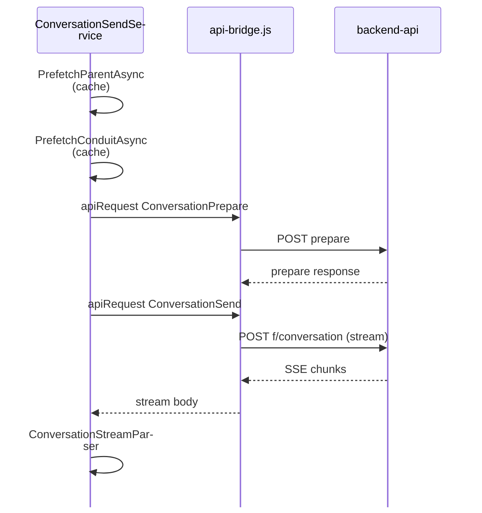

# ChatGPT API Integration

ChatGPT Wrapper does **not** use the OpenAI SDK or API keys. It calls ChatGPT's **undocumented web backend** through the injected `chatgpt-api-bridge.js`, reusing the logged-in WebView2 session (cookies + device id).

**Source:** `ChatGPTWrapper/ChatGptApi/ChatGptApiEndpoints.cs`  
**Primary services:** `ChatGptProjectApiService`, `ChatGptConversationSendService`

> **Full endpoint catalog:** [chatgpt-api-endpoints-reference.md](../reference/chatgpt-api-endpoints-reference.md)  
> **Gizmo JSON shapes:** [gizmo-api-response-shapes.md](../reference/gizmo-api-response-shapes.md)  
> **Reference hub:** [api-and-data-models-index.md](../reference/api-and-data-models-index.md)

---

## Auth and session

| Endpoint | Method | Purpose |
|----------|--------|---------|
| `/api/auth/session` | GET | Session check, user id, account id |

**Requirements for API calls:**

1. Valid session cookie (user signed in)
2. Device cookie `oai-did` (SPA must fully initialize)

`ChatGptProjectApiService.GetSessionAsync` → bridge `getSession`  
`AdventureProjectBindingService.EnsureSessionAsync` throws `ChatGptApiException` (401) if not authenticated.

---

## Endpoint reference

Paths may change without notice. Listed as implemented in code.

### Projects (Gizmos / Snorlax)

| Constant | Path | Purpose |
|----------|------|---------|
| `ProjectsSidebar` | `/backend-api/gizmos/snorlax/sidebar` | List projects (sidebar API) |
| `GizmosBootstrap` | `/backend-api/gizmos/bootstrap` | Bootstrap project list |
| `ProjectUpsert` | `/backend-api/gizmos/snorlax/upsert` | Create/update project, attach files |
| `GizmoDetail(id)` | `/backend-api/gizmos/{id}` | Project detail |
| `ProjectDetail(id)` | `/backend-api/projects/{id}` | Project settings (GET / PATCH) — name, instructions, emoji, theme |
| `ProjectConversations(id)` | `/backend-api/gizmos/{id}/conversations` | List conversations |
| `ProjectFiles(id)` | `/backend-api/gizmos/{id}/files` | List files (gizmo path) |
| `ProjectFilesList(id)` | `/backend-api/projects/{id}/files` | List files (project path) |
| `ProjectFilesAttach(id)` | `/backend-api/projects/{id}/files` | Attach files POST |

**Discovery order** (`ProjectDiscoveryService`):

1. Sidebar API  
2. Bootstrap  
3. DOM scrape (`discoverProjectsDom`)

### Files

| Constant | Path | Purpose |
|----------|------|---------|
| `FilesUpload` | `/backend-api/files` | Upload file |
| `FilesLibraryUpload` | `/backend-api/files/library` | Library upload (auto-binds to gizmo) |
| `FilesProcessUploadStream` | `/backend-api/files/process_upload_stream` | Stream processing |
| `FileDownload(id)` | `/backend-api/files/{id}` | Download |
| `ProjectFileDownload(gizmo, id)` | `/backend-api/projects/{gizmo}/files/{id}` | Project-scoped download |
| `GizmoFileDownload(gizmo, id)` | `/backend-api/gizmos/{gizmo}/files/{id}` | Gizmo-scoped download |
| `FileDelete(id)` | DELETE `/backend-api/files/{id}` | Delete file |
| `ProjectFileDelete(gizmo, id)` | DELETE gizmo/project file paths | Delete from project |

`BuildFileDownloadPathCandidates` tries project paths first when `gizmoId` or `location=fs`, then generic file paths.

### Conversations

| Constant | Path | Purpose |
|----------|------|---------|
| `ConversationsCreate` | `/backend-api/conversations` | Legacy create (often **405**) |
| `ConversationInit` | `/backend-api/conversation/init` | Warmup (no conversation id) |
| `ConversationGet(id)` | `/backend-api/conversation/{id}` | Fetch conversation tree |
| `ConversationPrepare` | `/backend-api/f/conversation/prepare` | Prepare send (parent/conduit) |
| `ConversationSend` | `/backend-api/f/conversation` | **Send message (SSE stream)** |
| `ConversationHide(id)` | PATCH `/backend-api/conversation/{id}` | Soft-hide (`is_visible: false`) — ephemeral chat cleanup |
| *(same path)* | PATCH `/backend-api/conversation/{id}` | Rename chat (`title`) — `RenameConversationAsync` |

---

## Conversation lifecycle (PATCH)

The ChatGPT web UI soft-deletes and renames chats via **PATCH** on `/backend-api/conversation/{id}` — not HTTP `DELETE`.

| Operation | Body | Service |
|-----------|------|---------|
| Soft-delete | `{ "is_visible": false }` | `HideConversationAsync`, `DeleteConversationAsync` |
| Rename | `{ "title": "New title" }` | `RenameConversationAsync` |

Both invalidate `ConversationParentCache` / `ConversationConduitCache` on hide only (rename does not today).

Observed rename response: `{ "success": true }`. Hide returns HTTP 200 with no required body shape.

---

## Project settings (UI API)

ChatGPT's project **settings panel** uses a different surface than Snorlax file upsert:

| API | Method | Wrapper methods |
|-----|--------|-----------------|
| `/backend-api/projects/{gizmoId}` | GET | `GetProjectSettingsAsync` → `ProjectSettingsDetail` |
| `/backend-api/projects/{gizmoId}` | PATCH | `UpdateProjectSettingsAsync` |

PATCH fields (observed from browser captures): `name`, `instructions`, optional `emoji`, `theme` (hex color). Display name is **`name`**, not `display.name` in the request body.

**When to use which:**

- **Settings PATCH** — instructions-only or metadata sync (name, emoji, theme) without touching file attachments.
- **Snorlax upsert** (`UpsertProjectAsync`, `AttachProjectFilesViaUpsertAsync`) — create project, attach/detach files, full gizmo payload.

`AutoSyncProjectInstructions` still uses upsert today; switching it to PATCH is optional follow-up when file lists must not be re-sent.

---

## Conversation send pipeline

Used by utility jobs and optionally inline delivery (`ChatGptConversationSendService`).



### Caches

| Cache | Class | Stores |
|-------|-------|--------|
| Parent message id | `ConversationParentCache` | Last node id per conversation |
| Conduit token | `ConversationConduitCache` | JWT conduit for send (expiry-aware) |
| Transcript capture | `ConversationCaptureCache` (Core) | Parsed assistant text |

`PlaySendWarmupService.PrefetchFireAndForget` pre-warms parent/conduit before play sends.

### Stream parsing

`ChatGPTWrapper.Core/ChatGptApi/ConversationStreamParser.cs`:

- Parses SSE `data:` lines from send response
- Extracts assistant message text, message ids, branch info
- `TranscriptTextSanitizer` strips `filecite` and private-use markers

---

## Project file lifecycle

Typical ApiSync push:

1. **Export** local markdown → `ProjectSourceExportService`
2. **Upload** bytes → `UploadProjectFileBytesAsync` / `FilesLibraryUpload`
3. **Attach** → `AttachProjectFilesViaUpsertAsync` (Snorlax upsert) or `attachProjectFile` bridge command
4. **Verify** → `VerifyUploadedProjectFilesDownloadableAsync`, sidebar evaluation
5. **Manifest update** → `SourceManifestEntry` hashes and `remoteFileId`

Pull (remote newer):

1. **List** → `GetProjectFilesAsync`
2. **Download** → `DownloadFileAsync` with path candidates
3. **Write** → `adventures/{id}/sources/{path}`
4. **Reconcile** → `ProjectFileSyncPlanner`

Delete/recover: `DeleteProjectFileAsync`, `DetachProjectFilesViaUpsertAsync`, stale binding clear in planner.

---

## Project conversation creation

`CreateProjectConversationDetailedAsync`:

- May use project page navigation + DOM (`EnsureProjectPageAsync`)
- Or API-only paths depending on options
- Returns `CreateProjectConversationResult` with conversation id and diagnostics

Play binding stores `LinkedConversationId` on `AdventureMetadata`.

---

## Probing and diagnostics

| Component | Output |
|-----------|--------|
| `ChatGptApiDiscovery` | `api-client-profile.json`, capability flags |
| `ProbeSidebarAsync` | Sidebar probe result, `last-sidebar-probe.json` |
| `ProjectLinkDiagnostics` | `link-project.log` |
| `ProjectSyncTrace` | `sync-trace.jsonl` |
| `ChatGptApiSendSampleCapture` | `api-send-samples/` sanitized request/response |

Live diagnostic checklist (15 steps): see [Testing](testing.md#live-diagnostics).

---

## Error handling

`ChatGptApiException`:

```csharp
public sealed class ChatGptApiException : Exception
{
    public string? Endpoint { get; }
    public int? StatusCode { get; }
    public string? RawBody { get; }
}
```

Common cases:

| Status | Meaning | User action |
|--------|---------|-------------|
| 401 | Session expired | Sign in again |
| 403 | Account/tier restriction | Check ChatGPT subscription |
| 404 | File/conversation missing | Re-sync or clear stale binding |
| 405 | Wrong method/path | Endpoint drift — check diagnostics |

Bridge returns `{ type: "apiError", ok: false, error: "..." }` without throwing.

---

## URL helpers

`ChatGptUrls` (`ChatGPTWrapper/ChatGptUrls.cs`):

- `TryParseConversationId(url)` — extract `c-{uuid}`
- `TryParseGizmoId(url)` — extract project id
- `PathLooksLikeProjectRoute(path)`
- `IsTrustedChatGptTopLevelUri(uri)` — injection gate
- `NormalizeGizmoId(id)`

---

## Sample capture (developers)

`ChatGptApiSendSampleCapture` writes sanitized send samples to:

```
%LocalAppData%\ChatGPTWrapper\api-send-samples\
```

Used by `ChatGptApiSendSampleCaptureTests` for regression without live calls.

---

## Related documentation

- [WebView Bridges](webview-bridges.md) — `apiRequest` command
- [Services Reference — ChatGptApi](../reference/services-reference.md#chatgpt-api-services)
- [User Projects & Sync](../user/user-projects-and-sync.md)
- [Troubleshooting](../user/troubleshooting.md)
