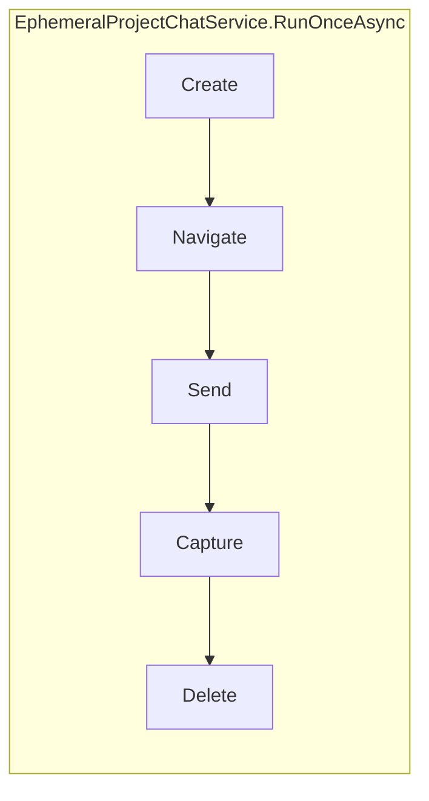

# Ephemeral Project Chat

One-shot linked-project chat: **create → send → capture → delete** without binding a conversation to play thread, utility worker, design session, or adventure metadata.

**Sources:** `EphemeralProjectChatService.cs`, `EphemeralProjectChatModels.cs`, `MainWindow.EphemeralChat.cs`  
**Related:** [chatgpt-api-integration.md](chatgpt-api-integration.md) · [utility-job-orchestration.md](utility-job-orchestration.md) · [webview-bridges.md](webview-bridges.md) · [testing.md](testing.md)

---

## Overview

| Property | Value |
|----------|--------|
| **Purpose** | Isolated ChatGPT Project message round-trip for diagnostics, probes, or future features |
| **Binding** | None — no thread registry, no `LinkedConversationId`, no utility session |
| **Delete semantics** | Soft-hide via `PATCH /backend-api/conversation/{id}` with `{ is_visible: false }` |
| **Typical latency** | ~20–40s live (model time dominates); warm project WebView avoids multi-minute setup |

This workflow is **intentionally separate** from generation jobs when used via `MainWindow.RunEphemeralProjectChatAsync`. The optional adventure setting **`UseEphemeralUtilityWorkerChat`** (Play settings → AI Tools → Delivery & visibility) reuses the same service for utility worker setup and per-job sends — see [Utility worker ephemeral mode](#utility-worker-ephemeral-mode-cmd-412) below.



`ProvisionComposerAsync` runs **Create** (+ **Navigate** when needed) only — used by utility worker setup when `UseEphemeralUtilityWorkerChat` is enabled. Does not send, capture, or delete.

---

## Phases

### 1. Create

Order of attempts (unless `ComposerAlreadyOpen` or `UiCreateOnly`):

1. `POST /backend-api/conversation/init` — session warmup; may return a server conversation id
2. `POST /backend-api/conversations` — legacy create when not skipped (real server id → fast API send path)
3. `TryUiCreate` delegate — click **New chat in …** via `adventure-bridge.js` (`startProjectChat`)
4. Composer-ready fallback — project home with native composer but no `/c/{id}` URL yet (`DomComposerReady`)

**Not used for ephemeral:** client-bootstrapped GUID ids (`SkipClientBootstrap = true`) — API send returns `http_403` on unregistered ids.

| Flag | Effect |
|------|--------|
| `ComposerAlreadyOpen` | Skip create; require `TurnService`; treat page as `DomComposerReady` |
| `UiCreateOnly` | Skip init/legacy API; UI create only |
| `TryUiCreate` | Fallback UI hook when API paths fail |
| `WarmSession` | Skip `PrepareForApiAsync` when WebView is already signed in on project page |

### 2. Navigate

- **Server id from API create** → `EnsureOnProjectConversationStrictAsync` when needed
- **`DomComposerReady` / `InitRegistered`** → stay on project home (`/g/{gizmo}/project`); no forced `/c/` navigation before first send

Project-home chats often have **no conversation URL until the first message** is sent.

### 3. Send

| Path | When | Transport |
|------|------|-----------|
| **API + SSE** | Real server conversation id from create | `ChatGptConversationSendService.SendUserMessageAsync` |
| **DOM** | `DomComposerReady`, `InitRegistered`, or API fallback after `http_403` | `AdventureTurnService.SubmitUtilityJobAsync` → `sendPrompt` → `turnComplete` |

DOM send from project home provisions a conversation id on first send (URL updates after submit). Utility-job heuristics (`conversation_mismatch`, `capture_premature` for short replies) are normalized for ephemeral via `NormalizeEphemeralDomSendResult`.

### 4. Capture

1. Inline from send result (SSE or DOM `turnComplete`) when settled
2. Otherwise `CaptureAssistantViaApiAsync` with configurable retries (`CaptureMaxAttempts`, default 6 × 1s)

### 5. Delete

`HideConversationAsync` — best-effort soft-hide.  
`DeleteInBackground` (default `true`) returns success before hide completes; set `false` when callers must verify hide (live tests).

---

## Request and result types

### `EphemeralProjectChatRequest`

| Field | Default | Notes |
|-------|---------|-------|
| `Core`, `GizmoId`, `MessageText` | required | |
| `TurnService` | null | Required for DOM send / `ComposerAlreadyOpen` |
| `TryUiCreate` | null | UI fallback after API create |
| `UiCreateOnly` | false | Production entry uses API-first (`MainWindow`) |
| `ComposerAlreadyOpen` | false | Caller verified project-home composer |
| `DeleteAfterCapture` | true | |
| `DeleteInBackground` | true | |
| `WarmSession` | false | Set true when WebView already on project |
| `SendTimeoutMs` | null | DOM cap; short messages default 90s |
| `MaxComposerWaitSeconds` | null | 8s when `ComposerAlreadyOpen` |
| `CaptureMaxAttempts` | 6 | |
| `CapturePollDelay` | 1s | |

### `EphemeralProjectChatResult`

| Field | Meaning |
|-------|---------|
| `Success` | Send + non-empty capture succeeded |
| `ResponseText` | Assistant text |
| `ConversationId` | Effective id (may appear only after DOM first send) |
| `FailedPhase` | `Create` · `Navigate` · `Send` · `Capture` · `Delete` |
| `Deleted` / `DeleteError` | Hide outcome (`Deleted` false when `DeleteInBackground`) |

---

## In-app entry point

`MainWindow.RunEphemeralProjectChatAsync(messageText, webView?, useUiCreate: true)`:

- Requires active adventure with linked Project (`GizmoId`)
- Uses project API WebView or active tab
- **API-first create** (`UiCreateOnly = false`); UI create as fallback when `useUiCreate`
- `WarmSession = true`

No dedicated UI button yet — callable from diagnostics or shell code.

---

## Bridge behavior (`adventure-bridge.js`)

`tryStartProjectChat`:

1. On project home, if composer already present → success without clicking **New chat**
2. Prefer **New chat in …** / **+ New chat** outside the global sidebar
3. Skip sidebar **New chat** on project pages (avoids homepage redirect)
4. Accept composer-ready on project home without `/c/{id}` URL

---

## API additions

| Endpoint | Method | Service method |
|----------|--------|----------------|
| `/backend-api/conversation/{id}` | PATCH `{ is_visible: false }` | `HideConversationAsync` |

Defined in `ChatGptApiEndpoints.ConversationHide`.

---

## Testing

### Unit

```powershell
dotnet test tests/ChatGPTWrapper.ApiDiagnostics --filter "FullyQualifiedName~EphemeralProjectChatServiceTests"
```

Covers create acceptance rules, DOM send routing, hide body, ephemeral DOM normalization.

### Live

Requires signed-in WebView fixture profile:

```powershell
$env:CGW_RUN_LIVE_API_TESTS = "1"
$env:CGW_EPHEMERAL_GIZMO_ID = "g-p-your-project-id"
dotnet test tests/ChatGPTWrapper.ApiDiagnostics --filter "LiveEphemeralProjectChatTests"
```

`LiveEphemeralProjectChatTests.Run_once_create_send_capture_delete` — full cycle with `DeleteInBackground = false` to assert hide.

See [testing.md — Live tier](testing.md#live-tier).

---

## Performance notes

Production should use a **warm** project WebView (signed in, bridge injected, on project landing):

| Anti-pattern | Cost |
|--------------|------|
| Skipping API create when UI fallback is enabled | Forces slow DOM-only path |
| `PrepareForApiAsync` on every call | Extra session fetch + navigation |
| 45s composer polling when composer already verified | Use `ComposerAlreadyOpen` + `MaxComposerWaitSeconds` |
| 15×2s capture retries | Defaults tightened to 6×1s for ephemeral |
| Synchronous delete | Use `DeleteInBackground` unless verification required |

Observed live pass after optimization: **~35s** end-to-end (create/send/capture/delete).

---

## Troubleshooting

| Symptom | Likely cause |
|---------|----------------|
| `play_provision_no_conversation` | API create failed; no UI fallback or composer not ready |
| `project_new_chat_not_found` | UI label changed; composer may still be usable on project home — bridge skips click when composer exists |
| `http_403` on send | Client-bootstrapped id; use API create or DOM from project home |
| `conversation_mismatch` / `capture_premature` | First send from project home + short reply — handled by ephemeral normalization |
| `http_404` on delete | Hide attempted before real server id existed |
| `utility_page_not_ready` | Navigated away from project or conversation URL before composer ready |
| Multi-minute runs | Cold fixture setup, DOM timeout, or stuck `turnComplete` — check WebView window |

---

## Non-goals

- Binding ephemeral conversations to play/design/utility thread registry
- Review queue or proposal parsing
- Hard delete of ChatGPT conversations (only `is_visible: false`)
- Running without a linked ChatGPT Project

---

## Utility worker ephemeral mode (CMD-412 / CMD-424)

Per-adventure setting **`UseEphemeralUtilityWorkerChat`** (default **off**). When enabled:

| Phase | Behavior |
|-------|----------|
| **Worker setup** | `ProvisionComposerAsync` (create + navigate only) instead of legacy `CreateProjectConversationDetailedAsync`. Pin + capability probe unchanged afterward. |
| **Per-job sends** | `UtilityEphemeralJobRunner` calls `RunOnceAsync` (create → send → capture → hide) per outbox job. No pinned push/pull. |
| **Enqueue gate** | Requires linked Project + utility WebView tab; **does not** require green pinned worker. |
| **Packet-embed attachments** | `UtilityEphemeralAttachmentSendService` routes embeddable refs through ephemeral text send (no pinned worker). |
| **DOM attachments** | Shadow compositor (`BeginDomAttachmentSend`) + `SendEphemeralPacketWithAttachmentsAsync`; attach-worker fallback (`ephemeral_attach_fallback_attach_worker`); pinned worker last (`ephemeral_attach_fallback`). |
| **Force DOM attach (QA)** | Setting **`ForceUtilityWorkerDomAttach`** routes all staged reference files through composer chips even when embeddable (JSON/text). Logs `ephemeral_attach_force_dom_lane`. Requires ephemeral mode. |
| **Provision-then-attach** | When project home has no submit button (`submitFound=false`), `EphemeralDomAttachSupport` seeds a conversation (minimal DOM send) and navigates to `/c/{id}` before DOM attach. |
| **Fallback chain** | Ephemeral DOM attach → attach-worker → pinned `send_dom_attach` (chips) → legacy embed push. |

When disabled, all utility worker behavior matches the legacy pinned lane.

**UI:** Play settings → **AI Tools** → **Delivery & visibility** — “Use ephemeral project chats for utility worker (experimental)” and “Force DOM composer attach for reference files (testing)”.

**Policy:** `UtilityEphemeralWorkerPolicy` — `IsWorkerLaneAvailable` (linked project when ephemeral ON; green caps when OFF), `RequiresWorkerPin` (false when ephemeral ON).

**Per-job runner (`UtilityEphemeralJobRunner`):** lane-aware attachment routing via `UtilityAttachmentDeliveryClassifier`; `EphemeralUtilityRunOptions` for DOM attach; mixed-lane embed-only retry on DOM failure. On create/attach failure with a pinned production-ready worker, logs `ephemeral_create_fallback` / `ephemeral_attach_fallback` and reuses legacy push/pull.

**Dual-run:** ChatGPT leg uses ephemeral runner when setting ON; local inference leg skipped when attachments staged.

---

## Future work

- Worker rotation hide-old-chat automation
- SessionHost out-of-process worker ([CMD-358](https://linear.app/cmd0112/issue/CMD-358) family)

Implemented: [CMD-412](https://linear.app/cmd0112/issue/CMD-412), [CMD-424](https://linear.app/cmd0112/issue/CMD-424) — utility worker ephemeral + attachment delivery.
