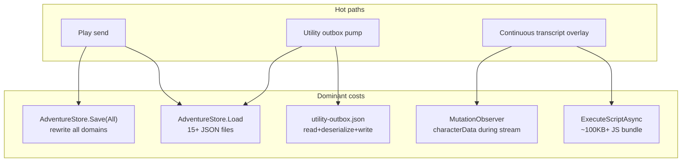
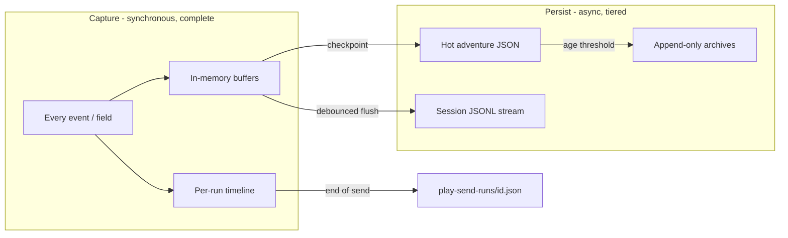

# Performance Audit

End-to-end performance review of the ChatGPT Wrapper solution (`ChatGPTWrapper`, `ChatGPTWrapper.Core`, tests, `ChatGPT_files` → `wrapper-assets`). Conducted 2026-06-29.

The app is a **WPF + WebView2 shell** with **no HTTP server** and **JSON-on-disk persistence**. Performance is dominated by **disk I/O on adventure hot paths**, **WebView script injection and DOM work**, and **unbounded document growth** — not by missing async patterns or heavy NuGet dependencies.

---

## Executive summary

| Area | Health | Primary bottleneck |
|------|--------|-------------------|
| C# adventure layer | Needs work | Full `Load` / `Save` on every play send and utility pump |
| Utility jobs | Needs work | Whole-file outbox read/write per operation |
| WebView / JS overlay | Needs work | Full bundle re-execution on navigation; broad `MutationObserver`s during streaming |
| Startup | Acceptable | WebView2 environment + first injection (unavoidable baseline) |
| Build / tests | Moderate | Full WPF compile for tests; serial test collections |
| Concurrency | Good | No sync-over-async in production; sensible semaphores |

**Estimated impact if top P0 items are fixed:** play-send latency and disk wear could drop **50–80%** on long adventures; overlay UI during streaming could feel noticeably smoother; utility job throughput would scale better with queue depth.

---

## Architecture: where time goes

---

## P0 — Critical (highest ROI)

### 1. Full adventure save on every play send

`PlaySendOrchestrator` calls `AdventureStore.Save(bundle)` with no scope, which defaults to **`AdventureSaveScope.All`**.

Each save also re-reads disk for merge/preserve (`PreserveThreadRegistryFromDisk`, `PreserveUtilityWorkerBindingFromDisk`, review queues, etc.) — extra `File.ReadAllText` + deserialize per domain.

**Recommendation:** Introduce a `PlaySendPersist` scope (`Metadata | Log | State | PromptHistory`) and use it after successful sends. Skip `Preserve*` when the in-memory bundle is authoritative for that session. Defer non-critical domains to the existing 300ms debounced saver where consistency allows.

**Logging impact:** None — same documents, same content; only fewer files rewritten per operation.

---

### 2. Full adventure load on send and utility paths

`AdventureStore.Load` reads **15+ JSON files**, runs migrations, source bootstrap, and may persist before returning. `PlaySendOrchestrator` and `MainWindow.PlayTab.cs` call `Load` repeatedly; the utility coordinator reloads the bundle multiple times per pump cycle.

**Recommendation:** Hold an **in-memory session bundle** per active adventure. Use `ReloadInto` for scoped refresh. Split lightweight reads (metadata + state for preflight) from full bundle load.

**Logging impact:** None — same data in memory; disk still gets full saves when appropriate.

---

### 3. Utility outbox: whole-file I/O per operation

Every enqueue, update, peek, and `PendingCount` does sync read → deserialize → (mutate) → write. The outbox pump loop calls `PendingCount` each iteration — another full disk round-trip per job.

**Recommendation:** In-memory outbox per adventure with debounced persist, or append-only journal + index. Track pending count in the coordinator; read the file once per pump batch.

**Logging impact:** None — same queue entries; flush to `utility-outbox.json` on debounce or checkpoint.

---

### 4. Full continuous-view bundle re-executed on navigation

On every successful navigation, `ChatGptPageHost` resets kernel state and re-applies all features (`_kernelInjected = false` → `ApplyAllAsync`). `ChatGptContinuousViewInjection.ApplyNowAsync` always runs the full cached payload (~marked + purify + format + phrase highlights + packet display + ~4.7k-line `continuous-transcript-view.js`). JS boot guards skip re-init, but the browser still **parses and executes** the entire string.

**Recommendation:** On navigation when `__cgwContinuousViewBooted`, call only `BuildNavigateScript()` (already used for `HistoryChanged`). Move bootstrap to `AddScriptToExecuteOnDocumentCreatedAsync`. Inject preference patches as small `ExecuteScriptAsync` calls.

**Logging impact:** None — UI performance only.

---

### 5. Always-on play-send disk logging

Every play send writes to `play-send-trace.jsonl` and a per-run summary JSON (indented) — even without `--extended-diagnostics`.

**Recommendation (performance):** Buffer timeline in memory; flush JSONL async or at run end. See [Observability and logging](#observability-and-logging) for how to do this without losing data.

**Logging impact:** Depends on implementation — see observability section.

---

## P1 — High impact

### 6. Unbounded document growth

| Document | File | Effect |
|----------|------|--------|
| Turn log | `log.json` | Full reload on every send |
| Flight / prompt history | `prompt-history.json` | Stores full `PacketText` per entry |
| Thread rolling log | `rolling.jsonl` | Full file read on sync |
| Play-send traces | `play-send-runs/` | One JSON file per send |

**Recommendation:** Tiered storage (hot / warm / cold) rather than deletion. See [Observability and logging](#observability-and-logging).

---

### 7. JSON serialize→deserialize as deep clone

`CloneJson` in `AdventureStore` is used 14× in `ReloadInto`. Also used in `InjectionSettingsStaging`, `NarratorSettingsSession`, import services.

**Recommendation:** Source-generated copies, manual field copy for hot types, or `Utf8JsonWriter` pipe without intermediate string.

**Logging impact:** None — internal copy mechanism only.

---

### 8. `WriteIndented = true` for all adventure persistence

`AdventureJson.Options` uses `WriteIndented = true`, increasing file size and serialization CPU across every adventure document.

**Recommendation:** `WriteIndented = false` for runtime saves; indent only for export/debug.

**Logging impact:** None — same fields, smaller/faster files.

---

### 9. Transcript overlay: observer + decoration cost during streaming

In `continuous-transcript-view.js`:

- `MutationObserver` on scroll host with `subtree: true` + **`characterData`** — fires on every streaming token
- Phrase highlights: strip + TreeWalker + span split per segment
- Reading guides: `Range.getClientRects()` per text node (layout thrashing)
- `marked.parse` + `DOMPurify.sanitize` on plain-text fallback paths

**Recommendation:**

- Narrow observer scope; drop `characterData` during streaming (use rAF coalescing path only)
- Disable reading guides and phrase highlights while `data-cgw-streaming`
- Memoize markdown output by content hash
- Fix teardown gaps: context-menu listeners, `composerResizeObserver`, packet `mainObserver`

**Logging impact:** None.

---

### 10. Double JSON parse on API bridge messages

`OnWebMessageReceived` parses JSON; `ApiBridgeMessage` constructor parses again.

**Recommendation:** Pass `JsonElement` or shared `JsonDocument` into message wrapper; parse once.

---

### 11. Settings fingerprint recomputed on stale checks

`PreparedSendSettingsFingerprint.Compute` runs 3× `JsonSerializer.Serialize` + hash on each `IsStale` / `CanSend` access.

**Recommendation:** Cache fingerprint on bundle/settings mutation; store hash on artifact at build time.

---

### 12. Multi-tab preference fan-out

`ChromePreferencesApplier.ApplyToTrustedTabs` fires `ExecuteScriptAsync` to every trusted tab synchronously.

**Recommendation:** Active tab first; defer background tabs. Prefer `PostWebMessageAsJson` for small preference updates.

---

## P2 — Medium impact

| # | Item | Recommendation |
|---|------|----------------|
| 13 | `new HttpClient()` per local inference job | Shared static `HttpClient` with tuned `SocketsHttpHandler` |
| 14 | Utility job result store index | In-memory index cache; batch updates |
| 15 | Packet build allocations | Cache `SectionAliasIndex`; index-based budget loop; `StringBuilder` for large packets |
| 16 | Blocking `Dispatcher.Invoke` on utility worker hosting | `InvokeAsync` where Chromium visibility does not require synchronous layout; throttle progress (~100ms) |
| 17 | Eager `CanonSchemaLoader.Initialize()` on startup | Defer until first adventure/canon UI access |
| 18 | Adventure nav watchdog (30s timer) | Back off when idle; pause during active send |
| 19 | `UtilityAttachWorkerHost` cold path | Metric when second WebView spins up; treat as expensive cold-start budget |

---

## P3 — Lower impact / hygiene

| Item | Location | Note |
|------|----------|------|
| `async void` navigation handlers | Multiple injection classes | Standard WPF; add reentrancy guards |
| Per-call `new JsonSerializerOptions` | API discovery, project service | Centralize static instances |
| `AdventureStore.ListIndex` | Dashboard | Scans all adventure dirs; cache index file |
| Poll intervals (150–350ms) | `adventure-bridge.js`, `cgw-play-compose.js` | Bounded; replace with observers where safe |
| `backdrop-filter: blur` | `continuous-transcript-view.css` | Expensive compositing |
| Test serial execution | `xunit.runner.json` | Intentional for file-lock safety |
| Full WPF compile for tests | ApiDiagnostics csproj | Split unit-only assembly referencing Core |

---

## Startup and build

| Finding | Severity | Detail |
|---------|----------|--------|
| WebView2 cold start | High | `CoreWebView2Environment.CreateAsync` + first tab + bridge injection dominates perceived startup |
| `CanonSchemaLoader.Initialize()` eager | Medium | Full schema parse every launch; `Catalog` is already lazy-capable |
| `AppDirectories.EnsureCreated()` twice | Low | App startup + browser init |
| 23 wrapper-assets copied per build | Medium | `CopyToOutputDirectory=PreserveNewest` on every build |
| No `Directory.Build.props` | Low | Default SDK Debug/Release only |
| Tests reference full WPF app | High | Every `dotnet test` compiles entire shell; serial collections by design |

**Recommendations:** Defer canon schema; show shell chrome immediately with loading state tied to `BrowserTabsReadyTask`; split unit test assembly; CI: `Category=Unit` on PR, `Live`/`Performance` nightly.

---

## What's already good

- **No production sync-over-async** (`.Result`, `.Wait()`, `.GetAwaiter().GetResult()`)
- **Concurrency gates:** `_playSendGate`, `_generationJobGate`, `_applyGate`, utility coordinator locks
- **JS incremental paths:** segment fingerprint short-circuit, streaming rAF coalescing, turn extract cache (128 entries)
- **C# script caching:** `WrapperAssetCache` stamps, `GetCachedScriptPayload()` for continuous view
- **API bridge:** checks existing bridge before re-inject
- **Lean production deps:** WebView2 only in main app; Core has zero NuGet packages
- **Existing perf harness:** `SourceSyncPerfRunnerBase`, `ContinuousViewDecorationBenchmarkTests`, `LocalInferenceLab` CLI

---

## Prioritized roadmap

| Phase | Work | Expected gain |
|-------|------|---------------|
| **1** | Scoped save on play send; in-memory adventure session | Large send latency reduction |
| **1** | In-memory utility outbox + single read per pump | Utility throughput at depth |
| **1** | Navigate-only script when CV booted; document-created bootstrap | Faster tab navigation |
| **2** | Tiered retention for log, prompt-history, thread JSONL | Stable performance over long sessions |
| **2** | `WriteIndented = false`; replace `CloneJson` on hot paths | Smaller files, less CPU |
| **2** | Async/buffered trace writes | Less disk I/O every send |
| **3** | Narrow transcript observer; disable decorations during stream | Smoother generation UX |
| **3** | Cache fingerprints, section index, bridge message parse | Marginal but steady wins |
| **3** | Shared HttpClient for local inference | Matters when utility jobs are frequent |
| **4** | Test project split; deferred canon schema; log rotation | Dev/CI feedback + disk hygiene |

---

## Measurement plan

Existing hooks to extend (no BenchmarkDotNet in repo yet):

1. **Startup milestones** — app start → WebView env → first inject → chatgpt.com loaded (`DiagnosticsChannel.Program`)
2. **Play send** — `PlaySendTrace` timeline; add phase timings for `Load`, `PrepareSend`, `Save`, bridge round-trip
3. **JS** — `__cgwBenchmarkDecorateTurnBlocks` in `ContinuousViewDecorationBenchmarkTests` (< 200ms for 50 blocks)
4. **Source sync** — `SourceSyncPerfReport` step timings
5. **Production profiling** — `dotnet-trace` around `CoreWebView2Environment.CreateAsync` and first `InjectAsync`

**Suggested acceptance targets after Phase 1:**

- Play send persist: **< 50ms** on typical adventure (vs full multi-file rewrite today)
- Navigation re-inject: **< 5ms** script execution (navigate-only) vs full bundle parse
- Utility pump: **1 disk read** per batch, not per job

---

## Observability and logging

Performance work must not reduce diagnostic depth or breadth. **When and how** data is persisted is flexible; **what is captured** at event time should remain complete.

### How logging is layered today

| Layer | What it stores | Where |
|-------|----------------|-------|
| **Session diagnostics** | Per-event timeline (bridge, compose, API, etc.) | `play-send-trace.jsonl` (Info+, always) + `play-send-runs/{id}.json` per send |
| **Extended diagnostics** | Debug-level + all channels | `wrapper-diagnostics.jsonl` (only with `--extended-diagnostics`) |
| **Adventure canon** | Flight records, turns, utility runs | `prompt-history.json`, `log.json`, utility result files |

`FlightRecordCaptureService` is the rich adventure record — full packet text, injection manifest, delivery snapshot, utility run links (`PacketText`, `Injection`, `Delivery`, `PlaySendTraceRunId`, `UtilityRuns`, etc.).

`DiagnosticsLog` writes unified JSONL only in extended mode; play-send legacy path writes Info+ to `play-send-trace.jsonl` synchronously via `AppendLine`.

### Changes that do **not** reduce logged data

| Optimization | Why capture is preserved |
|--------------|--------------------------|
| Scoped `AdventureStore.Save` | Same documents and fields; fewer files per write |
| In-memory adventure session | Session authoritative until flush; full content unchanged |
| In-memory utility outbox | Same entries; debounced full serialize to disk |
| Async/buffered trace writes | Same JSONL lines and run summaries; deferred I/O |
| `WriteIndented = false` | Formatting only |
| Replace `CloneJson` | Internal copy mechanism |
| Navigate-only CV inject | No logging impact |
| Observer / decoration tuning | UI only |
| Shared `HttpClient` | No logging impact |
| Tail-read `rolling.jsonl` | Read-path optimization; append-only writes unchanged |

### Changes that **could** reduce data — and full-fidelity alternatives

#### Gating play-send JSONL behind extended diagnostics

**Risk if naive:** Info+ events no longer land in `play-send-trace.jsonl` by default.

**Full-fidelity alternative:**

- Keep **100% of events in memory** for the active run (`PlaySendRun.Timeline`).
- Always write the **per-run summary** (`play-send-runs/{id}.json`) — complete timeline for that send.
- Make `play-send-trace.jsonl` an async-flushed session stream, or merge run summaries at session end.
- Never drop the per-run file in favor of sampling.

#### Retention caps on `prompt-history.json` / `log.json`

**Risk if naive:** Old flight records or turns deleted from the live bundle.

**Full-fidelity alternative — tiered storage:**

| Tier | Contents | Purpose |
|------|----------|---------|
| **Hot** (`prompt-history.json`) | Last N entries with full `PacketText` | Fast Flight Recorder UI |
| **Warm** (`prompt-history-archive/{yyyy-MM}/entries.jsonl`) | Append-only full entries | Complete history, cheap writes |
| **Cold** | Export zip on demand | Long-term archive |

Use `PlaySendTraceRunId` and turn ids for cross-tier lookup instead of duplicating packet text in every tier.

#### Packet hash + preview instead of full `PacketText` in history

**Risk:** Flight Recorder cannot show full packet for old sends.

**Full-fidelity alternative:**

- Full text remains in **`log.json` turn** and/or **`play-send-runs/{runId}.json`**.
- If deduping in `prompt-history`, add **`PacketTextRef`** (turn id, trace run id, or file path) — dedup is storage optimization, not deletion.

#### Tail-read thread `rolling.jsonl`

**Risk if naive:** Only last N lines kept on disk.

**Full-fidelity alternative:** Read tail for hot paths; append never truncates; rotation moves to `rolling-archive-{date}.jsonl`.

#### Utility job index cap (already exists)

`UtilityJobResultStore` drops old run **IDs from the index** after 50 per job. Per-run JSON files (`{runId}.json`) are not deleted — only index discoverability for very old runs is limited.

### Recommended capture policy (max perf, zero capture loss)

**Concrete policy:**

1. **Capture phase (sync):** Build full artifact, full flight record, full in-memory timeline — unchanged.
2. **Hot persist (sync or fast debounce):** Scoped save of domains that changed (`Log`, `PromptHistory`, `State`, `Metadata`).
3. **Trace persist (async):** Buffer JSONL lines; flush on interval, on run end, or on process exit.
4. **Cold persist (background):** Archive old prompt-history / log slices to append-only files; hot file stays small.

### Audit items vs observability constraint

| Audit item | Reduces logged data? | Recommended approach |
|------------|---------------------|----------------------|
| Scoped save on play send | **No** | Same `PromptHistory` + `Log` content |
| In-memory session | **No** | Session authoritative until flush |
| In-memory outbox | **No** | Debounced full serialize |
| Gate play-send JSONL | **Only if you stop writing some events** | Buffer all; async flush; keep per-run summary always |
| Cap prompt-history | **Only if you delete** | Archive tier + refs |
| Packet hash only in history | **Only if no ref** | Ref to turn/trace file |
| Tail-read JSONL | **No** (read path only) | Append-only write path |
| `WriteIndented = false` | **No** | Formatting only |

### What to avoid

- Sampling or skipping successful send traces in production.
- Truncating `FlightRecordCaptureService` fields for performance.
- Relying on `--extended-diagnostics` as the only full capture path (debug events are gated; **Info+ play-send is the production baseline**).

### What to do first (aligned with capture-everything)

1. **Scoped save** after play send — flight record and log still written in full.
2. **In-memory `PlaySendRun` timeline + async JSONL flush** — every event retained; disk writes deferred.
3. **Append-only `prompt-history-archive.jsonl`** — hot `prompt-history.json` bounded for UI without losing history.
4. **Checkpoint outbox** on debounce — same entries, fewer full rewrites.

---

## Risk notes

- **Scoped saves** need consistency review (which `Preserve*` calls are still required when bundle is session-authoritative).
- **In-memory outbox** needs crash-recovery story (flush on app exit / debounce with fsync policy).
- **Observer narrowing** must not miss turn additions outside the narrowed subtree.
- **Retention tiers** affect Flight Recorder load paths — use refs and archives, not deletion.

---

## Related documentation

- [Architecture](architecture.md) — solution structure, hot paths, concurrency
- [Narrative Flight Recorder ADR](../adr/narrative-flight-recorder-adr.md) — flight record canon
- [Play Send Orchestration ADR](../adr/play-send-orchestration-adr.md) — send pipeline invariants
- [Testing](testing.md) — perf test tiers and fixtures
- [Injected Assets](injected-assets.md) — `ChatGPT_files/` reference
- [Troubleshooting](../user/troubleshooting.md) — diagnostics flags, flight record inspection

---

*Audit conducted 2026-06-29. Revisit after Phase 1 implementation or major changes to persistence, overlay, or diagnostics layers.*
