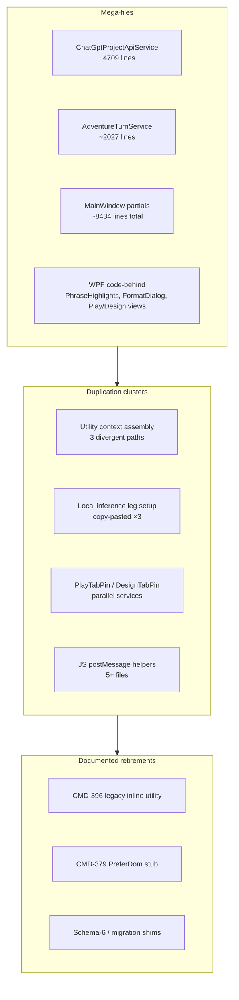
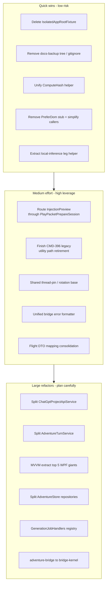

# Refactor & Code-Trim Audit

End-to-end review of refactor and code-trimming opportunities across the ChatGPT Wrapper solution (`ChatGPTWrapper`, `ChatGPTWrapper.Core`, `ChatGPTWrapper.SessionHost`, `ChatGPTWrapper.LocalInferenceLab`, tests, `ChatGPT_files` → `wrapper-assets`). Conducted 2026-06-30.

**Scope:** Document potential only — no code changes were applied as part of this audit.

The codebase is **feature-rich and actively evolving**, with recent work concentrated in utility jobs, local inference, flight recording, and play-send orchestration. The main pressure is not scattered unused code but **concentration and duplication**: a handful of multi-thousand-line files, ~313 adventure service classes, parallel Play/Design implementations, and documented but incomplete legacy retirements.

---

## Executive summary

| Signal | Scale |
|--------|-------|
| Adventure service files | **~313** `.cs` files under `ChatGPTWrapper/Adventure/Services/` |
| `MainWindow` partials | **28 files, ~8,434 lines** |
| Files ≥ 500 lines (app + tests) | **~45** |
| Test files (ApiDiagnostics) | **~299** |
| ViewModels in app | **3** — UI is overwhelmingly code-behind |
| JS injected assets | **~15k lines** (largest: `continuous-transcript-view.js` at ~4,290) |

| Area | Health | Primary issue |
|------|--------|---------------|
| Mega-services | Needs work | `ChatGptProjectApiService` (~4,709 lines), `AdventureTurnService` (~2,027 lines) |
| WPF UI layer | Needs work | Code-behind giants (2k+ lines); almost no MVVM |
| Utility pipeline | Needs work | Three divergent context-assembly paths; duplicated local-inference leg setup |
| Adventure services | Moderate | Parallel Play/Design pairs; policy/preview/builder sprawl |
| Core library | Good | Largest file ~592 lines (`ConversationStreamParser.cs`) |
| JS assets | Moderate | Bridge-kernel migration incomplete; packet display dual-maintained with C# |
| Dead code | Low volume | Obsolete fixtures, retired stubs, unwired SessionHost RPC types |
| Workspace hygiene | Minor | Local `bin/`/`obj/`/`.build-out/` noise; `docs-backup-*` tree untracked |

**Highest-value targets:** Split mega-services, consolidate utility-worker/local-inference boilerplate, finish documented legacy retirements ([CMD-396](https://linear.app/cmd0112/issue/CMD-396) utility context, [CMD-379](https://linear.app/cmd0112/issue/CMD-379) DOM play send), extract WPF view logic from code-behind.

**Low-risk immediate trims:** Obsolete test fixture, docs backup tree, retired API stubs, workspace build artifacts.

---

## Architecture: where complexity concentrates

---

## Tier 1 — Mega-files & god objects

These files mix multiple domains and are the hardest to test, review, and extend.

### 1.1 `ChatGptProjectApiService.cs` (~4,709 lines)

**Path:** `ChatGPTWrapper/ChatGptApi/ChatGptProjectApiService.cs`

Single class owns session/auth, project CRUD, sidebar/bootstrap, sync preflight, conversation lifecycle, file upload/download/attach, source publication, and probes (~40 public `Task` methods).

**Refactor potential:** Split along API domains already hinted at by nested pipelines:

- `ProjectListingService` / bootstrap
- `ProjectConversationService`
- `ProjectFileService`
- `ProjectSyncPreflightService`
- `ProjectSourcePublishService` (partially started via `ProjectSource/`)

**Impact:** High · **Risk:** Medium (wide call surface, many tests touch this)

### 1.2 `MainWindow` partials (~8,434 lines across 28 files)

**Path:** `ChatGPTWrapper/MainWindow*.cs`

Already split by concern (`Adventures`, `PlayTab`, `GenerationJobs`, `UtilityWorker`, etc.) but still the central orchestrator for adventures, play, design, utility worker, generation jobs, theme, and project API. See [architecture.md](architecture.md) partial-class map.

**Refactor potential:**

- Move dialog orchestration into dedicated coordinator services
- Extract WebView lifecycle into host services already partially modeled (`ChatGptPageHost`, `IPlaySendHost`, `IUtilityWorkerHost`)
- Reduce `Func<>` callback wiring from views back into `MainWindow`

**Impact:** High · **Risk:** High (WPF event wiring, regression surface)

### 1.3 `AdventureTurnService.cs` (~2,027 lines, ~43 public members)

**Path:** `ChatGPTWrapper/Adventure/Services/AdventureTurnService.cs`

Mixes bridge health, composer fill, assistant capture, play-turn submit (API + DOM), utility-job submit (API + DOM + attachments), turn counting, project-chat bootstrap.

**Refactor potential:** Natural seams:

- Capture / health probing
- Play-turn submission (API vs DOM lanes)
- Utility-job submission

**Impact:** High · **Risk:** Medium

### 1.4 WPF code-behind giants

Only **3 ViewModels** exist in the whole app (`SourceSyncRowViewModel`, `SourcePublishRowViewModel`, `AiToolActionRowViewModel`). The rest is classic WPF code-behind with injected delegates.

| File | Lines | Issue |
|------|------:|-------|
| `PhraseHighlightsEditorControl.xaml.cs` | ~2,605 | UI construction + rule model + color engine + persistence |
| `ContinuousViewFormatDialog.xaml.cs` | ~2,423 | Dynamic panels + live preview + profile CRUD |
| `PlayPromptInjectionDialog.xaml.cs` | ~2,163 | Settings + preview + source publishing + drag-drop |
| `AdventureDesignView.xaml.cs` | ~1,849 | Design pipeline + canon sync + entity reference |
| `AdventurePlayView.xaml.cs` | ~1,607 | Layout + thread UI + composer + hooks (~65 public members) |
| `ThemeCustomizationDialog.xaml.cs` | ~1,014 | Theme token editing + preview + persistence |
| `AdventureThreadManagerDialog.xaml.cs` | ~943 | Thread list UI + rotation/copy/merge operations |
| `AdventureDashboardView.xaml.cs` | ~835 | Adventure list UI + import/archive/delete orchestration |
| `ProjectWorkspaceDialog.xaml.cs` | ~745 | Project linking UI + API sync workflows |

**Refactor potential:** MVVM extraction, user-control decomposition, shared “adventure session chrome” between Play and Design (see [play-design-surface-convergence ADR](../adr/play-design-surface-convergence-adr.md)).

**Impact:** High (maintainability) · **Risk:** High (UI regressions)

### 1.5 Adventure domain services (500–1,500 lines)

| File | Lines | Mixed concerns |
|------|------:|----------------|
| `SourceJsonImportService.cs` | ~1,523 | Prompt + parse + validate + dry-run + diff + apply |
| `GenerationJobService.cs` | ~1,256 | Job orchestration + utility capture + apply pipeline |
| `GenerationJobHandlers.cs` | ~1,174 | Per-job prompt/parse/apply switchboard for many job types |
| `UtilityWorkerTransportService.cs` | ~890 | Production/ephemeral/seed sends, attachment lanes, probing |
| `AdventureStore.cs` | ~709 | Load/save for ~15+ document types in one static class |
| `PromptPacketBuilder.cs` | ~610 | DTOs + building/trimming/budget logic |
| `ProposalReviewService.cs` | ~626 | Review DTOs + list/accept/dismiss logic across categories |
| `SectionedImportService.cs` | ~715 | Scenario/lexicon/world/plot/cast import parsers |

**Refactor potential:** Phase-split import (prompt / parse / apply), job handler registry instead of growing switch, repository-per-aggregate for `AdventureStore`.

**Impact:** Medium–High · **Risk:** Medium

### 1.6 Top 20 largest `.cs` files (reference)

| Rank | Lines | Path |
|------|------:|------|
| 1 | ~4,709 | `ChatGPTWrapper/ChatGptApi/ChatGptProjectApiService.cs` |
| 2 | ~2,605 | `ChatGPTWrapper/PhraseHighlightsEditorControl.xaml.cs` |
| 3 | ~2,423 | `ChatGPTWrapper/ContinuousViewFormatDialog.xaml.cs` |
| 4 | ~2,163 | `ChatGPTWrapper/Views/PlayPromptInjectionDialog.xaml.cs` |
| 5 | ~2,027 | `ChatGPTWrapper/Adventure/Services/AdventureTurnService.cs` |
| 6 | ~1,849 | `ChatGPTWrapper/Views/AdventureDesignView.xaml.cs` |
| 7 | ~1,741 | `ChatGPTWrapper/MainWindow.Adventures.cs` |
| 8 | ~1,607 | `ChatGPTWrapper/Views/AdventurePlayView.xaml.cs` |
| 9 | ~1,583 | `tests/ChatGPTWrapper.ApiDiagnostics/Unit/ApiProbeParsingTests.cs` |
| 10 | ~1,523 | `ChatGPTWrapper/Adventure/Services/SourceJsonImportService.cs` |
| 11 | ~1,256 | `ChatGPTWrapper/Adventure/Services/GenerationJobService.cs` |
| 12 | ~1,174 | `ChatGPTWrapper/Adventure/Services/GenerationJobHandlers.cs` |
| 13 | ~1,077 | `ChatGPTWrapper/ChatGptApi/ChatGptConversationSendService.cs` |
| 14 | ~1,014 | `ChatGPTWrapper/Views/ThemeCustomizationDialog.xaml.cs` |
| 15 | ~962 | `ChatGPTWrapper/Theme/ThemePresetLibrary.cs` |
| 16 | ~943 | `ChatGPTWrapper/Views/AdventureThreadManagerDialog.xaml.cs` |
| 17 | ~890 | `ChatGPTWrapper/Adventure/Services/UtilityWorkerTransportService.cs` |
| 18 | ~835 | `ChatGPTWrapper/Views/AdventureDashboardView.xaml.cs` |
| 19 | ~803 | `ChatGPTWrapper/MainWindow.PlayTab.cs` |
| 20 | ~745 | `ChatGPTWrapper/Views/ProjectWorkspaceDialog.xaml.cs` |

`ChatGPTWrapper.Core/` is comparatively small; `ConversationStreamParser.cs` (~592 lines) is the largest Core file.

---

## Tier 2 — Duplication & consolidation

### 2.1 Utility context assembly (documented debt)

[utility-job-context-assembly ADR](../adr/utility-job-context-assembly-adr.md) describes **three divergent paths** for story context:

| Path | Entry | Story block |
|------|-------|-------------|
| Worker lane | `UtilityWorkerOrchestrator` → `UtilityMessagePushService` | `UtilityStoryContextBuilder` |
| Legacy inline | `GenerationJobService.RunInlineJobAsync` | Same builder |
| Injection-first bundled | `PlayUtilityInjectionService` | Flags only — no `StoryContextBlock` |

Follow-up [CMD-396](https://linear.app/cmd0112/issue/CMD-396) calls for retiring legacy inline paths and centralizing on `UtilityJobContextAssembler`.

**Trim potential:**

- Remove `ApplyLegacyStoryFlags` in `GenerationJobService`
- Collapse `UtilityStoryContextProfiles` / `UtilityCanonSliceProfiles` job-id switch tables
- Shrink `UtilityJobContextPreviewService` if preview becomes a thin assembler facade

**Impact:** High (utility quality + code volume) · **Risk:** Medium (behavior-sensitive)

### 2.2 Local inference leg setup (copy-pasted ~30 lines × 3)

Same local-leg block appears in:

1. `UtilityEphemeralJobRunner.cs`
2. `UtilityWorkerJobRunner.RunLegacyProductionEntryAsync`
3. `GenerationJobService.RunDualRunJobAsync`

**Refactor potential:** Converge callers on `LocalUtilityInferenceLegRunner` (partially exists).

**Impact:** Medium · **Risk:** Low

### 2.3 Identical `ComputeHash` implementations

Duplicated in `PromptPacketBuilder.cs` and `UtilityMessagePushService.cs` — same SHA256 → 16 hex chars. `LocalUtilityInferenceService` already calls the utility version.

**Trim potential:** One `PacketHash.Compute(text)` helper in Core or shared Adventure util.

**Impact:** Low · **Risk:** Trivial

### 2.4 Play vs Design parallel services

| Pair | Overlap |
|------|---------|
| `PlayTabPinService` / `DesignTabPinService` | Pin/session/conversation logic via shared `ThreadTabBindingService` but duplicated orchestration (~350+ lines each) |
| `PlayThreadRotationService` / `DesignThreadRotationService` | Archive thread + fresh slot + persist |
| `AdventureDesignChatService` / `AdventureDesignDomChatService` | Duplicate `FormatSendError` / `FormatPinError` switch cases |

**Refactor potential:** `ThreadPinService` base or shared rotation helper; unified bridge error formatter.

**Impact:** Medium · **Risk:** Low–Medium

### 2.5 Preview / builder / mapper sprawl

| Item | Issue |
|------|-------|
| `InjectionPreviewCoordinator` | Still calls `PromptInjectionService.PrepareSend` directly while `PlayPacketPrepareSession` exists to unify preview/copy/send — **drift risk** |
| `PreparedSendArtifactMapper.cs` | 23-line field copy — could inline or merge types |
| `UtilityJobContextPreviewService` | May shrink once assembler is canonical |

**Impact:** Medium (correctness) · **Risk:** Low

### 2.6 Model duplication (runtime vs persistence)

| Runtime | Persistence copy | Overlap |
|---------|------------------|---------|
| `InjectionSection` / `TrimmedSection` | `FlightInjectionSectionRecord` / `FlightTrimmedSectionRecord` | Same fields |
| `ContextPointer` | `FlightContextPointerRecord` | Identity/score/mode |
| `PendingUtilityInjection` | `UtilityOutboxEntry` | RunId, JobId, Channel, turn linkage, entity/card ids |

**Trim potential:** Shared base types or capture-time mapper only in `FlightRecordCaptureService`.

**Impact:** Medium · **Risk:** Low

### 2.7 Policy / injection cluster

Four layers touch play injection policy:

- `PlayInjectionPolicyService`
- `InjectionPolicyGuard`
- `PlayComposeInjectionPolicy`
- Model `PlayInjectionPolicy`

**Refactor potential:** One injection-policy module with lane-specific helpers. See [injection-policy ADR](../adr/injection-policy-adr.md).

**Impact:** Medium · **Risk:** Medium

### 2.8 Project source facades

Thin wrappers proliferate: `ProjectSourceImportService`, `ExportService`, `SyncService`, `UploadService`, `ProbeService`, plus `ProjectFileSyncOrchestrator` / `Planner`. Import/export dispatch tables mirror each other.

**Refactor potential:** Single “project sources” module with import/export symmetry.

**Impact:** Medium · **Risk:** Low

### 2.9 Review queue services

`ProposalReviewService`, `SummaryReviewService`, `PendingReviewService`, `UtilityDualRunReviewService` — aggregation vs category-specific logic could become a registry with plugins.

**Impact:** Medium · **Risk:** Low

### 2.10 Repeated micro-patterns

| Pattern | Locations |
|---------|-----------|
| Thin transcript default = **6** | `InstructionSourcesPolicy`, `PlayInjectionPolicyService` |
| `FormatLaneLabel` | `UtilityContextManifestRecord`, `UtilityAttachmentDeliveryClassifier`, `FlightRecordCorrelationService` |
| Bridge/DOM error switches | `AdventureTurnService`, `AdventureDesignDomChatService`, `UtilityEphemeralJobRunner` |
| `EnsureDefaults` scattered | 15+ call sites — could be one bootstrap on adventure load |
| Injection section → view model | `InjectionSectionManifestBuilder.ToViewModels`, `FlightRecordDetailFormatter.ToSectionRows` |

---

## Tier 3 — Dead code & safe trims

### 3.1 Confirmed dead

| Item | Path | Evidence |
|------|------|----------|
| Obsolete test fixture | `tests/.../IsolatedAppRootFixture.cs` | `[Obsolete("Use FileLockAwareFixture.")]`, zero external references |
| Unused RPC types | `ChatGPTWrapper.Core/SessionHost/SessionHostRpc.cs` | `PlaySendHostRequest` / `PlaySendHostResponse` — no usages outside file |
| Legacy enum alias | `Views/PlaySettingsTab.cs` — `AiActions` | Comment: legacy alias; grep finds 0 references |
| Obsolete enum value | `ProjectSourcePublicationModels.cs` — `SnorlaxDetailUpsertFallback` | `[Obsolete]`; only self-reference |
| Retired API stub | `PlaySendDeliveryPolicy.PreferDom` | [CMD-379](https://linear.app/cmd0112/issue/CMD-379) — always returns `false`; callers still invoke it |

### 3.2 Stub / unwired projects

| Project | Status |
|---------|--------|
| `ChatGPTWrapper.SessionHost` | Prints “Out-of-process WebView host stub”; always `oop_host_not_configured`. In solution but **not used** by main app (`MainWindow.ProjectHost.cs` uses in-process `ChatGptSessionHost`). |
| `ChatGPTWrapper.LocalInferenceLab` | Standalone CLI for QA; in solution, **not referenced** by main exe. Intentional, but shares prompt shapes with prod — drift risk vs `UtilityJobPromptBuilder`. |

**Decision needed:** Implement Phase 8 OOP host or move SessionHost + unused RPC types to a branch/experimental folder.

### 3.3 Workspace clutter

| Item | Status |
|------|--------|
| `.build-out/`, `bin/`, `obj/` | Correctly gitignored (`.build-*/`, `bin/`, `obj/`) but present locally — noisy in search/IDE |
| `docs-backup-20260629-184711/` | **60 duplicate markdown files**, not in `.gitignore` |

**Trim potential:** Delete local build dirs; delete or add `docs-backup-*/` to `.gitignore`.

**Impact:** Low · **Risk:** None

### 3.4 Legacy paths still active (trim only after migration)

These are **not** dead yet — documented shims:

- `PlayUtilityInjectionMode.LegacyInlineSend` / `UtilityRouteLane.PlayLegacyInline`
- Schema-6 legacy pin clearing in `AdventureThreadRegistryService`
- `AdventureThreadKind.Utility` obsolete enum for JSON deserialization
- `ApplyLegacyReferenceFirstDefaults` in utility push (CMD-396 migration incomplete)
- Multiple migration services (`AdventureMetadataMigration`, `PromptHistoryMigration`, etc.)

Retiring these is a **planned trim** once migration checklists complete.

---

## Tier 4 — Architectural structural opportunities

### 4.1 No DI container

Wiring is manual in `MainWindow.*` partials and `App.xaml.cs`. With ~313 service files, dependency graphs are implicit.

**Refactor potential (optional):** Lightweight service registry — only worth it if testability becomes a blocker.

### 4.2 `ChatGPTWrapper.Core` is lean

New shared logic (hash helpers, error maps, branch extraction) belongs here. See [architecture.md](architecture.md).

### 4.3 Packet display dual implementation

`cgw-packet-display.js` (~1,263 lines) mirrors C# logic in `ContextTagFormat.cs`, kept in sync via `Fixtures/packet-display-parity.json` and `PacketDisplayParityTests`.

**Trim potential:** Generate one from the other, or collapse preview to JS-only in WebView.

**Impact:** Medium (maintenance) · **Risk:** Medium (parity tests exist)

### 4.4 Flight recorder split across four static classes

`FlightRecordCaptureService`, `CompareService`, `CorrelationService`, `DetailFormatter` — could be one `FlightRecordService` with nested formatters unless separation aids testing. See [narrative-flight-recorder ADR](../adr/narrative-flight-recorder-adr.md).

### 4.5 Settings god-objects

| Type | Issue |
|------|-------|
| `ContinuousViewFormatSettings` | ~90 public properties — group into sub-settings |
| `ThemePresetLibrary.cs` | ~962 lines of preset builders — could move to JSON/resources |
| `FormatBuiltInPresetCatalog.cs` | ~572 lines — mostly declarative |

### 4.6 Multi-type files

| File | Issue |
|------|-------|
| `PlayHandoffService.cs` | 6 public types + static service in one file |
| `EntityEditMapper.cs` | Model + mapper + enum together |
| `ChatGptConversationSendService.cs` | Service + multiple result record types |
| `GenerationJobHandlers.cs` | Context, result, and handler switchboard together |

---

## Tier 5 — JavaScript asset trimming

Source of truth: `ChatGPT_files/` → copied to `wrapper-assets/` at build. See [injected-assets.md](injected-assets.md).

| File | Lines | Note |
|------|------:|------|
| `continuous-transcript-view.js` | ~4,290 | Monolith; weave registers into its renderer registry |
| `adventure-bridge.js` | ~2,075 | Not on `__cgwBridgeKernel` (unlike `chatgpt-api-bridge.js`) |
| `chatgpt-api-bridge.js` | ~1,860 | Uses bridge kernel |
| `cgw-play-compose.js` | ~1,547 | — |
| `cgw-packet-display.js` | ~1,263 | Dual-maintained with C# |
| `weave-transcript-view.js` | ~556 | Registers into continuous view |

**Consolidation opportunities:**

1. **Migrate `adventure-bridge.js` to `cgw-bridge-kernel.js`** — unify dispatch/post paths; drop duplicate `postMessage` helpers across 5+ files
2. **Extract `cgw-transcript-kernel.js`** — shared DOM/kernel hooks from continuous monolith
3. **Single rich-format API** — weave duplicates plain-text extraction when `__cgwContinuousRichFormat` missing
4. **Composer fallbacks** — adventure-bridge has inline composer fallbacks when `cgw-composer-dom.js` absent

---

## Tier 6 — Test suite hygiene

**~299 test files** — generally healthy, but several categories add noise:

### 6.1 Machine-specific / troubleshooting tests

| File | Issue |
|------|-------|
| `CastImportDiagnosticTests.cs` | Hardcoded path to a specific adventure on `e:\` |
| `KingInRedBootstrapDiagnosticTests.cs` | Requires specific adventure GUID in LocalAppData |
| `KingInRedRepublishTests.cs` | Soft-skips (vacuous pass) when adventure missing |

Per [testing.md](testing.md), troubleshooting tests should be deleted or gated after investigation.

### 6.2 Oversized fixture files

| File | Lines |
|------|------:|
| `ApiProbeParsingTests.cs` | ~1,583 |
| `SourceJsonImportTests.cs` | ~677 |

Could split by probe type or import phase.

### 6.3 Live/Ollama/WebView tests

Gated Live tests are expected — not trim candidates, but document which are required for CI vs manual QA.

---

## Tier 7 — Documented follow-ups already tracked

ADRs and plans that **encode refactor intent** — finishing these is the highest-leverage trim work:

| Source | Trim/refactor theme |
|--------|---------------------|
| [utility-job-context-assembly ADR](../adr/utility-job-context-assembly-adr.md) | Single assembler; retire legacy inline (CMD-396) |
| [play-design-surface-convergence ADR](../adr/play-design-surface-convergence-adr.md) | Shared Play/Design chrome |
| [play-surface-ux-modernization ADR](../adr/play-surface-ux-modernization-adr.md) | Duplicate Review/Settings entry points (CMD-421) |
| [injection-policy ADR](../adr/injection-policy-adr.md) | Policy consolidation |
| [play-send-orchestration ADR](../adr/play-send-orchestration-adr.md) | Send path unification |
| [Enhancements/strategic-value-additions-tracker.md](../Enhancements/strategic-value-additions-tracker.md) | CMD-392–398 utility context — Done but ADR lists follow-up consolidation |

No `TODO`/`FIXME`/`HACK` markers were found in `.cs` or `.js` — debt is carried in ADRs, migration shims, and “legacy/retired” comments instead.

---

## Recommended priority order

| Priority | Action | Est. benefit | Risk |
|----------|--------|--------------|------|
| **P0** | Delete obsolete fixture + docs backup | Workspace + test clarity | None |
| **P0** | `ComputeHash` + local-leg helper extraction | ~50 duplicated lines | Trivial |
| **P1** | Retire `PreferDom` and simplify `PlaySendDeliveryPolicy` | Clearer API surface | Low |
| **P1** | Align preview with `PlayPacketPrepareSession` | Prevents future drift | Low |
| **P2** | CMD-396 utility context consolidation | Hundreds of lines across handlers/push/inline | Medium |
| **P2** | Play/Design pin + rotation shared base | ~400–600 lines | Medium |
| **P3** | Split `ChatGptProjectApiService` | ~4,700 → 5–6 focused classes | Medium |
| **P3** | WPF view-model extraction (Play/Design/PhraseHighlights) | ~8k code-behind → testable layers | High |
| **P4** | SessionHost decision (implement or remove) | Entire stub project | Policy |
| **P4** | JS bridge-kernel migration | ~500–1000 duplicate JS | Medium |

---

## What not to trim (yet)

| Item | Reason |
|------|--------|
| Dual transcript views (`continuous` + `weave`) | User-selectable modes; both loaded intentionally |
| Utility orchestration layers (`Orchestrator`, `Coordinator`, `Router`) | Complementary, not duplicate |
| Migration services | Required until schema migrations complete |
| `LocalInferenceLab` | Intentional QA tool — share prompts with prod rather than delete |
| Bulk of ~299 tests | Legitimate coverage — target machine-specific diagnostics only |

---

## Related documentation

| Document | Relevance |
|----------|-----------|
| [Architecture](architecture.md) | Solution structure, MainWindow partial map |
| [Performance audit](performance-audit.md) | Complementary audit — hot paths and I/O (2026-06-29) |
| [Adventure developer reference](adventure-developer-reference.md) | Turn lifecycle, key services |
| [Utility job orchestration](utility-job-orchestration.md) | Dual-lane pipeline context |
| [Injected assets](injected-assets.md) | JS/CSS asset reference |
| [Testing](testing.md) | Test tiers, fixture patterns |

---

*Audit conducted 2026-06-30. Re-run after major refactors or when closing CMD-396 / play-design convergence work.*
