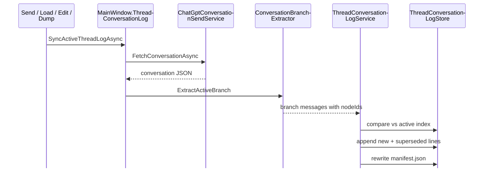

# Thread conversation logging

How the wrapper records ChatGPT thread transcripts locally — storage layout, sync behavior, indexing, and how other subsystems consume the log.

**Normative ADR:** [thread-conversation-log-adr.md](../adr/thread-conversation-log-adr.md)  
**Ingest refactor ADR:** [thread-log-ingest-refactor-adr.md](../adr/thread-log-ingest-refactor-adr.md)  
**Related:** [play-thread-canonical-adr.md](../adr/play-thread-canonical-adr.md), [adventure-thread-registry.md](../reference/adventure-thread-registry.md), [data-model-reference.md](../reference/data-model-reference.md)  
**Explicit snapshots:** [thread-explicit-snapshot-logging.md](../Enhancements/thread-explicit-snapshot-logging.md)

---

## What gets logged where

The wrapper maintains several **distinct** persistence layers. Do not conflate them.

| Layer | Location | Purpose |
|-------|----------|---------|
| **Thread ingest (canonical raw)** | `thread-logs/{threadEntryId}/raw/`, `events.jsonl` | Append-only ingest facts + full API JSON (or synthetic reconstruction) |
| **Thread projections** | `thread-logs/{threadEntryId}/projections/` | Branch JSON when API raw unavailable (DOM / branch-only sync) |
| **Thread conversation log** | `thread-logs/{threadEntryId}/rolling.jsonl` | Branch reconciliation + supersession audit (dual-written during transition) |
| **Thread branch snapshots** | `thread-logs/{threadEntryId}/snapshots/` | Immutable active-branch captures at send/invalidation/load |
| **Flight recorder** | `prompt-history.json` | Per-send merged packet audit + thread ingest correlation (schema v3) |
| **Legacy play cache** | `log.json`, `thread-metadata.json` | Migrated into thread log on load; no longer written on send |
| **Utility diagnostics** | `utility-parse-log.jsonl` | Job parse/apply diagnostics (not a transcript) |
| **Wrapper diagnostics** | `wrapper-diagnostics.jsonl`, `play-send-runs/` | Send orchestration traces |

**Source of truth for narrative text:** the live ChatGPT thread. **Local read path:** `ThreadProjectionService` resolves latest ingest → rolling → snapshot. Every API sync also appends an ingest event (see [thread-log-ingest-refactor-adr.md](../adr/thread-log-ingest-refactor-adr.md)).

---

## Scope: one log per registry thread

Each [`AdventureThreadEntry`](../reference/adventure-thread-registry.md) with a `conversationId` can have its own log directory. Thread kind (`Play`, `Design`, `UtilityWorker`) does not change the on-disk format — only which WebView and registry entry are used during sync.

```
%LocalAppData%\ChatGPTWrapper\adventures\{adventureId}\
  thread-logs\
    {threadEntryId-Guid}\
      manifest.json
      events.jsonl
      raw/
      projections/
      rolling.jsonl
      snapshots/
      dumps\
        2026-06-29T18-30-00Z-conversation.json
```

The active play thread’s log drives packet transcript depth, story export, and overlay turn-index maps. Design and UtilityWorker logs are synced on the same pipeline but are not mixed into play packet assembly.

---

## On-disk files

### `manifest.json`

Small index rewritten after each sync. Tracks cursor state for append and quick branch-tail checks.

| Field | Meaning |
|-------|---------|
| `schemaVersion` | Format version (currently `1`) |
| `threadEntryId`, `adventureId`, `kind`, `conversationId` | Identity |
| `nextOrdinal` | Next monotonic ordinal to assign |
| `entryCount` | Total JSONL lines appended |
| `activeBranchTailNodeId` | Mapping node id at branch tip |
| `activeBranchLength` | Message count on active branch |
| `lastRollingSyncAt` | Last successful rolling reconcile |
| `lastDumpAt`, `dumpCount` | Manual dump audit |
| `snapshotCount`, `lastSnapshotAt`, `lastSnapshotTrigger` | Branch snapshot index |
| `latestSnapshotPath`, `latestSendSnapshotPath` | Quick open paths (relative to thread log dir) |
| `ingestEventCount`, `lastIngestAt`, `lastIngestTrigger` | Ingest layer index |
| `latestIngestEventId`, `latestRawPath`, `latestProjectionPath` | Latest ingest fact pointers |

### `events.jsonl`

Append-only ingest facts. Each line is a `ThreadIngestEvent`:

| Field | Meaning |
|-------|---------|
| `eventId` | Stable ingest fact id (links flight recorder) |
| `captureTrigger` | `send`, `invalidation`, `session_load`, `worker_send`, `migration`, `manual`, `sync` |
| `captureSource` | `api`, `dom`, `send`, `migration`, etc. |
| `rawPath` | Relative path under thread log dir when API JSON captured |
| `projectionPath` | Branch projection when raw unavailable |
| `synthetic` / `syntheticSource` | Reconstruction markers (`rolling-reconstruction`, `snapshot-reconstruction:…`) |
| `correlation` | Optional `turnId`, `flightRecordId`, `playSendTraceRunId` |
| `branchMessageCount`, `contentHash` | Branch tip audit |

Retention: last 3 `session_load` ingest events; `migration` ingest older than 7 days pruned (files + index lines remain until rewrite — best-effort delete).

### `raw/` and `projections/`

| Directory | Written when |
|-----------|--------------|
| `raw/` | API fetch succeeded, or synthetic reconstruction (branch JSON with `synthetic: true`) |
| `projections/` | Branch-only sync (DOM pairs, migration branch without API tree) |

API raw files are passed to `ConversationBranchExtractor`. Synthetic raw uses `SyntheticConversationDocument` schema (branch array + `source` label).

### `rolling.jsonl`

One compact JSON object per line (append-only). Lines are **never rewritten in place**; supersession is expressed by appending new lines.

Two `entryType` values:

| `entryType` | Meaning |
|-------------|---------|
| `message` | A user or assistant message on the active branch |
| `superseded` | Audit line recording that a prior message was replaced |

Readers build the **current active branch** by:

1. Scanning all `message` lines with `status: active`
2. Taking the latest active entry per `branchIndex`
3. Treating `superseded` audit lines as historical record only

### `snapshots/`

Immutable **explicit branch captures** at named lifecycle moments (send, invalidation, session load, worker send, manual, migration). Each file is self-contained — no rolling-log reconstruction required.

- `{timestamp}Z-{trigger}-branch.json` — active branch messages + denormalized `transcriptPairs`
- Indexed in `manifest.json` (`latestSnapshotPath`, `latestSendSnapshotPath`, `snapshotCount`)
- Retention: keep all `send` + `invalidation`; last **3** `session_load`; prune `migration` after **7 days**

See [thread-explicit-snapshot-logging.md](../Enhancements/thread-explicit-snapshot-logging.md).

### `dumps/`

Author-triggered full conversation snapshots. Each dump writes:

- `{timestamp}-conversation.json` — pretty-printed raw API conversation JSON (full `mapping` tree)
- `{timestamp}-manifest.json` — sidecar with conversation id, branch tail, entry counts

Dump also runs rolling sync with `captureSource: manual_dump`.

---

## Entry schema (`rolling.jsonl`)

| Field | Description |
|-------|-------------|
| `ordinal` | Monotonic append index (never reused) |
| `entryType` | `message` or `superseded` |
| `nodeId` | ChatGPT mapping node key (or `dom:{n}` for DOM fallback) |
| `messageId` | ChatGPT message id when present in API JSON |
| `parentNodeId` | Mapping parent node |
| `branchIndex` | 0-based position on the **active** branch |
| `role` | `user` or `assistant` |
| `rawText` | Full message body from API/DOM |
| `displayText` | Extracted player line for user messages; same as `rawText` for assistant |
| `status` | `active` or `superseded` |
| `supersededByOrdinal`, `supersedeReason`, `supersedesOrdinal` | Edit audit linkage |
| `isUtility`, `isInjectedContext` | Classifiers from `ConversationStreamParser` |
| `capturedAt` | UTC timestamp |
| `captureSource` | See table below |

**`supersedeReason` values:** `branch_switch`, `edit`, `regenerate`, `tail_trim`, `resync`

**`captureSource` values:**

| Value | When |
|-------|------|
| `api` | Rolling sync from `GET /backend-api/conversation/{id}` |
| `dom` | DOM transcript fallback when API fetch fails (play thread) |
| `send` | After a verified play send completes |
| `invalidation` | After overlay edit/regenerate invalidation |
| `migration` | One-time bootstrap from legacy `log.json` / `thread-metadata.json` |
| `manual_dump` | Reconcile after author dump |

---

## How rolling sync works



### Branch extraction

[`ConversationBranchExtractor`](../../ChatGPTWrapper.Core/ChatGptApi/ConversationBranchExtractor.cs) walks the ChatGPT `mapping` tree along the active branch (`current_node` → parent chain). It emits structured [`ConversationBranchMessage`](../../ChatGPTWrapper.Core/ChatGptApi/ConversationBranchMessage.cs) records with stable ids and utility/injected-context flags.

Regenerate siblings and discarded edit branches remain in the API `mapping` but are **not** on the active path — they are not appended unless a future sync selects that branch.

### Reconcile algorithm

For each message `branch[i]` from the live API:

| Condition | Action |
|-----------|--------|
| Same `nodeId` already active at `branchIndex i` | Skip |
| Different `nodeId` at same `branchIndex` | Append `superseded` audit + new `message` (`branch_switch`) |
| Index beyond prior branch length | Append new `message` |
| Prior active entries beyond new branch length | Append `superseded` audits (`tail_trim`) |

After append, `manifest.json` is updated with branch tail and counts.

### DOM fallback

When API fetch fails on the **play** thread, [`MainWindow.ThreadConversationLog.cs`](../../ChatGPTWrapper/MainWindow.ThreadConversationLog.cs) falls back to DOM transcript capture via `PlayThreadTranscriptService`. DOM entries use synthetic `nodeId` values (`dom:0`, `dom:1`, …) because the DOM does not expose mapping node ids.

---

## When sync runs

| Trigger | Thread kind | Capture source |
|---------|-------------|----------------|
| Play session load | Play | `api` (DOM fallback) |
| Verified play send completes | Play | `send` |
| Overlay edit / regenerate (`turnInvalidated`) | Play | `invalidation` |
| Design session browser ready | Design | `api` |
| Utility worker job completes | UtilityWorker | `send` |
| **More → Sync thread log** (menu) | Play | `api` |
| **More → Save thread snapshot** (menu) | Play | `manual` |
| **Play settings → Session → Thread snapshots** | Play | toggles + manual buttons |
| **More → Dump thread log** (menu) | Play | `manual_dump` |

Sync is **never silent auto-rebuild of legacy `log.json`** — it only updates `rolling.jsonl`.

---

## Migration from legacy files

On adventure load, [`ThreadConversationLogMigrationService`](../../ChatGPTWrapper/Adventure/Services/ThreadConversationLogMigrationService.cs) runs when a registry thread has a `conversationId` but no thread log yet:

1. Prefer reconstructing from `thread-metadata.json` active messages (if present)
2. Otherwise synthesize from accepted turns in `log.json`
3. Write initial branch via `SyncRollingFromBranch` with `captureSource: migration`

After migration, new sends and syncs maintain the JSONL log and ingest layer. Legacy files are not deleted automatically (they may still appear in JSON archive exports).

### Reconstructing in-flight adventures

Adventures created before the ingest layer may have `rolling.jsonl` and `snapshots/` but no `events.jsonl` / `raw/`. Run:

```powershell
.\scripts\reconstruct-thread-logs.ps1 -AdventureDir "E:\Documents\ChatGPT Wrapper\Adventures\{adventureId}"
```

This backfills synthetic raw from rolling, snapshot-derived ingest events, and links `prompt-history.json` thread fields. Report: `%LocalAppData%\ChatGPTWrapper\thread-log-reconstruction-report.txt`.

---

## How consumers read the log

| Consumer | Reader | Notes |
|----------|--------|-------|
| Unified transcript read | [`ThreadProjectionService`](../../ChatGPTWrapper/Adventure/Services/ThreadProjectionService.cs) | Ingest → rolling → snapshot |
| Packet transcript / turn index | [`PlayTurnScopeService`](../../ChatGPTWrapper/Adventure/Services/PlayTurnScopeService.cs) via [`ThreadConversationLogReader`](../../ChatGPTWrapper/Adventure/Services/ThreadConversationLogReader.cs) | Synthesizes `TurnRecord` list from projection pairs when play log exists |
| Story export | [`ExportService`](../../ChatGPTWrapper/Adventure/Services/ExportService.cs) | `GetTranscriptPairs` via projection |
| Utility job context (local / worker SOT) | [`ThreadTranscriptResolver`](../../ChatGPTWrapper/Adventure/Services/ThreadTranscriptResolver.cs) → [`PlayThreadTranscriptService`](../../ChatGPTWrapper/Adventure/Services/PlayThreadTranscriptService.cs) | Worker lane uses play thread projection, not rolling alone |
| Overlay turn maps | [`MainWindow.TurnInvalidation`](../../ChatGPTWrapper/MainWindow.TurnInvalidation.cs) | `BuildOrdinalMap`, `BuildLogTurnLinkMap` from thread log |
| Flight recorder ↔ thread | [`FlightRecordCaptureService.TryLinkThreadIngest`](../../ChatGPTWrapper/Adventure/Services/FlightRecordCaptureService.cs) | After sync: `threadIngestEventId`, paths on `PromptHistoryEntry` |
| Flight record correlation | [`FlightRecordCorrelationService`](../../ChatGPTWrapper/Adventure/Services/FlightRecordCorrelationService.cs) | Turn link map from thread log |

`ThreadConversationLogReader.HasActivePlayLog` requires both a non-empty log **and** a manifest `conversationId` matching the active registry entry — stale logs from a prior conversation on the same thread entry slot are ignored.

### Transcript pairs

`ThreadConversationLogService.ToTranscriptPairs` walks the active branch, pairs alternating user/assistant messages, and by default excludes `isUtility` and `isInjectedContext` entries — matching prior `ConversationStreamParser` transcript semantics for play packets.

---

## Author-facing controls

In **Play → More actions**:

- **Sync thread log** — force API rolling reconcile for the active play thread
- **Save thread snapshot** — write explicit active-branch snapshot to `snapshots/` (API sync first, no full API dump)
- **Play settings → Session** — per-trigger automatic snapshot toggles and the same manual actions
- **Dump thread log** — save full conversation JSON to `dumps/` and reconcile rolling log

Design thread sync runs automatically when the design browser is prepared. Utility worker sync runs after ephemeral worker jobs complete.

---

## Code map

| Component | Path |
|-----------|------|
| Branch extraction (Core) | `ChatGPTWrapper.Core/ChatGptApi/ConversationBranchExtractor.cs` |
| Entry / manifest models | `ChatGPTWrapper/Adventure/Models/ThreadConversationLog*.cs`, `ThreadIngestEvent.cs` |
| Store (paths, JSONL I/O) | `ChatGPTWrapper/Adventure/Stores/ThreadConversationLogStore.cs` |
| Ingest store | `ChatGPTWrapper/Adventure/Stores/ThreadConversationLogStore.Ingest.cs` |
| Ingest service | `ChatGPTWrapper/Adventure/Services/ThreadIngestService.cs` |
| Projection resolver | `ChatGPTWrapper/Adventure/Services/ThreadProjectionService.cs` |
| Utility transcript SOT | `ChatGPTWrapper/Adventure/Services/ThreadTranscriptResolver.cs` |
| Reconstruction | `ChatGPTWrapper/Adventure/Services/ThreadLogReconstructionService.cs` |
| Rolling sync + dump | `ChatGPTWrapper/Adventure/Services/ThreadConversationLogService.cs` |
| Consumer adapter | `ChatGPTWrapper/Adventure/Services/ThreadConversationLogReader.cs` |
| Snapshot models | `ChatGPTWrapper/Adventure/Models/ThreadBranchSnapshot.cs` |
| Snapshot store I/O | `ChatGPTWrapper/Adventure/Stores/ThreadConversationLogStore.Snapshots.cs` |
| Legacy bootstrap | `ChatGPTWrapper/Adventure/Services/ThreadConversationLogMigrationService.cs` |
| UI integration | `ChatGPTWrapper/MainWindow.ThreadConversationLog.cs` |
| Reconstruction script | `scripts/reconstruct-thread-logs.ps1` |
| Unit tests | `ThreadConversationLogServiceTests.cs`, `ThreadIngestProjectionTests.cs` |

---

## What this log does *not* capture

- **Full mapping tree** — only the active branch plus superseded audit lines; sibling/regenerate nodes are not stored unless a dump is taken
- **Background polling** — no idle-tab continuous sync in v1; sync is event-driven
- **Per-send packet text** — use `prompt-history.json` (flight recorder)
- **Edit history UI** — superseded content is in JSONL on disk; no in-app browser yet

---

## Inspecting logs manually

1. Open `%LocalAppData%\ChatGPTWrapper\adventures\{adventure-guid}\thread-logs\{thread-entry-guid}\`
2. Read `manifest.json` for branch tail and sync timestamps
3. Tail `rolling.jsonl` — each line is one JSON object
4. For a full API snapshot, use **Dump thread log** or read the latest file in `dumps/`

To find the active play `threadEntryId`, check `adventure.json` → `threadRegistry` + `activeThreadIds.play`.
