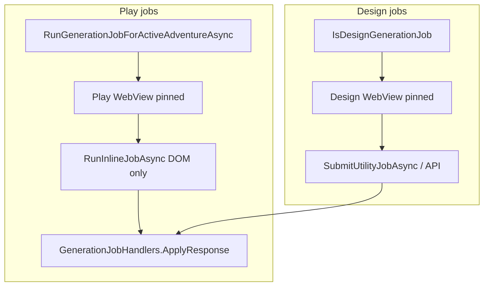

# Utility Job Orchestration

This document describes the **current** utility job pipeline after the [utility delivery pivot ADR](../adr/utility-delivery-pivot-adr.md) (CMD-248).

**Dual-lane evolution:** [Utility Worker Lane ADR](../adr/utility-worker-lane-adr.md) · [implementation plan](../plans/utility-worker-lane-plan.md) · [CMD-358](https://linear.app/cmd0112/issue/CMD-358) — registered utility worker for manual/heavy jobs; play injection ([CMD-326](https://linear.app/cmd0112/issue/CMD-326)) for auto/light jobs.

**Next evolution:** [Play-Thread Utility Orchestration Plan](../plans/play-thread-utility-orchestration-plan.md) — [CMD-326](https://linear.app/cmd0112/issue/CMD-326) (injection-first execution, schema, hiding, retrieval). Normative ADR: `play-thread-utility-orchestration-adr.md` ([CMD-327](https://linear.app/cmd0112/issue/CMD-327)).

**Related:** [instruction-sources-paradigm.md](../user/instruction-sources-paradigm.md) · [services-reference.md](../reference/services-reference.md) · [adventure-thread-registry.md](../reference/adventure-thread-registry.md) · [adventure-panel.md § Generation jobs](../user/adventure-panel.md#generation-jobs-phase-2)

---

## Overview

Generation jobs run on **two surfaces only**:

| Surface | Job IDs | Send path |
|---------|---------|-----------|
| **Play inline** | `process_turn`, `extract_entities`, `propose_memories`, `update_summary`, `bootstrap_*`, `continuity_check`, `synthesize_source` | `RunInlineJobAsync` on the pinned play WebView (DOM-only) |
| **Design thread** | `design_adventure`, `design_extract_step`, `draft_framework`, `propose_json_import`, `propose_source_edits` | Pinned design WebView via `RunDesignJobAsync` / `EnsureDesignConversationAsync` |

Dedicated utility tabs, hidden utility WebViews, and per-job utility sessions for play jobs are **retired**.

---

## Play inline delivery

`GenerationJobService.RunInlineJobAsync`:

1. Requires a pinned play thread with `LinkedConversationId`.
2. Builds story context via `UtilityStoryContextBuilder` (DOM-only capture on play WebView).
3. Wraps the job packet with `ContextTagFormat.WrapUtilityJob`.
4. Sends through `SubmitUtilityJobAsync` on the play composer (never a separate utility WebView).
5. Parses the assistant reply with `GenerationJobHandlers.ApplyResponse` and records proposals in the review queue.

Post-turn auto jobs (`GenerationJobScheduler.GetJobsAfterTurn`) run inline when enabled in adventure settings.

Inline visibility toggles (`HideInlineUtilityDuringPlay`, `ShowInlineUtilityTraffic`) remain in Play settings until metadata cleanup (CMD-253 follow-up).

---

## Design thread delivery

`GenerationJobService.RunDesignJobAsync`:

1. Requires a **design tab pin** and an active design conversation in the [thread registry](../reference/adventure-thread-registry.md).
2. Resolves the session via `EnsureDesignConversationAsync` (registry-first; no auto-created utility threads).
3. Seeds the design thread once per rotation with `GenerationJobHandlers.BuildSeedPrompt` when `JobCount == 0` (not for source-edit jobs).
4. Sends via `UtilityConversationReadinessService` → API or DOM on the design WebView.
5. Updates `UtilitySessions[design_adventure]` only as a job-counter shim; conversation id comes from the registry.

Design thread rotation uses `DesignThreadRotationService.ReleaseDesignThread` (registry archive, not per-job utility session rotation).

---

## Parse layer (unchanged)

All jobs share:

- `GenerationJobHandlers.ApplyResponse` → structured proposals
- `PendingReviewService` → review queue
- `UtilityParseLogService` → diagnostic log

---

## Migration

On adventure load (`AdventureMetadataMigration` schema v5):

- `UtilityDeliveryMode.SeparateThread` → `InlinePlayThread`
- Clears legacy `PinnedUtilityTab*` fields
- Strips orphan `UtilitySessions` keys (keeps `design_adventure` shim)

---

## Troubleshooting

| Symptom | Likely cause |
|---------|----------------|
| `play_thread_unlinked` | Pin a play tab on a Project `/c/…` conversation |
| `play_thread_unavailable` | Play WebView not ready or turn service missing |
| `design_pin_required` | Open Project → New chat → **Use this tab as design thread** |
| `design_same_as_play_thread` | Design pin must be a different conversation than play |
| Job succeeds but no proposals | Parse failure — check Utility parse log in diagnostics |

See also [troubleshooting.md](../user/troubleshooting.md).
