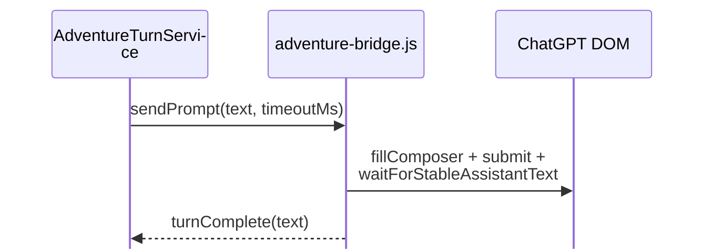

# WebView Bridges — Protocol Reference

ChatGPT Wrapper communicates with injected JavaScript through **WebView2 `postMessage`** and **`ExecuteScript`**. Two primary bridges exist: **API** (fetch to `backend-api`) and **Adventure/Play** (DOM automation).

---

## Protocol foundation

Defined in `ChatGPTWrapper.Core/Bridges/BridgeProtocol.cs`:

| Constant | Value |
|----------|-------|
| `BridgeProtocol.Version` | `1` |
| `ChannelApi` | `cgw-api` |
| `ChannelPlay` | `cgw-play` |
| `ChannelDisplay` | `cgw-display` |

### Request shape (`BridgeRequest`)

```json
{
  "protocolVersion": 1,
  "channel": "cgw-api",
  "id": "unique-correlation-id",
  "action": "ping",
  "...": "action-specific fields"
}
```

### Response shape (`BridgeResponse`)

Responses include `type`, `ok`, `error`, and echo `id` / `channel` for correlation.

C# injection classes (`ChatGptApiBridgeInjection`, `ChatGptAdventureBridgeInjection`) maintain pending request dictionaries keyed by `id`.

---

## Page kernel

**File:** `ChatGPT_files/cgw-page-kernel.js`  
**Loaded by:** `ChatGptPageHost.EnsureKernelAsync` via `WrapperAssetBundle.GetKernelPayload()`

Bootstraps:

- Message routing to `__cgwApiInvoke` / `__cgwAdventureHandleCommand`
- Channel demux for host ↔ page communication
- Bridge script loading coordination

---

## API bridge

| | |
|---|---|
| **JS file** | `chatgpt-api-bridge.js` |
| **C# class** | `ChatGptApiBridgeInjection.cs` |
| **Channel** | `cgw-api` |
| **Global entry** | `globalThis.__cgwApiInvoke(cmd)` |
| **Primary consumers** | `ChatGptProjectApiService`, `ChatGptConversationSendService`, `ProjectDiscoveryService` |

### Commands

| Action | Request fields | Response `type` | Purpose |
|--------|----------------|-------------------|---------|
| `getSession` | — | `apiResult` / `apiError` | Auth session via access token |
| `apiRequest` | `method`, `path`, `body`, `headers` | `apiResult` / `apiError` | Generic same-origin `fetch` to ChatGPT API |
| `listProjects` | — | `apiResult` | Combined project discovery |
| `getApiContext` | — | `apiResult` | Session + account context for diagnostics |
| `probeApi` | probe config | `apiResult` | Endpoint probe (sidebar, etc.) |
| `discoverProjectsDom` | — | `apiResult` | Scrape project list from DOM |
| `uploadFile` | `gizmoId`, file bytes/meta | `apiResult` / `apiError` | Upload to `/backend-api/files` or library |
| `attachProjectFile` | `gizmoId`, `fileId` | `apiResult` | Attach file to project via upsert |
| `deleteProjectFile` | `gizmoId`, `fileId` | `apiResult` | Delete project file |
| `downloadFile` | `fileId`, `gizmoId`, paths | `apiResult` | Download with path candidate fallback |
| `listComposerFileUi` | — | `apiResult` | Read-only scan of composer file inputs and attach buttons (chat file I/O diagnostics) |
| `fetchBlobUrl` | `url` (`blob:…`) | `apiResult` / `apiError` | Fetch same-origin blob URL → base64 (chat file I/O diagnostics) |
| `ping` | — | `pong` | Health check |
| `echo` | `probe` | `apiResult` | Diagnostic echo |

### `apiRequest` usage

C# services build requests to documented paths in `ChatGptApiEndpoints` (see [ChatGPT API Integration](chatgpt-api-integration.md)).

Streaming responses (conversation send) return through the bridge; C# parses SSE via `ConversationStreamParser`.

### Warm state

`ChatGptApiBridgeInjection` caches bridge readiness and session context to avoid re-probing on every call.

---

## Adventure / play bridge

| | |
|---|---|
| **JS file** | `adventure-bridge.js` |
| **C# class** | `ChatGptAdventureBridgeInjection.cs` |
| **Channel** | `cgw-play` |
| **Global entry** | `globalThis.__cgwAdventureHandleCommand(cmd)` |
| **Primary consumer** | `AdventureTurnService` |

### Commands

| Action | Request fields | Response `type` | Purpose |
|--------|----------------|-------------------|---------|
| `sendPrompt` | `text`, `timeoutMs`, `requireProjectContext` | `turnComplete` / errors | Fill composer, submit, wait for assistant |
| `submitPrompt` | `text`, `requireProjectContext`, `displayUserLine`, `packetHash` | `promptSubmitted`, `turnComplete` | Submit with optional display line masking |
| `fillComposer` | `text` | `composerFilled` | Fill composer only (no submit) |
| `captureLastAssistant` | — | `captureResult` | Read last assistant message text |
| `captureStableAssistant` | `baselineCount`, `timeoutMs` | `captureResult` | Wait for new stable assistant text after submit |
| `getAssistantTurnCount` | — | `assistantTurnCount` | Count assistant turns in DOM |
| `captureThreadTranscript` | `maxPairs` | `transcriptResult` | Extract user/assistant pairs from thread |
| `regenerateLast` | `timeoutMs` | `captureResult` | Trigger regenerate, capture result |
| `getConversationId` | — | `conversationId` | Current conversation id from URL/DOM |
| `probe` | — | `probeResult` | Composer DOM health |
| `listComposerFileUi` | — | `composerFileUi` | File input + attach button DOM scan (chat file I/O diagnostics) |
| `startProjectChat` | — | `projectChatReady` | Navigate/start project-scoped chat |
| `setWrapperComposer` | `enabled` | `wrapperComposerSet` | Toggle in-page wrapper composer |
| `ping` | — | `pong` | Health + composer probe |

### Typical play turn flow

Play turns may use `submitPrompt` + separate capture, or `sendPrompt` for atomic turns.

**Utility jobs (DomOnly path)** always use atomic `sendPrompt`:



See [utility-job-orchestration.md](utility-job-orchestration.md).

### Timeouts

Default timeouts vary by command (e.g. `captureStableAssistant` default 120s). `AdventureTurnService` maps `TimeoutException` to structured failure results.

---

## Play compose bridge

**File:** `cgw-play-compose.js`  
**C# class:** `ChatGptPlayComposeInjection.cs`  
**Channel:** `cgw-play` (message types prefixed `cgwCompose*`)

In-page composer overlay for Play mode (Do/Say/Story buttons). Messages routed by `PageMessageRouter` when `type` starts with `cgwCompose` or equals `cgwPlaySendLog`.

State synchronized via JSON contract tested in `PlayComposeUiStateTests`.

---

## Display channel features

| Asset | Feature ID | Message types |
|-------|------------|---------------|
| `continuous-transcript-view.js` | `continuous-view` | Schedule/rebuild via globals |
| `cgw-context-tags.js` | `context-tags` | Tag strip/display |
| `cgw-packet-display.js` | (via continuous view) | Packet section rendering |

Globals set by C# injection:

- `__cgwSetContinuousView(enabled)`
- `__cgwContinuousViewSchedule()`
- Phrase highlight fingerprints

---

## Message routing (C#)

`PageMessageRouter.Route(json)`:

1. Parse JSON
2. Resolve `feature` from `feature` property, `channel` map, or `type` inference
3. Dispatch to registered handlers

**Type → feature inference** (excerpt):

| `type` prefix/value | Feature |
|---------------------|---------|
| `bridgeReady`, `turnComplete`, `captureResult`, `pong`, … | `adventure-bridge` |
| `apiResult`, `apiError` | `api-bridge` |
| `cgwCompose*` | `play-compose` |

---

## Injection security

`ChatGptPageGate.IsInjectable(uri)` restricts injection to trusted ChatGPT origins (`ChatGptUrls.IsTrustedChatGptTopLevelUri`).

Scripts never run on arbitrary URLs.

---

## Diagnostics

| Trace file | Bridge |
|------------|--------|
| `play-send-trace.jsonl` | Play send pipeline |
| `link-project.log` | API attach/upload |
| `project-discovery-trace.jsonl` | API list projects |
| `chat-file-diagnostics.jsonl` | WebView download / file permission events |

Live bridge tests: `BridgeAssetTests`, `PlayComposeBehaviorTests`, `LiveApiDiagnosticTests` step 4–6.

---

## Related documentation

- [Architecture](architecture.md) — page host lifecycle
- [ChatGPT API Integration](chatgpt-api-integration.md) — endpoints used by `apiRequest`
- [Chat File I/O Feasibility](../Enhancements/chat-file-io-feasibility.md) — upload/download spike and diagnostics
- [Injected Assets](injected-assets.md) — full file list
- [Troubleshooting](../user/troubleshooting.md) — bridge failure recovery
