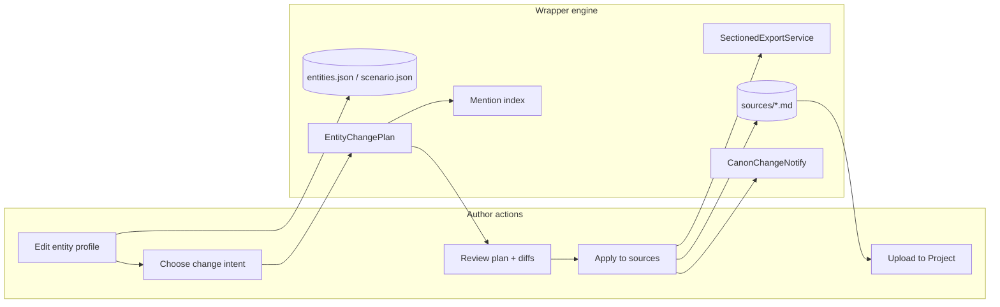

# Entity canon change paradigm

Architecture decision record for **entity management, editing, and intelligent propagation to `sources/*.md`**.

**Epic:** [CMD-232](https://linear.app/cmd0112/issue/CMD-232) · **Parent wave:** [CMD-11](https://linear.app/cmd0112/issue/CMD-11) source-centric design

**Related:** [CMD-140](https://linear.app/cmd0112/issue/CMD-140) (JSON ↔ sources reconciliation, Done) · [CMD-189](https://linear.app/cmd0112/issue/CMD-189) (entity editor enhancements) · [CMD-210](https://linear.app/cmd0112/issue/CMD-210) (shared `EntityReferencePanel`)

**Linear mirror:** [Entity Canon Change Paradigm](https://linear.app/cmd0112/document/entity-canon-change-paradigm) (attached to CMD-232)

---

## Problem

Authors edit entities through schema-driven forms (`EntityEditFormHost` → `entities.json`). Canonical lore for Project RAG lives in **`sources/*.md`**, indexed by **`source-manifest.json`** section entries with stable **`sourceEntityId`**.

Today the wrapper treats entity saves as **JSON mutations** and only afterward attempts to **infer** source impact (export, drift detection, regex rename). Authors cannot see where an entity appears, cannot approve scoped rewrites, and complex operations (merge, retire, cross-file rename) lack explicit intent.

**Symptom:** Rename NPC "Nessa" → "Anwen" in the editor; `entities.json` updates but "Nessa" remains in scenario, plot, lexicon, and hand-edited prose until the author discovers drift manually.

---

## Decision

Treat every entity edit as a **canon change operation** with explicit **intent**, **scope**, **preview**, **apply**, and **publish** stages — not as an opaque form save.

### Two-layer canon model

| Layer | Authority | Change rate | User mental model |
|-------|-----------|-------------|-------------------|
| **Structured canon** | `entities.json`, `scenario.json` fields | Every entity/scenario edit | "Profile" — typed fields, IDs, aliases |
| **Published lore** | `sources/*.md` under adventure `sources/` | After apply + optional Project upload | "Sources" — markdown sections for RAG |

**Rule:** Structured canon is the **authoring source of truth** during entity editing. Published lore is **derived** via deterministic export + approved text operations, never silently overwritten without preview when hand-edited sources exist.

**Project upload** remains **manual** via Source Manager (`ManuallyPublishedSha256`) — unchanged from [instruction-sources-paradigm.md](instruction-sources-paradigm.md).

---

## Canon change operation pipeline

### 1. Intent (what kind of change)

| Intent | Example | Propagation strategy |
|--------|---------|----------------------|
| **Update** | Edit description, role, tags | Regenerate entity section(s) from JSON; drift check category file |
| **Rename** | Nessa → Anwen | Cross-canon text replace (approved targets) + alias for prior name + context-index slug rewrite + export |
| **Delete** | Remove NPC | Remove section from export; queue source removal review if import policy requires |
| **Merge** | Combine two NPCs | Move aliases/body to target; remove source section; rewrite mentions to target name |
| **Retire** | NPC left story | Mark inactive / alias-only; optional soft-remove from lexicon in-use |
| **Create** | New entity | Add section; update lexicon in-use on export |

Intent is **explicit** (rename wizard, merge dialog) or **inferred** (field-only save → Update).

### 2. Scope (which files/sections)

Resolved via:

- **`CanonEntityKindSpec`** → primary file (`cast.md`, `world.md`, `plot.md`)
- **`SectionManifestEntry`** with matching **`sourceEntityId`**
- **`ContextIndexEntry.Target`** pointers
- **Mention index** scan for free-text occurrences (rename/merge)

**Rename/delete scope** = all **core lore files + lexicon** (`scenario.md`, `world.md`, `plot.md`, `cast.md`, `lexicon.md`), not only the entity's home file.

### 3. Preview (before writing sources)

`EntityChangePlan` holds:

- Operation + entity identity
- Structured field deltas (JSON)
- Section targets (`cast.md#npcs/anwen`, …)
- Approved text replacements (prior → new, per file/section)
- Projected file diffs (unified diff vs on-disk)

**Staged apply (Phase 3):** JSON saves immediately; **Apply to sources** runs only after author reviews plan (default auto-apply for low-risk Update when no manual source conflict).

### 4. Apply (deterministic execution)

Order:

1. Apply structured JSON changes (already saved)
2. Apply approved text replacements to JSON fields (scenario, entities, notes, context index, continuity)
3. `ProjectSourceExportService.ExportForce` (regenerate section bodies from JSON)
4. Rename reconciliation (aliases, context-index `#` targets, phrase highlights)
5. `SetNotifyFromEntityEdit` → play-packet one-shot notify ([CMD-143](https://linear.app/cmd0112/issue/CMD-143))
6. Clear `UnresolvedDrift` when sync succeeds

**Conflict:** If on-disk markdown differs from projected **and** manifest indicates manual edit since last export → surface reconcile dialog (Push / Pull / Defer); do not silent overwrite.

### 5. Publish (out of band)

Source Manager: upload to Project, mark **Published**. Play packet notify reminds narrator to re-retrieve; does not replace upload.

---

## UX surfaces

### Entity workspace (Phase 1)

Replace modal-only editing with a **workspace** hosted in `EntityReferencePanel` side panel (wide layout):

| Tab | Content |
|-----|---------|
| **Profile** | Current `EntityEditFormHost` |
| **Sources** | Rendered markdown section(s) for this `sourceEntityId`; stale/unpublished badges |
| **Mentions** | Mention index hits across lore files + context index triggers |
| **History** | `SourceFileHistoryService` snapshots for entity's home file |

Row badges: **in sync** / **sources stale** / **needs publish**.

### Guided rename wizard (Phase 2)

Triggered on name change or **Rename…** action:

1. Scan mention index for prior name + aliases
2. Checklist per hit: Replace / Keep as alias only / Skip
3. Build `EntityChangePlan`; show unified diff
4. Apply on confirm

### Staged commit bar (Phase 3)

Session-level strip when pending plans exist:

`[2 pending] Anwen rename · Mara description · [Preview all] [Apply to sources] [Discard]`

### Canon inbox (Phase 4)

Single cockpit list merging:

- `entities.reviewQueue` (AI proposals)
- `scenario.sourceEditReviewQueue` (import removals)
- Unresolved JSON↔sources drift
- Source Manager republish hints

### Post-apply publish funnel (Phase 1 quick win)

After apply: toast/banner with **View diff · Open Source Manager · Mark ready to upload**.

---

## Backend components

| Component | Role |
|-----------|------|
| `EntityChangePlan` | Serializable plan: intent, targets, replacements, diffs |
| `EntityChangePlanBuilder` | Builds plan from edit context + mention index |
| `EntityEditSourceSyncService` | Plan → preview → apply (evolves from auto-push) |
| `CanonMentionIndexService` | Index names/aliases/triggers in JSON + sources |
| `CanonTextReplacement` | Whole-word replace helper (existing) |
| `RenameReconciliationService` | Aliases, context-index, phrase highlights (existing) |
| `CanonReconciliationService` | Drift, notify, unresolved state (existing) |

---

## Phase roadmap (Linear)

| Phase | Focus | Issues |
|-------|-------|--------|
| **0** | Auto-sync baseline + docs | [CMD-233](https://linear.app/cmd0112/issue/CMD-233) |
| **1** | Workspace + row badges + publish funnel | [CMD-234](https://linear.app/cmd0112/issue/CMD-234) – [CMD-236](https://linear.app/cmd0112/issue/CMD-236) |
| **2** | `EntityChangePlan` + mention index + rename wizard | [CMD-237](https://linear.app/cmd0112/issue/CMD-237) – [CMD-239](https://linear.app/cmd0112/issue/CMD-239) |
| **3** | Staged apply + diff preview | [CMD-240](https://linear.app/cmd0112/issue/CMD-240) – [CMD-241](https://linear.app/cmd0112/issue/CMD-241) |
| **4** | Canon inbox | [CMD-242](https://linear.app/cmd0112/issue/CMD-242) |
| **5** | Merge/retire intents + optional AI prose pass | [CMD-243](https://linear.app/cmd0112/issue/CMD-243) – [CMD-244](https://linear.app/cmd0112/issue/CMD-244) |

---

## Non-goals

- Automatic Project upload on entity save
- LLM rewriting structured JSON without review queue
- Per-adventure custom entity schemas (see [CMD-196](https://linear.app/cmd0112/issue/CMD-196))
- Replacing Source Manager manual publish workflow

---

## Success metrics

- Rename operation: **zero** remaining prior-name hits in core lore after apply (except explicit aliases)
- Author can list **all mentions** of an entity before confirming rename
- Hand-edited sources: author always sees **diff** before overwrite
- Unresolved drift visible on entity row or inbox, repairable in one click
