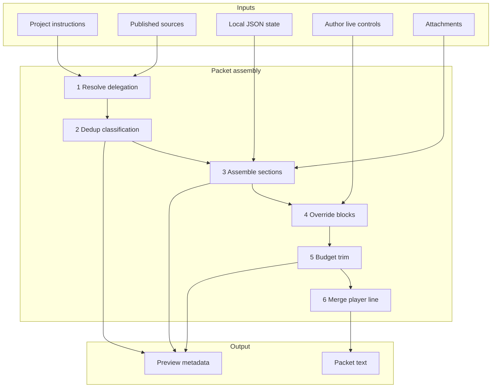

# ADR: Reference-First Injection Policy

**Status:** Accepted  
**Epic:** [CMD-292](https://linear.app/cmd0112/issue/CMD-292)  
**Implementation plan:** [injection-policy-implementation-plan.md](injection-policy-implementation-plan.md)

Normative supplement to [instruction-sources-paradigm.md](instruction-sources-paradigm.md). When this ADR and the paradigm disagree during CMD-292 rollout, **this ADR wins** for assembly order, deduplication, and preview honesty.

---

## Context

Play packets, start packets, handoff packets, and utility job prompts are assembled by multiple builders. Without explicit policy, the same narrator contract or lore body can appear in Project custom instructions, published `sources/*.md`, retrieval pointers, and inline packet text — wasting context window and confusing authors about which channel is authoritative.

---

## Decision

Adopt three principles for all injection surfaces:

### 1. Reference-first (no duplication)

When content is already available via **Project custom instructions**, `instructions-snippet.md`, or **published source files**, the play packet emits **pointers or omits** — never repeats full contract or lore bodies.

| Already available via | Packet must NOT repeat |
|-----------------------|------------------------|
| Project custom instructions | Narrator contract (perspective, tone, boundaries, portrayal, addendum) |
| `instructions-snippet.md` + RAG | Same contract text inline |
| Published `sources/*.md` | World/plot/cast/scenario bodies |
| `[[cgw:sources]]` pointers | Full section text for delegated sections |

**Packets carry deltas only:** state, memory, transcript tail, turn/session overrides, retrieval pointers, canon-update notices, attachment manifests, and content **not yet** in Project/RAG.

**Examples:**

- Thin turn 5 on a linked adventure: `[[cgw:sources v="2"]]` with ALWAYS RETRIEVE / THIS TURN buckets; no `Content boundaries:` paragraph inline.
- Turn override with tone matching adventure baseline: no `=== TURN OVERRIDES ===` block (inherit = omit).
- Start packet with section-injection v2: context pointers list core lore; player directive omits redundant file enumeration (see § Start packet).

### 2. Completeness, then context-window optimization

Assembly order:

1. **Resolve delegation** — `ProjectSourceInjectionService.CanDelegateStaticContent`
2. **Classify and deduplicate** — reference vs delta vs conditional-inline
3. **Assemble mandatory + optional sections** at full fidelity
4. **Append override blocks** — deltas only (`NarratorOverrideResolver`)
5. **Budget / trim** — `ContextBudgetAllocator`, attachment modes, `MaxPacketChars`
6. **Merge player line**

Never trim before deduplication. Never drop mandatory pointers without author-visible warning (preview manifest — CMD-295).

**Examples:**

- Under tight `MaxPacketChars`, degrade THIS TURN pointer render modes before dropping ALWAYS RETRIEVE baseline pointers.
- Attachment Minimal mode trims lore **after** mandatory meta and overrides are assembled ([attachment-aware-context-injection.md](Enhancements/attachment-aware-context-injection.md), CMD-297).

### 3. Live control surface

Injection is the **runtime control plane** for model behavior:

| Control | Scope | Packet effect | Project effect |
|---------|-------|---------------|----------------|
| Scene profile / presets | Turn or session | Override lines if ≠ baseline | None |
| Turn directive | Turn | `=== TURN DIRECTIVE ===` | None |
| Session addendum | Session | Session note line | None |
| Adventure contract edits | Adventure baseline | Fat inline only; thin uses Project | Via instruction-domain publish |

Authors modify behavior **on the fly** without re-uploading sources or editing ChatGPT Project settings.

**Examples:**

- Author sets turn tone to "grim" while adventure baseline is "neutral": packet contains `Tone: grim` only.
- Author edits content boundaries in Play settings: prompts link to instruction designer; overrides do not silently rewrite Project instructions.

---

## Assembly pipeline



---

## Section classification

| Class | Definition | Example |
|-------|------------|---------|
| **Reference** | Model retrieves from Project instructions or source files | `[[cgw:sources]]` ALWAYS RETRIEVE block |
| **Delta** | Not available elsewhere; must be in packet | State, transcript tail, turn overrides |
| **Conditional-inline** | Inline only when delegation unavailable | Full contract when `CanDelegateStaticContent` is false |
| **Trimmed** | Dropped or degraded by budget | Entity excerpt removed under `MaxPacketChars` |

---

## Packet profile decision tree

`PacketProfileResolver.Resolve(bundle, userChoseInlineFallback)` selects one of three profiles. Section-injection v2 (`[[cgw:sources v="2"]]`) is always used; legacy `UseSectionInjection == false` builders are removed.

```
ForceInlineLore?
├── yes → InlineFallback (full inline lore + contract)
└── no → CanDelegateStaticContent?
    ├── yes → SourceDelegated (pointers + deltas)
    └── no → HasLinkedProject?
        ├── yes + userChoseInlineFallback → InlineFallback (send warning → No)
        ├── yes (default / preview) → SourceDelegated shape with "Sources not ready" in pointers
        └── no → MinimalLocal (opening + session deltas only)
```

| Profile | When | Packet contents |
|---------|------|-----------------|
| **SourceDelegated** | Linked + all lore manually published | `[[cgw:sources v="2"]]` pointers, short narrator stub, deltas only |
| **MinimalLocal** | No linked Project | Pointers note + scenario opening block + state/memory/transcript/summary |
| **InlineFallback** | `ForceInlineLore` or user proceeds after publish warning | Full contract + lore inline (escape hatch) |

**Gate:** `ProjectSourceInjectionService.CanDelegateStaticContent` — manual publish only (`SourcePublishMode` is always **Manual** after load migration). Instruction domain drift does **not** block source delegation.

`[[cgw:meta mode="…"]]` values: `delegated`, `minimal`, `inline` (legacy display still accepts `thin`/`fat` for one release).

---

## Inline fallback exceptions

Inline fallback is an **exception**, not the target:

- Inline narrator contract via `InstructionContractService.BuildContractSections`
- Inline scenario / plot / world / cards when pointers cannot be trusted or user chose to proceed unpublished
- Override blocks still **delta-only** — never duplicate unchanged baseline fields

Delegated packets must not claim false retrieval when sources are unpublished (blocking reason appears in ALWAYS RETRIEVE instead of silent `(none)`).

---

## Start packet policy

`AdventureBootstrapService.BuildStartPacket` uses `freshNarrativeBootstrap: true`.

| Profile | Player directive | Context block |
|---------|------------------|---------------|
| SourceDelegated | Narrative intent only (no file list) | ALWAYS RETRIEVE pointer fan-out |
| MinimalLocal | Narrative intent only | Opening-focused scenario + deltas |
| InlineFallback | May list canonical files | Inline lore + contract |

**Rationale:** Listing every file in the player line **and** fanning out identical pointers duplicates retrieval intent.

---

## Live control semantics

- `NarratorOverrideResolver.AppendOverrideBlocks` runs **after** packet assembly; compares effective values to adventure baseline via `AddLineIfDifferent`.
- Turn directive is always delta (never deduped against baseline).
- Session addendum and emphasis flags are always delta.
- Response length `"normal"` and inherit sentinel normalize to null (no line).

Scopes: turn → session → adventure baseline (`NarratorOverrideResolver.Coalesce`).

---

## Utility job channel

Utility jobs use a **separate channel** from narrator instructions:

| Content | Belongs in |
|---------|------------|
| Extraction schema / JSON shape | Job guide only |
| Narrator contract | Project instructions (not job packet) |
| Story context slice | Job payload — omit portions already in inline play thread feed |

**Known gap (CMD-43):** Some job handlers may still repeat story context; audit before closing CMD-294 follow-up.

---

## Attachment interaction

Phase A (CMD-39): attachment manifest in packet prefix.  
Phase B+ (CMD-297): `AttachmentContext` model, DOM metadata, policy modes (Auto / Full / Minimal).

**Rule:** Attachment-based lore trim runs at step 5 — **after** dedup assembly. Attachment-only turns need enriched `searchHint` from filenames.

---

## Key code references

| Concern | Type / service |
|---------|----------------|
| Delegation gate | `ProjectSourceInjectionService.CanDelegateStaticContent` |
| Play packet | `PromptPacketBuilder`, `PromptInjectionService.PrepareSend` |
| Pointers | `ContextPointerResolver`, `ContextPointerRenderer` |
| Budget | `ContextBudgetAllocator` |
| Overrides | `NarratorOverrideResolver` |
| Thin guard | `InjectionPolicyGuard` |
| Start / handoff | `AdventureBootstrapService`, `PlayHandoffService` |

---

## Appendix A — Builder inventory (CMD-69)

| Builder | Entry point | Output channel | Duplication risk | Primary sections |
|---------|-------------|----------------|----------------|------------------|
| **Play send** | `PromptInjectionService.PrepareSend` | Play packet | Medium | Context (thin/fat), overrides, canon notify, attachment manifest |
| **Start packet** | `AdventureBootstrapService.BuildStartPacket` | Play packet | **High** (fixed: player line vs pointers) | `freshNarrativeBootstrap` pointers + player directive |
| **Handoff** | `PlayHandoffService.BuildHandoffPacket` | Play packet | Medium | Continuation meta, summary/transcript, pointers when thin |
| **Play actions** | `PlaySurfaceActionSendHelper` | Packet delta | Low | Action-specific delta prepended to send |
| **Design source** | `AdventureDesignSourcePromptService` | Design thread | N/A | Design-only; not play packet |
| **Instruction refine** | `InstructionRefinementPromptService` | Design thread | Low | Refinement prompt; not play packet |
| **Utility jobs** | `GenerationJobHandlers` | Inline job | **High** | Guide + payload; audit for contract/story repeat |
| **Recap / extraction** | `RecapService`, `EntityExtractionService` | Utility job | Medium | Context slices from bundle |

### Section tags by builder (play send)

| Section | Thin v2 | Fat | Kind |
|---------|---------|-----|------|
| `[[cgw:meta]]` | Yes | Yes | Delta |
| `[[cgw:sources]]` / pointers | Yes | Fat sources block | Reference |
| Narrator contract paragraphs | No | Yes | Conditional-inline |
| Scenario / plot / world bodies | No | Yes | Conditional-inline |
| State / memory / transcript | Yes | Yes | Delta |
| Turn overrides / directive | Yes | Yes | Delta |
| Canon-update notice | Yes | Yes | Delta |
| Attachment manifest | Yes | Yes | Delta |

### Known gaps → Linear

| Gap | Owner |
|-----|-------|
| Preview per-section reference/delta/trimmed | CMD-295 |
| Live cockpit unified UX | CMD-296 |
| Attachment Phase B+ | CMD-297 |
| Utility job story-context dedup | [CMD-390](https://linear.app/cmd0112/issue/CMD-390) / [utility-job-context-assembly-adr.md](utility-job-context-assembly-adr.md) |
| Instruction channel UI glossary | [instruction-channels.md](instruction-channels.md) (CMD-289) |
| `PrepareSend` double `BuildContext` | Perf only; optional cleanup |

---

## Related

- [instruction-sources-paradigm.md](instruction-sources-paradigm.md) — four channels theory
- [prompt-construction-guide.md](prompt-construction-guide.md) — builder entry points
- [narrator-settings.md](narrator-settings.md) — runtime overrides
- [Enhancements/attachment-aware-context-injection.md](Enhancements/attachment-aware-context-injection.md) — attachment phases
