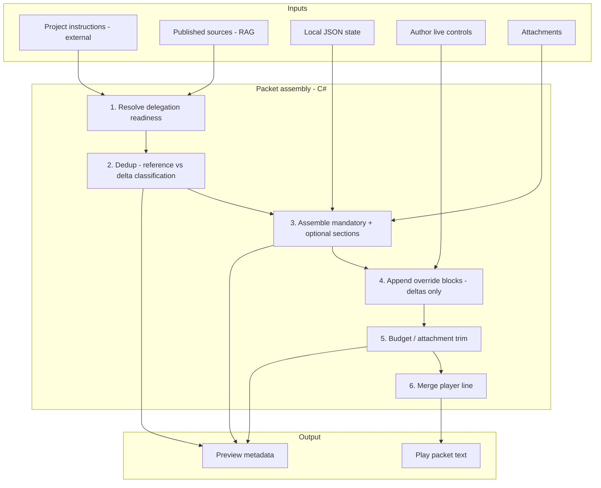

# Injection Policy — Implementation Plan

Comprehensive execution plan for **[CMD-292](https://linear.app/cmd0112/issue/CMD-292)** (Reference-first injection policy & live control surface).

**Companion ADR:** [injection-policy-adr.md](injection-policy-adr.md) — normative policy (CMD-293, shipped).

**Related canon:** [instruction-sources-paradigm.md](instruction-sources-paradigm.md) · [prompt-construction-guide.md](prompt-construction-guide.md) · [narrator-settings.md](narrator-settings.md) · [Enhancements/attachment-aware-context-injection.md](Enhancements/attachment-aware-context-injection.md)

---

## Executive summary

### Product principles

| # | Principle | Implementation meaning |
|---|-----------|------------------------|
| **1** | **Reference-first (no duplication)** | When Project instructions or published `sources/*.md` already provide content, the play packet emits **pointers or omits** — never repeats full contract or lore bodies. |
| **2** | **Completeness, then optimize** | Build the full non-duplicated packet first; apply `ContextBudgetAllocator` and attachment trim **only after** mandatory sections are assembled. Preview must show omissions. |
| **3** | **Live control surface** | Turn/session overrides, directives, and presets are the **runtime control plane** — packet-only, never synced to Project instructions. One unified UX with honest preview. |

### What success looks like

- Thin packets on a linked, published adventure contain **no inline narrator contract** and **no full lore excerpts** unless pointers fail.
- Authors see in preview which sections are **delegated** (reference), **injected** (delta), or **trimmed** (budget).
- Narrator cockpit + Next send answer: *what changes on the next send?*
- Golden tests enforce dedup; manual QA confirms live ChatGPT behavior.

---

## Current state (baseline)

### Already aligned

| Area | Evidence |
|------|----------|
| Thin vs fat delegation | `ProjectSourceInjectionService.CanDelegateStaticContent` + `PromptPacketBuilder.UseThinPackets` |
| Source pointers | `ContextPointerResolver` → ALWAYS RETRIEVE / THIS TURN buckets |
| Override dedup (partial) | `NarratorOverrideResolver.AddLineIfDifferent` skips unchanged baseline |
| Budget allocator | `ContextBudgetAllocator.ApplyBudget` degrades pointer render modes |
| Attachment manifest (Phase A) | `AttachmentSendPolicy.BuildAttachmentManifestSection` — [CMD-39](https://linear.app/cmd0112/issue/CMD-39) Done |
| Narrator scopes | Turn / session / adventure via CMD-127 phases (CMD-128–132) |
| Preview/send path | Both use `PromptInjectionService.PrepareSend` |
| Tests | `ProjectSourceInjectionTests`, `ContextBudgetAllocatorTests`, `PlayTurnOverrideTests`, `AttachmentSendPolicyTests`, `PlayUxContextTagTests` |

### Known gaps (motivation for this plan)

| Gap | Symptom | Primary owner |
|-----|---------|---------------|
| Assembly order undocumented | Trim may conceptually precede completeness in author mental model | CMD-293, CMD-295 |
| Fat fallback over-inlines | Unlinked or unpublished adventures get full contract + lore in every send | CMD-294 |
| Opening + pointers overlap | Start packet player line lists files while pointers fan out same sections | CMD-294, CMD-56 |
| Preview hides delegation | Mode label exists (`Source-delegated` / `Fat`) but no per-section reference/delta/trimmed | CMD-295, CMD-296 |
| Fragmented live controls | Narrator expander, Next send tab, Play settings split behavior changes | CMD-296 |
| Attachment-only turns | Empty `searchHint`; blank display line on native path | CMD-297 |
| Utility job duplication | Job packets may repeat story context or contract already in thread | CMD-294, CMD-43 |
| Instruction channel confusion | UI/docs use "instructions" for four channels | CMD-289 |
| Handoff not policy-tested | CMD-149–153 shipped; golden test for pointer-first handoff missing | CMD-294, CMD-65 |

---

## Target architecture

### Assembly pipeline (play send)



### Content classification (every section)

| Class | Definition | Example |
|-------|------------|---------|
| **Reference** | Model should retrieve from Project instructions or source files | `[[cgw:sources]]` ALWAYS RETRIEVE block |
| **Delta** | Not available elsewhere; must be in packet | State, transcript tail, turn overrides, canon-update notice |
| **Conditional-inline** | Inline only when delegation unavailable (fat fallback) | Full contract paragraphs when not linked |
| **Trimmed** | Dropped or degraded by budget policy | Entity excerpt removed under `MaxPacketChars` |

### Channel separation (instructions)

| Channel | Storage | Injected in play packet? | Pushed to Project? |
|---------|---------|--------------------------|-------------------|
| Project custom instructions | ChatGPT Project settings | Pointer only (thin) | Yes (author action) |
| Adventure baseline | `adventure.json` settings | Fat inline only | Via instruction-domain hash |
| Turn/session overrides | `playTurnOverrides`, session map | `=== TURN OVERRIDES ===` | **Never** |
| Turn directive | `playTurnOverrides.turnDirective` | `=== TURN DIRECTIVE ===` | **Never** |
| Utility job guide | `UtilityJobGuideOverrides` | Job packet only | **Never** |

---

## Phase breakdown (Linear mapping)

| Phase | Issue | Duration estimate | Depends on |
|-------|-------|-------------------|------------|
| **0a** | [CMD-69](https://linear.app/cmd0112/issue/CMD-69) — Builder inventory spike | 1–2 sessions | — |
| **0b** | [CMD-293](https://linear.app/cmd0112/issue/CMD-293) — ADR | 1 session | CMD-69 (parallel OK) |
| **0c** | [CMD-289](https://linear.app/cmd0112/issue/CMD-289) — Instruction channel glossary + UI copy — **Shipped** | 1–2 sessions | CMD-293 draft |
| **1** | [CMD-294](https://linear.app/cmd0112/issue/CMD-294) — Dedup enforcement | 2–4 sessions | CMD-293 |
| **2** | [CMD-295](https://linear.app/cmd0112/issue/CMD-295) — Budget pipeline + preview omissions | 2–3 sessions | CMD-294 |
| **2b** | [CMD-60](https://linear.app/cmd0112/issue/CMD-60) — Turn meta preview quick win | 0.5–1 session | Can parallel phase 2 |
| **3** | [CMD-296](https://linear.app/cmd0112/issue/CMD-296) — Live control surface | 3–5 sessions | CMD-293; preview from CMD-295 |
| **4** | [CMD-297](https://linear.app/cmd0112/issue/CMD-297) — Attachment Phase B+ | 2–3 sessions | CMD-293, CMD-295 |
| **Review** | [CMD-56](https://linear.app/cmd0112/issue/CMD-56) — Pipeline review sign-off | 1 session | After 294–296 |
| **Follow-ups** | CMD-94, CMD-22, CMD-24, CMD-43, CMD-65 | As needed | Instruction / utility streams |

**Total core path:** ~12–18 focused sessions (excluding follow-ups).

---

## Phase 0 — Policy & inventory

### CMD-69: Builder inventory

**Deliverable:** Table in ADR appendix (not a second canon doc).

| Builder | Entry point | Output channel | Duplication risk |
|---------|-------------|----------------|------------------|
| Play send | `PromptInjectionService.PrepareSend` | Packet | Medium — fat path |
| Start packet | `AdventureBootstrapService.BuildStartPacket` | Packet | High — opening fan-out |
| Handoff | `PlayHandoffService` | Packet | Medium |
| Design source | `AdventureDesignSourcePromptService` | Design thread | N/A |
| Instruction refine | `InstructionRefinementPromptService` | Design thread | Low |
| Utility jobs | `GenerationJobHandlers` | Inline job | High — story context |
| Play actions | `PlaySurfaceActionSendHelper` | Packet delta | Low |

**Tasks:**

1. For each builder, list every text section emitted.
2. Tag each section: `reference` | `delta` | `conditional-inline`.
3. Flag violations of principle 1; link to CMD-294 tasks.
4. Note where budget runs relative to assembly (principle 2).

### CMD-293: ADR (`docs/injection-policy-adr.md`)

**Sections:**

1. Principles (three product rules)
2. Assembly pipeline diagram
3. Classification table (reference / delta / conditional-inline / trimmed)
4. Thin vs fat decision tree
5. Fat fallback exception rules
6. Live control semantics (scopes, packet-only)
7. Utility job channel (separate from narrator)
8. Attachment policy interaction (trim after completeness)
9. Appendix: builder inventory from CMD-69

**Doc updates in same PR:**

- `instruction-sources-paradigm.md` — link ADR as normative supplement
- `prompt-construction-guide.md` — replace review checklist with ADR cross-link + assembly order
- `INDEX.md` — add ADR + this plan

### CMD-289: Instruction channels

**Parallel with ADR** — focus on author-facing glossary and UI strings:

- Source Manager: "Copy to Project instructions" vs "Generate snippet file"
- Narrator cockpit: "Packet override (this send)" badge
- AI Actions: "Job guide — not narrator instructions"
- Drift banners: instructions vs sources

---

## Phase 1 — Dedup enforcement (CMD-294)

### 1.1 Introduce `InjectionSectionManifest` (internal)

Track each packet section through assembly:

```csharp
// Conceptual — name TBD
internal sealed record InjectionSection(
    string Id,
    InjectionSectionKind Kind,  // Reference, Delta, ConditionalInline
    string RenderedText,
    bool Mandatory,
    bool Included);
```

Returned from `PrepareSend` for preview (CMD-295) — not sent to ChatGPT.

### 1.2 Thin path hardening

**Files:** `PromptPacketBuilder.cs`, `ContextPointerRenderer.cs`

| Task | Detail |
|------|--------|
| Assert no contract paragraphs | When `UseThinPackets`, `BuildStaticContract` sections must not appear inline |
| Instructions pointer only | `[[cgw:instructions]]` or omission — never full `InstructionSourcesPolicy` body |
| Start packet audit | `freshNarrativeBootstrap` pointer fan-out vs player line — dedupe per ADR |
| Handoff packet | `PlayHandoffService` — continuity deltas only; pointers when published |

### 1.3 Override block audit

**File:** `NarratorOverrideResolver.cs`

Already skips unchanged values via `AddLineIfDifferent`. Verify:

- Response length `"normal"` → no line (done)
- Session addendum and emphasis flags are always delta (OK)
- Turn directive always delta (OK)

**Add tests** for edge cases: empty baseline tone, scenario tone fallback.

### 1.4 Utility job dedup

**File:** `GenerationJobHandlers.cs`

| Rule | Implementation |
|------|----------------|
| No narrator contract in job packet | Guide + payload only |
| Story context slice | Omit transcript portions already in inline play thread context feed |
| Design vs play routing | Per CMD-248 ADR — no duplicate seed on every job |

### 1.5 Golden packet fixtures

**New test file:** `tests/.../InjectionPolicyGoldenTests.cs`

| Fixture | Assert |
|---------|--------|
| `thin-linked-published.json` | No `Content boundaries:` inline; has `[[cgw:sources]]` |
| `fat-unlinked.json` | Contract inline; no false pointer claims |
| `overrides-inherit.json` | No `=== TURN OVERRIDES ===` block |
| `overrides-tone-shift.json` | Only `Tone:` line present |
| `handoff-mid-adventure.json` | Continuation meta; pointer-first when published |

### 1.6 Acceptance gate

- [ ] All golden tests green
- [ ] CMD-65 handoff verified against `handoff-mid-adventure` fixture
- [ ] `prompt-construction-guide.md` dedup section updated

---

## Phase 2 — Completeness-first budget (CMD-295)

### 2.1 Pipeline reorder (if needed)

**Current:** `ContextBudgetAllocator` runs inside `BuildThinContextSectionInjection` / `BuildFatContextSectionInjection` before `FinalizeContext`.

**Target:**

1. Resolve pointers with full metadata (completeness)
2. Render sections at full fidelity
3. Apply budget degradation
4. Record trimmed sections in manifest

**Files:** `PromptPacketBuilder.cs`, `ContextBudgetAllocator.cs`

Extend `ContextBudgetAllocator` to return `List<TrimmedSection>` or write into manifest.

### 2.2 Mandatory section policy

**Never silently drop:**

| Section | Thin | Fat |
|---------|------|-----|
| `[[cgw:meta]]` | Yes | Yes |
| Player line | Yes | Yes |
| ALWAYS RETRIEVE pointers | Yes | N/A (inline lore) |
| Turn overrides (if any) | Yes | Yes |
| Turn directive (if any) | Yes | Yes |
| Canon-update notice (if active) | Yes | Yes |
| State delta | Yes | Yes |
| Transcript minimum | Configurable floor | Configurable floor |

**Sacrifice order (optional sections):**

1. Entity excerpts / story card inline bodies
2. Transcript depth (beyond minimum)
3. Rolling summary length
4. THIS TURN pointer count (lowest score first — already in allocator)
5. Attachment-time lore trim (coordinate with CMD-297)

### 2.3 Preview honesty

**Files:** `PlayPromptInjectionDialog.xaml.cs`, `PromptInjectionService.cs`

Extend `PromptInjectionPrepareResult`:

```csharp
public IReadOnlyList<InjectionSection> Sections { get; init; }
public IReadOnlyList<TrimmedSection> Trimmed { get; init; }
public PacketDelegationMode DelegationMode { get; init; }
```

**UI:**

- Header: `Source-delegated` | `Fat fallback` | `Partial`
- Section list: `[reference]` `[delta]` `[trimmed]` badges
- Warnings when mandatory content threatened (should not happen if policy correct)

### 2.4 CMD-60 (quick win)

Ship turn meta in preview **in parallel** — feeds section list UI:

- `FormatStructuredPreview` empty meta body
- `PacketMetaLine` turn index

### 2.5 Tests

- Extend `ContextBudgetAllocatorTests` — mandatory sections survive aggressive budget
- Preview manifest tests — trimmed list matches allocator output

---

## Phase 3 — Live control surface (CMD-296)

### 3.1 Information architecture

**Goal:** One mental model for "what changes on the next send."

| Control | Scope | Packet effect | Project effect |
|---------|-------|---------------|----------------|
| Scene profile | Turn or session | Multiple override lines | None |
| Length/detail/tone/difficulty | Per scope | Override lines if ≠ baseline | Adventure scope → baseline only |
| Turn directive | Turn | `=== TURN DIRECTIVE ===` | None |
| Session addendum | Session | Session note line | None |
| Emphasis toggles | Turn/session | Emphasis lines | None |

**Adventure contract edits** → link to Play settings / Instructions designer with warning banner.

### 3.2 UI consolidation options

**Option A (recommended):** Expand Session cockpit **Injection** expander

- Top: live preview panel (from CMD-295 manifest)
- Middle: behavior controls (migrate from `NarratorControlsPanel`)
- Bottom: "Advanced…" → `NarratorAdvancedDialog`

**Option B:** Merge Next send tab into cockpit; Play settings dialog keeps read-only full preview.

### 3.3 Files to touch

| File | Change |
|------|--------|
| `AdventurePlayView.xaml` | Injection expander layout |
| `NarratorControlsPanel.xaml` | Badge "Packet only" |
| `PlayPromptInjectionDialog.xaml` | Link or embed preview; reduce duplication |
| `PlayPromptInjectionDialog.xaml.cs` | Consume `InjectionSection` manifest |
| `docs/adventure-panel.md` | Author workflow |
| `docs/narrator-settings.md` | Cross-link injection cockpit |

### 3.4 Acceptance gate

- [ ] Author can set turn override and see exact packet delta in preview
- [ ] Delegated sections show as reference (not editable inline)
- [ ] No control path writes Project instructions
- [ ] Responsive: narrow panel preserves flyout (existing CMD-127 pattern)

---

## Phase 4 — Attachment Phase B+ (CMD-297) — **Shipped**

Per [attachment-aware-context-injection.md](Enhancements/attachment-aware-context-injection.md), aligned with principles. Phase 4 API path parity remains a follow-up in that doc.

### 4.1 `AttachmentContext` model

```csharp
public sealed class AttachmentContext
{
    public bool HasAttachments { get; init; }
    public bool PreStagedInNativeComposer { get; init; }
    public IReadOnlyList<AttachmentDescriptor> Items { get; init; }
    // ...
}
```

Wire through `PrepareSend(bundle, userText, attachmentContext)`.

### 4.2 DOM metadata (JS)

**File:** `wrapper-assets/adventure-bridge.js` (or `cgw-play-compose.js`)

- `listNativeComposerAttachments()` — names, inferred MIME/kind
- Extend `cgwComposeSend` payload

### 4.3 Policy modes (after completeness)

| Mode | Behavior |
|------|----------|
| **Auto** | Full packet unless image/PDF-heavy turn → reduce lore |
| **Full** | No attachment-based trim |
| **Minimal** | Aggressive lore trim; rely on vision/document |

Runs at step 5 of pipeline — **after** dedup assembly.

### 4.4 Attachment-only turns

- Enrich `searchHint` from filenames for pointer resolution
- Display line fallback in `MainWindow.PlayInjection.cs` for native path
- Optional MIME-specific one-line guidance (not full lore)

### 4.5 Tests

- `AttachmentContextModeTests` (extend existing)
- Native metadata scrape fixture tests (JS contract tests if feasible)

---

## Phase 5 — Review & sign-off (CMD-56) — **Shipped**

Sign-off recorded in [prompt-construction-guide.md — CMD-56 sign-off](prompt-construction-guide.md#cmd-56-sign-off-2026-06-22).

1. ADR published and linked
2. Golden tests cover thin/fat/handoff/overrides
3. Preview shows reference/delta/trimmed
4. Live cockpit unified
5. Attachment Phase B+ or deferral documented
6. Instruction channels (CMD-289) UI copy shipped
7. `prompt-construction-guide.md` review checklist updated
8. Manual QA script below passed

Close CMD-292 epic when all gates pass.

---

## Parallel streams (not on critical path)

| Issue | When | Notes |
|-------|------|-------|
| [CMD-94](https://linear.app/cmd0112/issue/CMD-94) | Anytime after CMD-289 glossary | Instruction refine sync — design thread, not play packet |
| [CMD-22](https://linear.app/cmd0112/issue/CMD-22) | After CMD-289 | OOC in Project instructions channel |
| [CMD-24](https://linear.app/cmd0112/issue/CMD-24) | Anytime | Designer UX polish |
| [CMD-43](https://linear.app/cmd0112/issue/CMD-43) | After CMD-294 | Hidden utility sections — must pass dedup rules |
| [CMD-65](https://linear.app/cmd0112/issue/CMD-65) | After CMD-294 golden | Close parent after handoff fixture green |

---

## Risk register

| Risk | Mitigation |
|------|------------|
| Fat fallback still needed for unlinked adventures | ADR documents exception; optimize fat content not eliminate |
| ChatGPT ignores pointers | Fat fallback path remains; author publish checklist unchanged |
| Preview manifest drifts from send | Single `PrepareSend` path; manifest from same builder |
| Scope creep into Play settings overhaul (CMD-254) | CMD-296 links out for contract edits; no modal redesign |
| DOM scrape fragility (attachments) | Best-effort metadata; degrade to Phase A manifest |
| Utility job dedup breaks parse | Incremental change per job; keep golden job packet tests |

---

## Manual QA script (epic sign-off)

**Prerequisites:** Linked Project, published sources, active play session.

1. **Thin dedup** — Send turn 5; View full packet → no inline boundaries/portrayal; pointers present.
2. **Override delta** — Set tone override; preview shows only `Tone:` line; Project instructions unchanged in ChatGPT.
3. **Inherit** — Reset override to inherit; `=== TURN OVERRIDES ===` absent.
4. **Fat fallback** — Unpublish one core file; send → fat mode label; contract inline; still no duplicate override lines.
5. **Budget** — Lower `MaxPacketChars`; preview lists trimmed sections; send still succeeds.
6. **Handoff** — Mid-adventure handoff; packet pointer-first; continuation meta present.
7. **Attachment** — Image-only send; manifest in packet; lore trimmed in Minimal mode.
8. **Utility job** — Run extract entities inline; job guide in packet; narrator contract not repeated.
9. **Live cockpit** — All behavior changes visible in unified preview before send.

---

## Key files reference

| Concern | Files |
|---------|-------|
| Play packet core | `PromptPacketBuilder.cs`, `PromptInjectionService.cs` |
| Delegation | `ProjectSourceInjectionService.cs`, `ContextPointerResolver.cs`, `ContextPointerRenderer.cs` |
| Budget | `ContextBudgetAllocator.cs`, `ContextRenderPolicy.cs` |
| Overrides | `NarratorOverrideResolver.cs`, `NarratorPresetLibrary.cs` |
| Attachments | `AttachmentSendPolicy.cs`, `cgw-play-compose.js`, `adventure-bridge.js` |
| Preview UI | `PlayPromptInjectionDialog.xaml.cs`, `AdventurePlayView.xaml` |
| Instructions | `InstructionSourcesPolicy.cs`, `InstructionContractService.cs` |
| Utility | `GenerationJobHandlers.cs`, `GenerationJobGuideService.cs` |
| Bootstrap/handoff | `AdventureBootstrapService.cs`, `PlayHandoffService.cs` |
| Tests | `tests/ChatGPTWrapper.ApiDiagnostics/Unit/*` |

---

## Suggested PR sequence

| PR | Issues | Scope |
|----|--------|-------|
| 1 | CMD-69, CMD-293, CMD-289 (docs only) | ADR + inventory + glossary + INDEX links |
| 2 | CMD-294 | Dedup + golden tests |
| 3 | CMD-295, CMD-60 | Manifest + preview omissions + turn meta |
| 4 | CMD-296 | Live control surface UI |
| 5 | CMD-297 | Attachment Phase B+ |
| 6 | CMD-56 | Review doc updates, closeout |

Keep PRs reviewable; each should leave main green.

---

*Last updated: 2026-06-22 — aligned with CMD-292 epic and child issues CMD-293–297.*
