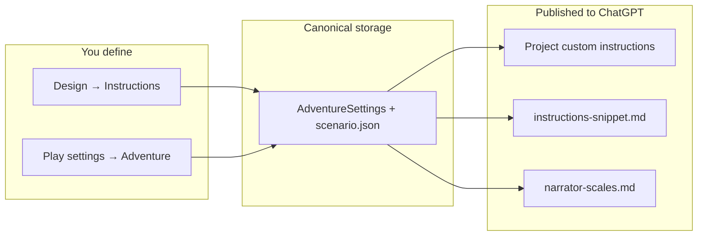

# Instruction Contract Guide

This guide explains how to **define, edit, and publish** the narrator instruction contract for an adventure — perspective, tone, content boundaries, character portrayal rules, and optional addenda.

**New to instructions?** Start with the step-by-step **[Tutorial: Drafting narrator instructions](#tutorial-drafting-narrator-instructions)** (deterministic generate + optional AI refine).

**Documentation hub:** [INDEX.md](INDEX.md)

Related docs: [instruction-sources-paradigm.md](instruction-sources-paradigm.md) · [adventure-panel.md](adventure-panel.md) · [user-projects-and-sync.md](user-projects-and-sync.md) · [data-model-reference.md](data-model-reference.md)

---

## What is the instruction contract?

The instruction contract tells ChatGPT **how to narrate** your adventure. It is separate from world lore (scenario, cast, world rules), which live in Project **source files**.

The contract is pushed to:

1. **ChatGPT Project custom instructions** (primary — always-on during play)
2. **`instructions-snippet.md`** (RAG mirror on export — retrieval backup; lists active scale **selectors**)
3. **`narrator-scales.md`** (RAG reference on export — preset **definitions**; upload with lore)
4. **Fat play packets** (when source delegation is unavailable)



**Rule of thumb:** voice, safety, and portrayal limits → **instruction contract**. Places, people, and plot facts → **source files**.

---

## Three layers

The wrapper structures boundaries so you can separate global limits from per-character rules.

| Layer | Purpose | Storage field | Format |
|-------|---------|---------------|--------|
| **Global content boundaries** | Safety limits, tone ceilings, content you never want | `ContentBoundaries` | One rule per line |
| **Character portrayal rules** | How specific people, factions, or concepts must *not* be written | `CharacterPortrayalRules` | `Subject: rule` per line |
| **Instruction addendum** | Any extra narrator-contract text that does not fit above | `InstructionAddendum` | Freeform paragraph(s) |

**Author's note** (`scenario.json` → `authorsNote`) is style-only guidance (prose rhythm, mood). It is part of the contract but must not introduce new world facts.

### Global content boundaries — examples

```
No sexual content involving minors.
Do not eroticize coercion, captivity, trauma, magical control, or the Crownward.
Violence, war horror, grief, and body/magic damage may be dark, but avoid gratuitous gore.
Child NPCs may be endangered by the story world, but never frame them exploitatively.
```

### Character portrayal rules — examples

```
Mara: Avoid treating as passive, faithless by default, or merely an obstacle.
Bram: Avoid treating as a simple usurper or villain.
Nessa: Avoid turning into a prophecy child, secret princess, magical bloodline vessel, or simple weapon.
Crownward: Do not eroticize magical control or captivity tied to this institution.
```

Use a **subject** that matches how you refer to the entity in play (character name, faction, magic system, etc.).

### Instruction addendum — examples

```
Keep moral ambiguity; avoid mustache-twirling antagonists.
When describing magic damage, favor consequence and recovery over spectacle.
```

---

## Where to edit

You can define the contract in three places. All stay in sync when you save.

### Instructions designer (recommended)

**Design instructions…** opens the dedicated **Instructions designer** dialog from:

- **Design mode → Instructions** tab (or Sources step instructions panel)
- **Play settings → Sources** tab
- **Source Manager**

The designer shows structured fields on the left and a **live preview** of the assembled `instructions-snippet.md` on the right.

| Field | Maps to |
|-------|---------|
| Perspective / tense / detail / tone | `settings` voice fields |
| Difficulty / violence level / narrative pacing / consequence weight | `settings.difficulty`, `settings.violenceLevel`, `settings.narrativePacing`, `settings.consequenceWeight` |
| Author's note (style only) | `scenario.authorsNote` |
| Global content boundaries (one per line) | `settings.contentBoundaries` |
| Character portrayal rules (`Subject: rule`) | `settings.characterPortrayalRules` |
| Instruction addendum (optional) | `settings.instructionAddendum` |

Actions:

- **Generate file** — writes `instructions-snippet.md` locally from the preview (**no AI**)
- **Copy instructions** — clipboard body for Project custom instructions
- **Mark pasted** — records manual publish in the manifest
- **Save** — persists fields to the adventure bundle

### During adventure design

**Design mode → Instructions tab**

Same contract fields as the designer (inline on the step). Use **Open instructions designer…** for the split editor + preview.

On **Launch adventure**, these fields are applied to the active adventure settings (boundaries go to settings — they are **not** appended to Author's note).

### During play

**Play settings → Settings tab** (Adventure section)

Same three contract layers plus perspective and automation toggles:

- **Global content boundaries**
- **Character portrayal rules** (with inline example hint)
- **Instruction addendum**

Saving Play settings also refreshes the Design → Instructions draft fields so design and play stay aligned.

**Play settings → World tab** — Author's note only (style, no new facts).

---

## Tutorial: Drafting narrator instructions

This tutorial walks through the **CMD-23 workflow**: you assemble the narrator contract from structured fields, generate `instructions-snippet.md` **deterministically** (no AI), then optionally ask the design thread to **refine wording only**.

**Before you start:** Instructions are not lore. Cast bios, world rules, and plot beats belong in `cast.md`, `world.md`, and `plot.md`. The instruction contract only controls *how* ChatGPT narrates — voice, safety ceilings, and portrayal limits.

### How this differs from lore source files

| Lore files (`cast.md`, `world.md`, …) | Instructions (`instructions-snippet.md`) |
|---------------------------------------|------------------------------------------|
| Creative draft from DESIGN CONTEXT | **Assembled** from your fields by the wrapper |
| AI invents content from design notes | AI **refines** an existing canonical body (optional) |
| Primary button: **Draft …md** | Primary action: **Generate instructions file** |
| Combined multi-file prompts OK | **Not** included in lore combined prompts |

Older builds treated instructions like lore (full design context → creative draft). That path is removed. Do not use **Draft scenario/world/cast** flows to produce your narrator contract.

### When to draft instructions

During **Design with AI**, the pipeline order is:

`cast.md` → `scenario.md` → `world.md` → `plot.md` → `lexicon.md` → **instructions**

Draft lore sources first so you know your setting and cast — but **define boundaries yourself** in the Instructions designer. The refinement prompt will not invent portrayal rules from `cast.md` even if you leave fields empty.

**Design UI (2026-06):** Brainstorm step tabs (Concept → World → Plot → Cast → …) follow a different order than the canonical **source draft pipeline**. A persistent **Source draft pipeline** checklist appears on every design step — use it for draft order, sent/on-disk state, and the **Next** recommendation. Click a row to jump to that file's step.

You can draft instructions **before** linking a Project. **Generate instructions file** and the designer work offline. **Refine instructions with AI** requires a pinned design thread.

### Step 1 — Open the Instructions designer

From any of:

- **Design mode → Instructions** → **Open instructions designer…**
- **Design mode → Instructions / Sources** panel → **Design instructions…**
- **Play settings → Sources** → **Design instructions…**
- **Source Manager** → **Design instructions…**

The designer shows **structured fields** on the left and a **live preview** on the right. The preview is exactly what **Copy instructions** produces and what export writes into `instructions-snippet.md` (plus the title header).

### Step 2 — Fill the contract layers

Work top to bottom. Use the examples in [Three layers](#three-layers) as templates.

**Voice & format**

| Field | Purpose | Tips |
|-------|---------|------|
| Perspective | Who "you" is (usually `second person`) | Matches Play settings |
| Tense | Narration tense (`present` default) | Designer is the easiest place to set this |
| Detail level | Verbosity (`medium` default) | Affects narration density |
| Tone | Mood (`somber`, `noir`, …) | Often seeded from Concept step |
| Difficulty | Challenge framing (optional) | Included in assembled body when set |
| Violence level | Intensity ceiling (optional) | Included in assembled body when set |
| Author's note | Style-only prose guidance | **No new world facts** — rhythm, mood, diction |

**Safety & portrayal**

| Field | Purpose | Tips |
|-------|---------|------|
| Global content boundaries | Hard limits for all narration | One rule per line; be explicit |
| Subject portrayal rules | Per-entity *anti-tropes* | `Subject: rule` — what the narrator must **not** default to |
| Instruction addendum | Anything else in the contract | Freeform; keep it narrator-focused |

**Good portrayal rule:** `Mara: Avoid treating as passive, faithless by default, or merely an obstacle.`

**Bad portrayal rule:** `Mara is 34 and distrusts the Crown` → that belongs in `cast.md`.

Watch the **live preview** as you type. If a section is empty, it is omitted from the assembled body (except fixed narrator boilerplate).

### Step 3 — Save fields

Click **Save** in the designer (or save Play settings / Design step fields elsewhere). Saving:

- Persists to `AdventureSettings` + `scenario.json` + Design → Instructions draft fields
- Updates the instruction-domain hash (drift banner if already published)
- Keeps design and play in sync

You can **Save** without generating the file yet — useful when iterating on boundaries.

### Step 4 — Generate the snippet file (primary path, no AI)

Click **Generate instructions file** (designer, Design panel, or programmatic generate).

This writes `adventures/{id}/sources/instructions-snippet.md` from the preview **without calling ChatGPT**. The file looks like:

```markdown
# Your Adventure Title - Instructions Snippet

You are the narrator for an interactive fiction adventure in this Project.
…
```

Verify in **Design → Sources** local file list (✓ `instructions-snippet.md`) or **Source Manager → Open canonical**.

**This is the authoritative mirror** of Project custom instructions. Re-running generate after edits overwrites the file (previous version archived under `sources/.history/` on export paths).

### Step 5 — Publish to your Project

Publishing is separate from drafting. Once the contract looks right:

1. **Copy instructions** (designer, Source Manager, or Play settings → Sources)
2. Paste into ChatGPT Project → **Custom instructions**
3. **Mark instructions pasted** (records hash in manifest)
4. On next **Refresh export**, upload `instructions-snippet.md` with other source files (optional RAG mirror; custom instructions box is primary)

Full publish steps: [instruction-sources-paradigm.md § Manual publish walkthrough](instruction-sources-paradigm.md#manual-publish-walkthrough).

### Step 6 — Optional: refine wording with AI

Use this only when you want clearer prose **without changing meaning**.

**Prerequisites**

- Canonical body exists (designer preview non-empty; ideally **Generate instructions file** already run)
- Linked Project + pinned **design thread** (for **Refine instructions with AI**)

**Steps**

1. Open **Design mode → Instructions** or **Sources** instructions panel
2. Optionally enter **Refinement notes** (e.g. `Tighten boundary list; keep every rule.`)
3. Click **Refine instructions with AI**
4. In the design thread, accept the reply so the wrapper saves `instructions-snippet.md`

**What the refinement prompt sends**

- Your **canonical manual version** (full assembled text)
- Anti-invention rules (no new boundaries, no lore from cast/plot)
- **No** full DESIGN CONTEXT block

**What refinement may do:** improve clarity, tighten lists, fix awkward phrasing.

**What refinement must not do:** add Mara/Bram-style portrayal rules you did not write, paraphrase delegation boilerplate, or import plot facts.

After accepting a refinement, the wrapper **parses** recognized sections back into settings. Open the designer, verify fields and preview, then re-copy or re-generate before publishing.

### Quick reference: which button when?

| Goal | Action |
|------|--------|
| Define or edit contract fields | **Design instructions…** → edit → **Save** |
| Write `instructions-snippet.md` locally | **Generate instructions file** |
| Clipboard for Project settings box | **Copy instructions** |
| Record manual publish | **Mark instructions pasted** |
| Polish prose only (optional) | **Refine instructions with AI** |
| Draft `cast.md` / `world.md` / … | Lore **Draft …md** buttons (not instructions) |

### Design-time checklist

- [ ] Global boundaries written explicitly (not left for AI to infer)
- [ ] Portrayal rules use `Subject: rule` for entities you care about
- [ ] Author's note is style-only (no lore facts)
- [ ] Live preview reviewed
- [ ] **Save** clicked
- [ ] **Generate instructions file** run
- [ ] (Optional) Refinement accepted and re-verified in designer
- [ ] **Copy instructions** + **Mark instructions pasted** before play

### After you change anything

Edits to perspective, tense, detail, tone, difficulty, violence, author's note, boundaries, portrayal, or addendum trigger **instruction drift** until you:

- **Copy instructions** again (and mark pasted), or
- Enable **Auto-sync project instructions on OK** in Play settings (API path), and
- **Generate instructions file** or **Refresh export** to refresh the on-disk snippet

World/plot/cast edits do **not** require re-copying instructions unless you also changed instruction-domain fields.

---

## What goes where?

Use this table when deciding where to put new material.

| Content | Instruction contract | Source file (`cast.md`, etc.) |
|---------|---------------------|------------------------------|
| "No sexual content involving minors" | Global boundary | — |
| "Don't flatten Mara into a passive wife" | Character portrayal rule | Optional: fuller character bio in cast |
| "Write in terse second-person present" | Author's note + perspective settings | — |
| "Mara is 34, former healer, distrusts the Crown" | — | `cast.md` |
| "Magic requires blood price" | — | `world.md` |
| "The siege started three weeks ago" | — | `scenario.md` / `plot.md` |

**Portrayal rules** are narrator *constraints*. **Cast entries** are canonical *facts*. Both can mention the same character without contradicting each other.

---

## Assembled output shape

`InstructionSourcesPolicy` (via `InstructionContractService`) builds Project instructions in this order:

1. Narrator role + source delegation line
2. Perspective / tense / detail
3. Author's note (if any)
4. Tone (if any)
5. **Content boundaries** (global list)
6. **Character portrayal** (`Subject: rule` lines)
7. **Instruction addendum** (if any)

Fat play packets include the same contract sections when source delegation is off.

---

## Instruction-domain sync

These fields trigger instruction drift detection and optional auto-sync:

- `perspective`, `tense`, `detailLevel`, `tone`, `difficulty`, `violenceLevel`, `narrativePacing`, `consequenceWeight`
- `contentBoundaries`
- `characterPortrayalRules`
- `instructionAddendum`
- `authorsNote`

World rules, plot essentials, entities, memory, and transcript changes do **not** trigger an instructions push — they use source files and play packets instead. See [instruction-sources-paradigm.md](instruction-sources-paradigm.md).

---

## Legacy adventures

Adventures designed before this feature may have:

- Boundaries stored only in **Author's note** (old finalize behavior)
- A design field named `narratorBoundaries` instead of `globalBoundaries`

On load, the wrapper migrates legacy `narratorBoundaries` design fields to **Global content boundaries**. Review Play settings → Settings and move any boundary text from Author's note into the proper fields if needed.

---

## Troubleshooting

| Symptom | Likely cause | Fix |
|---------|--------------|-----|
| AI invented Mara/Bram/Nessa rules | Used lore draft flow or refined before defining rules | Add portrayal rules in designer; **Generate instructions file**; re-copy instructions |
| Boundaries in Author's note, not in contract sections | Pre-migration finalize or manual paste | Move lines to Global boundaries / Subject portrayal in designer |
| Copy instructions missing portrayal block | Empty `characterPortrayalRules` | Add `Subject: rule` lines in designer; **Save** |
| Snippet on disk differs from Copy instructions | Old creative AI draft or stale file | **Generate instructions file** or Refresh export |
| Refine button disabled | No linked Project / design thread | Link Project, pin design tab; drafting still works via designer |
| Instructions drift after edit | Hash changed | Copy instructions again, mark pasted, regenerate snippet |

---

## For developers

| Component | Role |
|-----------|------|
| `InstructionContractService` | Build, parse, hydrate, generate snippet file, designer field apply |
| `InstructionRefinementPromptService` | Refinement-only design chat prompt (no DESIGN CONTEXT) |
| `InstructionSourcesPolicy` | Project instructions body, snippet mirror, instruction-domain hash, drift detection |
| `InstructionDesignerDialog` | Dedicated UI with live preview |
| `AdventureDesignService` | Instructions step field definitions |
| `AdventureDesignFinalizeService` | Apply design fields → settings on launch |
| `AdventureDesignSourcePromptService` | Lore draft prompts; instructions → refinement delegate |
| `AdventureSourceFileService` | Parse snippet on design reply save |
| `SourceEditService` | Parse snippet on accepted instruction edits |
| `PromptPacketBuilder` | Inline contract in fat packets |

**Models:** `CharacterPortrayalRule` (`Subject`, `Rule`) in `AdventureMetadata.cs`; lists on `AdventureSettings`.

**Tests:** `InstructionContractServiceTests`, `InstructionContractDesignerTests`, `InstructionRefinementPromptServiceTests`, `InstructionSourcesPolicyTests`.

---

## See also

- [Instruction vs Sources Paradigm](instruction-sources-paradigm.md) — four channels and delegation matrix
- [Adventure Panel — Play settings](adventure-panel.md#5-dialogs-and-modals) — dialog tabs
- [Projects & Source Sync](user-projects-and-sync.md) — manual publish walkthrough
- [Data Model — AdventureSettings](data-model-reference.md#adventuresettings) — JSON field reference
