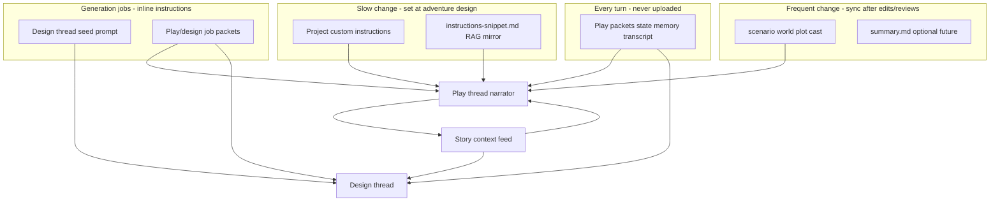

# Instruction vs Sources Delegation Paradigm

This document is the canonical reference for **what belongs in ChatGPT Project custom instructions**, **what belongs in Project source files**, **what stays in play packets**, and **how utility generation jobs split seed prompts vs guides**.

**Documentation hub:** [INDEX.md](INDEX.md)

> **Read order:** 1. This paradigm (theory) → 2. [Instruction Channels Glossary](instruction-channels.md) (terminology) → 3. [Instruction Contract Guide](instruction-contract-guide.md) (authoring) → 4. [Injection Policy ADR](injection-policy-adr.md) (normative assembly/dedup rules) → 5. [Prompt Construction Guide](prompt-construction-guide.md) (implementation) → 6. [Narrator Settings](narrator-settings.md) (runtime overrides)

Related docs: [adventure-panel.md](adventure-panel.md) · [adventure-developer-reference.md](adventure-developer-reference.md) · [instruction-channels.md](instruction-channels.md) · [instruction-contract-guide.md](instruction-contract-guide.md) · [injection-policy-adr.md](injection-policy-adr.md) · [user-projects-and-sync.md](user-projects-and-sync.md) · [data-model-reference.md](data-model-reference.md) · [services-reference.md](services-reference.md) · [architecture.md](architecture.md) · [INDEX.md — Adventures roadmap](INDEX.md#adventures-roadmap-phase-status)

---

## Four channels

ChatGPT Project context is not one blob. The wrapper treats it as **four channels**, each with a different change rate:

| Channel | Change rate | Purpose |
|---------|-------------|---------|
| **Project custom instructions** | Rare — when the narrator *contract* changes (perspective, tone, boundaries, style note) | Always-on play behavior; kept small enough for the instruction box |
| **Project source files** | Often — after scenario edits, entity/card review, lore expansion | Canonical world lore for RAG (not utility job schemas) |
| **Play packets** | Every send | Session delta only: rolling summary cache, state, pinned memory, transcript tail, resolved section pointers (`[[cgw:sources v="2"]]`) |
| **Play inline jobs** | On the pinned play thread | Built-in instruction defaults (code) with optional per-adventure overrides; inlined in job packet |
| **Design thread jobs** | On the pinned design thread | Seed on thread start/rotation; job packets for design/source work |

**Rule of thumb:**

- Defines *how to narrate* → **instructions**
- Defines *what the world is* → **sources**
- Reflects *what just happened in play* → **local** (`log.json`, `state.json`, packets), with optional export to sources after human review

`instructions-snippet.md` is a **RAG mirror** of the static instruction contract. It is not a second source of truth — Project custom instructions remain authoritative; the snippet exists so thin packets and retrieval can reference the same contract without inlining it every turn.

---

## Play narrator delegation matrix (target)

| Content | Project instructions | Source file | Play packet (delegated) | Play packet (inline fallback) | Play packet (minimal local) |
|---------|---------------------|-------------|------------------------|------------------------------|----------------------------|
| Narrator role contract | Yes | `instructions-snippet.md` (mirror) | Pointer only | Inline | Omit (short stub) |
| Perspective / tense / detail | Yes | Mirror in snippet | Omit (trust instructions) | Inline | Omit |
| Tone | Yes | Mirror | Omit | Inline | Omit |
| Content boundaries (global) | Yes | Mirror | Omit | Inline | Omit |
| Character portrayal rules | Yes | Mirror | Omit | Inline | Omit |
| Instruction addendum | Yes | Mirror | Omit | Inline | Omit |
| Author's note (style, no new facts) | Yes | Mirror | Omit | Inline | Omit |
| World rules | **No** | `world.md` | Omit (RAG) | Inline | Omit |
| Plot essentials | No | `plot.md` | Omit | Inline | Omit |
| Scenario / opening | No | `scenario.md` | Omit | Opening inline only | Opening inline only |
| Cast (player, party, NPCs) | No | `cast.md` | Omit (RAG via pointers) | Inline excerpts when scored | Omit |
| World/plot entries | No | `world.md` / `plot.md` | Omit | Inline excerpts when scored | Omit |
| Rolling summary | No | Optional `summary.md` (future) | Local cache | Local cache | Local cache |
| State / objectives | No | No | State delta | Current state | State delta |
| Pinned memory | No | No | Yes | Yes | Yes |
| Transcript tail | No | No | Yes (last 6 turns) | Yes (last 12 turns) | Yes (last 6 turns) |

Packet profiles are documented in [adventure-developer-reference.md §5](adventure-developer-reference.md#5-prompt-packets-three-profiles). Inline fallback inlines static lore when `ForceInlineLore` is on or the user proceeds after the publish warning.

---

## Generation jobs delegation matrix (target)

Utility jobs use **inline instructions** on the play or design thread — no separate utility tabs and no `*-guide.md` source files:

1. **Design thread seed** — full instruction body when the design thread is first used or rotated (`GenerationJobHandlers.BuildSeedPrompt` via `GenerationJobGuideService.ResolveInstructionBody`).
2. **Job packet** — adventure-specific payload per run plus the same instruction body inlined (`=== JOB GUIDE (inline) ===`), sent on the play thread (inline) or design thread (design jobs).

Built-in defaults live in `GenerationJobGuideService`. Users may customize per job in **Play settings → AI Actions**; **Reset to default** clears overrides. Utility jobs are independent of source publish readiness.

**Delivery orchestration:** Utility jobs use a readiness gate and tiered send (API vs atomic DOM). See [utility-job-orchestration.md](utility-job-orchestration.md).

| Job | Instruction source | Job packet (per run) | Merge target (local) |
|-----|-------------------|---------------------|---------------------|
| `extract_entities` | Built-in or override | Story context block + job payload + inline guide | `entities.json` |
| `propose_memories` | Built-in or override | Story context block + job payload + inline guide | `memory.json` |
| `update_summary` | Built-in or override | Story context block + job payload + inline guide | `summary.json` |
| `bootstrap_sections` / `expand_section` | Built-in or override | Section focus + inline guide | `entities.json`, `context-index.json`, canon export |
| `bootstrap_lore` / `expand_story_card` (legacy) | Built-in or override | Redirect when `UseSectionInjection` | `cards.json` |
| `continuity_check` | Built-in or override | Transcript + state + inline guide | Warnings tab |
| `generate_recap` | Built-in or override | Recent turns + inline guide | Display only |
| `propose_source_edits` | Built-in or override | User prompt + source excerpts + inline guide | Review queue → local scenario/sources |

Extraction rules for entities are **not** merged into narrator project instructions — they live in the utility channel only.

---

## Local JSON vs Project (summary)

Local JSON remains the **canonical play record** and **reviewed cache**. Project files are the **retrieval layer** ChatGPT uses at inference.

| Content | Project file / instructions | Local JSON |
|---------|----------------------------|------------|
| World bible, magic rules | `world.md` | `scenario.json` (edit UI) + `sources/` mirror |
| Cast / factions | `cast.md` | `entities.json` after review |
| Scenario / opening | `scenario.md` | `scenario.json` |
| Author's note / style | Project instructions + snippet mirror | `scenario.json` |
| Plot essentials | `plot.md` | `scenario.json` |
| Rolling summary | Optional `summary.md` (future) | `summary.json` + review |
| Oblique triggers | `context-index.json` | Merged into export; not uploaded to Project |
| Story cards (legacy) | — (migrate to sections) | `cards.json` until migrated |
| Play transcript | No | `log.json` |
| Per-turn state | No | `state.json` |
| Prompt audit | No | `prompt-history.json` |
| Job instruction overrides | No (adventure metadata only) | `UtilityJobGuideOverrides` + seed version in `UtilitySessions` |

---

## Publish workflow (manual only)

`AdventureSettings.SourcePublishMode` is **Manual** for all adventures (`ApiSync` is migrated to Manual on load).

| Step | Wrapper role | ChatGPT Project role |
|------|--------------|---------------------|
| **Manual publish** | Authoritative — export to `sources/`, user copies instructions and drags files | Published copy; user marks **Published** in Source Manager after upload |

Manual publish readiness: all **four core lore** files (`scenario.md`, `world.md`, `plot.md`, `cast.md`) have `ManuallyPublishedSha256` matching current local hash.

**Remote sync diagnostics** (Source Manager → **Remote sync diagnostics…**) is a repair/diagnostic tool only — not the primary publish workflow.

## Manual publish walkthrough

The wrapper is the **source of truth**. ChatGPT Project files are a **published copy** you maintain in the browser. Programmatic API sync is no longer a primary workflow — use **Remote sync diagnostics…** only when troubleshooting.

**Primary UI:** **Source Manager** (in-app walkthrough, history, probe, compare). Open it from:

- Play cockpit → **Publish sources…**
- Play settings → Sources → **Manage sources…**
- Projects workspace → Sources → **Manage sources…**
- Pre-send warning (manual mode) → **Yes**

The lightweight **Sources** tab remains a quick summary (status, last uploaded, project match, Published checkbox).

### Where canonical files live

| What | Canonical location |
|------|-------------------|
| Editable adventure data | `%LocalAppData%\ChatGPTWrapper\adventures\{adventure-id}\scenario.json`, `entities.json`, `cards.json`, … |
| Exported markdown (for ChatGPT) | `%LocalAppData%\ChatGPTWrapper\adventures\{adventure-id}\sources\*.md` |
| Version backups (on export overwrite) | `%LocalAppData%\ChatGPTWrapper\adventures\{adventure-id}\sources\.history\{file}\{timestamp}-{sha8}.md` |
| Last probe download (for compare) | `%LocalAppData%\ChatGPTWrapper\adventures\{adventure-id}\sources\.project-mirror\` + `probe-meta.json` |
| History index | `%LocalAppData%\ChatGPTWrapper\adventures\{adventure-id}\source-history.json` |
| Publish checklist state | `%LocalAppData%\ChatGPTWrapper\adventures\{adventure-id}\source-manifest.json` |

Open folders quickly: **Source Manager → Open canonical folder** / **Open history folder**, or **Play settings → Sources → Open sources folder**.

Typical files after export:

- `scenario.md`, `world.md`, `plot.md`, `cast.md` — play RAG lore (sectioned canon)
- `canon-format.md` — model-facing section/field reference (local + design prompts; optional Project upload). See [canon-schema.md](canon-schema.md).
- `narrator-scales.md` — narrator preset definitions (response length, detail, tone, difficulty, violence; auto-generated; optional Project upload). See [narrator-settings.md](narrator-settings.md#scale-definitions-narrator-scalesmd).
- `instructions-snippet.md` — mirror of narrator contract (optional upload; copy instructions to the settings box is the primary path)

### Pull sources into your ChatGPT Project

Use **Source Manager** (expand **How to publish** at the top for the same steps inline):

1. **Link a Project** (dashboard → Link Project) if you have not already.
2. **Refresh export** — writes/updates all `sources/*.md` from local JSON (older canonical copies are archived under `.history/` automatically).
3. **Instructions** — **Design instructions…** → define contract → **Generate instructions file** → **Copy instructions** → paste into ChatGPT Project → **Custom instructions** → **Mark instructions pasted** in Source Manager. See [instruction-contract-guide.md § Tutorial](instruction-contract-guide.md#tutorial-drafting-narrator-instructions).
4. **Files** — upload **`canon-format.md`** and **`narrator-scales.md`** (reference files), then lore files — drag or copy each source to ChatGPT Project → **Files** → **Mark uploaded** (or check **Published**).
5. **Optional verify** — **Probe project** downloads remote copies to `.project-mirror/`; **Compare with project** shows a line diff if **Project match** is Differ.
6. Readiness banner turns green when all lore files are published; play uses **source-delegated** (thin) packets. A probe differ warning is informational only — it does not block delegation.

### When local content changes

**Play / Reference edits:** Saving an entity runs **auto-sync** to local `sources/*.md` (export + cross-canon rename when applicable). When sync succeeds, a green banner offers **View diff** and **Open Source Manager**; the session status line shows **Sources out of sync — click to repair** only when drift remains. **Reconcile canon** opens when auto-sync cannot resolve drift (hand-edited sources, pull needed) — choose **Push to sources**, **Pull from sources**, or **Defer**. After push or pull, the next real play **Send** appends a one-shot canon-update block so the narrator re-retrieves affected sections; the flag clears on successful send. Manual Project upload is unchanged — mark **Published** in Source Manager after uploading. Full pipeline: [entity-canon-change-paradigm.md](entity-canon-change-paradigm.md) (CMD-232).

**Design / bulk:** Edit scenario/world/entities in the wrapper → **Refresh export** (previous canonical is backed up under `.history/`) → re-upload changed files to ChatGPT → mark **Published** again (row shows **Needs republish** until confirmed).

**Restore:** Source Manager → select file → **Version history** → **Restore version…** copies an archive back to canonical and clears Published for that file.

**Compare:** **Compare with project** (canonical vs last probe) or **Compare vs current** (archive vs canonical) opens the diff viewer.

### API sync (advanced only)

Switch **Publish mode** to **API sync** on the Sources tab to reveal **Sync via API…** and the legacy sync dialog. Use only if manual publish is impractical; browser file retrieval may still fail.

## Sync cadence

| Event | Instructions (manual) | Instructions (API) | Source export | Publish to Project |
|-------|----------------------|-------------------|---------------|-------------------|
| Create / link Project | Copy instructions | Push on create | Export on link | Drag files + checklist (manual) or API sync checkbox |
| Link existing | Copy instructions | Opt-in push | Refresh export | Same |
| Play settings OK | Copy if drift | `AutoSyncProjectInstructions` when hash changed | Refresh export on Sources tab | Mark published per file |
| Scenario / world / plot edit | Re-copy if instruction-domain changed | Hash-based push | Re-export | Re-drag + re-check published |
| Entity/card/memory review accept | No | No | Re-export affected files | Re-publish affected files |
| Before generation job | No | No | No | Instructions inlined in job packet (built-in or override) |
| Every play Send | No | No | No | No |

### Instruction-domain fields (smart sync)

These fields define the narrator contract and should trigger an instructions push when they change:

- `Perspective`, `Tense`, `DetailLevel`
- `Tone`, `ContentBoundaries`, `CharacterPortrayalRules`, `InstructionAddendum`
- `AuthorsNote`

See [instruction-contract-guide.md](instruction-contract-guide.md) for author workflow and examples.

These should **not** trigger an instructions push (sources + packets instead):

- `WorldRules`, `PlotEssentials`
- Entities, cards, summary, memory, transcript, state

---

## Where does new content go?

Use this checklist when adding or editing adventure material:

1. **Is it about voice, perspective, tone, or safety boundaries?**  
   → Project custom instructions (+ `instructions-snippet.md` mirror on next source export).

2. **Is it stable world lore (places, rules, cast bible, scenario setup)?**  
   → Relevant `*.md` source file → export → sync to Project.

3. **Is it a machine-readable schema for a generation job?**  
   → Built-in default in code; optional per-adventure override in **Play settings → AI Actions** (utility channel), not narrator instructions or Project source files.

4. **Did it just happen in the last turn or session?**  
   → Local JSON + next play packet. Optionally propose via a generation job, review, then export to sources.

5. **Is it verbatim transcript or audit history?**  
   → Local only (`log.json`, `prompt-history.json`). Never upload wholesale to the Project.

---

## Implementation

Enforced in code via:

- [`InstructionContractService.cs`](../ChatGPTWrapper/Adventure/Services/InstructionContractService.cs) — structured contract build/parse/sync (see [instruction-contract-guide.md](instruction-contract-guide.md))
- [`InstructionSourcesPolicy.cs`](../ChatGPTWrapper/Adventure/Services/InstructionSourcesPolicy.cs) — static instructions body, snippet mirror, instruction-domain hash, drift detection
- [`GenerationJobGuideService.cs`](../ChatGPTWrapper/Adventure/Services/GenerationJobGuideService.cs) — built-in instruction defaults, overrides resolver, effective seed versions
- [`AdventureProjectBindingService.BuildProjectInstructions`](../ChatGPTWrapper/Adventure/Services/AdventureProjectBindingService.cs) — delegates to policy (no world rules)
- [`PromptPacketBuilder`](../ChatGPTWrapper/Adventure/Services/PromptPacketBuilder.cs) — thin pointer-only instructions, `[[cgw:transcript]]` tail
- Play settings **AI Actions** tab — edit / reset per-job utility instructions
- [`SourceManagerDialog`](../ChatGPTWrapper/Views/SourceManagerDialog.xaml) — primary manual publish hub (walkthrough, instructions, files, history, probe, compare)
- Play settings **Sources** tab — lightweight summary (last uploaded, project match, Manage sources…)
- [`SourceFileHistoryService`](../ChatGPTWrapper/Adventure/Services/SourceFileHistoryService.cs) — `.history/` archives on export overwrite
- [`ProjectSourceProbeService`](../ChatGPTWrapper/Adventure/Services/ProjectSourceProbeService.cs) — download-only probe to `.project-mirror/`
- [`TextDiffService`](../ChatGPTWrapper/Adventure/Services/TextDiffService.cs) + [`SourceCompareDialog`](../ChatGPTWrapper/Views/SourceCompareDialog.xaml) — line diff viewer
- Play settings Sources tab + play status line — instruction drift hints (`LastProjectInstructionsSyncedHash`)

Metadata: `LastProjectInstructionsSyncedHash`, `InstructionsManuallyPublishedHash`, `UtilityJobGuideOverrides`, `SourcePublishMode`, `ManuallyPublishedSha256`, probe fields (`LastRemoteProbedAt`, `RemoteProbeMatch`, …) per manifest entry, `UtilityJobLastErrors`.
