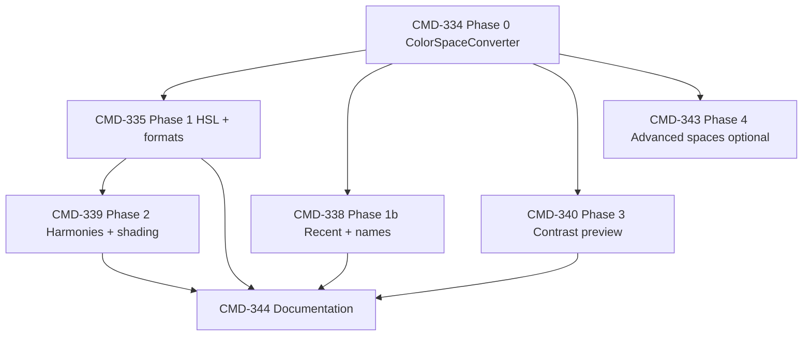

# Native Advanced Color Picker — Implementation Plan

**Linear epic:** [CMD-333](https://linear.app/cmd0112/issue/CMD-333)  
**Status:** Planning (Backlog)  
**Last updated:** 2026-06-25

---

## Executive summary

Extend the existing WPF `ThemeColorPickerDialog` (opened via `ColorPickerWorkflow.TryPickHex`) with [colorizer.org](https://colorizer.org/)-inspired capabilities **natively** — linked multi-space sliders, harmony swatches, a shading grid, contrast-on-background preview, recent colors, and copy-friendly format strings — while keeping the public contract **`#RRGGBB` hex out**, no network dependency, and no WebView embed.

This plan is structured for handoff to Cursor **Plan mode** or incremental PR execution.

---

## Problem statement

Today’s picker (`ThemeColorPickerDialog`) provides:

- HSV saturation/value plane + hue strip  
- RGB sliders + hex field  
- Preview swatch  

It is used from:

| Call site | File |
|-----------|------|
| Format → Colors | `ContinuousViewFormatDialog.xaml.cs` |
| Format → Highlights | `PhraseHighlightsEditorControl.xaml.cs` |
| Appearance & theme | `ThemeCustomizationDialog.xaml.cs` |
| Highlight assignment | `HighlightColorAssignmentDialog.xaml.cs` |
| Entity highlight color | `EntityEditFormHost.xaml.cs` |

**Gaps vs. author needs (and vs. colorizer.org’s useful subset):**

| Capability | Today | Target |
|------------|-------|--------|
| HSL tuning (shade/tint) | Internal HSV only | Linked HSL sliders |
| Harmony picks (complement, triad) | Only in auto-cast palette engine | Quick swatches in picker |
| Shading grid (L × S) | None | 5×5 mini-grid |
| Contrast on real background | `ThemeContrast` used elsewhere, not in picker | Inline ratio + Fix |
| Recent colors | None | Persisted in `ui-chrome.json` |
| Named colors (`cornflowerblue`) | Hex only | `ColorConverter` parse |
| Format copy (`rgb()`, `hsl()`) | Hex only | Read-only + copy buttons |
| CMYK / Lab / Munsell workbook | N/A | **Optional** read-only tab |

**Non-goals:** embedding colorizer.org; alpha channel app-wide; replacing `HighlightColorAssignmentDialog`.

---

## Architecture

### Integration boundary (do not break)

```text
ColorPickerWorkflow.TryPickHex(owner, initialHex, out selectedHex)
    └── ThemeColorPickerDialog(owner, initialHex)
            └── SelectedHex (#RRGGBB)
```

Phase 3 adds an **overload** only:

```csharp
TryPickHex(Window owner, string initialHex, string? contextBackgroundHex, out string selectedHex)
```

Existing single-argument call sites remain valid.

### Single source of truth for color state

```text
                    ┌─────────────────────┐
                    │  ColorSpaceConverter │
                    │  (RGB canonical)     │
                    └──────────┬──────────┘
                               │
     ┌─────────────────────────┼─────────────────────────┐
     ▼                         ▼                         ▼
 SV plane + hue          RGB / HSL sliders          Harmony + shading
     │                         │                         │
     └─────────────────────────┴─────────────────────────┘
                               │
                    SetColorFromRgb(color, updatePickers)
                               │
                    Preview + hex + formats + contrast
```

All UI controls sync from one `System.Windows.Media.Color`. Use existing `_suppressEvents` guard to prevent feedback loops.

### Code consolidation

| Current location | Action |
|------------------|--------|
| `ThemeColorPickerDialog.xaml.cs` — private `RgbToHsv`, `HsvToRgb`, `TryParseColor` | Move to `ColorSpaceConverter` |
| `HighlightColorMath.cs` — HSL, `RotateHue`, `Lighten`, … | Promote to `ColorSpaceConverter`; keep thin wrapper or delete |
| `HighlightColorAssignmentEngine.cs` | Continue using converter; no palette logic in picker |
| `ThemeContrast.cs` | Reuse for ratio display + Fix button in Phase 3 |

**New file:** `ChatGPTWrapper/Theme/ColorSpaceConverter.cs`  
**Tests:** `tests/ChatGPTWrapper.ApiDiagnostics/Unit/ColorSpaceConverterTests.cs`

### Persistence (Phase 1b)

Add to `UiChromeSettings`:

```csharp
public List<string> RecentPickerColors { get; set; } = [];
```

- Cap: 12 entries, dedupe on insert (most recent first)  
- Save via existing `UiChromeStore` on OK  
- No migration needed (empty list default)

### UI layout (progressive disclosure)

Default collapsed state should match **today’s compact height** (~360×auto).

```text
┌─ Pick color ─────────────────────────────────────┐
│  [SV plane]                                      │
│  [Hue strip]                                     │
│  [Preview]  Hex [________]                       │
│  R [slider] [___]  G [...]  B [...]              │
│  ▸ More tuning…                                  │  ← collapsed
│  [Recent swatches × 12]                          │
│                          [Cancel]  [OK]            │
└──────────────────────────────────────────────────┘

Expanded “More tuning”:
│  HSL  H [slider] S [...] L [...]                 │
│  Formats  hex | rgb() | hsl()  [copy icons]      │
│  Harmonies  [◉][◉][◉][◉][◉]                      │
│  Shading    [5×5 grid]                           │
│  On background [bg swatch]  Ratio 4.2:1 ⚠        │
│  [Fix contrast]                                  │
```

Use `Expander` controls with shell styles (`ShellSectionHeaderStyle`, `RadiusControl`, `ShellCardStyle`).

---

## Phased delivery

### Phase 0 — `ColorSpaceConverter` extraction

**Issue:** [CMD-334](https://linear.app/cmd0112/issue/CMD-334)  
**Blocks:** all other phases  
**Estimate:** 1 PR, ~2–4h  

**Tasks:**

1. Create `ColorSpaceConverter` with public static APIs (see Architecture).  
2. Refactor `ThemeColorPickerDialog` to call converter.  
3. Refactor `HighlightColorMath` to delegate to converter (or inline-delete).  
4. Add xUnit round-trip tests (RGB↔HSV, RGB↔HSL, named color parse).  

**Acceptance:** existing picker behavior unchanged; tests green.

---

### Phase 1 — HSL channels + format readouts

**Issue:** [CMD-335](https://linear.app/cmd0112/issue/CMD-335)  
**Depends on:** CMD-334  
**Estimate:** 1 PR, ~4–6h  

**Tasks:**

1. Add collapsible HSL slider group to `ThemeColorPickerDialog.xaml`.  
2. Wire `HslSlider_ValueChanged` → `ColorSpaceConverter.HslToRgb` → `SetColorFromRgb`.  
3. Add read-only format row with clipboard copy (`Clipboard.SetText`).  
4. Widen dialog to ~400px; keep `SizeToContent=Height`.  

**Acceptance:** dragging SV plane updates HSL; typing HSL updates plane thumb.

---

### Phase 1b — Recent colors + flexible input

**Issue:** [CMD-338](https://linear.app/cmd0112/issue/CMD-338)  
**Depends on:** CMD-334  
**Can parallel:** with CMD-335 after Phase 0  

**Tasks:**

1. Extend `UiChromeSettings` + store with `RecentPickerColors`.  
2. Render swatch strip; click → `SetColorFromRgb`.  
3. On OK, push `SelectedHex` to recent list and persist chrome.  
4. Enhance hex `TextChanged` to use `ColorSpaceConverter.TryParseColor` (named colors).  

**Acceptance:** recent colors survive app restart.

---

### Phase 2 — Harmony swatches + shading grid

**Issue:** [CMD-339](https://linear.app/cmd0112/issue/CMD-339)  
**Depends on:** CMD-334, CMD-335  

**Tasks:**

1. **Harmonies** — generate via `RotateHue`:
   - Complement: +180°  
   - Analogous: −30°, 0°, +30°  
   - Triad: 0°, +120°, +240°  
2. Render as clickable `Border` swatches (reuse pattern from `PhraseHighlightsEditorControl.BuildSwatches`).  
3. **Shading grid** — 5×5 `UniformGrid`; cell (col, row) maps to:
   - `lightness = 0.15 + col * 0.175` (0.15–0.85)  
   - `saturation = 0.2 + row * 0.2` (0.2–1.0)  
   - fixed current hue  
4. Hover: `ToolTip` with hex; click: apply color.  

**Acceptance:** harmony click replaces active color; grid respects current hue.

---

### Phase 3 — Context background + contrast warnings

**Issue:** [CMD-340](https://linear.app/cmd0112/issue/CMD-340)  
**Depends on:** CMD-334  
**Priority:** High (pairs with [CMD-308](https://linear.app/cmd0112/issue/CMD-308))  

**Tasks:**

1. Add `ColorPickerWorkflow.TryPickHex(..., string? contextBackgroundHex, ...)`.  
2. Pass `contextBackgroundHex` into dialog constructor.  
3. Default background: active theme `BgBase` from `ThemeSettings` / working chrome.  
4. **Call-site threading:**
   - `PhraseHighlightsEditorControl` — pass user or assistant segment bg from format settings when picking text/background rule colors.  
   - `ContinuousViewFormatDialog` — pass relevant token surface for token being edited.  
   - `ThemeCustomizationDialog` — pass target surface token bg.  
5. UI: split preview (solid + sample text on bg); ratio label; warning if `< ThemeContrast.MinBodyRatio`; **Fix contrast** → `ThemeContrast.EnsureReadable`.  

**Acceptance:** light-on-light pick shows warning; Fix returns readable hex.

---

### Phase 4 — Advanced color spaces (optional)

**Issue:** [CMD-343](https://linear.app/cmd0112/issue/CMD-343) — **Icebox / Optional**  
**Depends on:** CMD-334  

Read-only CMYK, CIELab, explicit HSV labels, nearest CSS color name. Not required for epic sign-off.

---

### Documentation

**Issue:** [CMD-344](https://linear.app/cmd0112/issue/CMD-344)  
**Depends on:** CMD-335, CMD-338, CMD-339, CMD-340 (or ship incrementally)  

Update `docs/user-guide.md` and `docs/settings-interactables-inventory.md`.

---

## Dependency graph



**Recommended execution order:** P0 → P1 ∥ P1b → P2 → P3 → DOC (P4 anytime if desired).

---

## Testing strategy

| Layer | Coverage |
|-------|----------|
| **Unit** | `ColorSpaceConverterTests` — round-trips, greys, hue wrap, named colors |
| **Unit** | Harmony hue angles produce expected hex (snapshot or golden values) |
| **Manual QA** | Open picker from Format Colors, Highlights, Appearance & theme, Entity editor |
| **Manual QA** | Collapsed default height ≈ current dialog |
| **Manual QA** | Contrast warning on phrase highlight pick against assistant bg |
| **Regression** | All `TryPickHex` call sites still compile and return valid hex |

Label picker issues **Needs Manual QA**; Phase 0 **Has Tests**.

---

## Risk register

| Risk | Mitigation |
|------|------------|
| Dialog too tall when expanded | Progressive disclosure; collapsed by default |
| Feedback loops between sliders | Keep `_suppressEvents`; single `SetColorFromRgb` entry |
| Duplicated math vs. cast palette | One `ColorSpaceConverter`; engine unchanged |
| Breaking chrome JSON | New list field with empty default |
| Over-scoping colorizer clone | Explicit out-of-scope list; CMD-343 optional |

---

## Future work (not in epic)

- Alpha channel + `#AARRGGBB` support app-wide  
- Math expressions in numeric fields (`100*1.5`)  
- HSL plane (2D) as alternative to HSV plane  
- Dedicated “Color tools” window separate from pick modal  
- Web color name database beyond nearest-match heuristic  

---

## PR strategy

| PR | Issues | Branch prefix |
|----|--------|---------------|
| 1 | CMD-334 | `cmd-334-colorspace-converter` |
| 2 | CMD-335 | `cmd-335-picker-hsl-formats` |
| 3 | CMD-338 | `cmd-338-picker-recent-colors` |
| 4 | CMD-339 | `cmd-339-picker-harmonies-shading` |
| 5 | CMD-340 | `cmd-340-picker-contrast` |
| 6 | CMD-344 | `cmd-344-picker-docs` |
| opt | CMD-343 | `cmd-343-picker-advanced-spaces` |

Use `Ref CMD-XX` in PR bodies (manual QA on dialog changes).

---

## Related issues & docs

| Link | Role |
|------|------|
| [CMD-333](https://linear.app/cmd0112/issue/CMD-333) | Epic |
| [CMD-254](https://linear.app/cmd0112/issue/CMD-254) | Settings UX program parent |
| [CMD-111](https://linear.app/cmd0112/issue/CMD-111) | Theme customization epic |
| [CMD-146](https://linear.app/cmd0112/issue/CMD-146) | Baseline format color picking |
| [CMD-308](https://linear.app/cmd0112/issue/CMD-308) | Format readability diagnostics |
| [CMD-274](https://linear.app/cmd0112/issue/CMD-274) | Unreadable highlight fix |
| `docs/user-guide.md` | Author-facing picker docs (post-CMD-344) |

---

## Plan tool checklist

When executing in Plan mode, use this ordered checklist:

- [ ] **CMD-334** — Extract `ColorSpaceConverter`; refactor dialog + `HighlightColorMath`; unit tests  
- [ ] **CMD-335** — HSL sliders + format readouts (collapsed expander)  
- [ ] **CMD-338** — Recent colors persistence + named color hex input  
- [ ] **CMD-339** — Harmony swatches + shading grid  
- [ ] **CMD-340** — `TryPickHex` overload + contrast preview + call-site backgrounds  
- [ ] **CMD-344** — User guide + interactables inventory  
- [ ] **CMD-343** (optional) — CMYK/Lab readouts  
- [ ] Epic **CMD-333** sign-off criteria verified  
