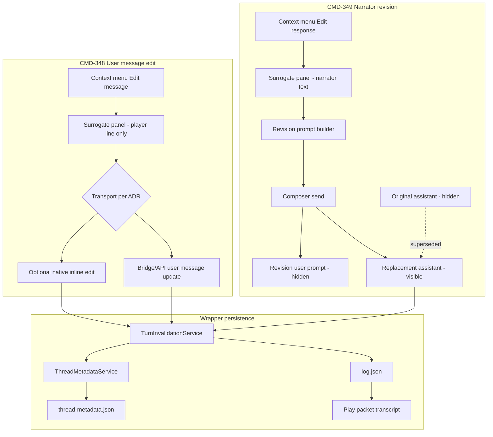
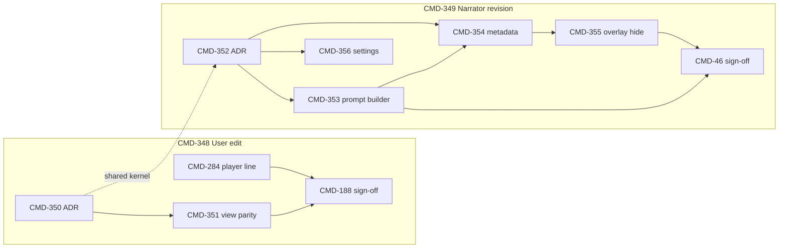

# Play Message Edit Refinement — Implementation Plan

Comprehensive execution plan for:

- **[CMD-348](https://linear.app/cmd0112/issue/CMD-348)** — User message edit reliability across transcript view modes
- **[CMD-349](https://linear.app/cmd0112/issue/CMD-349)** — Model response revision via composer prompt and message hiding

**Normative baseline:** [play-thread-canonical-adr.md](../adr/play-thread-canonical-adr.md) (symmetric tail invalidation, thread-canonical play).

**Companion ADRs (deliverables):**

| ADR | Issue | Scope |
|-----|-------|-------|
| Overlay-first user edit | [CMD-350](https://linear.app/cmd0112/issue/CMD-350) | When to use surrogate vs native automation per view mode |
| Narrator revision + hiding | [CMD-352](https://linear.app/cmd0112/issue/CMD-352) | Revision prompt contract, message roles, hiding rules |

**Builds on (first batch — Done — Review Later):** [CMD-164](https://linear.app/cmd0112/issue/CMD-164), [CMD-187](https://linear.app/cmd0112/issue/CMD-187), [CMD-188](https://linear.app/cmd0112/issue/CMD-188), [CMD-280](https://linear.app/cmd0112/issue/CMD-280), [CMD-282](https://linear.app/cmd0112/issue/CMD-282), [CMD-283](https://linear.app/cmd0112/issue/CMD-283), [CMD-284](https://linear.app/cmd0112/issue/CMD-284) (regression open).

**Related:** [CMD-46](https://linear.app/cmd0112/issue/CMD-46) (invalidation semantics) · [CMD-331](https://linear.app/cmd0112/issue/CMD-331) (utility message hiding — pattern reference) · [adventure-panel.md](../user/adventure-panel.md) · [services-reference.md](../reference/services-reference.md)

---

## Executive summary

### Problem

The first thread-canonical edit batch assumed **native ChatGPT inline edit** (`tryNativeEdit`) would work from Continuous and Weave overlays. Production use shows:

| Symptom | Epic |
|---------|------|
| **Edit message** warps UI into native peek (`data-cgw-continuous-peek`, overlay teardown) | CMD-348 |
| User edit **only succeeds reliably in Native** transcript mode | CMD-348 |
| Adventure context chrome pollutes edit seed text ([CMD-284](https://linear.app/cmd0112/issue/CMD-284)) | CMD-348 |
| **Edit response** depends on native assistant edit that ChatGPT does not durably support | CMD-349 |
| Composer revision is a **fallback** with visible clutter (revision user prompt + original assistant) | CMD-349 |
| Hiding uses **sessionStorage queue** keyed by prompt prefix — not persisted metadata | CMD-349 |

### Product direction

**Two parallel tracks** with shared infrastructure (turn registry, invalidation, transcript kernel):

| Track | Primary transport | Author sees |
|-------|-------------------|-------------|
| **User message edit** | Overlay-first: surrogate panel → targeted thread update **without mandatory peek**; native inline edit optional/gated | Same transcript view mode throughout |
| **Narrator response edit** | **Composer revision as primary**: scoped user prompt → replacement assistant output | Edited narrator line only; original + revision prompt hidden by default |

### What success looks like

- Edit message works in **Native, Continuous, and Weave** without switching modes.
- Edit response always uses designed revision prompt; replacement narrator text is canonical in `log.json` and overlays.
- Original assistant message and revision user prompt are **hidden by default** with persisted metadata linkage (not session-only heuristics).
- Tail invalidation and `[[cgw:transcript]]` remain coherent ([CMD-46](https://linear.app/cmd0112/issue/CMD-46), [CMD-280](https://linear.app/cmd0112/issue/CMD-280)).
- Both epics meet sign-off criteria on CMD-348 and CMD-349.

---

## Current state (baseline)

### Already in place (reuse, do not rewrite)

| Area | Evidence | Refinement use |
|------|----------|----------------|
| Shared edit kernel | `cgw-transcript-interactions.js` — `postTurnInvalidated`, `assignPlayPairIndices`, `confirmComposerFallback`, `buildSupersedeWarning` | Extend; keep bridge contract |
| Surrogate edit panel | `continuous-transcript-view.js` — `openSurrogateEditPanel`, `submitSurrogateEdit` | User + narrator entry; demote peek for user path |
| Native edit automation | `tryNativeEdit` → `revealNativeTurnForPeek` → DOM edit button → populate surface | Gate or remove as default in overlay modes |
| Composer revision (fallback) | `buildRevisionPrompt`, `submitComposerRevision`, `REVISION_PROMPT_PREFIX` | Promote to primary for narrator; refine prompt |
| Revision hide (ephemeral) | `__cgwRevisionHideQueue` + `shouldHideTurn` + `recordRevisionHide` | Replace with metadata-driven hiding ([CMD-354](https://linear.app/cmd0112/issue/CMD-354)) |
| Turn invalidation (C#) | `TurnInvalidationService.HandleDomTurnInvalidated` — user + narrator paths, tail trim | Extend for revision message capture |
| Turn registry | `ThreadMetadataService.BuildLogTurnLinkMap`, `__cgwTurnRegistry`, `logTurnIndex` | Required for both tracks |
| Invalidation marker | `[[cgw:invalidation turn="N"]]` in `PromptInjectionService` | Keep; tighten narrator revision specificity |
| Hide setting | `HideAssistantEditArtifacts` → `__cgwHideAssistantEditArtifacts` | Extend for revision artifact taxonomy ([CMD-356](https://linear.app/cmd0112/issue/CMD-356)) |
| Player line extraction (display) | `cgw-packet-display.js` — `sanitizeExtractedMessageText`, `collectNativeUserMessageText` | Align `segmentPlainText` with this path ([CMD-284](https://linear.app/cmd0112/issue/CMD-284)) |
| Unit tests | `EditInvalidationTests` | Extend for revision roles + user edit paths |
| Weave context menu | `weave-transcript-view.js` binds kernel via `bindContextMenuOnContainer` | Same parity requirements as Continuous |

### Known gaps (motivation for refinement)

| Gap | Symptom | Primary owner |
|-----|---------|---------------|
| Peek-first user edit | `submitSurrogateEdit` always calls `tryNativeEdit` first; peek reveals native bubble | CMD-351 |
| `segmentPlainText` naive | `innerText` on whole segment includes `.cgw-continuous-packet-context` | CMD-284 |
| Native assistant edit assumed | `tryNativeEdit(..., "assistant")` before composer fallback | CMD-353 |
| Revision prompt over-broad | `"Please replace your previous response with the following text exactly:"` — no turn-scoped disregard | CMD-352, CMD-353 |
| Hide queue not durable | `sessionStorage` + prefix match; lost on reload; hides wrong user messages sometimes | CMD-354, CMD-355 |
| No revision message roles | `ThreadMessageRecord` lacks `RevisionRole` / linkage ids | CMD-354 |
| Composer fallback posts invalidation early | `postTurnInvalidated` on send, not on capture of replacement assistant | CMD-353, CMD-354 |
| ADR stale on transport | `play-thread-canonical-adr.md` still says "native assistant edit preferred" | CMD-350, CMD-352 |

---

## Target architecture

### Message flow overview

### User edit transport decision (lock in CMD-350 ADR)

Evaluate and document **one primary path per view mode**:

| Mode | Recommended default | Rationale |
|------|---------------------|-----------|
| **Native** | Native inline edit OR surrogate → native | No overlay; peek acceptable |
| **Continuous** | Surrogate → **non-peek** submit (API or gated native) | Peek warps reading experience |
| **Weave** | Same as Continuous | Shared kernel |

**ADR must decide** among:

1. **A — Surrogate-only in overlay modes:** Panel submit updates thread via ChatGPT API / bridge command without `revealNativeTurnForPeek`. Native edit only when author explicitly switches to Native view.
2. **B — Gated native:** Attempt `tryNativeEdit` only when DOM signals edit surface is already open; never enter peek from overlay modes.
3. **C — Composer user-message repair:** For failures, reuse `PlaySendRepairService` pattern (copy packet + invalidation marker) as explicit fallback with author confirm.

**Recommendation for spike:** **A for Continuous/Weave**, **native inline for Native view** — minimizes ChatGPT Fragile DOM coupling in overlay modes.

### Narrator revision message taxonomy (lock in CMD-352 ADR)

Proposed `ThreadMessageRecord` extensions:

| Field | Purpose |
|-------|---------|
| `MessageKind` | `play_user` \| `play_assistant` \| `narrator_revision_prompt` \| `narrator_original` \| `narrator_replacement` \| utility… |
| `RevisionGroupId` | UUID linking original + prompt + replacement for turn *N* |
| `SupersedesMessageId` | ChatGPT message id of message this record replaces |
| `LinkedTurnId` | Existing — `TurnRecord.Id` |

**Hiding rule (default on):** Display pipeline shows `narrator_replacement` (or active assistant for turn) and hides `narrator_original` + `narrator_revision_prompt` when `HiddenInDisplay` or kind filter applies.

### Revision prompt contract (sketch — normative in CMD-352)

Goals:

- Tell model to output **only** the edited narrator text (no preamble).
- **Turn-scoped** invalidation: disregard the assistant message for turn *N* and all turns after *N* in wrapper canon — **not** "ignore entire conversation."
- Include `[[cgw:invalidation turn="N"]]` as first line (existing).
- Optionally reference turn context (player line snippet) for disambiguation when multiple similar responses exist.

**Anti-patterns to avoid:**

- "Ignore everything above" (over-broad).
- "Forget the story so far" (breaks continuity).
- Embedding full transcript in revision prompt (duplication vs CMD-292).

---

## Execution phases

### Dependency graph

**Parallelism:** ADR spikes (CMD-350, CMD-352) can run in parallel. CMD-284 can start immediately (no ADR dependency). CMD-349 implementation blocked on CMD-352.

---

## Phase 0 — ADR spikes (both epics)

### CMD-350 — Overlay-first user message edit strategy

**Deliverable:** `docs/adr/user-message-edit-adr.md` (or section in `play-thread-canonical-adr.md`).

**Decisions to lock:**

- [ ] Primary transport per `TranscriptViewMode`
- [ ] Whether peek mode is ever entered from Continuous/Weave
- [ ] Player-line extraction canonical function (shared with packet display)
- [ ] Failure UX when submit cannot reach thread
- [ ] Relationship to `PlaySendRepairService` clipboard repair

**Acceptance:** Open questions for CMD-351 / CMD-284 resolved or explicitly deferred.

### CMD-352 — Narrator revision prompt and message hiding contract

**Deliverable:** `docs/adr/narrator-revision-adr.md`.

**Decisions to lock:**

- [ ] `MessageKind` / linkage field names and migration
- [ ] Revision prompt template (exact wording + invalidation scope)
- [ ] When `postTurnInvalidated` fires (on send vs on replacement capture)
- [ ] Default hide behavior vs settings ([CMD-356](https://linear.app/cmd0112/issue/CMD-356))
- [ ] Relationship to `[[cgw:invalidation]]` and [CMD-46](https://linear.app/cmd0112/issue/CMD-46)
- [ ] Reuse patterns from [CMD-331](https://linear.app/cmd0112/issue/CMD-331) utility hiding

**Acceptance:** CMD-353, CMD-354, CMD-355 unblocked.

---

## Phase 1 — CMD-348 User message edit (can overlap Phase 0)

### CMD-284 — Player-line-only seed text (quick win)

**Priority:** High — active regression; can ship before ADR.

| Task | File(s) | Notes |
|------|---------|-------|
| Extract `playerLineFromSegment(segment)` | `continuous-transcript-view.js` | Strip `.cgw-continuous-packet-context`; prefer `__cgwTurnRegistry[turnId].playerSnippet` |
| Reuse packet-display helpers | `cgw-packet-display.js` | Import or duplicate `sanitizeExtractedMessageText` / player-line logic into shared helper (e.g. `cgw-transcript-text.js` if needed — keep minimal) |
| Fix Copy action | `continuous-transcript-view.js` context menu | Same extraction as edit seed |
| Weave parity | `weave-transcript-view.js` / kernel | Verify embed blocks use same helper |
| Tests | JS unit or integration smoke | Segment fixture with packet context node |

**Acceptance:** Surrogate panel and Copy never include "Adventure context" chrome.

### CMD-351 — Preserve transcript view mode during user message edit

**Depends on:** CMD-350 (transport decision).

| Task | File(s) | Notes |
|------|---------|-------|
| Gate `tryNativeEdit` in overlay modes | `continuous-transcript-view.js` `submitSurrogateEdit` | Skip peek when `__cgwContinuousViewEnabled` or Weave active |
| Implement ADR-chosen transport | `continuous-transcript-view.js`, `adventure-bridge.js`, possibly C# | API/bridge path for user message update if ADR selects A |
| Peek cleanup on cancel/fail | `exitPeekMode`, `closeSurrogateEditPanel` | No stuck `data-cgw-continuous-peek` |
| Error surfacing | surrogate panel | Actionable message, not silent reopen |
| Streaming guard | existing context menu disable | Preserve |

**Acceptance:** Edit message completes in Continuous + Weave without view mode change.

### CMD-188 — Integration sign-off

Run combined QA script (CMD-284 + CMD-351 + CMD-280 + CMD-282). Mark **Verified** on close.

---

## Phase 2 — CMD-349 Narrator revision core

### CMD-353 — Primary revision prompt builder

**Depends on:** CMD-352.

| Task | File(s) | Notes |
|------|---------|-------|
| Replace `REVISION_PROMPT_PREFIX` with ADR template | `continuous-transcript-view.js` or new `cgw-revision-prompt.js` | Turn-scoped wording |
| Demote `tryNativeEdit` for assistant | `submitSurrogateEdit` | Composer revision first; remove native-first for `assistant` role |
| Author confirm before send | `cgw-transcript-interactions.js` `confirmComposerFallback` | Rename/generalize to `confirmRevisionSend` |
| Capture replacement on stream complete | `cgw-conversation-stream.js` or bridge handler | Defer `postTurnInvalidated` until replacement text known |
| C# handler | `TurnInvalidationService`, `MainWindow.TurnInvalidation.cs` | Accept `revisionGroupId`, message ids from bridge |
| Tests | `EditInvalidationTests` | Composer revision path |

**Acceptance:** Edit response sends revision prompt; `log.json` narrator text updated after replacement captured.

### CMD-354 — Per-message linkage metadata

**Depends on:** CMD-352.

| Task | File(s) | Notes |
|------|---------|-------|
| Extend `ThreadMessageRecord` | `ThreadMessageRecord.cs` | `MessageKind`, `RevisionGroupId`, `SupersedesMessageId` (names per ADR) |
| Migration | `EntitiesDocumentMigration` or thread metadata migration | Default kind for existing records |
| Record on revision completion | `ThreadMetadataService` | Write original, prompt, replacement linkage |
| Resolve narrator for display/packet | `PlayTurnScopeService`, `TurnInvalidationService` | Prefer replacement body |
| Reconcile on load | `ThreadMetadataReconcileService` | Match thread messages to stored ids |
| Tests | New xUnit | Linkage round-trip |

**Acceptance:** `thread-metadata.json` contains revision group for edited turn; survives reload.

### CMD-46 — Invalidation semantics sign-off

Verify packet preview `[[cgw:transcript]]` after revision; invalidation marker ordinal. Parent of CMD-280 — re-run QA under CMD-349 context.

---

## Phase 3 — CMD-349 Hiding and settings

### CMD-355 — Hide revision artifacts in overlays

**Depends on:** CMD-354.

| Task | File(s) | Notes |
|------|---------|-------|
| Replace `__cgwRevisionHideQueue` | `continuous-transcript-view.js` | Read `HiddenInDisplay` / `MessageKind` from pushed metadata map |
| Push metadata map to WebView | `ThreadMetadataService`, `ChatGptContinuousViewInjection` | New `__cgwThreadMessageDisplayMap` or extend link map |
| Weave hiding | `weave-transcript-view.js` | Same filter when assembling blocks |
| Native / CV-off | `cgw-packet-display.js` | Hide revision artifacts in turn pairing |
| Turn pairing preserved | segment builder | Utility exclusion unchanged |

**Acceptance:** Default view shows one narrator line per turn after revision; original + prompt hidden.

### CMD-356 — Format settings for revision visibility

| Task | File(s) | Notes |
|------|---------|-------|
| Clarify labels | `ContinuousViewFormatDialog.xaml` | Distinguish "hide revision prompts" vs "hide utility traffic" |
| Persist | `TranscriptViewModeSettings`, `ui-chrome.json` | Per-mode if needed |
| Apply | `ChromePreferencesApplier`, `ChatGptContinuousViewInjection` | Push to WebView |
| Docs | `user-guide.md`, `adventure-panel.md` | Author-facing explanation |

**Acceptance:** Toggle shows/hides revision artifacts for debugging.

---

## File inventory (primary touch points)

| File | CMD-348 | CMD-349 |
|------|---------|---------|
| `ChatGPT_files/continuous-transcript-view.js` | ●●● | ●●● |
| `ChatGPT_files/cgw-transcript-interactions.js` | ●● | ●● |
| `ChatGPT_files/cgw-packet-display.js` | ●● | ● |
| `ChatGPT_files/weave-transcript-view.js` | ●● | ●● |
| `ChatGPT_files/adventure-bridge.js` | ● | ● |
| `ChatGPT_files/cgw-conversation-stream.js` | | ● |
| `ChatGPTWrapper/Adventure/Services/TurnInvalidationService.cs` | ● | ●● |
| `ChatGPTWrapper/Adventure/Services/ThreadMetadataService.cs` | ● | ●●● |
| `ChatGPTWrapper/Adventure/Models/ThreadMessageRecord.cs` | | ●● |
| `ChatGPTWrapper/MainWindow.TurnInvalidation.cs` | ● | ●● |
| `ChatGPTWrapper/ChatGptContinuousViewInjection.cs` | ● | ●● |
| `ChatGPTWrapper/ContinuousViewFormatDialog.xaml(.cs)` | | ● |
| `tests/.../EditInvalidationTests.cs` | ● | ●● |
| `docs/adr/play-thread-canonical-adr.md` | ● | ● |
| `docs/adr/user-message-edit-adr.md` | ● (new) | |
| `docs/adr/narrator-revision-adr.md` | | ● (new) |

---

## Issue map (full tree)

### CMD-348 — User message edit

| Issue | Phase | Depends on | Est. sessions |
|-------|-------|------------|---------------|
| [CMD-350](https://linear.app/cmd0112/issue/CMD-350) ADR | 0 | — | 1 |
| [CMD-284](https://linear.app/cmd0112/issue/CMD-284) Player-line-only | 1 | — | 0.5–1 |
| [CMD-351](https://linear.app/cmd0112/issue/CMD-351) View-mode parity | 1 | CMD-350 | 2–3 |
| [CMD-188](https://linear.app/cmd0112/issue/CMD-188) Sign-off | 1 | CMD-284, CMD-351 | 0.5 (QA) |

### CMD-349 — Narrator revision

| Issue | Phase | Depends on | Est. sessions |
|-------|-------|------------|---------------|
| [CMD-352](https://linear.app/cmd0112/issue/CMD-352) ADR | 0 | — | 1 |
| [CMD-353](https://linear.app/cmd0112/issue/CMD-353) Prompt builder | 2 | CMD-352 | 2–3 |
| [CMD-354](https://linear.app/cmd0112/issue/CMD-354) Metadata linkage | 2 | CMD-352 | 2–3 |
| [CMD-355](https://linear.app/cmd0112/issue/CMD-355) Overlay hiding | 3 | CMD-354 | 2–3 |
| [CMD-356](https://linear.app/cmd0112/issue/CMD-356) Format settings | 3 | CMD-352 | 1 |
| [CMD-46](https://linear.app/cmd0112/issue/CMD-46) Sign-off | 2–3 | CMD-353, CMD-280 | 0.5 (QA) |

**Suggested pick-up order:**

1. CMD-284 (regression fix, unblocks author testing)
2. CMD-350 + CMD-352 (ADRs in parallel)
3. CMD-351 (user edit transport)
4. CMD-353 + CMD-354 (narrator core, parallel after ADR)
5. CMD-355 + CMD-356 (hiding + settings)
6. CMD-188 + CMD-46 + epic sign-offs

---

## Test strategy

### Automated

| Area | Tests |
|------|-------|
| Tail invalidation | Extend `EditInvalidationTests` — user edit, narrator revision, regenerate |
| Player-line extraction | New tests for segment helper (fixture HTML or extracted function) |
| Metadata linkage | xUnit for `ThreadMessageRecord` migration, revision group write, `ActiveMessages` filter |
| Revision prompt | Unit test prompt shape: marker line, turn number, no forbidden phrases |

### Manual QA (required — **Needs Manual QA** on all implementation children)

**Prerequisites for every session:**

- Linked ChatGPT Project adventure, 5+ accepted turns
- Continuous, Weave, and Native modes available
- Build hash recorded in QA comment

#### User edit script (CMD-348)

1. **Continuous** — Edit turn 2 user message; verify view stays Continuous, `log.json` player text updated, tail trimmed.
2. **Weave** — Repeat on player embed.
3. **Native** — Repeat; confirm still works.
4. **Adventure context** — Expandable context on; edit seed is player line only ([CMD-284](https://linear.app/cmd0112/issue/CMD-284)).
5. **Cancel** — No stuck peek/surrogate.
6. **Streaming** — Edit disabled while generating.

#### Narrator revision script (CMD-349)

1. **Edit response** turn 2 of 5 — confirm dialog, revision sends, replacement visible.
2. **Hidden artifacts** — Original assistant + revision user prompt not visible (default settings).
3. **Show artifacts toggle** — Revision machinery visible for debug.
4. **Reload** — Hiding and `log.json` narrator text persist.
5. **Packet preview** — `[[cgw:transcript]]` shows replacement only; tail trimmed.
6. **Model behavior** — Subjective: model follows edited text without losing unrelated prior context (note in QA comment).

---

## Risks and mitigations

| Risk | Mitigation |
|------|------------|
| ChatGPT removes user-message edit API/DOM | ADR documents fallback (repair packet, Native-only path) |
| Replacement assistant not captured reliably | Hook stream completion; timeout + author retry |
| Over-broad invalidation confuses model | CMD-352 review; golden prompt examples; QA checklist |
| Metadata ↔ DOM id drift | Reconcile on load; utility message exclusion tests ([CMD-282](https://linear.app/cmd0112/issue/CMD-282)) |
| Weave renderer lag | CMD-351 includes Weave in same PR or immediate follow-up |
| Scope creep into CMD-331 utility hiding | Share patterns only; do not merge codepaths in v1 |

---

## Open questions (resolve in ADR spikes)

1. **User edit API:** Does `ChatGptConversationSendService` or bridge support in-place user message edit, or must we use native DOM / repair packet?
2. **Revision capture timing:** Invalidate on composer send or on first token of replacement assistant?
3. **Multiple revisions of same turn:** Supersede prior revision group or chain `SupersedesMessageId`?
4. **Native view narrator edit:** Composer-only everywhere, or keep native attempt in Native mode only?
5. **CMD-331 overlap:** Should `MessageKind` enum be shared with utility messages now or refactor later?

---

## Documentation updates (same PR series)

| Doc | When |
|-----|------|
| `docs/adr/user-message-edit-adr.md` | CMD-350 |
| `docs/adr/narrator-revision-adr.md` | CMD-352 |
| `docs/adr/play-thread-canonical-adr.md` | Update edit transport table after ADRs |
| `docs/user/adventure-panel.md` | CMD-188 / epic sign-off — user + narrator edit workflows |
| `docs/user/user-guide.md` | CMD-356 — format settings |
| `docs/INDEX.md` | Link this plan (done) |

---

## Epic sign-off criteria

### CMD-348 — Done when:

- [ ] CMD-350, CMD-284, CMD-351, CMD-188 **Done** + **Verified**
- [ ] Edit message works in all three view modes on live session
- [ ] No mandatory native-warp from Continuous/Weave
- [ ] `play-thread-canonical-adr.md` + user edit ADR published

### CMD-349 — Done when:

- [ ] CMD-352, CMD-353, CMD-354, CMD-355, CMD-356, CMD-46 **Done** + **Verified**
- [ ] Edit response uses composer revision as primary path
- [ ] Revision artifacts hidden by default with persisted metadata
- [ ] Packet transcript + invalidation QA passed
- [ ] Narrator revision ADR published

---

*Last updated: 2026-06-25 — aligned with CMD-348, CMD-349 and children CMD-350–356.*
