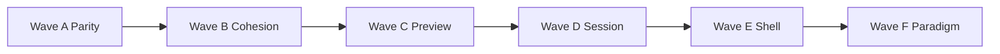

# Play Settings UI Roadmap & Workbench Paradigm

Reference for the next wave of **Play Settings** (WinUI) improvements. This document is the implementation backlog for the native `PlaySettingsWorkbenchPage` shell. Later, the patterns defined here become the **seed paradigm** for aligning settings and workbench surfaces across the wrapper (Preferences hub, Format, Project workspace, Review workbench, entity editors).

**Alignment canon:** [Wrapper UI paradigm](../reference/wrapper-ui-paradigm.md) — comprehensive cross-surface UI principles, layout paradigms, and rollout matrix (synthesized from this roadmap + modernization workshop). **Surface inventory:** [UI surface catalog](../reference/ui-surface-catalog.md).

**Status:** Reference / planning (not normative ADR)  
**Last updated:** 2026-07-09 (Wave 3 implementation)  
**Canonical code:** `ChatGPTWrapper.WinUI/Views/Dialogs/PlaySettings/`  
**Legacy reference:** `ChatGPTWrapper/Views/PlayPromptInjectionDialog.*` (WPF)

**Related:** [Wrapper UI paradigm](../reference/wrapper-ui-paradigm.md) · [UI paradigm Linear tracker](ui-paradigm-linear-tracker.md) (CMD-584) · [Settings UX taxonomy](../settings/settings-ux-taxonomy.md) · [UI components](../reference/ui-components.md) · [WinUI dialog redesign strategy](winui-dialog-redesign-strategy.md) · [Play surface UX modernization ADR](../adr/play-surface-ux-modernization-adr.md) · [WinUI UX parity backlog](winui-ux-parity-backlog.md) · [Injection policy ADR](../adr/injection-policy-adr.md)

---

## 1. Purpose

### Near term

Give engineers a prioritized, file-grounded checklist for Play Settings UI work after the W2 shell redesign (nav rail, section cards, dedicated Packet preview section).

### Long term

Establish a **Workbench Paradigm** — a repeatable layout and interaction contract for any large, multi-section editor in ChatGPT Wrapper:

| Pattern | Role |
|---------|------|
| **Workbench shell** | Header (context + status) · left nav · scrollable body · footer (save/dirty) |
| **Section cards** | `PlaySettingsSectionCard` → generalized `ShellSectionCard` |
| **Scope badges** | `This send` / `Persistent` / `Adventure` / `Project` / `Read-only` |
| **Progressive disclosure** | Essential → Common → Advanced → Developer tiers |
| **Dedicated preview / diff** | Heavy read-only panes as nav sections, not persistent side columns |
| **Deep links** | `PlaySettingsTab` enum + entry-point routing |

Target surfaces for paradigm rollout (later): Preferences hub sections, Format workbench, Proposal review hub, Project workspace, Entity edit, Thread manager.

---

## 2. Current state (2026-07-09)

### What shipped

| Area | Implementation |
|------|----------------|
| **Shell** | `PlaySettingsWorkbenchPage` — header, 232px nav rail, content column, status bar |
| **Navigation** | Grouped `ListView` + filter (`NavSearchBox`); scope badges; **Advanced** group (Send timeline) |
| **Sections** | 11 nav destinations including dedicated **Packet preview** |
| **Cards** | `PlaySettingsSectionCard` on all tabs (Injection, Next send, World, Session, Narrator, Play surface, Preview, Sources, Memory, Utility, History) |
| **Preview** | `PlaySettingsPreviewTab` + `InjectionPacketPreviewPanel`; staging banner; history link |
| **Dirty state** | `PlaySettingsEditorBaseline` diff; header unsaved badge; footer icon + **clickable edit drill-down** |
| **Dialog host** | `WinUiDialogHostService.ShowPlaySettingsAsync` — **display-aware** open size via `WorkbenchViewportDesign` (T4); persisted layout key `PlayPromptInjectionDialog`; **unsaved close guard** on Cancel/X |
| **Bridge** | `WinUiPlaySettingsBridge` wires 40+ host delegates |
| **Utility jobs** | Delivery & routing, automation transcript scope, QA/local inference, developer toggles, job packet context + advanced expanders, story context preview |
| **Dedup** | Fallback player line → Preview only; max packet → Narrator contract (Injection shows mirror + link) |
| **Sources** | `InfoBar` readiness banner |
| **Memory** | Row templates with pin/subtitle |
| **Session** | Utility parse archive debug expander; automation → utility jobs link |

### Nav catalog (source of truth)

Defined in `PlaySettingsNavItem.BuildCatalog()`:

| Group | Section | Tab enum | Scope |
|-------|---------|----------|-------|
| Next send | Packet & injection | `Injection` | This send |
| Next send | Player input | `NextSend` | This send |
| Next send | Packet preview | `Preview` | Preview |
| World & sources | World state | `World` | Persistent |
| World & sources | Memory & cards | `MemoryCards` | Persistent |
| World & sources | Sources | `Sources` | Project |
| Narrator | Contract | `Settings` | Adventure |
| Automation | Utility jobs | `UtilityJobs` | Jobs |
| Automation | Session & threads | `Session` | Session |
| Layout | Play surface | `PlaySurface` | Chrome |
| Advanced | Send timeline | `History` | Read-only |

### Gaps vs WPF `PlayPromptInjectionDialog` (remaining)

| Gap | WPF location | WinUI status |
|-----|--------------|--------------|
| Job catalog grouped list | Utility jobs tab | **Partial** (flat list; category grouping deferred) |
| Automation tiered cards | Session tab | **Partial** (single card; tier split deferred) |
| Session status InfoBar | Session tab | **Open** (D1) |
| Parity QA matrix | — | **Open** ([CMD-572](https://linear.app/cmd0112/issue/CMD-572)) |
| Keyboard Ctrl+S / nav shortcuts | — | **Open** (B7) |
| Empty states | Memory, History, Sources | **Open** (B8) |
| Preview viewport fill / copy formats | Preview tab | **Open** (C1, C6) |
| Workbench content width / layout modes | Shell + Session/Sources tabs | **In progress** ([CMD-623](https://linear.app/cmd0112/issue/CMD-623)) |
| WPF `PlayPromptInjectionDialog` retirement | — | Blocked on CMD-572 matrix green |

---

## 3. Design principles (workbench paradigm)

These principles apply to Play Settings now and generalize to other wrapper workbenches later.

### P1 — One intent, one primary home

Align with [settings-ux-taxonomy](../settings/settings-ux-taxonomy.md) and [play-surface ADR](../adr/play-surface-ux-modernization-adr.md): Play Settings is the **contextual primary** for adventure play behavior; Preferences hub entries are shortcuts with `initialTab` deep links.

**Rule:** Entry points pass `PlaySettingsTab` (or future enum) — never open a generic tab and expect users to hunt.

### P2 — Scope is always visible

Users must know **what a change affects** before editing.

| Scope label | Meaning |
|-------------|---------|
| **This send** | Next packet only; may not persist |
| **Preview** | Read-only / staging view |
| **Persistent** | Saved in adventure; included in future sends |
| **Adventure** | `adventure.json` settings / contract |
| **Project** | ChatGPT Project linkage |
| **Session** | Thread pins, snapshots, drafts |
| **Jobs** | Utility worker instructions |
| **Chrome** | `ui-chrome.json` play layout |
| **Read-only** | History / audit |

**Implementation:** Scope badge on nav item, section header, and `ShellSectionCard`.

### P3 — Preview and diff are destinations, not chrome

Packet preview moved off the persistent right column into **Next send → Packet preview**. Apply the same rule elsewhere:

- Source compare → dedicated section or child window, not a permanent split
- Job instruction preview → expander or sub-pane within Utility jobs
- History packet excerpt → already in History section

### P4 — Progressive disclosure tiers

From [settings-ux-taxonomy §4](../settings/settings-ux-taxonomy.md):

| Tier | Audience | Play Settings placement |
|------|----------|-------------------------|
| **Essential** | All users | Injection preset, World summary, Next send queue |
| **Common** | Regular players | Narrator contract, Play surface, Memory |
| **Advanced** | Power users | Automation toggles, utility delivery, formatting |
| **Developer** | Maintainers | Packet preview, History, debug expanders, fat packets |

**UI pattern:** `Expander` with `ShellSectionCard` header, or nav group **Advanced** collapsed by default.

### P5 — Token-driven visuals only

All new UI uses `WrapperTokens.xaml` + `WrapperControls.xaml` — no ad-hoc hex except semantic warnings.

Existing primitives to extend:

- `ShellCardStyle`, `ShellSectionCard` (promote to shared `ShellSectionCard`)
- `ShellBadgeStyle`, `ShellFormFieldLabelStyle`
- `PlaySettingsNavItemStyle`, `PlaySettingsCodeBoxStyle`
- `ShellGhostButtonStyle`, `ShellPrimaryButtonStyle`

### P6 — Save model is explicit

- Staging edits live in memory until **Save**
- Footer + header communicate dirty state with **field-level diff summary** (`BuildStagingEditsSummary`)
- Preview shows staging banner when unsaved edits affect packet merge

**Future:** Clickable edit list → jump to nav section that owns the field.

### P7 — Responsive workbench layout

**Shell breakpoints** (total workbench width):

| Breakpoint | Behavior |
|------------|----------|
| ≥ 880px | 232px nav rail; content uses **layout mode** (below) |
| 720–879px | 200px nav rail; same layout modes |
| &lt; 720px | Collapsible nav overlay or top `NavigationView` pane — **follow-up** ([CMD-623](https://linear.app/cmd0112/issue/CMD-623)) |

**Content width contract** — each nav section declares a **layout mode** (implemented in `PlaySettingsWorkbenchLayout`):

| Layout mode | Tabs (Play Settings) | Wide behavior |
|-------------|----------------------|---------------|
| **Form column** | Injection, Next send, World, Narrator contract, Play surface | Max **720px**, **left-aligned** when content area is wider — readable form width, not a centered column |
| **Card grid** | Session, Sources | Independent section cards **2-up** when content width ≥ 880px; full-width rows for large cards (automation, source list) |
| **Master-detail** | Utility jobs, Memory & cards, History | Grids stretch to content column `*` width |
| **Full bleed** | Preview | No outer scroll; preview panel fills viewport |

**Rules:**

- Do **not** apply a global `MaxWidth="720"` on the workbench content host — mode drives width.
- Form-column tabs stay left-aligned at wide sizes; dead space stays on the **right**, not split evenly.
- Extract to `ShellWorkbenchLayout` when [CMD-579](https://linear.app/cmd0112/issue/CMD-579) lands.

**Code:** `PlaySettingsWorkbenchLayout.cs`, `PlaySettingsCardGridLayout.cs`, `PlaySettingsWorkbenchPage.ApplyWorkbenchLayout()`.

### P8 — Display-aware open viewport

| Step | Behavior |
|------|----------|
| Classify monitor | **Compact** (&lt;1280×800), **Standard**, **Spacious** (≥1920 width) |
| Open size | `WorkbenchViewportDesign.Resolve(T4Session)` — ratio of work area, tier min/max clamps |
| Persist | `DialogLayoutStore` key `PlayPromptInjectionDialog` overrides design size when valid |
| In-page tuning | `PlaySettingsViewportMetrics` adjusts form column max, nav rail, card-grid breakpoint |

**Code:** `ChatGPTWrapper/Shell/WorkbenchViewportDesign.cs` · `PlaySettingsWorkbenchViewport.cs` · `ShowPlaySettingsAsync`

---

## 4. Significant improvements (prioritized backlog)

### Wave A — Parity & trust (P0–P1)

*Users must not lose capability when WinUI fully replaces WPF.*

| # | Improvement | Rationale | Files / notes |
|---|-------------|-----------|---------------|
| A1 | **Utility jobs advanced expanders** | WPF has 6+ collapsed expanders WinUI lacks | Port from `PlayPromptInjectionDialog.xaml` AiActions tab → `PlaySettingsUtilityJobsTab` |
| A2 | **Session debug expander** | Utility parse archive for support | `PlaySettingsSessionTab` |
| A3 | **Sources readiness InfoBar** | Pin/sync state deserves `InfoBar` not plain `Border` | `PlaySettingsSourcesTab`; use `InfoBarSeverity` |
| A4 | **Memory & cards row templates** | Default `ListView` rows are opaque | DataTemplates with title, pin state, review badge |
| A5 | **Parity QA matrix** | CMD-560 acceptance | Test all `WinUiPlaySettingsBridge` delegates from each tab |
| A6 | **Entry-point smoke** | Cockpit, companion, Preferences, project workspace | Each `ShowPlaySettingsAsync(..., initialTab)` |

### Wave B — IA & cohesion (P1)

*Reduce confusion; finish the redesign language.*

| # | Improvement | Rationale | Files / notes |
|---|-------------|-----------|---------------|
| B1 | **Unify section cards** | Sources, Memory, Utility, History still use raw borders | Migrate to `PlaySettingsSectionCard` |
| B2 | **Resolve narrator duplication** | `WinUiNarratorBehaviorPanel` on Injection tab **and** Narrator contract tab overlap | Injection: turn-scoped behavior only; Contract: adventure baseline; cross-link |
| B3 | **Resolve fallback player line duplication** | Same field in Next send tab and Preview sample line | Single source of truth; Preview reads from context; label clearly |
| B4 | **Max packet chars duplication** | Slider on Injection; text box on Narrator contract | One canonical control; other shows read-only mirror or link |
| B5 | **Nav: Advanced group** | Developer-tier items clutter primary nav | Move History, debug expanders, developer toggles under **Advanced** header |
| B6 | **Dirty edit drill-down** | Footer lists first 3 edits | `HyperlinkButton` list → `SelectTab` + scroll to card |
| B7 | **Keyboard navigation** | Nav filter + arrow keys + Ctrl+S save | `SettingsNavList` focus; document in ui-components |
| B8 | **Empty states** | Memory, History, Sources lists when empty | Illustration + primary action per section |

### Wave C — Preview & send clarity (P1–P2)

*Core product value: users understand what Send will do.*

| # | Improvement | Rationale | Files / notes |
|---|-------------|-----------|---------------|
| C1 | **Preview layout fills viewport** | Preview tab inside `ScrollViewer` limits height | When `PlaySettingsTab.Preview` active, host preview in `*` row without outer scroll |
| C2 | **Section → packet scroll sync** | Section list clicks scroll packet body | Exists; add highlight gutter / line marker |
| C3 | **Send precedence diagram** | Next send tab has text callout only | Small inline diagram: composer → fallback → queue |
| C4 | **Preset impact summary** | Changing preset should summarize diff | Chip + "what changed" bullet list under preset combo |
| C5 | **Live composer indicator** | Preview source line shows composer vs fallback | Prominent badge when live compose text is used |
| C6 | **Copy packet formats** | Copy as markdown / plain / with metadata | Context menu on Copy packet |
| C7 | **Compare to last send** | History integration | Link from preview to History entry for last accepted turn |

### Wave D — Session & automation UX (P2)

| # | Improvement | Rationale | Files / notes |
|---|-------------|-----------|---------------|
| D1 | **Session status InfoBar** | Pin state, thread connection, draft state | `PlaySettingsSessionTab` header; replaces scattered `TextBlock`s |
| D2 | **Automation as tiered cards** | 10+ checkboxes in one card | Group: Memories, Summary, State, Canon — each a card with master toggle |
| D3 | **Utility jobs master-detail polish** | Job list + editor is functional but plain | Job icons, category headers, running/idle chip |
| D4 | **Run job feedback** | Run selected job has no in-tab progress | Inline progress + link to Review hub on completion |
| D5 | **Thread tools action list** | 8 equal full-width buttons | `ActionListRow` pattern from Preferences hub |

### Wave E — Shell & window chrome (P2)

| # | Improvement | Rationale | Files / notes |
|---|-------------|-----------|---------------|
| E1 | **True T4 window** | Strategy doc calls for dedicated window, not dialog feel | `WinUiDialogService.ShowWorkbenchAsync` sizing + resize grips |
| E2 | **Header context strip** | Adventure title + preset chip | Add thread name, pin icon, sources readiness dot |
| E3 | **Save / Cancel / Apply** | Footer only shows status today | Explicit Save (primary), Cancel, optional Apply per section |
| E4 | **Unsaved close guard** | Confirm on cancel with dirty state | `ShowWorkbenchAsync` close handler |
| E5 | **TeachingTips** | First open per section | WinUI `TeachingTip` on nav groups (ties to CMD-264 hub v2) |
| E6 | **Workbench content width contract** | Maximized window wastes horizontal space | `PlaySettingsWorkbenchLayout` layout modes; card-grid tabs; left-aligned form column — [CMD-623](https://linear.app/cmd0112/issue/CMD-623) |

### Wave F — Paradigm extraction (P3, cross-surface)

*Prepare for wrapper-wide alignment.*

| # | Improvement | Rationale | Target |
|---|-------------|-----------|--------|
| F1 | **`ShellSectionCard` in Themes** | Rename/generalize `PlaySettingsSectionCard` | `Themes/ShellSectionCard.xaml` |
| F2 | **`ShellWorkbenchPage` base** | Extract nav + header + footer + dirty | Base class or shared UserControl |
| F3 | **`ShellNavItem` model** | Generalize `PlaySettingsNavItem` | Scope, group, filter, deep link id |
| F4 | **Workbench footer control** | Save status icon + edit count reusable | `Controls/WorkbenchStatusBar.xaml` |
| F5 | **Document paradigm in ui-components** | Single canon for workbench layout | `docs/reference/ui-components.md` new section |
| F6 | **Preferences hub alignment** | Hub cards open workbench sections | Same scope badges and card rhythm |
| F7 | **Format dialog workbench** | Essentials + Refine + Advanced as nav | [CMD-554](https://linear.app/cmd0112/issue/CMD-554) |
| F8 | **Review hub workbench** | Category nav + list + diff already partial | Shared diff/preview pane patterns |

---

## 5. Component catalog (current → target)

| Component | Today | Target |
|-----------|-------|--------|
| Workbench shell | `PlaySettingsWorkbenchPage` | `ShellWorkbenchPage` (shared) |
| Section card | `PlaySettingsSectionCard` | `ShellSectionCard` |
| Nav item | `PlaySettingsNavItem` | `ShellNavItem` + template selector |
| Nav filter | `NavSearchBox` + filter logic in code-behind | Reusable `ShellNavFilterBehavior` |
| Status footer | Inline in workbench | `WorkbenchStatusBar` |
| Code / packet text | `PlaySettingsCodeBoxStyle` | `ShellCodeBoxStyle` |
| Preview panel | `InjectionPacketPreviewPanel` | `PacketPreviewPanel` (injection-agnostic name) |
| Scope badge | `ShellBadgeStyle` + label text | Token `ScopeBadgeStyle` with semantic colors per scope |
| Readiness / pin | `Border` + `TextBlock` | `InfoBar` + `StatusChip` |

---

## 6. Information architecture recommendations

### Option A — Keep current groups (minimal churn)

Current 6 nav groups are sound. Add **Advanced** as 7th group for History + developer content.

### Option B — User-journey groups (larger refactor)

| Group | Sections |
|-------|----------|
| **Before you Send** | Injection, Player input, Packet preview |
| **Your world** | World, Memory, Sources |
| **Narrator** | Contract, (optional) Injection narrator panel link |
| **Play chrome** | Play surface |
| **Automation** | Utility jobs, Session |
| **Record** | History |

**Recommendation:** Option A for next sprint; evaluate B after user testing.

### Deep-link map (preserve)

| Entry point | `PlaySettingsTab` |
|-------------|-------------------|
| Play footer / cockpit | `Injection` |
| Companion State → edit world | `World` |
| Preferences → Play behavior | `Settings` |
| Preferences → Play layout | `PlaySurface` |
| Preferences → Sources | `Sources` |
| Project workspace | `Sources` |

Add: Preferences → **Packet preview** → `Preview` (developer shortcut).

---

## 7. Implementation phases (suggested)



| Phase | Waves | Outcome | Est. effort |
|-------|-------|---------|-------------|
| **1 — Trust** | A | WPF parity; QA matrix green | Medium |
| **2 — Polish** | B + C1–C5 | Cohesive cards; preview fills viewport | Medium |
| **3 — Power UX** | C6–C7, D | Automation + session clarity | Medium |
| **4 — Shell** | E | Window chrome, unsaved guard | Small |
| **5 — Platform** | F | Extract shared workbench kit | Large |

---

## 8. Acceptance criteria (definition of done)

### Play Settings complete (WinUI replaces WPF)

- [ ] All entry points open without error; diagnostics clean
- [ ] WPF Utility jobs advanced/developer expanders ported or intentionally deprecated with doc update
- [ ] Every section uses `ShellSectionCard` (or successor)
- [ ] Scope badge on every editable section
- [ ] Packet preview is nav-only (no persistent side column)
- [ ] Dirty state: header badge, footer summary, preview staging banner, close guard
- [ ] `WinUiPlaySettingsBridge` callbacks verified per tab
- [ ] Responsive at 1280×720 and 1920×1080 (layout modes per P7; &lt;720 nav overlay tracked in [CMD-623](https://linear.app/cmd0112/issue/CMD-623))
- [ ] ui-components.md updated with workbench layout contract

### Paradigm ready for rollout

- [ ] `ShellSectionCard` + `ShellWorkbenchPage` in Themes
- [ ] ui-components.md **Workbench paradigm** section
- [ ] One non–Play Settings surface pilot (Preferences section or Format Essentials)

---

## 9. File map

```
ChatGPTWrapper.WinUI/
  Themes/
    WrapperTokens.xaml          # Accent, warning, scope colors
    WrapperControls.xaml        # Shell* styles, PlaySettings* styles
  Views/Dialogs/PlaySettings/
    PlaySettingsWorkbenchPage.* # Shell orchestrator
    PlaySettingsNavItem.cs        # Nav catalog
    PlaySettingsSectionCard.*   # Section card (→ ShellSectionCard)
    PlaySettingsPreviewTab.*    # Dedicated preview section
    InjectionPacketPreviewPanel.*
    PlaySettings*Tab.*            # One UserControl per nav section
  Services/
    WinUiDialogHostService.cs   # ShowPlaySettingsAsync
    WinUiPlaySettingsBridge.cs  # Host delegate wiring

ChatGPTWrapper/
  Views/PlaySettingsTab.cs      # Tab enum (+ Preview)
  Adventure/Services/
    PlaySettingsEditorBaseline.cs
    PlaySettingsEditorSession.cs
```

---

## 10. Non-goals (this roadmap)

- Transcript typography (Format dialog scope)
- Dashboard revamp (CMD-110)
- Replacing WebView play compose (separate epic)
- Removing WPF `PlayPromptInjectionDialog` until parity matrix is green

---

## 11. Linear / issue tracking

**Epic (Wave 3):** [CMD-570](https://linear.app/cmd0112/issue/CMD-570) — Play Settings polish, parity & paradigm seed (child of [CMD-560](https://linear.app/cmd0112/issue/CMD-560))

**Epic (Wave F — paradigm):** [CMD-579](https://linear.app/cmd0112/issue/CMD-579) — Shell workbench kit (child of [CMD-564](https://linear.app/cmd0112/issue/CMD-564), Icebox)

### Wave 3 child issues ([CMD-570](https://linear.app/cmd0112/issue/CMD-570))

| Wave | Issue | Title |
|------|-------|-------|
| A | [CMD-571](https://linear.app/cmd0112/issue/CMD-571) | Port WPF Utility jobs advanced expanders |
| A | [CMD-574](https://linear.app/cmd0112/issue/CMD-574) | Sources, Memory, Session tab parity polish |
| A | [CMD-572](https://linear.app/cmd0112/issue/CMD-572) | Parity QA — entry points & bridge matrix |
| B | [CMD-573](https://linear.app/cmd0112/issue/CMD-573) | Unify section cards & Advanced nav group |
| B | [CMD-575](https://linear.app/cmd0112/issue/CMD-575) | Dedupe overlapping fields & dirty drill-down |
| C | [CMD-576](https://linear.app/cmd0112/issue/CMD-576) | Packet preview & send-clarity UX |
| D | [CMD-577](https://linear.app/cmd0112/issue/CMD-577) | Session, automation, utility jobs UX |
| E | [CMD-578](https://linear.app/cmd0112/issue/CMD-578) | Workbench shell chrome & save model |
| E | [CMD-623](https://linear.app/cmd0112/issue/CMD-623) | Workbench content width & responsive layout modes |

### Wave F child issues ([CMD-579](https://linear.app/cmd0112/issue/CMD-579))

| Issue | Title |
|-------|-------|
| [CMD-580](https://linear.app/cmd0112/issue/CMD-580) | Extract ShellSectionCard & WorkbenchStatusBar |
| [CMD-583](https://linear.app/cmd0112/issue/CMD-583) | Extract ShellWorkbenchPage base & ShellNavItem |
| [CMD-581](https://linear.app/cmd0112/issue/CMD-581) | Document paradigm in ui-components.md |
| [CMD-582](https://linear.app/cmd0112/issue/CMD-582) | Pilot on Format or Preferences |

PR linkage: `Ref CMD-XX` for manual QA issues; `Fixes CMD-XX` only when acceptance criteria fully met.

When creating issues from this doc, search Linear first to avoid duplicates.

---

## 12. Maintenance

Update this document when:

- Nav catalog changes (`PlaySettingsNavItem`)
- A wave ships (check acceptance items)
- Paradigm components are promoted to `Themes/`
- WPF dialog is retired (mark gaps table as historical)

Mirror a one-paragraph summary in the Obsidian vault `ChatGPT Wrapper/06 Plans/` note if vault mirrors are maintained.

---

*This document is the canonical Play Settings UI backlog. For normative settings scope rules, see [settings-ux-taxonomy.md](../settings/settings-ux-taxonomy.md). For dialog tier strategy, see [winui-dialog-redesign-strategy.md](winui-dialog-redesign-strategy.md).*
