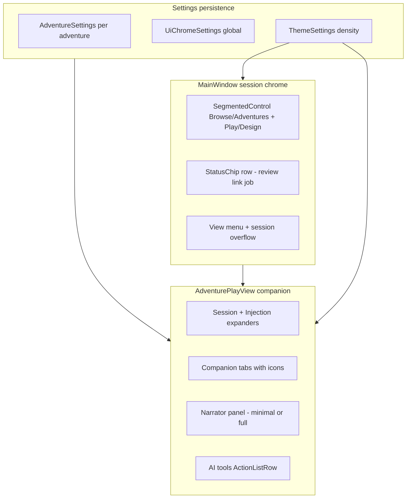
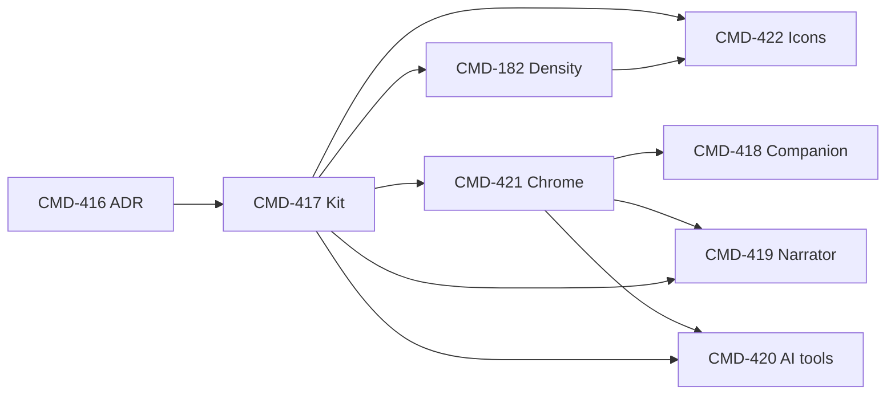

# Play Surface UX Modernization — Implementation Plan

Execution plan for **Phase 3** shell and play-companion UX overhaul: modern component kit, deduplicated chrome, customizable layout preferences, and dual density tiers.

**Normative ADR:** [play-surface-ux-modernization-adr.md](../adr/play-surface-ux-modernization-adr.md)  
**Epic:** [CMD-415](https://linear.app/cmd0112/issue/CMD-415)  
**Parent program:** [CMD-254](https://linear.app/cmd0112/issue/CMD-254) (Settings & interactables UX)

**Related baselines (do not re-implement):** [CMD-95](https://linear.app/cmd0112/issue/CMD-95) shell primitives · [CMD-119](https://linear.app/cmd0112/issue/CMD-119) play companion wave 2 · [CMD-230](https://linear.app/cmd0112/issue/CMD-230) Play/Design toggle · [CMD-264](https://linear.app/cmd0112/issue/CMD-264) preferences IA

---

## Plan tool handoff

Use this document as the **single source of truth** for sequencing, file touchpoints, and acceptance gates. Work **one Linear child issue per branch** unless explicitly pairing parallel tracks (182 ∥ 422).

| Item | Value |
|------|-------|
| **Goal** | Eliminate stacked/duplicated play chrome; ship modern primitives; restore last-used companion state; progressive narrator + AI action list |
| **Gate** | [CMD-416](https://linear.app/cmd0112/issue/CMD-416) ADR signed off (**In Review** — do not start CMD-417 until Done) |
| **Order** | `416 ✓ → 417 → (182 ∥ 422) → 421 → (418 ∥ 419 ∥ 420)` |
| **Stack** | .NET 9 WPF + WebView2; tokens in `WrapperTokens.xaml`; theme via `ThemeApplicationService` |
| **Test project** | `tests/ChatGPTWrapper.ApiDiagnostics/Unit/` |
| **Manual QA issues** | CMD-421, CMD-419, CMD-420 (label **Needs Manual QA**) |
| **Out of scope** | Dashboard revamp (CMD-110), transcript Format dialog, phrase-highlight colors, full Option 3 unified companion (ADR defers) |

### Per-issue definition of done

| Issue | Done when |
|-------|-----------|
| **CMD-416** | ADR merged; issue **Done** + **Verified** |
| **CMD-417** | Primitives in `WrapperControls.xaml`; pilot usage in MainWindow segments + one list surface; `ui-components.md` section |
| **CMD-182** | `DensityPreset` on `ThemeSettings`; templates respond; Appearance UI; unit tests; compose CSS vars scale |
| **CMD-422** | Icon dictionary + button styles; rules applied on shell + play surfaces per ADR table |
| **CMD-421** | Single session top bar; canonical action map satisfied; no duplicate primary Review/Settings paths |
| **CMD-418** | Persistence keys + Play surface prefs + unit tests for precedence |
| **CMD-419** | Minimal/full narrator modes; `NarratorAdvancedDialog` removed; Injection tab owns advanced |
| **CMD-420** | `ActionListRow` AI tools; Review chip canonical; Recap in footer More |
| **CMD-415** | All children Done; epic acceptance checklist in ADR complete |

---

## Executive summary

### Product principles (from ADR)

| # | Principle | Implementation meaning |
|---|-----------|------------------------|
| **1** | **One primary entry per intent** | Review → `StatusChip`; Threads → session ⋯; Settings → View menu + bridge dot; Focus → shell only |
| **2** | **Primitives before surfaces** | Ship `SegmentedControl`, `ActionListRow`, `StatusChip` before chrome dedup and feature panels |
| **3** | **Density = redesign** | Comfortable/Compact must change control templates — margin-only changes fail acceptance |
| **4** | **Last-used + overrides** | Per-adventure companion history; global enter-play policy wins on conflict |
| **5** | **Progressive disclosure** | Narrator minimal default; AI action list default; full/button-bank opt-in via settings |

### What success looks like

- Entering Play restores last companion tab (or global default); expander state optional.
- Session chrome is **one row** (shell); `AdventurePlayView` header defers when `ShellContextPanel` is active.
- Pending review count appears on a **clickable chip** — not duplicated on play header + settings badge + AI panel.
- AI tools are a scannable vertical list with disabled reasons; Recap lives in footer More.
- Narrator cockpit shows scene profile + scope + chips by default; full grid opt-in.
- Comfortable vs Compact visibly changes row heights, segment padding, and compose bar scale.

### Non-goals

- Merging Play and Design into one companion tab shell (Option 3 — rejected in [play-design-surface-convergence-adr.md](../adr/play-design-surface-convergence-adr.md)).
- Replacing `PlayLayoutCoordinator` tier system — extend it for density + shell flyout retirement, do not fork responsive logic.
- New persistence store — extend `AdventureSettings` + `UiChromeSettings` only.

---

## Current state (baseline)

### Already in place (reuse)

| Area | Evidence | Reuse in this plan |
|------|----------|-------------------|
| Semantic tokens | `Themes/WrapperTokens.xaml`, `WrapperControls.xaml` | All new primitives use `DynamicResource` |
| Shell primitives | `ShellCardStyle`, `ShellCommandBarStyle`, `ShellBadgeStyle`, `ModeButtonStyle` | Extend; replace clusters with `SegmentedControl` |
| Play layout tiers | `PlayLayoutCoordinator`, `PlayLayoutCapabilities`, `PlayResponsiveTiers` | Retire `UseShellHeaderFlyouts` split after CMD-421 |
| Side panel persistence | `PlaySidePanelCollapsed`, `PlaySidePanelWidth`, `PlaySessionCockpitHeight` | CMD-418 extends |
| Tab placement | `PlayTabPlacement`, `PlayPanelLayoutService` | CMD-418 tab restore complements |
| Play settings IA | `PlayPromptInjectionDialog` → **Play surface** tab | CMD-418/419/420 settings UI |
| Injection preview | `InjectionPreviewCoordinator` | CMD-419 shares templates with settings |
| Review counting | `PendingReviewService.GetCounts` | CMD-420/421 `StatusChip` binding |
| Narrator advanced | `NarratorAdvancedDialog`, `NarratorBehaviorPanel` | CMD-419 merge into Injection tab |
| AI job wiring | `JobActionsPanel` WrapPanel, `MainWindow.GenerationJobs.cs` | CMD-420 rehost handlers |
| Shell session context | `ShellContextPanel`, `MainWindow.AdventureSessionMode.cs` | CMD-421 extends |
| Preferences pattern | `PreferencesHubDialog` cards + `ShellSectionHintStyle` | Play surface prefs cards |

### Known pain points (motivation)

| Gap | Symptom | Addressed by |
|-----|---------|--------------|
| Stacked headers | Shell + `AdventurePlayView.HeaderGrid` both expose Threads/Review/Settings | CMD-421 |
| `UseShellHeaderFlyouts` | Narrow width hides panels, shows flyout menus — duplicate IA | CMD-421 retires flyout path |
| Review badge on Play settings button | Confuses settings vs review intent | CMD-420/421 — chip only |
| 7-combo narrator grid | Cockpit crowding at all widths | CMD-419 minimal mode |
| `WrapPanel` job buttons | Unequal visual weight; poor scan | CMD-420 action list |
| `DropShadowEffect` on chrome | Dated stacked-toolbar look | CMD-417 flat chrome |
| No density preset | Ad-hoc `FontSize="11"` in play XAML | CMD-182 |
| Third narrator surface | `NarratorAdvancedDialog` + cockpit + Injection tab | CMD-419 dedup |

### Interim code to retire (by phase)

| Artifact | Retire when | Replacement |
|----------|-------------|-------------|
| `ModeButtonStyle` button clusters | CMD-417 + CMD-421 | `SegmentedControl` |
| `NarratorFlyoutMenu` / `AiToolsFlyoutMenu` | CMD-421 | Unified shell chrome |
| `ReviewProposalsButton` (play header) | CMD-421 | `StatusChip` |
| `NarratorAdvancedDialog` | CMD-419 | Injection tab `NarratorBehaviorPanel` |
| `JobActionsPanel` WrapPanel | CMD-420 | `ItemsControl` + `ActionListRow` |
| `UpdateModeButtonStyles()` helpers | CMD-417 | `SegmentedControl` selected API |
| Play settings pending badge | CMD-421 | Review chip only |

---

## Target architecture



### New / extended types (conceptual)

```csharp
// Theme — CMD-182
enum DensityPreset { Default, Comfortable, Compact }

// UiChromeSettings — CMD-418/419/420
enum PlayCompanionOnEnter { RememberLast, AlwaysCollapsed, AlwaysOpen }
enum NarratorPanelDensity { Minimal, Full, RememberLast }
enum AiToolsLayout { ActionList, ButtonBank, MenuOnly }

// AdventureSettings — CMD-418
string? PlayCompanionLastTab;
Dictionary<string, bool>? PlayCompanionExpanderState;
```

---

## Dependency graph



**Parallel tracks after CMD-417:**

- **Track A:** CMD-182 (theme/density) — can start once kit defines template hooks
- **Track B:** CMD-422 (icons) — coordinate with CMD-182 for Compact label hiding
- **Track C:** CMD-421 (chrome) — blocks feature tracks 418–420

**CMD-181 note:** CMD-182 lists CMD-181 as blocker for WebView compose scaling. If CMD-181 is not Done, ship density for WPF first with a follow-up sub-task for compose CSS vars (document in CMD-182 comment).

---

## Phase breakdown

| Phase | Issue | Estimate | Depends on |
|-------|-------|----------|------------|
| **0** | CMD-416 ADR sign-off | Done / sign-off | — |
| **1** | CMD-417 Component kit | 3–5 sessions | Phase 0 |
| **2a** | CMD-182 Density presets | 4–6 sessions | Phase 1; CMD-181 partial OK |
| **2b** | CMD-422 Tiered icons | 2–4 sessions | Phase 1; pairs with 2a |
| **3** | CMD-421 Chrome dedup | 5–8 sessions | Phase 1 |
| **4a** | CMD-418 Companion restore | 2–4 sessions | Phase 3 |
| **4b** | CMD-419 Narrator panel | 4–6 sessions | Phase 1, 3 |
| **4c** | CMD-420 AI action list | 3–5 sessions | Phase 1, 3 |
| **5** | Docs + epic close | 1 session | All phases |

**Total:** ~24–39 focused sessions.

---

## Phase 0 — ADR sign-off (CMD-416)

### Status

ADR drafted: `docs/adr/play-surface-ux-modernization-adr.md`. Issue **In Review**.

### Tasks

1. Product sign-off comment on CMD-416 (**LGTM**).
2. Move CMD-416 → **Done** + **Verified**.
3. Move CMD-415 epic → **In Progress** (optional).
4. Unblock CMD-417 → **Todo**.

---

## Phase 1 — Shell component kit (CMD-417)

### Goals

Ship reusable primitives; pilot in low-risk surfaces; flat chrome.

### New files

| File | Purpose |
|------|---------|
| `ChatGPTWrapper/Controls/SegmentedControl.xaml` (+ `.cs`) | Single-selection segment group |
| `ChatGPTWrapper/Controls/StatusChip.xaml` (+ `.cs`) | Clickable badge with count/label variants |
| `ChatGPTWrapper/Controls/ActionListRow.xaml` (+ `.cs`) | Label, hint, trailing command, disabled reason |

### Modify

| File | Changes |
|------|---------|
| `Themes/WrapperControls.xaml` | `ActionListRowStyle`, chip styles, density-aware setters (stubs until CMD-182) |
| `Themes/WrapperChrome.xaml` | Flat chrome variant; document `ShellFlatChromeStyle` |
| `MainWindow.xaml` | Replace Browse/Adventures `ModeButtonStyle` cluster with `SegmentedControl` pilot |
| `App.xaml` | Merge new control dictionaries if split |
| `docs/reference/ui-components.md` | Primitives section |

### SegmentedControl API (minimum)

```csharp
// Items: string or SegmentedItem { Content, Tag }
// SelectedIndex / SelectedTag dependency properties
// Uses DynamicResource: BgSurfaceBrush, BorderSubtleBrush, AccentPrimaryBrush
```

### ActionListRow API (minimum)

```csharp
// Title, Hint, Command, IsEnabled, DisabledReason
// Optional LeadingIcon (stretch CMD-422)
```

### StatusChip API (minimum)

```csharp
// Label, Count (nullable), Kind enum: Neutral | Attention | Success | Running
// Click routed event → host opens hub / dialog
```

### Flat chrome

- Remove `DropShadowEffect` from `ChatChromePanel` in `MainWindow.xaml`.
- Keep `BorderThickness="0,0,0,1"` separator only.

### Pilot surfaces (pick ≥2)

1. MainWindow Browse/Adventures segment.
2. **Either** PreferencesHubDialog list row **or** a single AI job row behind feature flag (full migration in CMD-420).

### Tests

| Test | Assert |
|------|--------|
| `SegmentedControlTests` (optional UI unit) | SelectedIndex changes; only one selected |
| Manual | Theme switch does not break segment colors |

### Acceptance gate

- [ ] Primitives documented in `ui-components.md`
- [ ] No new hard-coded hex in primitives
- [ ] MainWindow mode segment uses `SegmentedControl`

---

## Phase 2a — Density presets (CMD-182)

### Goals

`Comfortable` (fresh-install default) and `Compact` tiers change **templates**, not only margins.

### Modify

| File | Changes |
|------|---------|
| `Theme/ThemeSettings.cs` | `DensityPreset` property |
| `Theme/ThemeApplicationService.cs` | Apply bundled overrides per tier; expose `ResolvedDensityMetrics` |
| `Theme/ThemeTokenCatalog.cs` | Structural tokens: `ControlMinHeight`, `CompanionDefaultWidth`, etc. |
| `Themes/WrapperTokens.xaml` | Density-keyed resources or merged dictionaries |
| `Themes/WrapperControls.xaml` | Template triggers on `DensityPreset` |
| `Controls/*` (Phase 1) | `ActionListRow`, `SegmentedControl` height/padding triggers |
| Appearance dialog XAML/CS | Typography & density tab control |
| `ChatGPT_files/cgw-play-compose.css` | `--cgw-compose-*` scale from injected density vars |
| `ChatGptStyleInjection.cs` or theme bridge | Pass density tier to WebView CSS |

### Bundled tier values (from ADR)

| Metric | Comfortable | Compact |
|--------|-------------|---------|
| Body font | 14px | 12–13px |
| Control min height | 36px | 28–32px |
| Companion default width | 320px | 280px |

### Tests

| File | Coverage |
|------|----------|
| `ThemeDensityPresetTests.cs` | Resolved spacing/typography per tier |
| `PlayLayoutPresetTests.cs` (extend) | Companion default width respects density |

### Acceptance gate

- [ ] Switching density changes `ActionListRow`/`SegmentedControl` measured height (unit or snapshot test)
- [ ] Fresh install defaults to Comfortable
- [ ] CMD-181 compose vars: Done or documented deferral with issue link

---

## Phase 2b — Tiered icons (CMD-422)

### Goals

Icon dictionary + button styles per ADR surface table; no decorative icons on every AI row.

### New files

| File | Purpose |
|------|---------|
| `Themes/WrapperIcons.xaml` | Segoe Fluent `TextBlock` glyphs or `Path` icons at 16/20px |

### Modify

| File | Changes |
|------|---------|
| `Themes/WrapperControls.xaml` | `ShellIconButtonStyle`, `ShellIconLabelButtonStyle` |
| `MainWindow.xaml` | View / overflow / Focus → icon buttons |
| `AdventurePlayView.xaml` | Companion tab headers icon+label (after CMD-421 header trim) |
| `docs/reference/ui-components.md` | Icon tier rules |

### Density coordination

- At **Compact**, `ShellIconLabelButtonStyle` sets `ContentTemplate` to icon-only + `ToolTip` (requires CMD-182 hook).

### Acceptance gate

- [ ] Shell View/⋯/Focus icon-only with tooltips
- [ ] Play primaries icon+label at Comfortable
- [ ] AI `ActionListRow` rows remain text-primary (optional small leading icon only for pinned jobs — stretch)

---

## Phase 3 — Chrome dedup / unified session top bar (CMD-421)

### Goals

Single contextual top bar when `AppMode` is Play or Design session; canonical action map from ADR.

### Modify

| File | Changes |
|------|---------|
| `MainWindow.xaml` | Extend `ShellContextPanel`: title, Play\|Design `SegmentedControl`, `StatusChip` panel, session ⋯ |
| `MainWindow.Adventures.cs` | Wire chip counts from `PendingReviewService`, link state, `GenerationJobService` running |
| `MainWindow.AdventureSessionMode.cs` | Play/Design segment; hide duplicate play header chrome |
| `AdventurePlayView.xaml` | Collapse `HeaderGrid` when shell owns session chrome; keep hidden buttons for code-behind if needed |
| `AdventurePlayView.xaml.cs` | `ApplyShellLayout`: stop toggling flyouts when shell owns chrome; gate `HeaderGrid.Visibility` |
| `PlayLayoutCapabilities.cs` | Add `UseUnifiedSessionChrome`; deprecate `UseShellHeaderFlyouts` |
| View menu (`MainWindow.xaml`) | Remove redundant Focus when shell button present |

### StatusChip bindings

| Chip | Source | Click handler |
|------|--------|---------------|
| Review | `PendingReviewService.GetCounts(bundle).Total` | `ProposalReviewHubDialog` |
| Link | Project link attention state | `ManageThreads_Click` or link flow |
| Job | Active generation job indicator | Jobs panel / status |

### Session ⋯ menu (secondary only)

Threads, Sources, Rename adventure, Switch to Design, Export — no duplicate primaries.

### Hidden wiring pattern

Keep named controls (`ReviewProposalsButton`, etc.) with `Visibility=Collapsed` until code-behind refs migrated — or extract shared `PlaySessionCommands` service invoked from shell + view.

### Tests

| File | Coverage |
|------|----------|
| `PlayLayoutContextTests.cs` (extend) | `UseUnifiedSessionChrome` at session widths |
| Manual QA | 560px min width — no duplicate Review/Settings |

### Acceptance gate

- [ ] ADR canonical action map satisfied (grep for duplicate `ReviewProposals_Click` entry points)
- [ ] `← Dashboard` hidden when shell back active
- [ ] Play settings badge removed from Review path (settings opens without review count)

---

## Phase 4a — Companion last-used + preferences (CMD-418)

### Goals

Restore tab + expander state; global enter-play overrides with documented precedence.

### Modify

| File | Changes |
|------|---------|
| `Adventure/Models/AdventureMetadata.cs` | `PlayCompanionLastTab`, `PlayCompanionExpanderState` on `AdventureSettings` |
| `UiChromeStore.cs` / `UiChromeSettings` | `PlayCompanionOnEnter`, `PlayCompanionDefaultTab`, `PlayCompanionRememberExpanders` |
| `MainWindow.Adventures.cs` | On enter Play: apply precedence (global override → last-used → default tab) |
| `AdventurePlayView.xaml.cs` | Persist tab changes; persist expander `Expanded`/`Collapsed` |
| `PlayPromptInjectionDialog.xaml` | Play surface card: companion on enter, default tab, remember expanders |
| `PlayPromptInjectionDialog.xaml.cs` | Bind/save; scope this adventure vs global default |

### Precedence (unit test required)

```
AlwaysCollapsed → panel closed (tab still restored when opened)
AlwaysOpen → panel open + last/default tab
RememberLast → PlaySidePanelCollapsed + PlayCompanionLastTab + expanders
First visit → PlayCompanionDefaultTab (default Reference)
```

### Tests

| File | Coverage |
|------|----------|
| `PlayCompanionRestoreTests.cs` | Precedence matrix |
| `PlaySettingsPersistenceTests.cs` (extend) | Round-trip new keys |

### Acceptance gate

- [ ] Leave on Warnings tab → return → Warnings selected
- [ ] Global always collapsed overrides last-open

---

## Phase 4b — Narrator progressive panel (CMD-419)

### Goals

Minimal default; full opt-in; eliminate `NarratorAdvancedDialog`.

### Modify

| File | Changes |
|------|---------|
| `AdventurePlayView.xaml` | Split `NarratorControlsPanel` into `NarratorMinimalPanel` + `NarratorFullPanel`; visibility by density setting |
| `AdventurePlayView.xaml.cs` | Mode toggle; remove `NarratorAdvanced_Click` dialog path |
| `Views/NarratorBehaviorPanel.xaml` | Ensure full combo grid usable in Injection tab |
| `PlayPromptInjectionDialog.xaml` | Narrator panel density prefs; pinned combos (stretch) |
| `UiChromeSettings` | `NarratorPanelDensity`, `NarratorPinnedControls`, `NarratorAutoExpand` |
| Delete or obsolete | `NarratorAdvancedDialog.xaml(.cs)` — migrate callers in `AdventurePlayView`, `NarratorBehaviorPanel` |

### Minimal panel contents

- Scene profile combo
- Scope radios (This send / Session / Adventure)
- Override chips (`NarratorOverrideChips`)
- **Narrator…** button → `OpenPlaySettings(Injection)`

### Full panel

- Existing combo grid with cleaned layout (shared `Grid` resource with Injection tab where possible)

### Tests

| File | Coverage |
|------|----------|
| `InjectionPreviewCoordinatorTests` | Unchanged — preview still refreshes |
| Manual QA | Minimal → full toggle; send with scope This send |

### Acceptance gate

- [ ] No `new NarratorAdvancedDialog` call sites
- [ ] Injection expander preview still live in cockpit

---

## Phase 4c — AI tools action list (CMD-420)

### Goals

Vertical action list default; Review dedup; Recap to footer.

### Modify

| File | Changes |
|------|---------|
| `AdventurePlayView.xaml` | Replace `JobActionsPanel` WrapPanel with `ItemsControl` + `ActionListRow` template |
| `AdventurePlayView.xaml.cs` | Build `AiToolActionViewModel` list (label, hint, command, disabled reason) |
| `MainWindow.GenerationJobs.cs` | Handlers unchanged — rebind from list |
| Footer More menu | Add Recap if currently in AI panel |
| `UiChromeSettings` | `AiToolsLayout`, `AiToolsPinnedJobs`, `AiToolsShowReview` |
| `PlayPromptInjectionDialog` | AI tools layout prefs |

### ViewModel sketch

```csharp
sealed record AiToolActionRow(
    string JobId,
    string Title,
    string Hint,
    bool IsEnabled,
    string? DisabledReason,
    ICommand RunCommand);
```

### Review dedup

- Remove `ReviewProposalsButton` from visible chrome (CMD-421).
- Remove review row from AI list when `AiToolsShowReview == false` (default).
- Keep Reference tab queue for entity-context dismiss — not a global Review button.

### Tests

| File | Coverage |
|------|----------|
| `AiToolActionRowTests.cs` | Disabled reason when no play turn / no project |
| Manual QA | Run Process last exchange from list; chip opens hub |

### Acceptance gate

- [ ] Default layout is action list
- [ ] Button bank available via setting only
- [ ] Recap not in AI tools expander

---

## Phase 5 — Documentation & epic close

### Tasks

1. Update `docs/reference/ui-components.md` — full primitive + icon catalog.
2. Update `docs/user/adventure-panel.md` — new chrome IA, companion restore, narrator modes.
3. Update `docs/settings/settings-interactables-inventory.md` — mark merged/removed controls (CMD-257 overlap).
4. ADR acceptance checklist → tick in CMD-415 description.
5. Close children → epic **Done** when all **Verified**; manual QA issues get QA comment + **Verified** label.

---

## Risk assessment

| Risk | Likelihood | Impact | Mitigation |
|------|------------|--------|------------|
| Shell/play header race during mode switch | Medium | High | Single `ApplySessionChrome()` in `MainWindow.Adventures.cs`; test Play↔Design↔Browse |
| Breaking `UseShellHeaderFlyouts` narrow layouts | Medium | Medium | Keep layout tiers; replace flyouts with shell chips + ⋯ |
| `NarratorAdvancedDialog` removal breaks scope emphasis | Low | Medium | Port emphasis scope into Injection `NarratorBehaviorPanel` |
| Density + WebView drift | Medium | Low | Ship WPF density first; CMD-181 follow-up for compose |
| Hidden button code-behind refs | Medium | Low | `PlaySessionCommands` static or shared service |
| Settings proliferation | Low | Medium | Group under Play surface tab per CMD-264 cards |

---

## Manual QA matrix (CMD-421, 419, 420)

### Prerequisites

- Build with all phases through 4c
- Adventure with linked project, pending review proposals, active warnings
- Window width 560px and 1200px

### A — Chrome dedup (CMD-421)

1. Enter Play — single top bar with title + Play|Design segment
2. Confirm Review only on status chip (not play header button)
3. Open Play settings via View menu — no review count on settings button
4. Session ⋯ → Threads works; no duplicate Threads in collapsed header
5. Focus chat — shell control only

### B — Companion restore (CMD-418)

1. Open Warnings tab, expand AI tools — leave adventure — return → restored
2. Set global Always collapsed — return → panel closed
3. First adventure (no history) → Reference or configured default

### C — Narrator (CMD-419)

1. Default minimal — scene profile + scope + chips only
2. Switch to Full — all combos visible
3. Narrator… opens Injection tab; Advanced dialog does not exist

### D — AI tools (CMD-420)

1. Action list shows disabled reason when appropriate
2. Run Memories from list
3. Recap in footer More only
4. Optional: switch to Button bank in settings

### E — Density + icons (CMD-182, 422)

1. Comfortable → Compact — control heights shrink
2. Compact — play header icons without labels (tooltips present)

---

## File index (quick reference)

| Concern | Primary files |
|---------|---------------|
| Shell chrome | `MainWindow.xaml`, `MainWindow.Adventures.cs`, `MainWindow.AdventureSessionMode.cs` |
| Play companion | `Views/AdventurePlayView.xaml(.cs)` |
| Play settings | `Views/PlayPromptInjectionDialog.xaml(.cs)` |
| Layout tiers | `Adventure/Services/PlayLayout/*` |
| Theme/density | `Theme/*`, `Themes/Wrapper*.xaml` |
| Primitives | `Controls/SegmentedControl`, `Controls/StatusChip`, `Controls/ActionListRow` |
| Review counts | `Adventure/Services/PendingReviewService.cs` |
| AI jobs | `MainWindow.GenerationJobs.cs` |
| Narrator | `Views/NarratorBehaviorPanel.*`, `InjectionPreviewCoordinator.cs` |
| Persistence | `Adventure/Models/AdventureMetadata.cs`, `UiChromeStore.cs` |
| WebView compose | `ChatGPT_files/cgw-play-compose.css`, `ChatGptStyleInjection.cs` |
| Tests | `tests/ChatGPTWrapper.ApiDiagnostics/Unit/` |

---

## Linear issue checklist

| Issue | Branch prefix | Blocked by |
|-------|---------------|------------|
| [CMD-416](https://linear.app/cmd0112/issue/CMD-416) | `cmd-416-` | — |
| [CMD-417](https://linear.app/cmd0112/issue/CMD-417) | `cmd-417-` | CMD-416 |
| [CMD-182](https://linear.app/cmd0112/issue/CMD-182) | `cmd-182-` | CMD-417 |
| [CMD-422](https://linear.app/cmd0112/issue/CMD-422) | `cmd-422-` | CMD-417 |
| [CMD-421](https://linear.app/cmd0112/issue/CMD-421) | `cmd-421-` | CMD-417 |
| [CMD-418](https://linear.app/cmd0112/issue/CMD-418) | `cmd-418-` | CMD-421 |
| [CMD-419](https://linear.app/cmd0112/issue/CMD-419) | `cmd-419-` | CMD-417, CMD-421 |
| [CMD-420](https://linear.app/cmd0112/issue/CMD-420) | `cmd-420-` | CMD-417, CMD-421 |

**PR linkage:** `Ref CMD-XXX` for manual QA issues; `Fixes CMD-416` only when ADR-only PR.

---

## Related

| Topic | Link |
|-------|------|
| ADR | [play-surface-ux-modernization-adr.md](../adr/play-surface-ux-modernization-adr.md) |
| Settings taxonomy | [settings-ux-taxonomy.md](../settings/settings-ux-taxonomy.md) |
| UI catalog | [ui-components.md](../reference/ui-components.md) |
| Play layout | [adventure-panel.md](../user/adventure-panel.md) |
| Plan pattern reference | [play-send-orchestration-implementation-plan.md](play-send-orchestration-implementation-plan.md) |
