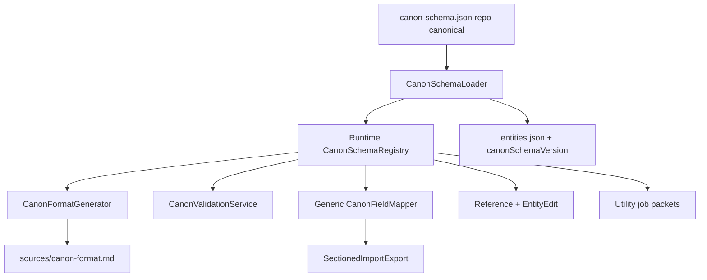

# Runtime canon schema engine — implementation plan

Follow-up to [CMD-190](https://linear.app/cmd0112/issue/CMD-190) (shipped hybrid registry + v2 `extendedFields`). This plan turns the static `CanonSchemaRegistry` into a **durable schema engine**: one authoritative definition, generated docs, validation, generic UI, versioned migrations, and aligned utility jobs.

**Epic:** [CMD-196](https://linear.app/cmd0112/issue/CMD-196)

**Prerequisite baseline:** `CanonSchemaRegistry`, `CanonFieldMapper`, `entities.json` schema v2, `sources/canon-format.md` (static template today).

---

## Problem statement (post–CMD-190)

| Gap | Impact |
|-----|--------|
| Schema lives in C# + static `canon-format.md` | Doc/code drift when fields change |
| `CanonFieldMapper` type switches | New fields/kinds need mapper edits |
| UI partially registry-driven | Hard-coded filters, Load/Apply/Delete per category |
| `extendedFields` without registry keys | Storage works; import/export/UI ignore unknown fields |
| No validation | Bad markdown discovered at import or play |
| Utility jobs use fixed vocabulary | Second mapping layer (`propose_json_import`) |
| No schema version on adventures | Breaking format changes risk old saves |

---

## Target architecture

**Principles**

1. **Single write surface** — edit schema data → everything else derives or validates.
2. **Hybrid storage retained** — identity columns + typed hot fields + `extendedFields` bag (ADR in [canon-schema.md](../reference/canon-schema.md)).
3. **Incremental delivery** — each phase shippable; no big-bang rewrite.
4. **Out of scope (this epic)** — per-adventure custom schemas; full JSON-only entity bags; publishing schema to Project RAG by default.

---

## Phases and Linear issues

| Phase | Goal | Issues | Depends on |
|-------|------|--------|------------|
| **0** | Close CMD-195 manual QA | [CMD-195](https://linear.app/cmd0112/issue/CMD-195) | CMD-190 |
| **1** | Self-checking canon | [CMD-197](https://linear.app/cmd0112/issue/CMD-197), [CMD-198](https://linear.app/cmd0112/issue/CMD-198) | CMD-190 |
| **2** | Generic Play UI | [CMD-199](https://linear.app/cmd0112/issue/CMD-199)–[CMD-201](https://linear.app/cmd0112/issue/CMD-201) | Phase 1 |
| **3** | Schema as data | [CMD-202](https://linear.app/cmd0112/issue/CMD-202), [CMD-203](https://linear.app/cmd0112/issue/CMD-203) | Phase 1 |
| **4** | Generic mapper + versions | [CMD-204](https://linear.app/cmd0112/issue/CMD-204), [CMD-205](https://linear.app/cmd0112/issue/CMD-205) | Phase 3 |
| **5** | Ecosystem + CI | [CMD-206](https://linear.app/cmd0112/issue/CMD-206)–[CMD-208](https://linear.app/cmd0112/issue/CMD-208) | Phase 4 (206/207 can start after Phase 2) |

---

## Phase 1 — Self-checking canon

### CMD-197 — Generate `canon-format.md` from registry

- Replace `CanonFormatTemplate` static string with `CanonFormatGenerator` driven by `CanonSchemaRegistry`.
- `EnsureLayout` writes generated content; optional hash check skips rewrite if unchanged.
- Unit test: generated output includes every kind/field label; CI fails if registry changed without regen.

### CMD-198 — Canon validation linter

- New `CanonValidationService` — run on export, import dry-run, Source Manager “Check canon”.
- Rules: unknown sections; missing `Id:`; party body positional anti-pattern; orphan JSON fields; manifest section mismatch.
- Surface warnings/errors in Source Manager (canon health row).

---

## Phase 2 — Generic Play UI

### CMD-199 — Reference tab from registry

- Drive `EntityFilters` from `CanonSchemaRegistry.PlayGridCategories` (order from spec).
- Generic `BuildEntityRows(kindSpec)` — resolve collection via `CollectionKey` + singleton flag.
- Enable kinds by flipping `ShowInPlayGrid` (mysteries optional follow-up).

### CMD-200 — Generic entity editor Load/Apply

- Replace category switches with `CanonEntityKindSpec` resolver (`TryGetByUiCategory`, collection accessor).
- Single code path: shell fields + `CanonFieldMapper` for all registry kinds.
- Retire duplicate Map* methods where spec covers them.

### CMD-201 — Field control types in EntityEditDialog

- Extend `CanonFieldSpec` with `ControlType` (Text, Multiline, Tags, Aliases, Enum, Bool, Image).
- `EntityEditDialog.BuildExtraFields` renders from spec; honor `QuestStatus`, pinned, tags.

---

## Phase 3 — Schema as data

### CMD-202 — Spike: `canon-schema.json` format (ADR)

- Document JSON schema for kinds, fields, formats, roles, UI flags, aliases.
- Decision: repo-bundled global schema vs embedded in app resources.
- Migration path from static C# registry to loaded model.

### CMD-203 — Load schema from JSON at startup

- `ChatGPTWrapper/Adventure/Canon/canon-schema.json` (or `Resources/`) loaded into immutable registry.
- Remove duplicate static field lists from `CanonSchemaRegistry.cs` (keep thin accessor API).
- Tests: loader round-trip equals current catalog snapshot.

---

## Phase 4 — Generic mapper and versioning

### CMD-204 — Generic property graph mapper

- Register typed properties in schema (`clrProperty` optional); fallback to `extendedFields`.
- Replace `TrySetTyped` switches with reflection or source-generated accessors.
- Import/export/UI share one field read/write path.

### CMD-205 — Schema version pinning and migrations

- Adventure metadata: `canonSchemaVersion` (wrapper-global semver).
- `CanonSchemaMigrationService` — chain migrations on load (rename keys, move body → labeled fields).
- Document in [data-model-reference.md](../reference/data-model-reference.md).

---

## Phase 5 — Ecosystem alignment

### CMD-206 — Schema-aware utility job proposals

- `propose_json_import` / `propose_source_edits` / `extract_entities` packets include schema excerpt.
- Proposal shape: `{ kind, id, fields: { ... } }`; accept path uses `CanonFieldMapper`.

### CMD-207 — Expand registry coverage

- Add kinds: scenario opening fields, lexicon sections, inventory/things, custom entries (creatures/events).
- Align import paths currently bypassing registry.

### CMD-208 — Golden fixtures and CI drift gate

- Fixture markdown per kind; import → JSON snapshot → export → diff.
- CI: schema JSON hash, generated canon-format hash, fixture suite.

---

## Implementation order (recommended)

1. CMD-197 + CMD-198 (parallel) — immediate drift prevention  
2. CMD-199 → CMD-200 → CMD-201 — finish UI genericization  
3. CMD-202 → CMD-203 — schema as data  
4. CMD-204 → CMD-205 — mapper + versions  
5. CMD-207 (can parallel with 204) → CMD-206 → CMD-208  

**Risk mitigation:** Keep C# typed models until Phase 4 proves generic mapper; run full test suite after each phase.

---

## Success criteria (epic close)

- [ ] `canon-format.md` generated from schema; CI enforces parity  
- [ ] Canon linter runs in Source Manager; party-class regressions caught  
- [ ] Reference + entity editor driven by registry without category switches  
- [ ] Schema loaded from JSON; C# catalog is not hand-edited field lists  
- [ ] New registry field appears in import, export, UI, and docs without mapper switch edits  
- [ ] Utility job accept path uses same mapper as deterministic import  
- [ ] Golden fixture suite green in CI  

---

## Related

- [canon-schema.md](../reference/canon-schema.md) — CMD-191 ADR (hybrid model)  
- [data-model-audit-cmd86.md](../reference/data-model-audit-cmd86.md) — drift findings  
- [CMD-190](https://linear.app/cmd0112/issue/CMD-190) — prior epic (Done)  
- [CMD-11](https://linear.app/cmd0112/issue/CMD-11) — source-centric design parent  
