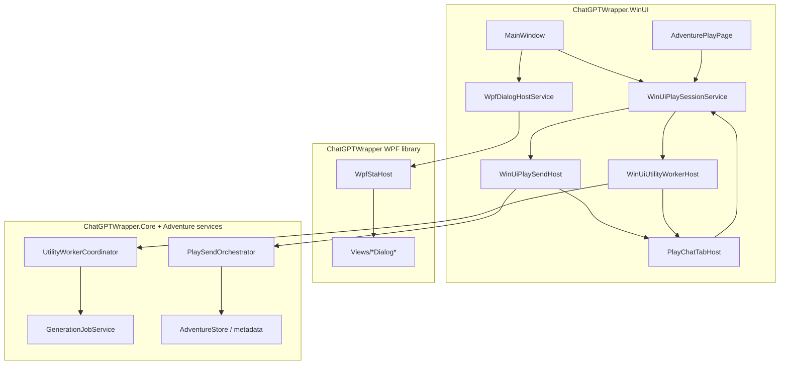
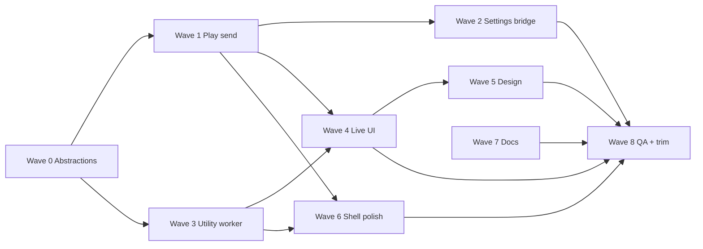

# WinUI Post-Migration Parity — Single-Pass Implementation Plan

End-to-end execution plan to close the **functional parity gap** between the shipped WinUI shell and the former WPF `MainWindow` orchestration layer in **one coordinated pass** (one branch, one review cycle, one manual QA gate).

**Linear epic:** [CMD-521](https://linear.app/cmd0112/issue/CMD-521) · Parent: [CMD-478](https://linear.app/cmd0112/issue/CMD-478)

**Companion docs:** [winui-shell-migration-adr.md](../adr/winui-shell-migration-adr.md) · [winui-ux-parity-backlog.md](winui-ux-parity-backlog.md) · [play-send-orchestration-implementation-plan.md](play-send-orchestration-implementation-plan.md) · [utility-worker-lane-plan.md](utility-worker-lane-plan.md)

*Created: 2026-07-05*

---

## Executive summary

### Current state

| Layer | Status |
|-------|--------|
| **WinUI exe** | Sole host (`run.ps1`) — shell, navigation, dashboard, play/design scaffolds |
| **WPF project** | Dialog/domain library via `WpfDialogHostService` + STA thread |
| **XAML Islands** | Removed |
| **Play send / compose** | `PlaySendOrchestrator` + `IPlaySendHost` implemented on WPF `MainWindow` only |
| **Utility worker** | `IUtilityWorkerHost` on WPF `MainWindow` only |
| **Live UI** | Cockpit, companion Warnings/State, AI tools list — placeholder scaffolds |
| **Design in-session** | Step nav only; full `AdventureDesignView` not ported |

### Single-pass goal

After this pass:

1. Daily play loop works entirely on WinUI: **pin → compose → preview → send → post-turn utility job**.
2. Play settings dialog callbacks round-trip through the WPF bridge.
3. Session cockpit, companion tabs, and generation job UI show **live data**.
4. Design in-session workspace reaches functional parity with WPF.
5. Shell status chips reflect job-active and bridge health.
6. Dialog bridge inventory + ADR updated; manual QA matrix passed ([CMD-532](https://linear.app/cmd0112/issue/CMD-532)).
7. WPF host partials retired or reduced to dialog-only code ([CMD-517](https://linear.app/cmd0112/issue/CMD-517)).

### Non-goals (defer)

- Native WinUI port of every WPF dialog ([CMD-515](https://linear.app/cmd0112/issue/CMD-515) batches).
- SessionHost out-of-process split ([CMD-377](https://linear.app/cmd0112/issue/CMD-377), [CMD-365](https://linear.app/cmd0112/issue/CMD-365)).
- Full dashboard UX revamp beyond action parity ([CMD-499](https://linear.app/cmd0112/issue/CMD-499)).

---

## Critical architectural constraint

`IPlaySendHost`, `ChatGptPlayComposeInjection`, `PlayTabSessionResolver`, and `IUtilityWorkerHost` today assume **WPF** `Microsoft.Web.WebView2.Wpf.WebView2` and WPF `TabControl`.

WinUI play tabs use **`Microsoft.UI.Xaml.Controls.WebView2`**.

**Wave 0 must decouple orchestration from WPF control types** before play send or utility worker can port. Do not duplicate orchestrators — lift shared runtime and adapt hosts.

---

## Issue map

| Wave | Linear | Title |
|------|--------|-------|
| 0 | — | Shared WebView / tab registry abstractions |
| 1 | [CMD-524](https://linear.app/cmd0112/issue/CMD-524) | Port play send orchestration to WinUI host |
| 1 | [CMD-531](https://linear.app/cmd0112/issue/CMD-531) | WebView page-host wiring (turn invalidation, nav guard) |
| 2 | [CMD-522](https://linear.app/cmd0112/issue/CMD-522) | Wire PlayPromptInjectionDialog host callbacks |
| 3 | [CMD-525](https://linear.app/cmd0112/issue/CMD-525) | Implement IUtilityWorkerHost on WinUI |
| 4 | [CMD-523](https://linear.app/cmd0112/issue/CMD-523) | Wire generation job UI to play cockpit |
| 4 | [CMD-526](https://linear.app/cmd0112/issue/CMD-526) | Complete session cockpit live panels |
| 4 | [CMD-527](https://linear.app/cmd0112/issue/CMD-527) | Complete companion Warnings/State tabs |
| 5 | [CMD-528](https://linear.app/cmd0112/issue/CMD-528) | Port AdventureDesignView in-session workspace |
| 6 | [CMD-529](https://linear.app/cmd0112/issue/CMD-529) | Shell status — job-active + bridge health |
| 6 | [CMD-530](https://linear.app/cmd0112/issue/CMD-530) | Dashboard action model parity |
| 6 | [CMD-533](https://linear.app/cmd0112/issue/CMD-533) | Thread manager + project host hardening QA |
| 7 | [CMD-535](https://linear.app/cmd0112/issue/CMD-535) | WPF dialog bridge inventory |
| 7 | [CMD-534](https://linear.app/cmd0112/issue/CMD-534) | Sync migration ADR |
| 8 | [CMD-532](https://linear.app/cmd0112/issue/CMD-532) | Manual QA smoke matrix |
| 8 | [CMD-517](https://linear.app/cmd0112/issue/CMD-517) | WPF library-only final trim |
| 8 | [CMD-518](https://linear.app/cmd0112/issue/CMD-518) | XAML Islands ADR reconciliation |

Related epics: [CMD-368](https://linear.app/cmd0112/issue/CMD-368) (play send) · [CMD-358](https://linear.app/cmd0112/issue/CMD-358) (utility worker) · [CMD-378](https://linear.app/cmd0112/issue/CMD-378) (send trace QA, blocked until CMD-524)

---

## Execution model

### Branch and PR

- **Branch:** `cmd-521-winui-post-migration-parity`
- **PR title:** `Ref CMD-521: WinUI post-migration parity — single pass`
- **PR body:** `Ref CMD-521` (manual QA — do not `Fixes` until CMD-532 passes)
- Work lands as **sequential commits per wave** (easier bisect) but merges as **one PR**.

### Definition of done (whole pass)

- [ ] `dotnet build` — 0 errors, 0 warnings
- [ ] ApiDiagnostics logged test: WinUI play send trace (or shared orchestrator test with WinUI host flag)
- [ ] ApiDiagnostics logged test: thread-manager activate + pin sequence
- [ ] [CMD-532](https://linear.app/cmd0112/issue/CMD-532) smoke matrix executed on WinUI host with evidence attached
- [ ] [CMD-378](https://linear.app/cmd0112/issue/CMD-378) send trace QA on WinUI host
- [ ] [CMD-534](https://linear.app/cmd0112/issue/CMD-534) ADR + architecture docs updated
- [ ] Partial phase issues (CMD-503, 505, 507, 508, 513, 488) moved to **Done** or **Done — Review Later** with **Verified** where QA passed

---

## Target architecture



---

## Wave 0 — Shared abstractions (enabler)

**Duration:** ~1 day · **Blocks:** Waves 1 and 3

### 0.1 Play tab registry abstraction

Replace WPF-specific tab resolution with a host-neutral registry.

| Task | File(s) |
|------|---------|
| Add `IPlayTabRegistry` with `CoreWebView2?`, pin key, enumerate tabs | `ChatGPTWrapper/Adventure/Services/PlaySend/IPlayTabRegistry.cs` (new) |
| Implement `WpfPlayTabRegistry` wrapping `TabControl` + WPF WebView2 | `ChatGPTWrapper/PlayTabRegistry.cs` (new) |
| Implement `WinUiPlayTabRegistry` wrapping `PlayChatTabHost` | `ChatGPTWrapper.WinUI/Services/WinUiPlayTabRegistry.cs` (new) |
| Refactor `PlayTabSessionResolver` to use `IPlayTabRegistry` instead of `TabControl` | `PlayTabSessionResolver.cs` |

### 0.2 Compose injection — CoreWebView2-centric

| Task | File(s) |
|------|---------|
| Refactor `ChatGptPlayComposeInjection` constructor to accept `CoreWebView2` + `Func<Task>` UI marshal (keep WPF overload as thin wrapper) | `ChatGptPlayComposeInjection.cs` |
| Register compose feature from `WinUiPlaySessionService.EnsurePageHostAsync` when play tab initializes | `WinUiPlaySessionService.cs`, `PlayChatTabHost.xaml.cs` |
| Wire `SendRequested` event → `WinUiPlaySendHost.RequestSendAsync` | new bridge in play session service |

### 0.3 Make `IPlaySendHost` assembly-visible to WinUI

| Task | File(s) |
|------|---------|
| Change `IPlaySendHost` from `internal` to `public` (or move to shared contracts file) | `IPlaySendHost.cs` |
| Same for `IUtilityWorkerHost` if WinUI implements it directly | `IUtilityWorkerHost.cs` |

### 0.4 Extract shared play-send runtime from MainWindow

Lift logic from `MainWindow.PlaySendHost.cs` and related partials into services that accept explicit dependencies (bundle, stores, navigation callbacks) rather than `MainWindow this`.

| Extract | From | To |
|---------|------|-----|
| Player input resolution | `MainWindow.PlayCompose.cs` | `PlaySendHostRuntime.ResolvePlayerInput` |
| Attachment context build | `MainWindow.PlayCompose.cs` | `PlaySendHostRuntime.BuildAttachmentContext` |
| Turn delivery + completion | `MainWindow.PlaySend.cs` | `PlaySendHostRuntime.DeliverPacketAsync` / `CompleteTurnAfterSendAsync` |
| Compose UI sync scripts | `MainWindow.PlayCompose.cs` | `PlayComposeUiSyncService` (CoreWebView2-only) |
| Send gate / artifact store | `MainWindow` fields | Owned by `WinUiPlaySendHost` instance per session |

WPF `MainWindow` becomes a thin `IPlaySendHost` adapter calling the same runtime (no behavior drift).

**Exit criteria:** Build succeeds; WPF host send path unchanged (smoke send on WPF if still reachable, or defer to Wave 8 QA on WinUI only).

---

## Wave 1 — Play send pipeline (P0)

**Issues:** [CMD-524](https://linear.app/cmd0112/issue/CMD-524), [CMD-531](https://linear.app/cmd0112/issue/CMD-531)

### 1.1 WinUiPlaySendHost

| Task | File(s) |
|------|---------|
| Create `WinUiPlaySendHost` implementing `IPlaySendHost` | `ChatGPTWrapper.WinUI/Services/WinUiPlaySendHost.cs` (new) |
| Own `PreparedSendArtifactStore`, send gate, active send count | same |
| Delegate delivery/turn/compose to `PlaySendHostRuntime` + `PlaySendOrchestrator` | same |
| Hold reference to `WinUiPlaySessionService`, `WinUiPlayTabRegistry`, `PlayChatTabHost` | same |

### 1.2 Wire compose → send on WinUI

| Task | File(s) |
|------|---------|
| On play tab `EnsurePageHostAsync`, register `ChatGptPlayComposeInjection` feature | `WinUiPlaySessionService.cs` |
| Subscribe injection `SendRequested` → orchestrator | `WinUiPlaySendHost.cs` |
| Implement `RefreshPlaySendArmState` equivalent (preview + armed/disarmed UI) | `WinUiPlaySendHost.cs`, `PlayFooterBar` or cockpit |
| Block send when `ShellStatusService.JobActive` or bridge unhealthy | `WinUiPlaySendHost.cs` |

### 1.3 Page-host wiring (CMD-531)

| Task | File(s) |
|------|---------|
| Turn invalidation on send complete — hook `PlaySendHostRuntime.OnSendSucceeded` → `AdventureTurnService.Invalidate` | `WinUiPlaySendHost.cs` |
| Navigation guard: block Browse/Back when compose dirty or job active | `MainWindow.xaml.cs` `NavigateToAdventuresAsync`, `ShellNavigationService` |
| Adventure switch: stop utility worker, clear compose, re-navigate play tab | `WinUiPlaySessionService.cs`, `PlayChatTabHost.xaml.cs` |
| Project host coordination on tab lifecycle | `WpfStaProjectHostBridge.cs`, `EnsureAdventureTabAsync` callback |

### 1.4 Tests

| Task | File(s) |
|------|---------|
| Logged diagnostic: compose mount → artifact freeze → send gate (mock CoreWebView2 or recorded trace) | `tests/ChatGPTWrapper.ApiDiagnostics/...` |
| Extend `PlaySendTraceTests` or add `WinUiPlaySendHostTests` with `[Trait("Diagnostics", "Logged")]` | same |

**Exit criteria:** Send trace shows `artifact_loaded` → `delivery_api` → `verify_ok` on WinUI host ([CMD-378](https://linear.app/cmd0112/issue/CMD-378) unblocked).

---

## Wave 2 — Play settings dialog callbacks (P0)

**Issue:** [CMD-522](https://linear.app/cmd0112/issue/CMD-522) · extends [CMD-507](https://linear.app/cmd0112/issue/CMD-507)

### 2.1 Play settings host bridge

| Task | File(s) |
|------|---------|
| Add `WinUiPlaySettingsDialogHost` mirroring `AdventurePlayView.WirePlaySettingsDialog` + `MainWindow.WireStandalonePlaySettingsDialog` | `ChatGPTWrapper.WinUI/Services/WinUiPlaySettingsDialogHost.cs` (new) |
| Wire all dialog delegates: preview composer, sources probe, thread actions, utility jobs, pin/handoff, review hub | same (copy delegate list from `AdventurePlayView.xaml.cs` ~L2027–2070) |
| Marshal async callbacks to WinUI UI thread via `WinUiShellCoordinator` | same |

### 2.2 WpfDialogHostService integration

| Task | File(s) |
|------|---------|
| Change `ShowPlaySettingsAsync` to accept optional `Action<PlayPromptInjectionDialog>` wire callback | `WpfDialogHostService.cs` |
| Call `WinUiPlaySettingsDialogHost.Wire(dlg)` before `ShowDialog()` | same |
| Pass `previewPlayerLine` from active compose injection when available | same |

**Exit criteria:** Open Play settings from session bar → change injection → Apply → compose preview updates → send uses new injection.

---

## Wave 3 — Utility worker host (P1)

**Issue:** [CMD-525](https://linear.app/cmd0112/issue/CMD-525) · extends [CMD-358](https://linear.app/cmd0112/issue/CMD-358)

### 3.1 WinUiUtilityWorkerHost

| Task | File(s) |
|------|---------|
| Create offscreen WinUI `WebView2` host (hidden `Border`, negative margin pattern from WPF) | `ChatGPTWrapper.WinUI/Services/WinUiUtilityWorkerHost.cs` (new) |
| Implement `IUtilityWorkerHost` — mirror `MainWindow.UtilityWorkerHosting.cs` | same |
| Register worker tab, background hosting, DOM attachment scope, cookie source | same |
| `GetPlayWebView()` → WinUI play tab via `WinUiPlayTabRegistry` | same |

### 3.2 Coordinator wiring

| Task | File(s) |
|------|---------|
| Instantiate `UtilityWorkerCoordinator` in `WinUiPlaySessionService` on adventure load | `WinUiPlaySessionService.cs` |
| Start/stop worker on adventure switch and play session dispose | same |
| `OnOutboxBatchCompleted` → refresh cockpit job buttons + companion state | same |
| `SetStatus` → `ShellStatusService` + session bar | `ShellStatusService.cs` |

### 3.3 Tests

| Task | File(s) |
|------|---------|
| Logged diagnostic: worker pin + ping job or mock outbox drain | ApiDiagnostics |

**Exit criteria:** Post-turn utility job completes on WinUI host; job-active chip updates (Wave 6 may refine probe).

---

## Wave 4 — Live play UI (P1)

**Issues:** [CMD-523](https://linear.app/cmd0112/issue/CMD-523), [CMD-526](https://linear.app/cmd0112/issue/CMD-526), [CMD-527](https://linear.app/cmd0112/issue/CMD-527)

### 4.1 Session cockpit live panels (CMD-526)

Reference WPF: `AdventurePlayView` session cockpit sections.

| Task | File(s) |
|------|---------|
| Bind Session panel to `AdventureBundle`, thread metadata, link state | `PlaySessionCockpit.xaml.cs` |
| Narrator minimal/full modes from bundle settings | same |
| Subscribe `WinUiPlaySessionService.StatusChanged` + store events → `ResyncFromStore()` | same, `ViewCommandBar.xaml.cs` |
| Cockpit expander persist via existing `PlayCompanionRestoreService` | already partially wired |

### 4.2 Companion Warnings / State (CMD-527)

| Task | File(s) |
|------|---------|
| Warnings tab: bind to play warning service / review queue count | `PlayCompanionHost.xaml.cs`, new `PlayCompanionWarningsPanel` if needed |
| State tab: entity/state preview cards + expander (port from WPF companion) | same |
| Refresh on turn complete via `StatusChanged` + utility job completion | same |

### 4.3 Generation job UI (CMD-523)

| Task | File(s) |
|------|---------|
| Populate AI tools list from `GenerationJobService.GetAvailableJobs` / registry | `PlaySessionCockpit.xaml.cs` |
| Run / cancel actions → `UtilityWorkerCoordinator` or play injection path per router | same |
| Job progress → cockpit status + `ShellStatusService.JobActive` | same |

**Exit criteria:** No placeholder copy in cockpit/companion; AI tools list shows real jobs; run triggers worker/injection path.

---

## Wave 5 — Design in-session workspace (P1)

**Issue:** [CMD-528](https://linear.app/cmd0112/issue/CMD-528) · extends [CMD-508](https://linear.app/cmd0112/issue/CMD-508)/[CMD-509](https://linear.app/cmd0112/issue/CMD-509)

### 5.1 AdventureDesignView port strategy

Port **functional areas**, not line-for-line XAML — reuse WPF user controls via STA bridge only where WinUI port is prohibitive in this pass.

| Area | Approach | File(s) |
|------|----------|---------|
| Cast / scenario fields | WinUI `UserControl` sections mirroring WPF layout | `AdventureDesignPage.xaml` expand |
| Design thread WebView | Reuse design tab pin pattern (`WinUiDesignTabPin`) | `AdventureDesignPage.xaml.cs` |
| Entity reference panel | Wire `EntityReferencePanel` via WPF island **or** port read-only list first | evaluate size; prefer WinUI list bound to `entities.json` |
| Sources panel | `WpfDialogHostService` / embedded navigate to sources tab | `AdventureDesignPage` |
| Navigation guards | Block step change when dirty; confirm on adventure switch | `AdventureDesignService`, `MainWindow.xaml.cs` |

### 5.2 Integration

| Task | File(s) |
|------|---------|
| Session top bar design mode segment + design thread overflow | `SessionTopBar.xaml.cs` |
| Back/Continue already wired — connect to full step content | `AdventureDesignPage.xaml.cs` |

**Exit criteria:** In-session design: edit cast/scenario, open design thread, step through wizard steps without losing data.

---

## Wave 6 — Shell polish (P2)

**Issues:** [CMD-529](https://linear.app/cmd0112/issue/CMD-529), [CMD-530](https://linear.app/cmd0112/issue/CMD-530), [CMD-533](https://linear.app/cmd0112/issue/CMD-533)

### 6.1 Status chips (CMD-529)

| Task | File(s) |
|------|---------|
| `ShellStatusService.JobActive` ← utility worker + generation job state | `ShellStatusService.cs` |
| Bridge health ← shared `BridgeHealthService` probe (extract from WPF if needed) | new or existing service |
| `SessionTopBar` bind chips; remove hardcoded `false` | `SessionTopBar.xaml.cs`, `MainWindow.xaml.cs` `SyncSessionChrome` |

### 6.2 Dashboard actions (CMD-530)

| Task | File(s) |
|------|---------|
| Audit WPF dashboard handlers vs `AdventureDashboardPage` | `AdventureDashboardPage.xaml.cs` |
| Add missing context menu / card actions: rename, delete, export, duplicate | same + `WpfDialogHostService` |
| Wire empty/loading states | same |

### 6.3 Thread manager hardening (CMD-533)

| Task | File(s) |
|------|---------|
| Verify activate/open/pin/handoff/create-slot for play + design | manual + logged test |
| Adventure switch: no duplicate pins, orphaned WebViews | `PlayChatTabHost`, `WinUiThreadManagerBridge` |
| Logged diagnostic: thread-manager activate + pin | ApiDiagnostics |

---

## Wave 7 — Inventory and docs (P2)

**Issues:** [CMD-535](https://linear.app/cmd0112/issue/CMD-535), [CMD-534](https://linear.app/cmd0112/issue/CMD-534), feeds [CMD-515](https://linear.app/cmd0112/issue/CMD-515)

### 7.1 Dialog bridge inventory

| Task | Output |
|------|--------|
| Enumerate every `Views/*Dialog*` and `WpfDialogHostService` route | Table in ADR appendix |
| Mark: WinUI native / WPF STA bridge / unreachable / retired | same |
| Remove dead routes or wire missing entry points | code + table |

### 7.2 Documentation sync (CMD-534)

| Document | Updates |
|----------|---------|
| `docs/adr/winui-shell-migration-adr.md` | Phase status, remove island table, document STA bridge model |
| `docs/developer/architecture.md` | WinUI entry, WPF library role, orchestration ownership |
| `docs/reference/ui-components.md` | WinUI component catalog additions |
| Obsidian mirror | If vault mirror exists for changed docs |

---

## Wave 8 — QA gate and Phase 6 trim

**Issues:** [CMD-532](https://linear.app/cmd0112/issue/CMD-532), [CMD-517](https://linear.app/cmd0112/issue/CMD-517), [CMD-518](https://linear.app/cmd0112/issue/CMD-518)

### 8.1 Manual QA ([CMD-532](https://linear.app/cmd0112/issue/CMD-532))

Execute full smoke matrix on WinUI host (`run.ps1`). Attach screenshots/recordings to Linear issue.

Also execute [CMD-378](https://linear.app/cmd0112/issue/CMD-378) send trace verification on WinUI.

### 8.2 WPF library trim ([CMD-517](https://linear.app/cmd0112/issue/CMD-517))

Only after CMD-532 passes:

| Task | File(s) |
|------|---------|
| Remove or `#if false` WPF `MainWindow` host entry (`App.xaml` startup) if any remains | `ChatGPTWrapper/App.xaml.cs` |
| Delete unused `MainWindow.PlaySend*.cs` host paths once WinUI owns orchestration | WPF partials |
| Keep `Views/*`, dialog code, WPF controls used by STA bridge | — |
| Verify solution builds; WPF project = class library | `.csproj` |

### 8.3 XAML Islands reconciliation ([CMD-518](https://linear.app/cmd0112/issue/CMD-518))

| Task | |
|------|--|
| Confirm zero `Microsoft.Windows.XamlHost` references | grep + CI |
| Mark CMD-518 **Done**; ADR island section retired | ADR |

### 8.4 Close Linear issues

| Issue | Action |
|-------|--------|
| CMD-521 | Done when all children verified |
| CMD-503, 505, 507, 508, 513, 488 | Done + **Verified** |
| CMD-532 | Done + **Verified** + attach evidence |
| CMD-378 | Done + **Verified** |
| CMD-478 | Update sign-off checklist; Phase 5.5 complete |

---

## Suggested commit sequence

```
1. refactor(play): IPlayTabRegistry + CoreWebView2 compose injection
2. refactor(play-send): extract PlaySendHostRuntime from MainWindow
3. feat(winui): WinUiPlaySendHost + compose send wiring
4. feat(winui): page-host turn invalidation and nav guards
5. feat(winui): PlayPromptInjectionDialog host bridge
6. feat(winui): WinUiUtilityWorkerHost + coordinator wiring
7. feat(winui): cockpit/companion live data + generation job UI
8. feat(winui): AdventureDesignView in-session workspace
9. feat(winui): shell status chips + dashboard actions
10. test(diagnostics): WinUI play send + thread manager logged tests
11. docs: dialog inventory + ADR phase sync
12. chore(wpf): retire MainWindow host orchestration partials
```

---

## Risk register

| Risk | Mitigation |
|------|------------|
| WebView2 WPF vs WinUI type split blocks send port | Wave 0 abstraction — do not skip |
| Play settings dialog has 40+ wire delegates | Centralize in `WinUiPlaySettingsDialogHost`; copy from WPF verbatim first |
| Utility worker DOM attachment on WinUI offscreen host | Mirror WPF compositor-active pattern; test with real attachment job |
| Design view port scope creep | Functional parity only; defer pixel-perfect layout to follow-up |
| Single PR too large for review | Commits per wave; PR description lists waves with Linear links |
| WPF send regression during extract | Keep WPF adapter on shared runtime until Wave 8; compare traces |

---

## Dependency graph (waves)



---

## Quick reference — key files today

| Concern | WinUI today | WPF reference |
|---------|-------------|---------------|
| Play session | `WinUiPlaySessionService.cs` | `MainWindow.Adventures.cs` |
| Play send host | *missing* | `MainWindow.PlaySendHost.cs` |
| Compose injection | not wired | `ChatGptPlayComposeInjection.cs` |
| Utility worker | partial pin only | `MainWindow.UtilityWorkerHosting.cs` |
| Play settings dialog | `WpfDialogHostService.ShowPlaySettingsAsync` (no wire) | `AdventurePlayView.WirePlaySettingsDialog` |
| Thread manager | `WinUiThreadManagerBridge.cs` | `MainWindow` thread partials |
| Project API | `WpfStaProjectHostBridge.cs` | same |
| Cockpit / companion | scaffolds | `AdventurePlayView.xaml.cs` |
| Design in-session | `AdventureDesignPage` minimal | `AdventureDesignView.xaml` |

---

*This plan supersedes ad-hoc ordering in individual CMD-521 child issues when conflicts arise. Linear issues remain the tracking source of truth for acceptance criteria and QA evidence.*
