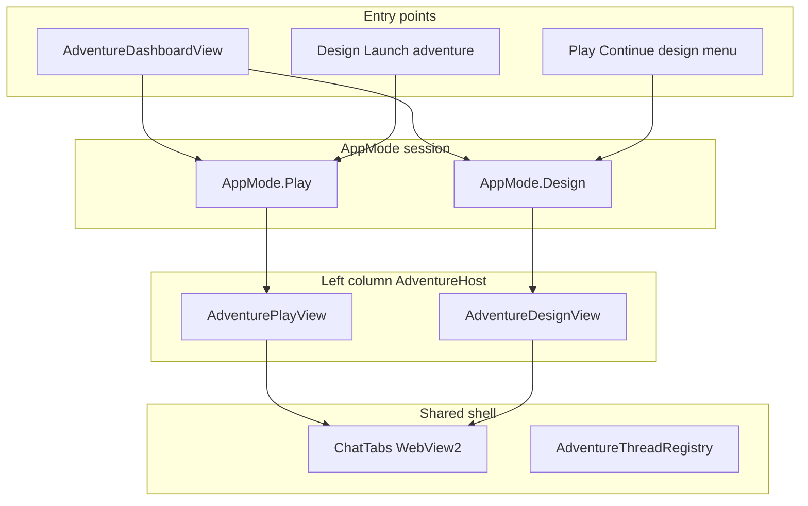

# Play/Design surface convergence (CMD-219)

Architecture decision record for combining or keeping separate the Play and Design adventure surfaces.

## Context

Authors context-switch between **Play** (`AdventurePlayView`) and **Design** (`AdventureDesignView`) — separate `AppMode` values, duplicate navigation chrome (back, link project, thread status, pin thread), and historically Play-only capabilities such as entity editing.

[CMD-210](https://linear.app/cmd0112/issue/CMD-210) shipped partial friction relief: shared [`EntityReferencePanel`](../ChatGPTWrapper/Views/EntityReferencePanel.xaml.cs) in Play → Reference and Design → Cast without merging the hosts. This ADR evaluates whether to go further.

Parent spike: [CMD-21](https://linear.app/cmd0112/issue/CMD-21) · Implementation child: [CMD-219](https://linear.app/cmd0112/issue/CMD-219).

## Current architecture

Toolbar mode buttons are **Browse** and **Adventures** only. **Play** and **Design** are session modes entered from the adventure dashboard or cross-links inside an active session.

### How users switch today

| Direction | Path | Key code |
|-----------|------|----------|
| Dashboard → Play | Play button, double-click, context menu | `StartPlayModeAsync` — `MainWindow.Adventures.cs` |
| Dashboard → Design | **Design with AI…**, **Continue design…** | `StartDesignModeAsync` — `MainWindow.DesignTab.cs` |
| Play → Design | Header/footer **Continue design…** | `OpenContinueDesignWizardAsync` — `MainWindow.AdventureDesign.cs` |
| Design → Play | **Launch adventure** (start play checked) | `LaunchDesignedAdventureAsync` → `StartPlayModeAsync` |
| Either → Library | Shell **← Library**, view **← Dashboard**, toolbar Browse/Adventures | `LeaveActiveAdventureSession` |

**There is an in-session Play/Design toggle** in shell chrome (`ShellPlayModeButton` / `ShellDesignModeButton` in `MainWindow.xaml`). Switching keeps the active adventure session and swaps `AdventureHost` content plus layout (`MainWindow.AdventureSessionMode.cs`). Play hides its in-view back button when shell breadcrumb is active; Design always shows **← Dashboard** for library exit.

Legacy cross-links (**Continue design…**, **Launch adventure**) route through the same switch when already in a Play or Design session.

### Shell layout per mode

`SetAppMode(AppMode)` in `MainWindow.Adventures.cs`:

| `AppMode` | Left column | Chat column | Notes column | `AdventureHost` |
|-----------|-------------|-------------|--------------|-----------------|
| **Play** | Resizable play panel + companion tabs | `*` width | Optional notes rail | `_playView` |
| **Design** | Fixed ~420px design panel | `*` width | Collapsed (width 0) | `_designView` |

Play layout: `ApplyAllPlayPanelLayouts`, `PlayLayoutCoordinator` tiers, `PlayRightCompanionHost`.  
Design layout: `ApplyDesignPanelLayout` — `MainWindow.DesignTab.cs`.

Event wiring is parallel but separate: ~30 delegates in `StartPlayModeAsync` vs `WireDesignView`.

## Options compared

### Option 1 — Status quo (separate modes, shared components)

Keep `AppMode.Play` and `AppMode.Design` as distinct session hosts. Continue extracting shared UserControls and services (entity panel, thread manager, source manager, reconcile) without merging views.

| Pros | Cons |
|------|------|
| Lowest risk; matches current mental model | Authors still leave Play to open Design (wizard/menu) |
| Thread pins, jobs, injection stay isolated | Some duplicate chrome (back, link, thread toolbar) |
| CMD-210 already reduced entity-editing friction | Two layout systems to maintain |

### Option 2 — Mode toggle (single adventure host)

Single adventure session with an in-chrome **Play / Design** switch. Shared left column host; mode selects companion content (play tabs vs design step tabs) and WebView resolve target. Thread registry still has Play and Design kinds.

| Pros | Cons |
|------|------|
| In-session switching without wizard round-trip | Medium–high effort: `SetAppMode` refactor, host wrapper |
| Reuses shared components from Option 1 | Job routing and nav recovery need `AdventureSessionMode` abstraction |
| Natural follow-on after CMD-210 | Play notes rail + responsive tiers vs fixed design width |

### Option 3 — Unified companion

One side panel combining Reference + Design steps + Sources. Browser tab routing unchanged; companion tabs span play and design concerns.

| Pros | Cons |
|------|------|
| Single companion mental model | Highest UI risk: reparenting, tab model, responsive tiers |
| Fewer mode switches | Collides Play layout presets with Design step wizard |
| | Hardest to ship incrementally |

### Summary table

| | Option 1 | Option 2 | Option 3 |
|--|----------|----------|----------|
| **Shell** | Separate `AppMode` + hosts | Single host + toggle | Unified companion tabs |
| **Thread pins** | Unchanged | Two kinds; switch resolves WebView | Same + tab sprawl |
| **Effort** | Low (ongoing extraction) | Medium–high | High |
| **Risk** | Lowest | Medium | Highest |
| **CMD-210 fit** | Delivers partial relief now | Next step if toggle wanted | Overlaps unrelated layout systems |

## Merge inventory

### Already shared — continue extracting here

| Component | Path |
|-----------|------|
| Entity reference + edit | `EntityReferencePanel`, `EntityReferenceEditService`, `EntityEditFormHost`, `EntityEditDialog` |
| Thread manager UI | `AdventureThreadManagerDialog` |
| Thread registry | `AdventureThreadRegistryService` |
| Project link / source manager | `OpenProjectWorkspaceAsync`, `OpenSourceManagerDialogAsync` |
| Shell theme | `WrapperTokens.xaml`, `ThemeApplicationService` |
| Phrase highlights | `GetPhraseHighlightRules` wired in both Play and Design hosts |

### Must stay mode-specific (or need heavy abstraction)

| System | Play | Design | Primary files |
|--------|------|--------|---------------|
| Thread pin | `PlayTabPinService` | `DesignTabPinService` | `PlayTabPinService.cs`, `DesignTabPinService.cs` |
| WebView resolve | `FindProjectApiWebView` | `ResolveDesignWebView` | `MainWindow.Adventures.cs`, `MainWindow.DesignTab.cs` |
| Send pipeline | `SendPlayPromptAsync`, `cgw-play-compose.js` | Step brief, DOM chat, extract | `MainWindow.PlayInjection.cs`, `MainWindow.AdventureDesign.cs` |
| Generation jobs | Play / utility WebView | Design WebView + `_designView.SetStatus` | `MainWindow.GenerationJobs.cs` |
| Notes companion | `PlayRightCompanionHost`, `AdventureNotesPanel` | Notes column width 0 | `MainWindow.Adventures.cs` |
| Navigation recovery | `AdventureNavigationIntent.Play` | `AdventureNavigationIntent.Design` | `MainWindow.AdventureNavigationGuard.cs` |
| Responsive layout | `PlayLayoutCoordinator` tiers | Fixed design panel width | `Adventure/Services/PlayLayout/` |

See also [adventure-thread-registry.md](adventure-thread-registry.md) — Play and Design remain distinct thread kinds in the registry regardless of UI merge outcome.

## Risk assessment

| Risk | Option 1 | Option 2 | Option 3 |
|------|----------|----------|----------|
| Play session regression (turn send, pin, compose) | Low | Medium — mode switch during active play | High |
| Design workflow regression (extract, proposals, launch) | Low | Medium | High |
| Generation job mis-routing | Low | Medium — centralize WebView resolve | High |
| Navigation guard / recovery wrong intent | Low | Medium | High |
| Layout / responsive tier breakage | Low | Medium | High |
| Author confusion | Medium — two modes remain | Low — explicit toggle | Medium — overloaded companion |

**Migration touchpoints for Option 2+:** `SetAppMode`, `LeaveActiveAdventureSession`, `MainWindow.Adventures.cs`, `MainWindow.DesignTab.cs`, `MainWindow.GenerationJobs.cs`, `MainWindow.AdventureNavigationGuard.cs`, `AdventurePlayView` / `AdventureDesignView` host wrapper, shell breadcrumb.

## Recommendation

**Decision: Option 2 (mode toggle) — shipped ([CMD-230](https://linear.app/cmd0112/issue/CMD-230)).**

1. **In-chrome Play/Design toggle** during an active adventure session. Separate `AppMode.Play` / `AppMode.Design` values remain; switching reuses `_activeAdventureId`, swaps `AdventurePlayView` / `AdventureDesignView` in `AdventureHost`, and applies mode-specific layout.
2. **`AdventureSessionModePolicy`** ([CMD-229](https://linear.app/cmd0112/issue/CMD-229)) gates Design availability (designing status, local sources, wizard-needed, blocked when play turns exist without sources).
3. **Continue shared-component extraction** on the Option 1 path: entity panel, thread manager, source manager, reconcile, phrase rules — without a unified companion shell (Option 3 still not recommended).
4. **Thread pins stay per-kind** (Play vs Design); mode switch selects the appropriate WebView tab.

### Phased rollout

| Phase | Scope | Status |
|-------|-------|--------|
| **0** | Shared `EntityReferencePanel` (CMD-210/211) | In Review |
| **1** | Status quo + continued shared controls | Done |
| **2** | Mode toggle (Option 2) — shell toggle + session switch | **Shipped** ([CMD-230](https://linear.app/cmd0112/issue/CMD-230)) |
| **3** | Unified companion (Option 3) | Not recommended without further product need |

### CMD-21 disposition

**In Progress → Done** when [CMD-230](https://linear.app/cmd0112/issue/CMD-230) and [CMD-231](https://linear.app/cmd0112/issue/CMD-231) sign off. Supersedes partial-defer Icebox outcome from 2026-06-19 per product decision to implement Option 2.

## Related

- [CMD-21](https://linear.app/cmd0112/issue/CMD-21) — parent spike epic
- [CMD-219](https://linear.app/cmd0112/issue/CMD-219) — this ADR
- [CMD-210](https://linear.app/cmd0112/issue/CMD-210) — Design entity editing (partial relief)
- [architecture.md](architecture.md) — Application modes
- [adventure-panel.md](adventure-panel.md) — Play/Design user flows
- [adventure-thread-registry.md](adventure-thread-registry.md) — thread kind model
- [services-reference.md](services-reference.md) — design suite and generation jobs
