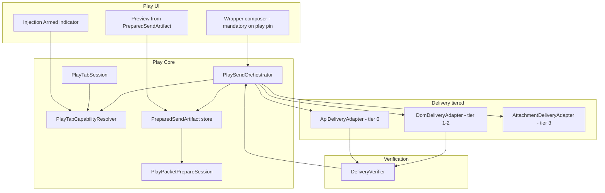

# Play Send Orchestration — Implementation Plan

Comprehensive execution plan for **host-owned, API-canonical play packet delivery** with verified delivery and no native-composer bypass.

**Companion ADR (normative):** [play-send-orchestration-adr.md](play-send-orchestration-adr.md)

**Motivation:** Draft-only sends, preview/send drift, passthrough policy bugs, DOM fill truncation, and schema-6 pin drift. See [troubleshooting.md](troubleshooting.md) (`play-send-trace.jsonl`).

**Related:** [architecture.md](architecture.md) · [webview-bridges.md](webview-bridges.md) · [chatgpt-api-integration.md](chatgpt-api-integration.md) · [injection-policy-adr.md](injection-policy-adr.md) · [play-thread-canonical-adr.md](play-thread-canonical-adr.md) · [services-reference.md](services-reference.md)

---

## Executive summary

### Product principles

| # | Principle | Implementation meaning |
|---|-----------|------------------------|
| **1** | **Host owns send** | User draft ≠ delivered message. Only `PlaySendOrchestrator` may deliver play packets. |
| **2** | **Preview is contract** | `PreparedSendArtifact` bytes + hash are what ChatGPT receives; stale preview blocks send. |
| **3** | **API-first text** | Bound play thread → `ConversationSendService`; DOM is gated fallback/bootstrap only. |
| **4** | **Fail closed** | Disarmed, unverified, or blocked → no send; never silent native fallback. |
| **5** | **One session truth** | Pin, WebView, conversation id, and capabilities derive from `PlayTabSession`. |

### What success looks like

- On a pinned play thread with **Injection Armed**, every send delivers the previewed merged packet (verified).  
- `play-send-trace.jsonl` shows orchestrator states: `artifact_loaded` → `delivery_api` → `verify_ok` (or explicit `blocked` / `failed` with reason).  
- Native ChatGPT composer cannot submit play content on the play pin.  
- Regression suite: capability matrix + orchestrator + artifact contract + composer DOM fixtures.  
- Legacy intercept / passthrough / DOM-default paths removed.

### Non-goals (this epic)

- Play-thread utility injection transport ([play-thread-utility-orchestration-plan.md](play-thread-utility-orchestration-plan.md)) — coordinate only at artifact/orchestrator boundaries.  
- Injection policy dedup ([injection-policy-implementation-plan.md](injection-policy-implementation-plan.md)) — artifact uses existing `PlayPacketPrepareSession`.  
- Full SessionHost process split — phased last; orchestrator API designed for it from day one.

---

## Current state (baseline)

### Already in place (reuse)

| Area | Evidence | Reuse in this plan |
|------|----------|-------------------|
| Packet merge | `PlayPacketPrepareSession`, `PromptInjectionService.PrepareSend` | Build `PreparedSendArtifact` |
| API send | `ChatGptConversationSendService.SendUserMessageAsync` | Tier 0 delivery |
| DOM send | `adventure-bridge.js` fill/readback/submit | Tier 1–2 via `DomDeliveryAdapter` |
| Send trace | `PlaySendTrace`, `play-send-trace.jsonl` | Map to orchestrator states |
| Pin registry | `PlayTabPinService`, `AdventureThreadRegistryService` | `PlayTabSession` source |
| Compose UI | `cgw-play-compose.js`, `ChatGptPlayComposeInjection` | Wrapper composer mode |
| Policy tests | `PlayComposeInjectionPolicyTests`, `ProjectChatDraftServiceTests` | Superseded by capability matrix |
| Session host stub | `ChatGPTWrapper.SessionHost`, `IChatGptSessionHost` | Phase 8 host migration |

### Known gaps (motivation)

| Gap | Symptom | This plan addresses |
|-----|---------|---------------------|
| Native intercept primary | No `send_run_start`; draft reaches ChatGPT | Phase 3 — wrapper-only input |
| Passthrough / suppress flags | Wrong URL enables native send | Phase 1 — capability resolver |
| DOM-default text | `fill_incomplete`, truncated delivery | Phase 5 — API canonical |
| Re-prepare at send | Preview ≠ delivered | Phase 2 — frozen artifact |
| Scattered orchestration | `MainWindow.PlayInjection.cs` | Phase 4 — orchestrator |
| Weak success criteria | `bridge_fill_ok` without verify | Phase 6 — verification gate |
| Pin / WebView drift | Wrong tab after schema 6 | Phase 1 — `PlayTabSession` |
| No runtime arm indicator | User can't tell if injection active | Phase 7 — Injection Armed UI |

### Interim fixes (keep until phased out)

Recent patches (`ShouldSuppressPlayAutomation` play-thread URL fix, passthrough clear on register, native click block) remain until Phase 3/5/9 delete the legacy paths.

---

## Target architecture



### Core types (conceptual)

```csharp
// ChatGPTWrapper/Adventure/Services/PlaySend/

sealed record PlayTabSession(
    Guid AdventureId,
    string PinTabKey,
    string? ConversationId,
    PlayAutomationProfile Profile,
    SessionHealth Health);

sealed record PlayTabCapabilities(
    bool AcceptPlayDraft,
    bool AllowSend,
    bool AllowNativeComposerInput,
    PlayDeliveryChannel DeliveryChannel,
    string? DisarmReason);

enum PlayDeliveryChannel { None, Api, DomBootstrap, DomFallback }

sealed record PreparedSendArtifact(
    string MergedText,
    string Hash,
    string SettingsFingerprint,
    int TurnIndex,
    DateTimeOffset PreparedAt,
    InjectionSectionManifest Manifest);

sealed record PlaySendResult(
    PlaySendOutcome Outcome,
    string? ReasonCode,
    string? ConversationId,
    DeliveryVerification? Verification);
```

---

## Phase breakdown

| Phase | Name | Duration estimate | Depends on |
|-------|------|-------------------|------------|
| **0** | ADR + inventory spike | 1–2 sessions | — |
| **1** | `PlayTabSession` + capability resolver | 3–5 sessions | Phase 0 |
| **2** | `PreparedSendArtifact` contract | 2–4 sessions | Phase 1 |
| **3** | Mandatory wrapper composer | 3–5 sessions | Phase 1 |
| **4** | `PlaySendOrchestrator` | 5–8 sessions | Phases 1–3 |
| **5** | API-canonical delivery | 4–6 sessions | Phase 4 |
| **6** | Delivery verification | 3–4 sessions | Phase 5 |
| **7** | Injection Armed UI | 2–3 sessions | Phases 1, 2, 4 |
| **8** | SessionHost extraction | 4–6 sessions | Phase 4 |
| **9** | Legacy retirement + docs | 2–4 sessions | Phases 3–8 |

**Total:** ~29–47 focused sessions.

---

## Phase 0 — ADR & inventory

### Deliverables

- [x] [play-send-orchestration-adr.md](play-send-orchestration-adr.md) (this repo)  
- [x] Inventory table: appendix in ADR  
- [x] Map each callsite → future owner (ADR appendix A)  
- [x] `INDEX.md` cross-links  
- [ ] Create Linear epic + child issues (optional)

### Tasks

1. Grep inventory; append to ADR appendix.  
2. List `play-send-trace` events → orchestrator state mapping (draft).  
3. Create Linear epic + child issues (optional; link from ADR when created).

---

## Phase 1 — `PlayTabSession` + capability resolver

### Goals

Single binding object; exhaustive capability matrix; delete boolean flag soup.

### New files

| File | Role |
|------|------|
| `Adventure/Services/PlaySend/PlayTabSession.cs` | Aggregate + load/save with registry |
| `Adventure/Services/PlaySend/PlayTabSessionFactory.cs` | Build session from bundle |
| `Adventure/Services/PlaySend/PlayTabCapabilityResolver.cs` | Normative matrix from ADR |
| `Adventure/Services/PlaySend/PlayTabCapabilityContext.cs` | Resolver inputs |
| `Adventure/Services/PlaySend/PlayTabCapabilities.cs` | Capability struct |
| `Adventure/Services/PlaySend/PlayAutomationProfile.cs` | Profile enum |
| `Adventure/Services/PlaySend/PlayDeliveryChannel.cs` | Delivery tier enum |
| `Adventure/Services/PlaySend/PlayDisarmReason.cs` | UI / trace reason codes |
| `Adventure/Services/PlaySend/SessionHealth.cs` | Session health enum |

**Status:** Core types and resolver **implemented**; `ProjectChatDraftService.ShouldSuppressPlayAutomation` delegates to resolver; `MainWindow.PlayTab` uses `PlayTabSessionResolver` for capabilities and pinned WebView lookup.

### Migration tasks

| Task | Detail |
|------|--------|
| Replace `ResolvePlayWebView` reads | `PlayTabSessionFactory.FromAdventure(id, ChatTabs)` |
| Replace `GetPlayPinKey` scatter | Session is authority; pin service writes through session |
| Wire navigation guard | `RefreshCapabilities(session, url)` on every navigation complete |
| Deprecate | `PlayComposeInjectionPolicy.SuppressPlayAutomation` params — matrix replaces |

### Tests

| Test file | Coverage |
|-----------|----------|
| `PlayTabCapabilityResolverTests.cs` | Full matrix: ≥20 `(url, pin, conversation, draft)` rows |
| `PlayTabSessionFactoryTests.cs` | Schema 6 registry pin; tab close invalidates |
| Migrate | `PlayComposeInjectionPolicyTests` → capability tests where redundant |

### Acceptance gate

- [x] Capability matrix unit tests (`PlayTabCapabilityResolverTests`)  
- [x] Legacy `ProjectChatDraftServiceTests` still pass via resolver delegation  
- [ ] No production code reads `metadata.PinnedPlayTabKey` for send decisions  
- [ ] `ProjectChatDraftService.ShouldSuppressPlayAutomation` deleted (Phase 9)

---

## Phase 2 — `PreparedSendArtifact` contract

### Goals

Preview bytes = send bytes; stale settings block send.

### New files

| File | Role |
|------|------|
| `PreparedSendArtifact.cs` | Immutable record + hash |
| `PreparedSendArtifactBuilder.cs` | Wraps `PlayPacketPrepareSession` |
| `PreparedSendArtifactStore.cs` | Per-adventure current artifact; invalidation on settings change |
| `PreparedSendSettingsFingerprint.cs` | Settings/override fingerprint |
| `PreparedSendArtifactMapper.cs` | Map artifact → `PromptInjectionPrepareResult` for send |

**Status:** Implemented; preview debounce stores artifact; send uses cached artifact when player line + turn count match.

### Tasks

| Task | Detail |
|------|--------|
| Debounced prepare | On compose text change → build artifact → update preview UI |
| Settings fingerprint | Hash adventure settings + injection staging relevant to `PrepareSend` |
| Invalidation | Any fingerprint change → `Stale` flag; Send disabled |
| Copy packet | Clipboard uses artifact.MergedText |
| Send path | Orchestrator loads artifact by id/hash — **no** second `PrepareSend` |

### UI

- `PlayPromptComposer` / play panel preview binds to artifact text + manifest (from `InjectionSectionManifest` when available).  
- Show `PreparedAt`, `TurnIndex`, hash prefix in debug/diagnostics expander.

### Tests

| Test | Assert |
|------|--------|
| `PreparedSendArtifactTests` | Same inputs → same hash; settings change → invalidate |
| `PlayPacketPrepareSessionTests` | Artifact builder matches direct prepare |
| Regression | Changing narrator override after prepare blocks send until refresh |

### Acceptance gate

- [x] Preview builds artifact via `PreparedSendArtifactBuilder`  
- [x] Send uses cached artifact when fingerprint + player line + turn count match  
- [x] `PreparedSendArtifactTests` (stale detection, parity with `PlayPacketPrepareSession`)  
- [ ] Send hard-blocked in UI when artifact stale (Phase 7)  

---

## Phase 3 — Mandatory wrapper composer

### Goals

Eliminate native intercept class (I1); user cannot submit from native composer on play pin.

### JS changes (`cgw-play-compose.js`)

| Task | Detail |
|------|--------|
| Play pin policy | `localSetWrapperComposer(true)` when capabilities.`AcceptPlayDraft` |
| Native input | `contenteditable=false` or focus-steal + block input on native composer |
| Native submit | Always `preventDefault` on play pin when `!AllowNativeComposerInput` |
| Remove | Primary reliance on `triggerNativeSend` / intercept for play |

### C# changes

| Task | Detail |
|------|--------|
| `ShouldUseWrapperComposer` | Return `true` when session capabilities accept draft |
| `RegisterPlayComposeInjection` | Register wrapper mode only; delete passthrough branches for play pin |
| Send button | Wrapper `.cgw-compose-send` → `cgwComposeSend` → orchestrator (Phase 4) |

### Tests

| Test | Assert |
|------|--------|
| `PlayComposeWrapperMandatoryTests` | Native click/enter does not post message; wrapper send does |
| Update | `PlayComposeNativeTests` — mark native-primary tests obsolete or move to DomBootstrap-only |

### Acceptance gate

- [ ] Manual: pinned play tab — typing in native composer does not work; wrapper composer works  
- [ ] Trace: no `compose_send_start` with `reason: native-enter` on play pin  

---

## Phase 4 — `PlaySendOrchestrator`

### Goals

Extract all send logic from `MainWindow.PlayInjection.cs`; explicit state machine; testable without WPF dialogs.

### New files

| File | Role |
|------|------|
| `Adventure/Services/PlaySend/PlaySendOrchestrator.cs` | State machine |
| `Adventure/Services/PlaySend/PlaySendPreflight.cs` | Sources gate, thread ready, conduit warm, gates |
| `Adventure/Services/PlaySend/PlaySendTraceMapper.cs` | Orchestrator state → `PlaySendTrace` events |
| `Adventure/Services/PlaySend/IPlaySendUiHost.cs` | Abstract MessageBox / status (MainWindow implements) |

### State machine (implement as enum + transitions)

```text
Idle
  → ValidateSession      (session null / tab disposed → Failed)
  → ResolveCapabilities  (log capabilities snapshot)
  → LoadArtifact         (missing/stale → Blocked)
  → Preflight            (sources, thread, warmup → Blocked)
  → Deliver              (delegate to adapters)
  → Verify               (Phase 6)
  → RecordTurn           (turn log, registry, pin)
  → CaptureAssistant     (existing CompletePlayTurnAfterSend logic)
  → Idle
```

### Migration from `MainWindow.PlayInjection.cs`

| Current | Move to |
|---------|---------|
| `SendPlayPromptAsync` body | `Orchestrator.RequestSendAsync` |
| `ReleaseComposeSendLockAsync` | Orchestrator terminal states → compose UI sync |
| `SendPlayPromptWithContextAsync` | `ApiDeliveryAdapter` + preflight retry |
| Sources dialog | `PlaySendPreflight` returns `UserPromptRequired.SourcesInlineFallback` |
| Gate `_playSendGate` | Inside orchestrator |

### `MainWindow` after

- Wire `PlaySendOrchestrator` + `IPlaySendUiHost`  
- `PlayInjection.cs` reduced to: preview debounce, artifact store hooks, arm/disarm display  

### Tests

| Test | Assert |
|------|--------|
| `PlaySendOrchestratorTests.cs` | Each block reason; happy path with mocked adapters |
| `PlaySendPreflightTests.cs` | Sources published/unpublished; conduit cold |
| Port | `PlayNativeSendInjectionPipelineTests` → orchestrator + artifact |

### Acceptance gate

- [ ] `MainWindow.PlayInjection.cs` < 200 lines (orchestration gone)  
- [ ] All former `send_run_end` outcomes producible from orchestrator tests  

---

## Phase 5 — API-canonical delivery

### Goals

Tier 0 default for bound play threads; DOM only bootstrap/fallback.

### New files

| File | Role |
|------|------|
| `Adventure/Services/PlaySend/ApiDeliveryAdapter.cs` | Wraps `ChatGptConversationSendService` |
| `Adventure/Services/PlaySend/DomDeliveryAdapter.cs` | Wraps bridge fill/submit; tier 1–2 only |
| `Adventure/Services/PlaySend/AttachmentDeliveryAdapter.cs` | Split from text path |

### Tasks

| Task | Detail |
|------|--------|
| Default settings | `PreferDomPlaySend = false` for new adventures; migration note in UI |
| Orchestrator routing | `DeliveryChannel.Api` → `ApiDeliveryAdapter` only |
| Api failure taxonomy | Retryable → tier 2 DOM; non-retryable → fail + clipboard |
| Bootstrap | `DomBootstrap` for start/handoff only; bind conversation id on success |
| Warmup gate | `PlaySendPreflight` requires conduit/parent warm before Api deliver |
| Delete | `PlaySendDeliveryPolicy.PreferDom` as default-true behavior |

### Tests

| Test | Assert |
|------|--------|
| `ApiDeliveryAdapterTests.cs` | Mock bridge SSE; artifact text on wire |
| `DomDeliveryAdapterTests.cs` | Only invoked when Api fails or bootstrap |
| Integration | WebView2 harness with mock api-bridge |

### Acceptance gate

- [ ] Linked play thread send never calls `fillComposer` on happy path  
- [ ] Trace event `delivery_api` with `artifact_hash` on success  

---

## Phase 6 — Delivery verification

### Goals

Fail closed; no `Success` without proof.

### New files

| File | Role |
|------|------|
| `Adventure/Services/PlaySend/DeliveryVerifier.cs` | Post-delivery checks |
| `Adventure/Services/PlaySend/DeliveryVerification.cs` | Result record |

### Verification rules

| Channel | Pass criteria |
|---------|---------------|
| Api | `apiResult.Success`; parent message id; `GetUserTurnCount` increased |
| Dom | Readback hash or capture user node matches `artifact.Hash` (tolerance policy documented); turn count +1 |
| Either fail | `DeliveryUnverified` turn state; repair offer; clipboard artifact |

### Trace events

- `verify_start`, `verify_ok`, `verify_failed` with `artifact_hash`, `turn_count_delta`, `channel`

### Tests

| Test | Assert |
|------|--------|
| `DeliveryVerifierTests.cs` | Pass/fail scenarios |
| Asset | `AdventureBridgeDeliveryAssetTests` extended for verify hooks |

### Acceptance gate

- [ ] Orchestrator never returns `Outcome=Ok` when verifier fails  
- [ ] Manual QA checklist item: intentional fill fail → blocked + clipboard  

---

## Phase 7 — Injection Armed UI

### Goals

User-visible contract; send disabled when disarmed.

### UI surfaces

| Surface | Behavior |
|---------|----------|
| Play settings → Session | Armed/Disarmed badge + reason |
| Shell status / play panel header | `Injection: Armed` or `Disarmed (reason)` |
| Wrapper composer | Send button disabled when disarmed |
| Tooltip | Reason-specific guidance (publish sources, pin tab, refresh preview, etc.) |

### Reason codes (enum → copy)

`no_pin`, `wrong_url`, `stale_preview`, `conduit_cold`, `conversation_mismatch`, `draft_tab`, `session_degraded`, `sources_blocked`

### Tasks

| Task | Detail |
|------|--------|
| `PlaySendArmService.cs` | Computes armed from session + artifact + preflight (dry-run) |
| Refresh on | navigation, settings change, artifact invalidate, warmup complete |
| Diagnostics | Copy arm state to `play-send-trace` on change |

### Acceptance gate

- [ ] Send disabled in UI whenever capabilities.`AllowSend == false`  
- [ ] Manual: disarmed states match matrix rows  

---

## Phase 8 — SessionHost extraction (optional but recommended)

### Goals

Orchestrator off UI thread; survives dialog crashes; clean retry.

### Tasks

| Task | Detail |
|------|--------|
| RPC contract | `PlaySendRequest` / `PlaySendResponse` in `ChatGPTWrapper.Core` |
| `SessionHost` | Host `PlaySendOrchestrator`, adapters, verifier |
| WPF client | `MainWindow` posts request; UI host handles user prompts |
| Bridge commands | Execute on tab's WebView from host via existing page host RPC |

### Acceptance gate

- [ ] Kill UI mid-send → host completes or fails cleanly; trace has terminal state  
- [ ] Named pipe integration test  

---

## Phase 9 — Legacy retirement & documentation

### Delete or gate behind `LegacyNativePlaySend` (remove after one release)

| Item | Action |
|------|--------|
| Native intercept primary path | Remove `triggerNativeSend` play-pin paths |
| `SetNativePassthroughAsync` | Remove for play |
| `ShouldSuppressPlayAutomation` | Delete |
| `PreferDomPlaySend` default true | Remove setting or invert + hide |
| `MainWindow.PlayInjection` dead code | Delete |
| Interim passthrough fixes | Revert superseded branches |

### Documentation updates

| Doc | Update |
|-----|--------|
| [architecture.md](architecture.md) | Play send section → orchestrator diagram |
| [webview-bridges.md](webview-bridges.md) | DOM delivery = fallback; wrapper composer mandatory |
| [chatgpt-api-integration.md](chatgpt-api-integration.md) | Play send default path |
| [adventure-panel.md](adventure-panel.md) | Begin-play checklist: wrapper composer, armed state |
| [troubleshooting.md](troubleshooting.md) | New trace events; disarm reason table |
| [services-reference.md](services-reference.md) | New PlaySend services |
| [testing.md](testing.md) | New test files + manual QA gate |

### DOM fixture CI

| Task | Detail |
|------|--------|
| `tests/fixtures/chatgpt-composer/v1.html` | Sanitized snapshot |
| `DomDeliveryAdapterFixtureTests.cs` | fill → readback → ratio per fixture |
| Process | Document fixture refresh when ChatGPT UI changes |

---

## Trace event mapping (target)

| Orchestrator state | `play-send-trace` event |
|--------------------|-------------------------|
| RequestSend | `send_run_start` |
| LoadArtifact | `artifact_loaded` |
| Preflight blocked | `send_run_end` outcome=blocked, reason=… |
| Api deliver | `delivery_api` |
| Dom deliver | `delivery_dom` |
| Verify ok | `verify_ok` |
| Verify fail | `verify_failed` |
| Complete | `send_run_end` outcome=ok |

Legacy events (`compose_send_start`, `bridge_fill_*`) remain for Dom tiers only.

---

## Manual QA checklist (release gate)

1. Link project, pin play thread on `/g/.../c/{id}`.  
2. Confirm **Injection: Armed** in UI.  
3. Type in **wrapper** composer; preview shows merged packet.  
4. Send → ChatGPT thread user message contains `[[cgw:` tags / context (not draft only).  
5. Trace: `artifact_loaded` → `delivery_api` → `verify_ok`.  
6. Project landing page: **Disarmed**; native/wrapper send blocked.  
7. Start new play thread bootstrap: `DomBootstrap` once; then Api.  
8. Unpublish sources: blocked or explicit inline fallback choice — never silent draft.  

---

## Risk register

| Risk | Mitigation |
|------|------------|
| ChatGPT API schema change | DOM tier 2 + fixture tests; fail closed |
| Wrapper composer UX backlash | Clear copy; optional “legacy mode” flag for one release only |
| Large refactor regression | Phase gates; keep interim fixes until Phase 9 |
| Attachment + API split | Phase 5 tier 3; don't block text path |
| SessionHost scope creep | Phase 8 optional; orchestrator interface stable in Phase 4 |

---

## Linear tracking (recommended)

Create epic **Play Send Orchestration** with child issues mirroring Phases 0–9. Link PRs `Ref CMD-XX`. Mark **Done** only after manual QA checklist + **Verified** label per [linear-issue-reference.md](linear-issue-reference.md).

---

## Related work coordination

| Other epic | Coordination point |
|------------|-------------------|
| CMD-292 Injection policy | Artifact uses `PlayPacketPrepareSession`; manifest in preview |
| CMD-326 Utility orchestration | Utility sections embedded in artifact; orchestrator single send |
| CMD-348/349 Message edit | Turn invalidation updates artifact fingerprint |
| Play thread canonical | `RecordTurn` + verification align with thread-canonical ADR |
