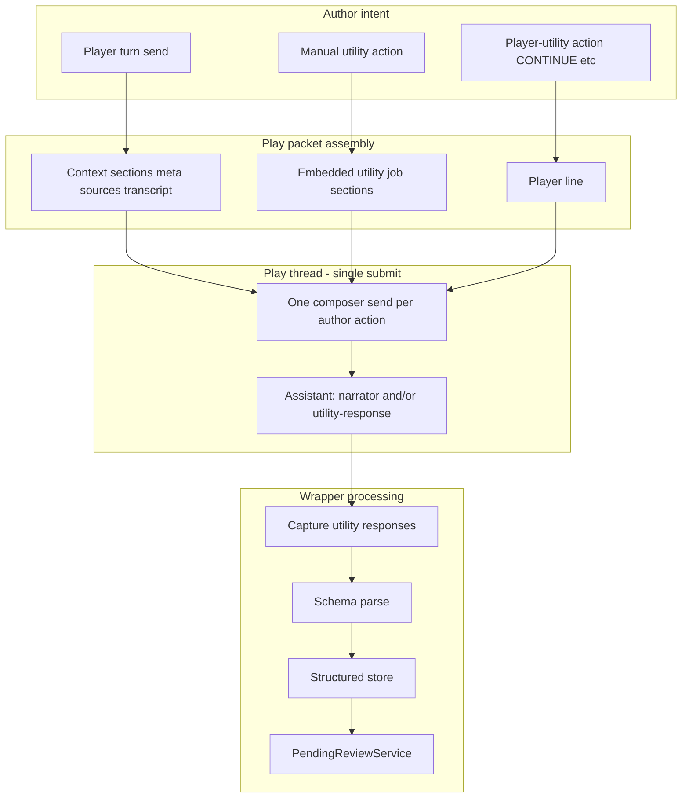

# Play-Thread Utility Orchestration — Implementation Plan

Comprehensive execution plan for **[CMD-326](https://linear.app/cmd0112/issue/CMD-326)** (Play-thread utility orchestration — injection, schema, retrieval) and child issues **CMD-327**–**CMD-332**.

**Companion ADR (normative):** [play-thread-utility-orchestration-adr.md](play-thread-utility-orchestration-adr.md) — deliverable for [CMD-327](https://linear.app/cmd0112/issue/CMD-327).

**Builds on:** [utility-delivery-pivot-adr.md](utility-delivery-pivot-adr.md) (CMD-248 — dedicated-thread retirement) · [injection-policy-adr.md](injection-policy-adr.md) (CMD-293) · [utility-job-orchestration.md](utility-job-orchestration.md) (current pipeline).

**Related:** [prompt-construction-guide.md](prompt-construction-guide.md) · [services-reference.md](services-reference.md) · [adventure-panel.md § Generation jobs](adventure-panel.md#generation-jobs-phase-2)

---

## Executive summary

### Problem

After CMD-248, play utility jobs run **inline on the play thread**, but each job still posts a **separate visible composer turn** via `RunInlineJobAsync` → `SubmitUtilityJobAsync`. That model:

- Disrupts the play transcript (utility traffic mixed with narrative turns)
- Requires composer recovery ([CMD-33](https://linear.app/cmd0112/issue/CMD-33))
- Re-sends story context the thread already has (policy violation vs CMD-292)
- Leaves parse results as JSONL tail previews only (`UtilityParseLogService`)
- Hides utility messages inconsistently (DOM flags vs metadata vs turn pairing)

### Product direction (CMD-326)

Utility work on the play thread becomes **injection-first**:

| Pillar | Issue | Outcome |
|--------|-------|---------|
| **Execution** | CMD-328, CMD-329 | Jobs run as **hidden packet sections** (auto bundled with play send, or manual tandem) — not separate composer submits |
| **Schema** | CMD-330 | Model replies use **documented, parseable shapes** per job family |
| **Hiding** | CMD-331 | Utility requests, responses, and **files** hidden in play UI + CV without breaking turn pairing |
| **Retrieval** | CMD-332 | Wrapper **captures, parses, persists** structured results keyed by job id + schema version |

**Design-thread jobs** (`propose_json_import`, `design_extract_step`, etc.) stay on the design WebView per [utility-delivery-pivot-adr.md](utility-delivery-pivot-adr.md). This plan scopes **play-thread** jobs only.

### What success looks like

- Authors send a normal play turn; **automatic** utility work (memories, entities, summary) rides along in the packet — no second submit.
- **Manual** companion actions (Extract entities, Propose memories) use the same injection transport but distinct **player-utility** vs **background data** UX.
- Continuous view shows **player + narrator** turns only; utility traffic is collapsible via settings.
- Review queues load from **structured store** on adventure reload — no DOM re-scrape.
- Epic sign-off criteria on [CMD-326](https://linear.app/cmd0112/issue/CMD-326) are met.

---

## Current state (baseline)

### Already in place (reuse, do not rewrite)

| Area | Evidence | CMD-326 use |
|------|----------|-------------|
| Inline routing | `GenerationJobService.RunInlineJobAsync` — play WebView only | Replace **send transport**, keep story-context + apply paths |
| Utility tags | `ContextTagFormat.WrapUtilityJob` / `WrapUtilityResponse` (`[[cgw:utility]]`, `[[cgw:utility-response]]`) | Extend for **embedded** sections + schema `v` attribute |
| Response contract | `AppendInlineUtilityResponseContract` in job prompts | Foundation for CMD-330 schema registry |
| Turn exclusion | `ConversationStreamParser.IsUtilityUserMessage` / `IsUtilityAssistantMessage` | Extend for injection-embedded + file cards |
| Thread metadata | `ThreadMetadataService.RecordUtilityExchange` (`IsUtility`, `HiddenInDisplay`) | Extend roles: auto/manual/player-utility |
| Post-turn scheduler | `GenerationJobScheduler.GetJobsAfterTurn` + `RunScheduledJobsAfterTurnAsync` | **Defer** auto jobs until next packet injection (CMD-328) |
| Parse / apply | `GenerationJobHandlers.ApplyResponse`, `PendingReviewService` | Unchanged entry points; fed by CMD-332 store |
| Injection policy | `PlayInjectionPolicy`, presets ([CMD-299](https://linear.app/cmd0112/issue/CMD-299)) | Add **utility section** policy slots |
| AI actions UI | `PlaySurfaceActions`, AI Actions tab ([CMD-50](https://linear.app/cmd0112/issue/CMD-50)) | CMD-329 taxonomy |
| CV hiding (partial) | `__cgwHideInlineUtilityDuringPlay`, `continuous-transcript-view.js` | CMD-331 generalize to responses + files |
| Design path | `RunDesignJobAsync` | **Out of scope** |

### Known gaps (motivation for CMD-326)

| Gap | Symptom | Primary owner |
|-----|---------|---------------|
| Separate composer send | Utility job = extra user message in ChatGPT thread | CMD-328, CMD-329 |
| Auto jobs fire immediately post-turn | `RunScheduledJobsAfterTurnAsync` loops `RunGenerationJobForActiveAdventureAsync` | CMD-328 |
| Story context duplication | `UtilityStoryContextBuilder` re-inlines transcript in job packet | CMD-328 + CMD-294 dedup |
| Schema ad hoc | Per-handler `ExpectsJsonArrayResponse`; lenient parse hacks (CMD-19) | CMD-330 |
| Parse store ephemeral | `utility-parse-log.jsonl` preview tail only | CMD-332 |
| File cards visible | ChatGPT download attachments from utility replies | CMD-331 |
| Player-utility unclear | CONTINUE `InjectedOnly` vs data jobs share transport | CMD-329 |

---

## Target architecture

### Execution modes



### Message taxonomy (normative — lock in CMD-327 ADR)

| Class | Trigger | In packet? | Counts as play turn? | Author-visible label |
|-------|---------|------------|----------------------|----------------------|
| **Player turn** | Author types / sends action | Player line + context | Yes | Player |
| **Background utility (auto)** | Settings / scheduler after turn | Hidden `[[cgw:utility]]` section(s) | No | Auto utility (status only) |
| **Background utility (manual)** | Companion job button | Hidden `[[cgw:utility]]` + intent marker | No | Manual utility |
| **Player-utility** | CONTINUE / scene advance (`InjectedOnly`) | Hidden instruction in player line or tagged section | Yes (narrator reply) | Player-utility |
| **Narrator** | Model story reply | Assistant message | Yes | Narrator |
| **Utility response** | Model job output | `[[cgw:utility-response]]` or schema block | No | Hidden (toggle) |

### Content classification for utility sections (reference-first)

Per [injection-policy-adr.md](injection-policy-adr.md):

| Utility packet content | Class | Rule |
|------------------------|-------|------|
| Job guide + task payload | **Delta** | Always include — not in Project/sources |
| Full transcript re-copy | **Reference** | Omit when thread already has turns; use pointer line |
| Narrator contract / lore | **Reference** | Never duplicate — job packet cites Project/sources |
| Rolling summary / state snapshot | **Conditional** | Include only if not in prior turn context |

### Assembly pipeline (play send with utility)

```mermaid
flowchart LR
    subgraph phase1 [CMD-328 Auto policy]
        Q[Queued auto jobs from scheduler]
        M[Merge into pending injection manifest]
    end

    subgraph phase2 [Packet build]
        P[PromptInjectionService.PrepareSend]
        B[PromptPacketBuilder + utility sections]
        D[Dedup CMD-294]
    end

    subgraph phase3 [Single send]
        S[AdventureTurnService.SendPlayTurnAsync]
    end

    subgraph phase4 [CMD-332 Retrieval]
        W[Wait utility-response in thread]
        R[Parse + persist]
        A[ApplyResponse / review queue]
    end

    Q --> M --> P --> B --> D --> S --> W --> R --> A
```



### Persistence model (CMD-332)

Proposed on-disk artifact (ADR to confirm):

```
adventures/{id}/utility-results/
  {jobRunId}.json          # structured parse + metadata
utility-results-index.json # jobId → latest run ids, schema versions
utility-parse-log.jsonl    # diagnostic tail (retained)
```

`UtilityJobRunRecord` (conceptual):

- `jobId`, `runId`, `schemaVersion`, `trigger` (`auto` | `manual` | `player-utility`)
- `linkedTurnIndex`, `conversationId`, `promptHash`
- `rawResponse`, `parsedObject`, `proposalIds`, `error`, `capturedAt`

---

## Phase map and dependencies

| Phase | Issue | Depends on | Unblocks | Est. sessions |
|-------|-------|------------|----------|---------------|
| **0** | [CMD-327](https://linear.app/cmd0112/issue/CMD-327) ADR | — | All implementation | 1 |
| **1** | [CMD-328](https://linear.app/cmd0112/issue/CMD-328) Auto injection | CMD-327 | CMD-332 (partial) | 2–4 |
| **1a** | [CMD-329](https://linear.app/cmd0112/issue/CMD-329) Manual tandem | CMD-327 | — | 2–3 |
| **2** | [CMD-330](https://linear.app/cmd0112/issue/CMD-330) Schema prompting | CMD-327 | CMD-331, CMD-332 | 2–4 |
| **2a** | [CMD-331](https://linear.app/cmd0112/issue/CMD-331) Hide responses | CMD-327, CMD-330 | CMD-332 | 3–5 |
| **3** | [CMD-332](https://linear.app/cmd0112/issue/CMD-332) Auto retrieval | CMD-327, CMD-330, CMD-328 | [CMD-41](https://linear.app/cmd0112/issue/CMD-41) | 3–5 |
| **4** | [CMD-345](https://linear.app/cmd0112/issue/CMD-345) Play settings alignment | CMD-328–332 | Epic sign-off | 2–3 |

**Parallelism after ADR:** CMD-328 + CMD-329 + CMD-330 can start together. CMD-331 needs schema markers. CMD-332 needs auto/manual send path + schema. **CMD-345 last** — settings UI + stale cleanup before default `InjectionFirst` flip.

**Recommended merge order:** 327 → (328 + 330) → 329 → 331 → 332 → **345** (settings UI + cleanup; last before epic sign-off).

---

## Phase 0 — ADR spike ([CMD-327](https://linear.app/cmd0112/issue/CMD-327))

### Deliverable

`docs/play-thread-utility-orchestration-adr.md` — normative decisions this plan implements.

### ADR must decide

1. **Auto vs manual** — when auto jobs attach (same send as triggering turn vs next send); max jobs per packet; failure behavior.
2. **Player-utility** — CONTINUE / scene advance vs data jobs; packet shape differences.
3. **Tag schema** — `[[cgw:utility job="…" mode="auto|manual" v="2"]]` or successor; nesting inside player packet vs sibling sections.
4. **Schema registry** — per-`GenerationJobId` response shape (JSON schema id, required delimiters, file naming).
5. **Hiding contract** — DOM attributes, CV filters, metadata flags, file-card selectors.
6. **Retrieval triggers** — DOM observer vs API tail vs post-send poll; interaction with `AdventureTurnService` turn complete.
7. **Migration** — feature flag for `RunInlineJobAsync` fallback; adventure settings defaults.

### Key files to inventory (ADR appendix)

| Layer | Files |
|-------|-------|
| C# orchestration | `GenerationJobService.cs`, `MainWindow.GenerationJobs.cs`, `GenerationJobScheduler.cs` |
| Packet / injection | `PromptInjectionService.cs`, `PromptPacketBuilder.cs`, `PlayInjectionPolicy.cs`, `ContextTagFormat.cs` |
| Send / capture | `AdventureTurnService.cs`, `ChatGptConversationSendService.cs` |
| Parse / review | `GenerationJobHandlers.cs`, `PendingReviewService.cs`, `UtilityParseLogService.cs` |
| Metadata | `ThreadMetadataService.cs`, `ThreadMetadataReconcileService.cs`, `ConversationStreamParser.cs` |
| JS / CV | `adventure-bridge.js`, `continuous-transcript-view.js`, `cgw-packet-display.js`, `cgw-play-compose.js` |

### Acceptance

- [ ] ADR merged; linked from `utility-job-orchestration.md` and this plan
- [ ] Open questions on CMD-328/329/330/331/332 resolved or explicitly deferred

---

## Phase 1 — Automatic utility via packet injection ([CMD-328](https://linear.app/cmd0112/issue/CMD-328))

### Goal

Replace post-turn **separate sends** with **deferred auto jobs** embedded in the next play packet.

### Design

#### 1. Pending auto-job queue

New service: `PlayUtilityInjectionQueue` (name TBD)

- `EnqueueAfterTurn(bundle, turn, jobIds)` — called from `RunScheduledJobsAfterTurnAsync` **instead of** immediate `RunGenerationJobForActiveAdventureAsync`
- `DrainForNextSend(bundle)` → list of `PendingUtilityInjection` (jobId, context, prompt fragment)
- Persist queue on `AdventureMetadata` or session cache (survive mode switch)

#### 2. Policy model

Extend `PlayInjectionPolicy` or new `PlayUtilityPolicy`:

| Setting | Default | Meaning |
|---------|---------|---------|
| `AutoInjectMemories` | mirrors `AutoProposeMemories` | Bundle memories job on next send |
| `AutoInjectEntities` | mirrors `AutoExtractEntities` | … |
| `AutoInjectSummary` | mirrors `AutoUpdateSummary` | … |
| `AutoInjectContinuity` | mirrors `AutoContinuityCheck` | … |
| `MaxUtilitySectionsPerSend` | 2 | Budget guard |
| `AutoInjectTiming` | `NextPlayerSend` | ADR: alt `SameTurnFollowUp` deprecated |

Wire Play settings / Threads hub UI (replace legacy inline visibility toggles over time).

#### 3. Packet assembly

In `PromptInjectionService.PrepareSend` (or `PromptPacketBuilder`):

1. Drain pending auto jobs
2. For each: build job body via `GenerationJobHandlers.BuildJobPrompt` with **reference-first** context (`OmitRedundantJobTurnSlices`, no full transcript when thread has history)
3. Wrap with `ContextTagFormat.WrapUtilityJob` + `mode="auto"` attribute (ADR)
4. Append as **hidden sections** before player line merge
5. Include in preview manifest ([CMD-295](https://linear.app/cmd0112/issue/CMD-295) style) as `utility-auto` — omitted from author-facing preview when policy says hide

#### 4. Send path

- **Remove** separate `SubmitUtilityJobAsync` for auto jobs
- Single `SendPlayTurnAsync` carries player + utility sections
- Assistant may return **multiple** logical parts: narrator prose + utility-response block(s) — retrieval phase handles split

#### 5. Scheduler change

```csharp
// MainWindow.GenerationJobs.cs — today
foreach (var jobId in jobs)
    await RunGenerationJobForActiveAdventureAsync(jobId, ...);

// Target
_playUtilityInjectionQueue.EnqueueAfterTurn(bundle, turn, jobs);
// Optional: surface companion status "2 auto utility jobs queued for next send"
```

### Files to touch

| File | Change |
|------|--------|
| `MainWindow.GenerationJobs.cs` | Defer auto jobs to queue |
| `GenerationJobScheduler.cs` | Optional: return job + context pairs |
| `PromptInjectionService.cs` | Merge utility sections into `PrepareSend` |
| `PromptPacketBuilder.cs` | Section ordering, hidden flags |
| `PlayInjectionPolicy.cs` | Utility auto policy fields |
| `InjectionSectionManifest.cs` | `utility-auto` section type |
| `ContextTagFormat.cs` | `mode` attribute, embedded section helpers |
| `PlayInjectionSendGuard.cs` | Allow utility sections in merged packet |
| `GenerationJobService.cs` | Gate `RunInlineJobAsync` — auto path disabled when injection enabled |

### Tests

| Test | Assert |
|------|--------|
| `PlayUtilityInjectionQueueTests` | Enqueue after turn N, drain on send N+1 |
| `PromptInjectionUtilitySectionTests` | Auto job appears in packet, hidden from player line |
| `PlayInjectionPolicyTests` | Max sections, per-job toggles |
| Golden: packet with auto memories | No duplicate transcript block when thread has history |

### Manual QA ([CMD-328](https://linear.app/cmd0112/issue/CMD-328) test plan)

1. Enable auto memories + entities; send play turn → **one** ChatGPT submit; CV shows player + narrator only
2. Unlink play thread → queue fails with `play_thread_unlinked` on send, not silent fallback
3. Verify proposals land in review queue after assistant responds

### Risks

| Risk | Mitigation |
|------|------------|
| Model ignores utility section when bundled with player action | ADR: section order; optional micro-separator; manual QA matrix |
| Packet size explosion | `MaxUtilitySectionsPerSend` + reference-first job bodies |
| Multi-response parsing | Phase 3 retrieval; interim: sequential jobs if ADR allows |

---

## Phase 1a — Manual tandem workflow ([CMD-329](https://linear.app/cmd0112/issue/CMD-329))

### Goal

Author-initiated jobs use **injection transport** with UX distinct from auto background work and from player turns.

### Design

#### 1. Execution channel enum

```csharp
public enum UtilityExecutionChannel
{
    AutoBackground,    // CMD-328 queue
    ManualBackground,  // companion button → inject now (next send or immediate dedicated inject send — ADR)
    PlayerUtility,     // CONTINUE, scene advance
}
```

Map `GenerationJobId` + `PlaySurfaceAction` → channel via settings.

#### 2. Manual path options (ADR chooses)

| Option | Behavior | Pros | Cons |
|--------|----------|------|------|
| **A — Inject on next send** | Queue like auto but `mode=manual`; author must send turn | Single submit | Extra step |
| **B — Inject immediate send** | Packet = utility only, player line empty/hidden | Fast | Extra submit (interim) |
| **C — Inject with empty player line** | Same submit as B but tagged as utility-only turn | Clear semantics | CV edge cases |

**Recommendation for ADR:** Start with **A** for data jobs; **player-utility** uses existing `InjectedOnly` player line ([CMD-298](https://linear.app/cmd0112/issue/CMD-298)).

#### 3. UI surfaces

| Surface | Change |
|---------|--------|
| Play companion job buttons | Status: "Manual utility queued" / "Running…" |
| Shell status / `SetPlayComposeStatus` | Channel-aware messages |
| AI Actions tab | Group: **Player-utility** vs **Background data jobs** |
| `PlaySurfaceActions` | Already `Visible` / `Hidden` / `InjectedOnly` — document as player-utility |

#### 4. Composer recovery

With injection-first manual path, `RestorePlayComposerAsync` ([CMD-33](https://linear.app/cmd0112/issue/CMD-33)) should fire less often — verify no regression.

### Files to touch

| File | Change |
|------|--------|
| `MainWindow.GenerationJobs.cs` | Manual handlers → injection queue or inject-send |
| `PlayPromptInjectionDialog.xaml.cs` | AI Actions grouping |
| `AdventurePlayView.xaml` | Companion button labels/tooltips |
| `MainWindow.PlayInjection.cs` | Player-utility vs manual utility |
| `ThreadMetadataService.cs` | `UtilityTrigger` field on records |

### Tests

- Manual extract entities → metadata `ManualBackground`; not counted in turn scope
- CONTINUE InjectedOnly → `PlayerUtility`; counts as turn
- Auto + manual queued → ordering per policy

### Manual QA

Per [CMD-329](https://linear.app/cmd0112/issue/CMD-329) test plan.

---

## Phase 2 — Schema-first prompting ([CMD-330](https://linear.app/cmd0112/issue/CMD-330))

### Goal

Every play utility job has a **versioned response schema**; prompts and parsers share one registry.

### Design

#### 1. `UtilityResponseSchemaRegistry`

| Job family | Schema id | Shape | Parser |
|------------|-----------|-------|--------|
| `propose_memories` | `memories.v1` | JSON array of memory objects | existing + strict |
| `extract_entities` | `entities.v1` | JSON array | existing |
| `update_summary` | `summary.v1` | plain text or `{ "summary": "…" }` | ADR |
| `continuity_check` | `continuity.v1` | structured issues list | existing |
| `process_turn` | `process_turn.v1` | multi-part | existing |

#### 2. Prompt generation

- `GenerationJobGuideService` appends schema block from registry (not ad hoc `AppendInlineUtilityResponseContract` only)
- Strict delimiter rules; escape guidance (learn from [CMD-19](https://linear.app/cmd0112/issue/CMD-19) lenient parse)
- `schemaVersion` in `[[cgw:utility-response v="…" schema="memories.v1"]]`

#### 3. Validation layer

`UtilityResponseValidator.Validate(jobId, rawText)` → `UtilityParseResult` (success, errors[], parsed JsonDocument)

- Call before `GenerationJobHandlers.ApplyResponse`
- Feed diagnostics to CMD-332 store

#### 4. Canon alignment

Reuse [CMD-206](https://linear.app/cmd0112/issue/CMD-206) field labels in entity/memory schemas.

### Files to touch

| File | Change |
|------|--------|
| New: `UtilityResponseSchemaRegistry.cs` | Schema definitions |
| New: `UtilityResponseValidator.cs` | Validate + parse |
| `GenerationJobHandlers.cs` | Delegate to registry |
| `GenerationJobGuideService.cs` | Schema-aware guides |
| `ContextTagFormat.cs` | `schema` attribute on utility-response |
| `docs/prompt-construction-guide.md` | Utility schema section |

### Tests

- Per-job golden: prompt contains schema id; validator accepts/rejects samples
- Regression: CMD-19 unescaped-quotes case where applicable

---

## Phase 2a — Hide utility content ([CMD-331](https://linear.app/cmd0112/issue/CMD-331))

### Goal

Utility requests, responses, and **file attachments** are hidden during play by default; turn pairing stays correct.

### Design

#### 1. Metadata extensions (`ThreadMessageRecord`)

Add fields (ADR names):

- `UtilityChannel` (`auto` | `manual` | `player-utility`)
- `UtilityJobId`
- `HideInContinuousView` (default true for utility)
- `LinkedUtilityRunId` (→ CMD-332 store)

#### 2. DOM hiding (`adventure-bridge.js`)

- Extend utility detection to **injected packet sections** (not only standalone utility sends)
- Hide assistant messages where `IsUtilityResponseTagged` or schema marker
- **File cards:** selector strategy for ChatGPT download UI (ChatGPT Fragile — feature flag)

#### 3. Continuous view (`continuous-transcript-view.js`)

- Filter utility messages using metadata reconcile + DOM hints
- Respect `ShowUtilityTraffic` setting (replaces `ShowInlineUtilityTraffic`)
- Performance: index utility ordinals; no full-thread reparse on scroll

#### 4. Packet display (`cgw-packet-display.js`)

- Hide `[[cgw:utility]]` sections in View full / preview (already partial for injected context)
- Show collapsed "Utility (2 sections)" affordance when debug toggle on

#### 5. Turn pairing (`ConversationStreamParser`, `PlayTurnScopeService`)

- Ensure utility messages never receive `LinkedTurnId`
- Player-utility narrator reply **does** link to turn
- Multi-part assistant: split narrator vs utility-response into separate metadata records on capture

#### 6. Settings cleanup

- Deprecate `HideInlineUtilityDuringPlay` / `ShowInlineUtilityTraffic` → `PlayUtilityDisplayPolicy`
- Threads hub + Play settings single panel

### Files to touch

| File | Change |
|------|--------|
| `ThreadMessageRecord.cs`, `ThreadMetadataService.cs` | New fields + record on capture |
| `ThreadMetadataReconcileService.cs` | Reconcile utility from DOM |
| `ConversationStreamParser.cs` | Embedded utility sections |
| `continuous-transcript-view.js`, `adventure-bridge.js`, `cgw-packet-display.js` | Hiding |
| `ChatGptAdventureBridgeInjection.cs` | Bridge flags |
| `AdventureThreadManagerDialog.xaml` | Settings rename |

### Tests

- `TranscriptFilterServiceTests` — utility excluded from turn count
- `ThreadLogSyncServiceTests` — utility messages don't increment play turns
- JS unit tests if harness exists; else manual QA checklist

### Manual QA

Per [CMD-331](https://linear.app/cmd0112/issue/CMD-331) test plan (CV, file cards, toggle).

---

## Phase 3 — Automatic retrieval ([CMD-332](https://linear.app/cmd0112/issue/CMD-332))

### Goal

Capture utility responses from the play thread, parse via CMD-330 schemas, persist structured records, feed review/apply — **without DOM re-scrape on reload**.

### Design

#### 1. Capture coordinator

`PlayUtilityRetrievalService` (name TBD):

- Subscribe to post-send completion (`AdventureTurnService`, bridge `turnComplete`)
- Identify new assistant message(s); classify narrator vs utility-response
- If utility-response: run validator → persist → `ApplyResponse`

#### 2. Persistence

- `UtilityJobResultStore` — write `utility-results/{runId}.json`
- Update index; migrate from JSONL-only diagnostics
- Keep `UtilityParseLogService` for error tail

#### 3. Reload path

- `PendingReviewService` / companion panels load proposals from store first
- Fallback: one-time DOM capture for legacy adventures

#### 4. Integration with auto/manual

- Auto jobs in packet may produce **multiple** utility responses — map 1:1 via job order + `promptHash`
- Failed parse → `UtilityJobLastErrors` + diagnostic entry

### Files to touch

| File | Change |
|------|--------|
| New: `UtilityJobResultStore.cs`, `PlayUtilityRetrievalService.cs` | Core |
| `GenerationJobService.cs` | Remove direct parse from `RunInlineJobAsync` when injection path active |
| `MainWindow.GenerationJobs.cs` | Wire retrieval after send |
| `PendingReviewService.cs` | Load from store |
| `AdventureMetadataMigration.cs` | Schema version if index on metadata |

### Tests

- Round-trip: capture → persist → reload → proposals intact
- Parse failure → error recorded, no silent empty queue
- Multiple utility sections in one send → multiple run records

### Manual QA

Per [CMD-332](https://linear.app/cmd0112/issue/CMD-332) test plan.

---

## Follow-up — Source synthesis ([CMD-41](https://linear.app/cmd0112/issue/CMD-41))

Blocked on CMD-332 structured parse objects.

- Select target source → preview diff from `UtilityJobResultStore` → write → export
- Design-thread `synthesize_source` may remain separate; play-thread synthesis consumes same store

---

## Migration and rollout

### Feature flag

`AdventureSettings.PlayUtilityInjectionMode`:

| Value | Behavior |
|-------|----------|
| `LegacyInlineSend` | Current `RunInlineJobAsync` (default until QA sign-off) |
| `InjectionFirst` | CMD-326 pipeline |

Migrate default to `InjectionFirst` after epic sign-off.

### Adventure load

- No breaking JSON migration required for flag default
- Optional: convert pending auto settings to `PlayUtilityPolicy`

### Design thread

**No change** — `RunDesignJobAsync` unchanged.

---

## Test strategy (epic-level)

### Automated

| Layer | Coverage |
|-------|----------|
| Unit | Queue, schema validator, packet sections, metadata, turn scope |
| Integration | `PrepareSend` → single send mock; store round-trip |
| Golden | Packet shapes per profile (thin/fat) with utility sections |

### Manual QA (required — **Needs Manual QA** on leaf issues)

| Scenario | Issues |
|----------|--------|
| Auto memories + entities on linked adventure | 328, 332 |
| Manual extract mid-session | 329, 331, 332 |
| CONTINUE player-utility | 329, 331 |
| Show utility traffic toggle | 331 |
| Reload adventure → review queue | 332 |
| Unlinked play thread | 328 |

### Epic sign-off ([CMD-326](https://linear.app/cmd0112/issue/CMD-326))

- [ ] All child issues **Done** + **Verified** (including [CMD-345](https://linear.app/cmd0112/issue/CMD-345) play settings alignment)
- [ ] `LegacyInlineSend` still works or removed with migration notice
- [ ] `docs/utility-job-orchestration.md` rewritten for injection-first model
- [ ] QA comment on epic with build hash + adventure ids

---

## Issue checklist (quick reference)

| Issue | Title | Phase |
|-------|-------|-------|
| [CMD-327](https://linear.app/cmd0112/issue/CMD-327) | ADR: Play-thread utility orchestration paradigm | 0 |
| [CMD-328](https://linear.app/cmd0112/issue/CMD-328) | Automatic utility jobs via play packet context injection | 1 |
| [CMD-329](https://linear.app/cmd0112/issue/CMD-329) | Manual tandem workflow for utility jobs and AI actions | 1a |
| [CMD-330](https://linear.app/cmd0112/issue/CMD-330) | Schema-first utility response prompting paradigm | 2 |
| [CMD-331](https://linear.app/cmd0112/issue/CMD-331) | Hide utility job responses in play (text, files, transcript) | 2a |
| [CMD-332](https://linear.app/cmd0112/issue/CMD-332) | Automatic utility response retrieval from play thread | 3 |
| [CMD-345](https://linear.app/cmd0112/issue/CMD-345) | Play settings alignment — utility orchestration UI and stale setting cleanup | 4 (last) |
| [CMD-41](https://linear.app/cmd0112/issue/CMD-41) | Utility synthesis into existing source file | Follow-up |

---

## Related Linear

- Epic: [CMD-326](https://linear.app/cmd0112/issue/CMD-326)
- Supersedes: [CMD-248](https://linear.app/cmd0112/issue/CMD-248), folded [CMD-40](https://linear.app/cmd0112/issue/CMD-40), [CMD-42](https://linear.app/cmd0112/issue/CMD-42), [CMD-43](https://linear.app/cmd0112/issue/CMD-43)
- Policy: [CMD-292](https://linear.app/cmd0112/issue/CMD-292), [CMD-294](https://linear.app/cmd0112/issue/CMD-294)

*Last updated: 2026-06-25 — aligned with CMD-326 epic and children CMD-327–332.*
