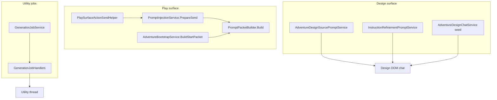

# Prompt Construction Guide

How the wrapper builds text sent to ChatGPT — play packets, bootstrap/start packets, design chat, utility jobs, and one-off synthesis prompts.

**Documentation hub:** [INDEX.md](INDEX.md)

Related docs: [adventure-panel.md](adventure-panel.md) · [instruction-sources-paradigm.md](instruction-sources-paradigm.md) · [user-projects-and-sync.md](user-projects-and-sync.md) · [utility-job-orchestration.md](utility-job-orchestration.md) · [services-reference.md](services-reference.md)

---

## Overview

Prompt construction is **not centralized**. Different surfaces use different builders with different goals:

| Category | Primary entry point | Output destination |
|----------|---------------------|-------------------|
| **Play send** | `PromptInjectionService.PrepareSend` | Play thread composer |
| **Start / bootstrap packet** | `AdventureBootstrapService.BuildStartPacket` | Play thread (first turn) |
| **Play surface actions** | `PlaySurfaceActionSendHelper.BuildActionPacket` | Prepended to play send |
| **Design source chat** | `AdventureDesignSourcePromptService.BuildPrompt` | Design tab conversation |
| **Instruction refine** | `InstructionRefinementPromptService.BuildRefinementPrompt` | Design tab conversation |
| **Utility jobs** | `GenerationJobHandlers.BuildSeedPrompt` / `BuildJobPrompt` | Utility thread(s) |
| **Source edit / synthesis** | `SourceEditService`, `SourceSynthesisService` | Utility or inline job |
| **Recap / extraction** | `RecapService`, `EntityExtractionService` | Utility job packets |



---

## Shared play packet pipeline

Most play-related text flows through **`PromptPacketBuilder`**.

### Thin vs fat mode

`PromptPacketBuilder.UseThinPackets(bundle)` returns true when `ProjectSourceInjectionService.CanDelegateStaticContent(bundle)` — Project is linked, sources are published, and the manifest is ready. In thin mode, lore is delegated to Project source files; the packet carries pointers and meta instead of full inline text.

| Mode | When | Context block |
|------|------|---------------|
| **Thin** | Project sources in sync | `[[cgw:meta]]`, ALWAYS RETRIEVE / THIS TURN pointers, optional `[[cgw:instructions]]` |
| **Fat** | No project or sources out of sync | Full contract sections, cards, memories, summary inline |

### Build steps

1. **`BuildContext`** — assemble the context block (thin delegated or fat inline).
2. **`AssembleWithUser`** — append the player line (with or without `[[cgw:player]]` wrapper depending on `UseContextTags`).
3. **Trim** — enforce `MaxChars` unless attachment policy skips trim.

`PromptInjectionService.PrepareSend` wraps `Build` and may prepend:

- Attachment guidance (`InjectAttachmentGuidance`)
- Attachment manifest section

### Context pointer resolution (thin mode)

`ContextPointerResolver.Resolve` scores section candidates from signals in the player line, rolling summary, state location, pins, triggers, and attachment tokens.

| Source | Score | Bucket |
|--------|-------|--------|
| Baseline (`opening`, `rules`, `player`) | 100 | ALWAYS RETRIEVE |
| Pin | 40 | THIS TURN (if ≥ threshold) |
| Name match in player text | 35 | THIS TURN |
| State location (place) | 35 | THIS TURN |
| Trigger in player text | 25 | THIS TURN |
| Attachment token match | 20 | THIS TURN |
| Name match in summary only | 15 | Usually filtered out (threshold 20) |

Pointers with `Source == Baseline` always land in **ALWAYS RETRIEVE**. All other qualifying pointers land in **THIS TURN**.

**Start packet implication:** `BuildStartPacket` passes the full opening hook as `playerInput`. Alias matching against that long prose can fan out many THIS TURN pointers on turn 1 — same pipeline as a normal send, not a dedicated bootstrap builder.

Key files:

- `ChatGPTWrapper/Adventure/Services/PromptPacketBuilder.cs`
- `ChatGPTWrapper/Adventure/Services/ContextPointerResolver.cs`
- `ChatGPTWrapper/Adventure/Services/ContextPointerRenderer.cs`
- `ChatGPTWrapper/Adventure/Services/PromptInjectionService.cs`

---

## Play send (normal turns)

**Entry:** `PromptInjectionService.PrepareSend(bundle, userText, attachment?)`

**Callers:** play tab send, preview dialog, regenerate/retry paths through `AdventureTurnService`.

**Flow:**

1. Classify attachment mode (`AttachmentSendPolicy.Classify`).
2. Build search hint from user text + attachment filename tokens.
3. `PromptPacketBuilder.BuildContext` + `Build`.
4. Optionally prepend attachment guidance and manifest.
5. Return `PromptInjectionPrepareResult` (merged text, hash, pointers, trim flag).

**Play surface actions:** `PlaySurfaceActionSendHelper.ApplyInjectedOnly` may replace or prepend `[[cgw:action name="CONTINUE"]]` blocks for configured InjectedOnly actions before the packet is built.

---

## Start / bootstrap packet

**Entry:** `AdventureBootstrapService.BuildStartPacket(bundle)`

**Callers:**

- Session tab **Start new play thread** (`MainWindow.PlayTab.cs`) — clipboard copy after thread release
- Play prompt injection dialog preview (`PlayPromptInjectionDialog.xaml.cs`)
- Legacy **Start adventure** offer paths

**Construction:**

```csharp
// AdventureBootstrapService.cs — simplified
var opening = GetOpeningPlayerLine(bundle.Scenario);  // OpeningSituation → Setting fallback
var prompt = thinMode
    ? "Begin the adventure using the Project scenario source…\n\nOpening hook: {opening}"
    : "Begin the adventure. Open with vivid narration…\n\nOpening hook: {opening}";
return PromptPacketBuilder.Build(bundle, prompt).Text;
```

**Important:** There is no separate bootstrap builder. The start packet uses the **same** `PromptPacketBuilder.Build` path as normal play sends. Canonical user workflow: [adventure-panel.md § G. Canonical begin-play workflow](adventure-panel.md#g-canonical-begin-play-workflow-design--first-turn).

**Opening player line precedence:**

1. `scenario.OpeningSituation`
2. `"The story begins. {Setting}"`
3. `"Begin the adventure."`

---

## Design chat prompts

Design surface sends freeform author prompts to a pinned **design conversation** via `AdventureDesignDomChatService.SendPromptAsync` → `AdventureTurnService.SendPromptAsync`. Prompt text is built per source file or step.

### Per-file source prompts

**Entry:** `AdventureDesignSourcePromptService.BuildPrompt(bundle, relativePath)`

Dispatches on file:

| File | Builder |
|------|---------|
| `scenario.md`, `world.md`, `plot.md`, `cast.md`, `lexicon.md` | `BuildSingleFilePrompt` — step-specific instructions + dependency context from prior files |
| `instructions-snippet.md` | Delegates to `InstructionRefinementPromptService.BuildRefinementPrompt` |

**Combined:** `BuildCombinedPrompt(bundle, paths)` merges multiple file prompts for batch design sends.

Pipeline order and dependencies: `PromptPipelineOrder`, `PipelineDependencies` in the same service.

### Instruction refinement

**Entry:** `InstructionRefinementPromptService.BuildRefinementPrompt(bundle, refinementRequest?)`

Builds a prompt to polish the narrator contract (boundaries, portrayal rules, addendum) with optional user refinement request.

### Design step seed

**Entry:** `AdventureDesignService.BuildStepSeedPrompt` via `AdventureDesignChatService`

Initial seed message when opening a design step chat thread.

### Design extraction (utility job)

**Entry:** `AdventureDesignExtractionService.BuildExtractPrompt(bundle, step)`

Used by `GenerationJobId.DesignExtractStep` to pull structured proposals from design chat history.

Key file: `ChatGPTWrapper/Adventure/Services/AdventureDesignSourcePromptService.cs`

---

## Utility job prompts

Utility jobs run on separate (or inline) ChatGPT threads. Each job type has a dedicated prompt builder inside `GenerationJobHandlers`.

### Session seed

**Entry:** `GenerationJobHandlers.BuildSeedPrompt(bundle, jobId, sequence)`

First message when a utility session starts — title line, adventure ID, job ID, seed version, play-thread binding line, and job guide body from `GenerationJobGuideService`.

### Job packets

**Entry:** `GenerationJobHandlers.BuildJobPrompt(bundle, jobId, context)`

| Job ID | Prompt builder |
|--------|----------------|
| `ProcessTurn` | `BuildProcessTurnPrompt` |
| `ExtractEntities` | `EntityExtractionService.BuildExtractionPrompt` / `BuildScopedExtractionPrompt` |
| `ExpandEntity` | `EntityExtractionService.BuildExpandEntityPrompt` |
| `ProposeMemories` | `BuildMemoryProposalPrompt` / scoped variant |
| `UpdateSummary` | `RecapService.BuildSummaryUpdatePrompt` |
| `BootstrapLore` | `BuildBootstrapLorePrompt` |
| `BootstrapSections` | `BuildBootstrapSectionsPrompt` |
| `ExpandStoryCard` | `BuildExpandCardPrompt` |
| `ExpandSection` | `BuildExpandSectionPrompt` |
| `ContinuityCheck` | `BuildContinuityCheckPrompt` |
| `ProposeSourceEdits` | `SourceEditService.BuildSourceEditPrompt` |
| `DraftFramework` | Inline drafting instructions |
| `DesignExtractStep` | `AdventureDesignExtractionService.BuildExtractPrompt` |
| `DesignAdventure` / `SynthesizeSource` | User-provided prompt from context |

Common wrappers appended by `BuildJobPrompt`:

- Play thread line (`AppendPlayThreadLine`)
- Story context block (`AppendStoryContextBlock`) — transcript/summary slices
- Utility job overrides (`AppendUtilityJobOverrides`)
- Inline guide (`GenerationJobGuideService`) unless `SuppressInlineGuide`

Orchestration: `GenerationJobService` — see [utility-job-orchestration.md](utility-job-orchestration.md).

---

## Source edit and synthesis

| Service | Entry | Purpose |
|---------|-------|---------|
| `SourceEditService` | `BuildSourceEditPrompt(bundle, userPrompt)` | Propose edits to source files from author request |
| `SourceSynthesisService` | `BuildSynthesizeToFilePrompt(...)` | Merge chat/proposals into a target source file |

Called from utility jobs (`ProposeSourceEdits`, `SynthesizeSource`) or `MainWindow.GenerationJobs.cs`.

---

## Recap and entity extraction

| Service | Entry | Purpose |
|---------|-------|---------|
| `RecapService` | `BuildSummaryUpdatePrompt(bundle, omitRecentTurns?)` | Rolling summary update job |
| `EntityExtractionService` | `BuildExtractionPrompt`, `BuildScopedExtractionPrompt`, `BuildExpandEntityPrompt` | Extract/expand entities from turns |

These are thin wrappers around structured job instructions plus bundle context slices.

---

## What is *not* a prompt builder

| Component | Role |
|-----------|------|
| `AdventureTurnService.SendPromptAsync` | Sends already-built text via bridge — does not build packets |
| `AdventureDesignDomChatService` | Resolves design conversation ID and delegates send |
| `ChatGptAdventureBridgeInjection.InvokeSendPromptAsync` | DOM/API transport |
| Project custom instructions | Published separately via `InstructionContractService` — not part of play packet text in thin mode (except optional `[[cgw:instructions]]` snippet) |

---

## Review checklist (architecture)

Use this when auditing or changing prompt construction:

1. **Parity** — Does preview use the same builder as live send? (`PrepareSend` vs direct `Build`)
2. **Mode** — Is thin/fat choice correct for project sync state?
3. **Turn scope** — Does `[[cgw:meta turn="N"]]` reflect session-scoped accepted turns, not global log noise?
4. **Bootstrap policy** — Should turn 1 / start packet use different pointer rules than turn 2+?
5. **Signal source** — What text drives alias matching (player line vs summary vs attachment tokens)?
6. **Duplication** — Is opening hook prose repeated in meta, pointers, and player line?
7. **Trim** — What gets cut when over `MaxChars`?
8. **Job context** — Are utility jobs omitting redundant transcript slices when story context already includes them?
9. **Design vs play boundary** — Does design chat traffic leak into play transcript or turn counter?

---

## Related Linear issues

| Issue | Topic |
|-------|-------|
| CMD-27 | Play start packet — turn meta, empty sources, stale transcript (epic) |
| CMD-56 | Comprehensive review: next send UX and play packet injection |
| CMD-58 | Turn meta stuck at 1 after reload |
| CMD-64 | Canonical workflow to begin a new adventure |
| CMD-66 | Empty ALWAYS RETRIEVE on fresh thread |
| CMD-67 | Stale transcript in fresh play thread |
| CMD-63 | Start new play thread — clipboard workflow |

Tracking issue for this guide and architecture review: **CMD-69** (Icebox).
