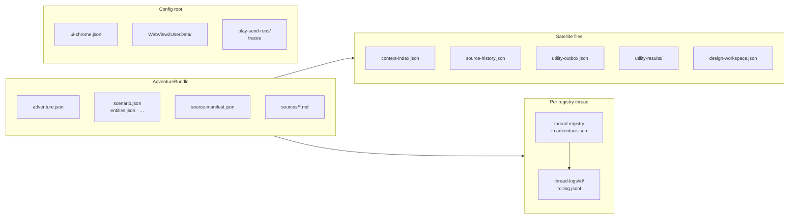

# API & Data Models — Reference Index

Central index for **on-disk JSON**, **ChatGPT backend-api** paths, **bridge protocol**, and **runtime contracts**. Use this when implementing features, writing tests, or debugging sync/send failures.

*Last expanded: 2026-07-03.*

---

## Quick paths

| I need… | Start here |
|---------|------------|
| Adventure JSON files (`adventure.json`, `entities.json`, …) | [data-model-reference.md](data-model-reference.md) |
| Secondary files (`context-index.json`, `utility-outbox.json`, …) | [data-model-secondary-files.md](data-model-secondary-files.md) |
| Thread registry & per-thread logs | [adventure-thread-registry.md](adventure-thread-registry.md) · [thread-conversation-log.md](../developer/thread-conversation-log.md) |
| Canon field mapping (`canon-schema.json`) | [canon-schema.md](canon-schema.md) |
| All `ChatGptApiEndpoints` constants | [chatgpt-api-endpoints-reference.md](chatgpt-api-endpoints-reference.md) |
| Conversation hide/rename, project settings PATCH | [chatgpt-api-integration.md](../developer/chatgpt-api-integration.md#conversation-lifecycle-patch) |
| Gizmo/project JSON parsing | [gizmo-api-response-shapes.md](gizmo-api-response-shapes.md) |
| Send pipeline (prepare → SSE) | [chatgpt-api-integration.md](../developer/chatgpt-api-integration.md) |
| JS ↔ C# bridge actions | [webview-bridges.md](../developer/webview-bridges.md) |
| Service catalog | [services-reference.md](services-reference.md) |
| Play send invariants | [play-send-orchestration-adr.md](../adr/play-send-orchestration-adr.md) |
| Utility job lanes | [utility-job-orchestration.md](../developer/utility-job-orchestration.md) |

---

## Data model layers

| Layer | Authority | Doc |
|-------|-----------|-----|
| **Bundle documents** | Loaded by `AdventureStore` as `AdventureBundle` | [data-model-reference.md](data-model-reference.md) |
| **Satellite indexes** | Written by specialized services; not in bundle load | [data-model-secondary-files.md](data-model-secondary-files.md) |
| **Thread log** | Canonical local play transcript per `AdventureThreadEntry` | [thread-conversation-log.md](../developer/thread-conversation-log.md) |
| **ChatGPT thread** | Narrative source of truth on play/design threads | [adventure-thread-registry.md](adventure-thread-registry.md) |
| **Project sources** | ChatGPT Project files + `source-manifest.json` | [data-model-audit-cmd86.md](data-model-audit-cmd86.md) |

Root path: `%LocalAppData%\ChatGPTWrapper\` — see `AppDirectories.cs`.

---

## API layers

| Layer | Transport | Doc |
|-------|-----------|-----|
| **ChatGPT backend-api** | Injected `fetch` via `cgw-api` bridge; session cookies | [chatgpt-api-endpoints-reference.md](chatgpt-api-endpoints-reference.md) |
| **Gizmo JSON shapes** | Parsed by `GizmoResponseParser` | [gizmo-api-response-shapes.md](gizmo-api-response-shapes.md) |
| **Bridge protocol v1** | `postMessage` — `cgw-api`, `cgw-play`, `cgw-display` | [webview-bridges.md](../developer/webview-bridges.md) |
| **DOM automation** | `adventure-bridge.js` composer/thread | [webview-bridges.md](../developer/webview-bridges.md) |

There is **no OpenAI API key**. All remote calls use the user's WebView2 session.

---

## Code anchors (single source of truth)

| Area | Primary files |
|------|----------------|
| Endpoints | `ChatGPTWrapper/ChatGptApi/ChatGptApiEndpoints.cs` |
| API models | `ChatGPTWrapper/ChatGptApi/ChatGptApiModels.cs` |
| Gizmo parsing | `ChatGPTWrapper/ChatGptApi/GizmoResponseParser.cs` |
| Send / SSE | `ChatGptConversationSendService.cs`, `ChatGPTWrapper.Core/ChatGptApi/ConversationStreamParser.cs` |
| Adventure models | `ChatGPTWrapper/Adventure/Models/*.cs` |
| Paths | `ChatGPTWrapper/AppDirectories.cs`, `Adventure/Stores/AdventureStore.cs` |
| Bridge | `ChatGPTWrapper.Core/Bridges/BridgeProtocol.cs`, `ChatGPT_files/*-bridge.js` |
| Play send | `Adventure/Services/PlaySend/` |
| Utility jobs | `Adventure/Services/GenerationJobHandlers.cs`, `UtilityResponseSchemaRegistry.cs` |

When code and docs disagree, **code wins** until the doc is updated. File a doc fix or add `Last synced with code` when touching references.

---

## Planned / partial coverage

These areas have ADRs or service docs but **no dedicated field-level reference yet**:

| Topic | Best existing doc |
|-------|-------------------|
| Play send types (`PreparedSendArtifact`, capabilities) | [play-send-orchestration-adr.md](../adr/play-send-orchestration-adr.md) |
| Per-job utility JSON contracts | [services-reference.md](services-reference.md) (matrix only) |
| Injection assembly (`ContextPointer`, section manifests) | [injection-policy-adr.md](../adr/injection-policy-adr.md) |
| Publication lab payloads | [project-source-publication-adr.md](../adr/project-source-publication-adr.md) |

---

## Related

- [INDEX.md](../INDEX.md) — documentation hub
- [architecture.md](../developer/architecture.md) — solution structure
- [data-model-audit-cmd86.md](data-model-audit-cmd86.md) — authority & drift findings
